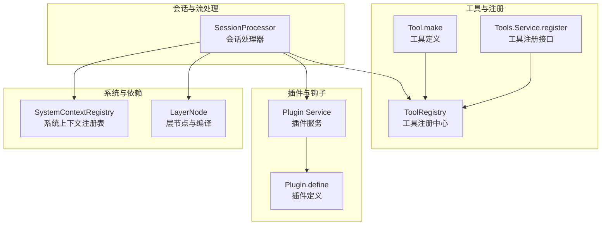
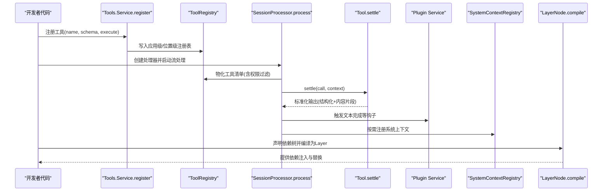
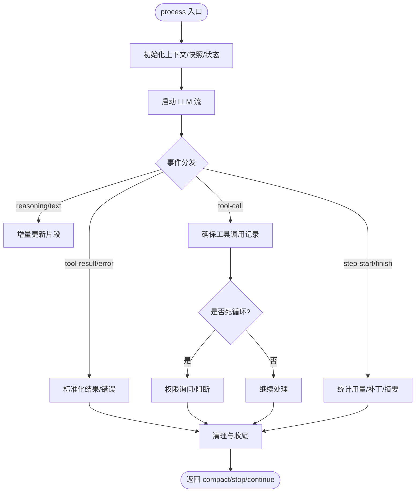
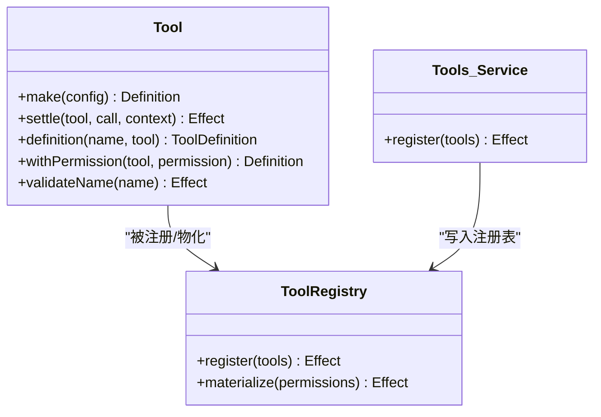
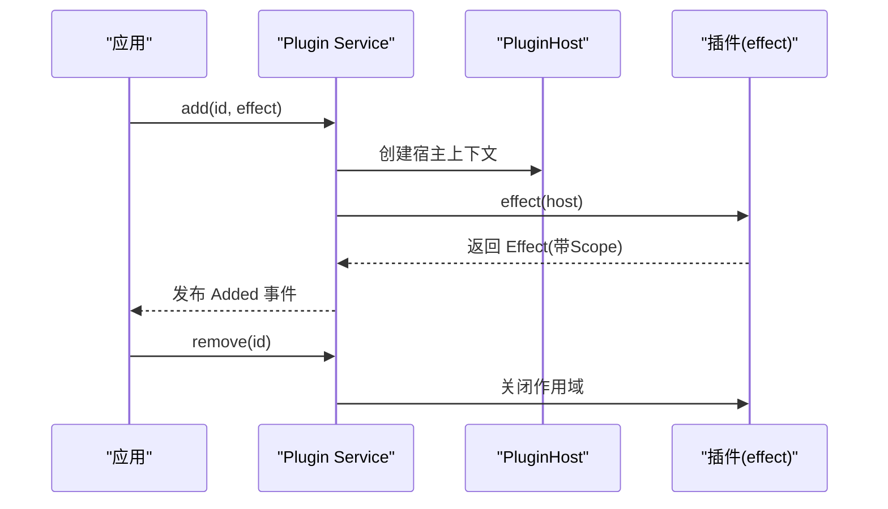
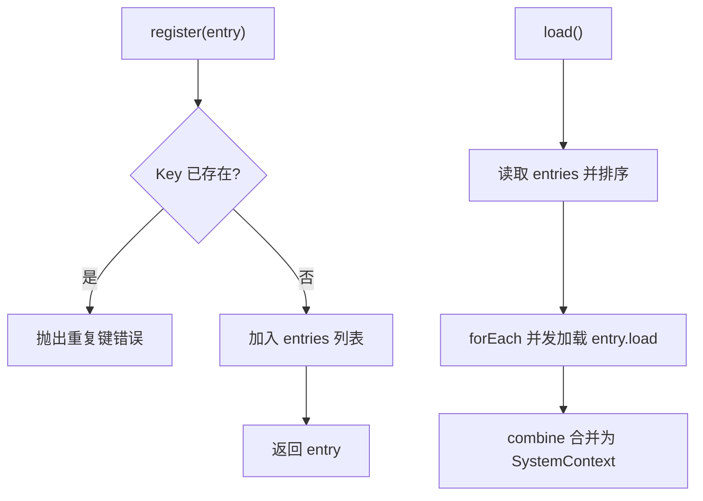
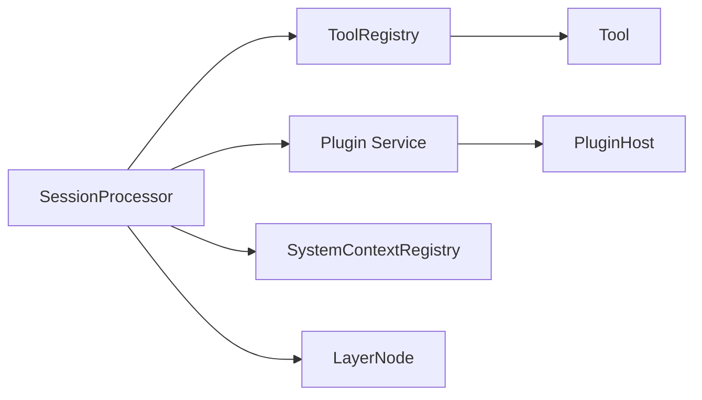

# 处理器注入点

<cite>
**本文引用的文件**   
- [packages/opencode/src/session/processor.ts](file://packages/opencode/src/session/processor.ts)
- [packages/core/src/tool/tool.ts](file://packages/core/src/tool/tool.ts)
- [packages/core/src/tool/tools.ts](file://packages/core/src/tool/tools.ts)
- [packages/core/src/tool/registry.ts](file://packages/core/src/tool/registry.ts)
- [packages/core/src/plugin.ts](file://packages/core/src/plugin.ts)
- [packages/plugin/src/v2/effect/plugin.ts](file://packages/plugin/src/v2/effect/plugin.ts)
- [packages/core/src/system-context/registry.ts](file://packages/core/src/system-context/registry.ts)
- [packages/core/src/effect/layer-node.ts](file://packages/core/src/effect/layer-node.ts)
</cite>

## 目录
1. [简介](#简介)
2. [项目结构](#项目结构)
3. [核心组件](#核心组件)
4. [架构总览](#架构总览)
5. [详细组件分析](#详细组件分析)
6. [依赖关系分析](#依赖关系分析)
7. [性能考量](#性能考量)
8. [故障排查指南](#故障排查指南)
9. [结论](#结论)
10. [附录](#附录)

## 简介
本文件面向 openNovel 的“处理器注入点系统”，系统性阐述处理器的动态注册、依赖注入与服务发现机制，并解释处理器的生命周期管理、参数绑定与返回值处理。同时提供扩展新处理器类型（工具处理器、API 处理器、事件处理器）的方法与最佳实践，帮助开发者以最小成本构建可组合、可替换、可观测的处理器能力。

## 项目结构
openNovel 将“处理器”抽象为可注册、可编排、可替换的能力单元，并通过 Effect 的 Layer/Context 体系实现依赖注入与范围隔离。关键位置如下：
- 会话处理器：负责 LLM 流式事件到会话状态与工具调用的转换与落盘
- 工具定义与注册：统一的工具 Schema、执行与输出规范化
- 插件系统：运行时加载、作用域隔离、事件钩子与资源清理
- 系统上下文注册表：按 Key 动态注册与合并系统级上下文
- 层节点与编译：声明式依赖图、替换与编译为 Effect Layer



图表来源
- [packages/opencode/src/session/processor.ts](file://packages/opencode/src/session/processor.ts)
- [packages/core/src/tool/tool.ts](file://packages/core/src/tool/tool.ts)
- [packages/core/src/tool/tools.ts](file://packages/core/src/tool/tools.ts)
- [packages/core/src/tool/registry.ts](file://packages/core/src/tool/registry.ts)
- [packages/core/src/plugin.ts](file://packages/core/src/plugin.ts)
- [packages/plugin/src/v2/effect/plugin.ts](file://packages/plugin/src/v2/effect/plugin.ts)
- [packages/core/src/system-context/registry.ts](file://packages/core/src/system-context/registry.ts)
- [packages/core/src/effect/layer-node.ts](file://packages/core/src/effect/layer-node.ts)

章节来源
- [packages/opencode/src/session/processor.ts](file://packages/opencode/src/session/processor.ts)
- [packages/core/src/effect/layer-node.ts](file://packages/core/src/effect/layer-node.ts)

## 核心组件
- 会话处理器（SessionProcessor）
  - 职责：消费 LLM 流事件，维护消息与工具调用状态，持久化文本/推理/补丁等片段，协调权限与重试、摘要与压缩策略
  - 关键点：create/process 入口；handleEvent 多分支处理；cleanup/halt 保障一致性
- 工具定义与执行（Tool.make/settle）
  - 职责：声明输入/输出 Schema，生成模型侧 ToolDefinition，统一执行与编码，支持结构化输出与内容片段
- 工具注册（Tools.Service.register / ToolRegistry）
  - 职责：应用级与位置级注册、覆盖优先级、最终物化与权限过滤
- 插件系统（Plugin Service + Plugin.define）
  - 职责：插件加载/卸载、作用域隔离、等待与失败传播、事件发布
- 系统上下文注册表（SystemContextRegistry）
  - 职责：按 Key 动态注册、去重、并发加载与合并
- 层节点与编译（LayerNode）
  - 职责：声明式依赖树、未绑定检测、替换与编译为 Effect Layer

章节来源
- [packages/opencode/src/session/processor.ts](file://packages/opencode/src/session/processor.ts)
- [packages/core/src/tool/tool.ts](file://packages/core/src/tool/tool.ts)
- [packages/core/src/tool/tools.ts](file://packages/core/src/tool/tools.ts)
- [packages/core/src/tool/registry.ts](file://packages/core/src/tool/registry.ts)
- [packages/core/src/plugin.ts](file://packages/core/src/plugin.ts)
- [packages/plugin/src/v2/effect/plugin.ts](file://packages/plugin/src/v2/effect/plugin.ts)
- [packages/core/src/system-context/registry.ts](file://packages/core/src/system-context/registry.ts)
- [packages/core/src/effect/layer-node.ts](file://packages/core/src/effect/layer-node.ts)

## 架构总览
下图展示从“处理器注册”到“运行时执行”的关键路径：工具通过 Schema 定义与注册，会话处理器在流事件中触发工具执行，插件系统提供扩展点，系统上下文与层节点提供依赖注入与替换能力。



图表来源
- [packages/core/src/tool/tools.ts](file://packages/core/src/tool/tools.ts)
- [packages/core/src/tool/registry.ts](file://packages/core/src/tool/registry.ts)
- [packages/opencode/src/session/processor.ts](file://packages/opencode/src/session/processor.ts)
- [packages/core/src/tool/tool.ts](file://packages/core/src/tool/tool.ts)
- [packages/core/src/plugin.ts](file://packages/core/src/plugin.ts)
- [packages/core/src/system-context/registry.ts](file://packages/core/src/system-context/registry.ts)
- [packages/core/src/effect/layer-node.ts](file://packages/core/src/effect/layer-node.ts)

## 详细组件分析

### 会话处理器（SessionProcessor）
- 入口与生命周期
  - create：初始化上下文、快照、状态机与工具调用跟踪
  - process：启动 LLM 流，基于 Stream.tap 分发事件，支持中断、重试、清理
  - cleanup/halt：确保文本/推理/工具片段时间戳与状态一致，处理异常与中止
- 事件处理要点
  - reasoning/text/tool 三类片段的 start/delta/end 全链路更新
  - tool-call 防死循环检测与权限询问
  - tool-result/tool-error 归一化为统一输出与错误语义
  - step-start/step-finish：统计用量、生成补丁、触发摘要与压缩判断
- 依赖注入
  - 通过 LayerNode.node 声明依赖（Session/Config/Snapshot/Agent/LLM/Permission/Plugin/Summary/Status/Image/Event/Database）
- 扩展点
  - 文本完成后触发插件钩子，允许外部改写或增强输出



图表来源
- [packages/opencode/src/session/processor.ts](file://packages/opencode/src/session/processor.ts)

章节来源
- [packages/opencode/src/session/processor.ts](file://packages/opencode/src/session/processor.ts)

### 工具处理器（Tool）
- 定义与执行
  - make：声明 description/input/output/structured，生成 ToolDefinition，封装 execute 与 toModelOutput
  - settle：解码输入、执行、编码输出、构造结构化输出与内容片段
- 权限与名称校验
  - validateName：限制工具名格式
  - withPermission：为工具附加权限标识
- 注册与物化
  - Tools.Service.register：应用级注册
  - ToolRegistry.materialize：合并应用级与位置级注册，进行权限过滤与最终物化



图表来源
- [packages/core/src/tool/tool.ts](file://packages/core/src/tool/tool.ts)
- [packages/core/src/tool/tools.ts](file://packages/core/src/tool/tools.ts)
- [packages/core/src/tool/registry.ts](file://packages/core/src/tool/registry.ts)

章节来源
- [packages/core/src/tool/tool.ts](file://packages/core/src/tool/tool.ts)
- [packages/core/src/tool/tools.ts](file://packages/core/src/tool/tools.ts)
- [packages/core/src/tool/registry.ts](file://packages/core/src/tool/registry.ts)

### 插件系统（Plugin）
- 插件定义与加载
  - define：声明 id 与 effect，effect 接收宿主上下文
  - add/remove/wait：原子化加载/卸载/等待，支持失败传播与作用域关闭
- 作用域与事件
  - 每个插件拥有独立 Scope，退出时自动清理
  - 加载成功/失败均发布事件，供上层订阅



图表来源
- [packages/core/src/plugin.ts](file://packages/core/src/plugin.ts)
- [packages/plugin/src/v2/effect/plugin.ts](file://packages/plugin/src/v2/effect/plugin.ts)

章节来源
- [packages/core/src/plugin.ts](file://packages/core/src/plugin.ts)
- [packages/plugin/src/v2/effect/plugin.ts](file://packages/plugin/src/v2/effect/plugin.ts)

### 系统上下文注册表（SystemContextRegistry）
- 动态注册与合并
  - register：按 Key 注册 Entry，禁止重复键，支持 acquireRelease 生命周期
  - load：排序后并发加载所有 Entry，合并为 SystemContext
- 用途
  - 为处理器与其他子系统提供可扩展的系统级配置/服务



图表来源
- [packages/core/src/system-context/registry.ts](file://packages/core/src/system-context/registry.ts)

章节来源
- [packages/core/src/system-context/registry.ts](file://packages/core/src/system-context/registry.ts)

### 层节点与依赖注入（LayerNode）
- 节点类型
  - layer：具体实现层
  - unbound：未绑定占位，编译前必须替换
  - group：组合多个节点
- 关键能力
  - compile：解析依赖、替换、检查未绑定、生成 Effect Layer
  - hoist：按 Tag 提升特定实现，便于测试/模拟替换
  - hasUnbound：静态检查未绑定节点

```mermaid
classDiagram
class LayerNode {
+make(input) Node
+unbound(service, tag) Node
+group(nodes) Node
+compile(root, replacements?) Layer
+hoist(root, tag, replacements?) {node, hoisted}
+hasUnbound(root, source) boolean
}
```

图表来源
- [packages/core/src/effect/layer-node.ts](file://packages/core/src/effect/layer-node.ts)

章节来源
- [packages/core/src/effect/layer-node.ts](file://packages/core/src/effect/layer-node.ts)

## 依赖关系分析
- 耦合与内聚
  - SessionProcessor 高内聚于会话状态与流事件，低耦合于工具/插件/系统上下文
  - Tool 模块严格围绕 Schema 与执行契约，避免副作用泄露
  - Plugin 通过 Scope 隔离，避免跨插件状态污染
- 直接/间接依赖
  - SessionProcessor -> ToolRegistry -> Tool
  - SessionProcessor -> Plugin Service -> PluginHost
  - 各模块通过 LayerNode 声明依赖，编译期保证完整性
- 外部集成点
  - LLM 流事件、数据库、图片处理、权限系统等通过 Service 注入



图表来源
- [packages/opencode/src/session/processor.ts](file://packages/opencode/src/session/processor.ts)
- [packages/core/src/tool/registry.ts](file://packages/core/src/tool/registry.ts)
- [packages/core/src/tool/tool.ts](file://packages/core/src/tool/tool.ts)
- [packages/core/src/plugin.ts](file://packages/core/src/plugin.ts)
- [packages/core/src/system-context/registry.ts](file://packages/core/src/system-context/registry.ts)
- [packages/core/src/effect/layer-node.ts](file://packages/core/src/effect/layer-node.ts)

章节来源
- [packages/opencode/src/session/processor.ts](file://packages/opencode/src/session/processor.ts)
- [packages/core/src/tool/registry.ts](file://packages/core/src/tool/registry.ts)
- [packages/core/src/tool/tool.ts](file://packages/core/src/tool/tool.ts)
- [packages/core/src/plugin.ts](file://packages/core/src/plugin.ts)
- [packages/core/src/system-context/registry.ts](file://packages/core/src/system-context/registry.ts)
- [packages/core/src/effect/layer-node.ts](file://packages/core/src/effect/layer-node.ts)

## 性能考量
- 流式处理与背压
  - 使用 Stream.tap 与 takeUntil 控制流式事件处理，避免阻塞
- 并发与合并
  - SystemContextRegistry.load 使用无界并发加载，注意资源上限
- 重试与回退
  - SessionProcessor 内置重试策略，结合状态机减少无效重试
- 内存与清理
  - 插件与工具调用使用 Deferred/Scope 确保及时释放
- 建议
  - 对重型工具执行进行限流与超时保护
  - 合理拆分大对象输出，避免一次性序列化

## 故障排查指南
- 常见错误定位
  - 重复系统上下文 Key：检查 SystemContextRegistry.register 调用
  - 未绑定层节点：使用 LayerNode.hasUnbound 与 compile 报错信息定位
  - 工具注册冲突：确认同名工具的覆盖顺序与位置优先级
  - 插件加载失败：查看 wait 返回的 Exit，关注作用域关闭链
- 诊断步骤
  - 启用日志：在 SessionProcessor.halt/cleanup 中打印错误堆栈
  - 断点调试：在 handleEvent 分支与 Tool.settle 处观察数据流
  - 替换实现：通过 LayerNode.hoist 或 replacements 注入 Mock

章节来源
- [packages/core/src/system-context/registry.ts](file://packages/core/src/system-context/registry.ts)
- [packages/core/src/effect/layer-node.ts](file://packages/core/src/effect/layer-node.ts)
- [packages/core/src/tool/registry.ts](file://packages/core/src/tool/registry.ts)
- [packages/core/src/plugin.ts](file://packages/core/src/plugin.ts)
- [packages/opencode/src/session/processor.ts](file://packages/opencode/src/session/processor.ts)

## 结论
openNovel 的处理器注入点系统以 Effect 为核心，结合 LayerNode 的声明式依赖、SystemContextRegistry 的动态上下文与 Plugin 的作用域隔离，构建了可扩展、可替换、可观测的处理器生态。通过统一的 Tool Schema 与注册机制，开发者可以安全地扩展工具、API 与事件处理器，并在会话处理器中无缝集成。

## 附录

### 如何扩展新的处理器类型
- 工具处理器（推荐）
  - 使用 Tool.make 定义输入/输出 Schema 与 execute
  - 通过 Tools.Service.register 注册，或在位置级覆盖
  - 在 SessionProcessor 的事件流中自动触发
- API 处理器
  - 通过 Plugin.define 暴露 HTTP/WebSocket 端点
  - 使用 HttpApiBuilder.group 声明路由与中间件
  - 通过 LayerNode 注入稳定服务层
- 事件处理器
  - 订阅 EventV2 事件，使用 Plugin Service 发布/监听
  - 在插件 effect 中建立订阅与清理逻辑

### 开发最佳实践
- 明确边界：工具只负责业务执行与输出编码，UI/IO 由上层处理
- 幂等与可恢复：工具执行应支持重试与幂等设计
- 可观测性：为关键路径添加 Span/日志，便于追踪
- 安全性：遵循权限模型，敏感操作需显式授权
- 可测试性：使用 LayerNode.hoist/replacements 注入测试替身