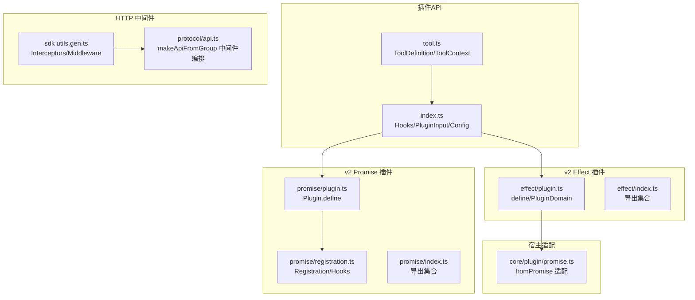
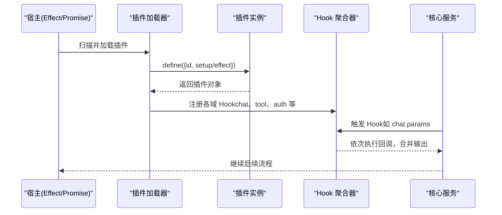
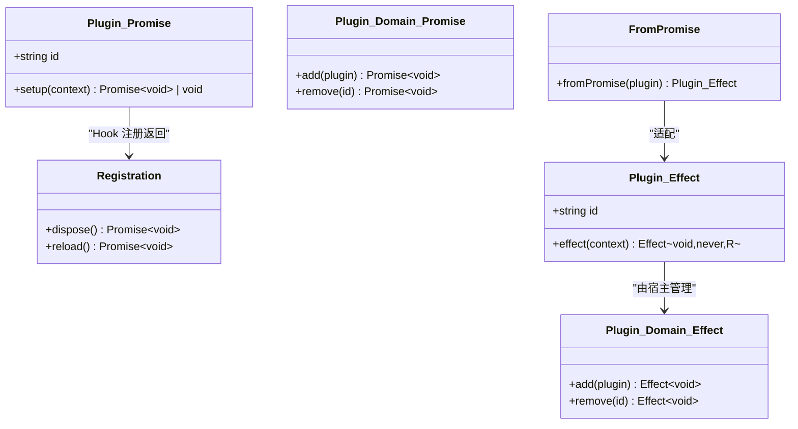
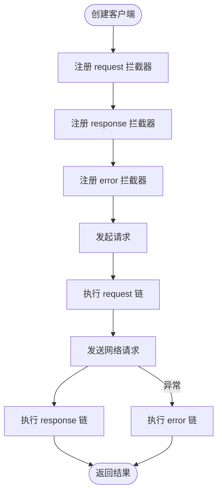
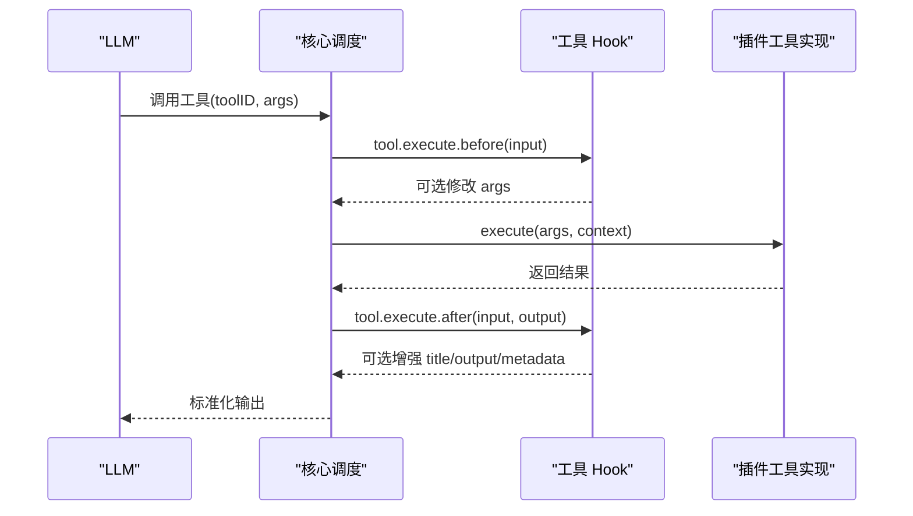
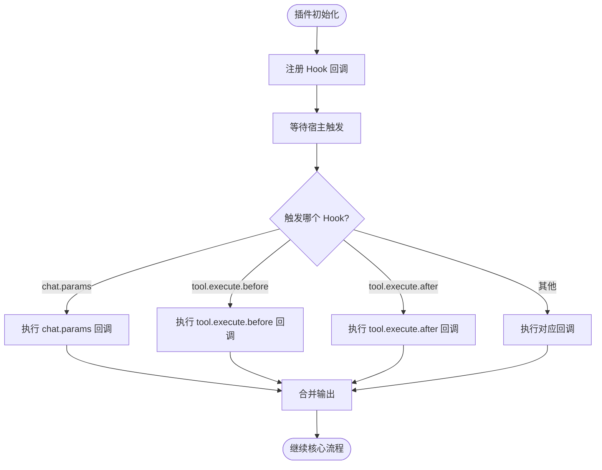
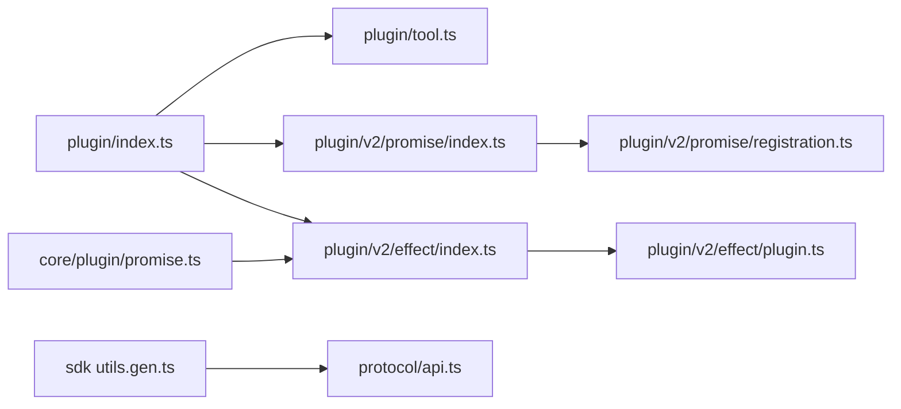

# 插件扩展点

<cite>
**本文引用的文件**   
- [packages/plugin/src/index.ts](file://packages/plugin/src/index.ts)
- [packages/plugin/src/tool.ts](file://packages/plugin/src/tool.ts)
- [packages/plugin/src/v2/promise/index.ts](file://packages/plugin/src/v2/promise/index.ts)
- [packages/plugin/src/v2/promise/plugin.ts](file://packages/plugin/src/v2/promise/plugin.ts)
- [packages/plugin/src/v2/promise/registration.ts](file://packages/plugin/src/v2/promise/registration.ts)
- [packages/plugin/src/v2/effect/index.ts](file://packages/plugin/src/v2/effect/index.ts)
- [packages/plugin/src/v2/effect/plugin.ts](file://packages/plugin/src/v2/effect/plugin.ts)
- [packages/core/src/plugin/promise.ts](file://packages/core/src/plugin/promise.ts)
- [packages/sdks/js/src/v2/gen/client/utils.gen.ts](file://packages/sdks/js/src/v2/gen/client/utils.gen.ts)
- [packages/protocol/src/api.ts](file://packages/protocol/src/api.ts)
</cite>

## 目录
1. [简介](#简介)
2. [项目结构](#项目结构)
3. [核心组件](#核心组件)
4. [架构总览](#架构总览)
5. [详细组件分析](#详细组件分析)
6. [依赖关系分析](#依赖关系分析)
7. [性能考量](#性能考量)
8. [故障排查指南](#故障排查指南)
9. [结论](#结论)
10. [附录：扩展点使用示例与最佳实践](#附录扩展点使用示例与最佳实践)

## 简介
本文件面向 openNovel 的插件扩展点系统，系统性说明中间件注册机制、处理器注入方式与事件订阅模式；阐述扩展点的发现机制、优先级管理与冲突解决策略；并给出如何通过扩展点增强现有功能（路由扩展、数据模型扩展、UI 组件扩展）的实践方法与最佳实践。文档以仓库中的插件包与相关基础设施为依据，确保内容可追溯、可落地。

## 项目结构
插件扩展点能力主要分布在以下位置：
- 插件 API 与 Hook 定义：packages/plugin/src/index.ts
- 工具定义与上下文：packages/plugin/src/tool.ts
- v2 Promise 风格插件接口与注册：packages/plugin/src/v2/promise/*
- v2 Effect 风格插件接口与定义：packages/plugin/src/v2/effect/*
- Promise 插件到 Effect 宿主适配层：packages/core/src/plugin/promise.ts
- HTTP 客户端拦截器（中间件）实现：packages/sdks/js/src/v2/gen/client/utils.gen.ts
- 协议层对中间件放置与分组的管理：packages/protocol/src/api.ts

图表来源
- [packages/plugin/src/index.ts:1-354](file://packages/plugin/src/index.ts#L1-L354)
- [packages/plugin/src/tool.ts:1-55](file://packages/plugin/src/tool.ts#L1-L55)
- [packages/plugin/src/v2/promise/plugin.ts:1-15](file://packages/plugin/src/v2/promise/plugin.ts#L1-L15)
- [packages/plugin/src/v2/promise/registration.ts:1-11](file://packages/plugin/src/v2/promise/registration.ts#L1-L11)
- [packages/plugin/src/v2/effect/plugin.ts:1-17](file://packages/plugin/src/v2/effect/plugin.ts#L1-L17)
- [packages/core/src/plugin/promise.ts:1-26](file://packages/core/src/plugin/promise.ts#L1-L26)
- [packages/sdks/js/src/v2/gen/client/utils.gen.ts:212-263](file://packages/sdks/js/src/v2/gen/client/utils.gen.ts#L212-L263)
- [packages/protocol/src/api.ts:26-54](file://packages/protocol/src/api.ts#L26-L54)

章节来源
- [packages/plugin/src/index.ts:1-354](file://packages/plugin/src/index.ts#L1-L354)
- [packages/plugin/src/tool.ts:1-55](file://packages/plugin/src/tool.ts#L1-L55)
- [packages/plugin/src/v2/promise/index.ts:1-13](file://packages/plugin/src/v2/promise/index.ts#L1-L13)
- [packages/plugin/src/v2/effect/index.ts:1-4](file://packages/plugin/src/v2/effect/index.ts#L1-L4)
- [packages/sdks/js/src/v2/gen/client/utils.gen.ts:212-263](file://packages/sdks/js/src/v2/gen/client/utils.gen.ts#L212-L263)
- [packages/protocol/src/api.ts:26-54](file://packages/protocol/src/api.ts#L26-L54)

## 核心组件
- 插件输入与配置
  - PluginInput：插件运行时上下文（client、project、directory、worktree、serverUrl、shell 等），以及实验性 workspace 注册能力。
  - Config：插件加载配置（数组形式的插件名或带选项的元组）、默认 agent、agent 权限配置等。
- Hooks（扩展点）
  - 通用生命周期：dispose、event、config。
  - 工具链扩展：tool 定义、tool.definition 修改、tool.execute.before/after、shell.env。
  - 聊天与参数：chat.message、chat.params、chat.headers、experimental.chat.*。
  - 会话与压缩：experimental.session.compacting、experimental.compaction.autocontinue。
  - 文本补全：experimental.text.complete。
  - 认证与提供者：auth、provider。
- 工具定义 ToolDefinition
  - 通过 tool() 工厂函数声明描述、参数 schema、执行逻辑与上下文（sessionID、messageID、agent、directory、worktree、abort、metadata、ask）。
- v2 插件接口
  - Promise 风格：Plugin(id, setup)、PluginDomain(add/remove)、Registration(dispose/reload)。
  - Effect 风格：Plugin(id, effect)、PluginDomain(add/remove)，由 define 包装。
- 适配器
  - fromPromise：将 Promise 插件适配为 Effect 宿主可执行的插件，保持作用域与卸载语义一致。

章节来源
- [packages/plugin/src/index.ts:56-92](file://packages/plugin/src/index.ts#L56-L92)
- [packages/plugin/src/index.ts:240-353](file://packages/plugin/src/index.ts#L240-L353)
- [packages/plugin/src/tool.ts:1-55](file://packages/plugin/src/tool.ts#L1-L55)
- [packages/plugin/src/v2/promise/plugin.ts:1-15](file://packages/plugin/src/v2/promise/plugin.ts#L1-L15)
- [packages/plugin/src/v2/effect/plugin.ts:1-17](file://packages/plugin/src/v2/effect/plugin.ts#L1-L17)
- [packages/core/src/plugin/promise.ts:1-26](file://packages/core/src/plugin/promise.ts#L1-L26)

## 架构总览
插件扩展点系统围绕“Hook 注册 + 宿主调用”的模式构建：
- 插件通过 define 暴露 id 和初始化逻辑（setup 或 effect）。
- 宿主在启动时收集插件，按领域（domain）合并 Hook 回调，形成统一的执行管线。
- HTTP 中间件在协议层集中编排，保证请求/响应/错误拦截顺序可控。
- 工具与命令通过 tool.definition 与 execute 钩子进行前后处理与输出增强。

图表来源
- [packages/plugin/src/v2/promise/plugin.ts:1-15](file://packages/plugin/src/v2/promise/plugin.ts#L1-L15)
- [packages/plugin/src/v2/effect/plugin.ts:1-17](file://packages/plugin/src/v2/effect/plugin.ts#L1-L17)
- [packages/plugin/src/index.ts:240-353](file://packages/plugin/src/index.ts#L240-L353)

## 详细组件分析

### 插件定义与生命周期（v2 Promise/Effect）
- Promise 风格
  - Plugin：包含 id 与 setup(context)。
  - PluginDomain：提供 add/remove 管理插件生命周期。
  - Registration：每个 Hook 注册返回，支持 dispose/reload。
- Effect 风格
  - Plugin：包含 id 与 effect(context) 返回 Effect<void, never, R>。
  - PluginDomain：add/remove 操作。
- 适配器
  - fromPromise：把 Promise 插件包装成 Effect 插件，复用宿主的作用域与卸载机制。

图表来源
- [packages/plugin/src/v2/promise/plugin.ts:1-15](file://packages/plugin/src/v2/promise/plugin.ts#L1-L15)
- [packages/plugin/src/v2/promise/registration.ts:1-11](file://packages/plugin/src/v2/promise/registration.ts#L1-L11)
- [packages/plugin/src/v2/effect/plugin.ts:1-17](file://packages/plugin/src/v2/effect/plugin.ts#L1-L17)
- [packages/core/src/plugin/promise.ts:1-26](file://packages/core/src/plugin/promise.ts#L1-L26)

章节来源
- [packages/plugin/src/v2/promise/plugin.ts:1-15](file://packages/plugin/src/v2/promise/plugin.ts#L1-L15)
- [packages/plugin/src/v2/promise/registration.ts:1-11](file://packages/plugin/src/v2/promise/registration.ts#L1-L11)
- [packages/plugin/src/v2/effect/plugin.ts:1-17](file://packages/plugin/src/v2/effect/plugin.ts#L1-L17)
- [packages/core/src/plugin/promise.ts:1-26](file://packages/core/src/plugin/promise.ts#L1-L26)

### 中间件注册机制（HTTP 客户端与服务端）
- 客户端拦截器
  - Interceptors：维护 request/response/error 三类拦截器队列，支持 use/eject/update/exists。
  - Middleware：组合三类拦截器，供 SDK 客户端统一注入。
- 服务端中间件编排
  - makeApiFromGroup：按组添加路由并挂载中间件，协议层负责中间件放置顺序，宿主注入具体服务标识。

图表来源
- [packages/sdks/js/src/v2/gen/client/utils.gen.ts:212-263](file://packages/sdks/js/src/v2/gen/client/utils.gen.ts#L212-L263)
- [packages/protocol/src/api.ts:26-54](file://packages/protocol/src/api.ts#L26-L54)

章节来源
- [packages/sdks/js/src/v2/gen/client/utils.gen.ts:212-263](file://packages/sdks/js/src/v2/gen/client/utils.gen.ts#L212-L263)
- [packages/protocol/src/api.ts:26-54](file://packages/protocol/src/api.ts#L26-L54)

### 处理器注入方式（工具与命令）
- 工具定义
  - 通过 tool() 声明 description、args(schema)、execute(args, context)。
  - ToolContext 提供 sessionID、messageID、agent、directory、worktree、abort、metadata、ask 等运行期能力。
- 处理器注入
  - 插件通过 Hooks.tool 暴露工具字典，宿主将其注入到 LLM 工具调用链路。
  - 可通过 tool.definition 钩子动态修改发送给 LLM 的描述与参数。
  - 通过 tool.execute.before/after 对入参与出参进行增强或审计。

图表来源
- [packages/plugin/src/tool.ts:1-55](file://packages/plugin/src/tool.ts#L1-L55)
- [packages/plugin/src/index.ts:284-299](file://packages/plugin/src/index.ts#L284-L299)
- [packages/plugin/src/index.ts:352](file://packages/plugin/src/index.ts#L352)

章节来源
- [packages/plugin/src/tool.ts:1-55](file://packages/plugin/src/tool.ts#L1-L55)
- [packages/plugin/src/index.ts:284-299](file://packages/plugin/src/index.ts#L284-L299)
- [packages/plugin/src/index.ts:352](file://packages/plugin/src/index.ts#L352)

### 事件订阅模式（Hooks 与异步回调）
- 事件类型
  - 通用：event、config、dispose。
  - 聊天：chat.message、chat.params、chat.headers、experimental.chat.messages.transform、experimental.chat.system.transform。
  - 会话：experimental.session.compacting、experimental.compaction.autocontinue。
  - 文本：experimental.text.complete。
  - 工具：tool.definition、tool.execute.before/after、shell.env。
  - 认证与提供者：auth、provider。
- 订阅方式
  - 插件在 setup/effect 中通过 Hooks[Name](callback) 注册回调，返回 Registration。
  - 宿主在对应阶段触发事件，依次调用所有已注册回调，合并输出。

图表来源
- [packages/plugin/src/index.ts:240-353](file://packages/plugin/src/index.ts#L240-L353)
- [packages/plugin/src/v2/promise/registration.ts:1-11](file://packages/plugin/src/v2/promise/registration.ts#L1-L11)

章节来源
- [packages/plugin/src/index.ts:240-353](file://packages/plugin/src/index.ts#L240-L353)
- [packages/plugin/src/v2/promise/registration.ts:1-11](file://packages/plugin/src/v2/promise/registration.ts#L1-L11)

### 扩展点发现机制、优先级与冲突解决
- 发现机制
  - 插件通过 define 暴露 id，宿主在启动时收集插件并按域聚合 Hook。
  - 协议层通过 makeApiFromGroup 集中编排中间件，保证顺序稳定。
- 优先级管理
  - 当前仓库未显式暴露 Hook 优先级字段；建议通过拆分多个插件并按加载顺序控制行为。
  - 对于 HTTP 中间件，顺序由协议层固定编排，避免运行时歧义。
- 冲突解决
  - 系统上下文注册存在键重复检测与报错（Duplicate key），可作为参考：同键仅允许一次注册。
  - 对于同名 Hook 回调，宿主通常按注册顺序串联执行，后一个可覆盖前一个的输出（需遵循契约）。

章节来源
- [packages/plugin/src/v2/promise/plugin.ts:1-15](file://packages/plugin/src/v2/promise/plugin.ts#L1-L15)
- [packages/protocol/src/api.ts:26-54](file://packages/protocol/src/api.ts#L26-L54)
- [packages/core/src/system-context/registry.ts:19-49](file://packages/core/src/system-context/registry.ts#L19-L49)

### 通过扩展点增强现有功能
- 路由扩展
  - 通过协议层的 makeApiFromGroup 在指定组上挂载中间件，实现鉴权、日志、限流等横切关注点。
- 数据模型扩展
  - 使用 chat.params/chat.headers 调整发送给 LLM 的参数与头部；使用 experimental.chat.* 转换消息格式。
  - 使用 tool.definition 动态修正工具描述与参数，使 LLM 更准确理解能力边界。
- UI 组件扩展
  - 借助 tui 导出项（@opencode-ai/plugin/tui）与 peerDependencies 提供的 @opentui/* 能力，在终端 UI 层渲染自定义视图与交互。
  - 结合 shell.env 注入环境变量，影响工具与环境行为。

章节来源
- [packages/protocol/src/api.ts:26-54](file://packages/protocol/src/api.ts#L26-L54)
- [packages/plugin/src/index.ts:265-315](file://packages/plugin/src/index.ts#L265-L315)
- [packages/plugin/src/index.ts:345-353](file://packages/plugin/src/index.ts#L345-L353)
- [packages/plugin/package.json:1-61](file://packages/plugin/package.json#L1-L61)

## 依赖关系分析
- 插件包对外暴露：
  - 根导出：index.ts（Hooks、PluginInput、Config 等）。
  - 工具：tool.ts（ToolDefinition、ToolContext）。
  - v2 Promise：promise/index.ts（导出 define、Plugin、PluginDomain、Registration 等）。
  - v2 Effect：effect/index.ts（导出 define、Plugin、PluginDomain）。
- 宿主适配：
  - core/plugin/promise.ts 将 Promise 插件转换为 Effect 插件，复用宿主作用域与卸载机制。
- HTTP 中间件：
  - sdk utils.gen.ts 提供 Interceptors/Middleware 实现。
  - protocol/api.ts 负责中间件编排与路由分组。

图表来源
- [packages/plugin/src/index.ts:1-354](file://packages/plugin/src/index.ts#L1-L354)
- [packages/plugin/src/tool.ts:1-55](file://packages/plugin/src/tool.ts#L1-L55)
- [packages/plugin/src/v2/promise/index.ts:1-13](file://packages/plugin/src/v2/promise/index.ts#L1-L13)
- [packages/plugin/src/v2/promise/registration.ts:1-11](file://packages/plugin/src/v2/promise/registration.ts#L1-L11)
- [packages/plugin/src/v2/effect/index.ts:1-4](file://packages/plugin/src/v2/effect/index.ts#L1-L4)
- [packages/plugin/src/v2/effect/plugin.ts:1-17](file://packages/plugin/src/v2/effect/plugin.ts#L1-L17)
- [packages/core/src/plugin/promise.ts:1-26](file://packages/core/src/plugin/promise.ts#L1-L26)
- [packages/sdks/js/src/v2/gen/client/utils.gen.ts:212-263](file://packages/sdks/js/src/v2/gen/client/utils.gen.ts#L212-L263)
- [packages/protocol/src/api.ts:26-54](file://packages/protocol/src/api.ts#L26-L54)

章节来源
- [packages/plugin/src/index.ts:1-354](file://packages/plugin/src/index.ts#L1-L354)
- [packages/plugin/src/tool.ts:1-55](file://packages/plugin/src/tool.ts#L1-L55)
- [packages/plugin/src/v2/promise/index.ts:1-13](file://packages/plugin/src/v2/promise/index.ts#L1-L13)
- [packages/plugin/src/v2/effect/index.ts:1-4](file://packages/plugin/src/v2/effect/index.ts#L1-L4)
- [packages/core/src/plugin/promise.ts:1-26](file://packages/core/src/plugin/promise.ts#L1-L26)
- [packages/sdks/js/src/v2/gen/client/utils.gen.ts:212-263](file://packages/sdks/js/src/v2/gen/client/utils.gen.ts#L212-L263)
- [packages/protocol/src/api.ts:26-54](file://packages/protocol/src/api.ts#L26-L54)

## 性能考量
- Hook 执行顺序与开销
  - 每个 Hook 回调都会串行执行，应避免在高频路径（如 chat.params、tool.execute.*）中进行昂贵计算或阻塞 IO。
- 中间件链长度
  - 客户端拦截器与服务端中间件均会逐层执行，建议按需注册，减少不必要的链长。
- 并发与批处理
  - 宿主在加载阶段可能批量合并 Hook 变更，避免频繁 reload；插件应尽量减少热更新时的副作用。
- 资源释放
  - 使用 Registration.dispose 及时释放定时器、监听器等，防止内存泄漏。

## 故障排查指南
- 常见错误定位
  - 重复键注册：检查系统上下文注册是否出现重复 key，导致崩溃。
  - Hook 未触发：确认插件是否正确 define 并在 setup/effect 中完成注册。
  - 工具参数校验失败：检查 tool.args schema 是否与传入参数匹配。
- 调试建议
  - 在 tool.execute.before/after 中添加 metadata 记录关键路径信息。
  - 在 chat.params/chat.headers 中打印或采样必要上下文，避免全量日志。
  - 使用 shell.env 注入调试环境变量，区分不同环境行为。

章节来源
- [packages/core/src/system-context/registry.ts:19-49](file://packages/core/src/system-context/registry.ts#L19-L49)
- [packages/plugin/src/index.ts:284-299](file://packages/plugin/src/index.ts#L284-L299)
- [packages/plugin/src/tool.ts:1-55](file://packages/plugin/src/tool.ts#L1-L55)

## 结论
openNovel 插件扩展点系统以清晰的 Hook 体系与稳定的中间件编排为核心，支持 Promise 与 Effect 两种插件风格，并通过适配器无缝集成。通过工具、聊天参数、会话压缩、文本补全等扩展点，可在不侵入核心代码的前提下灵活增强系统能力。建议在开发中遵循最小改动原则、明确契约、合理组织 Hook，以获得更好的可维护性与性能表现。

## 附录：扩展点使用示例与最佳实践
- 示例一：增强工具描述与参数
  - 使用 tool.definition 钩子根据上下文动态调整 description 与 parameters，提高 LLM 调用准确率。
  - 在 tool.execute.before/after 中记录调用轨迹与结果摘要。
- 示例二：调整 LLM 请求参数与头部
  - 在 chat.params 中设置 temperature/topP/topK/maxOutputTokens/options。
  - 在 chat.headers 中注入鉴权头或追踪头。
- 示例三：会话压缩提示定制
  - 在 experimental.session.compacting 中追加业务上下文或替换默认 prompt。
- 示例四：文本补全增强
  - 在 experimental.text.complete 中对部分生成内容进行后处理或规范化。
- 最佳实践
  - 单一职责：每个插件聚焦一个领域，避免跨域耦合。
  - 幂等与容错：Hook 回调应具备幂等性，捕获异常不影响主流程。
  - 可观测性：合理使用 metadata、日志与指标，便于问题定位。
  - 版本兼容：谨慎对待 experimental 钩子，做好向后兼容与弃用迁移。