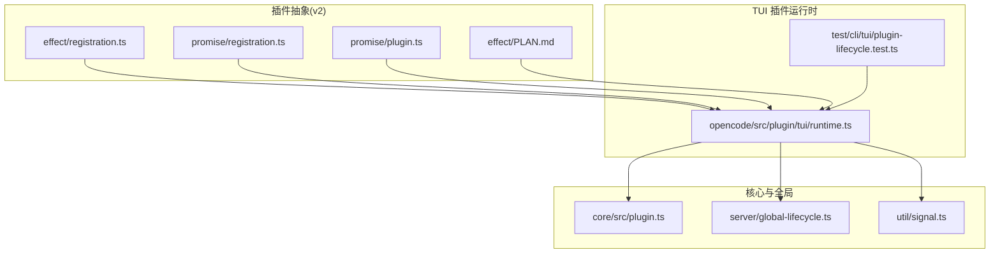
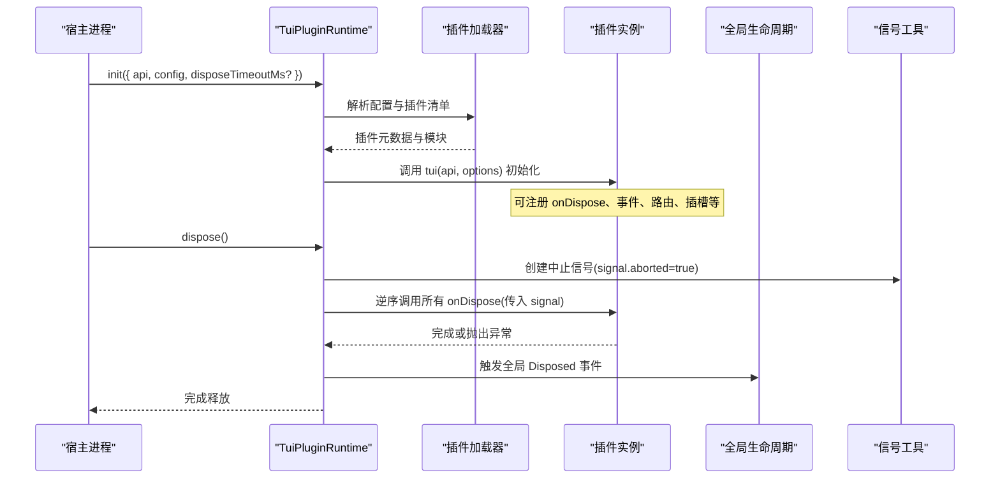
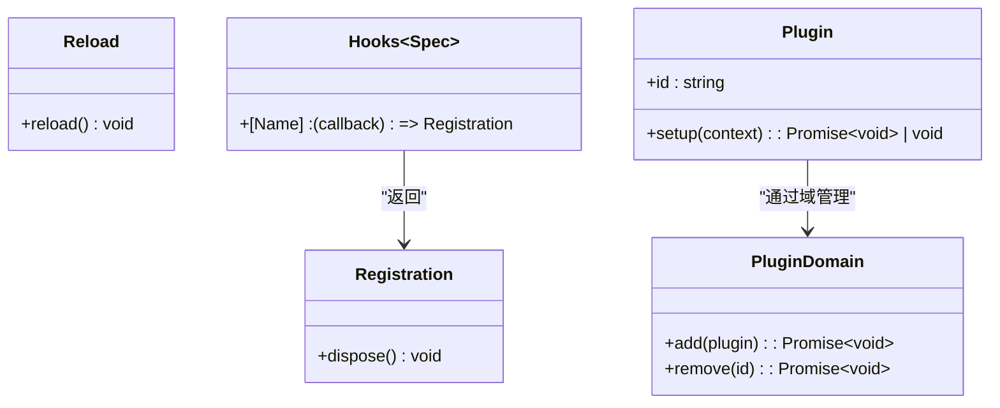
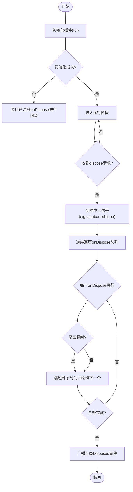
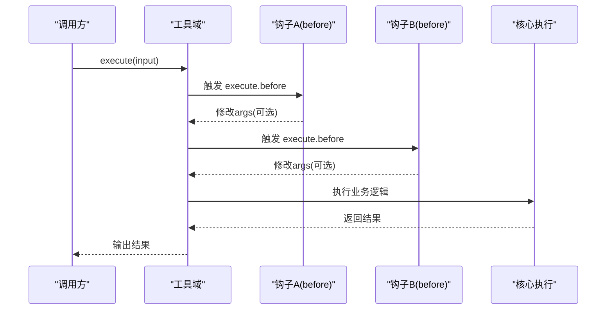
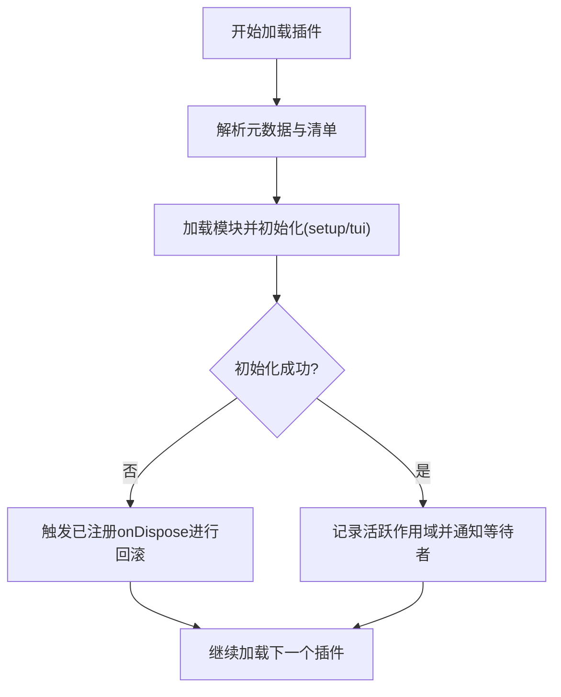
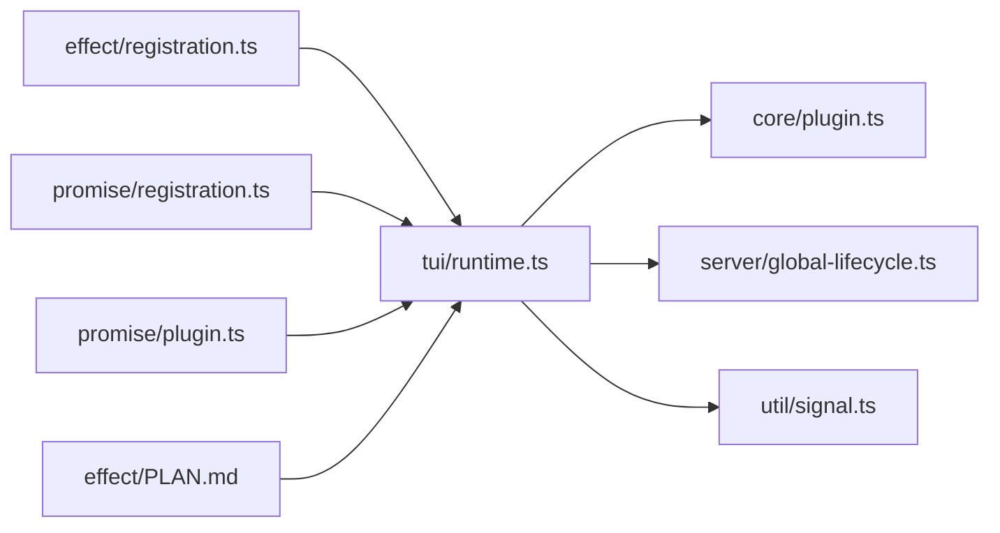

# 生命周期钩子

<cite>
**本文引用的文件**   
- [packages/plugin/src/v2/effect/registration.ts](file://packages/plugin/src/v2/effect/registration.ts)
- [packages/plugin/src/v2/promise/registration.ts](file://packages/plugin/src/v2/promise/registration.ts)
- [packages/plugin/src/v2/promise/plugin.ts](file://packages/plugin/src/v2/promise/plugin.ts)
- [packages/plugin/src/v2/effect/PLAN.md](file://packages/plugin/src/v2/effect/PLAN.md)
- [packages/opencode/src/plugin/tui/runtime.ts](file://packages/opencode/src/plugin/tui/runtime.ts)
- [packages/opencode/test/cli/tui/plugin-lifecycle.test.ts](file://packages/opencode/test/cli/tui/plugin-lifecycle.test.ts)
- [packages/core/src/plugin.ts](file://packages/core/src/plugin.ts)
- [packages/opencode/src/server/global-lifecycle.ts](file://packages/opencode/src/server/global-lifecycle.ts)
- [packages/opencode/src/util/signal.ts](file://packages/opencode/src/util/signal.ts)
</cite>

## 目录
1. [简介](#简介)
2. [项目结构](#项目结构)
3. [核心组件](#核心组件)
4. [架构总览](#架构总览)
5. [详细组件分析](#详细组件分析)
6. [依赖关系分析](#依赖关系分析)
7. [性能考量](#性能考量)
8. [故障排查指南](#故障排查指南)
9. [结论](#结论)
10. [附录](#附录)

## 简介
本文件为 openNovel 插件系统的“生命周期钩子”提供系统化文档，覆盖初始化、启动、运行与关闭四个阶段，解释如何在各阶段插入自定义逻辑（前置/后置钩子），并说明执行顺序、优先级管理与条件触发机制。同时给出实际使用场景与代码示例路径，帮助开发者在 TUI 插件与 Effect/Promise 两种运行时中安全、可控地扩展系统行为。

## 项目结构
围绕生命周期钩子的关键实现分布在以下模块：
- v2 插件抽象层：定义 Registration/Hooks 类型，统一 Promise 与 Effect 两种运行时下的注册与释放语义
- TUI 插件运行时：负责插件加载、启用/停用、插槽与主题管理、以及 onDispose 的有序清理与超时保护
- 全局生命周期：服务级资源回收与事件广播
- 测试用例：验证 onDispose 信号、幂等性、失败回滚、超时等关键行为

图表来源 
- [packages/plugin/src/v2/effect/registration.ts:1-16](file://packages/plugin/src/v2/effect/registration.ts#L1-L16)
- [packages/plugin/src/v2/promise/registration.ts:1-12](file://packages/plugin/src/v2/promise/registration.ts#L1-L12)
- [packages/plugin/src/v2/promise/plugin.ts:1-15](file://packages/plugin/src/v2/promise/plugin.ts#L1-L15)
- [packages/plugin/src/v2/effect/PLAN.md:127-182](file://packages/plugin/src/v2/effect/PLAN.md#L127-L182)
- [packages/opencode/src/plugin/tui/runtime.ts:1-200](file://packages/opencode/src/plugin/tui/runtime.ts#L1-L200)
- [packages/opencode/test/cli/tui/plugin-lifecycle.test.ts:1-225](file://packages/opencode/test/cli/tui/plugin-lifecycle.test.ts#L1-L225)
- [packages/core/src/plugin.ts:58-86](file://packages/core/src/plugin.ts#L58-L86)
- [packages/opencode/src/server/global-lifecycle.ts:1-29](file://packages/opencode/src/server/global-lifecycle.ts#L1-L29)
- [packages/opencode/src/util/signal.ts:1-12](file://packages/opencode/src/util/signal.ts#L1-L12)

章节来源
- [packages/plugin/src/v2/effect/registration.ts:1-16](file://packages/plugin/src/v2/effect/registration.ts#L1-L16)
- [packages/plugin/src/v2/promise/registration.ts:1-12](file://packages/plugin/src/v2/promise/registration.ts#L1-L12)
- [packages/plugin/src/v2/promise/plugin.ts:1-15](file://packages/plugin/src/v2/promise/plugin.ts#L1-L15)
- [packages/plugin/src/v2/effect/PLAN.md:127-182](file://packages/plugin/src/v2/effect/PLAN.md#L127-L182)
- [packages/opencode/src/plugin/tui/runtime.ts:1-200](file://packages/opencode/src/plugin/tui/runtime.ts#L1-L200)
- [packages/opencode/test/cli/tui/plugin-lifecycle.test.ts:1-225](file://packages/opencode/test/cli/tui/plugin-lifecycle.test.ts#L1-L225)
- [packages/core/src/plugin.ts:58-86](file://packages/core/src/plugin.ts#L58-L86)
- [packages/opencode/src/server/global-lifecycle.ts:1-29](file://packages/opencode/src/server/global-lifecycle.ts#L1-L29)
- [packages/opencode/src/util/signal.ts:1-12](file://packages/opencode/src/util/signal.ts#L1-L12)

## 核心组件
- 注册与释放抽象
  - Registration：统一的释放句柄，Promise 与 Effect 两种运行时分别返回 Promise<void> 与 Effect.Effect<void>
  - Hooks<Spec>：按名称映射到回调注册函数，支持同步或异步回调
- 插件定义与域接口
  - Plugin.define：声明式插件定义入口
  - PluginDomain：插件域的 add/remove 能力
- TUI 插件运行时
  - 插件加载、启用/停用、插槽与主题管理
  - onDispose 回调队列、逆序执行、超时保护与幂等性
- 全局生命周期
  - 服务级 disposeAll 与全局事件广播
- 信号工具
  - 简单的 Promise 信号用于协调等待与触发

章节来源
- [packages/plugin/src/v2/effect/registration.ts:1-16](file://packages/plugin/src/v2/effect/registration.ts#L1-L16)
- [packages/plugin/src/v2/promise/registration.ts:1-12](file://packages/plugin/src/v2/promise/registration.ts#L1-L12)
- [packages/plugin/src/v2/promise/plugin.ts:1-15](file://packages/plugin/src/v2/promise/plugin.ts#L1-L15)
- [packages/opencode/src/plugin/tui/runtime.ts:1025-1049](file://packages/opencode/src/plugin/tui/runtime.ts#L1025-L1049)
- [packages/opencode/src/server/global-lifecycle.ts:1-29](file://packages/opencode/src/server/global-lifecycle.ts#L1-L29)
- [packages/opencode/src/util/signal.ts:1-12](file://packages/opencode/src/util/signal.ts#L1-L12)

## 架构总览
下图展示了 TUI 插件从初始化到关闭的生命周期流程，包括 onDispose 的调用时机、信号传递与超时保护。

图表来源 
- [packages/opencode/src/plugin/tui/runtime.ts:1025-1049](file://packages/opencode/src/plugin/tui/runtime.ts#L1025-L1049)
- [packages/opencode/test/cli/tui/plugin-lifecycle.test.ts:11-60](file://packages/opencode/test/cli/tui/plugin-lifecycle.test.ts#L11-L60)
- [packages/opencode/src/server/global-lifecycle.ts:1-29](file://packages/opencode/src/server/global-lifecycle.ts#L1-L29)
- [packages/opencode/src/util/signal.ts:1-12](file://packages/opencode/src/util/signal.ts#L1-L12)

## 详细组件分析

### 组件一：v2 插件抽象（Registration/Hooks）
- 设计要点
  - 统一 Registration 释放语义，适配 Promise 与 Effect 两种运行时
  - Hooks<Spec> 将钩子名映射到注册函数，返回 Registration，便于独立释放
- 复杂度与性能
  - 注册与释放均为 O(1) 操作；批量释放按逆序遍历，O(n)
- 错误处理
  - 释放过程允许单个回调失败不影响其他回调继续执行
- 优化建议
  - 避免在 onDispose 中进行阻塞 I/O；必要时设置超时

图表来源 
- [packages/plugin/src/v2/effect/registration.ts:1-16](file://packages/plugin/src/v2/effect/registration.ts#L1-L16)
- [packages/plugin/src/v2/promise/registration.ts:1-12](file://packages/plugin/src/v2/promise/registration.ts#L1-L12)
- [packages/plugin/src/v2/promise/plugin.ts:1-15](file://packages/plugin/src/v2/promise/plugin.ts#L1-L15)

章节来源
- [packages/plugin/src/v2/effect/registration.ts:1-16](file://packages/plugin/src/v2/effect/registration.ts#L1-L16)
- [packages/plugin/src/v2/promise/registration.ts:1-12](file://packages/plugin/src/v2/promise/registration.ts#L1-L12)
- [packages/plugin/src/v2/promise/plugin.ts:1-15](file://packages/plugin/src/v2/promise/plugin.ts#L1-L15)

### 组件二：TUI 插件运行时（生命周期与 onDispose）
- 生命周期阶段
  - 初始化：解析配置、加载插件模块、调用 tui(api, options)
  - 启动：注册事件、路由、插槽、主题等
  - 运行：插件正常工作，响应事件与请求
  - 关闭：逆序调用 onDispose，注入中止信号，超时保护，幂等释放
- 执行顺序与优先级
  - onDispose 按注册逆序执行，确保后注册的先释放
  - 同一插件内多个 onDispose 均会执行，且共享同一个中止信号
- 条件触发
  - 通过 signal.aborted 判断是否处于强制中止场景
- 失败回滚
  - 插件初始化失败时，已注册的 onDispose 仍会被调用以清理状态

图表来源 
- [packages/opencode/src/plugin/tui/runtime.ts:1025-1049](file://packages/opencode/src/plugin/tui/runtime.ts#L1025-L1049)
- [packages/opencode/test/cli/tui/plugin-lifecycle.test.ts:182-224](file://packages/opencode/test/cli/tui/plugin-lifecycle.test.ts#L182-L224)
- [packages/opencode/src/server/global-lifecycle.ts:1-29](file://packages/opencode/src/server/global-lifecycle.ts#L1-L29)
- [packages/opencode/src/util/signal.ts:1-12](file://packages/opencode/src/util/signal.ts#L1-L12)

章节来源
- [packages/opencode/src/plugin/tui/runtime.ts:1025-1049](file://packages/opencode/src/plugin/tui/runtime.ts#L1025-L1049)
- [packages/opencode/test/cli/tui/plugin-lifecycle.test.ts:11-60](file://packages/opencode/test/cli/tui/plugin-lifecycle.test.ts#L11-L60)
- [packages/opencode/test/cli/tui/plugin-lifecycle.test.ts:182-224](file://packages/opencode/test/cli/tui/plugin-lifecycle.test.ts#L182-L224)
- [packages/opencode/src/server/global-lifecycle.ts:1-29](file://packages/opencode/src/server/global-lifecycle.ts#L1-L29)
- [packages/opencode/src/util/signal.ts:1-12](file://packages/opencode/src/util/signal.ts#L1-L12)

### 组件三：Effect/Promise 双运行时钩子与上下文
- 运行时钩子
  - 通过 ctx.tool.hook("execute.before", ...) 注册拦截点
  - 多个注册按插件与注册顺序串行执行，后续钩子可见前序修改
  - 钩子回调无类型化错误通道，需自行捕获异常
- 上下文对象
  - 只读 SDK 数据 + 受控的变更方法，禁止暴露内部草稿或未授权对象
- 与 Transform 的区别
  - transform 用于构建期重放，hook 用于运行期边界拦截

图表来源 
- [packages/plugin/src/v2/effect/PLAN.md:127-182](file://packages/plugin/src/v2/effect/PLAN.md#L127-L182)

章节来源
- [packages/plugin/src/v2/effect/PLAN.md:127-182](file://packages/plugin/src/v2/effect/PLAN.md#L127-L182)

### 组件四：插件加载与失败回滚
- 加载流程
  - 解析插件清单与元数据，按需加载模块
  - 调用 setup 或 tui 初始化，记录活跃作用域
- 失败回滚
  - 若某插件初始化失败，已注册的 onDispose 会在回滚阶段执行，保证资源不泄漏
- 等待与通知
  - 使用 Deferred/Waiters 机制通知等待该插件加载完成的消费者

图表来源 
- [packages/core/src/plugin.ts:58-86](file://packages/core/src/plugin.ts#L58-L86)
- [packages/opencode/test/cli/tui/plugin-lifecycle.test.ts:62-117](file://packages/opencode/test/cli/tui/plugin-lifecycle.test.ts#L62-L117)

章节来源
- [packages/core/src/plugin.ts:58-86](file://packages/core/src/plugin.ts#L58-L86)
- [packages/opencode/test/cli/tui/plugin-lifecycle.test.ts:62-117](file://packages/opencode/test/cli/tui/plugin-lifecycle.test.ts#L62-L117)

## 依赖关系分析
- 耦合与内聚
  - TUI 运行时对 v2 抽象（Registration/Hooks）低耦合，通过类型约束解耦 Promise/Effect 差异
  - 全局生命周期与 TUI 运行时松耦合，通过事件总线广播
- 外部依赖
  - effect 库用于副作用编排与作用域管理
  - 文件系统与进程信号用于 CLI/TUI 交互
- 循环依赖
  - 未发现直接循环依赖；通过接口与类型隔离降低风险

图表来源 
- [packages/plugin/src/v2/effect/registration.ts:1-16](file://packages/plugin/src/v2/effect/registration.ts#L1-L16)
- [packages/plugin/src/v2/promise/registration.ts:1-12](file://packages/plugin/src/v2/promise/registration.ts#L1-L12)
- [packages/plugin/src/v2/promise/plugin.ts:1-15](file://packages/plugin/src/v2/promise/plugin.ts#L1-L15)
- [packages/plugin/src/v2/effect/PLAN.md:127-182](file://packages/plugin/src/v2/effect/PLAN.md#L127-L182)
- [packages/opencode/src/plugin/tui/runtime.ts:1025-1049](file://packages/opencode/src/plugin/tui/runtime.ts#L1025-L1049)
- [packages/core/src/plugin.ts:58-86](file://packages/core/src/plugin.ts#L58-L86)
- [packages/opencode/src/server/global-lifecycle.ts:1-29](file://packages/opencode/src/server/global-lifecycle.ts#L1-L29)
- [packages/opencode/src/util/signal.ts:1-12](file://packages/opencode/src/util/signal.ts#L1-L12)

章节来源
- [packages/plugin/src/v2/effect/registration.ts:1-16](file://packages/plugin/src/v2/effect/registration.ts#L1-L16)
- [packages/plugin/src/v2/promise/registration.ts:1-12](file://packages/plugin/src/v2/promise/registration.ts#L1-L12)
- [packages/plugin/src/v2/promise/plugin.ts:1-15](file://packages/plugin/src/v2/promise/plugin.ts#L1-L15)
- [packages/plugin/src/v2/effect/PLAN.md:127-182](file://packages/plugin/src/v2/effect/PLAN.md#L127-L182)
- [packages/opencode/src/plugin/tui/runtime.ts:1025-1049](file://packages/opencode/src/plugin/tui/runtime.ts#L1025-L1049)
- [packages/core/src/plugin.ts:58-86](file://packages/core/src/plugin.ts#L58-L86)
- [packages/opencode/src/server/global-lifecycle.ts:1-29](file://packages/opencode/src/server/global-lifecycle.ts#L1-L29)
- [packages/opencode/src/util/signal.ts:1-12](file://packages/opencode/src/util/signal.ts#L1-L12)

## 性能考量
- 钩子执行顺序
  - 运行时钩子按注册顺序串行执行，避免并发竞争；适合轻量校验与参数修正
- 释放开销
  - onDispose 逆序执行，避免长耗时任务；建议设置 disposeTimeoutMs 防止卡死
- 内存与作用域
  - 使用 Effect Scope 管理资源，确保插件卸载时自动释放
- I/O 与阻塞
  - 避免在钩子中进行阻塞 I/O；必要时使用异步与超时控制

## 故障排查指南
- onDispose 未执行
  - 检查插件是否在初始化阶段抛错；失败回滚应触发已注册 onDispose
  - 确认 dispose 被正确调用，且未被重复调用导致幂等失效
- onDispose 超时
  - 调整 disposeTimeoutMs；在 onDispose 中加入超时检测与提前退出
- 钩子未按预期执行
  - 确认注册顺序与插件加载顺序；后续钩子可见前序修改
  - 检查钩子上下文是否被限制访问某些字段
- 全局事件未触发
  - 检查全局生命周期 disposeAll 是否执行；确认事件总线可用

章节来源
- [packages/opencode/test/cli/tui/plugin-lifecycle.test.ts:11-60](file://packages/opencode/test/cli/tui/plugin-lifecycle.test.ts#L11-L60)
- [packages/opencode/test/cli/tui/plugin-lifecycle.test.ts:182-224](file://packages/opencode/test/cli/tui/plugin-lifecycle.test.ts#L182-L224)
- [packages/opencode/src/server/global-lifecycle.ts:1-29](file://packages/opencode/src/server/global-lifecycle.ts#L1-L29)

## 结论
openNovel 的生命周期钩子系统通过 v2 抽象统一了 Promise/Effect 两种运行时，提供了清晰的初始化、启动、运行与关闭阶段划分。TUI 插件运行时保证了 onDispose 的逆序执行、中止信号传播与超时保护，结合全局生命周期与事件总线，实现了稳定可靠的资源管理与扩展点。开发者可在不同阶段插入前置/后置钩子，借助上下文对象进行安全的数据变更与能力调用。

## 附录
- 典型使用场景
  - 初始化阶段：读取配置、建立连接、注册事件监听
  - 启动阶段：挂载路由、注册插槽、应用主题
  - 运行阶段：业务逻辑执行、中间件拦截、日志埋点
  - 关闭阶段：释放资源、断开连接、清理临时文件
- 参考示例路径
  - TUI 插件 onDispose 用法与信号：[packages/opencode/test/cli/tui/plugin-lifecycle.test.ts:11-60](file://packages/opencode/test/cli/tui/plugin-lifecycle.test.ts#L11-L60)
  - 超时保护与幂等性：[packages/opencode/test/cli/tui/plugin-lifecycle.test.ts:182-224](file://packages/opencode/test/cli/tui/plugin-lifecycle.test.ts#L182-L224)
  - Effect/Promise 钩子上下文与顺序：[packages/plugin/src/v2/effect/PLAN.md:127-182](file://packages/plugin/src/v2/effect/PLAN.md#L127-L182)
  - 插件加载与失败回滚：[packages/core/src/plugin.ts:58-86](file://packages/core/src/plugin.ts#L58-L86)