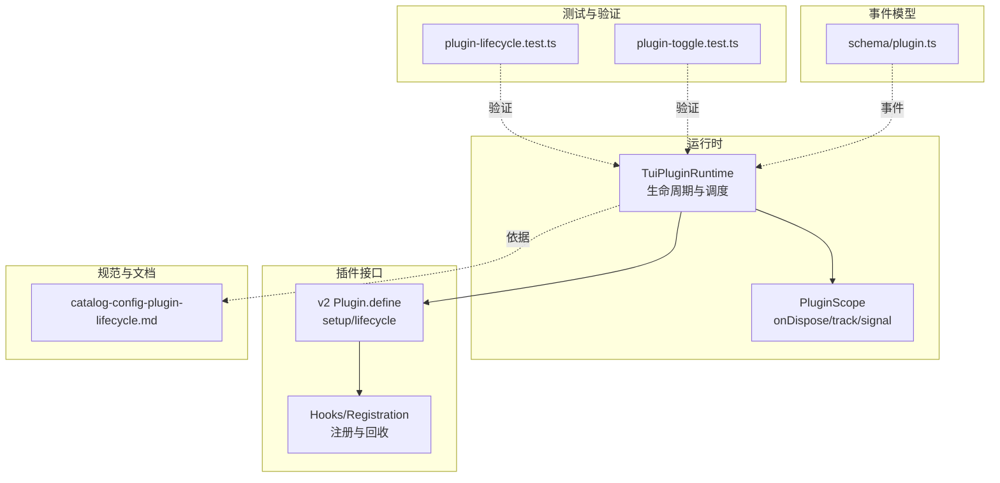
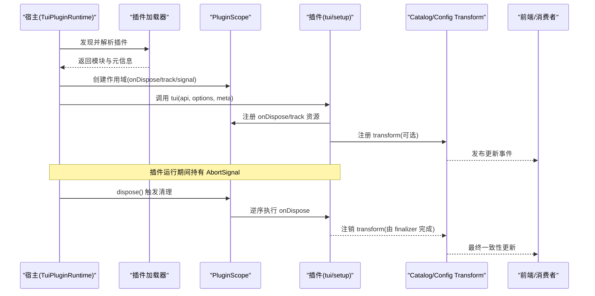
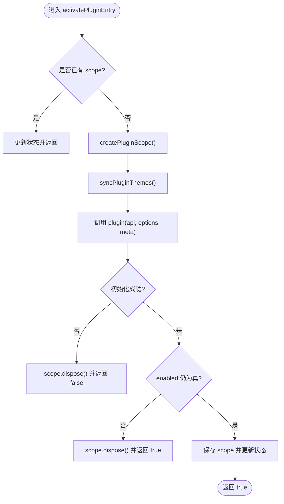
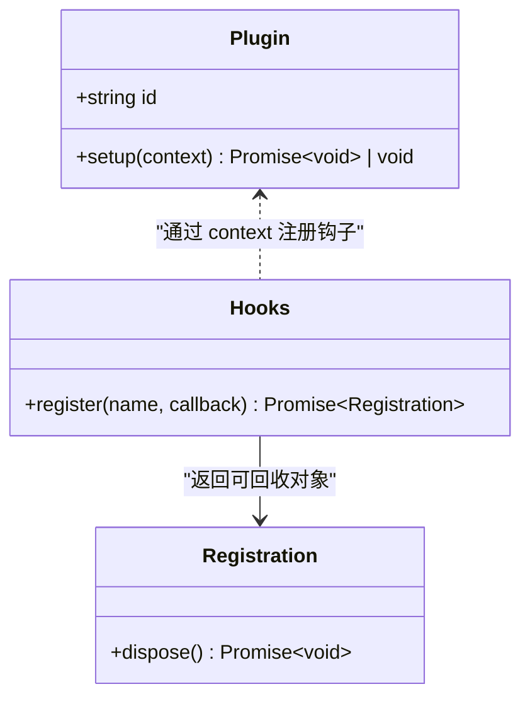
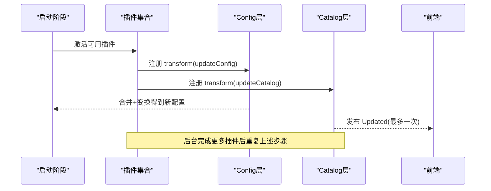
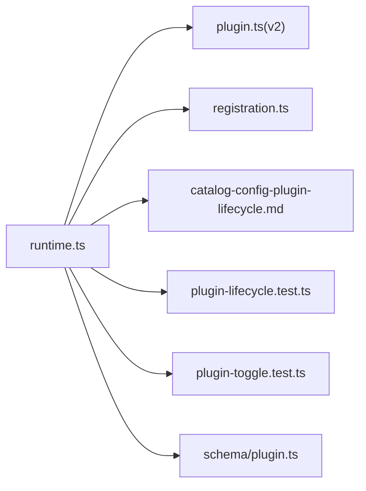

# 插件生命周期钩子

<cite>
**本文引用的文件**   
- [packages/opencode/src/plugin/tui/runtime.ts](file://packages/opencode/src/plugin/tui/runtime.ts)
- [packages/plugin/src/v2/promise/registration.ts](file://packages/plugin/src/v2/promise/registration.ts)
- [packages/plugin/src/v2/promise/plugin.ts](file://packages/plugin/src/v2/promise/plugin.ts)
- [specs/v2/catalog-config-plugin-lifecycle.md](file://specs/v2/catalog-config-plugin-lifecycle.md)
- [packages/opencode/test/cli/tui/plugin-lifecycle.test.ts](file://packages/opencode/test/cli/tui/plugin-lifecycle.test.ts)
- [packages/opencode/test/cli/tui/plugin-toggle.test.ts](file://packages/opencode/test/cli/tui/plugin-toggle.test.ts)
- [packages/schema/src/plugin.ts](file://packages/schema/src/plugin.ts)
</cite>

## 目录
1. [简介](#简介)
2. [项目结构](#项目结构)
3. [核心组件](#核心组件)
4. [架构总览](#架构总览)
5. [详细组件分析](#详细组件分析)
6. [依赖关系分析](#依赖关系分析)
7. [性能考量](#性能考量)
8. [故障排查指南](#故障排查指南)
9. [结论](#结论)
10. [附录](#附录)

## 简介
本文件面向 openNovel 的插件系统，聚焦“插件生命周期钩子”的设计与实现。内容覆盖插件的初始化、加载、执行与卸载各阶段的钩子机制，解释每个钩子的触发时机、参数传递与返回值处理，并给出错误处理与异常恢复策略。同时提供基于仓库实际代码的流程图与时序图，帮助读者理解异步操作与状态管理在生命周期中的处理方式。

## 项目结构
与插件生命周期相关的核心位置：
- TUI 插件运行时与生命周期管理：packages/opencode/src/plugin/tui/runtime.ts
- v2 插件定义与注册抽象：packages/plugin/src/v2/promise/plugin.ts、packages/plugin/src/v2/promise/registration.ts
- 插件生命周期设计说明（Catalog/Config/Plugin）：specs/v2/catalog-config-plugin-lifecycle.md
- 测试用例（超时清理、启用/禁用切换等）：packages/opencode/test/cli/tui/plugin-lifecycle.test.ts、packages/opencode/test/cli/tui/plugin-toggle.test.ts
- 插件事件类型（schema）：packages/schema/src/plugin.ts

图表来源 
- [packages/opencode/src/plugin/tui/runtime.ts](file://packages/opencode/src/plugin/tui/runtime.ts)
- [packages/plugin/src/v2/promise/plugin.ts](file://packages/plugin/src/v2/promise/plugin.ts)
- [packages/plugin/src/v2/promise/registration.ts](file://packages/plugin/src/v2/promise/registration.ts)
- [specs/v2/catalog-config-plugin-lifecycle.md](file://specs/v2/catalog-config-plugin-lifecycle.md)
- [packages/opencode/test/cli/tui/plugin-lifecycle.test.ts](file://packages/opencode/test/cli/tui/plugin-lifecycle.test.ts)
- [packages/opencode/test/cli/tui/plugin-toggle.test.ts](file://packages/opencode/test/cli/tui/plugin-toggle.test.ts)
- [packages/schema/src/plugin.ts](file://packages/schema/src/plugin.ts)

章节来源
- [packages/opencode/src/plugin/tui/runtime.ts](file://packages/opencode/src/plugin/tui/runtime.ts)
- [packages/plugin/src/v2/promise/plugin.ts](file://packages/plugin/src/v2/promise/plugin.ts)
- [packages/plugin/src/v2/promise/registration.ts](file://packages/plugin/src/v2/promise/registration.ts)
- [specs/v2/catalog-config-plugin-lifecycle.md](file://specs/v2/catalog-config-plugin-lifecycle.md)

## 核心组件
- TuiPluginRuntime：负责插件的发现、加载、激活、停用与销毁；维护插件列表、元数据、主题同步、启用状态持久化，以及对外暴露的 API 包装。
- PluginScope：为单个插件提供隔离的作用域，包含 onDispose 钩子注册、资源跟踪 track、AbortController 信号 signal，以及统一的 dispose 清理流程。
- v2 Plugin.define：定义插件对象（id、setup），并提供插件域 add/remove 能力，作为 v2 插件入口。
- Hooks/Registration：统一描述钩子注册与返回的 Registration（含 dispose），用于生命周期回调的统一管理与回收。
- Catalog/Config Transform（规范）：通过可重放变换（transform）驱动配置与目录状态的变更与重建，属于插件生命周期影响系统状态的核心机制之一。

章节来源
- [packages/opencode/src/plugin/tui/runtime.ts](file://packages/opencode/src/plugin/tui/runtime.ts)
- [packages/plugin/src/v2/promise/plugin.ts](file://packages/plugin/src/v2/promise/plugin.ts)
- [packages/plugin/src/v2/promise/registration.ts](file://packages/plugin/src/v2/promise/registration.ts)
- [specs/v2/catalog-config-plugin-lifecycle.md](file://specs/v2/catalog-config-plugin-lifecycle.md)

## 架构总览
下图展示插件从加载到运行再到卸载的关键路径，以及与配置/目录变换的关系。

图表来源 
- [packages/opencode/src/plugin/tui/runtime.ts](file://packages/opencode/src/plugin/tui/runtime.ts)
- [specs/v2/catalog-config-plugin-lifecycle.md](file://specs/v2/catalog-config-plugin-lifecycle.md)

## 详细组件分析

### TuiPluginRuntime 与 PluginScope
- 初始化与激活
  - 构建插件条目（id、spec、target、source、module、origin、theme_files）。
  - 创建 PluginScope，注入 lifecycle(signal/onDispose)、track 等方法。
  - 调用插件入口 tui(api, options, meta)，完成主题同步与插件初始化。
- 停用与销毁
  - deactivatePluginEntry：标记 enabled=false，若存在 scope 则调用 scope.dispose()。
  - activatePluginEntry：设置 enabled=true，必要时持久化启用状态。
  - dispose：集中清理所有已注册的 onDispose 回调，带超时保护与错误记录。
- 资源与副作用
  - keymap/mode/attention/route/event/slots 等 API 均通过 createScoped* 包装，确保副作用随 scope 回收。
  - 主题安装使用 Flock 锁保证并发安全，失败时降级忽略。

图表来源 
- [packages/opencode/src/plugin/tui/runtime.ts](file://packages/opencode/src/plugin/tui/runtime.ts)

章节来源
- [packages/opencode/src/plugin/tui/runtime.ts](file://packages/opencode/src/plugin/tui/runtime.ts)

### v2 Plugin.define 与 Hooks/Registration
- Plugin.define：声明插件 id 与 setup(context) 方法，作为 v2 插件的标准入口。
- Hooks<Spec>：对任意钩子集合进行类型约束，回调签名支持同步或异步返回 void，注册后返回 Registration（含 dispose）。
- Registration：统一表示一个可回收的资源或订阅，dispose 用于释放。

图表来源 
- [packages/plugin/src/v2/promise/plugin.ts](file://packages/plugin/src/v2/promise/plugin.ts)
- [packages/plugin/src/v2/promise/registration.ts](file://packages/plugin/src/v2/promise/registration.ts)

章节来源
- [packages/plugin/src/v2/promise/plugin.ts](file://packages/plugin/src/v2/promise/plugin.ts)
- [packages/plugin/src/v2/promise/registration.ts](file://packages/plugin/src/v2/promise/registration.ts)

### Catalog/Config Transform（规范视角）
- Config Transform：插件以可重放的 transform 修改 Draft<Config.Info>，任何字段变更都会触发全量服务重载（Policy/Catalog/Agent/MCP 等）。
- Catalog Transform：插件以 Catalog.Editor 修改目录草稿，内部按注册顺序重放 active transforms，应用策略后提交 diff，最多一次 Updated 事件。
- 初始加载与后台激活：不阻塞就绪，后台并发安装/更新插件，完成后批量触发 reload/rebuild。
- 插件启用/禁用：启用时注册 transform，禁用时注销 transform 并重新计算可见状态。

图表来源 
- [specs/v2/catalog-config-plugin-lifecycle.md](file://specs/v2/catalog-config-plugin-lifecycle.md)

章节来源
- [specs/v2/catalog-config-plugin-lifecycle.md](file://specs/v2/catalog-config-plugin-lifecycle.md)

### 生命周期钩子详解（初始化/加载/执行/卸载）
- 初始化（setup/tui）
  - 触发时机：插件被激活时。
  - 参数：api（宿主能力）、options（插件配置）、meta（元数据）。
  - 返回值：Promise<void>|void；异常会被捕获并记录，随后清理 scope。
- 加载（resolve/load）
  - 触发时机：外部插件解析与模块加载阶段。
  - 行为：读取 manifest、校验兼容性、定位入口、读取主题文件。
  - 错误：兼容性问题、入口缺失、模块加载失败均有明确报告路径。
- 执行（transform/业务钩子）
  - 触发时机：配置变更、认证切换、models.dev 刷新、策略变化、插件启用/禁用等。
  - 参数：Draft<Config.Info> 或 Catalog.Editor（依 transform 类型而定）。
  - 返回值：无直接返回值，但会触发后续重载或目录重建。
- 卸载（onDispose）
  - 触发时机：插件停用或运行时 dispose。
  - 参数：无；需自行释放资源。
  - 返回值：Promise<void>|void；支持超时保护，超时将记录失败并中断后续清理。

章节来源
- [packages/opencode/src/plugin/tui/runtime.ts](file://packages/opencode/src/plugin/tui/runtime.ts)
- [specs/v2/catalog-config-plugin-lifecycle.md](file://specs/v2/catalog-config-plugin-lifecycle.md)

### 错误处理与异常恢复
- 初始化失败：捕获异常并记录，调用 scope.dispose() 回滚。
- 清理超时：runCleanup 包裹 onDispose 执行，超过阈值返回 timeout，继续终止清理流程并记录。
- 主题同步失败：JSON 解析失败或写入失败时降级忽略，避免阻塞主流程。
- 插件缺失/不兼容：report.missing/report.error 分支输出诊断信息，便于定位问题。

章节来源
- [packages/opencode/src/plugin/tui/runtime.ts](file://packages/opencode/src/plugin/tui/runtime.ts)

### 异步操作与状态管理
- AbortController：lifecycle.signal 允许插件取消长时间运行的任务。
- 资源跟踪：track(fn) 自动包装副作用函数，并在 dispose 时调用其返回的 off。
- 启用状态持久化：KV 存储 plugin_enabled，重启后恢复。
- 并发控制：主题安装使用 Flock 锁避免竞态。

章节来源
- [packages/opencode/src/plugin/tui/runtime.ts](file://packages/opencode/src/plugin/tui/runtime.ts)

## 依赖关系分析
- runtime.ts 依赖：
  - @opencode-ai/core/effect/app-node-builder、@opencode-ai/tui/context/theme、@opencode-ai/tui/util/error、@opencode-ai/tui/plugin/runtime 等。
  - 内部模块：PluginLoader、PluginMeta、install、readV1Plugin、internal 插件集。
- v2 插件定义与注册：
  - plugin.ts 定义 Plugin 接口与 define。
  - registration.ts 定义 Hooks、Registration、Reload。
- 规范文档：
  - catalog-config-plugin-lifecycle.md 定义了 Config/Catalog transform 的行为与触发点。
- 测试用例：
  - plugin-lifecycle.test.ts 验证 onDispose 超时清理。
  - plugin-toggle.test.ts 验证启用/禁用切换对模式栈的影响。
- 事件模型：
  - schema/plugin.ts 定义插件相关事件（如 Added）。

图表来源 
- [packages/opencode/src/plugin/tui/runtime.ts](file://packages/opencode/src/plugin/tui/runtime.ts)
- [packages/plugin/src/v2/promise/plugin.ts](file://packages/plugin/src/v2/promise/plugin.ts)
- [packages/plugin/src/v2/promise/registration.ts](file://packages/plugin/src/v2/promise/registration.ts)
- [specs/v2/catalog-config-plugin-lifecycle.md](file://specs/v2/catalog-config-plugin-lifecycle.md)
- [packages/opencode/test/cli/tui/plugin-lifecycle.test.ts](file://packages/opencode/test/cli/tui/plugin-lifecycle.test.ts)
- [packages/opencode/test/cli/tui/plugin-toggle.test.ts](file://packages/opencode/test/cli/tui/plugin-toggle.test.ts)
- [packages/schema/src/plugin.ts](file://packages/schema/src/plugin.ts)

章节来源
- [packages/opencode/src/plugin/tui/runtime.ts](file://packages/opencode/src/plugin/tui/runtime.ts)
- [packages/plugin/src/v2/promise/plugin.ts](file://packages/plugin/src/v2/promise/plugin.ts)
- [packages/plugin/src/v2/promise/registration.ts](file://packages/plugin/src/v2/promise/registration.ts)
- [specs/v2/catalog-config-plugin-lifecycle.md](file://specs/v2/catalog-config-plugin-lifecycle.md)
- [packages/opencode/test/cli/tui/plugin-lifecycle.test.ts](file://packages/opencode/test/cli/tui/plugin-lifecycle.test.ts)
- [packages/opencode/test/cli/tui/plugin-toggle.test.ts](file://packages/opencode/test/cli/tui/plugin-toggle.test.ts)
- [packages/schema/src/plugin.ts](file://packages/schema/src/plugin.ts)

## 性能考量
- 初始加载非阻塞：后台并发安装/更新插件，完成后批量触发 reload/rebuild，减少启动等待。
- 去抖与批处理：多次插件激活可能产生多次重载，规范建议通过调度器去抖以减少重复全量重载。
- 最小化副作用：通过 track/onDispose 精确管理资源，避免泄漏导致的内存增长。
- 并发安全：主题安装加锁，避免重复写入与竞争条件。

[本节为通用指导，无需特定文件引用]

## 故障排查指南
- 插件初始化失败
  - 现象：activatePluginEntry 捕获异常，scope.dispose() 被调用。
  - 排查：检查插件入口导出、依赖版本、API 使用是否正确。
- 清理超时
  - 现象：onDispose 执行超过阈值，记录超时并中断后续清理。
  - 排查：确认 onDispose 中是否存在未完成的 Promise/IO；必要时缩短超时时间观察。
- 主题同步失败
  - 现象：JSON 解析失败或写入失败，日志警告。
  - 排查：检查 oc-themes 文件格式与权限。
- 插件缺失或不兼容
  - 现象：report.missing/report.error 输出诊断信息。
  - 排查：核对 spec/target、兼容性声明与入口路径。

章节来源
- [packages/opencode/src/plugin/tui/runtime.ts](file://packages/opencode/src/plugin/tui/runtime.ts)
- [packages/opencode/test/cli/tui/plugin-lifecycle.test.ts](file://packages/opencode/test/cli/tui/plugin-lifecycle.test.ts)

## 结论
openNovel 的插件生命周期通过 TuiPluginRuntime 与 PluginScope 提供了清晰的初始化、加载、执行与卸载流程；结合 v2 Plugin.define 与 Hooks/Registration 抽象，实现了统一的钩子注册与回收机制。配合 Catalog/Config Transform 的可重放特性，系统在配置与目录状态变更时具备一致性与可预测性。完善的错误处理、超时保护与并发控制保障了插件生态的稳定与健壮。

[本节为总结，无需特定文件引用]

## 附录
- 关键钩子与触发点速查
  - setup/tui：插件激活时调用，接收 api/options/meta。
  - transform(Config/Catalog)：配置/目录变更时触发，参数为 Draft 或 Editor。
  - onDispose：插件停用或运行时 dispose 时触发，用于释放资源。
- 参考实现路径
  - 生命周期与清理：packages/opencode/src/plugin/tui/runtime.ts
  - v2 插件定义：packages/plugin/src/v2/promise/plugin.ts
  - 钩子注册与回收：packages/plugin/src/v2/promise/registration.ts
  - 规范说明：specs/v2/catalog-config-plugin-lifecycle.md
  - 测试用例：packages/opencode/test/cli/tui/plugin-lifecycle.test.ts、packages/opencode/test/cli/tui/plugin-toggle.test.ts
  - 事件模型：packages/schema/src/plugin.ts

[本节为索引，无需特定文件引用]