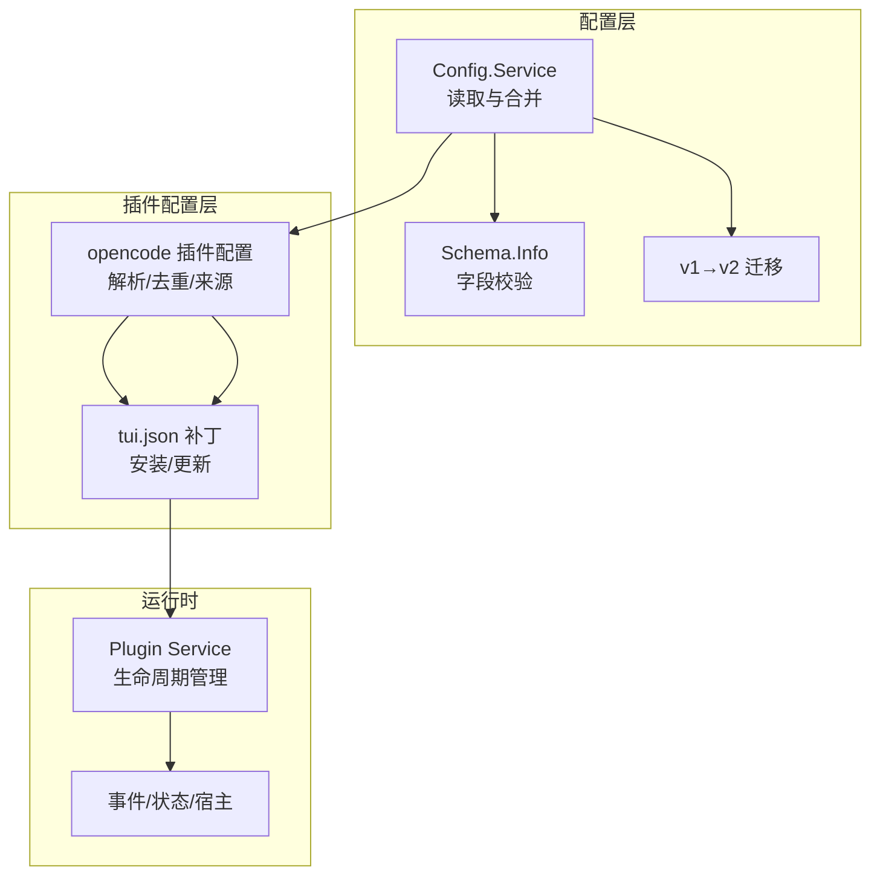
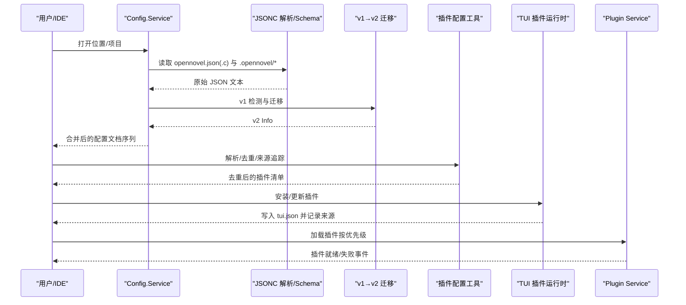
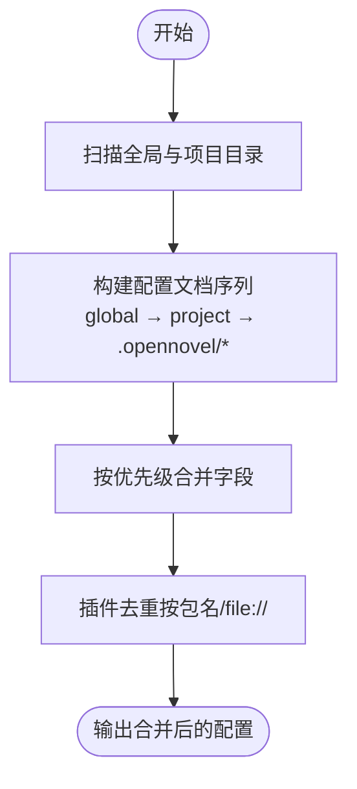
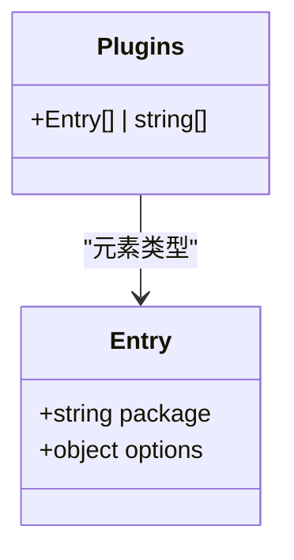
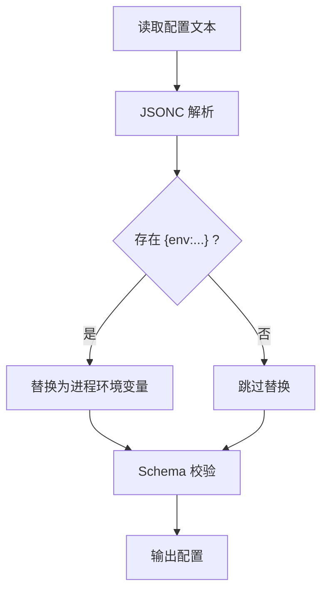
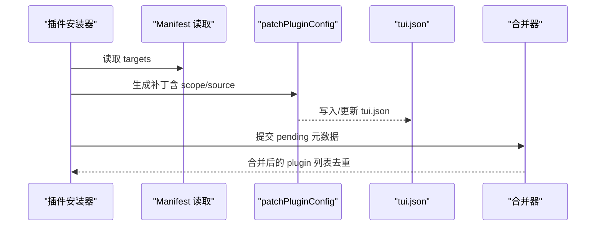
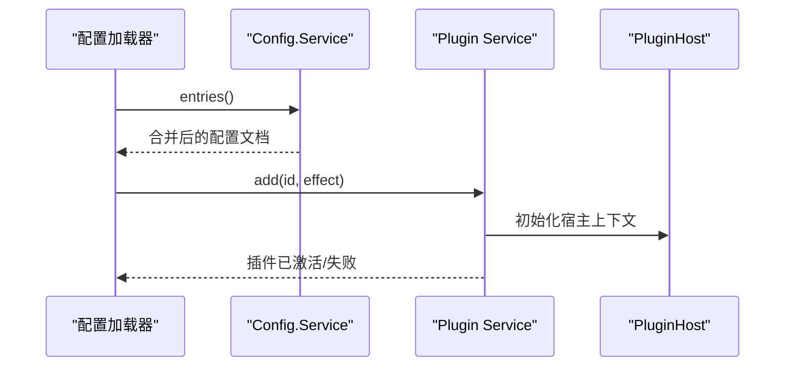
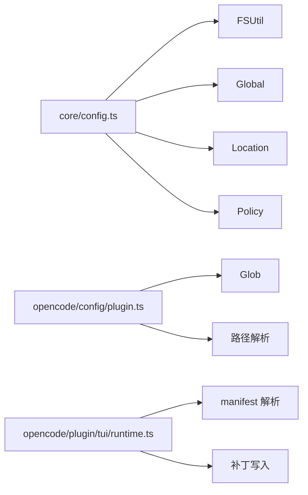

# 插件配置管理

<cite>
**本文引用的文件**   
- [packages/core/src/config.ts](file://packages/core/src/config.ts)
- [packages/core/src/config/plugin.ts](file://packages/core/src/config/plugin.ts)
- [packages/opencode/src/config/plugin.ts](file://packages/opencode/src/config/plugin.ts)
- [packages/opencode/test/config/tui.test.ts](file://packages/opencode/test/config/tui.test.ts)
- [packages/opencode/src/plugin/tui/runtime.ts](file://packages/opencode/src/plugin/tui/runtime.ts)
- [packages/core/test/config/plugin.test.ts](file://packages/core/test/config/plugin.test.ts)
- [packages/opencode/test/config/config.test.ts](file://packages/opencode/test/config/config.test.ts)
</cite>

## 目录
1. [简介](#简介)
2. [项目结构](#项目结构)
3. [核心组件](#核心组件)
4. [架构总览](#架构总览)
5. [详细组件分析](#详细组件分析)
6. [依赖关系分析](#依赖关系分析)
7. [性能考量](#性能考量)
8. [故障排查指南](#故障排查指南)
9. [结论](#结论)
10. [附录](#附录)

## 简介
本文件面向 openNovel 的插件配置管理系统，系统性说明插件配置的加载顺序、合并策略与验证规则；详细描述配置项定义方式、默认值与环境变量支持；解释热重载机制、配置文件格式规范与迁移策略；并提供常见配置场景的处理方法与示例路径。

## 项目结构
与插件配置相关的核心代码分布在以下模块：
- 配置解析与合并（core）：负责读取 opennovel.json/opennovel.jsonc 及 .opennovel/ 子目录中的配置，按优先级合并，并执行 v1→v2 迁移与 Schema 校验。
- 插件配置处理（opencode）：负责插件规格解析、去重、来源追踪（Origin）、路径插件解析等。
- TUI 插件安装与补丁（opencode）：在安装或更新插件时自动向 tui.json 写入/更新插件条目，并记录来源与作用域。
- 测试用例（tests）：覆盖环境变量替换、TUI 插件去重与来源追踪、Promise/Effect 插件加载等关键行为。

图表来源
- [packages/core/src/config.ts:135-218](file://packages/core/src/config.ts#L135-L218)
- [packages/opencode/src/config/plugin.ts:18-77](file://packages/opencode/src/config/plugin.ts#L18-L77)
- [packages/opencode/src/plugin/tui/runtime.ts:938-982](file://packages/opencode/src/plugin/tui/runtime.ts#L938-L982)

章节来源
- [packages/core/src/config.ts:135-218](file://packages/core/src/config.ts#L135-L218)
- [packages/opencode/src/config/plugin.ts:18-77](file://packages/opencode/src/config/plugin.ts#L18-L77)

## 核心组件
- Config.Service（core）：提供 entries() 返回从低优先级到高优先级的配置文档列表，内部完成文件扫描、JSONC 解析、v1 迁移与 Schema 解码。
- ConfigPlugin（core）：定义 plugins 字段的 Schema（字符串或对象形式），用于声明外部插件包及其选项。
- opencode 插件配置工具（opencode）：提供插件规格解析、路径插件目标解析、来源 Origin 追踪与去重逻辑。
- TUI 插件运行时（opencode）：在插件安装/更新后对 tui.json 进行补丁写入，并维护 pending 元数据以参与后续合并。

章节来源
- [packages/core/src/config.ts:135-218](file://packages/core/src/config.ts#L135-L218)
- [packages/core/src/config/plugin.ts:5-14](file://packages/core/src/config/plugin.ts#L5-L14)
- [packages/opencode/src/config/plugin.ts:18-77](file://packages/opencode/src/config/plugin.ts#L18-L77)
- [packages/opencode/src/plugin/tui/runtime.ts:938-982](file://packages/opencode/src/plugin/tui/runtime.ts#L938-L982)

## 架构总览
下图展示了从配置读取到插件生效的关键流程：配置服务发现并合并 opennovel.* 与 .opennovel/ 下的配置；插件配置经解析与去重后，由 TUI 插件安装器写入 tui.json；最终 Plugin Service 根据合并结果加载插件。

图表来源
- [packages/core/src/config.ts:147-211](file://packages/core/src/config.ts#L147-L211)
- [packages/opencode/src/config/plugin.ts:42-77](file://packages/opencode/src/config/plugin.ts#L42-L77)
- [packages/opencode/src/plugin/tui/runtime.ts:938-982](file://packages/opencode/src/plugin/tui/runtime.ts#L938-L982)

## 详细组件分析

### 配置加载顺序与合并策略
- 文件发现顺序：
  - 全局目录：~/.config/opencode/（或等效全局路径）下的 opennovel.json(.c)。
  - 项目自顶向下扫描：从当前目录向上查找 .opennovel/ 与 opennovel.json(.c)，越靠近当前目录优先级越高。
  - 补充目录：每个 .opennovel/ 目录内也包含同名配置文件，作为“补充”配置参与合并。
- 合并顺序（低优先级→高优先级）：
  - 先应用一般设置，再应用更具体的设置：全局 → 项目根 → .opennovel/ 子目录。
  - 同一作用域内的多个文件按“越近优先级越高”的原则叠加。
- 插件去重：
  - 基于“加载标识”去重：npm 包名或本地 file:// URL。
  - 保留完整 Origin（spec/source/scope），以便后续写入与溯源。

图表来源
- [packages/core/src/config.ts:173-211](file://packages/core/src/config.ts#L173-L211)
- [packages/opencode/src/config/plugin.ts:64-77](file://packages/opencode/src/config/plugin.ts#L64-L77)

章节来源
- [packages/core/src/config.ts:173-211](file://packages/core/src/config.ts#L173-L211)
- [packages/opencode/src/config/plugin.ts:64-77](file://packages/opencode/src/config/plugin.ts#L64-L77)

### 插件配置项定义与验证
- 配置项类型：
  - 字符串形式：直接指定包名或路径。
  - 对象形式：{ package, options? }，其中 options 为任意键值对。
- Schema 校验：
  - 使用 Effect Schema 对 Info.plugins 进行解码与校验，错误将阻止配置生效。
- 默认值：
  - 未显式设置的字段保持 undefined，由上层逻辑决定默认行为。

图表来源
- [packages/core/src/config/plugin.ts:5-14](file://packages/core/src/config/plugin.ts#L5-L14)

章节来源
- [packages/core/src/config/plugin.ts:5-14](file://packages/core/src/config/plugin.ts#L5-L14)

### 环境变量支持与占位符
- 支持形式：{env:VAR_NAME} 占位符在配置解析阶段被替换为进程环境变量值。
- 行为特性：
  - 即使自动添加 $schema，也会保留原始占位符文本不被展开。
  - 若环境变量缺失，解析会失败或保留原样（取决于实现）。

图表来源
- [packages/opencode/test/config/config.test.ts:492-529](file://packages/opencode/test/config/config.test.ts#L492-L529)

章节来源
- [packages/opencode/test/config/config.test.ts:492-529](file://packages/opencode/test/config/config.test.ts#L492-L529)

### TUI 插件安装与 tui.json 合并
- 安装流程：
  - 安装成功后读取插件 manifest，调用 patchPluginConfig 对 tui.json 进行补丁写入。
  - 若目标为 tui，则记录 pending 元数据（spec/scope/source），供后续合并使用。
- 合并与去重：
  - 全局与本地 tui.json 中的 plugin 数组会被合并。
  - 同名的插件规格以更高优先级来源为准（通常 local 覆盖 global）。

图表来源
- [packages/opencode/src/plugin/tui/runtime.ts:938-982](file://packages/opencode/src/plugin/tui/runtime.ts#L938-L982)
- [packages/opencode/test/config/tui.test.ts:765-827](file://packages/opencode/test/config/tui.test.ts#L765-L827)

章节来源
- [packages/opencode/src/plugin/tui/runtime.ts:938-982](file://packages/opencode/src/plugin/tui/runtime.ts#L938-L982)
- [packages/opencode/test/config/tui.test.ts:765-827](file://packages/opencode/test/config/tui.test.ts#L765-L827)

### 插件加载与生命周期
- 加载入口：
  - 通过 Config.Service 提供的 entries() 获取合并后的配置，提取 plugins 字段。
  - 插件可以是 Promise 或 Effect 形式，均支持 options。
- 生命周期：
  - Plugin Service 管理 add/remove/wait，确保并发安全与失败重试/等待。
  - 插件加载失败会记录 Exit，等待者能感知失败。

图表来源
- [packages/core/test/config/plugin.test.ts:116-149](file://packages/core/test/config/plugin.test.ts#L116-L149)
- [packages/core/src/plugin.ts:31-143](file://packages/core/src/plugin.ts#L31-L143)

章节来源
- [packages/core/test/config/plugin.test.ts:116-149](file://packages/core/test/config/plugin.test.ts#L116-L149)
- [packages/core/src/plugin.ts:31-143](file://packages/core/src/plugin.ts#L31-L143)

### 配置文件格式规范与迁移
- 文件格式：
  - opennovel.json / opennovel.jsonc（允许注释与尾逗号）。
  - .opennovel/ 目录下同名文件作为补充配置。
- 迁移策略：
  - 自动检测 v1 结构并迁移至 v2，再进行 Schema 解码。
  - 迁移过程不改变字段语义，仅做结构转换。

章节来源
- [packages/core/src/config.ts:147-162](file://packages/core/src/config.ts#L147-L162)

### 热重载机制
- 触发条件：
  - 文件监听器检测到配置或插件相关文件变更。
  - 重新读取 entries() 并应用新合并结果。
- 行为特征：
  - 对于已打开的文件，会触发重新加载与父级刷新。
  - 插件层面通过 Plugin Service 的 remove/add 实现热切换。

章节来源
- [packages/app/src/context/file/watcher.test.ts:1-31](file://packages/app/src/context/file/watcher.test.ts#L1-L31)
- [packages/core/src/plugin.ts:85-126](file://packages/core/src/plugin.ts#L85-L126)

## 依赖关系分析
- 模块耦合：
  - core/config.ts 依赖 FSUtil、Global、Location、Policy 等基础服务。
  - opencode/config/plugin.ts 依赖 Glob、路径解析与插件规范工具。
  - opencode/plugin/tui/runtime.ts 依赖 manifest 解析与补丁写入。
- 外部依赖：
  - jsonc-parser 用于 JSONC 解析。
  - Effect Schema 用于强类型校验。
  - 文件系统与路径工具用于跨平台兼容。

图表来源
- [packages/core/src/config.ts:135-218](file://packages/core/src/config.ts#L135-L218)
- [packages/opencode/src/config/plugin.ts:18-77](file://packages/opencode/src/config/plugin.ts#L18-L77)
- [packages/opencode/src/plugin/tui/runtime.ts:938-982](file://packages/opencode/src/plugin/tui/runtime.ts#L938-L982)

章节来源
- [packages/core/src/config.ts:135-218](file://packages/core/src/config.ts#L135-L218)
- [packages/opencode/src/config/plugin.ts:18-77](file://packages/opencode/src/config/plugin.ts#L18-L77)
- [packages/opencode/src/plugin/tui/runtime.ts:938-982](file://packages/opencode/src/plugin/tui/runtime.ts#L938-L982)

## 性能考量
- 配置读取缓存：
  - 位置打开时一次性发现并缓存配置，避免重复 IO。
- 增量合并：
  - 仅在文件变更时重新计算合并结果。
- 插件加载优化：
  - 使用 KeyedMutex 防止并发冲突。
  - 批量状态更新减少 UI 抖动。

[本节为通用指导，无需引用具体文件]

## 故障排查指南
- JSON 解析错误：
  - 检查 opennovel.json(.c) 语法，确保无非法字符或尾逗号问题。
- 环境变量未生效：
  - 确认 {env:VAR} 占位符书写正确，且进程环境中存在该变量。
- 插件未加载或加载失败：
  - 查看 Plugin Service 的失败记录与等待队列。
  - 检查 tui.json 中插件条目是否被覆盖或去重。
- 迁移失败：
  - 确认 v1 结构是否符合预期，必要时回退到 v2 手动编辑。

章节来源
- [packages/opencode/src/plugin/tui/runtime.ts:952-964](file://packages/opencode/src/plugin/tui/runtime.ts#L952-L964)
- [packages/core/test/config/plugin.test.ts:116-149](file://packages/core/test/config/plugin.test.ts#L116-L149)

## 结论
openNovel 的插件配置管理以强类型 Schema 为核心，结合严格的加载顺序与合并策略，确保配置的一致性与可追溯性。通过环境变量占位符、v1→v2 迁移与 TUI 插件补丁机制，系统在易用性与可靠性之间取得平衡。建议遵循本文档的规范进行配置编写与维护，以获得最佳体验。

## 附录
- 常见配置场景
  - 全局启用某插件，并在项目中覆盖版本或选项：在全局 tui.json 中声明插件，在项目 tui.json 中重写相同 spec。
  - 使用本地路径插件：以 file:// 或相对路径声明，系统会自动解析为绝对 URL。
  - 通过环境变量注入敏感信息：使用 {env:SECRET_VAR} 占位符，避免明文存储。
- 参考示例路径
  - 环境变量替换测试：[packages/opencode/test/config/config.test.ts:492-529](file://packages/opencode/test/config/config.test.ts#L492-L529)
  - TUI 插件去重与来源追踪：[packages/opencode/test/config/tui.test.ts:765-827](file://packages/opencode/test/config/tui.test.ts#L765-827)
  - Promise/Effect 插件加载：[packages/core/test/config/plugin.test.ts:116-149](file://packages/core/test/config/plugin.test.ts#L116-149)