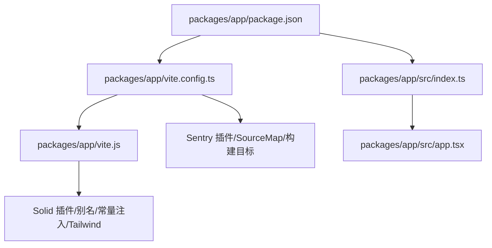
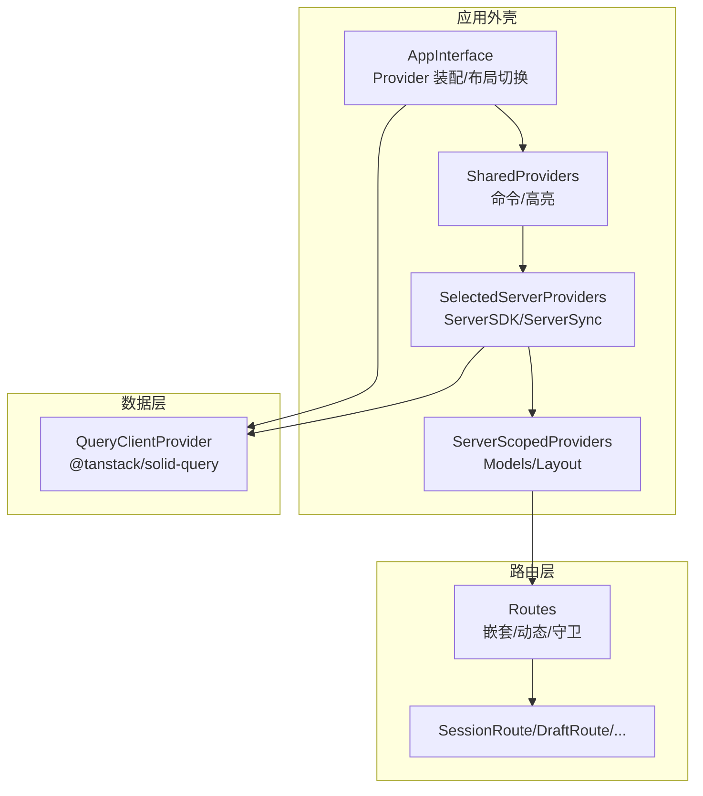
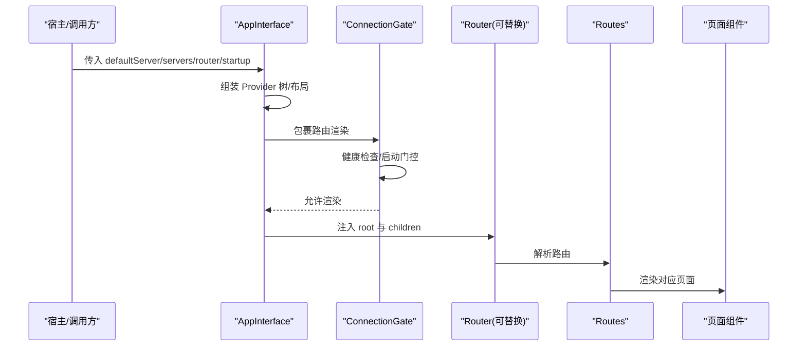
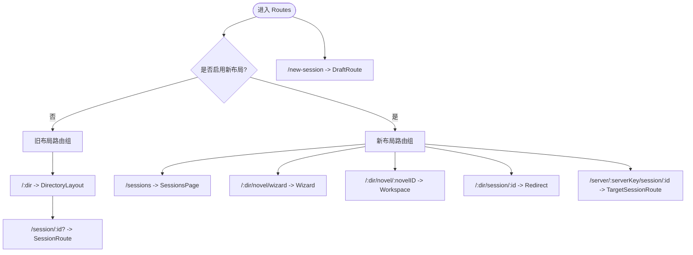
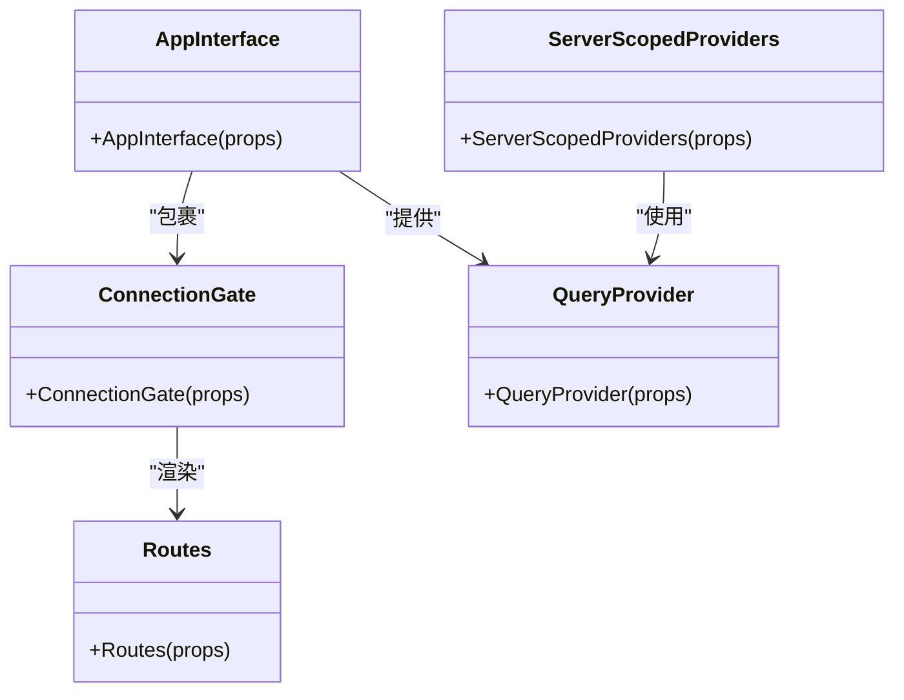
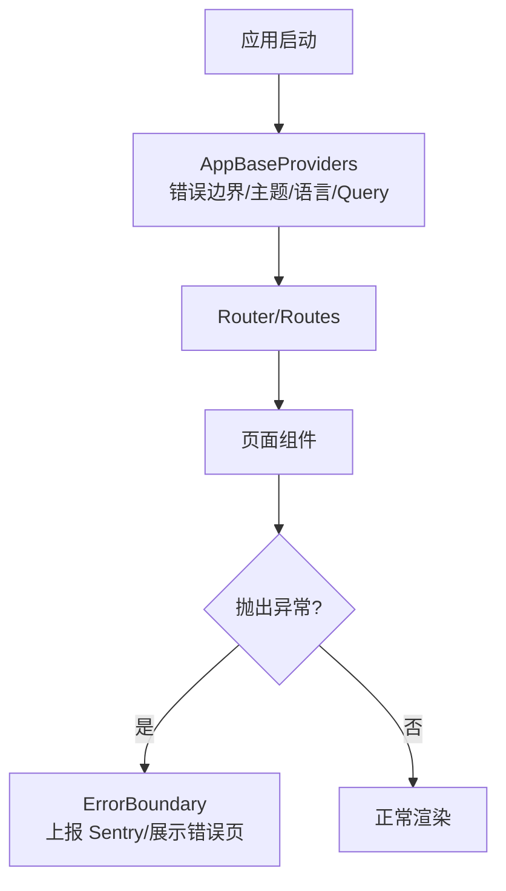
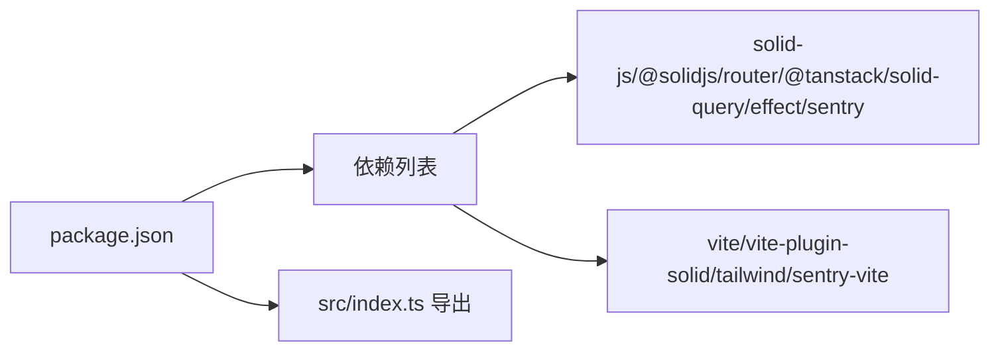

# SolidJS 架构设计

<cite>
**本文引用的文件**
- [packages/app/package.json](file://packages/app/package.json)
- [packages/app/vite.config.ts](file://packages/app/vite.config.ts)
- [packages/app/vite.js](file://packages/app/vite.js)
- [packages/app/src/index.ts](file://packages/app/src/index.ts)
- [packages/app/src/app.tsx](file://packages/app/src/app.tsx)
</cite>

## 目录
1. [简介](#简介)
2. [项目结构](#项目结构)
3. [核心组件](#核心组件)
4. [架构总览](#架构总览)
5. [详细组件分析](#详细组件分析)
6. [依赖分析](#依赖分析)
7. [性能考虑](#性能考虑)
8. [故障排查指南](#故障排查指南)
9. [结论](#结论)
10. [附录](#附录)

## 简介
本文件面向 openNovel 的 SolidJS 前端，系统性阐述其架构与实现要点：响应式状态管理、组件生命周期与性能优化机制；应用入口点配置、Vite 构建与开发环境设置；路由系统设计（嵌套路由、动态路由、路由守卫）；状态管理模式（局部状态、全局状态、异步状态处理）；服务端渲染（SSR）与水合配置；组件组合模式、错误边界与性能监控策略。文档以仓库中实际代码为依据，提供可追溯的来源定位与可视化图示，帮助读者快速理解并高效扩展。

## 项目结构
openNovel 的前端位于 packages/app 包内，采用 Vite + SolidJS 构建，使用 @solidjs/router 进行路由管理，@tanstack/solid-query 进行数据请求与缓存，Sentry 用于错误上报与监控。关键文件职责如下：
- package.json：定义脚本、依赖与导出入口，暴露 vite 插件与样式等模块路径。
- vite.config.ts：顶层 Vite 配置，集成 Sentry 插件、桌面端插件与基础构建选项。
- vite.js：自定义 Vite 插件集合，包含别名、define 常量注入、主题预加载、TailwindCSS 与 Solid 插件。
- src/index.ts：对外导出的 API 与类型，供上层或宿主应用消费。
- src/app.tsx：应用根组件、Provider 树、路由定义、连接门控、错误边界与页面布局切换逻辑。

**图表来源**
- [packages/app/package.json:1-97](file://packages/app/package.json#L1-L97)
- [packages/app/vite.config.ts:1-34](file://packages/app/vite.config.ts#L1-L34)
- [packages/app/vite.js:1-49](file://packages/app/vite.js#L1-L49)
- [packages/app/src/index.ts:1-31](file://packages/app/src/index.ts#L1-L31)
- [packages/app/src/app.tsx:1-643](file://packages/app/src/app.tsx#L1-L643)

**章节来源**
- [packages/app/package.json:1-97](file://packages/app/package.json#L1-L97)
- [packages/app/vite.config.ts:1-34](file://packages/app/vite.config.ts#L1-L34)
- [packages/app/vite.js:1-49](file://packages/app/vite.js#L1-L49)
- [packages/app/src/index.ts:1-31](file://packages/app/src/index.ts#L1-L31)

## 核心组件
- AppInterface：应用装配器，负责 Provider 树组装、服务器选择、连接门控、新旧布局切换与路由挂载。
- SharedProviders：跨路由共享的指令系统、高亮上下文等。
- SelectedServerProviders / ServerScopedProviders：按服务器作用域提供的 SDK、同步、模型与布局上下文。
- ConnectionGate：启动期健康检查与资源门控，支持阻塞/后台模式与重试。
- Routes：统一路由表，区分旧版与新布局，包含目录、会话、草稿与向导等路由。
- QueryProvider：基于 @tanstack/solid-query 的数据层提供者，关闭默认重取行为以提升性能。
- ErrorBoundary：全局错误边界，捕获异常并上报 Sentry，展示错误页。

这些组件通过组合模式组织，形成清晰的层次：全局 → 服务器作用域 → 页面级 → 业务组件。

**章节来源**
- [packages/app/src/app.tsx:253-264](file://packages/app/src/app.tsx#L253-L264)
- [packages/app/src/app.tsx:285-295](file://packages/app/src/app.tsx#L285-L295)
- [packages/app/src/app.tsx:169-177](file://packages/app/src/app.tsx#L169-L177)
- [packages/app/src/app.tsx:326-333](file://packages/app/src/app.tsx#L326-L333)
- [packages/app/src/app.tsx:401-470](file://packages/app/src/app.tsx#L401-L470)
- [packages/app/src/app.tsx:586-621](file://packages/app/src/app.tsx#L586-L621)
- [packages/app/src/app.tsx:378-398](file://packages/app/src/app.tsx#L378-L398)

## 架构总览
下图展示了从应用入口到路由与数据层的整体交互关系，包括 Provider 层级、连接门控、路由分发与查询客户端。

**图表来源**
- [packages/app/src/app.tsx:528-584](file://packages/app/src/app.tsx#L528-L584)
- [packages/app/src/app.tsx:253-264](file://packages/app/src/app.tsx#L253-L264)
- [packages/app/src/app.tsx:586-621](file://packages/app/src/app.tsx#L586-L621)

## 详细组件分析

### 应用入口与 Provider 树
- AppBaseProviders：封装 Meta、字体、主题、语言、错误边界、Dialog、Marked、FileComponent 等通用上下文。
- AppInterface：根据设置开关在新旧布局之间切换，并在 Router root 中注入 Tabs、权限、通知等上下文；同时通过 Dynamic 组件替换 Router 实例，便于测试或定制。
- ConnectionGate：在启动阶段执行健康检查与可选的启动 Promise，支持“阻塞”和“后台”两种模式，失败时展示连接错误并提供重试与其他服务器切换能力。

**图表来源**
- [packages/app/src/app.tsx:365-398](file://packages/app/src/app.tsx#L365-L398)
- [packages/app/src/app.tsx:528-584](file://packages/app/src/app.tsx#L528-L584)
- [packages/app/src/app.tsx:401-470](file://packages/app/src/app.tsx#L401-L470)
- [packages/app/src/app.tsx:586-621](file://packages/app/src/app.tsx#L586-L621)

**章节来源**
- [packages/app/src/app.tsx:365-398](file://packages/app/src/app.tsx#L365-L398)
- [packages/app/src/app.tsx:528-584](file://packages/app/src/app.tsx#L528-L584)
- [packages/app/src/app.tsx:401-470](file://packages/app/src/app.tsx#L401-L470)

### 路由系统设计
- 路由表 Routes：
  - 旧布局：根路由下包含目录与历史会话路由。
  - 新布局：新增 sessions、novel 工作区、向导与新的会话路由。
  - 草稿路由：/new-session 支持通过 draftId 打开草稿。
- 动态路由：/:dir/session/:id、/:dir/novel/:novelID 等，结合 useSearchParams/useParams 获取参数。
- 路由守卫：
  - SessionRoute：根据 settings 与 tabs 就绪状态决定跳转或创建草稿。
  - TargetServerRoute：校验 serverKey 并挂载 ServerSDK/ServerSync。
  - LegacyTargetSessionRedirect：将旧路由重定向到新格式。
- 导航与跳转：统一使用 Navigate 与 sessionHref/legacySessionHref 工具函数生成链接。

**图表来源**
- [packages/app/src/app.tsx:586-621](file://packages/app/src/app.tsx#L586-L621)
- [packages/app/src/app.tsx:76-110](file://packages/app/src/app.tsx#L76-L110)
- [packages/app/src/app.tsx:132-147](file://packages/app/src/app.tsx#L132-L147)
- [packages/app/src/app.tsx:187-209](file://packages/app/src/app.tsx#L187-L209)

**章节来源**
- [packages/app/src/app.tsx:586-621](file://packages/app/src/app.tsx#L586-L621)
- [packages/app/src/app.tsx:76-110](file://packages/app/src/app.tsx#L76-L110)
- [packages/app/src/app.tsx:132-147](file://packages/app/src/app.tsx#L132-L147)
- [packages/app/src/app.tsx:187-209](file://packages/app/src/app.tsx#L187-L209)

### 状态管理模式
- 局部状态：使用 createSignal/createMemo/createResource 管理组件内部状态与派生值，按需更新，避免不必要的重渲染。
- 全局状态：通过 Context 与 Provider 树（Language、Settings、Tabs、Permission、Notification、Models、Layout 等）共享状态。
- 异步状态：@tanstack/solid-query 的 QueryClient 集中管理请求缓存与失效策略；ConnectionGate 使用 Effect 与 createResource 管理健康检查与启动门控。
- 服务器作用域状态：ServerSDKProvider/ServerSyncProvider 为每个服务器键提供隔离的 SDK 与同步上下文，确保多服务器场景下的正确性。

**图表来源**
- [packages/app/src/app.tsx:528-584](file://packages/app/src/app.tsx#L528-L584)
- [packages/app/src/app.tsx:253-264](file://packages/app/src/app.tsx#L253-L264)
- [packages/app/src/app.tsx:326-333](file://packages/app/src/app.tsx#L326-L333)
- [packages/app/src/app.tsx:586-621](file://packages/app/src/app.tsx#L586-L621)

**章节来源**
- [packages/app/src/app.tsx:253-264](file://packages/app/src/app.tsx#L253-L264)
- [packages/app/src/app.tsx:326-333](file://packages/app/src/app.tsx#L326-L333)
- [packages/app/src/app.tsx:401-470](file://packages/app/src/app.tsx#L401-L470)
- [packages/app/src/app.tsx:586-621](file://packages/app/src/app.tsx#L586-L621)

### 错误边界与监控
- 全局错误边界：在 AppBaseProviders 中包裹整个 UI，捕获未处理异常并上报 Sentry，展示 ErrorPage。
- 会话路由错误边界：SessionRouteErrorBoundary 针对会话页面进行细粒度错误隔离。
- 监控与 SourceMap：Sentry Vite 插件在构建时上传 SourceMap，便于线上定位问题。

**图表来源**
- [packages/app/src/app.tsx:378-398](file://packages/app/src/app.tsx#L378-L398)
- [packages/app/src/app.tsx:106-110](file://packages/app/src/app.tsx#L106-L110)
- [packages/app/vite.config.ts:5-20](file://packages/app/vite.config.ts#L5-L20)

**章节来源**
- [packages/app/src/app.tsx:378-398](file://packages/app/src/app.tsx#L378-L398)
- [packages/app/src/app.tsx:106-110](file://packages/app/src/app.tsx#L106-L110)
- [packages/app/vite.config.ts:5-20](file://packages/app/vite.config.ts#L5-L20)

### 组件组合模式与最佳实践
- 组合优于继承：通过 Provider 树组合不同能力（语言、主题、命令、权限、通知、模型、布局），降低耦合度。
- 作用域隔离：ServerScopedProviders 与 SelectedServerProviders 保证多服务器场景下的状态隔离与按需挂载。
- 懒加载：使用 lazy 导入页面组件，减少首屏体积。
- 条件渲染：Show/For 等原语控制渲染分支，避免无谓计算。
- 副作用清理：onCleanup 用于定时器与事件监听器的释放，防止内存泄漏。

**章节来源**
- [packages/app/src/app.tsx:285-295](file://packages/app/src/app.tsx#L285-L295)
- [packages/app/src/app.tsx:326-333](file://packages/app/src/app.tsx#L326-L333)
- [packages/app/src/app.tsx:74-75](file://packages/app/src/app.tsx#L74-L75)
- [packages/app/src/app.tsx:480-481](file://packages/app/src/app.tsx#L480-L481)

## 依赖分析
- 运行时依赖：solid-js、@solidjs/router、@tanstack/solid-query、effect、sentry/solid、i18n、媒体与存储等 primitives。
- 构建依赖：vite、vite-plugin-solid、@tailwindcss/vite、@sentry/vite-plugin。
- 包导出：index.ts 暴露了上下文 hooks、类型与工具函数，供外部集成。

**图表来源**
- [packages/app/package.json:49-95](file://packages/app/package.json#L49-L95)
- [packages/app/src/index.ts:1-31](file://packages/app/src/index.ts#L1-L31)

**章节来源**
- [packages/app/package.json:49-95](file://packages/app/package.json#L49-L95)
- [packages/app/src/index.ts:1-31](file://packages/app/src/index.ts#L1-L31)

## 性能考虑
- 响应式最小化更新：Solid 的细粒度依赖追踪配合 createMemo/createRenderEffect，避免不必要重渲染。
- 查询缓存策略：QueryClient 默认关闭 refetchOnMount/WindowFocus/Reconnect，减少重复请求。
- 构建优化：target 设为 esnext，开启 sourcemap，利于调试与兼容性；Sentry 插件上传 SourceMap 提升排障效率。
- 资源门控：ConnectionGate 在启动期阻塞渲染直到健康检查通过，避免无效渲染与闪烁。
- 懒加载与代码分割：页面级 lazy 导入，按需加载。

[本节为通用指导，不直接分析具体文件]

## 故障排查指南
- 连接不可达：ConnectionError 显示当前服务器名称与重试提示，支持切换到其他可用服务器。
- 健康检查超时：ConnectionGate 内置 10 秒超时，失败后自动切换为后台模式继续尝试。
- 路由跳转异常：检查 SessionRoute/DraftRoute 的条件判断与 params/searchParams 是否正确。
- 错误上报：确认 Sentry 环境变量（SENTRY_AUTH_TOKEN/ORG/PROJECT）已配置，构建产物包含 SourceMap。

**章节来源**
- [packages/app/src/app.tsx:472-517](file://packages/app/src/app.tsx#L472-L517)
- [packages/app/src/app.tsx:401-470](file://packages/app/src/app.tsx#L401-L470)
- [packages/app/vite.config.ts:5-20](file://packages/app/vite.config.ts#L5-L20)

## 结论
openNovel 的 SolidJS 前端以 Provider 组合为核心，结合路由与作用域隔离，实现了清晰、可扩展且高性能的应用架构。通过 @tanstack/solid-query 与 Effect 管理异步状态，借助 Sentry 与 SourceMap 保障线上稳定性。建议在后续迭代中继续保持细粒度响应式更新、按需加载与严格的错误边界策略，以获得更优的用户体验与可维护性。

[本节为总结，不直接分析具体文件]

## 附录

### Vite 构建与开发环境设置
- 插件链：自定义 opencode-desktop 插件注入别名、define 常量与主题预加载；集成 TailwindCSS 与 Solid 插件。
- 服务器配置：host 0.0.0.0、端口 3000、allowedHosts true，便于容器与远程访问。
- 构建目标：esnext，sourcemap 开启，利于现代浏览器与调试。

**章节来源**
- [packages/app/vite.js:18-48](file://packages/app/vite.js#L18-L48)
- [packages/app/vite.config.ts:22-33](file://packages/app/vite.config.ts#L22-L33)

### SSR 与水合说明
- 当前实现未显式启用 SSR；应用以客户端渲染为主，通过 Provider 与 Router 完成水合。
- 如需启用 SSR，可在 Vite 配置中添加 solid ssr 相关插件与入口，并确保服务端渲染环境与客户端一致。

[本节为概念性说明，不直接分析具体文件]

### 实用示例与最佳实践清单
- 使用 createSignal/createMemo 管理局部状态与派生值，避免频繁 re-render。
- 使用 createResource 管理异步数据，结合 QueryClient 缓存策略。
- 使用 Show/For 控制条件与列表渲染，保持模板简洁。
- 使用 onCleanup 清理副作用，避免内存泄漏。
- 使用 lazy 与路由拆分，优化首屏加载。
- 使用 ErrorBoundary 捕获异常并上报 Sentry。

[本节为通用指导，不直接分析具体文件]