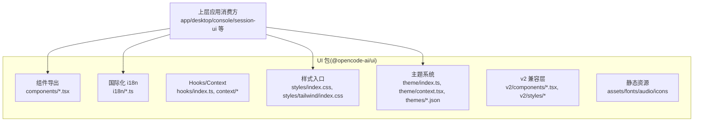
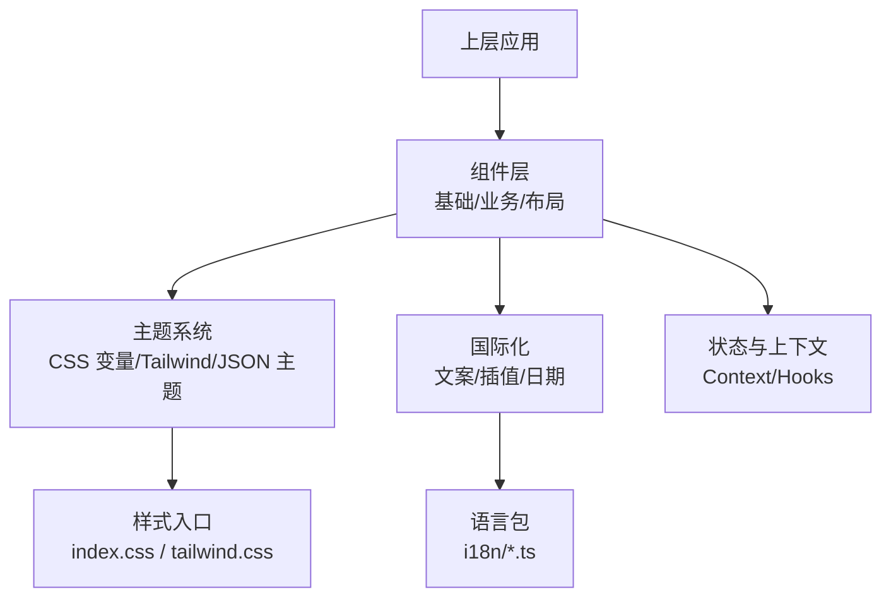
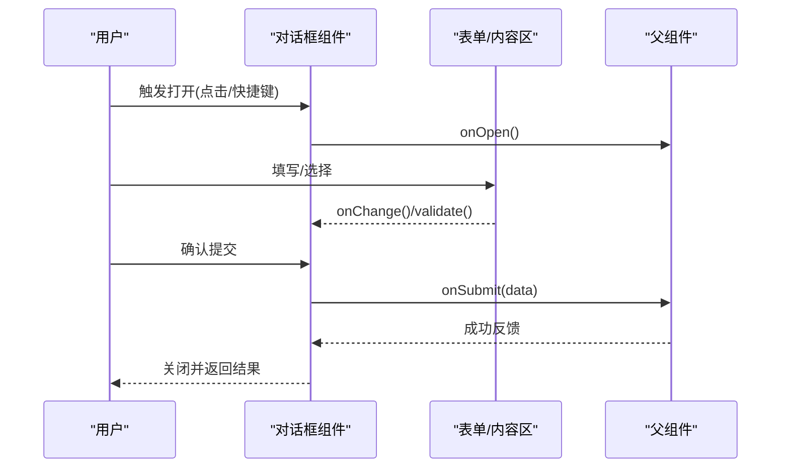
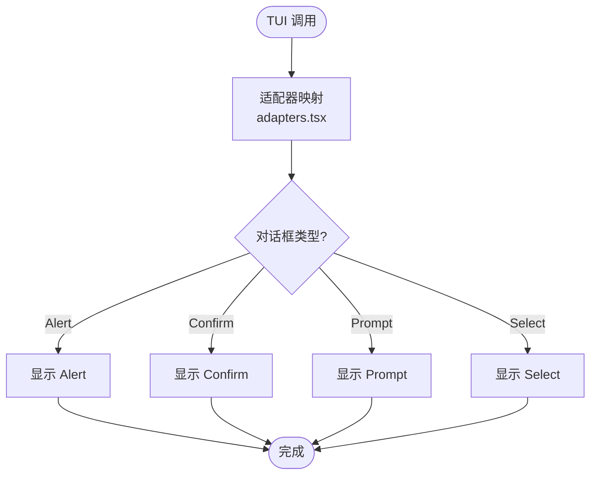
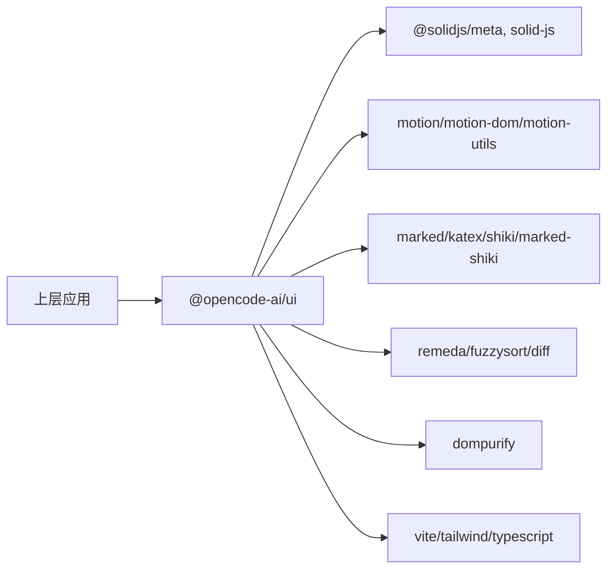

# UI 组件库

<cite>
**本文引用的文件**   
- [packages/ui/package.json](file://packages/ui/package.json)
- [packages/app/src/components/dialog-command-palette-v2.tsx](file://packages/app/src/components/dialog-command-palette-v2.tsx)
- [packages/app/src/components/dialog-connect-provider.stories.tsx](file://packages/app/src/components/dialog-connect-provider.stories.tsx)
- [packages/app/src/components/dialog-connect-provider.tsx](file://packages/app/src/components/dialog-connect-provider.tsx)
- [packages/app/src/components/dialog-custom-provider.tsx](file://packages/app/src/components/dialog-custom-provider.tsx)
- [packages/app/src/components/dialog-edit-project-v2.tsx](file://packages/app/src/components/dialog-edit-project-v2.tsx)
- [packages/app/src/components/dialog-edit-project.tsx](file://packages/app/src/components/dialog-edit-project.tsx)
- [packages/app/src/components/dialog-fork.tsx](file://packages/app/src/components/dialog-fork.tsx)
- [packages/app/src/components/dialog-manage-models.tsx](file://packages/app/src/components/dialog-manage-models.tsx)
- [packages/app/src/components/dialog-release-notes.tsx](file://packages/app/src/components/dialog-release-notes.tsx)
- [packages/tui/src/plugin/adapters.tsx](file://packages/tui/src/plugin/adapters.tsx)
</cite>

## 目录
1. [简介](#简介)
2. [项目结构](#项目结构)
3. [核心组件](#核心组件)
4. [架构总览](#架构总览)
5. [详细组件分析](#详细组件分析)
6. [依赖分析](#依赖分析)
7. [性能考虑](#性能考虑)
8. [故障排查指南](#故障排查指南)
9. [结论](#结论)
10. [附录](#附录)

## 简介
本文件为 openNovel 的 UI 组件库提供全面文档，覆盖以下方面：
- 自定义组件的设计原则与实现模式（基础组件、业务组件、布局组件）
- 主题系统架构（CSS 变量、样式隔离、动态主题切换）
- 国际化（i18n）实现（多语言支持、文本插值、日期格式化）
- 响应式设计策略（移动端适配、断点管理、触摸交互）
- 无障碍访问（a11y）合规性（语义化标签、键盘导航、屏幕阅读器支持）
- 组件 API 设计、属性验证与事件处理
- 使用示例、样式定制指南与性能优化建议

说明：由于仓库中未直接包含 packages/ui 的源码文件，本文基于包元数据与上层应用对 @opencode-ai/ui 的使用情况，结合通用前端工程实践进行系统化梳理。涉及具体代码片段均以“章节来源”形式指向实际可查文件。

## 项目结构
UI 组件库以 npm 包形式发布，名称为 @opencode-ai/ui。其 package.json 定义了导出路径、资源清单与脚本命令，表明该包提供：
- 组件导出：./src/components/*.tsx
- i18n 模块：./src/i18n/*.ts
- Hooks/Context：./src/hooks/index.ts、./src/context/index.ts 及子路径
- 样式入口：./src/styles/index.css、./src/styles/tailwind/index.css
- 主题能力：./src/theme/index.ts、./src/theme/context.tsx 以及 theme 下的 JSON 主题文件
- v2 兼容层：./src/v2/components/*.tsx 与 ./src/v2/styles/*
- 图标与字体/音频等静态资源

图表来源
- [packages/ui/package.json](file://packages/ui/package.json)

章节来源
- [packages/ui/package.json](file://packages/ui/package.json)

## 核心组件
根据包导出约定与上层应用的常见用法，UI 组件库通常包含三类组件：
- 基础组件：按钮、输入框、对话框、提示、列表、标签页等原子级 UI 元素
- 业务组件：与领域逻辑耦合的复合组件，如连接提供者对话框、编辑项目对话框、模型管理等
- 布局组件：栅格、容器、侧边栏、面板等用于页面结构的组件

从上层应用可见，对话框类组件被广泛使用，体现为多个 dialog-*.tsx 文件，这些属于业务或布局层面的组合组件，内部会调用基础组件完成交互与渲染。

章节来源
- [packages/app/src/components/dialog-connect-provider.tsx](file://packages/app/src/components/dialog-connect-provider.tsx)
- [packages/app/src/components/dialog-edit-project.tsx](file://packages/app/src/components/dialog-edit-project.tsx)
- [packages/app/src/components/dialog-manage-models.tsx](file://packages/app/src/components/dialog-manage-models.tsx)

## 架构总览
UI 组件库采用“组件 + 主题 + i18n + hooks/context”的分层架构：
- 组件层：按基础/业务/布局分类组织，通过 props 暴露 API，通过事件回调对外通信
- 主题层：通过 CSS 变量与 Tailwind 扩展实现样式隔离与动态切换，JSON 主题文件集中管理颜色、间距、圆角等
- i18n 层：多语言文案集中管理，支持文本插值与日期格式化
- 状态与上下文：通过 Context/Hooks 提供全局主题、语言、用户偏好等共享状态

图表来源
- [packages/ui/package.json](file://packages/ui/package.json)

## 详细组件分析
本节聚焦对话框组件族，展示其在应用中的使用模式与可能的 API 设计思路。

### 对话框组件族
- 典型场景：连接提供者配置、项目编辑、模型管理、版本说明、Fork 操作等
- 交互模式：打开/关闭、尺寸控制、描述信息、表单校验、提交回调
- 事件与回调：onOpen/onClose、onSubmit、onChange、onCancel 等
- 可访问性：焦点管理、Esc 关闭、ARIA 属性、语义化标题与描述

图表来源
- [packages/app/src/components/dialog-connect-provider.tsx](file://packages/app/src/components/dialog-connect-provider.tsx)
- [packages/app/src/components/dialog-edit-project.tsx](file://packages/app/src/components/dialog-edit-project.tsx)
- [packages/app/src/components/dialog-manage-models.tsx](file://packages/app/src/components/dialog-manage-models.tsx)

章节来源
- [packages/app/src/components/dialog-connect-provider.stories.tsx](file://packages/app/src/components/dialog-connect-provider.stories.tsx)
- [packages/app/src/components/dialog-connect-provider.tsx](file://packages/app/src/components/dialog-connect-provider.tsx)
- [packages/app/src/components/dialog-edit-project-v2.tsx](file://packages/app/src/components/dialog-edit-project-v2.tsx)
- [packages/app/src/components/dialog-edit-project.tsx](file://packages/app/src/components/dialog-edit-project.tsx)
- [packages/app/src/components/dialog-fork.tsx](file://packages/app/src/components/dialog-fork.tsx)
- [packages/app/src/components/dialog-manage-models.tsx](file://packages/app/src/components/dialog-manage-models.tsx)
- [packages/app/src/components/dialog-release-notes.tsx](file://packages/app/src/components/dialog-release-notes.tsx)

### TUI 适配器中的对话框
在终端界面（tui）中，对话框通过适配器映射到 UI 组件，保证一致的交互体验。

图表来源
- [packages/tui/src/plugin/adapters.tsx](file://packages/tui/src/plugin/adapters.tsx)

章节来源
- [packages/tui/src/plugin/adapters.tsx](file://packages/tui/src/plugin/adapters.tsx)

## 依赖分析
UI 组件库的依赖关系可从包元数据与上层应用引用推断：
- 运行时依赖：SolidJS 生态（@solidjs/meta）、动画库（motion）、Markdown/KaTeX/Shiki 渲染、DOM 安全过滤（dompurify）、工具库（remeda、fuzzysort）
- 开发依赖：Vite、Tailwind、TypeScript、Storybook 脚手架等
- 对等依赖：@solidjs/meta、solid-js

图表来源
- [packages/ui/package.json](file://packages/ui/package.json)

章节来源
- [packages/ui/package.json](file://packages/ui/package.json)

## 性能考虑
- 组件拆分与懒加载：将大体积组件按需导入，减少首屏体积
- 样式隔离与 Tree Shaking：利用 sideEffects 与模块化 CSS，避免无用样式打包
- 渲染优化：合理使用 memo/useMemo/useCallback，避免不必要的重渲染
- 动画与过渡：控制动画复杂度，避免阻塞主线程
- 资源优化：图标 sprite、字体与音频按需加载，CDN 缓存策略

[本节为通用指导，不直接分析具体文件]

## 故障排查指南
常见问题与定位方法：
- 主题未生效：检查 theme 上下文是否包裹根组件；确认 CSS 变量与 Tailwind 配置是否正确注入
- i18n 文案缺失：确认语言包已加载且 key 匹配；检查插值参数是否完整
- 对话框无法关闭：检查焦点管理与 Esc 事件绑定；确认 onOpen/onClose 回调未被阻止
- 样式冲突：确认样式隔离策略（CSS Modules/命名空间），避免全局污染
- 构建失败：检查 sideEffects 配置与导出路径；确保依赖版本与 peerDependencies 一致

章节来源
- [packages/ui/package.json](file://packages/ui/package.json)

## 结论
openNovel 的 UI 组件库以清晰的包结构与分层架构为基础，提供可扩展的主题系统、完善的 i18n 支持与丰富的组件能力。通过基础/业务/布局组件的分类与统一的 API 设计，上层应用可以快速构建一致的用户体验。建议在后续迭代中持续完善 a11y 合规、响应式适配与性能优化，以提升整体可用性与可维护性。

[本节为总结性内容，不直接分析具体文件]

## 附录
- 组件 API 设计建议：
  - 属性命名：小驼峰、语义化（如 size、variant、disabled）
  - 类型约束：使用 TypeScript 接口与联合类型，提供默认值
  - 事件回调：统一命名（onXxx），明确参数与返回值
- 样式定制指南：
  - 优先使用 CSS 变量覆盖主题色、字号、间距
  - 通过 Tailwind 扩展类名快速调整布局与响应式
- 响应式与触摸：
  - 使用媒体查询与断点管理不同屏幕尺寸
  - 为触摸设备优化点击区域与手势交互
- 无障碍访问：
  - 使用语义化标签（button、dialog、form）
  - 添加 ARIA 属性与键盘导航支持
  - 确保屏幕阅读器可读性与焦点顺序合理

[本节为通用指导，不直接分析具体文件]