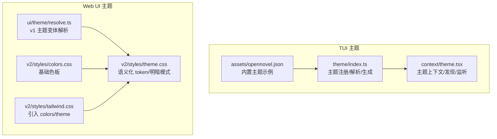
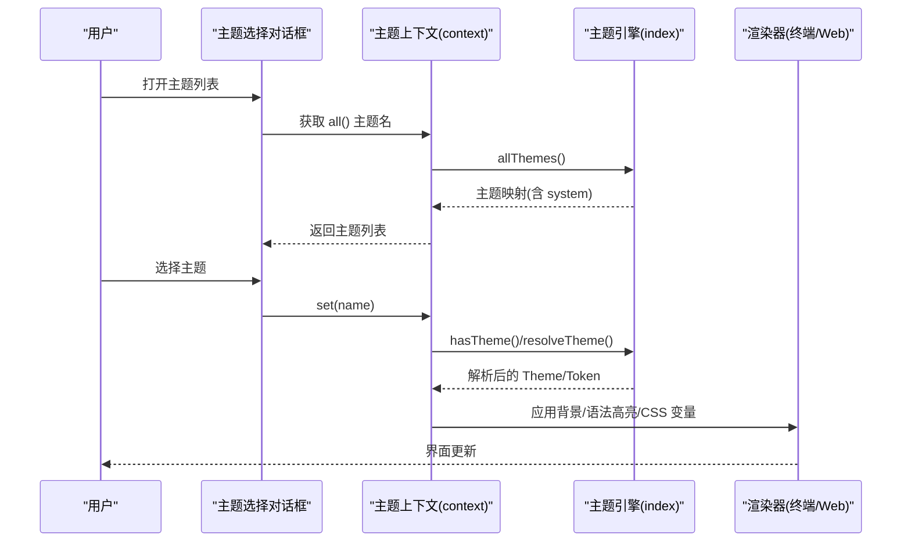
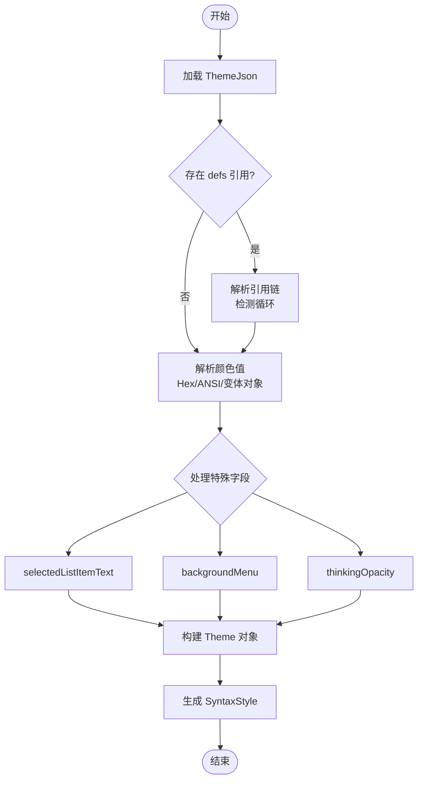
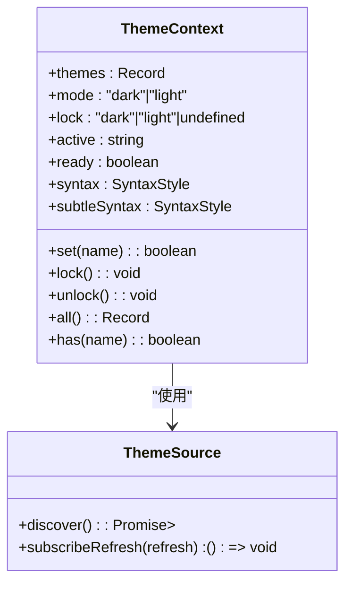
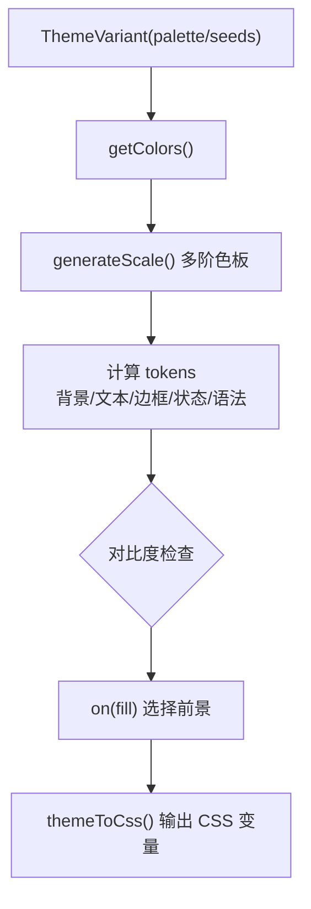
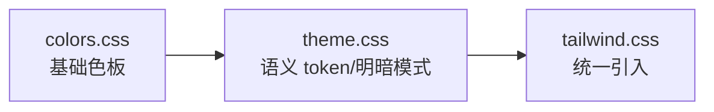
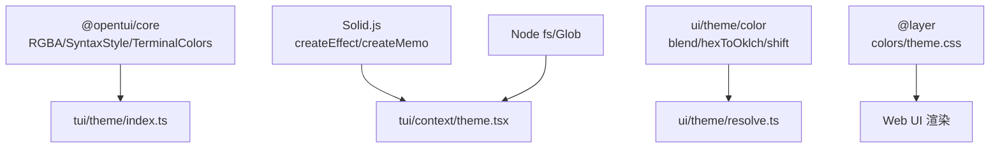

# 主题系统

<cite>
**本文引用的文件**   
- [packages/tui/src/theme/index.ts](file://packages/tui/src/theme/index.ts)
- [packages/tui/src/context/theme.tsx](file://packages/tui/src/context/theme.tsx)
- [packages/ui/src/theme/resolve.ts](file://packages/ui/src/theme/resolve.ts)
- [packages/ui/src/v2/styles/colors.css](file://packages/ui/src/v2/styles/colors.css)
- [packages/ui/src/v2/styles/theme.css](file://packages/ui/src/v2/styles/theme.css)
- [packages/ui/src/v2/styles/tailwind.css](file://packages/ui/src/v2/styles/tailwind.css)
- [packages/tui/src/component/dialog-theme-list.tsx](file://packages/tui/src/component/dialog-theme-list.tsx)
- [packages/tui/src/theme/assets/opennovel.json](file://packages/tui/src/theme/assets/opennovel.json)
- [packages/console/app/public/theme.json](file://packages/console/app/public/theme.json)
- [packages/web/public/theme.json](file://packages/web/public/theme.json)
</cite>

## 目录
1. [简介](#简介)
2. [项目结构](#项目结构)
3. [核心组件](#核心组件)
4. [架构总览](#架构总览)
5. [详细组件分析](#详细组件分析)
6. [依赖关系分析](#依赖关系分析)
7. [性能考量](#性能考量)
8. [故障排查指南](#故障排查指南)
9. [结论](#结论)
10. [附录](#附录)

## 简介
本文件为 openNovel 的主题系统提供全面文档，覆盖以下方面：
- CSS 变量架构设计：颜色系统、字体规范、间距与阴影层次（通过 v2 样式层与 token 命名体系体现）
- 动态主题切换机制：亮色/暗色模式、自定义主题加载、运行时更新
- 样式隔离策略：避免样式冲突、提升渲染性能
- 主题配置文件结构与扩展点：JSON Schema、默认主题、插件与用户主题优先级
- 主题定制指南：品牌色彩配置、字体替换、布局调整
- 主题测试方法与调试技巧

## 项目结构
openNovel 的主题系统由“终端 TUI 主题”和“Web UI 主题”两部分组成：
- TUI 主题：基于 JSON 的配色定义，支持 ANSI 颜色、引用、明暗变体，运行时解析为 RGBA 并生成语法高亮规则
- Web UI 主题：基于 CSS 变量与分层样式（@layer），提供 v2 语义化 token，支持明暗模式切换与覆盖

**图表来源** 
- [packages/tui/src/theme/index.ts:1-164](file://packages/tui/src/theme/index.ts#L1-L164)
- [packages/tui/src/context/theme.tsx:32-61](file://packages/tui/src/context/theme.tsx#L32-L61)
- [packages/tui/src/theme/assets/opennovel.json:1-42](file://packages/tui/src/theme/assets/opennovel.json#L1-L42)
- [packages/ui/src/theme/resolve.ts:1-16](file://packages/ui/src/theme/resolve.ts#L1-L16)
- [packages/ui/src/v2/styles/colors.css:1-17](file://packages/ui/src/v2/styles/colors.css#L1-L17)
- [packages/ui/src/v2/styles/theme.css:1-145](file://packages/ui/src/v2/styles/theme.css#L1-L145)
- [packages/ui/src/v2/styles/tailwind.css:1-3](file://packages/ui/src/v2/styles/tailwind.css#L1-L3)

**章节来源**
- [packages/tui/src/theme/index.ts:1-164](file://packages/tui/src/theme/index.ts#L1-L164)
- [packages/tui/src/context/theme.tsx:32-61](file://packages/tui/src/context/theme.tsx#L32-L61)
- [packages/ui/src/v2/styles/tailwind.css:1-3](file://packages/ui/src/v2/styles/tailwind.css#L1-L3)

## 核心组件
- TUI 主题引擎（index.ts）
  - 内置主题集合 DEFAULT_THEMES
  - 主题注册与合并：addTheme/upsertTheme/setCustomThemes/setSystemTheme
  - 主题解析 resolveTheme：支持 defs 引用、ANSI 数字、明暗变体对象
  - 语法高亮生成 generateSyntax/generateSubtleSyntax
  - 系统主题生成 generateSystem：根据终端调色板自动生成
- 主题上下文（context/theme.tsx）
  - 主题发现 discoverThemes：扫描多个目录下的 themes/*.json
  - 系统主题检测与刷新：读取终端调色板、推断明暗模式
  - 状态管理：active、mode、lock、ready
  - 事件监听：终端主题模式变化、输入序列通知、SIGUSR2 刷新
- Web UI 主题解析（ui/theme/resolve.ts）
  - 变体解析 resolveThemeVariant：从 palette/seeds 生成大量 CSS 变量 token
  - 明暗模式差异处理、对比度计算、紧凑模式分支
  - themeToCss：将 token 输出为 CSS 变量字符串
- Web UI 样式层（v2/styles/*）
  - colors.css：基础灰阶、Alpha、主色盘
  - theme.css：语义化 token、明暗模式覆盖、阴影层级、字体族
  - tailwind.css：统一引入 colors/theme

**章节来源**
- [packages/tui/src/theme/index.ts:130-164](file://packages/tui/src/theme/index.ts#L130-L164)
- [packages/tui/src/theme/index.ts:200-239](file://packages/tui/src/theme/index.ts#L200-L239)
- [packages/tui/src/theme/index.ts:241-299](file://packages/tui/src/theme/index.ts#L241-L299)
- [packages/tui/src/theme/index.ts:353-469](file://packages/tui/src/theme/index.ts#L353-L469)
- [packages/tui/src/context/theme.tsx:32-61](file://packages/tui/src/context/theme.tsx#L32-L61)
- [packages/tui/src/context/theme.tsx:100-150](file://packages/tui/src/context/theme.tsx#L100-L150)
- [packages/tui/src/context/theme.tsx:155-207](file://packages/tui/src/context/theme.tsx#L155-L207)
- [packages/ui/src/theme/resolve.ts:4-16](file://packages/ui/src/theme/resolve.ts#L4-L16)
- [packages/ui/src/theme/resolve.ts:458-514](file://packages/ui/src/theme/resolve.ts#L458-L514)
- [packages/ui/src/theme/resolve.ts:529-540](file://packages/ui/src/theme/resolve.ts#L529-L540)
- [packages/ui/src/v2/styles/colors.css:1-17](file://packages/ui/src/v2/styles/colors.css#L1-L17)
- [packages/ui/src/v2/styles/theme.css:1-145](file://packages/ui/src/v2/styles/theme.css#L1-L145)

## 架构总览
下图展示了主题系统的整体数据流与控制流：从主题源（内置/插件/用户/系统）到解析器，再到 TUI/Web 渲染。

**图表来源** 
- [packages/tui/src/component/dialog-theme-list.tsx:6-50](file://packages/tui/src/component/dialog-theme-list.tsx#L6-L50)
- [packages/tui/src/context/theme.tsx:256-303](file://packages/tui/src/context/theme.tsx#L256-L303)
- [packages/tui/src/theme/index.ts:190-218](file://packages/tui/src/theme/index.ts#L190-L218)

## 详细组件分析

### TUI 主题引擎（index.ts）
- 数据结构与类型
  - Theme：包含前景/背景/边框/语法/Markdown/Diff 等语义化颜色字段
  - ThemeJson：JSON 配置，支持 defs 引用、ANSI 数字、明暗变体对象
- 解析流程
  - resolveTheme：递归解析 ColorValue，支持循环引用检测
  - selectedListItemText/backgroundMenu/thinkingOpacity 特殊处理
- 系统主题生成
  - generateSystem：基于终端调色板推导中性色阶、文本对比度、Diff 背景等
- 语法高亮
  - generateSyntax/generateSubtleSyntax：按 scope 映射到主题颜色，支持透明度覆盖

**图表来源** 
- [packages/tui/src/theme/index.ts:241-299](file://packages/tui/src/theme/index.ts#L241-L299)
- [packages/tui/src/theme/index.ts:353-469](file://packages/tui/src/theme/index.ts#L353-L469)
- [packages/tui/src/theme/index.ts:556-584](file://packages/tui/src/theme/index.ts#L556-L584)

**章节来源**
- [packages/tui/src/theme/index.ts:36-91](file://packages/tui/src/theme/index.ts#L36-L91)
- [packages/tui/src/theme/index.ts:120-128](file://packages/tui/src/theme/index.ts#L120-L128)
- [packages/tui/src/theme/index.ts:241-299](file://packages/tui/src/theme/index.ts#L241-L299)
- [packages/tui/src/theme/index.ts:353-469](file://packages/tui/src/theme/index.ts#L353-L469)
- [packages/tui/src/theme/index.ts:556-584](file://packages/tui/src/theme/index.ts#L556-L584)

### 主题上下文（context/theme.tsx）
- 主题发现
  - discoverThemes：扫描 Global.Path.config 与 .opennovel/themes/*.json
  - subscribeRefresh：监听 SIGUSR2 触发刷新
- 系统主题
  - 读取终端调色板，推断明暗模式，生成 system 主题
  - 缓存签名避免重复生成
- 状态与持久化
  - active/mode/lock/ready 状态
  - KV 存储主题名与模式锁定
- 事件监听
  - CliRenderEvents.THEME_MODE
  - 输入序列 \x1b[?997;1n/\x1b[?997;2n 触发刷新

**图表来源** 
- [packages/tui/src/context/theme.tsx:32-61](file://packages/tui/src/context/theme.tsx#L32-L61)
- [packages/tui/src/context/theme.tsx:84-98](file://packages/tui/src/context/theme.tsx#L84-L98)
- [packages/tui/src/context/theme.tsx:155-207](file://packages/tui/src/context/theme.tsx#L155-L207)
- [packages/tui/src/context/theme.tsx:256-303](file://packages/tui/src/context/theme.tsx#L256-L303)

**章节来源**
- [packages/tui/src/context/theme.tsx:32-61](file://packages/tui/src/context/theme.tsx#L32-L61)
- [packages/tui/src/context/theme.tsx:100-150](file://packages/tui/src/context/theme.tsx#L100-L150)
- [packages/tui/src/context/theme.tsx:155-207](file://packages/tui/src/context/theme.tsx#L155-L207)
- [packages/tui/src/context/theme.tsx:256-303](file://packages/tui/src/context/theme.tsx#L256-L303)

### Web UI 主题解析（ui/theme/resolve.ts）
- 变体输入
  - palette：紧凑模式，直接指定各语义色
  - seeds：非紧凑模式，基于种子色派生多阶色板
- Token 生成
  - 背景/表面/文本/图标/边框/状态/差异/语法/Markdown 等 token
  - 对比度计算 on(fill) 自动选择黑白前景
  - 紧凑模式下的语法与 Markdown 分支
- CSS 输出
  - themeToCss：将 token 转为 CSS 变量字符串

**图表来源** 
- [packages/ui/src/theme/resolve.ts:4-16](file://packages/ui/src/theme/resolve.ts#L4-L16)
- [packages/ui/src/theme/resolve.ts:96-112](file://packages/ui/src/theme/resolve.ts#L96-L112)
- [packages/ui/src/theme/resolve.ts:458-514](file://packages/ui/src/theme/resolve.ts#L458-L514)
- [packages/ui/src/theme/resolve.ts:529-540](file://packages/ui/src/theme/resolve.ts#L529-L540)

**章节来源**
- [packages/ui/src/theme/resolve.ts:4-16](file://packages/ui/src/theme/resolve.ts#L4-L16)
- [packages/ui/src/theme/resolve.ts:96-112](file://packages/ui/src/theme/resolve.ts#L96-L112)
- [packages/ui/src/theme/resolve.ts:458-514](file://packages/ui/src/theme/resolve.ts#L458-L514)
- [packages/ui/src/theme/resolve.ts:529-540](file://packages/ui/src/theme/resolve.ts#L529-L540)

### Web UI 样式层（v2/styles/*）
- colors.css：定义灰阶、Alpha、主色盘（red/orange/yellow/green/cyan/blue/purple/pink）
- theme.css：语义化 token（背景/文本/图标/边框/遮罩/状态/阴影/字体族），支持 data-color-scheme 切换明暗
- tailwind.css：统一引入 colors/theme

**图表来源** 
- [packages/ui/src/v2/styles/colors.css:1-17](file://packages/ui/src/v2/styles/colors.css#L1-L17)
- [packages/ui/src/v2/styles/theme.css:1-145](file://packages/ui/src/v2/styles/theme.css#L1-L145)
- [packages/ui/src/v2/styles/tailwind.css:1-3](file://packages/ui/src/v2/styles/tailwind.css#L1-L3)

**章节来源**
- [packages/ui/src/v2/styles/colors.css:1-17](file://packages/ui/src/v2/styles/colors.css#L1-L17)
- [packages/ui/src/v2/styles/theme.css:1-145](file://packages/ui/src/v2/styles/theme.css#L1-L145)
- [packages/ui/src/v2/styles/tailwind.css:1-3](file://packages/ui/src/v2/styles/tailwind.css#L1-L3)

### 主题选择对话框（dialog-theme-list.tsx）
- 展示所有可用主题名称（排序）
- 支持过滤与即时预览
- 确认前可撤销更改

**章节来源**
- [packages/tui/src/component/dialog-theme-list.tsx:6-50](file://packages/tui/src/component/dialog-theme-list.tsx#L6-L50)

### 内置主题示例（opennovel.json）
- 使用 defs 组织明暗色阶与语义色
- theme 字段定义各语义颜色，支持明暗变体对象

**章节来源**
- [packages/tui/src/theme/assets/opennovel.json:1-42](file://packages/tui/src/theme/assets/opennovel.json#L1-L42)
- [packages/tui/src/theme/assets/opennovel.json:43-245](file://packages/tui/src/theme/assets/opennovel.json#L43-L245)

### 主题配置文件结构（Schema）
- console/web 的 theme.json 定义了 colorValue 联合类型（Hex/ANSI/none/引用）
- 要求 theme 对象包含必要字段（primary/secondary/accent/text/textMuted/background）

**章节来源**
- [packages/console/app/public/theme.json:1-44](file://packages/console/app/public/theme.json#L1-L44)
- [packages/console/app/public/theme.json:82-120](file://packages/console/app/public/theme.json#L82-L120)
- [packages/web/public/theme.json:1-44](file://packages/web/public/theme.json#L1-L44)
- [packages/web/public/theme.json:82-119](file://packages/web/public/theme.json#L82-L119)

## 依赖关系分析
- TUI 主题引擎依赖 @opentui/core 的 RGBA/SyntaxStyle/TerminalColors
- 主题上下文依赖 Solid 响应式与 Node fs/Glob 进行文件扫描
- Web UI 主题解析依赖颜色工具函数（blend/hexToOklch/shift/withAlpha）
- 样式层通过 @layer 实现样式隔离，避免全局污染

**图表来源** 
- [packages/tui/src/theme/index.ts:1-2](file://packages/tui/src/theme/index.ts#L1-L2)
- [packages/tui/src/context/theme.tsx:1-31](file://packages/tui/src/context/theme.tsx#L1-L31)
- [packages/ui/src/theme/resolve.ts:1-2](file://packages/ui/src/theme/resolve.ts#L1-L2)
- [packages/ui/src/v2/styles/theme.css:1-2](file://packages/ui/src/v2/styles/theme.css#L1-L2)

**章节来源**
- [packages/tui/src/theme/index.ts:1-2](file://packages/tui/src/theme/index.ts#L1-L2)
- [packages/tui/src/context/theme.tsx:1-31](file://packages/tui/src/context/theme.tsx#L1-L31)
- [packages/ui/src/theme/resolve.ts:1-2](file://packages/ui/src/theme/resolve.ts#L1-L2)
- [packages/ui/src/v2/styles/theme.css:1-2](file://packages/ui/src/v2/styles/theme.css#L1-L2)

## 性能考量
- 主题解析缓存
  - 系统主题签名缓存，避免重复生成
  - SyntaxStyle 生命周期管理，空闲时销毁释放资源
- 刷新节流
  - THEME_REFRESH_DELAYS 延迟队列，合并频繁刷新
  - SIGUSR2 信号监听，批量刷新主题文件
- CSS 变量注入
  - themeToCss 一次性生成变量字符串，减少运行时计算

**章节来源**
- [packages/tui/src/context/theme.tsx:152-179](file://packages/tui/src/context/theme.tsx#L152-L179)
- [packages/tui/src/context/theme.tsx:235-254](file://packages/tui/src/context/theme.tsx#L235-L254)
- [packages/tui/src/context/theme.tsx:306-333](file://packages/tui/src/context/theme.tsx#L306-L333)
- [packages/ui/src/theme/resolve.ts:536-540](file://packages/ui/src/theme/resolve.ts#L536-L540)

## 故障排查指南
- 主题未生效
  - 检查主题名称是否存在于 allThemes()
  - 确认 KV 中 theme_mode_lock 是否锁定模式
  - 验证主题文件路径是否在扫描目录内
- 颜色引用错误
  - resolveTheme 会抛出循环引用或未找到引用的错误
  - 检查 defs 与 theme 字段中的引用链
- 系统主题异常
  - 终端调色板不可用时，回退到默认主题
  - 监听输入序列 \x1b[?997;1n/\x1b[?997;2n 触发刷新
- Web UI 样式冲突
  - 确保使用 @layer 包裹样式，避免全局污染
  - 检查 data-color-scheme 属性是否正确设置

**章节来源**
- [packages/tui/src/theme/index.ts:241-258](file://packages/tui/src/theme/index.ts#L241-L258)
- [packages/tui/src/context/theme.tsx:155-179](file://packages/tui/src/context/theme.tsx#L155-L179)
- [packages/tui/src/context/theme.tsx:228-233](file://packages/tui/src/context/theme.tsx#L228-L233)
- [packages/ui/src/v2/styles/theme.css:1-2](file://packages/ui/src/v2/styles/theme.css#L1-L2)

## 结论
openNovel 的主题系统通过“JSON 配置 + 运行时解析 + CSS 变量”三层架构，实现了高度可扩展与灵活的视觉定制能力。TUI 与 Web 双端主题引擎协同工作，既保证了终端环境的高效渲染，又提供了现代 Web 界面的语义化样式管理。通过完善的主题发现、优先级合并、明暗模式切换与样式隔离机制，开发者可以便捷地创建与分发主题，同时保持系统的稳定性与性能。

## 附录

### CSS 变量架构设计
- 颜色系统
  - v2 基础色板：灰阶、Alpha、主色盘（红/橙/黄/绿/青/蓝/紫/粉）
  - 语义 token：background-base/text-base/icon-base/border-base/state-* 等
- 字体规范
  - --font-family-text 与 --v2-font-family-sans 统一字体族
- 间距与阴影
  - --v2-elevation-* 系列定义不同层级的阴影效果
  - overlay 与 gradient-depth 控制遮罩与渐变深度

**章节来源**
- [packages/ui/src/v2/styles/colors.css:1-173](file://packages/ui/src/v2/styles/colors.css#L1-L173)
- [packages/ui/src/v2/styles/theme.css:113-145](file://packages/ui/src/v2/styles/theme.css#L113-L145)
- [packages/ui/src/v2/styles/theme.css:113-137](file://packages/ui/src/v2/styles/theme.css#L113-L137)

### 动态主题切换机制
- 亮色/暗色模式
  - TUI：terminalMode 推断 + mode lock 锁定
  - Web：data-color-scheme 属性切换
- 自定义主题创建
  - 在 ~/.config/opencode/themes 或 .opencode/themes 放置 JSON 文件
  - 支持 defs 引用、ANSI 颜色、明暗变体对象
- 运行时更新
  - SIGUSR2 信号触发刷新
  - 输入序列通知异步刷新系统主题

**章节来源**
- [packages/tui/src/context/theme.tsx:155-207](file://packages/tui/src/context/theme.tsx#L155-L207)
- [packages/tui/src/context/theme.tsx:228-233](file://packages/tui/src/context/theme.tsx#L228-L233)
- [packages/ui/src/v2/styles/theme.css:260-380](file://packages/ui/src/v2/styles/theme.css#L260-L380)

### 样式隔离策略
- 使用 @layer 组织样式，避免全局污染
- CSS 变量命名空间化（--v2-*），减少冲突
- 通过 data-theme/data-color-scheme 精确控制作用域

**章节来源**
- [packages/ui/src/v2/styles/theme.css:1-2](file://packages/ui/src/v2/styles/theme.css#L1-L2)
- [packages/ui/src/v2/styles/theme.css:260-380](file://packages/ui/src/v2/styles/theme.css#L260-L380)

### 主题配置文件结构与扩展点
- JSON Schema 定义 colorValue 联合类型
- 必填字段：theme.primary/secondary/accent/text/textMuted/background
- 扩展点：defs 引用、system 主题注入、插件主题 addTheme/upsertTheme

**章节来源**
- [packages/console/app/public/theme.json:82-120](file://packages/console/app/public/theme.json#L82-L120)
- [packages/web/public/theme.json:82-119](file://packages/web/public/theme.json#L82-L119)
- [packages/tui/src/theme/index.ts:220-239](file://packages/tui/src/theme/index.ts#L220-L239)

### 主题定制指南
- 品牌色彩配置
  - 修改 primary/accent/info 等语义色
  - 使用 defs 组织色阶，保持一致性
- 字体替换
  - 覆盖 --font-family-text 与 --v2-font-family-sans
- 布局调整
  - 调整 --v2-elevation-* 阴影层级
  - 修改 background-layer-* 背景层次

**章节来源**
- [packages/tui/src/theme/assets/opennovel.json:1-42](file://packages/tui/src/theme/assets/opennovel.json#L1-L42)
- [packages/ui/src/v2/styles/theme.css:143-145](file://packages/ui/src/v2/styles/theme.css#L143-L145)
- [packages/ui/src/v2/styles/theme.css:113-137](file://packages/ui/src/v2/styles/theme.css#L113-L137)

### 主题测试方法与调试技巧
- 单元测试
  - withTheme 包装组件，模拟主题上下文
  - visibleLines 辅助函数验证渲染输出
- 调试技巧
  - 控制台打印 allThemes() 检查主题加载
  - 检查 KV 存储 theme/theme_mode_lock 状态
  - 浏览器 DevTools 查看 CSS 变量计算结果

**章节来源**
- [packages/tui/test/cli/tui/diff-viewer-file-tree.test.tsx:181-200](file://packages/tui/test/cli/tui/diff-viewer-file-tree.test.tsx#L181-L200)
- [packages/tui/src/context/theme.tsx:256-303](file://packages/tui/src/context/theme.tsx#L256-L303)