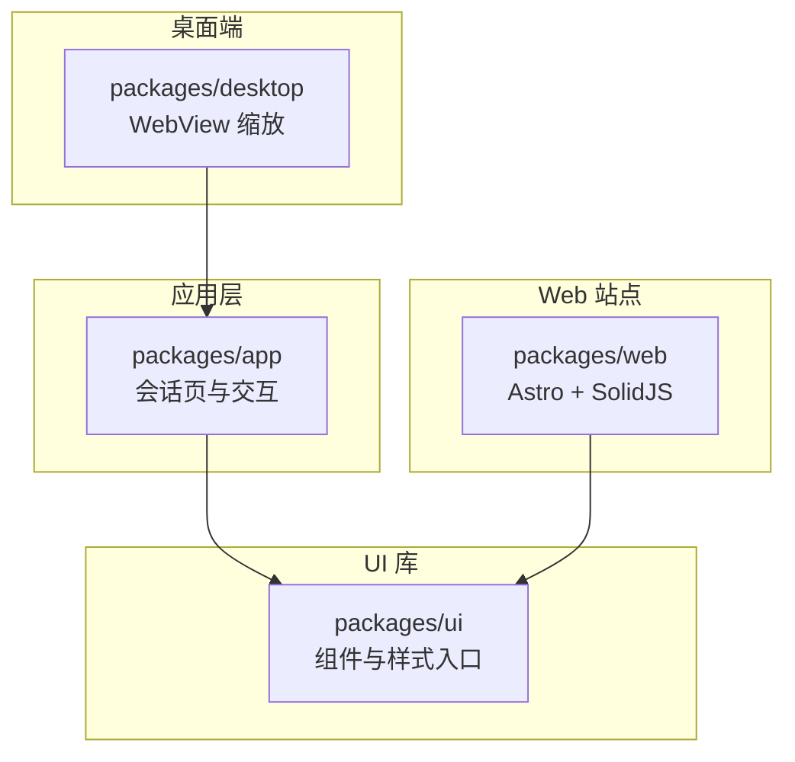
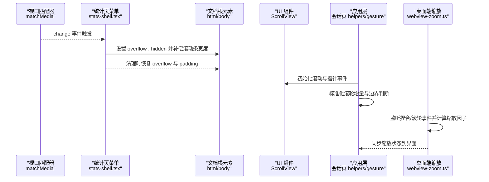
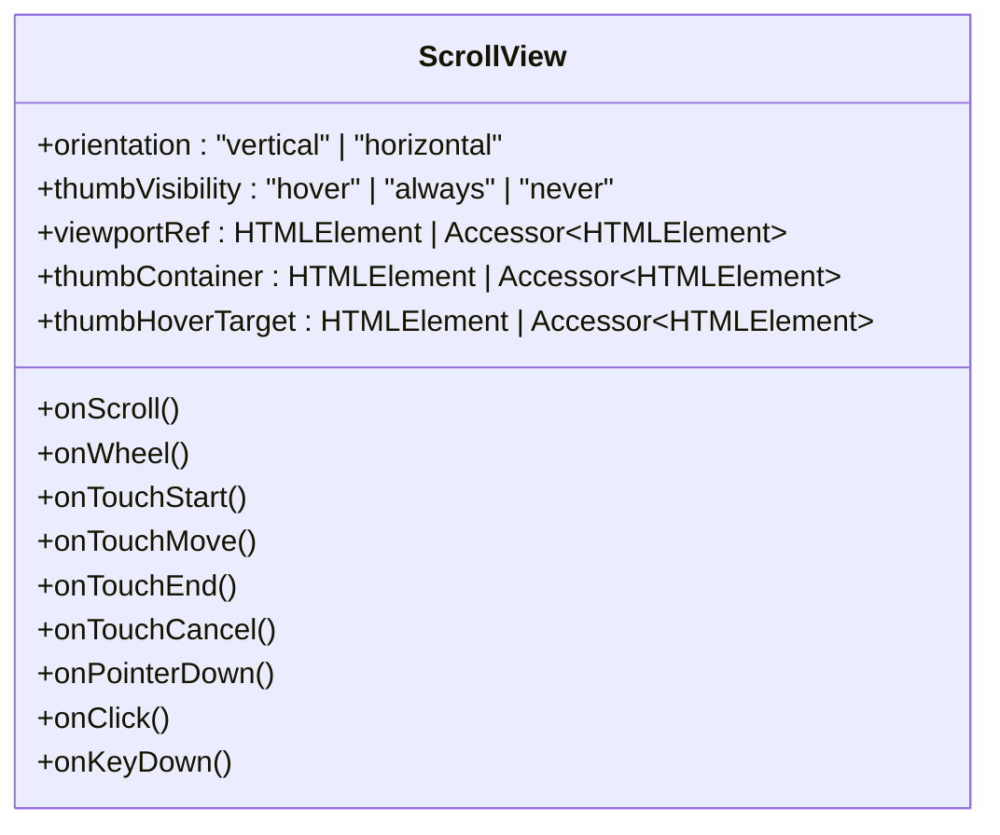
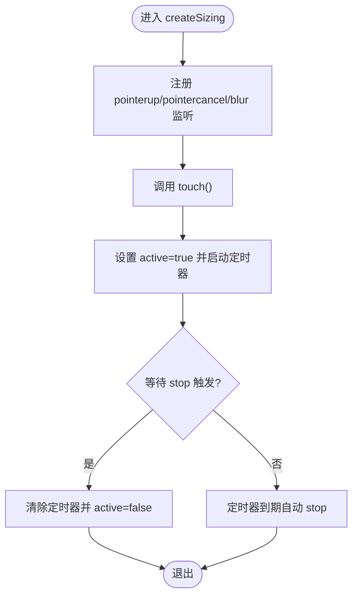
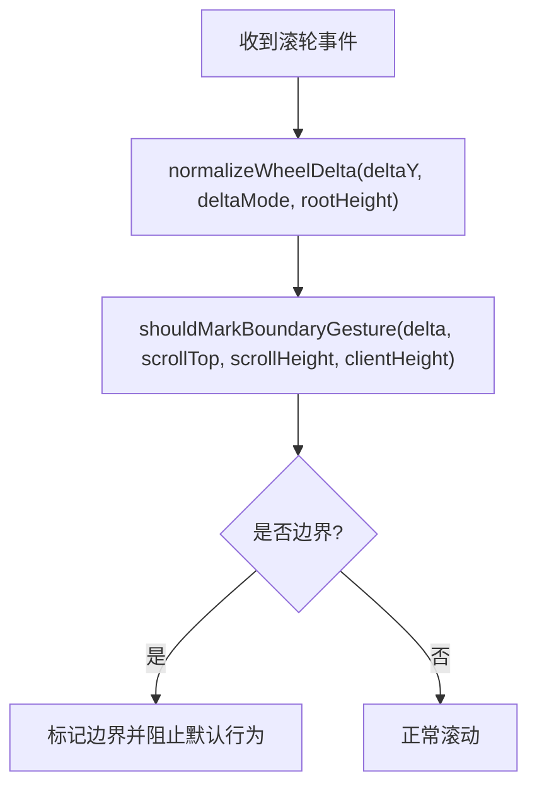
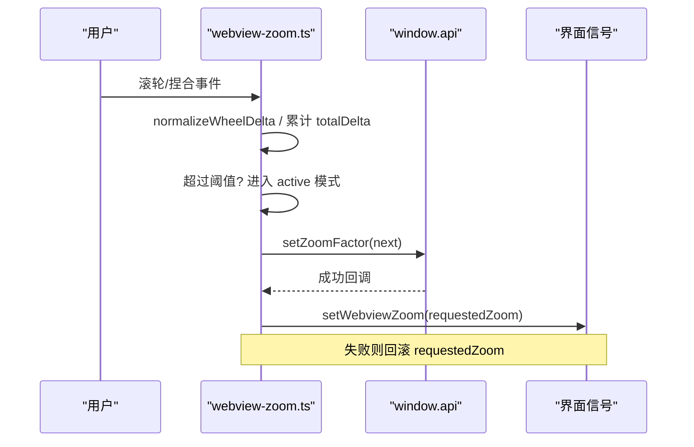
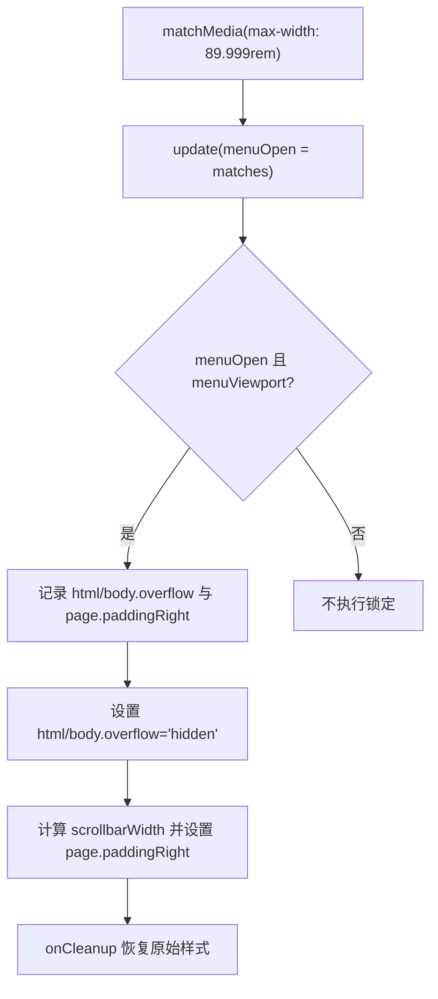
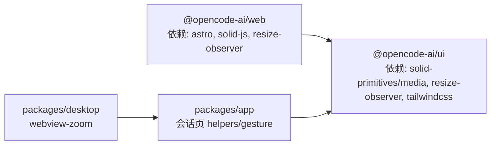

# 响应式设计

<cite>
**本文引用的文件**   
- [packages/ui/package.json](file://packages/ui/package.json)
- [packages/web/package.json](file://packages/web/package.json)
- [packages/app/src/pages/session/helpers.ts](file://packages/app/src/pages/session/helpers.ts)
- [packages/app/src/pages/session/message-gesture.ts](file://packages/app/src/pages/session/message-gesture.ts)
- [packages/desktop/src/renderer/webview-zoom.ts](file://packages/desktop/src/renderer/webview-zoom.ts)
- [packages/stats/app/src/routes/stats-shell.tsx](file://packages/stats/app/src/routes/stats-shell.tsx)
- [packages/ui/src/components/scroll-view.tsx](file://packages/ui/src/components/scroll-view.tsx)
</cite>

## 目录
1. [简介](#简介)
2. [项目结构](#项目结构)
3. [核心组件](#核心组件)
4. [架构总览](#架构总览)
5. [详细组件分析](#详细组件分析)
6. [依赖分析](#依赖分析)
7. [性能考虑](#性能考虑)
8. [故障排查指南](#故障排查指南)
9. [结论](#结论)
10. [附录](#附录) 

## 简介
本文件为 openNovel 的响应式设计系统提供全面文档，聚焦断点策略与移动优先理念、媒体查询最佳实践与性能优化、触摸交互（手势识别、滑动、缩放）、多屏幕尺寸适配方案（平板、手机、桌面），以及响应式组件开发指南（弹性布局、网格系统、流式排版）。同时给出移动端测试方法与性能调优建议，帮助团队在不同设备上保持一致的用户体验。

## 项目结构
openNovel 采用多包架构，UI 能力集中在 packages/ui，Web 站点使用 Astro + SolidJS（packages/web），应用层在 packages/app，桌面端 WebView 缩放逻辑在 packages/desktop。样式与主题通过 Tailwind 与 CSS 变量管理，媒体查询与视口变化通过 matchMedia 监听，滚动与手势由自定义组件与工具函数处理。

图表来源 
- [packages/ui/package.json:1-114](file://packages/ui/package.json#L1-L114)
- [packages/web/package.json:1-45](file://packages/web/package.json#L1-L45)

章节来源
- [packages/ui/package.json:1-114](file://packages/ui/package.json#L1-L114)
- [packages/web/package.json:1-45](file://packages/web/package.json#L1-L45)

## 核心组件
- 滚动视图 ScrollView：统一滚动容器，支持方向、缩略条可见性、指针事件透传，便于在不同设备上的滚动行为一致性。
- 会话辅助 createSizing：封装触摸激活态与定时器清理，避免长时间占用资源。
- 消息手势 message-gesture：标准化滚轮增量与边界检测，提升跨设备滚动体验。
- 桌面端缩放 webview-zoom：实现捏合缩放、滚轮模拟捏合、最小/最大缩放限制与状态同步。
- 统计页面 stats-shell：基于 matchMedia 的视口切换与菜单展开时的滚动锁定与占位补偿。

章节来源
- [packages/ui/src/components/scroll-view.tsx:99-138](file://packages/ui/src/components/scroll-view.tsx#L99-L138)
- [packages/app/src/pages/session/helpers.ts:169-209](file://packages/app/src/pages/session/helpers.ts#L169-L209)
- [packages/app/src/pages/session/message-gesture.ts:1-21](file://packages/app/src/pages/session/message-gesture.ts#L1-L21)
- [packages/desktop/src/renderer/webview-zoom.ts:1-101](file://packages/desktop/src/renderer/webview-zoom.ts#L1-L101)
- [packages/stats/app/src/routes/stats-shell.tsx:74-100](file://packages/stats/app/src/routes/stats-shell.tsx#L74-L100)

## 架构总览
响应式系统在 openNovel 中由“视口检测 + 组件行为 + 样式策略”三层协作完成：
- 视口检测：matchMedia 监听断点变化，驱动菜单、布局开关等。
- 组件行为：滚动、手势、缩放等交互逻辑封装在独立模块，保证可复用与可测试。
- 样式策略：Tailwind 类名与 CSS 变量配合媒体查询，实现弹性布局与流式排版。

图表来源 
- [packages/stats/app/src/routes/stats-shell.tsx:74-100](file://packages/stats/app/src/routes/stats-shell.tsx#L74-L100)
- [packages/ui/src/components/scroll-view.tsx:99-138](file://packages/ui/src/components/scroll-view.tsx#L99-L138)
- [packages/app/src/pages/session/helpers.ts:169-209](file://packages/app/src/pages/session/helpers.ts#L169-L209)
- [packages/app/src/pages/session/message-gesture.ts:1-21](file://packages/app/src/pages/session/message-gesture.ts#L1-L21)
- [packages/desktop/src/renderer/webview-zoom.ts:1-101](file://packages/desktop/src/renderer/webview-zoom.ts#L1-L101)

## 详细组件分析

### 滚动视图 ScrollView
- 职责：提供统一的滚动容器，支持垂直/水平方向、缩略条显示策略、指针事件透传。
- 关键点：
  - 合并默认配置与传入 props，减少重复逻辑。
  - 拆分属性与事件，便于按需绑定。
  - 支持外部 ref 注入，方便测量与动画联动。
- 适用场景：长列表、聊天消息区、文档阅读器等需要稳定滚动体验的区域。

图表来源 
- [packages/ui/src/components/scroll-view.tsx:99-138](file://packages/ui/src/components/scroll-view.tsx#L99-L138)

章节来源
- [packages/ui/src/components/scroll-view.tsx:99-138](file://packages/ui/src/components/scroll-view.tsx#L99-L138)

### 会话辅助 createSizing
- 职责：管理触摸激活态与定时器清理，避免内存泄漏与无效事件监听。
- 关键点：
  - 使用 onMount/onCleanup 生命周期管理全局指针事件。
  - touch() 启动短时激活态，自动停止，降低误触影响。
- 适用场景：输入框、拖拽区域、长按菜单等需要短暂激活态的交互。

图表来源 
- [packages/app/src/pages/session/helpers.ts:169-209](file://packages/app/src/pages/session/helpers.ts#L169-L209)

章节来源
- [packages/app/src/pages/session/helpers.ts:169-209](file://packages/app/src/pages/session/helpers.ts#L169-L209)

### 消息手势 message-gesture
- 职责：标准化滚轮增量与边界检测，确保不同 deltaMode 下滚动一致。
- 关键点：
  - normalizeWheelDelta 将行级/页级增量转换为像素级。
  - shouldMarkBoundaryGesture 判断是否到达顶部或底部边界。
- 适用场景：聊天消息、代码块、长文档等需要精准滚动控制的区域。

图表来源 
- [packages/app/src/pages/session/message-gesture.ts:1-21](file://packages/app/src/pages/session/message-gesture.ts#L1-L21)

章节来源
- [packages/app/src/pages/session/message-gesture.ts:1-21](file://packages/app/src/pages/session/message-gesture.ts#L1-L21)

### 桌面端缩放 webview-zoom
- 职责：实现捏合缩放、滚轮模拟捏合、最小/最大缩放限制与状态同步。
- 关键点：
  - clamp 限制缩放范围，MIN/MAX 常量控制边界。
  - wheelPinch 累计滚轮增量，超过阈值后进入缩放模式。
  - 与原生 API 同步缩放因子，保持 UI 与底层一致。
- 适用场景：桌面端 WebView 内嵌网页的缩放需求。

图表来源 
- [packages/desktop/src/renderer/webview-zoom.ts:1-101](file://packages/desktop/src/renderer/webview-zoom.ts#L1-L101)

章节来源
- [packages/desktop/src/renderer/webview-zoom.ts:1-101](file://packages/desktop/src/renderer/webview-zoom.ts#L1-L101)

### 统计页菜单 stats-shell
- 职责：基于 matchMedia 切换菜单视口状态，并在菜单打开时锁定滚动并补偿滚动条宽度。
- 关键点：
  - media.addEventListener("change", update) 响应断点变化。
  - 打开菜单时设置 html/body overflow:hidden，并计算 scrollbarWidth 填充右侧 padding。
  - onCleanup 恢复原始样式，避免副作用。
- 适用场景：侧边栏、抽屉菜单、全屏导航等需要锁定页面的交互。

图表来源 
- [packages/stats/app/src/routes/stats-shell.tsx:74-100](file://packages/stats/app/src/routes/stats-shell.tsx#L74-L100)

章节来源
- [packages/stats/app/src/routes/stats-shell.tsx:74-100](file://packages/stats/app/src/routes/stats-shell.tsx#L74-L100)

## 依赖分析
- UI 包依赖 @solid-primitives/media、@solid-primitives/resize-observer 用于媒体查询与尺寸观测；Tailwind 作为样式基础。
- Web 包使用 Astro + SolidJS，集成 resize-observer 以增强响应式能力。
- 应用层与桌面端分别实现交互与缩放逻辑，UI 库提供通用滚动与组件能力。

图表来源 
- [packages/ui/package.json:1-114](file://packages/ui/package.json#L1-L114)
- [packages/web/package.json:1-45](file://packages/web/package.json#L1-L45)

章节来源
- [packages/ui/package.json:1-114](file://packages/ui/package.json#L1-L114)
- [packages/web/package.json:1-45](file://packages/web/package.json#L1-L45)

## 性能考虑
- 媒体查询与视口监听：
  - 使用 matchMedia 而非频繁读取 window.innerWidth，减少重排与重绘。
  - 仅在必要时添加/移除事件监听，避免内存泄漏。
- 滚动与手势：
  - 标准化滚轮增量，避免多次计算；边界检测提前短路，减少无用渲染。
  - 使用 ResizeObserver 替代周期性测量，降低 CPU 占用。
- 缩放与动画：
  - 限制缩放步长与范围，避免极端值导致布局抖动。
  - 批量更新 DOM 样式，减少回流次数。
- 样式与布局：
  - 优先使用 Flexbox/Grid 与相对单位（%、vw/vh、rem）构建弹性布局。
  - 避免在媒体查询中定义复杂动画，尽量交由 GPU 加速属性（transform、opacity）。

[本节为通用指导，无需特定文件引用]

## 故障排查指南
- 菜单打开后页面仍可滚动：
  - 检查 stats-shell 中是否正确设置 html/body.overflow 并在清理时恢复。
  - 确认 scrollbarWidth 计算与 padding 补偿生效。
- 缩放异常或无法回退：
  - 检查 webview-zoom 的 clamp 范围与请求缩放与实际返回是否一致。
  - 确认滚轮累计阈值与超时重置逻辑正常。
- 滚动边界检测失效：
  - 核对 message-gesture 的 deltaMode 转换与边界条件。
  - 验证 scrollTop/scrollHeight/clientHeight 取值时机。
- 触摸激活态未释放：
  - 检查 helpers.ts 中的 pointerup/pointercancel/blur 监听是否注册与清理。
  - 确认定时器未被意外覆盖或延迟过长。

章节来源
- [packages/stats/app/src/routes/stats-shell.tsx:74-100](file://packages/stats/app/src/routes/stats-shell.tsx#L74-L100)
- [packages/desktop/src/renderer/webview-zoom.ts:1-101](file://packages/desktop/src/renderer/webview-zoom.ts#L1-L101)
- [packages/app/src/pages/session/message-gesture.ts:1-21](file://packages/app/src/pages/session/message-gesture.ts#L1-L21)
- [packages/app/src/pages/session/helpers.ts:169-209](file://packages/app/src/pages/session/helpers.ts#L169-L209)

## 结论
openNovel 的响应式设计通过“视口检测 + 组件行为 + 样式策略”的协同，实现了跨设备的稳定体验。建议在后续迭代中：
- 统一断点命名与层级，形成清晰的移动优先策略。
- 将常用交互封装为可组合的 Hook/组件，提升复用性与可测试性。
- 持续监控性能指标（滚动帧率、缩放响应时间、内存占用），结合自动化测试保障质量。

[本节为总结性内容，无需特定文件引用]

## 附录
- 断点策略建议（示例，需结合业务调整）：
  - 手机：<640px
  - 小平板：640px–768px
  - 大平板/小屏桌面：768px–1024px
  - 桌面：≥1024px
- 媒体查询最佳实践：
  - 使用 rem 与 vw/vh 构建流式排版。
  - 将关键断点集中管理，避免散落。
  - 优先使用 min-width 移动优先写法。
- 触摸交互规范：
  - 明确手势冲突优先级（如滚动 vs 缩放）。
  - 提供可配置的灵敏度与阈值。
- 移动端测试方法：
  - 使用浏览器设备模拟器进行基本断点验证。
  - 真机测试重点：滚动惯性、缩放精度、键盘弹出对布局的影响。
- 性能调优建议：
  - 减少重排重绘，使用 transform/opacity 做动画。
  - 懒加载长列表与图片，避免首屏阻塞。
  - 使用 IntersectionObserver 替代滚动监听。

[本节为通用指导，无需特定文件引用]