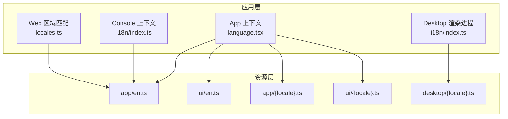
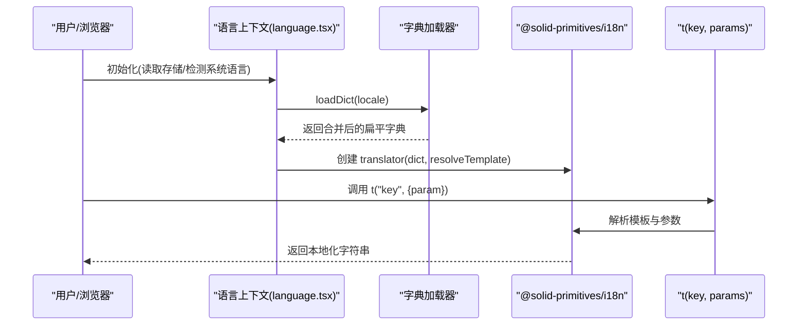
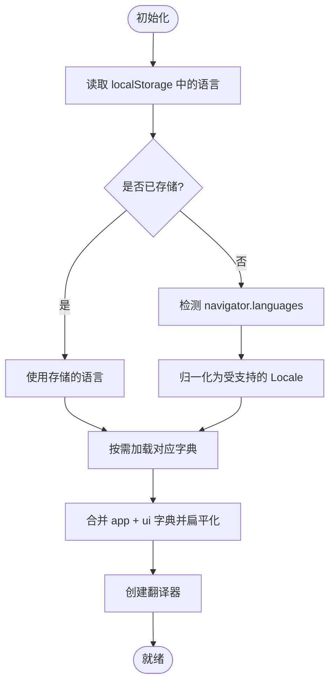
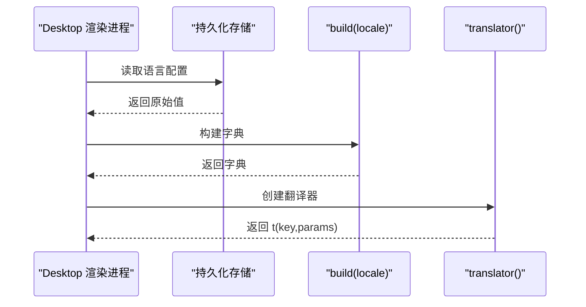
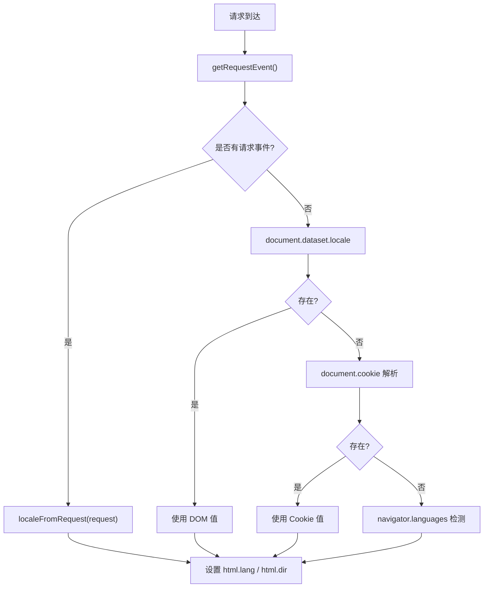
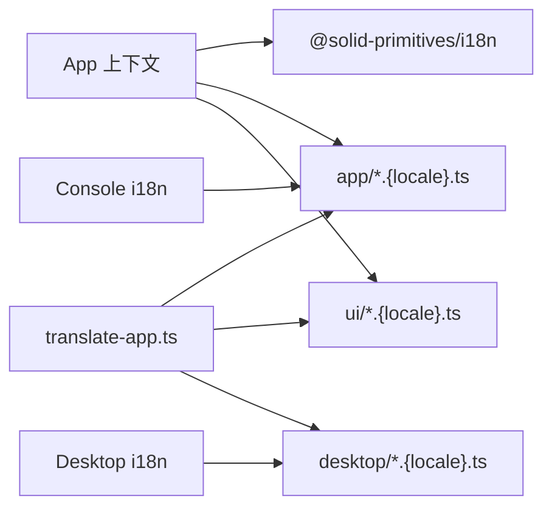

# 国际化（i18n）

<cite>
**本文引用的文件**   
- [packages/app/src/context/language.tsx](file://packages/app/src/context/language.tsx)
- [packages/app/src/i18n/parity.test.ts](file://packages/app/src/i18n/parity.test.ts)
- [packages/desktop/src/renderer/i18n/index.ts](file://packages/desktop/src/renderer/i18n/index.ts)
- [packages/console/app/src/i18n/index.ts](file://packages/console/app/src/i18n/index.ts)
- [packages/console/app/src/lib/language.ts](file://packages/console/app/src/lib/language.ts)
- [packages/web/src/i18n/locales.ts](file://packages/web/src/i18n/locales.ts)
- [script/translate-app.ts](file://script/translate-app.ts)
- [packages/app/src/components/session/session-context-format.ts](file://packages/app/src/components/session/session-context-format.ts)
</cite>

## 目录
1. [简介](#简介)
2. [项目结构](#项目结构)
3. [核心组件](#核心组件)
4. [架构总览](#架构总览)
5. [详细组件分析](#详细组件分析)
6. [依赖关系分析](#依赖关系分析)
7. [性能考量](#性能考量)
8. [故障排查指南](#故障排查指南)
9. [结论](#结论)
10. [附录](#附录)

## 简介
本文件系统化梳理 openNovel 的国际化（i18n）体系，覆盖多语言支持架构、语言包管理与加载策略、文本插值与复数处理、日期/时间/数字/货币本地化格式、RTL 支持与方向切换、新增语言流程、术语表管理、翻译审核与工具链使用及调试方法。文档面向不同技术背景的读者，提供从概览到代码级的完整说明。

## 项目结构
openNovel 的 i18n 能力分布在多个子包中：
- App（桌面/浏览器应用）：基于 @solid-primitives/i18n 实现运行时翻译、动态加载字典、语言检测与持久化。
- UI 库：独立的 i18n 字典，与应用字典合并后统一对外暴露。
- Desktop（Electron 渲染进程）：独立初始化流程，读取持久化存储并构建字典。
- Console（服务端/SSR 场景）：从请求头/Cookie/DOM 数据解析语言，设置 lang/dir。
- Web（站点/文档）：根据 URL/请求匹配区域，映射到具体语言标签。
- 脚本工具：translate-app.ts 用于自动化同步翻译、校验占位符一致性、驱动 AI 翻译与审核。

图表来源 
- [packages/app/src/context/language.tsx:1-244](file://packages/app/src/context/language.tsx#L1-L244)
- [packages/desktop/src/renderer/i18n/index.ts:77-109](file://packages/desktop/src/renderer/i18n/index.ts#L77-L109)
- [packages/console/app/src/i18n/index.ts:21-45](file://packages/console/app/src/i18n/index.ts#L21-L45)
- [packages/web/src/i18n/locales.ts:95-117](file://packages/web/src/i18n/locales.ts#L95-L117)

章节来源
- [packages/app/src/context/language.tsx:1-244](file://packages/app/src/context/language.tsx#L1-L244)
- [packages/desktop/src/renderer/i18n/index.ts:77-109](file://packages/desktop/src/renderer/i18n/index.ts#L77-L109)
- [packages/console/app/src/i18n/index.ts:21-45](file://packages/console/app/src/i18n/index.ts#L21-L45)
- [packages/web/src/i18n/locales.ts:95-117](file://packages/web/src/i18n/locales.ts#L95-L117)

## 核心组件
- 语言上下文与提供者（App）：维护当前 locale、intl 映射、字典加载与缓存、t 函数、设置语言并持久化。
- 语言检测与归一化：依据 navigator.languages、Cookie、localStorage、DOM data-* 属性等优先级确定语言。
- 字典加载策略：英文作为基础字典，其他语言按需动态 import 并与 UI 字典合并，扁平化后供 t 使用。
- Desktop 初始化：从持久化存储读取语言，构建字典并创建翻译器。
- Console SSR：从请求头/Cookie/DOM 解析语言，设置 html.lang 与 dir。
- Web 区域匹配：将浏览器 Accept-Language 或 URL 参数映射为站点可用语言标签。

章节来源
- [packages/app/src/context/language.tsx:10-124](file://packages/app/src/context/language.tsx#L10-L124)
- [packages/app/src/context/language.tsx:141-197](file://packages/app/src/context/language.tsx#L141-L197)
- [packages/desktop/src/renderer/i18n/index.ts:164-194](file://packages/desktop/src/renderer/i18n/index.ts#L164-L194)
- [packages/console/app/src/i18n/index.ts:21-45](file://packages/console/app/src/i18n/index.ts#L21-L45)
- [packages/console/app/src/lib/language.ts:239-285](file://packages/console/app/src/lib/language.ts#L239-L285)
- [packages/web/src/i18n/locales.ts:95-117](file://packages/web/src/i18n/locales.ts#L95-L117)

## 架构总览
下图展示从用户环境到翻译输出的关键路径：语言检测 → 字典选择与合并 → 模板解析与插值 → 输出字符串。

图表来源 
- [packages/app/src/context/language.tsx:100-135](file://packages/app/src/context/language.tsx#L100-L135)
- [packages/app/src/context/language.tsx:218-223](file://packages/app/src/context/language.tsx#L218-L223)

## 详细组件分析

### App 语言上下文与字典加载
- 支持的 Locale 集合与 Intl 映射：集中定义，保证 UI 显示名称与系统格式化一致。
- 字典合并策略：应用字典与 UI 字典分别 import，合并后再扁平化，确保键空间统一。
- 懒加载与缓存：非英文字典按需 import 并缓存，避免首屏冗余。
- 语言检测优先级：localStorage → detectLocale(navigator) → 默认 en。
- 副作用：更新 document.documentElement.lang 与 Cookie，便于服务端与 SEO 识别。

图表来源 
- [packages/app/src/context/language.tsx:141-197](file://packages/app/src/context/language.tsx#L141-L197)
- [packages/app/src/context/language.tsx:100-135](file://packages/app/src/context/language.tsx#L100-L135)

章节来源
- [packages/app/src/context/language.tsx:10-124](file://packages/app/src/context/language.tsx#L10-L124)
- [packages/app/src/context/language.tsx:141-197](file://packages/app/src/context/language.tsx#L141-L197)
- [packages/app/src/context/language.tsx:218-223](file://packages/app/src/context/language.tsx#L218-L223)

### Desktop 渲染进程 i18n
- 语言检测：优先读取持久化存储（window.api.storeGet），回退到系统语言检测。
- 构建字典：根据当前 locale 构建字典并创建翻译器。
- 初始化入口：initI18n 返回 Promise，确保首次初始化幂等。

图表来源 
- [packages/desktop/src/renderer/i18n/index.ts:164-194](file://packages/desktop/src/renderer/i18n/index.ts#L164-L194)
- [packages/desktop/src/renderer/i18n/index.ts:77-109](file://packages/desktop/src/renderer/i18n/index.ts#L77-L109)

章节来源
- [packages/desktop/src/renderer/i18n/index.ts:77-109](file://packages/desktop/src/renderer/i18n/index.ts#L77-L109)
- [packages/desktop/src/renderer/i18n/index.ts:164-194](file://packages/desktop/src/renderer/i18n/index.ts#L164-L194)

### Console SSR 语言解析与方向设置
- 初始语言来源：请求事件 → DOM dataset.locale → Cookie → navigator.languages。
- 设置 HTML 属性：lang 与 dir，确保搜索引擎与辅助技术正确识别。
- 路由与重定向：结合 route/strip 生成带语言的链接。

图表来源 
- [packages/console/app/src/i18n/index.ts:1-50](file://packages/console/app/src/i18n/index.ts#L1-L50)
- [packages/console/app/src/lib/language.ts:239-285](file://packages/console/app/src/lib/language.ts#L239-L285)

章节来源
- [packages/console/app/src/i18n/index.ts:1-50](file://packages/console/app/src/i18n/index.ts#L1-L50)
- [packages/console/app/src/lib/language.ts:239-285](file://packages/console/app/src/lib/language.ts#L239-L285)

### Web 区域匹配
- 解析输入：Accept-Language 或 URL 参数。
- 映射规则：中文区分简繁体；葡萄牙语映射为 pt-br；挪威语变体映射为 nb。
- 别名与起始匹配：支持别名表与前缀匹配。

章节来源
- [packages/web/src/i18n/locales.ts:95-117](file://packages/web/src/i18n/locales.ts#L95-L117)

### 文本插值与复数处理
- 插值机制：通过 @solid-primitives/i18n 的 resolveTemplate 解析 {{param}} 形式的占位符。
- 复数形式：测试用例验证了 one/other 键的使用与占位符一致性（如 count）。
- 键空间一致性：parity.test 强制所有非英语语言包含英语源键，且占位符顺序一致。

章节来源
- [packages/app/src/i18n/parity.test.ts:45-101](file://packages/app/src/i18n/parity.test.ts#L45-L101)
- [packages/app/src/context/language.tsx:218-223](file://packages/app/src/context/language.tsx#L218-L223)

### 日期、时间、数字与货币本地化
- 数字与百分比：使用 Number.toLocaleString(locale)。
- 时间：使用 luxon.DateTime.setLocale(locale).toLocaleString(...)。
- 建议：货币可使用 Intl.NumberFormat({ style: "currency", currency }) 配合 locale。

章节来源
- [packages/app/src/components/session/session-context-format.ts:1-20](file://packages/app/src/components/session/session-context-format.ts#L1-L20)

### RTL（从右到左）支持与方向切换
- Console 在设置 lang 的同时设置 dir，以支持阿拉伯语等 RTL 语言。
- App/Web 侧可通过 CSS 逻辑属性与布局适配 RTL。

章节来源
- [packages/console/app/src/i18n/index.ts:45-50](file://packages/console/app/src/i18n/index.ts#L45-L50)

### 新增语言流程
- 添加字典文件：在 app/ui/desktop 三处按约定创建 {locale}.ts，导出 dict。
- 注册语言：在语言检测与加载器中添加新 locale。
- 术语表：在 .opencode/glossary/{locale}.md 维护术语，供翻译工具使用。
- 校验与审核：运行 parity 测试与 translate-app 检查缺失键、多余键与占位符不一致。

章节来源
- [script/translate-app.ts:86-98](file://script/translate-app.ts#L86-L98)
- [packages/app/src/i18n/parity.test.ts:24-43](file://packages/app/src/i18n/parity.test.ts#L24-L43)

### i18n 工具链与调试
- translate-app.ts：
  - 扫描各域字典差异（missing/extra/placeholders）。
  - 并发执行 OpenCode 翻译任务，支持 dry-run/check。
  - 导出会话并校验模型与变体。
- 调试建议：
  - 使用 --dry-run 预览变更，--check 在 CI 中阻断不合规提交。
  - 查看 parity.test 失败信息定位缺失键或占位符问题。
  - 控制台打印 t(key) 结果，确认模板解析正确。

章节来源
- [script/translate-app.ts:55-84](file://script/translate-app.ts#L55-L84)
- [script/translate-app.ts:171-176](file://script/translate-app.ts#L171-L176)
- [script/translate-app.ts:298-307](file://script/translate-app.ts#L298-L307)
- [script/translate-app.ts:337-436](file://script/translate-app.ts#L337-L436)
- [packages/app/src/i18n/parity.test.ts:45-101](file://packages/app/src/i18n/parity.test.ts#L45-L101)

## 依赖关系分析
- 运行时依赖：@solid-primitives/i18n 提供翻译器与模板解析。
- 资源依赖：app 与 ui 两套字典，desktop 独立字典。
- 工具依赖：Bun/OpenCode CLI 用于自动化翻译与校验。

图表来源 
- [packages/app/src/context/language.tsx:100-135](file://packages/app/src/context/language.tsx#L100-L135)
- [script/translate-app.ts:86-98](file://script/translate-app.ts#L86-L98)

章节来源
- [packages/app/src/context/language.tsx:100-135](file://packages/app/src/context/language.tsx#L100-L135)
- [script/translate-app.ts:86-98](file://script/translate-app.ts#L86-L98)

## 性能考量
- 字典懒加载：仅加载当前语言所需字典，减少首屏体积。
- 字典缓存：内存 Map 缓存已加载字典，避免重复 import。
- 扁平化开销：仅在首次加载时进行扁平化，后续直接复用。
- 并行翻译：translate-app 支持并发执行，缩短批量翻译耗时。

[本节为通用指导，无需特定文件引用]

## 故障排查指南
- 翻译缺失键：运行 parity.test 或 translate-app --check，定位 missing keys。
- 占位符不一致：检查 source/target 的 {{param}} 列表是否一致。
- 语言未生效：检查 localStorage 存储键、Cookie、navigator.languages 与 normalizeLocale。
- SSR 方向错误：确认 console 设置 html.dir 与 html.lang。
- 数字/时间格式异常：确认传入 locale 与 Intl/Luxon 支持。

章节来源
- [packages/app/src/i18n/parity.test.ts:45-101](file://packages/app/src/i18n/parity.test.ts#L45-L101)
- [script/translate-app.ts:171-176](file://script/translate-app.ts#L171-L176)
- [packages/console/app/src/i18n/index.ts:45-50](file://packages/console/app/src/i18n/index.ts#L45-L50)
- [packages/app/src/components/session/session-context-format.ts:1-20](file://packages/app/src/components/session/session-context-format.ts#L1-L20)

## 结论
openNovel 的 i18n 体系以“基础字典 + 按需加载 + 扁平化合并”为核心，结合严格的键一致性校验与自动化工具链，实现了跨端一致的本地化体验。通过清晰的检测优先级、持久化与 SSR 支持，以及完善的工具链与调试手段，团队可高效扩展与维护多语言内容。

[本节为总结性内容，无需特定文件引用]

## 附录
- 常用命令
  - 检查翻译差异：bun run translate:app -- <locale|all> --check
  - 预览翻译变更：bun run translate:app -- <locale|all> --dry-run
  - 运行一致性测试：bun test packages/app/src/i18n/parity.test.ts
- 最佳实践
  - 新增键时同步更新所有目标语言字典。
  - 保持占位符命名与顺序一致。
  - 为复杂文案编写术语表，提升一致性。
  - 对数字/时间/货币使用 Intl/Luxon 的本地化 API。

[本节为补充信息，无需特定文件引用]