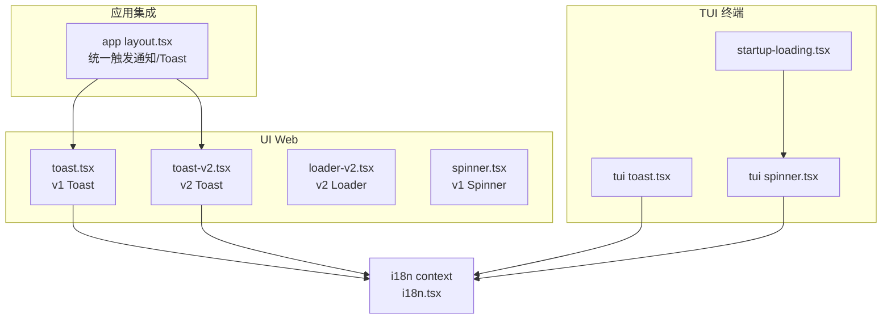
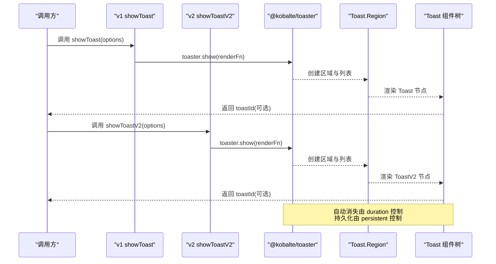
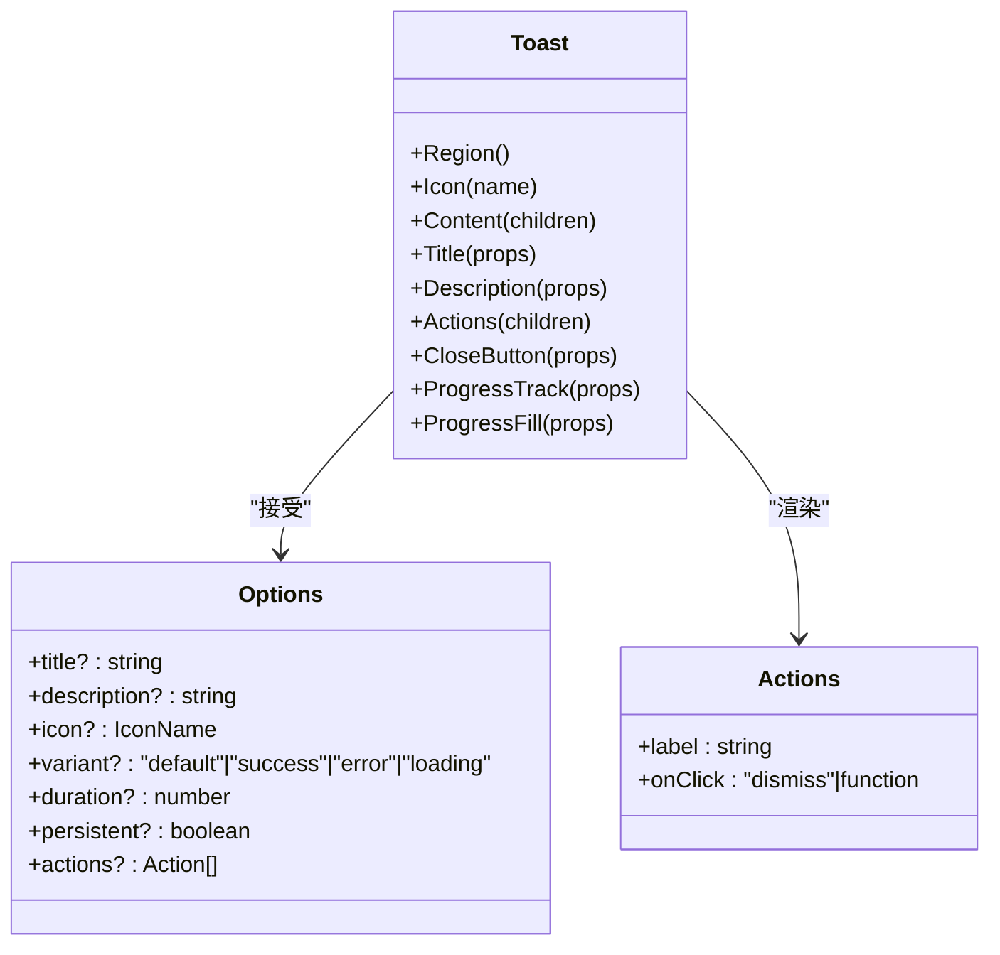
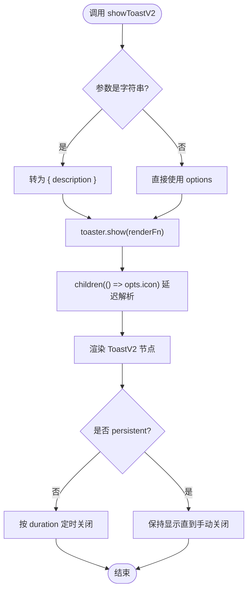
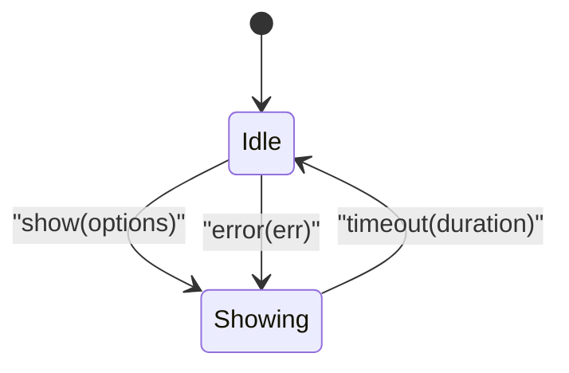
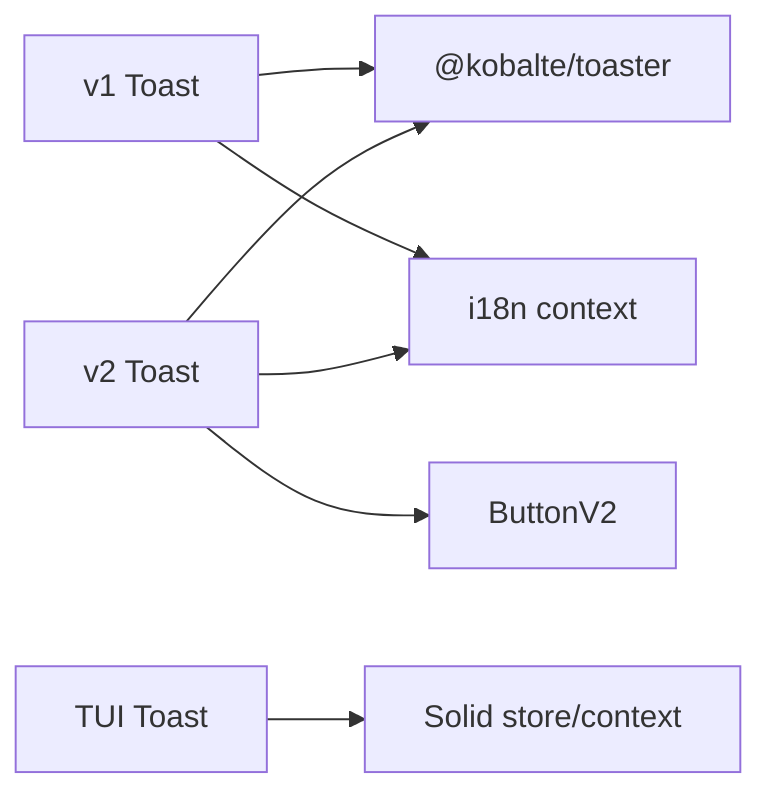

# 反馈组件

<cite>
**本文引用的文件**   
- [packages/ui/src/components/toast.tsx](file://packages/ui/src/components/toast.tsx)
- [packages/ui/src/v2/components/toast-v2.tsx](file://packages/ui/src/v2/components/toast-v2.tsx)
- [packages/tui/src/ui/toast.tsx](file://packages/tui/src/ui/toast.tsx)
- [packages/ui/src/context/i18n.tsx](file://packages/ui/src/context/i18n.tsx)
- [packages/app/src/pages/layout.tsx](file://packages/app/src/pages/layout.tsx)
- [packages/app/test-browser/toast-owner.test.ts](file://packages/app/test-browser/toast-owner.test.ts)
- [packages/ui/src/v2/components/loader-v2.tsx](file://packages/ui/src/v2/components/loader-v2.tsx)
- [packages/ui/src/components/spinner.tsx](file://packages/ui/src/components/spinner.tsx)
- [packages/tui/src/component/spinner.tsx](file://packages/tui/src/component/spinner.tsx)
- [packages/tui/src/component/startup-loading.tsx](file://packages/tui/src/component/startup-loading.tsx)
</cite>

## 目录
1. [简介](#简介)
2. [项目结构](#项目结构)
3. [核心组件](#核心组件)
4. [架构总览](#架构总览)
5. [详细组件分析](#详细组件分析)
6. [依赖分析](#依赖分析)
7. [性能考虑](#性能考虑)
8. [故障排查指南](#故障排查指南)
9. [结论](#结论)
10. [附录：使用示例与最佳实践](#附录使用示例与最佳实践)

## 简介
本文件为 openNovel 的“反馈组件”提供系统化文档，覆盖消息提示（Toast）、加载指示器（Spinner/Loader）与警告信息等。内容包含设计规范、API 接口、显示/隐藏控制、优先级管理、自动消失与手动操作、全局反馈系统架构与消息队列管理、自定义样式与主题适配、多语言支持与国际化配置，以及完整的使用场景示例路径。

## 项目结构
openNovel 的反馈能力分布在多个包中：
- UI 层（Web）：v1 与 v2 两套 Toast 组件，分别位于 packages/ui/src/components 与 packages/ui/src/v2/components
- TUI 层（终端）：基于 Solid + OpenTUI 的轻量 Toast 与 Spinner
- 应用集成：在页面布局中统一触发通知与持久化 Toast
- 国际化：UI 上下文 i18n 提供翻译能力

图表来源
- [packages/ui/src/components/toast.tsx:1-186](file://packages/ui/src/components/toast.tsx#L1-L186)
- [packages/ui/src/v2/components/toast-v2.tsx:1-147](file://packages/ui/src/v2/components/toast-v2.tsx#L1-L147)
- [packages/ui/src/v2/components/loader-v2.tsx:1-31](file://packages/ui/src/v2/components/loader-v2.tsx#L1-L31)
- [packages/ui/src/components/spinner.tsx:1-52](file://packages/ui/src/components/spinner.tsx#L1-L52)
- [packages/tui/src/ui/toast.tsx:1-103](file://packages/tui/src/ui/toast.tsx#L1-L103)
- [packages/tui/src/component/spinner.tsx:1-26](file://packages/tui/src/component/spinner.tsx#L1-L26)
- [packages/tui/src/component/startup-loading.tsx:1-63](file://packages/tui/src/component/startup-loading.tsx#L1-L63)
- [packages/app/src/pages/layout.tsx:418-484](file://packages/app/src/pages/layout.tsx#L418-L484)
- [packages/ui/src/context/i18n.tsx:1-39](file://packages/ui/src/context/i18n.tsx#L1-L39)

章节来源
- [packages/ui/src/components/toast.tsx:1-186](file://packages/ui/src/components/toast.tsx#L1-L186)
- [packages/ui/src/v2/components/toast-v2.tsx:1-147](file://packages/ui/src/v2/components/toast-v2.tsx#L1-L147)
- [packages/tui/src/ui/toast.tsx:1-103](file://packages/tui/src/ui/toast.tsx#L1-L103)
- [packages/app/src/pages/layout.tsx:418-484](file://packages/app/src/pages/layout.tsx#L418-L484)
- [packages/ui/src/context/i18n.tsx:1-39](file://packages/ui/src/context/i18n.tsx#L1-L39)

## 核心组件
- v1 Toast（packages/ui/src/components/toast.tsx）
  - 通过 @kobalte/core/toast 的 toaster 暴露 show/promise API
  - 支持 title/description/icon/variant/duration/persistent/actions
  - 提供 showToast 与 showPromiseToast 两个便捷入口
- v2 Toast（packages/ui/src/v2/components/toast-v2.tsx）
  - 与 v1 类似，但 icon 以 JSX.Element 形式传入，且延迟到渲染时解析以避免无主计算
  - 提供 showToastV2 与 toasterV2.dismiss 等能力
- TUI Toast（packages/tui/src/ui/toast.tsx）
  - 基于 Solid store 的当前单条消息状态，支持 duration 自动消失
  - 提供 useToast() 与 ToastProvider
- 加载指示器
  - v2 Loader（packages/ui/src/v2/components/loader-v2.tsx）
  - v1 Spinner（packages/ui/src/components/spinner.tsx）
  - TUI Spinner（packages/tui/src/component/spinner.tsx），支持动画开关与颜色
  - 启动加载（packages/tui/src/component/startup-loading.tsx）

章节来源
- [packages/ui/src/components/toast.tsx:108-186](file://packages/ui/src/components/toast.tsx#L108-L186)
- [packages/ui/src/v2/components/toast-v2.tsx:83-147](file://packages/ui/src/v2/components/toast-v2.tsx#L83-L147)
- [packages/tui/src/ui/toast.tsx:7-103](file://packages/tui/src/ui/toast.tsx#L7-L103)
- [packages/ui/src/v2/components/loader-v2.tsx:1-31](file://packages/ui/src/v2/components/loader-v2.tsx#L1-L31)
- [packages/ui/src/components/spinner.tsx:1-52](file://packages/ui/src/components/spinner.tsx#L1-L52)
- [packages/tui/src/component/spinner.tsx:1-26](file://packages/tui/src/component/spinner.tsx#L1-L26)
- [packages/tui/src/component/startup-loading.tsx:1-63](file://packages/tui/src/component/startup-loading.tsx#L1-L63)

## 架构总览
反馈系统的整体流程如下：
- 调用方通过 showToast/showPromiseToast 或 showToastV2 触发
- 底层基于 @kobalte/core/toast 的 toaster 进行消息入队与渲染
- 区域容器（Region）负责 Portal 挂载与列表渲染
- 自动消失由 duration 控制；持久化需设置 persistent
- 动作按钮可执行回调并关闭
- 错误处理可通过 error 快捷方法或 Promise 变体
- 国际化文本通过 i18n 上下文注入

图表来源
- [packages/ui/src/components/toast.tsx:118-158](file://packages/ui/src/components/toast.tsx#L118-L158)
- [packages/ui/src/v2/components/toast-v2.tsx:98-140](file://packages/ui/src/v2/components/toast-v2.tsx#L98-L140)
- [packages/ui/src/components/toast.tsx:166-185](file://packages/ui/src/components/toast.tsx#L166-L185)

## 详细组件分析

### v1 Toast（packages/ui/src/components/toast.tsx）
- 设计要点
  - 通过 data-component="toast" 与 data-slot 标记便于样式定位
  - 支持 variant: default/success/error/loading
  - actions 支持 dismiss 或自定义回调后自动关闭
  - 进度条通过 ProgressTrack/ProgressFill 组合
- API 概览
  - showToast(options | string)
  - showPromiseToast(promise | () => Promise, options)
  - Toast.Region / Toast.Icon / Toast.Content / Toast.Title / Toast.Description / Toast.Actions / Toast.CloseButton / Toast.ProgressTrack / Toast.ProgressFill
- 数据流
  - 字符串参数会被转换为 { description }
  - 渲染函数接收 props.toastId，用于后续关闭
- 无障碍
  - CloseButton 使用 i18n 文案作为 aria-label

图表来源
- [packages/ui/src/components/toast.tsx:28-97](file://packages/ui/src/components/toast.tsx#L28-L97)
- [packages/ui/src/components/toast.tsx:108-116](file://packages/ui/src/components/toast.tsx#L108-L116)
- [packages/ui/src/components/toast.tsx:118-158](file://packages/ui/src/components/toast.tsx#L118-L158)

章节来源
- [packages/ui/src/components/toast.tsx:1-186](file://packages/ui/src/components/toast.tsx#L1-L186)

### v2 Toast（packages/ui/src/v2/components/toast-v2.tsx）
- 设计要点
  - icon 以 children(() => opts.icon) 延迟解析，避免在调用时创建无主计算
  - 使用 ButtonV2 作为动作按钮，支持 primary/secondary 变体
  - data-component="toast-v2" 与 slot 命名空间隔离样式
- API 概览
  - showToastV2(options | string)
  - toasterV2.dismiss(id)
  - ToastV2.Region / Icon / Content / Title / Description / Actions / CloseButton
- 行为
  - 默认自动消失；persistent=true 时不自动消失
  - Promise 变体支持 loading/success/error 三种状态渲染

图表来源
- [packages/ui/src/v2/components/toast-v2.tsx:98-140](file://packages/ui/src/v2/components/toast-v2.tsx#L98-L140)

章节来源
- [packages/ui/src/v2/components/toast-v2.tsx:1-147](file://packages/ui/src/v2/components/toast-v2.tsx#L1-L147)
- [packages/app/test-browser/toast-owner.test.ts:1-26](file://packages/app/test-browser/toast-owner.test.ts#L1-L26)

### TUI Toast（packages/tui/src/ui/toast.tsx）
- 设计要点
  - 使用 Solid store 维护 currentToast，仅显示一条
  - 支持 duration 自动消失；error 快捷方法封装常见错误展示
  - 通过 useToast() 获取上下文，必须在 ToastProvider 内使用
- 数据结构
  - ToastOptions: title/message/variant/duration
- 交互
  - 自动计时器在 duration 后清空 currentToast

图表来源
- [packages/tui/src/ui/toast.tsx:53-85](file://packages/tui/src/ui/toast.tsx#L53-L85)

章节来源
- [packages/tui/src/ui/toast.tsx:1-103](file://packages/tui/src/ui/toast.tsx#L1-L103)

### 加载指示器（Spinner/Loader）
- v2 Loader（packages/ui/src/v2/components/loader-v2.tsx）
  - SVG 圆形进度环，CSS 驱动旋转动画，支持 prefers-reduced-motion
- v1 Spinner（packages/ui/src/components/spinner.tsx）
  - 16 宫格方块动画，随机延迟与时长，适合页面级加载
- TUI Spinner（packages/tui/src/component/spinner.tsx）
  - 帧动画字符集，支持颜色与动画开关
- 启动加载（packages/tui/src/component/startup-loading.tsx）
  - 根据 ready() 信号控制显示，带最小显示时长与清理逻辑

章节来源
- [packages/ui/src/v2/components/loader-v2.tsx:1-31](file://packages/ui/src/v2/components/loader-v2.tsx#L1-L31)
- [packages/ui/src/components/spinner.tsx:1-52](file://packages/ui/src/components/spinner.tsx#L1-L52)
- [packages/tui/src/component/spinner.tsx:1-26](file://packages/tui/src/component/spinner.tsx#L1-L26)
- [packages/tui/src/component/startup-loading.tsx:1-63](file://packages/tui/src/component/startup-loading.tsx#L1-L63)

## 依赖分析
- 外部依赖
  - @kobalte/core/toast：提供 toaster、Region、List、Title、Description、CloseButton、ProgressTrack/ProgressFill
- 内部依赖
  - i18n 上下文：为关闭按钮等提供本地化文案
  - ButtonV2：v2 Toast 的动作按钮
  - Solid 响应式：store、createContext、Show、Portal
- 耦合关系
  - v1/v2 Toast 均依赖 @kobalte/toaster，彼此独立
  - TUI Toast 与主题上下文解耦，仅依赖 Solid store

图表来源
- [packages/ui/src/components/toast.tsx:1-9](file://packages/ui/src/components/toast.tsx#L1-L9)
- [packages/ui/src/v2/components/toast-v2.tsx:1-7](file://packages/ui/src/v2/components/toast-v2.tsx#L1-L7)
- [packages/ui/src/context/i18n.tsx:1-39](file://packages/ui/src/context/i18n.tsx#L1-L39)

章节来源
- [packages/ui/src/components/toast.tsx:1-9](file://packages/ui/src/components/toast.tsx#L1-L9)
- [packages/ui/src/v2/components/toast-v2.tsx:1-7](file://packages/ui/src/v2/components/toast-v2.tsx#L1-L7)
- [packages/ui/src/context/i18n.tsx:1-39](file://packages/ui/src/context/i18n.tsx#L1-L39)

## 性能考虑
- 避免在调用时创建无主计算：v2 Toast 使用 children(() => opts.icon) 延迟解析图标，确保只在渲染时读取，避免不必要的依赖追踪与内存泄漏
- 自动消失定时器使用 unref() 避免阻止进程退出（TUI）
- 大量 Toast 场景下，建议合理设置 duration，避免频繁重排
- 动画与可访问性：v2 Loader 遵循 prefers-reduced-motion，减少动画对敏感用户的干扰

章节来源
- [packages/app/test-browser/toast-owner.test.ts:1-26](file://packages/app/test-browser/toast-owner.test.ts#L1-L26)
- [packages/tui/src/ui/toast.tsx:58-68](file://packages/tui/src/ui/toast.tsx#L58-L68)
- [packages/ui/src/v2/components/loader-v2.css:28-32](file://packages/ui/src/v2/components/loader-v2.css#L28-L32)

## 故障排查指南
- 未包裹 ToastProvider（TUI）
  - 现象：useToast 抛出错误
  - 解决：在根组件中使用 <ToastProvider> 包裹
- 未渲染 Region（Web）
  - 现象：Toast 无法显示
  - 解决：在页面任意位置渲染 <Toast.Region /> 或 <ToastV2.Region />
- 图标不显示（v2）
  - 现象：传入的 JSX 元素未渲染
  - 原因：未在渲染阶段解析
  - 解决：确保使用 children(() => opts.icon) 模式（已在实现中处理）
- 自动消失不生效
  - 检查 duration 是否为正数；persistent 是否被设置为 true
- 动作按钮无效
  - 检查 onClick 是否为函数；若为 "dismiss" 将直接关闭

章节来源
- [packages/tui/src/ui/toast.tsx:96-102](file://packages/tui/src/ui/toast.tsx#L96-L102)
- [packages/ui/src/components/toast.tsx:12-20](file://packages/ui/src/components/toast.tsx#L12-L20)
- [packages/ui/src/v2/components/toast-v2.tsx:11-19](file://packages/ui/src/v2/components/toast-v2.tsx#L11-L19)
- [packages/ui/src/components/toast.tsx:137-157](file://packages/ui/src/components/toast.tsx#L137-L157)
- [packages/ui/src/v2/components/toast-v2.tsx:118-136](file://packages/ui/src/v2/components/toast-v2.tsx#L118-L136)

## 结论
openNovel 的反馈组件体系在 Web 与 TUI 两端提供了统一的体验：
- Web 端通过 v1/v2 两套 Toast，满足从基础到高级的需求
- TUI 端提供简洁的消息提示与加载指示器
- 通过 i18n 上下文实现多语言支持
- 借助 @kobalte/toaster 实现稳定的消息队列与生命周期管理
- 通过合理的 API 设计与性能优化，保障易用性与稳定性

## 附录：使用示例与最佳实践
- 基础消息提示（v1）
  - 使用 showToast({ description }) 或 showToast("文本")
  - 参考路径：[packages/ui/src/components/toast.tsx:118-158](file://packages/ui/src/components/toast.tsx#L118-L158)
- 成功/错误/加载变体（v1）
  - 设置 variant 为 success/error/loading
  - 参考路径：[packages/ui/src/components/toast.tsx:101-116](file://packages/ui/src/components/toast.tsx#L101-L116)
- 异步任务反馈（v1）
  - 使用 showPromiseToast(promise, { loading, success, error })
  - 参考路径：[packages/ui/src/components/toast.tsx:166-185](file://packages/ui/src/components/toast.tsx#L166-L185)
- 带动作按钮的提示（v1）
  - 在 actions 中定义 label 与 onClick，支持 "dismiss"
  - 参考路径：[packages/ui/src/components/toast.tsx:137-157](file://packages/ui/src/components/toast.tsx#L137-L157)
- 基础消息提示（v2）
  - 使用 showToastV2({ description })，图标以 JSX.Element 传入
  - 参考路径：[packages/ui/src/v2/components/toast-v2.tsx:98-140](file://packages/ui/src/v2/components/toast-v2.tsx#L98-L140)
- 手动关闭（v2）
  - 使用 toasterV2.dismiss(id)
  - 参考路径：[packages/app/test-browser/toast-owner.test.ts:1-26](file://packages/app/test-browser/toast-owner.test.ts#L1-L26)
- 持久化提示（v1/v2）
  - 设置 persistent=true 防止自动消失
  - 参考路径：[packages/ui/src/components/toast.tsx:124-125](file://packages/ui/src/components/toast.tsx#L124-L125), [packages/ui/src/v2/components/toast-v2.tsx:103](file://packages/ui/src/v2/components/toast-v2.tsx#L103)
- 全局触发与导航（应用集成）
  - 在布局中统一触发通知与持久化 Toast，并携带动作跳转
  - 参考路径：[packages/app/src/pages/layout.tsx:418-484](file://packages/app/src/pages/layout.tsx#L418-L484)
- TUI 消息提示
  - 使用 ToastProvider 包裹，调用 useToast().show(...)
  - 参考路径：[packages/tui/src/ui/toast.tsx:91-102](file://packages/tui/src/ui/toast.tsx#L91-L102)
- 加载指示器
  - v2 Loader：适用于紧凑加载状态
    - 参考路径：[packages/ui/src/v2/components/loader-v2.tsx:1-31](file://packages/ui/src/v2/components/loader-v2.tsx#L1-L31)
  - v1 Spinner：适用于页面级加载
    - 参考路径：[packages/ui/src/components/spinner.tsx:1-52](file://packages/ui/src/components/spinner.tsx#L1-L52)
  - TUI Spinner：支持动画开关与颜色
    - 参考路径：[packages/tui/src/component/spinner.tsx:1-26](file://packages/tui/src/component/spinner.tsx#L1-L26)
- 国际化
  - 使用 i18n 上下文 t(key, params) 提供本地化文案
  - 参考路径：[packages/ui/src/context/i18n.tsx:1-39](file://packages/ui/src/context/i18n.tsx#L1-L39)