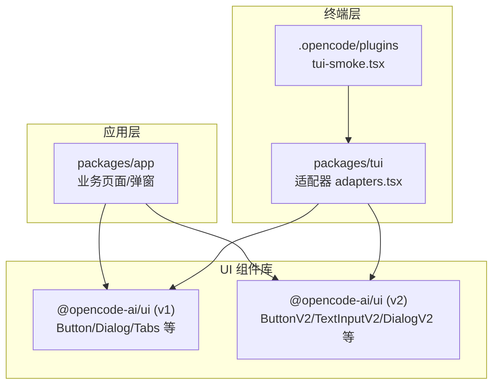
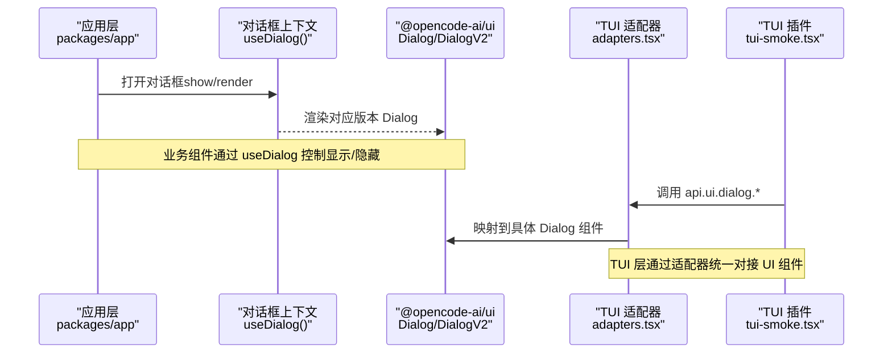
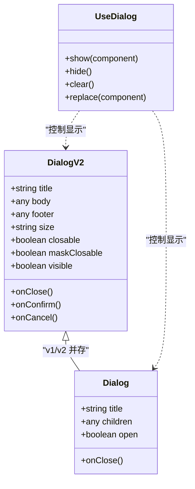
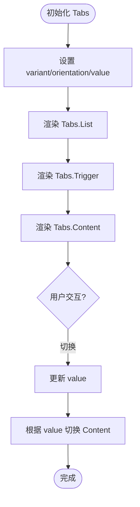
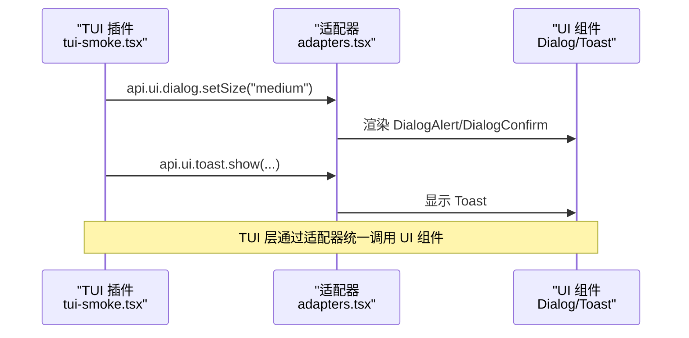
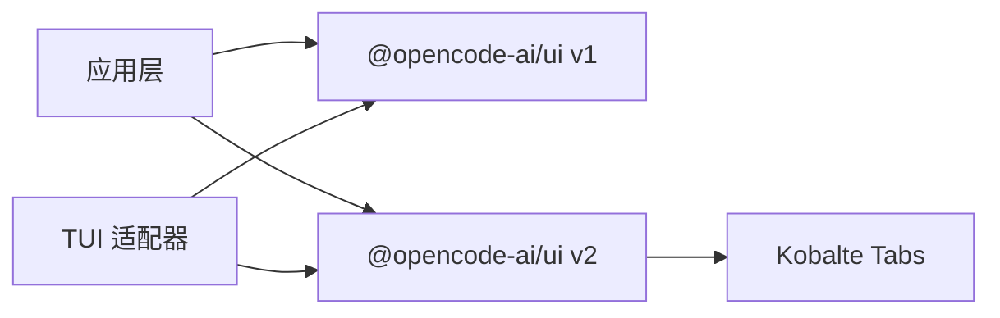

# 基础组件

<cite>
**本文引用的文件**   
- [packages/ui/src/components/tabs.stories.tsx](file://packages/ui/src/components/tabs.stories.tsx)
- [packages/app/src/components/dialog-connect-provider.stories.tsx](file://packages/app/src/components/dialog-connect-provider.stories.tsx)
- [packages/app/src/components/dialog-command-palette-v2.tsx](file://packages/app/src/components/dialog-command-palette-v2.tsx)
- [packages/app/src/components/dialog-edit-project-v2.tsx](file://packages/app/src/components/dialog-edit-project-v2.tsx)
- [packages/app/src/components/dialog-connect-provider.tsx](file://packages/app/src/components/dialog-connect-provider.tsx)
- [packages/app/src/components/dialog-custom-provider.tsx](file://packages/app/src/components/dialog-custom-provider.tsx)
- [packages/app/src/components/dialog-edit-project.tsx](file://packages/app/src/components/dialog-edit-project.tsx)
- [packages/app/src/app.tsx](file://packages/app/src/app.tsx)
- [packages/tui/src/plugin/adapters.tsx](file://packages/tui/src/plugin/adapters.tsx)
- [.opencode/plugins/tui-smoke.tsx](file://.opencode/plugins/tui-smoke.tsx)
</cite>

## 目录
1. [简介](#简介)
2. [项目结构](#项目结构)
3. [核心组件](#核心组件)
4. [架构总览](#架构总览)
5. [详细组件分析](#详细组件分析)
6. [依赖分析](#依赖分析)
7. [性能考虑](#性能考虑)
8. [故障排查指南](#故障排查指南)
9. [结论](#结论)
10. [附录](#附录)

## 简介
本文件为 openNovel 的基础 UI 组件提供系统化文档，覆盖按钮、输入框、对话框、标签页等通用组件的设计规范与实现细节。内容包含：
- 组件 API 接口（属性、事件、插槽）
- 组合使用模式与最佳实践
- 样式定制、主题适配与响应式行为
- 可访问性与键盘导航支持
- 完整示例与使用场景演示

说明：本仓库中 UI 组件以包形式存在并通过 Storybook 展示用法；同时 TUI 层通过适配器桥接至 UI 组件。下文将结合源码与示例进行解读。

## 项目结构
openNovel 的 UI 能力由多个包协作构成：
- @opencode-ai/ui：基础 UI 组件库（按钮、输入框、对话框、标签页等），通过 v1/v2 两套版本共存演进
- packages/app：应用层使用 UI 组件构建页面与弹窗
- packages/tui：终端界面层，通过适配器映射到 UI 组件
- .opencode/plugins：TUI 插件示例，演示对话框栈与内置提示

图表来源
- [packages/app/src/app.tsx](file://packages/app/src/app.tsx)
- [packages/app/src/components/dialog-connect-provider.stories.tsx](file://packages/app/src/components/dialog-connect-provider.stories.tsx)
- [packages/tui/src/plugin/adapters.tsx](file://packages/tui/src/plugin/adapters.tsx)
- [.opencode/plugins/tui-smoke.tsx](file://.opencode/plugins/tui-smoke.tsx)

章节来源
- [packages/app/src/app.tsx](file://packages/app/src/app.tsx)
- [packages/app/src/components/dialog-connect-provider.stories.tsx](file://packages/app/src/components/dialog-connect-provider.stories.tsx)
- [packages/tui/src/plugin/adapters.tsx](file://packages/tui/src/plugin/adapters.tsx)
- [.opencode/plugins/tui-smoke.tsx](file://.opencode/plugins/tui-smoke.tsx)

## 核心组件
本节概述常用基础组件的职责与典型用法要点（基于仓库中的实际使用与 Storybook 文档片段）。

- 按钮 Button/ButtonV2
  - 职责：触发操作的主入口控件
  - 常见属性：变体 variant（如 primary/secondary）、禁用 disabled、尺寸 size
  - 事件：onClick
  - 插槽：默认插槽用于文本或图标
  - 最佳实践：在表单提交、确认操作中使用；避免在同一行放置过多按钮

- 输入框 TextInput/TextInputV2
  - 职责：采集用户文本输入
  - 常见属性：value、placeholder、disabled、readonly、type、hint/error
  - 事件：onChange、onFocus、onBlur、onSubmit（配合表单）
  - 插槽：前缀/后缀图标、辅助说明
  - 最佳实践：始终提供占位符与错误提示；对敏感输入启用掩码

- 对话框 Dialog/DialogV2
  - 职责：模态交互容器，承载标题、正文、操作区
  - 常见属性：title、body、footer、size、closable、maskClosable
  - 事件：onClose、onConfirm、onCancel
  - 插槽：header、body、footer、自定义动作
  - 最佳实践：保持内容聚焦；避免嵌套过深；提供明确的关闭路径

- 标签页 Tabs
  - 职责：分组切换相关面板
  - 常见属性：variant（normal/alt/pill/settings）、orientation（horizontal/vertical）
  - 事件：onChange（当前激活项变化）
  - 组合：Tabs.List + Tabs.Trigger + Tabs.Content
  - 最佳实践：每个 Tab 内容独立渲染；长列表使用虚拟滚动

章节来源
- [packages/ui/src/components/tabs.stories.tsx](file://packages/ui/src/components/tabs.stories.tsx)
- [packages/app/src/components/dialog-connect-provider.stories.tsx](file://packages/app/src/components/dialog-connect-provider.stories.tsx)
- [packages/app/src/components/dialog-command-palette-v2.tsx](file://packages/app/src/components/dialog-command-palette-v2.tsx)
- [packages/app/src/components/dialog-edit-project-v2.tsx](file://packages/app/src/components/dialog-edit-project-v2.tsx)

## 架构总览
下图展示了从应用层到 UI 组件库以及 TUI 适配器的整体调用关系。

图表来源
- [packages/app/src/components/dialog-connect-provider.stories.tsx](file://packages/app/src/components/dialog-connect-provider.stories.tsx)
- [packages/app/src/components/dialog-command-palette-v2.tsx](file://packages/app/src/components/dialog-command-palette-v2.tsx)
- [packages/tui/src/plugin/adapters.tsx](file://packages/tui/src/plugin/adapters.tsx)
- [.opencode/plugins/tui-smoke.tsx](file://.opencode/plugins/tui-smoke.tsx)

## 详细组件分析

### 对话框组件族（Dialog / DialogV2）
- 设计目标
  - 统一的模态交互体验，支持多版本并存（v1 与 v2）
  - 清晰的层级管理（堆栈）与遮罩行为
  - 良好的键盘可达性（Esc 关闭、焦点管理）

- API 概览（基于使用与 Storybook 片段归纳）
  - 属性：title、description/body、footer/actions、size、closable、maskClosable、visible/open
  - 事件：onClose、onConfirm、onCancel、onOpenChange
  - 插槽：header、body、footer、actions
  - 上下文：useDialog() 提供 show/hide/clear/replace 等方法

- 组合模式
  - 简单确认：Dialog + 确认/取消按钮
  - 表单编辑：DialogBody + 多个输入控件 + 提交/重置
  - 命令面板：搜索输入 + 结果列表 + 快捷键

- 可访问性与键盘导航
  - 焦点陷阱：进入对话框后焦点锁定于内部
  - Esc 关闭：默认行为，可通过配置关闭
  - 屏幕阅读器：标题与描述语义化

- 主题与样式
  - 通过 data-component="dialog" 与变体属性定位样式
  - 支持暗色/亮色主题切换

- 示例与参考
  - 连接提供者对话框：[packages/app/src/components/dialog-connect-provider.stories.tsx](file://packages/app/src/components/dialog-connect-provider.stories.tsx)
  - V2 命令面板：[packages/app/src/components/dialog-command-palette-v2.tsx](file://packages/app/src/components/dialog-command-palette-v2.tsx)
  - V2 编辑项目：[packages/app/src/components/dialog-edit-project-v2.tsx](file://packages/app/src/components/dialog-edit-project-v2.tsx)
  - V1 对话框使用：[packages/app/src/components/dialog-connect-provider.tsx](file://packages/app/src/components/dialog-connect-provider.tsx)、[packages/app/src/components/dialog-custom-provider.tsx](file://packages/app/src/components/dialog-custom-provider.tsx)、[packages/app/src/components/dialog-edit-project.tsx](file://packages/app/src/components/dialog-edit-project.tsx)

图表来源
- [packages/app/src/components/dialog-connect-provider.stories.tsx](file://packages/app/src/components/dialog-connect-provider.stories.tsx)
- [packages/app/src/components/dialog-command-palette-v2.tsx](file://packages/app/src/components/dialog-command-palette-v2.tsx)
- [packages/app/src/components/dialog-edit-project-v2.tsx](file://packages/app/src/components/dialog-edit-project-v2.tsx)
- [packages/app/src/components/dialog-connect-provider.tsx](file://packages/app/src/components/dialog-connect-provider.tsx)
- [packages/app/src/components/dialog-custom-provider.tsx](file://packages/app/src/components/dialog-custom-provider.tsx)
- [packages/app/src/components/dialog-edit-project.tsx](file://packages/app/src/components/dialog-edit-project.tsx)

章节来源
- [packages/app/src/components/dialog-connect-provider.stories.tsx](file://packages/app/src/components/dialog-connect-provider.stories.tsx)
- [packages/app/src/components/dialog-command-palette-v2.tsx](file://packages/app/src/components/dialog-command-palette-v2.tsx)
- [packages/app/src/components/dialog-edit-project-v2.tsx](file://packages/app/src/components/dialog-edit-project-v2.tsx)
- [packages/app/src/components/dialog-connect-provider.tsx](file://packages/app/src/components/dialog-connect-provider.tsx)
- [packages/app/src/components/dialog-custom-provider.tsx](file://packages/app/src/components/dialog-custom-provider.tsx)
- [packages/app/src/components/dialog-edit-project.tsx](file://packages/app/src/components/dialog-edit-project.tsx)

### 标签页组件（Tabs）
- 设计目标
  - 基于 Kobalte Tabs 实现焦点与选择管理
  - 支持多种视觉变体与横竖布局

- API 概览
  - 根组件属性：value、defaultValue、onChange
  - 变体 variant：normal、alt、pill、settings
  - 方向 orientation：horizontal、vertical
  - Trigger 支持：closeButton、hideCloseButton、onMiddleClick

- 组合模式
  - Tabs.List + Tabs.Trigger + Tabs.Content
  - 垂直布局适合侧边导航

- 可访问性与键盘导航
  - 使用 Kobalte Tabs 的 roving focus
  - 方向键切换、Enter 激活

- 主题与样式
  - data-component="tabs" 与变体/方向数据属性

- 示例与参考
  - Storybook 文档片段：[packages/ui/src/components/tabs.stories.tsx](file://packages/ui/src/components/tabs.stories.tsx)

图表来源
- [packages/ui/src/components/tabs.stories.tsx](file://packages/ui/src/components/tabs.stories.tsx)

章节来源
- [packages/ui/src/components/tabs.stories.tsx](file://packages/ui/src/components/tabs.stories.tsx)

### 输入框组件（TextInput/TextInputV2）
- 设计目标
  - 统一的文本输入体验，支持 v1/v2 两套实现
  - 丰富的状态与辅助信息（占位符、提示、错误）

- API 概览
  - 属性：value、placeholder、disabled、readonly、type、hint、error
  - 事件：onChange、onFocus、onBlur、onSubmit
  - 插槽：prefix/suffix、辅助说明

- 组合模式
  - 表单内联：与 Label、Error 文本组合
  - 搜索框：与清空按钮、加载状态组合

- 可访问性与键盘导航
  - 正确的 label-for/input-id 关联
  - 错误信息 aria-describedby

- 主题与样式
  - 通过 data-component 与状态类名控制样式

- 示例与参考
  - 命令面板输入：[packages/app/src/components/dialog-command-palette-v2.tsx](file://packages/app/src/components/dialog-command-palette-v2.tsx)
  - 编辑项目输入：[packages/app/src/components/dialog-edit-project-v2.tsx](file://packages/app/src/components/dialog-edit-project-v2.tsx)

章节来源
- [packages/app/src/components/dialog-command-palette-v2.tsx](file://packages/app/src/components/dialog-command-palette-v2.tsx)
- [packages/app/src/components/dialog-edit-project-v2.tsx](file://packages/app/src/components/dialog-edit-project-v2.tsx)

### 按钮组件（Button/ButtonV2）
- 设计目标
  - 明确的操作引导，支持多种变体与尺寸
  - 与对话框、表单等场景良好集成

- API 概览
  - 属性：variant、size、disabled、loading
  - 事件：onClick
  - 插槽：默认插槽（文本/图标）

- 组合模式
  - 对话框底部动作区：确认/取消
  - 工具栏：主操作与次要操作并列

- 可访问性与键盘导航
  - 语义化 button 元素，支持 Enter/Space 触发
  - loading 状态下禁用交互

- 主题与样式
  - 通过 data-component 与变体属性定位样式

- 示例与参考
  - 故事示例中使用 Button 打开对话框：[packages/app/src/components/dialog-connect-provider.stories.tsx](file://packages/app/src/components/dialog-connect-provider.stories.tsx)

章节来源
- [packages/app/src/components/dialog-connect-provider.stories.tsx](file://packages/app/src/components/dialog-connect-provider.stories.tsx)

### TUI 适配器与对话框栈
- 设计目标
  - 为终端界面提供一致的对话框能力
  - 通过适配器将 TUI 调用映射到 UI 组件

- 关键能力
  - DialogAlert/DialogConfirm/DialogPrompt/DialogSelect 等封装
  - Slot 透传与 Prompt 输入
  - toast 通知

- 示例与参考
  - 适配器实现：[packages/tui/src/plugin/adapters.tsx](file://packages/tui/src/plugin/adapters.tsx)
  - TUI 插件示例：[.opencode/plugins/tui-smoke.tsx](file://.opencode/plugins/tui-smoke.tsx)

图表来源
- [packages/tui/src/plugin/adapters.tsx](file://packages/tui/src/plugin/adapters.tsx)
- [.opencode/plugins/tui-smoke.tsx](file://.opencode/plugins/tui-smoke.tsx)

章节来源
- [packages/tui/src/plugin/adapters.tsx](file://packages/tui/src/plugin/adapters.tsx)
- [.opencode/plugins/tui-smoke.tsx](file://.opencode/plugins/tui-smoke.tsx)

## 依赖分析
- 组件间耦合
  - 对话框与输入框、按钮强耦合（表单/确认流程）
  - Tabs 与内容面板弱耦合（通过 value 驱动）
- 外部依赖
  - Kobalte Tabs：提供无障碍与焦点管理
  - Solid.js：组件框架（从导入与上下文推断）
- 版本共存
  - v1 与 v2 组件并存，逐步迁移

图表来源
- [packages/app/src/app.tsx](file://packages/app/src/app.tsx)
- [packages/tui/src/plugin/adapters.tsx](file://packages/tui/src/plugin/adapters.tsx)
- [packages/ui/src/components/tabs.stories.tsx](file://packages/ui/src/components/tabs.stories.tsx)

章节来源
- [packages/app/src/app.tsx](file://packages/app/src/app.tsx)
- [packages/tui/src/plugin/adapters.tsx](file://packages/tui/src/plugin/adapters.tsx)
- [packages/ui/src/components/tabs.stories.tsx](file://packages/ui/src/components/tabs.stories.tsx)

## 性能考虑
- 懒渲染：对话框仅在打开时渲染内容，减少初始开销
- 虚拟滚动：长列表（命令面板、选项列表）建议使用虚拟化
- 受控状态：合理拆分 state，避免不必要的重渲染
- 事件节流：高频输入（搜索）建议防抖/节流

## 故障排查指南
- 对话框无法关闭
  - 检查 maskClosable/closable 配置
  - 确认 ESC 事件未被拦截
- 输入框无响应
  - 检查 disabled/readonly 状态
  - 确认 onChange 绑定正确
- Tabs 切换无效
  - 检查 value/onChange 是否受控
  - 确认 Content 渲染条件
- TUI 层对话框不显示
  - 检查适配器是否正确映射
  - 确认 dialog stack 深度与替换逻辑

章节来源
- [packages/tui/src/plugin/adapters.tsx](file://packages/tui/src/plugin/adapters.tsx)
- [.opencode/plugins/tui-smoke.tsx](file://.opencode/plugins/tui-smoke.tsx)

## 结论
openNovel 的基础 UI 组件以模块化、可组合的方式提供一致的用户体验。通过 v1/v2 双版本并存与 TUI 适配器，既满足渐进式升级，又保证跨端一致性。遵循本文档的 API 约定、组合模式与可访问性规范，可在不同场景中稳定复用并高效扩展。

## 附录
- 快速上手清单
  - 引入对应组件（Button/Input/Dialog/Tabs）
  - 使用 useDialog 控制对话框生命周期
  - 为输入框提供 placeholder/hint/error
  - 为 Tabs 设置 variant/orientation 与受控 value
- 推荐资源
  - Storybook 文档：各组件 stories 文件
  - 适配器实现：TUI 适配器文件
  - 插件示例：tui-smoke 插件