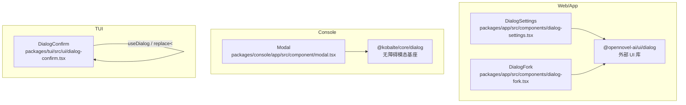
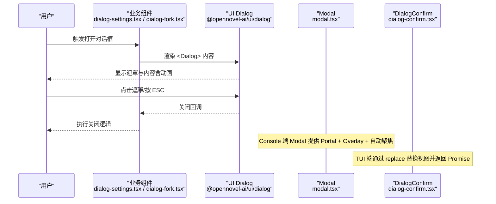
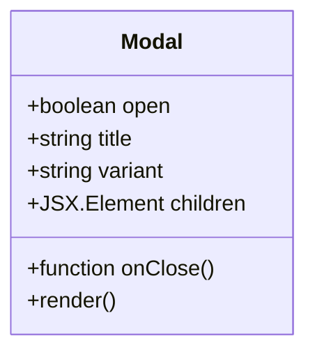
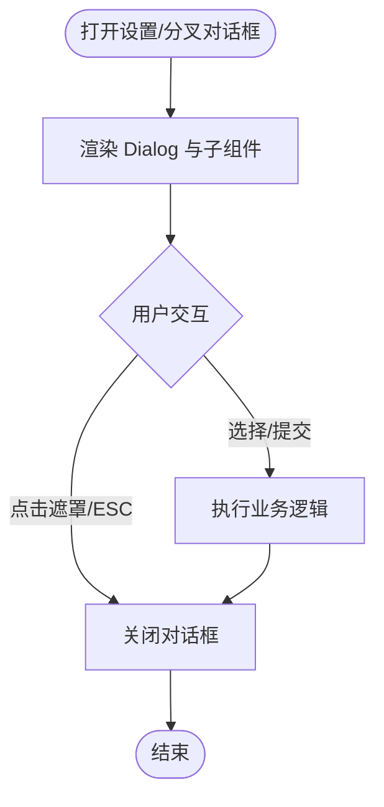
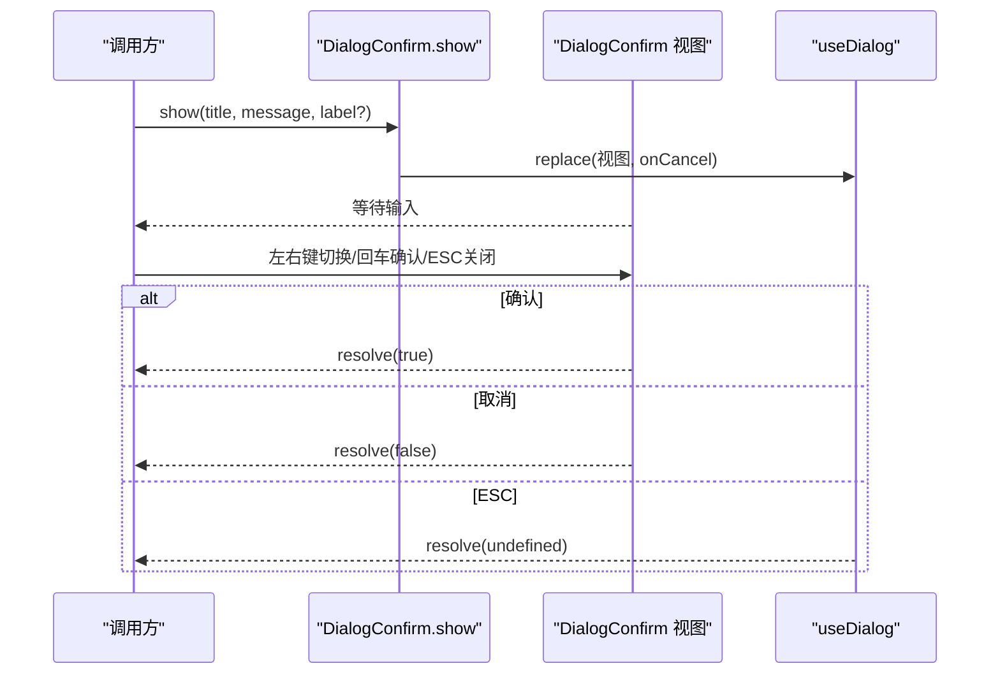
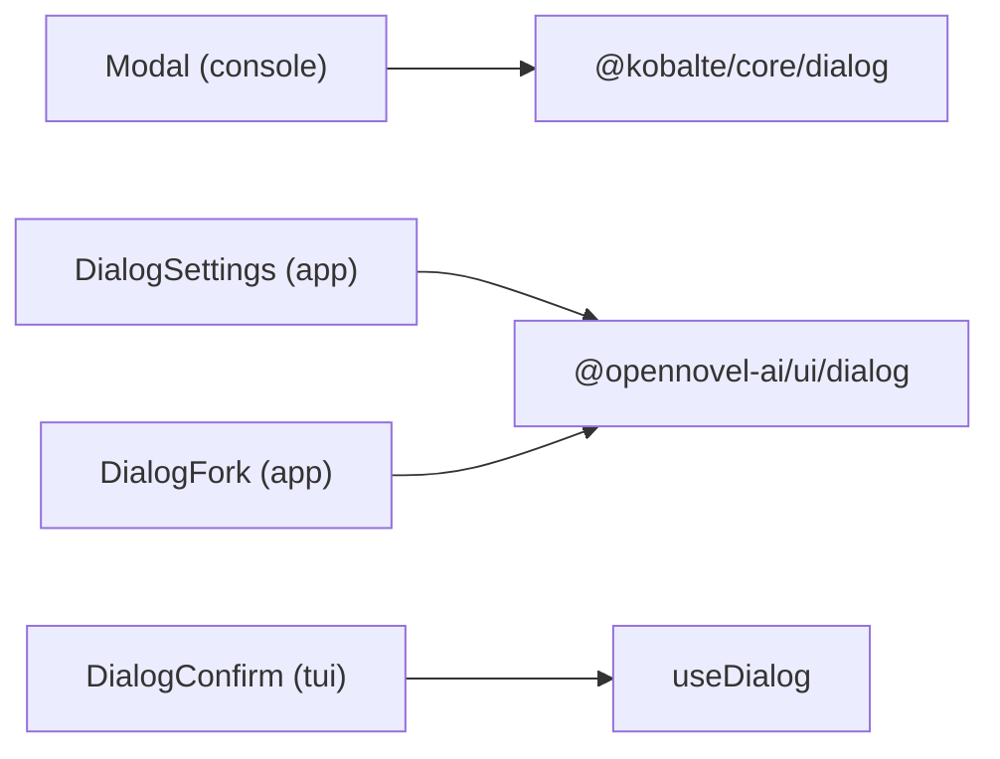

# 对话框组件

<cite>
**本文引用的文件**   
- [packages/console/app/src/component/modal.tsx](file://packages/console/app/src/component/modal.tsx)
- [packages/app/src/components/dialog-settings.tsx](file://packages/app/src/components/dialog-settings.tsx)
- [packages/app/src/components/dialog-fork.tsx](file://packages/app/src/components/dialog-fork.tsx)
- [packages/tui/src/ui/dialog-confirm.tsx](file://packages/tui/src/ui/dialog-confirm.tsx)
</cite>

## 目录
1. [简介](#简介)
2. [项目结构](#项目结构)
3. [核心组件](#核心组件)
4. [架构总览](#架构总览)
5. [详细组件分析](#详细组件分析)
6. [依赖关系分析](#依赖关系分析)
7. [性能考量](#性能考量)
8. [故障排查指南](#故障排查指南)
9. [结论](#结论)
10. [附录：API 与使用示例](#附录api-与使用示例)

## 简介
本文件为 openNovel 的对话框组件提供系统化文档，覆盖模态对话框、确认对话框、通知对话框等类型的使用场景与实现方式。重点说明对话框的 API（打开/关闭控制、内容渲染、遮罩层配置、动画效果）、层级管理与焦点处理机制、自定义标题/内容/操作按钮的配置方法、响应式表现、键盘导航与 ESC 关闭能力，并给出完整的使用示例路径以便快速上手。

## 项目结构
openNovel 中对话框相关代码分布在多个包中：
- Web/App 端通过 UI 库提供的 Dialog 组件进行组合式使用（如设置、分叉会话等）。
- Console 端基于 Kobalte 封装了基础 Modal，用于通用模态窗口。
- TUI 端提供了终端下的确认对话框组件，支持键盘交互与 Promise 式调用。

图表来源
- [packages/app/src/components/dialog-settings.tsx:1-95](file://packages/app/src/components/dialog-settings.tsx#L1-L95)
- [packages/app/src/components/dialog-fork.tsx:1-109](file://packages/app/src/components/dialog-fork.tsx#L1-L109)
- [packages/console/app/src/component/modal.tsx:1-47](file://packages/console/app/src/component/modal.tsx#L1-L47)
- [packages/tui/src/ui/dialog-confirm.tsx:1-108](file://packages/tui/src/ui/dialog-confirm.tsx#L1-L108)

章节来源
- [packages/app/src/components/dialog-settings.tsx:1-95](file://packages/app/src/components/dialog-settings.tsx#L1-L95)
- [packages/app/src/components/dialog-fork.tsx:1-109](file://packages/app/src/components/dialog-fork.tsx#L1-L109)
- [packages/console/app/src/component/modal.tsx:1-47](file://packages/console/app/src/component/modal.tsx#L1-L47)
- [packages/tui/src/ui/dialog-confirm.tsx:1-108](file://packages/tui/src/ui/dialog-confirm.tsx#L1-L108)

## 核心组件
- 模态对话框（Console 端）
  - 基于 Kobalte Dialog 封装，提供 open/onClose、可选标题、变体（variant）、Portal 渲染、Overlay 点击关闭、自动聚焦到内容区等能力。
- 应用内对话框（App/Web 端）
  - 通过 @opennovel-ai/ui/dialog 的 Dialog 组件组合业务内容，例如“设置”、“分叉会话”等。
- 确认对话框（TUI 端）
  - 提供 title/message/label 与 onConfirm/onCancel，支持左右键切换选项、回车确认、ESC 关闭，并以 Promise 形式返回结果。

章节来源
- [packages/console/app/src/component/modal.tsx:1-47](file://packages/console/app/src/component/modal.tsx#L1-L47)
- [packages/app/src/components/dialog-settings.tsx:1-95](file://packages/app/src/components/dialog-settings.tsx#L1-L95)
- [packages/app/src/components/dialog-fork.tsx:1-109](file://packages/app/src/components/dialog-fork.tsx#L1-L109)
- [packages/tui/src/ui/dialog-confirm.tsx:1-108](file://packages/tui/src/ui/dialog-confirm.tsx#L1-L108)

## 架构总览
对话框在 openNovel 中的整体交互流程如下：
- App/Web：业务组件通过 useDialog 或 <Dialog> 渲染内容，由 UI 库负责遮罩、层级、焦点与动画。
- Console：Modal 作为底层模态容器，统一处理 Portal、Overlay 和自动聚焦。
- TUI：DialogConfirm 通过 useDialog.replace 替换当前对话框视图，并以 Promise 暴露结果。

图表来源
- [packages/app/src/components/dialog-settings.tsx:1-95](file://packages/app/src/components/dialog-settings.tsx#L1-L95)
- [packages/app/src/components/dialog-fork.tsx:1-109](file://packages/app/src/components/dialog-fork.tsx#L1-L109)
- [packages/console/app/src/component/modal.tsx:1-47](file://packages/console/app/src/component/modal.tsx#L1-L47)
- [packages/tui/src/ui/dialog-confirm.tsx:1-108](file://packages/tui/src/ui/dialog-confirm.tsx#L1-L108)

## 详细组件分析

### 模态对话框（Console 端）
- 功能要点
  - 通过 open 控制显隐，onOpenChange 将关闭事件透传给 onClose。
  - 使用 Portal 渲染，避免父级样式影响。
  - Overlay 点击关闭；Content 阻止冒泡，防止误触关闭。
  - 自动聚焦 Content，确保可访问性。
  - 支持 variant 区分视觉风格（如 black）。
- 层级与焦点
  - Portal 保证模态在最上层。
  - onOpenAutoFocus 阻止默认行为并手动聚焦内容区域。
- 动画与遮罩
  - 由 Kobalte 内部实现，无需额外配置。

图表来源
- [packages/console/app/src/component/modal.tsx:1-47](file://packages/console/app/src/component/modal.tsx#L1-L47)

章节来源
- [packages/console/app/src/component/modal.tsx:1-47](file://packages/console/app/src/component/modal.tsx#L1-L47)

### 应用内对话框（App/Web 端）
- 典型用法
  - 设置对话框：使用 <Dialog size="x-large" transition> 包裹 Tabs 布局，展示多标签设置页。
  - 分叉会话对话框：使用 <Dialog title="..."> 包裹 List，支持搜索、空状态与选择回调。
- API 能力（由 @opennovel-ai/ui/dialog 提供）
  - 尺寸：size（如 x-large）
  - 动画：transition
  - 标题：title
  - 内容：children
- 层级与焦点
  - 由 UI 库管理，通常包含遮罩、焦点陷阱与 ESC 关闭。
- 响应式
  - 通过 size 与内部布局适配不同屏幕尺寸。

图表来源
- [packages/app/src/components/dialog-settings.tsx:1-95](file://packages/app/src/components/dialog-settings.tsx#L1-L95)
- [packages/app/src/components/dialog-fork.tsx:1-109](file://packages/app/src/components/dialog-fork.tsx#L1-L109)

章节来源
- [packages/app/src/components/dialog-settings.tsx:1-95](file://packages/app/src/components/dialog-settings.tsx#L1-L95)
- [packages/app/src/components/dialog-fork.tsx:1-109](file://packages/app/src/components/dialog-fork.tsx#L1-L109)

### 确认对话框（TUI 端）
- 功能要点
  - 属性：title、message、label、onConfirm、onCancel。
  - 键盘导航：左右键切换选项，回车确认，ESC 关闭。
  - 以 Promise 形式返回结果（true/false/undefined）。
- 实现模式
  - 使用 useDialog.replace 替换当前对话框视图，并在取消时 resolve undefined。
- 无障碍与可访问性
  - 通过键盘绑定与文本提示提升终端可用性。

图表来源
- [packages/tui/src/ui/dialog-confirm.tsx:1-108](file://packages/tui/src/ui/dialog-confirm.tsx#L1-L108)

章节来源
- [packages/tui/src/ui/dialog-confirm.tsx:1-108](file://packages/tui/src/ui/dialog-confirm.tsx#L1-L108)

## 依赖关系分析
- Console Modal 依赖 Kobalte Dialog，提供无障碍与模态行为。
- App/Web 对话框依赖 @opennovel-ai/ui/dialog，统一外观与交互。
- TUI 确认对话框依赖 useDialog 上下文，用于视图替换与生命周期管理。

图表来源
- [packages/console/app/src/component/modal.tsx:1-47](file://packages/console/app/src/component/modal.tsx#L1-L47)
- [packages/app/src/components/dialog-settings.tsx:1-95](file://packages/app/src/components/dialog-settings.tsx#L1-L95)
- [packages/app/src/components/dialog-fork.tsx:1-109](file://packages/app/src/components/dialog-fork.tsx#L1-L109)
- [packages/tui/src/ui/dialog-confirm.tsx:1-108](file://packages/tui/src/ui/dialog-confirm.tsx#L1-L108)

章节来源
- [packages/console/app/src/component/modal.tsx:1-47](file://packages/console/app/src/component/modal.tsx#L1-L47)
- [packages/app/src/components/dialog-settings.tsx:1-95](file://packages/app/src/components/dialog-settings.tsx#L1-L95)
- [packages/app/src/components/dialog-fork.tsx:1-109](file://packages/app/src/components/dialog-fork.tsx#L1-L109)
- [packages/tui/src/ui/dialog-confirm.tsx:1-108](file://packages/tui/src/ui/dialog-confirm.tsx#L1-L108)

## 性能考量
- Portal 渲染：避免重排与样式污染，提升渲染效率。
- 自动聚焦：减少不必要的 DOM 查询，提高可访问性与用户体验。
- 列表与搜索：在大型数据场景中建议使用虚拟滚动与防抖搜索（结合 List 组件特性）。
- 动画：合理使用 transition，避免过度动画导致卡顿。

[本节为通用指导，不直接分析具体文件]

## 故障排查指南
- 无法关闭
  - 检查遮罩层点击事件是否被阻止冒泡。
  - 确认 ESC 键监听未被其他组件拦截。
- 焦点异常
  - 确认 onOpenAutoFocus 是否正确阻止默认行为并聚焦内容区。
- 层级错乱
  - 检查是否使用了 Portal，以及是否存在 z-index 冲突。
- TUI 确认对话框无响应
  - 确认 useDialog.replace 的回调是否被正确调用。
  - 检查键盘绑定是否生效。

章节来源
- [packages/console/app/src/component/modal.tsx:1-47](file://packages/console/app/src/component/modal.tsx#L1-L47)
- [packages/tui/src/ui/dialog-confirm.tsx:1-108](file://packages/tui/src/ui/dialog-confirm.tsx#L1-L108)

## 结论
openNovel 的对话框体系在不同平台下采用合适的实现策略：Console 端基于 Kobalte 提供稳定可靠的模态能力；App/Web 端通过统一的 UI 库 Dialog 组件快速构建业务对话框；TUI 端则以轻量、键盘友好的确认对话框满足终端交互需求。通过合理的层级管理、焦点处理与响应式设计，各端均能提供一致且易用的对话框体验。

[本节为总结性内容，不直接分析具体文件]

## 附录：API 与使用示例

### 模态对话框（Console 端）
- 属性
  - open: boolean
  - onClose: () => void
  - title?: string
  - variant?: "black"
  - children: JSX.Element
- 行为
  - 点击遮罩关闭
  - 自动聚焦内容区
  - Portal 渲染
- 使用示例路径
  - [packages/console/app/src/component/modal.tsx:1-47](file://packages/console/app/src/component/modal.tsx#L1-L47)

章节来源
- [packages/console/app/src/component/modal.tsx:1-47](file://packages/console/app/src/component/modal.tsx#L1-L47)

### 应用内对话框（App/Web 端）
- 常用属性（来自 @opennovel-ai/ui/dialog）
  - size: 尺寸（如 x-large）
  - transition: 是否启用过渡动画
  - title: 标题
  - children: 内容
- 使用示例路径
  - 设置对话框：[packages/app/src/components/dialog-settings.tsx:1-95](file://packages/app/src/components/dialog-settings.tsx#L1-L95)
  - 分叉会话对话框：[packages/app/src/components/dialog-fork.tsx:1-109](file://packages/app/src/components/dialog-fork.tsx#L1-L109)

章节来源
- [packages/app/src/components/dialog-settings.tsx:1-95](file://packages/app/src/components/dialog-settings.tsx#L1-L95)
- [packages/app/src/components/dialog-fork.tsx:1-109](file://packages/app/src/components/dialog-fork.tsx#L1-L109)

### 确认对话框（TUI 端）
- 属性
  - title: string
  - message: string
  - label?: string
  - onConfirm?: () => void
  - onCancel?: () => void
- 返回值
  - Promise<boolean | undefined>
- 键盘支持
  - 左右键切换选项
  - 回车确认
  - ESC 关闭
- 使用示例路径
  - [packages/tui/src/ui/dialog-confirm.tsx:1-108](file://packages/tui/src/ui/dialog-confirm.tsx#L1-L108)

章节来源
- [packages/tui/src/ui/dialog-confirm.tsx:1-108](file://packages/tui/src/ui/dialog-confirm.tsx#L1-L108)