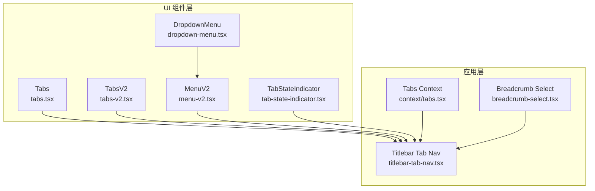
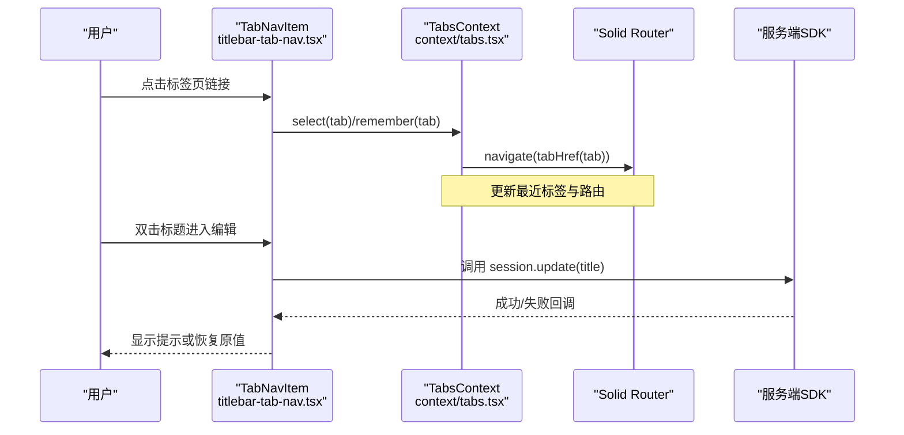
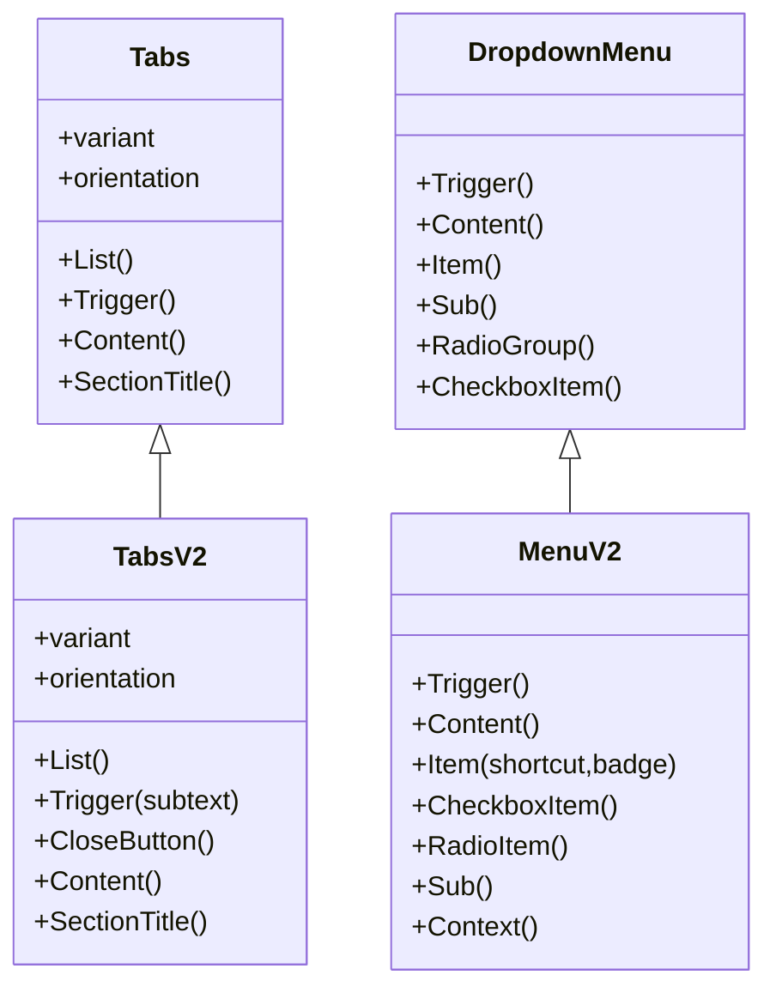
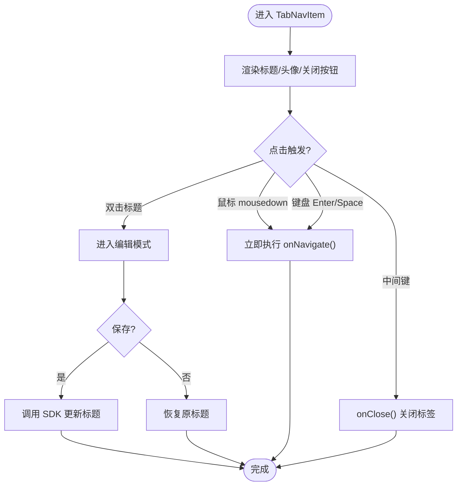
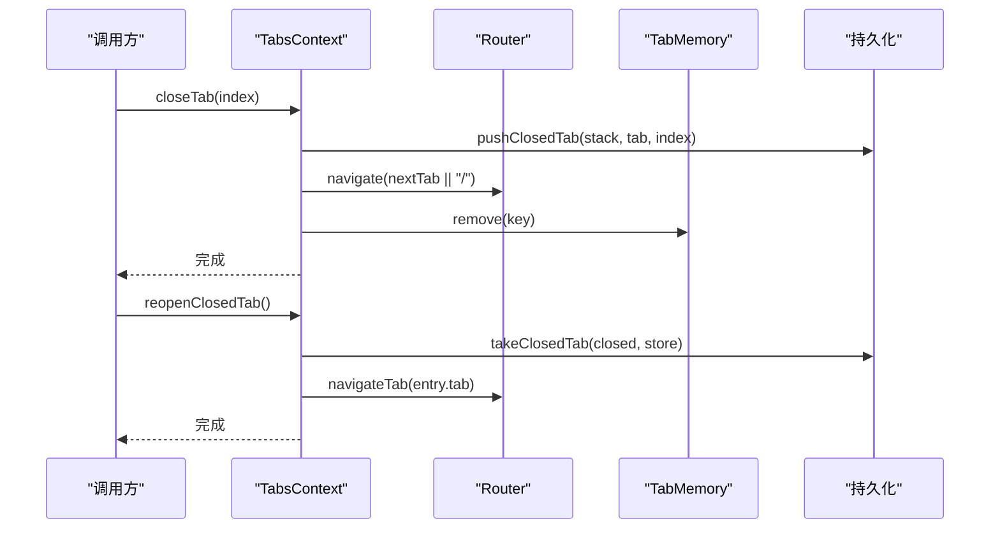
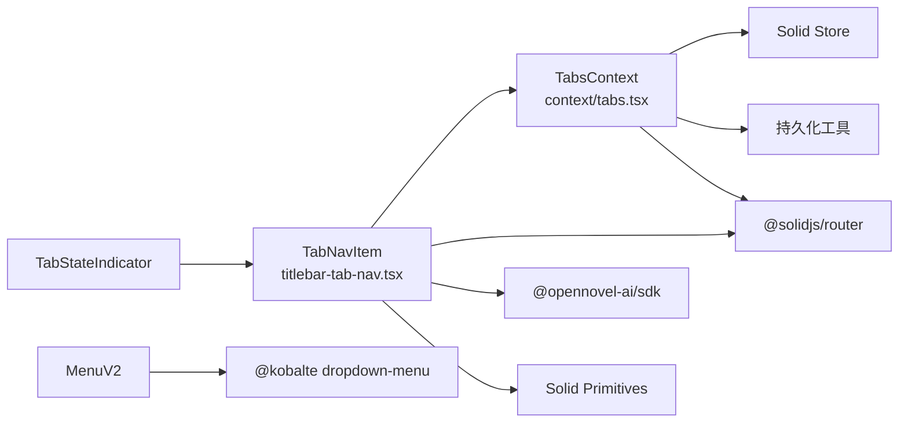

# 导航组件

<cite>
**本文引用的文件**   
- [packages/ui/src/components/tabs.tsx](file://packages/ui/src/components/tabs.tsx)
- [packages/ui/src/v2/components/tabs-v2.tsx](file://packages/ui/src/v2/components/tabs-v2.tsx)
- [packages/app/src/components/titlebar-tab-nav.tsx](file://packages/app/src/components/titlebar-tab-nav.tsx)
- [packages/app/src/context/tabs.tsx](file://packages/app/src/context/tabs.tsx)
- [packages/ui/src/components/dropdown-menu.tsx](file://packages/ui/src/components/dropdown-menu.tsx)
- [packages/ui/src/v2/components/menu-v2.tsx](file://packages/ui/src/v2/components/menu-v2.tsx)
- [packages/ui/src/v2/components/tab-state-indicator.tsx](file://packages/ui/src/v2/components/tab-state-indicator.tsx)
- [packages/stats/app/src/routes/breadcrumb-select.tsx](file://packages/stats/app/src/routes/breadcrumb-select.tsx)
</cite>

## 目录
1. [简介](#简介)
2. [项目结构](#项目结构)
3. [核心组件](#核心组件)
4. [架构总览](#架构总览)
5. [详细组件分析](#详细组件分析)
6. [依赖关系分析](#依赖关系分析)
7. [性能考量](#性能考量)
8. [故障排查指南](#故障排查指南)
9. [结论](#结论)
10. [附录](#附录)

## 简介
本文件为 openNovel 的导航组件提供系统化文档，覆盖标签页、菜单、面包屑等导航元素的实现与使用方式。重点包括：
- 路由集成与活动状态管理
- 嵌套导航与动态菜单
- 键盘导航与无障碍访问（a11y）
- 移动端手势与触摸友好设计
- 复杂导航场景的完整示例路径

## 项目结构
导航相关代码主要分布在以下模块：
- UI 基础组件层：Tabs、DropdownMenu、MenuV2、TabStateIndicator
- 应用层导航：标题栏标签页 TabNavItem/DraftTabItem、标签页上下文 TabsProvider
- 面包屑选择器：BreadcrumbSelect

图表来源
- [packages/ui/src/components/tabs.tsx:1-126](file://packages/ui/src/components/tabs.tsx#L1-L126)
- [packages/ui/src/v2/components/tabs-v2.tsx:1-148](file://packages/ui/src/v2/components/tabs-v2.tsx#L1-L148)
- [packages/ui/src/components/dropdown-menu.tsx:1-309](file://packages/ui/src/components/dropdown-menu.tsx#L1-L309)
- [packages/ui/src/v2/components/menu-v2.tsx:1-226](file://packages/ui/src/v2/components/menu-v2.tsx#L1-L226)
- [packages/ui/src/v2/components/tab-state-indicator.tsx:1-38](file://packages/ui/src/v2/components/tab-state-indicator.tsx#L1-L38)
- [packages/app/src/components/titlebar-tab-nav.tsx:1-431](file://packages/app/src/components/titlebar-tab-nav.tsx#L1-L431)
- [packages/app/src/context/tabs.tsx:1-388](file://packages/app/src/context/tabs.tsx#L1-L388)
- [packages/stats/app/src/routes/breadcrumb-select.tsx:1-58](file://packages/stats/app/src/routes/breadcrumb-select.tsx#L1-L58)

章节来源
- [packages/ui/src/components/tabs.tsx:1-126](file://packages/ui/src/components/tabs.tsx#L1-L126)
- [packages/ui/src/v2/components/tabs-v2.tsx:1-148](file://packages/ui/src/v2/components/tabs-v2.tsx#L1-L148)
- [packages/app/src/components/titlebar-tab-nav.tsx:1-431](file://packages/app/src/components/titlebar-tab-nav.tsx#L1-L431)
- [packages/app/src/context/tabs.tsx:1-388](file://packages/app/src/context/tabs.tsx#L1-L388)
- [packages/ui/src/components/dropdown-menu.tsx:1-309](file://packages/ui/src/components/dropdown-menu.tsx#L1-L309)
- [packages/ui/src/v2/components/menu-v2.tsx:1-226](file://packages/ui/src/v2/components/menu-v2.tsx#L1-L226)
- [packages/ui/src/v2/components/tab-state-indicator.tsx:1-38](file://packages/ui/src/v2/components/tab-state-indicator.tsx#L1-L38)
- [packages/stats/app/src/routes/breadcrumb-select.tsx:1-58](file://packages/stats/app/src/routes/breadcrumb-select.tsx#L1-L58)

## 核心组件
- Tabs（v1）：基于 Kobalte Tabs 封装，支持 variant、orientation、Trigger 关闭按钮、中间键点击等能力。
- TabsV2（v2）：在 v1 基础上增强，新增 subtext、CloseButton 子组件、更清晰的 slot 命名。
- DropdownMenu：通用下拉菜单，包含 Trigger/Content/Group/Item/Radio/Checkbox/Sub 等。
- MenuV2：对 DropdownMenu 的二次封装，统一样式与快捷键/徽章展示，并支持 Context 菜单。
- TabStateIndicator：用于指示标签页状态的图标组件。
- BreadcrumbSelect：基于 Kobalte Select 的面包屑选择器，支持当前项高亮与 aria-current。

章节来源
- [packages/ui/src/components/tabs.tsx:1-126](file://packages/ui/src/components/tabs.tsx#L1-L126)
- [packages/ui/src/v2/components/tabs-v2.tsx:1-148](file://packages/ui/src/v2/components/tabs-v2.tsx#L1-L148)
- [packages/ui/src/components/dropdown-menu.tsx:1-309](file://packages/ui/src/components/dropdown-menu.tsx#L1-L309)
- [packages/ui/src/v2/components/menu-v2.tsx:1-226](file://packages/ui/src/v2/components/menu-v2.tsx#L1-L226)
- [packages/ui/src/v2/components/tab-state-indicator.tsx:1-38](file://packages/ui/src/v2/components/tab-state-indicator.tsx#L1-L38)
- [packages/stats/app/src/routes/breadcrumb-select.tsx:1-58](file://packages/stats/app/src/routes/breadcrumb-select.tsx#L1-L58)

## 架构总览
导航体系由“视图组件 + 状态上下文 + 路由”三层构成：
- 视图组件：Tabs/TabsV2、MenuV2、DropdownMenu、BreadcrumbSelect、TabStateIndicator
- 状态上下文：TabsContext（TabsProvider/useTabs），维护标签页列表、最近标签、关闭历史、信息缓存、内存态
- 路由集成：Solid Router 的 useNavigate/useLocation/useParams，结合 tabHref/sessionHref 生成链接

图表来源
- [packages/app/src/components/titlebar-tab-nav.tsx:1-431](file://packages/app/src/components/titlebar-tab-nav.tsx#L1-L431)
- [packages/app/src/context/tabs.tsx:1-388](file://packages/app/src/context/tabs.tsx#L1-L388)

章节来源
- [packages/app/src/components/titlebar-tab-nav.tsx:1-431](file://packages/app/src/components/titlebar-tab-nav.tsx#L1-L431)
- [packages/app/src/context/tabs.tsx:1-388](file://packages/app/src/context/tabs.tsx#L1-L388)

## 详细组件分析

### 标签页 Tabs / TabsV2
- 功能要点
  - 支持水平/垂直方向 orientation
  - 支持多种变体 variant（normal/alt/pill/settings 等）
  - Trigger 支持中间键点击 onMiddleClick、自定义关闭按钮、subtext（v2）
  - Content 与 List 通过 data-slot 暴露可定制点
- 无障碍
  - 基于 Kobalte 的 ARIA 行为，自动处理焦点与键盘切换
  - v2 CloseButton 提供 role="button"、aria-label 与 tabindex
- 数据流
  - value 驱动激活态，配合父级 store 控制 active
  - 中间键事件拦截避免默认滚动行为

图表来源
- [packages/ui/src/components/tabs.tsx:1-126](file://packages/ui/src/components/tabs.tsx#L1-L126)
- [packages/ui/src/v2/components/tabs-v2.tsx:1-148](file://packages/ui/src/v2/components/tabs-v2.tsx#L1-L148)
- [packages/ui/src/components/dropdown-menu.tsx:1-309](file://packages/ui/src/components/dropdown-menu.tsx#L1-L309)
- [packages/ui/src/v2/components/menu-v2.tsx:1-226](file://packages/ui/src/v2/components/menu-v2.tsx#L1-L226)

章节来源
- [packages/ui/src/components/tabs.tsx:1-126](file://packages/ui/src/components/tabs.tsx#L1-L126)
- [packages/ui/src/v2/components/tabs-v2.tsx:1-148](file://packages/ui/src/v2/components/tabs-v2.tsx#L1-L148)

### 标题栏标签项 TabNavItem / DraftTabItem
- 功能要点
  - 渲染会话/草稿标签，支持头像、项目名称、服务器标签、预览浮层
  - 标题双击进入编辑，Enter 保存、Esc 取消；失焦自动保存
  - 中间键点击关闭标签；mousedown 立即导航以提升响应速度
  - 溢出检测与强制截断，保持布局稳定
- 路由集成
  - 通过 href 与 onNavigate 与 Solid Router 集成
  - 支持 suppressNavigation 钩子阻止跳转（如拖拽中）
- 无障碍
  - 关闭按钮 aria-label；编辑态 focus 管理；contenteditable 行为可控

图表来源
- [packages/app/src/components/titlebar-tab-nav.tsx:1-431](file://packages/app/src/components/titlebar-tab-nav.tsx#L1-L431)

章节来源
- [packages/app/src/components/titlebar-tab-nav.tsx:1-431](file://packages/app/src/components/titlebar-tab-nav.tsx#L1-L431)

### 标签页上下文 TabsContext
- 状态模型
  - Tab：SessionTab | DraftTab
  - store：持久化标签数组；recent：最近标签 key；info：标题/目录缓存；closed：关闭历史栈
- 关键 API
  - addSessionTab/reorder/newDraft/updateDraft/promoteDraft/removeTab/closeTab/reopenClosedTab
  - removeServer/removeSessions/rememberSessionInfo/select/remember/state/stateValue
  - toggleHome：回到首页或指定 tab
- 路由联动
  - tabHref/sessionHref 生成链接；navigate 切换页面；location 判断当前路由
- 清理策略
  - 服务器移除时清理 tabs/info/memory；draft 持久化清理；关闭后记录以便重开

图表来源
- [packages/app/src/context/tabs.tsx:1-388](file://packages/app/src/context/tabs.tsx#L1-L388)

章节来源
- [packages/app/src/context/tabs.tsx:1-388](file://packages/app/src/context/tabs.tsx#L1-L388)

### 菜单 DropdownMenu / MenuV2
- 能力概览
  - DropdownMenu：完整的下拉菜单语义与交互（分组、分隔、单选、多选、子菜单）
  - MenuV2：统一样式，支持快捷键/徽章展示，并提供 Context 菜单入口
- 无障碍
  - 基于 Kobalte 的 ARIA 角色与键盘导航；子菜单箭头与选中指示
- 使用建议
  - 将操作类导航放入菜单；将高频导航置于主导航区（如 Tabs）

章节来源
- [packages/ui/src/components/dropdown-menu.tsx:1-309](file://packages/ui/src/components/dropdown-menu.tsx#L1-L309)
- [packages/ui/src/v2/components/menu-v2.tsx:1-226](file://packages/ui/src/v2/components/menu-v2.tsx#L1-L226)

### 面包屑 BreadcrumbSelect
- 能力概览
  - 基于 Kobalte Select 的轻量面包屑选择器
  - 支持 current 高亮与 aria-current="page"
  - 通过 window.location.assign 进行导航
- 适用场景
  - 统计/报表等多维度筛选时的层级切换

章节来源
- [packages/stats/app/src/routes/breadcrumb-select.tsx:1-58](file://packages/stats/app/src/routes/breadcrumb-select.tsx#L1-L58)

### 标签状态指示 TabStateIndicator
- 作用：以简洁 SVG 图标表达标签页状态（如加载/同步/错误等）
- 使用：作为 Tabs 或 TabNavItem 的子元素插入

章节来源
- [packages/ui/src/v2/components/tab-state-indicator.tsx:1-38](file://packages/ui/src/v2/components/tab-state-indicator.tsx#L1-L38)

## 依赖关系分析
- 组件依赖
  - Tabs/TabsV2 依赖 @kobalte/core/tabs
  - DropdownMenu/MenuV2 依赖 @kobalte/core/dropdown-menu 与 context-menu
  - TabNavItem 依赖 Solid Primitives（事件监听、ResizeObserver）、@solidjs/router、SDK
  - TabsContext 依赖 Solid Store、持久化工具、路由与平台上下文
- 耦合与内聚
  - TabsContext 集中管理标签状态，降低视图层复杂度
  - UI 组件与业务逻辑解耦，便于复用与测试

图表来源
- [packages/app/src/components/titlebar-tab-nav.tsx:1-431](file://packages/app/src/components/titlebar-tab-nav.tsx#L1-L431)
- [packages/app/src/context/tabs.tsx:1-388](file://packages/app/src/context/tabs.tsx#L1-L388)
- [packages/ui/src/v2/components/menu-v2.tsx:1-226](file://packages/ui/src/v2/components/menu-v2.tsx#L1-L226)

章节来源
- [packages/app/src/components/titlebar-tab-nav.tsx:1-431](file://packages/app/src/components/titlebar-tab-nav.tsx#L1-L431)
- [packages/app/src/context/tabs.tsx:1-388](file://packages/app/src/context/tabs.tsx#L1-L388)
- [packages/ui/src/v2/components/menu-v2.tsx:1-226](file://packages/ui/src/v2/components/menu-v2.tsx#L1-L226)

## 性能考量
- 标签页渲染
  - 使用 requestAnimationFrame 测量标题溢出，避免频繁重排
  - ResizeObserver 监听容器尺寸变化，减少不必要的计算
- 导航响应
  - 在 mousedown 阶段即执行导航，缩短感知延迟
- 状态更新
  - 使用 startTransition 批量更新 store，避免闪烁
- 内存与持久化
  - 关闭标签后清理 memory 与 info；服务器移除时批量清理

[本节为通用指导，不直接分析具体文件]

## 故障排查指南
- 标签无法关闭
  - 检查中间键事件是否被其他组件拦截
  - 确认 onClose 回调未被 suppressNavigation 阻断
- 标题编辑未生效
  - 检查 SDK 调用是否抛出异常；确认 onTitleChangeFailed 回退逻辑
- 路由未跳转
  - 确认 onNavigate 与 href 设置正确；检查 suppressNavigation 钩子
- 菜单无键盘导航
  - 确保使用 Kobalte 提供的 Trigger/Content；不要破坏焦点顺序

章节来源
- [packages/app/src/components/titlebar-tab-nav.tsx:1-431](file://packages/app/src/components/titlebar-tab-nav.tsx#L1-L431)
- [packages/ui/src/components/dropdown-menu.tsx:1-309](file://packages/ui/src/components/dropdown-menu.tsx#L1-L309)
- [packages/ui/src/v2/components/menu-v2.tsx:1-226](file://packages/ui/src/v2/components/menu-v2.tsx#L1-L226)

## 结论
openNovel 的导航体系以 Tabs/TabsV2 为核心，结合 TabsContext 的状态管理与 Solid Router 的路由集成，形成清晰、可扩展且体验友好的导航方案。MenuV2 与 DropdownMenu 提供丰富的菜单能力，BreadcrumbSelect 满足多级选择场景。整体设计兼顾无障碍、键盘导航与移动端交互，适合构建复杂的桌面/Web 应用导航。

[本节为总结性内容，不直接分析具体文件]

## 附录

### API 接口速览
- Tabs/TabsV2
  - Props：variant、orientation、value、active 等
  - Slots：List、Trigger、Content、SectionTitle；v2 新增 CloseButton、subtext
- DropdownMenu/MenuV2
  - 组件：Trigger、Content、Item、Sub、RadioGroup、CheckboxItem、Separator、GroupLabel
  - MenuV2 扩展：shortcut、badge、Context 菜单
- TabsContext
  - actions：addSessionTab、removeTab、closeTab、reopenClosedTab、reorder、newDraft、updateDraft、promoteDraft、select、remember、state/stateValue、toggleHome
  - store：Tab[]；info：Record<string, TabInfo>；recent：{key?: string}；closed：ClosedTab[]

章节来源
- [packages/ui/src/components/tabs.tsx:1-126](file://packages/ui/src/components/tabs.tsx#L1-L126)
- [packages/ui/src/v2/components/tabs-v2.tsx:1-148](file://packages/ui/src/v2/components/tabs-v2.tsx#L1-L148)
- [packages/ui/src/components/dropdown-menu.tsx:1-309](file://packages/ui/src/components/dropdown-menu.tsx#L1-L309)
- [packages/ui/src/v2/components/menu-v2.tsx:1-226](file://packages/ui/src/v2/components/menu-v2.tsx#L1-L226)
- [packages/app/src/context/tabs.tsx:1-388](file://packages/app/src/context/tabs.tsx#L1-L388)

### 路由集成与活动状态管理
- 路由生成：tabHref/sessionHref 生成链接；useNavigate/useLocation/useParams 参与决策
- 活动状态：TabsContext.remember 更新最近标签；Tabs 组件根据 value 与 active 驱动视觉态
- 导航时机：TabNavItem 在 mousedown 阶段触发导航，提升响应速度

章节来源
- [packages/app/src/context/tabs.tsx:1-388](file://packages/app/src/context/tabs.tsx#L1-L388)
- [packages/app/src/components/titlebar-tab-nav.tsx:1-431](file://packages/app/src/components/titlebar-tab-nav.tsx#L1-L431)

### 嵌套导航与动态菜单
- 嵌套：MenuV2.Sub/SubTrigger/SubContent 支持多级菜单
- 动态：根据权限/状态动态渲染 Item、Badge、Shortcut；结合 TabsContext.state 存储每标签独立状态

章节来源
- [packages/ui/src/v2/components/menu-v2.tsx:1-226](file://packages/ui/src/v2/components/menu-v2.tsx#L1-L226)
- [packages/app/src/context/tabs.tsx:1-388](file://packages/app/src/context/tabs.tsx#L1-L388)

### 键盘导航与无障碍访问
- 键盘：Kobalte 内置 Tab/Arrow/Enter/Escape 等；MenuV2 支持快捷键显示
- 无障碍：role、aria-label、aria-current、focus 管理；编辑态 focus 转移与失焦保存

章节来源
- [packages/ui/src/components/dropdown-menu.tsx:1-309](file://packages/ui/src/components/dropdown-menu.tsx#L1-L309)
- [packages/ui/src/v2/components/menu-v2.tsx:1-226](file://packages/ui/src/v2/components/menu-v2.tsx#L1-L226)
- [packages/stats/app/src/routes/breadcrumb-select.tsx:1-58](file://packages/stats/app/src/routes/breadcrumb-select.tsx#L1-L58)

### 移动端手势与触摸友好
- 手势：中间键关闭、双击编辑、长按/拖拽占位（通过 gesture 工具）
- 触摸：pointer 事件统一处理；避免默认滚动干扰；关闭按钮防误触

章节来源
- [packages/app/src/components/titlebar-tab-nav.tsx:1-431](file://packages/app/src/components/titlebar-tab-nav.tsx#L1-L431)

### 复杂导航场景示例（路径参考）
- 多服务器会话标签页：见 [packages/app/src/context/tabs.tsx:1-388](file://packages/app/src/context/tabs.tsx#L1-L388)
- 草稿转会话：见 [packages/app/src/context/tabs.tsx:233-250](file://packages/app/src/context/tabs.tsx#L233-L250)
- 标签页预览浮层：见 [packages/app/src/components/titlebar-tab-nav.tsx:322-336](file://packages/app/src/components/titlebar-tab-nav.tsx#L322-L336)
- 多级菜单与快捷键：见 [packages/ui/src/v2/components/menu-v2.tsx:1-226](file://packages/ui/src/v2/components/menu-v2.tsx#L1-L226)
- 面包屑选择器：见 [packages/stats/app/src/routes/breadcrumb-select.tsx:1-58](file://packages/stats/app/src/routes/breadcrumb-select.tsx#L1-L58)