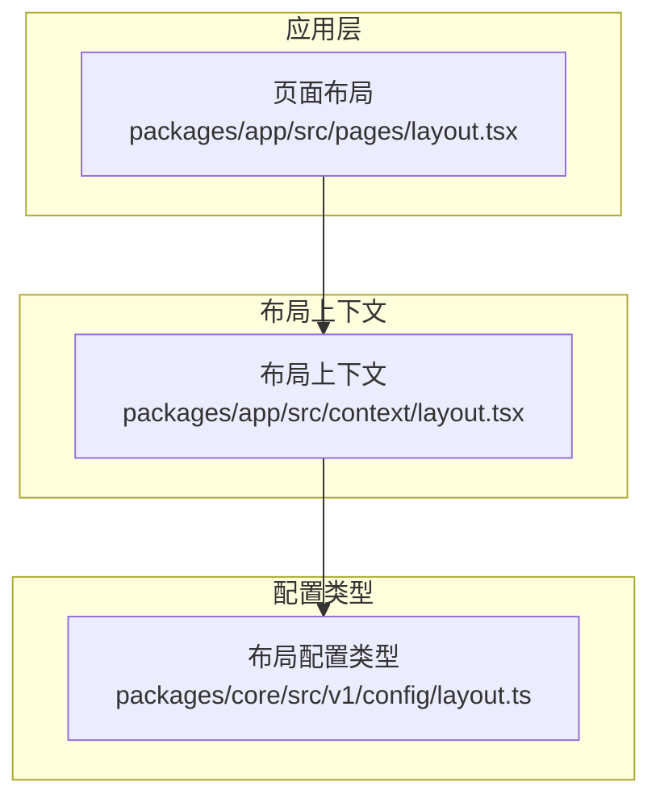
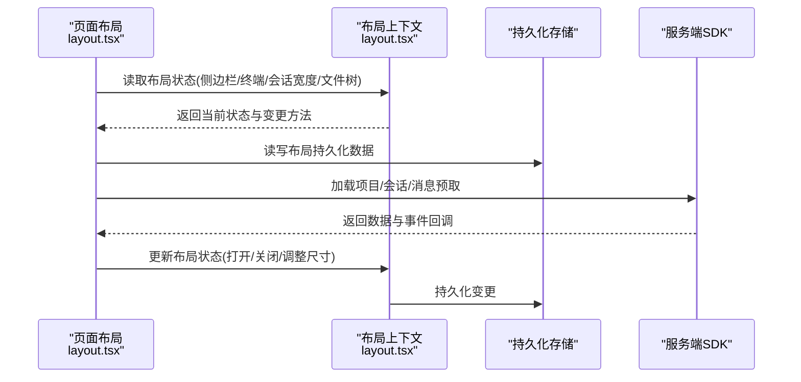
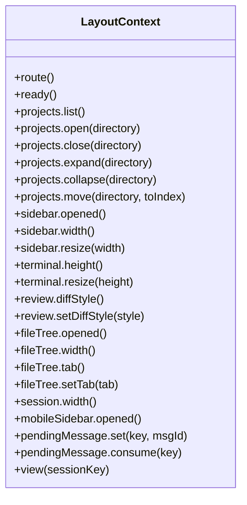
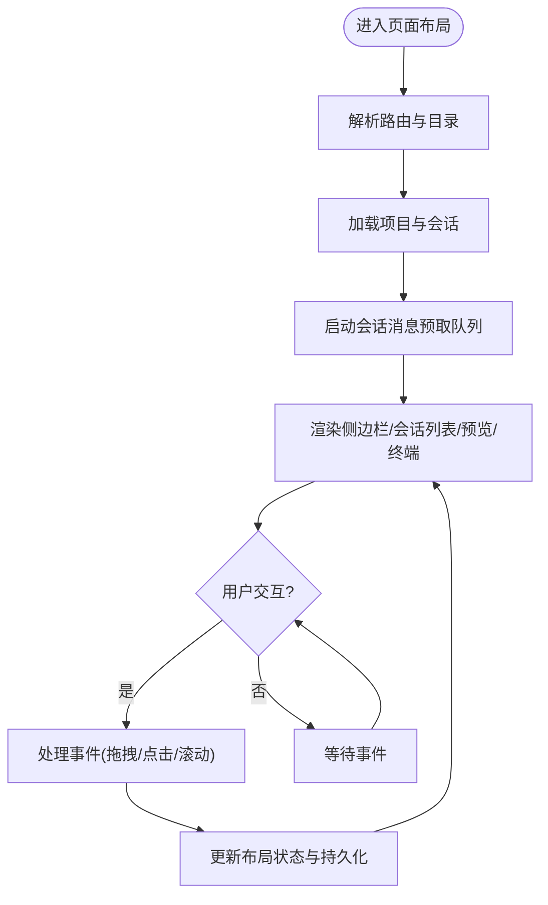
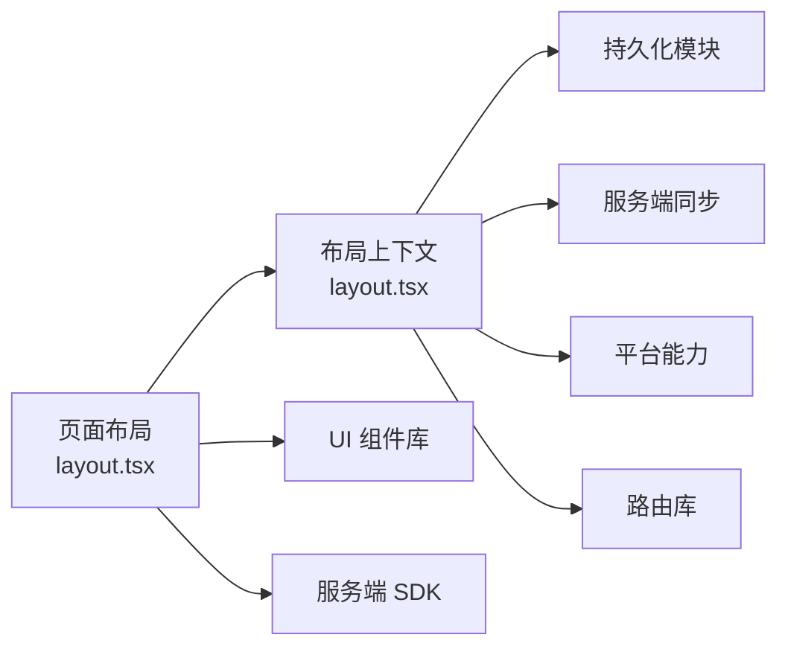

# 布局组件

<cite>
**本文引用的文件**   
- [packages/app/src/context/layout.tsx](file://packages/app/src/context/layout.tsx)
- [packages/app/src/pages/layout.tsx](file://packages/app/src/pages/layout.tsx)
- [packages/core/src/v1/config/layout.ts](file://packages/core/src/v1/config/layout.ts)
</cite>

## 目录
1. [简介](#简介)
2. [项目结构](#项目结构)
3. [核心组件](#核心组件)
4. [架构总览](#架构总览)
5. [详细组件分析](#详细组件分析)
6. [依赖关系分析](#依赖关系分析)
7. [性能考量](#性能考量)
8. [故障排查指南](#故障排查指南)
9. [结论](#结论)
10. [附录](#附录)

## 简介
本文件为 openNovel 的布局组件提供系统化文档，聚焦页面布局框架、网格与弹性布局的设计与实现。内容涵盖：
- 布局容器、间距、对齐方式与响应式断点的设计理念与使用方式
- 布局 API（侧边栏、终端、会话面板、文件树等）的属性与方法
- 复杂页面布局的最佳实践与常见模式
- 嵌套布局的处理方法与性能优化技巧
- 移动端适配与屏幕适配策略
- 完整代码示例路径，便于快速定位实现细节

## 项目结构
openNovel 的布局能力由“上下文状态 + 页面布局”两部分组成：
- 布局上下文（Layout Context）：集中管理侧边栏、终端、会话宽度、文件树、移动侧边栏等布局状态与持久化
- 页面布局（Legacy Layout）：组合上述上下文，组织侧边栏、工作区、会话列表、预览区域、终端等区域，并处理交互与事件

图示来源
- [packages/app/src/pages/layout.tsx](file://packages/app/src/pages/layout.tsx)
- [packages/app/src/context/layout.tsx](file://packages/app/src/context/layout.tsx)
- [packages/core/src/v1/config/layout.ts](file://packages/core/src/v1/config/layout.ts)

章节来源
- [packages/app/src/pages/layout.tsx](file://packages/app/src/pages/layout.tsx)
- [packages/app/src/context/layout.tsx](file://packages/app/src/context/layout.tsx)
- [packages/core/src/v1/config/layout.ts](file://packages/core/src/v1/config/layout.ts)

## 核心组件
- 布局上下文（Layout Context）
  - 职责：统一维护布局状态（侧边栏、终端、会话宽度、文件树、移动侧边栏）、路由解析、项目与工作区展开/收起、滚动持久化、会话标签页状态、消息待处理标记等
  - 关键特性：
    - 默认尺寸常量：侧边栏宽度、文件树宽度、会话宽度、终端高度
    - 持久化：基于服务器作用域的持久化存储，支持迁移与清理
    - 响应式：移动端侧边栏开关控制
    - 资源裁剪：会话视图与标签页的 LRU 清理策略
- 页面布局（Legacy Layout）
  - 职责：将布局上下文与 UI 组件组合，渲染侧边栏、工作区导航、会话列表、预览编辑器、终端等；处理拖拽、预取、通知、主题切换、语言切换等交互
  - 关键特性：
    - 侧边栏悬停预览与自动收起
    - 会话列表预取与优先级队列
    - 多端通知与提示
    - 主题与颜色方案切换

章节来源
- [packages/app/src/context/layout.tsx](file://packages/app/src/context/layout.tsx)
- [packages/app/src/pages/layout.tsx](file://packages/app/src/pages/layout.tsx)

## 架构总览
布局系统采用“上下文驱动 + 页面组装”的模式：
- 布局上下文暴露统一的 API，供页面布局消费
- 页面布局负责具体区域的渲染与交互编排
- 配置类型定义布局相关的基础枚举与约束

图示来源
- [packages/app/src/pages/layout.tsx](file://packages/app/src/pages/layout.tsx)
- [packages/app/src/context/layout.tsx](file://packages/app/src/context/layout.tsx)

## 详细组件分析

### 布局上下文（Layout Context）
- 设计要点
  - 通过简单上下文封装，提供只读访问器与 setter 方法
  - 使用 store 与 effect/memo 组合，保证响应式更新
  - 对历史数据进行迁移与规范化，确保兼容性
  - 对会话视图与标签页进行 LRU 裁剪，避免内存膨胀
- 主要 API
  - projects：项目列表、最近关闭、打开/关闭/展开/收起/移动
  - sidebar：侧边栏开关、宽度、工作区显示策略
  - terminal：终端高度与开关
  - review：差异样式与面板开关
  - fileTree：文件树开关、宽度、标签页切换
  - session：会话宽度
  - mobileSidebar：移动端侧边栏开关
  - pendingMessage：待处理消息标记与消费
  - view：会话视图（滚动位置、审查模式等）
- 默认值与常量
  - 侧边栏默认宽度、文件树默认宽度、会话默认宽度、终端默认高度
  - 头像颜色键集合与映射函数
- 持久化与迁移
  - 基于 serverGlobal 的持久化 key 与版本迁移
  - 会话状态键迁移与清理
  - 滚动持久化的防抖与批量刷新

图示来源
- [packages/app/src/context/layout.tsx](file://packages/app/src/context/layout.tsx)

章节来源
- [packages/app/src/context/layout.tsx](file://packages/app/src/context/layout.tsx)

### 页面布局（Legacy Layout）
- 设计要点
  - 组合多个子组件（侧边栏、工作区、会话列表、预览编辑器、终端）
  - 处理窗口事件、可见性变化、拖拽与排序
  - 会话消息预取队列与优先级调度
  - 通知与提示的统一入口
- 关键流程
  - 初始化：读取路由参数、解码目录、加载项目与会话
  - 预取：按优先级与并发限制预取会话消息，LRU 淘汰旧缓存
  - 交互：侧边栏悬停预览、会话滚动定位、主题/语言切换
  - 清理：组件卸载时释放定时器与事件监听

图示来源
- [packages/app/src/pages/layout.tsx](file://packages/app/src/pages/layout.tsx)

章节来源
- [packages/app/src/pages/layout.tsx](file://packages/app/src/pages/layout.tsx)

### 布局配置类型（Config Layout）
- 设计要点
  - 使用 Schema 定义布局枚举类型，约束取值范围
  - 导出类型别名，供上层逻辑引用
- 典型用法
  - 在配置或校验逻辑中引用布局枚举，确保一致性

章节来源
- [packages/core/src/v1/config/layout.ts](file://packages/core/src/v1/config/layout.ts)

## 依赖关系分析
- 组件耦合
  - 页面布局强依赖布局上下文提供的状态与方法
  - 布局上下文依赖持久化、服务端同步、平台能力与路由
- 外部依赖
  - SolidJS 状态管理与副作用
  - 路由库用于解析与跳转
  - 事件监听与拖拽库用于交互
  - 服务端 SDK 用于项目与会话数据

图示来源
- [packages/app/src/pages/layout.tsx](file://packages/app/src/pages/layout.tsx)
- [packages/app/src/context/layout.tsx](file://packages/app/src/context/layout.tsx)

章节来源
- [packages/app/src/pages/layout.tsx](file://packages/app/src/pages/layout.tsx)
- [packages/app/src/context/layout.tsx](file://packages/app/src/context/layout.tsx)

## 性能考量
- 预取与缓存
  - 会话消息预取采用队列与并发限制，避免阻塞主线程
  - LRU 策略限制每个目录的缓存条目数量，及时淘汰旧数据
- 状态更新与持久化
  - 使用批处理与防抖减少频繁写入
  - 仅在必要时触发持久化刷新
- 渲染优化
  - 使用 memo/effect 精确订阅依赖，避免不必要的重渲染
  - 滚动位置持久化降低重复计算

[本节为通用指导，不直接分析具体文件]

## 故障排查指南
- 常见问题
  - 侧边栏无法打开/关闭：检查 sidebar.opened 与 toggle 调用是否正确
  - 终端高度未生效：确认 terminal.resize 是否被调用且值有效
  - 会话宽度异常：检查 session.resize 与默认宽度常量
  - 文件树标签页切换无效：确认 fileTree.setTab 的参数类型
  - 移动端侧边栏遮挡：检查 mobileSidebar 的 show/hide 时机
- 调试建议
  - 打印布局状态快照，观察变更链路
  - 检查持久化 key 与版本迁移是否成功
  - 查看预取队列长度与并发限制是否合理

章节来源
- [packages/app/src/context/layout.tsx](file://packages/app/src/context/layout.tsx)
- [packages/app/src/pages/layout.tsx](file://packages/app/src/pages/layout.tsx)

## 结论
openNovel 的布局组件以“上下文驱动 + 页面组装”为核心，提供了完善的侧边栏、终端、会话宽度、文件树与移动端侧边栏管理能力。通过预取队列、LRU 缓存与持久化机制，兼顾了性能与用户体验。建议在复杂页面中遵循最佳实践，合理使用布局 API，并结合响应式策略实现跨设备适配。

[本节为总结性内容，不直接分析具体文件]

## 附录

### 布局 API 参考（摘要）
- 侧边栏（sidebar）
  - opened(): boolean
  - width(): number
  - resize(width: number): void
  - workspaces(directory: string): () => boolean
  - setWorkspaces(directory: string, value: boolean): void
  - toggleWorkspaces(directory: string): void
- 终端（terminal）
  - height(): number
  - resize(height: number): void
- 文件树（fileTree）
  - opened(): boolean
  - width(): number
  - tab(): "changes" | "all"
  - setTab(tab: "changes" | "all"): void
  - open()/close()/toggle(): void
- 会话（session）
  - width(): number
  - resize(width: number): void
- 移动端侧边栏（mobileSidebar）
  - opened(): boolean
  - show()/hide()/toggle(): void
- 项目（projects）
  - list(): Project[]
  - open/close/expand/collapse/move(): void
- 审查（review）
  - diffStyle(): "unified" | "split"
  - setDiffStyle(style: "unified" | "split"): void
- 待处理消息（pendingMessage）
  - set(sessionKey: string, messageID: string): void
  - consume(sessionKey: string): string | undefined
- 视图（view）
  - view(sessionKey: string | Accessor<string>): SessionView

章节来源
- [packages/app/src/context/layout.tsx](file://packages/app/src/context/layout.tsx)

### 响应式与移动端适配策略
- 使用 mobileSidebar 控制移动端侧边栏显隐
- 根据屏幕尺寸动态调整侧边栏宽度与文件树宽度
- 在移动端优先展示会话列表与预览，隐藏非关键区域
- 利用主题与颜色方案提升可读性与对比度

章节来源
- [packages/app/src/context/layout.tsx](file://packages/app/src/context/layout.tsx)

### 复杂页面布局最佳实践
- 分层布局：外层容器使用弹性布局，内层区域使用固定比例或自适应
- 嵌套布局：通过上下文共享状态，避免重复计算与状态不一致
- 性能优化：按需渲染、预取与缓存、批处理更新
- 可访问性：确保键盘导航与焦点管理

[本节为通用指导，不直接分析具体文件]

### 代码示例路径
- 布局上下文定义与 API：参见 [packages/app/src/context/layout.tsx](file://packages/app/src/context/layout.tsx)
- 页面布局组合与交互：参见 [packages/app/src/pages/layout.tsx](file://packages/app/src/pages/layout.tsx)
- 布局配置类型：参见 [packages/core/src/v1/config/layout.ts](file://packages/core/src/v1/config/layout.ts)