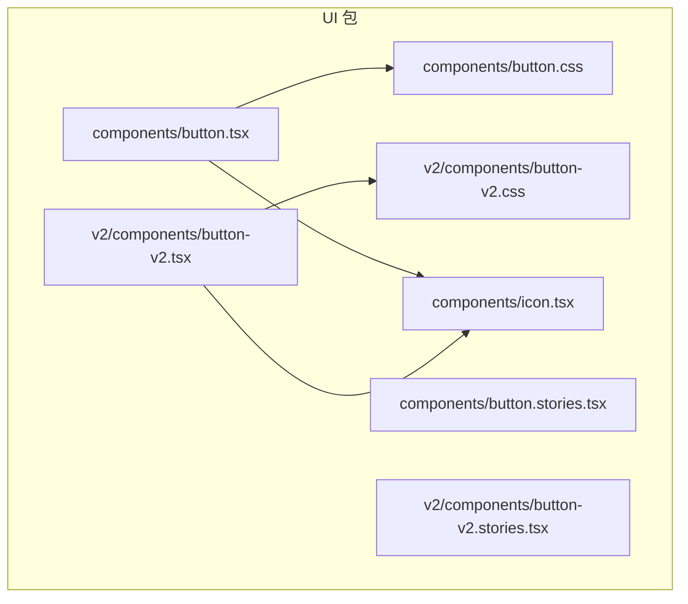
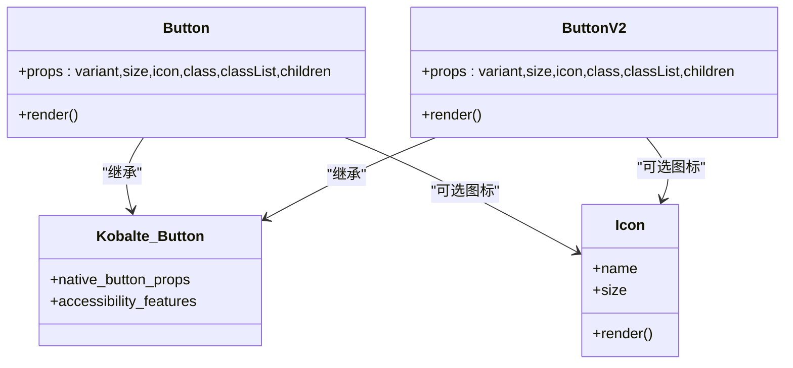
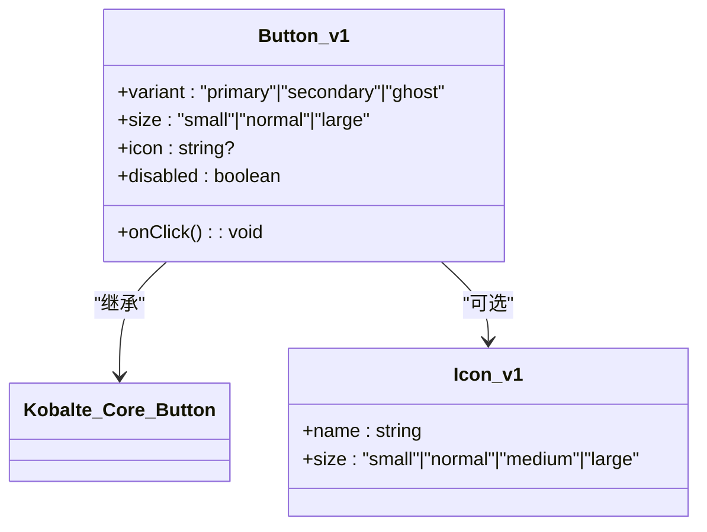
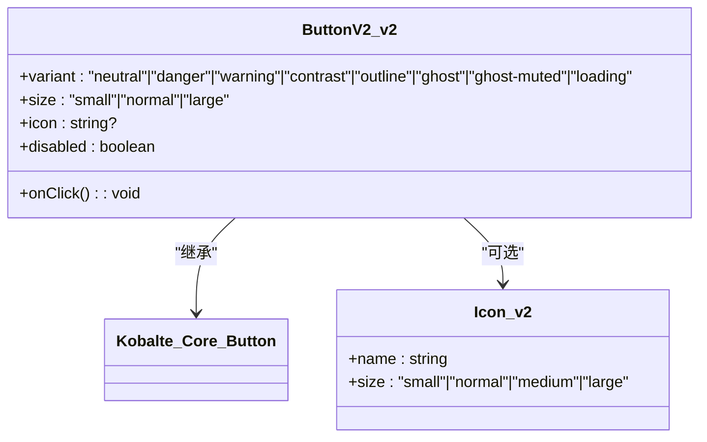
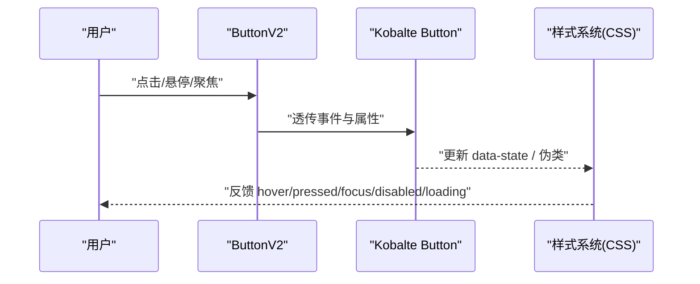
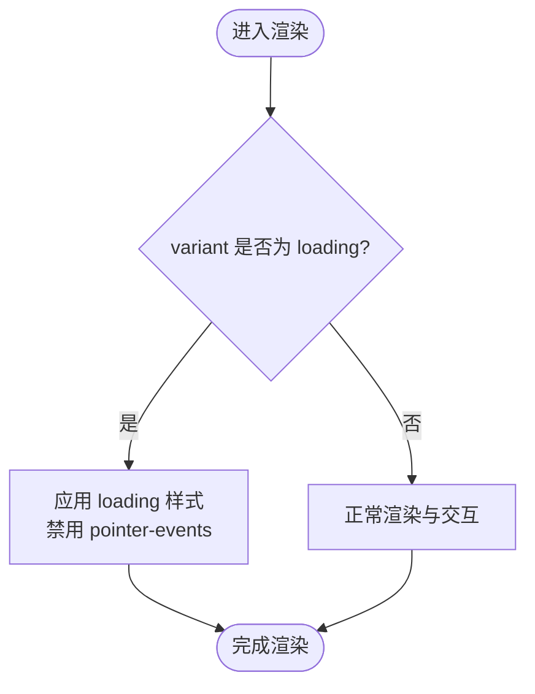
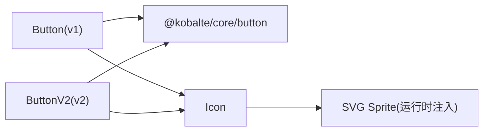

# 按钮组件

<cite>
**本文引用的文件**
- [button.tsx](file://packages/ui/src/components/button.tsx)
- [button.css](file://packages/ui/src/components/button.css)
- [button.stories.tsx](file://packages/ui/src/components/button.stories.tsx)
- [button-v2.tsx](file://packages/ui/src/v2/components/button-v2.tsx)
- [button-v2.css](file://packages/ui/src/v2/components/button-v2.css)
- [button-v2.stories.tsx](file://packages/ui/src/v2/components/button-v2.stories.tsx)
- [icon.tsx](file://packages/ui/src/components/icon.tsx)
</cite>

## 目录
1. [简介](#简介)
2. [项目结构](#项目结构)
3. [核心组件](#核心组件)
4. [架构总览](#架构总览)
5. [详细组件分析](#详细组件分析)
6. [依赖关系分析](#依赖关系分析)
7. [性能考量](#性能考量)
8. [故障排查指南](#故障排查指南)
9. [结论](#结论)
10. [附录：使用示例与最佳实践](#附录使用示例与最佳实践)

## 简介
本文件为 openNovel UI 中的按钮组件提供完整文档，涵盖两个版本：
- Button（v1）：基于 Kobalte Core 的轻量封装，支持 primary、secondary、ghost 变体与 small/normal/large 尺寸。
- ButtonV2（v2）：视觉增强版，新增 neutral、danger、warning、contrast、outline、ghost-muted、loading 等丰富变体，并完善状态样式与可访问性表现。

文档将详细说明 API、状态管理、图标集成、键盘导航与可访问性、主题定制、响应式行为以及组合使用最佳实践，并提供 Storybook 示例路径以便快速查阅。

## 项目结构
按钮组件位于 packages/ui 包中，分为 v1 与 v2 两套实现，各自包含组件与样式文件，并通过 Storybook 展示用法与变体。

图表来源
- [button.tsx:1-34](file://packages/ui/src/components/button.tsx#L1-L34)
- [button.css:1-195](file://packages/ui/src/components/button.css#L1-L195)
- [button.stories.tsx:1-109](file://packages/ui/src/components/button.stories.tsx#L1-L109)
- [button-v2.tsx:1-36](file://packages/ui/src/v2/components/button-v2.tsx#L1-L36)
- [button-v2.css:1-263](file://packages/ui/src/v2/components/button-v2.css#L1-L263)
- [button-v2.stories.tsx:1-154](file://packages/ui/src/v2/components/button-v2.stories.tsx#L1-L154)
- [icon.tsx:1-171](file://packages/ui/src/components/icon.tsx#L1-L171)

章节来源
- [button.tsx:1-34](file://packages/ui/src/components/button.tsx#L1-L34)
- [button-v2.tsx:1-36](file://packages/ui/src/v2/components/button-v2.tsx#L1-L36)
- [icon.tsx:1-171](file://packages/ui/src/components/icon.tsx#L1-L171)

## 核心组件
- Button（v1）
  - 作用：基础按钮封装，继承 Kobalte Button 能力，提供数据属性驱动样式与可选图标。
  - 关键特性：data-component、data-size、data-variant、data-icon；支持 classList/class 合并。
- ButtonV2（v2）
  - 作用：视觉与交互增强的按钮，提供更丰富的变体与状态样式，内置 loading 态。
  - 关键特性：data-component="button-v2"、data-size、data-variant、data-icon；通过 data-state 控制状态展示。

章节来源
- [button.tsx:5-33](file://packages/ui/src/components/button.tsx#L5-L33)
- [button-v2.tsx:6-35](file://packages/ui/src/v2/components/button-v2.tsx#L6-L35)

## 架构总览
Button/ButtonV2 均基于 @kobalte/core/button 构建，内部渲染原生 button 语义元素，并通过 data-* 属性与 CSS 变量驱动外观。图标由 Icon 组件统一注入，确保一致的视觉风格与可访问性。

图表来源
- [button.tsx:1-34](file://packages/ui/src/components/button.tsx#L1-L34)
- [button-v2.tsx:1-36](file://packages/ui/src/v2/components/button-v2.tsx#L1-L36)
- [icon.tsx:149-171](file://packages/ui/src/components/icon.tsx#L149-L171)

## 详细组件分析

### Button（v1）
- API 概览
  - variant: "primary" | "secondary" | "ghost"
  - size: "small" | "normal" | "large"
  - icon: 图标名称（来自 Icon 组件）
  - 其他：继承 Kobalte Button 与原生 button 属性（如 onClick、disabled、aria-* 等）
- 数据属性
  - data-component="button"
  - data-size、data-variant、data-icon
- 样式要点
  - 通过 data-variant 选择器区分 primary/secondary/ghost 的配色、边框、阴影与禁用态
  - 通过 data-size 控制高度、内边距、字号与行高
  - focus-visible 与 hover/active 状态均有明确样式
- 图标集成
  - 当传入 icon 时，在文本前渲染 Icon 组件，默认小尺寸
- 可访问性
  - 继承 Kobalte 的可访问性能力；建议为纯图标按钮提供 aria-label

章节来源
- [button.tsx:5-33](file://packages/ui/src/components/button.tsx#L5-L33)
- [button.css:14-107](file://packages/ui/src/components/button.css#L14-L107)
- [button.css:109-165](file://packages/ui/src/components/button.css#L109-L165)
- [button.stories.tsx:47-63](file://packages/ui/src/components/button.stories.tsx#L47-L63)

#### 类图（Button v1）

图表来源
- [button.tsx:5-33](file://packages/ui/src/components/button.tsx#L5-L33)
- [icon.tsx:149-171](file://packages/ui/src/components/icon.tsx#L149-L171)

### ButtonV2（v2）
- API 概览
  - variant: "neutral" | "danger" | "warning" | "contrast" | "outline" | "ghost" | "ghost-muted" | "loading"
  - size: "small" | "normal" | "large"
  - icon: 图标名称（来自 Icon 组件）
  - 其他：继承 Kobalte Button 与原生 button 属性（如 onClick、disabled、aria-* 等）
- 数据属性
  - data-component="button-v2"
  - data-size、data-variant、data-icon
  - data-state: "default" | "hover" | "pressed" | "focus" | "disabled"（用于演示与覆盖）
- 样式要点
  - 各变体具备独立的背景、前景色、阴影与交互反馈
  - loading 变体禁用指针事件并呈现加载态
  - ghost/ghost-muted 透明背景，hover/pressed 有叠加层效果
  - outline 使用 inset 边框模拟描边
- 可访问性
  - 聚焦态使用 outline 与 outline-offset，保证可见焦点环
  - disabled/loading 态禁用交互，cursor 提示不可用

章节来源
- [button-v2.tsx:6-35](file://packages/ui/src/v2/components/button-v2.tsx#L6-L35)
- [button-v2.css:69-263](file://packages/ui/src/v2/components/button-v2.css#L69-L263)
- [button-v2.stories.tsx:36-48](file://packages/ui/src/v2/components/button-v2.stories.tsx#L36-L48)

#### 类图（ButtonV2 v2）

图表来源
- [button-v2.tsx:6-35](file://packages/ui/src/v2/components/button-v2.tsx#L6-L35)
- [icon.tsx:149-171](file://packages/ui/src/components/icon.tsx#L149-L171)

### 状态管理与交互流程
ButtonV2 通过 data-state 与 CSS 伪类共同表达交互状态，loading 变体通过样式禁用交互。

图表来源
- [button-v2.tsx:14-35](file://packages/ui/src/v2/components/button-v2.tsx#L14-L35)
- [button-v2.css:27-34](file://packages/ui/src/v2/components/button-v2.css#L27-L34)
- [button-v2.css:196-203](file://packages/ui/src/v2/components/button-v2.css#L196-L203)

### 复杂逻辑流程图（loading 态）

图表来源
- [button-v2.css:196-203](file://packages/ui/src/v2/components/button-v2.css#L196-L203)

## 依赖关系分析
- 组件依赖
  - Button/ButtonV2 依赖 @kobalte/core/button 提供无障碍与基础行为
  - 两者都依赖 Icon 组件以显示前置图标
- 样式依赖
  - v1 使用 button.css，通过 data-variant/data-size 选择器控制样式
  - v2 使用 button-v2.css，定义更丰富的变体与状态样式
- 外部资源
  - Icon 组件动态注入 SVG sprite，避免重复 DOM 插入

图表来源
- [button.tsx:1-3](file://packages/ui/src/components/button.tsx#L1-L3)
- [button-v2.tsx:1-4](file://packages/ui/src/v2/components/button-v2.tsx#L1-L4)
- [icon.tsx:117-142](file://packages/ui/src/components/icon.tsx#L117-L142)

章节来源
- [button.tsx:1-34](file://packages/ui/src/components/button.tsx#L1-L34)
- [button-v2.tsx:1-36](file://packages/ui/src/v2/components/button-v2.tsx#L1-L36)
- [icon.tsx:117-142](file://packages/ui/src/components/icon.tsx#L117-L142)

## 性能考量
- 渲染开销
  - 两者均为轻量封装，主要开销来自 Kobalte 的基础能力与 Icon 的 SVG 渲染
- 图标优化
  - Icon 组件仅在首次挂载时注入一次 SVG sprite，避免重复创建
- 样式计算
  - 使用 data-* 选择器减少条件渲染分支，提升样式匹配效率
- 交互反馈
  - v2 通过 CSS 伪类与 data-state 控制状态，减少 JS 重绘

章节来源
- [icon.tsx:117-142](file://packages/ui/src/components/icon.tsx#L117-L142)
- [button-v2.css:27-34](file://packages/ui/src/v2/components/button-v2.css#L27-L34)

## 故障排查指南
- 图标不显示
  - 检查 icon 名称是否有效；确认 Icon 组件已挂载并注入 sprite
- 样式未生效
  - 确认 data-variant 与 data-size 值是否在支持的枚举范围内
  - 检查 CSS 文件是否被正确引入
- 交互无反馈
  - 检查是否设置了 disabled 或 loading 导致指针事件被禁用
  - 验证 focus-visible 样式是否被全局样式覆盖
- 可访问性问题
  - 纯图标按钮需设置 aria-label
  - 确保键盘 Tab 顺序合理，焦点环可见

章节来源
- [button.stories.tsx:22-27](file://packages/ui/src/components/button.stories.tsx#L22-L27)
- [button-v2.css:27-34](file://packages/ui/src/v2/components/button-v2.css#L27-L34)
- [button-v2.css:196-203](file://packages/ui/src/v2/components/button-v2.css#L196-L203)

## 结论
Button 与 ButtonV2 提供了从基础到增强的完整按钮能力。v1 适合简洁场景，v2 适合需要丰富视觉与状态的界面。两者均具备良好的可访问性与可扩展性，配合 Icon 组件可实现一致的图标体验。推荐在新建功能中优先使用 ButtonV2，以获得更好的视觉一致性与交互反馈。

## 附录：使用示例与最佳实践

### API 参考
- Button（v1）
  - 属性：variant、size、icon、class、classList、children
  - 事件：onClick（继承自 Kobalte Button）
  - 状态：disabled（原生）、focus/hover/active（样式）
- ButtonV2（v2）
  - 属性：variant、size、icon、class、classList、children
  - 事件：onClick（继承自 Kobalte Button）
  - 状态：disabled、loading（样式禁用交互）、focus/hover/pressed（样式）

章节来源
- [button.stories.tsx:47-63](file://packages/ui/src/components/button.stories.tsx#L47-L63)
- [button-v2.stories.tsx:36-48](file://packages/ui/src/v2/components/button-v2.stories.tsx#L36-L48)

### 变体与尺寸
- v1 变体：primary、secondary、ghost
- v2 变体：neutral、danger、warning、contrast、outline、ghost、ghost-muted、loading
- 尺寸：small、normal、large（v1 与 v2 均支持）

章节来源
- [button.stories.tsx:47-63](file://packages/ui/src/components/button.stories.tsx#L47-L63)
- [button-v2.stories.tsx:36-48](file://packages/ui/src/v2/components/button-v2.stories.tsx#L36-L48)

### 图标集成
- 通过 icon 属性传入图标名，按钮会在文本前渲染图标
- 推荐使用与按钮语义一致的图标（如“保存”、“删除”、“编辑”）

章节来源
- [button.tsx:27-29](file://packages/ui/src/components/button.tsx#L27-L29)
- [button-v2.tsx:29-31](file://packages/ui/src/v2/components/button-v2.tsx#L29-L31)
- [icon.tsx:149-171](file://packages/ui/src/components/icon.tsx#L149-L171)

### 键盘导航与可访问性
- 支持 Tab 聚焦与 Enter/Space 触发
- 聚焦态使用 outline 与 outline-offset，确保可见焦点环
- 纯图标按钮需提供 aria-label

章节来源
- [button.stories.tsx:22-27](file://packages/ui/src/components/button.stories.tsx#L22-L27)
- [button-v2.css:27-34](file://packages/ui/src/v2/components/button-v2.css#L27-L34)

### 样式定制与主题适配
- 通过 CSS 变量覆盖颜色、阴影、圆角等
- 使用 data-variant 与 data-size 选择器进行局部覆盖
- v2 的 loading 态通过样式禁用交互，无需额外 JS

章节来源
- [button.css:14-107](file://packages/ui/src/components/button.css#L14-L107)
- [button-v2.css:69-203](file://packages/ui/src/v2/components/button-v2.css#L69-L203)

### 响应式行为
- 按钮尺寸与间距在不同屏幕下保持一致的视觉比例
- 建议在工具栏中使用 flex 布局与 wrap，使按钮在小屏自动换行

章节来源
- [button-v2.stories.tsx:53-74](file://packages/ui/src/v2/components/button-v2.stories.tsx#L53-L74)

### 组合使用最佳实践
- 按钮组：使用 gap 与 flex 排列，保持统一的间距与对齐
- 工具栏：主操作使用 contrast/primary，次要操作使用 ghost/secondary，危险操作使用 danger
- 加载状态：提交类操作使用 loading 变体，避免重复提交

章节来源
- [button-v2.stories.tsx:53-74](file://packages/ui/src/v2/components/button-v2.stories.tsx#L53-L74)
- [button-v2.stories.tsx:119-153](file://packages/ui/src/v2/components/button-v2.stories.tsx#L119-L153)

### 代码示例路径
- v1 示例与文档：[button.stories.tsx](file://packages/ui/src/components/button.stories.tsx)
- v2 示例与文档：[button-v2.stories.tsx](file://packages/ui/src/v2/components/button-v2.stories.tsx)
- 组件实现：
  - v1：[button.tsx](file://packages/ui/src/components/button.tsx)
  - v2：[button-v2.tsx](file://packages/ui/src/v2/components/button-v2.tsx)
- 样式：
  - v1：[button.css](file://packages/ui/src/components/button.css)
  - v2：[button-v2.css](file://packages/ui/src/v2/components/button-v2.css)
- 图标：[icon.tsx](file://packages/ui/src/components/icon.tsx)