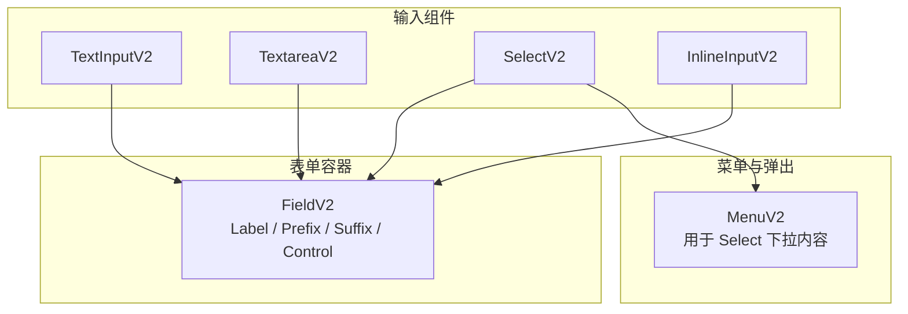
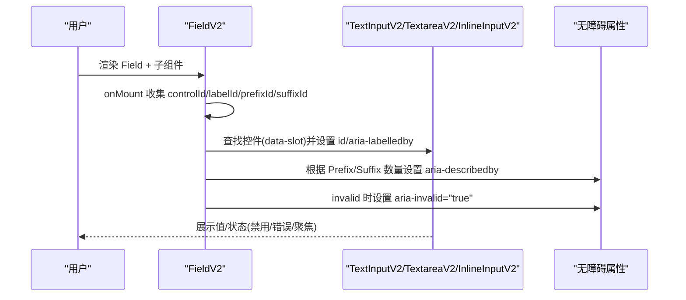
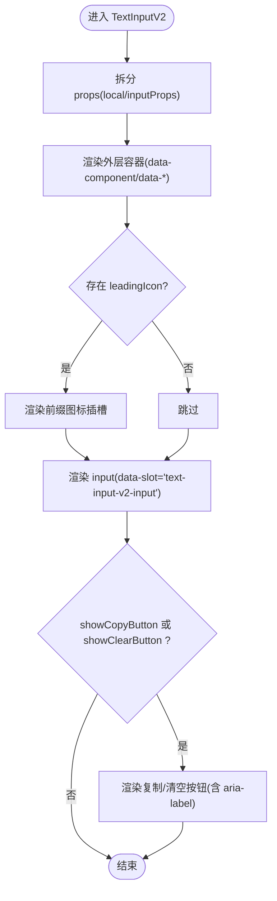
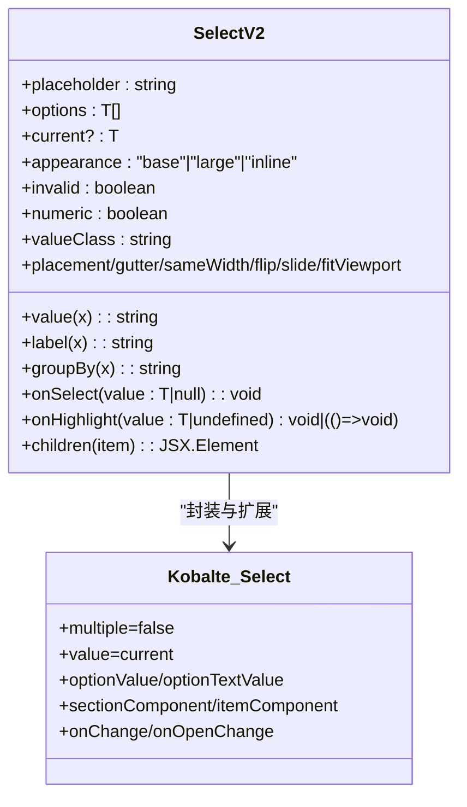
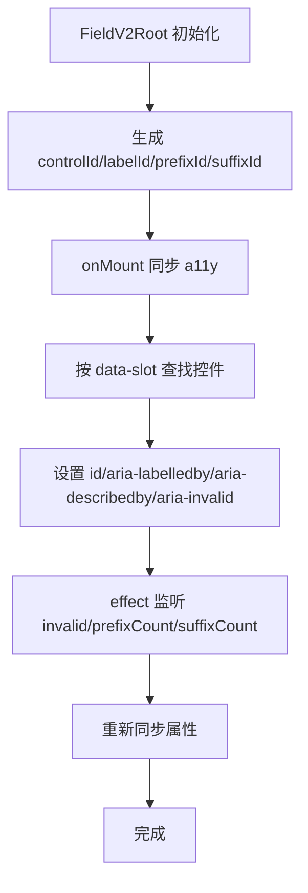
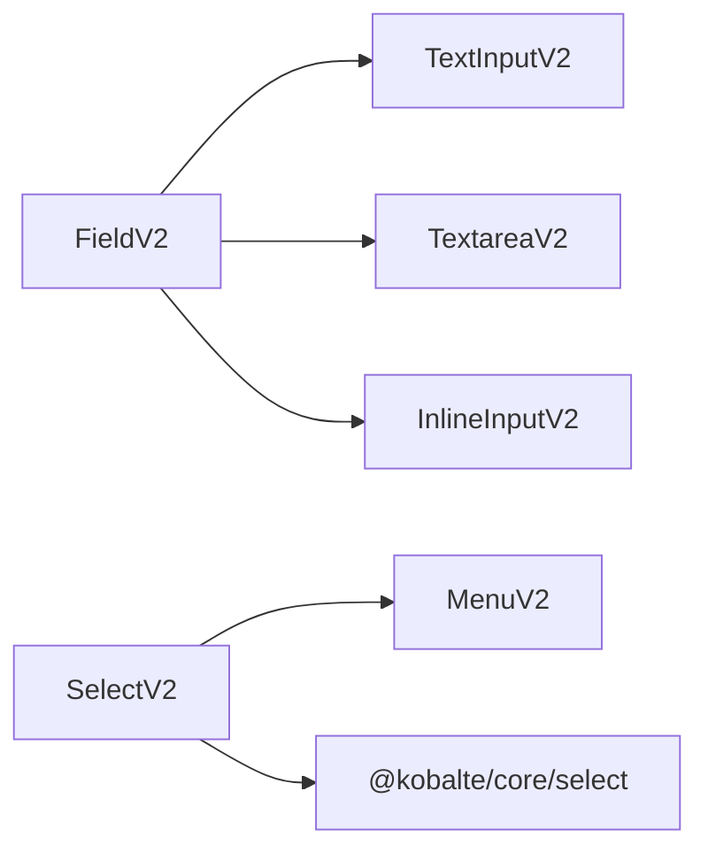

# 输入组件

<cite>
**本文引用的文件**   
- [packages/ui/src/v2/components/text-input-v2.tsx](file://packages/ui/src/v2/components/text-input-v2.tsx)
- [packages/ui/src/v2/components/textarea-v2.tsx](file://packages/ui/src/v2/components/textarea-v2.tsx)
- [packages/ui/src/v2/components/select-v2.tsx](file://packages/ui/src/v2/components/select-v2.tsx)
- [packages/ui/src/v2/components/field-v2.tsx](file://packages/ui/src/v2/components/field-v2.tsx)
- [packages/ui/src/v2/components/inline-input-v2.tsx](file://packages/ui/src/v2/components/inline-input-v2.tsx)
- [packages/ui/src/v2/components/menu-v2.tsx](file://packages/ui/src/v2/components/menu-v2.tsx)
- [packages/ui/src/v2/components/text-input-v2.stories.tsx](file://packages/ui/src/v2/components/text-input-v2.stories.tsx)
- [packages/ui/src/v2/components/textarea-v2.stories.tsx](file://packages/ui/src/v2/components/textarea-v2.stories.tsx)
- [packages/ui/src/v2/components/field-v2.stories.tsx](file://packages/ui/src/v2/components/field-v2.stories.tsx)
- [packages/ui/src/v2/components/inline-input-v2.stories.tsx](file://packages/ui/src/v2/components/inline-input-v2.stories.tsx)
- [packages/ui/src/components/inline-input.tsx](file://packages/ui/src/components/inline-input.tsx)
</cite>

## 目录
1. [简介](#简介)
2. [项目结构](#项目结构)
3. [核心组件](#核心组件)
4. [架构总览](#架构总览)
5. [详细组件分析](#详细组件分析)
6. [依赖关系分析](#依赖关系分析)
7. [性能考量](#性能考量)
8. [故障排查指南](#故障排查指南)
9. [结论](#结论)
10. [附录：API 与使用示例](#附录api-与使用示例)

## 简介
本文件为 openNovel 的输入组件提供系统化文档，覆盖文本输入框、多行文本域、下拉选择器以及内联输入等 v2 组件的设计规范与实现细节。内容包含：
- 每个组件的 API（值绑定、验证状态、占位符、前缀/后缀、外观尺寸等）
- 表单集成模式（Field 组合、无障碍属性自动合并、错误提示）
- 组合使用模式与最佳实践
- 实时交互（复制/清空按钮、高亮预览）、键盘导航与无障碍支持
- 完整的使用示例路径，便于在 Storybook 中快速查看

## 项目结构
输入相关组件集中在 packages/ui/src/v2/components 下，采用“原子组件 + Field 容器”的组合模式：
- TextInputV2：单行输入，支持前缀图标、复制/清空按钮、数值对齐、错误态、尺寸与宽度控制
- TextareaV2：多行输入，支持错误态、流体宽度
- SelectV2：基于 Kobalte 的单选下拉，支持分组、自定义渲染、高亮回调、定位策略
- InlineInputV2：带内联前缀标签的单行输入，适合紧凑场景
- FieldV2：统一的字段布局与无障碍上下文，自动关联 Label/Prefix/Suffix 与控制元素

图表来源
- [packages/ui/src/v2/components/text-input-v2.tsx](file://packages/ui/src/v2/components/text-input-v2.tsx)
- [packages/ui/src/v2/components/textarea-v2.tsx](file://packages/ui/src/v2/components/textarea-v2.tsx)
- [packages/ui/src/v2/components/select-v2.tsx](file://packages/ui/src/v2/components/select-v2.tsx)
- [packages/ui/src/v2/components/inline-input-v2.tsx](file://packages/ui/src/v2/components/inline-input-v2.tsx)
- [packages/ui/src/v2/components/field-v2.tsx](file://packages/ui/src/v2/components/field-v2.tsx)
- [packages/ui/src/v2/components/menu-v2.tsx](file://packages/ui/src/v2/components/menu-v2.tsx)

章节来源
- [packages/ui/src/v2/components/text-input-v2.tsx:1-98](file://packages/ui/src/v2/components/text-input-v2.tsx#L1-L98)
- [packages/ui/src/v2/components/textarea-v2.tsx:1-35](file://packages/ui/src/v2/components/textarea-v2.tsx#L1-L35)
- [packages/ui/src/v2/components/select-v2.tsx:1-209](file://packages/ui/src/v2/components/select-v2.tsx#L1-L209)
- [packages/ui/src/v2/components/inline-input-v2.tsx:1-105](file://packages/ui/src/v2/components/inline-input-v2.tsx#L1-L105)
- [packages/ui/src/v2/components/field-v2.tsx:1-266](file://packages/ui/src/v2/components/field-v2.tsx#L1-L266)
- [packages/ui/src/v2/components/menu-v2.tsx:49-225](file://packages/ui/src/v2/components/menu-v2.tsx#L49-L225)

## 核心组件
- TextInputV2：单行输入，支持 leadingIcon、showCopyButton、showClearButton、copyLabel/clearLabel、onCopyClick/onClearClick、numeric、invalid、appearance(base/large)、fluid、disabled、type
- TextareaV2：多行输入，支持 invalid、fluid、rows、disabled，透传原生 textarea 属性
- SelectV2：单选下拉，支持 placeholder、options、current、value/label/groupBy、onSelect、onHighlight、appearance(base/large/inline)、invalid、numeric、children(valueClass)、placement/gutter/sameWidth/flip/slide/fitViewport
- InlineInputV2：内联前缀输入，支持 prefix、labelWidth、showCopyButton、copyLabel、onCopyClick、numeric、invalid、appearance、disabled
- FieldV2：字段容器，提供 Label/Prefix/Suffix/Control，自动处理 a11y 关联与 invalid 传播

章节来源
- [packages/ui/src/v2/components/text-input-v2.tsx:5-27](file://packages/ui/src/v2/components/text-input-v2.tsx#L5-L27)
- [packages/ui/src/v2/components/textarea-v2.tsx:4-9](file://packages/ui/src/v2/components/textarea-v2.tsx#L4-L9)
- [packages/ui/src/v2/components/select-v2.tsx:43-62](file://packages/ui/src/v2/components/select-v2.tsx#L43-L62)
- [packages/ui/src/v2/components/inline-input-v2.tsx:5-22](file://packages/ui/src/v2/components/inline-input-v2.tsx#L5-L22)
- [packages/ui/src/v2/components/field-v2.tsx:46-48](file://packages/ui/src/v2/components/field-v2.tsx#L46-L48)

## 架构总览
FieldV2 作为统一容器，通过 Context 管理控件 ID、Label ID、辅助信息 ID，并在挂载后自动将 aria-labelledby/describedby/invalidate 同步到实际控件。各输入组件对外暴露 data-* 标记与 slot，便于样式与测试定位。

图表来源
- [packages/ui/src/v2/components/field-v2.tsx:50-138](file://packages/ui/src/v2/components/field-v2.tsx#L50-L138)
- [packages/ui/src/v2/components/text-input-v2.tsx:29-97](file://packages/ui/src/v2/components/text-input-v2.tsx#L29-L97)
- [packages/ui/src/v2/components/textarea-v2.tsx:11-34](file://packages/ui/src/v2/components/textarea-v2.tsx#L11-L34)
- [packages/ui/src/v2/components/inline-input-v2.tsx:24-105](file://packages/ui/src/v2/components/inline-input-v2.tsx#L24-L105)

## 详细组件分析

### TextInputV2（单行输入）
- 设计要点
  - 支持前缀图标 leadingIcon，右侧可显示复制/清空按钮
  - numeric 启用数字等宽排版；invalid 驱动错误态
  - appearance 控制高度（base/large），fluid 控制宽度自适应
- 关键行为
  - 透传原生 input 属性（value/defaultValue/placeholder/disabled/name 等）
  - 复制/清空按钮通过 onCopyClick/onClearClick 暴露事件
  - 无障碍：aria-invalid 由 invalid 控制；data-* 标记供样式与自动化测试使用
- 典型用法
  - 受控与非受控均可；可与 Field 组合使用以获取 Label/Prefix/Suffix/Tooltip

图表来源
- [packages/ui/src/v2/components/text-input-v2.tsx:29-97](file://packages/ui/src/v2/components/text-input-v2.tsx#L29-L97)

章节来源
- [packages/ui/src/v2/components/text-input-v2.tsx:1-98](file://packages/ui/src/v2/components/text-input-v2.tsx#L1-L98)

### TextareaV2（多行输入）
- 设计要点
  - 与 TextInputV2 一致的视觉语言与状态（hover/focus/invalid/disabled）
  - rows 默认 3，fluid 控制宽度拉伸
- 关键行为
  - 透传原生 textarea 属性；invalid 驱动错误态与 aria-invalid
- 典型用法
  - 与 Field 组合，配合 Prefix/Suffix 显示单位或帮助文案

章节来源
- [packages/ui/src/v2/components/textarea-v2.tsx:1-35](file://packages/ui/src/v2/components/textarea-v2.tsx#L1-L35)

### SelectV2（下拉选择器）
- 设计要点
  - 基于 @kobalte/core/select，支持分组(groupBy)、自定义渲染(children)、高亮回调(onHighlight)
  - appearance 支持 base/large/inline；inline 模式下触发器更紧凑
  - 定位策略：placement/gutter/sameWidth/flip/slide/fitViewport
- 关键行为
  - current/value/label 定义选中项与显示文本
  - onSelect 返回选中项或 null；onOpenChange 监听打开/关闭
  - 内部维护 onHighlight 的清理逻辑，避免内存泄漏
- 典型用法
  - 数据源 options 可为对象数组，通过 value/label 映射键与显示文本

图表来源
- [packages/ui/src/v2/components/select-v2.tsx:43-209](file://packages/ui/src/v2/components/select-v2.tsx#L43-L209)

章节来源
- [packages/ui/src/v2/components/select-v2.tsx:1-209](file://packages/ui/src/v2/components/select-v2.tsx#L1-L209)

### InlineInputV2（内联前缀输入）
- 设计要点
  - 固定前缀段(prefix)与分隔线，适合表格行内编辑
  - labelWidth 控制前缀段宽度；showCopyButton 提供复制能力
  - numeric 对前缀与值均生效；invalid/appearance/disabled 与 TextInputV2 一致
- 关键行为
  - 点击前缀区域聚焦输入框，不破坏外部 label 关联
  - 透传原生 input 属性；ref 转发

章节来源
- [packages/ui/src/v2/components/inline-input-v2.tsx:1-105](file://packages/ui/src/v2/components/inline-input-v2.tsx#L1-L105)

### FieldV2（字段容器）
- 设计要点
  - 提供 Label/Prefix/Suffix/Control 四个子组件
  - 自动为控件设置 id、aria-labelledby、aria-describedby、aria-invalid
  - invalid 从 Field 向下传播至控件外壳
- 关键行为
  - 通过 data-slot 选择器定位控件，确保与具体输入组件解耦
  - 注册/注销 Prefix/Suffix，动态更新 describedby

图表来源
- [packages/ui/src/v2/components/field-v2.tsx:50-138](file://packages/ui/src/v2/components/field-v2.tsx#L50-L138)

章节来源
- [packages/ui/src/v2/components/field-v2.tsx:1-266](file://packages/ui/src/v2/components/field-v2.tsx#L1-L266)

### MenuV2（菜单与弹出）
- 设计要点
  - 为 SelectV2 的下拉内容提供统一菜单结构与样式
  - 支持 Item/CheckboxItem/RadioGroup/Group/GroupLabel/Separator/Sub 等
  - 支持 shortcut/badge 等元信息展示
- 典型用法
  - 与 SelectV2 的 Content/Listbox 配合，渲染选项列表

章节来源
- [packages/ui/src/v2/components/menu-v2.tsx:49-225](file://packages/ui/src/v2/components/menu-v2.tsx#L49-L225)

## 依赖关系分析
- 输入组件与 FieldV2 通过 data-slot 与 data-component 进行松耦合通信
- SelectV2 依赖 @kobalte/core/select 提供可访问性下拉能力
- 所有组件遵循一致的 data-* 命名约定，便于样式与测试定位

图表来源
- [packages/ui/src/v2/components/field-v2.tsx:1-266](file://packages/ui/src/v2/components/field-v2.tsx#L1-L266)
- [packages/ui/src/v2/components/select-v2.tsx:1-209](file://packages/ui/src/v2/components/select-v2.tsx#L1-L209)
- [packages/ui/src/v2/components/menu-v2.tsx:49-225](file://packages/ui/src/v2/components/menu-v2.tsx#L49-L225)

章节来源
- [packages/ui/src/v2/components/field-v2.tsx:1-266](file://packages/ui/src/v2/components/field-v2.tsx#L1-L266)
- [packages/ui/src/v2/components/select-v2.tsx:1-209](file://packages/ui/src/v2/components/select-v2.tsx#L1-L209)
- [packages/ui/src/v2/components/menu-v2.tsx:49-225](file://packages/ui/src/v2/components/menu-v2.tsx#L49-L225)

## 性能考量
- SelectV2 的 onHighlight 会在每次高亮项变化时执行，组件内部维护 key 与 cleanup，避免重复订阅与内存泄漏
- FieldV2 使用 createEffect 监听无效状态与前/后缀计数变化，仅在必要时同步 a11y 属性
- 建议：
  - 大数据集下拉使用 groupBy 分组减少渲染开销
  - 受控组件尽量使用稳定引用，避免不必要的重渲染
  - 合理使用 fluid 与 appearance，减少布局抖动

[本节为通用指导，无需源码引用]

## 故障排查指南
- 无障碍未生效
  - 检查是否将输入直接放在 Field 内或使用 Field.Control 包裹
  - 确认控件 data-slot 未被覆盖或移除
  - 参考 FieldV2 的同步逻辑，确保控件被正确识别
- 错误态不显示
  - 确保 Field.invalid 或控件 invalid 为 true
  - 检查 aria-invalid 是否正确设置
- 复制/清空按钮无响应
  - 确认 showCopyButton/showClearButton 已开启
  - 检查 onCopyClick/onClearClick 是否被正确传递与调用

章节来源
- [packages/ui/src/v2/components/field-v2.tsx:81-120](file://packages/ui/src/v2/components/field-v2.tsx#L81-L120)
- [packages/ui/src/v2/components/text-input-v2.tsx:73-94](file://packages/ui/src/v2/components/text-input-v2.tsx#L73-L94)

## 结论
openNovel 的输入组件体系以 FieldV2 为中心，结合 TextInputV2、TextareaV2、SelectV2、InlineInputV2 等原子组件，形成一套风格统一、无障碍友好、易于组合的输入方案。通过一致的 data-* 约定与清晰的 API 边界，既满足复杂业务需求，又保持代码的可维护性与可扩展性。

[本节为总结，无需源码引用]

## 附录：API 与使用示例

### 文本输入框（TextInputV2）
- 属性概览
  - 值与状态：value/defaultValue、disabled、invalid、type
  - 装饰：leadingIcon、showCopyButton、showClearButton、copyLabel/clearLabel
  - 行为：onCopyClick、onClearClick、numeric
  - 外观：appearance("base"|"large")、fluid
- 使用示例
  - 基础用法与复制/清空按钮：参见 [packages/ui/src/v2/components/text-input-v2.stories.tsx](file://packages/ui/src/v2/components/text-input-v2.stories.tsx)
  - 与 Field 组合：参见 [packages/ui/src/v2/components/field-v2.stories.tsx](file://packages/ui/src/v2/components/field-v2.stories.tsx)

章节来源
- [packages/ui/src/v2/components/text-input-v2.tsx:5-27](file://packages/ui/src/v2/components/text-input-v2.tsx#L5-L27)
- [packages/ui/src/v2/components/text-input-v2.stories.tsx](file://packages/ui/src/v2/components/text-input-v2.stories.tsx)
- [packages/ui/src/v2/components/field-v2.stories.tsx:53-79](file://packages/ui/src/v2/components/field-v2.stories.tsx#L53-L79)

### 多行文本域（TextareaV2）
- 属性概览
  - 值与状态：value/defaultValue、disabled、invalid、rows
  - 外观：fluid
- 使用示例
  - 基础用法与 Field 组合：参见 [packages/ui/src/v2/components/textarea-v2.stories.tsx](file://packages/ui/src/v2/components/textarea-v2.stories.tsx)

章节来源
- [packages/ui/src/v2/components/textarea-v2.tsx:4-9](file://packages/ui/src/v2/components/textarea-v2.tsx#L4-L9)
- [packages/ui/src/v2/components/textarea-v2.stories.tsx:1-59](file://packages/ui/src/v2/components/textarea-v2.stories.tsx#L1-L59)

### 下拉选择器（SelectV2）
- 属性概览
  - 数据：options、current、value(x)、label(x)、groupBy(x)
  - 交互：onSelect、onHighlight、onOpenChange
  - 外观：appearance("base"|"large"|"inline")、invalid、numeric、valueClass
  - 弹出：placement、gutter、sameWidth、flip、slide、fitViewport
- 使用示例
  - 基础与分组、高亮预览：参见 [packages/ui/src/v2/components/select-v2.tsx](file://packages/ui/src/v2/components/select-v2.tsx)

章节来源
- [packages/ui/src/v2/components/select-v2.tsx:43-62](file://packages/ui/src/v2/components/select-v2.tsx#L43-L62)
- [packages/ui/src/v2/components/select-v2.tsx:120-209](file://packages/ui/src/v2/components/select-v2.tsx#L120-L209)

### 内联输入（InlineInputV2）
- 属性概览
  - 前缀：prefix、labelWidth
  - 行为：showCopyButton、copyLabel、onCopyClick、numeric
  - 外观：appearance("base"|"large")、invalid、disabled
- 使用示例
  - 与 Field 组合：参见 [packages/ui/src/v2/components/field-v2.stories.tsx](file://packages/ui/src/v2/components/field-v2.stories.tsx)

章节来源
- [packages/ui/src/v2/components/inline-input-v2.tsx:5-22](file://packages/ui/src/v2/components/inline-input-v2.tsx#L5-L22)
- [packages/ui/src/v2/components/field-v2.stories.tsx:94-105](file://packages/ui/src/v2/components/field-v2.stories.tsx#L94-L105)

### 表单集成模式（FieldV2）
- 模式说明
  - 将 Label/Prefix/Suffix/Control 与输入组件组合，Field 自动处理 a11y 与 invalid 传播
  - 可直接将输入置于 Field 内，无需 Control 包裹
- 使用示例
  - 多种组合与受控模式：参见 [packages/ui/src/v2/components/field-v2.stories.tsx](file://packages/ui/src/v2/components/field-v2.stories.tsx)

章节来源
- [packages/ui/src/v2/components/field-v2.tsx:122-138](file://packages/ui/src/v2/components/field-v2.tsx#L122-L138)
- [packages/ui/src/v2/components/field-v2.stories.tsx:1-51](file://packages/ui/src/v2/components/field-v2.stories.tsx#L1-L51)

### 键盘快捷键与无障碍
- 键盘导航
  - SelectV2 基于 Kobalte，支持方向键、Enter/Space 选择、Esc 关闭等标准行为
  - InlineInputV2 的前缀区域点击会聚焦输入框，不影响外部 label
- 无障碍
  - FieldV2 自动设置 aria-labelledby/describedby/aria-invalid
  - 输入组件通过 aria-invalid 与 data-* 标记提升可访问性与可测试性

章节来源
- [packages/ui/src/v2/components/select-v2.tsx:120-209](file://packages/ui/src/v2/components/select-v2.tsx#L120-L209)
- [packages/ui/src/v2/components/inline-input-v2.tsx:64-74](file://packages/ui/src/v2/components/inline-input-v2.tsx#L64-L74)
- [packages/ui/src/v2/components/field-v2.tsx:81-120](file://packages/ui/src/v2/components/field-v2.tsx#L81-L120)

### 实时验证、错误提示与自动完成
- 实时验证
  - 建议在父组件中监听 onInput/onSelect 并计算校验结果，将 invalid 传递给 Field 或对应输入组件
- 错误提示
  - 使用 Field.Prefix/Suffix 显示提示信息，或通过 TooltipV2 提供额外说明
- 自动完成
  - 当前输入组件未内置自动完成；可在上层封装过滤后的 options 与 onHighlight 实现“输入即高亮”的效果

[本节为通用指导，无需源码引用]

### 旧版内联输入（InlineInput）
- 简要说明
  - 轻量 inline input，支持 width 与标准 input 属性
- 使用示例
  - 参见 [packages/ui/src/components/inline-input.tsx](file://packages/ui/src/components/inline-input.tsx)

章节来源
- [packages/ui/src/components/inline-input.tsx:1-22](file://packages/ui/src/components/inline-input.tsx#L1-L22)