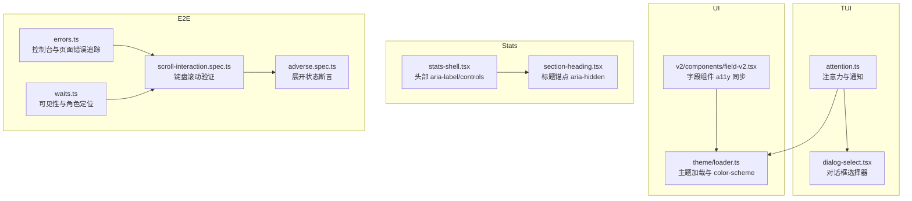
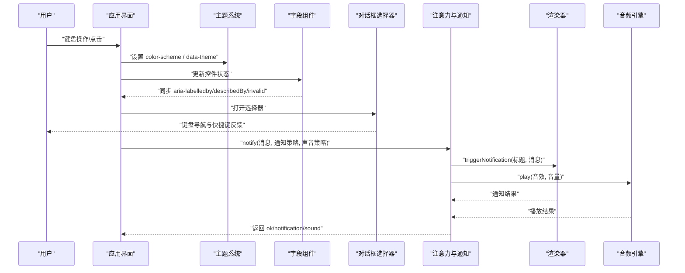
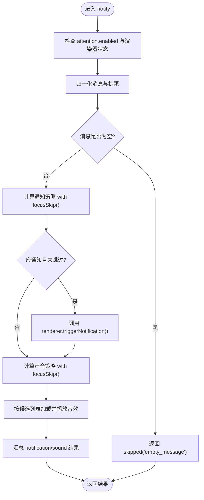
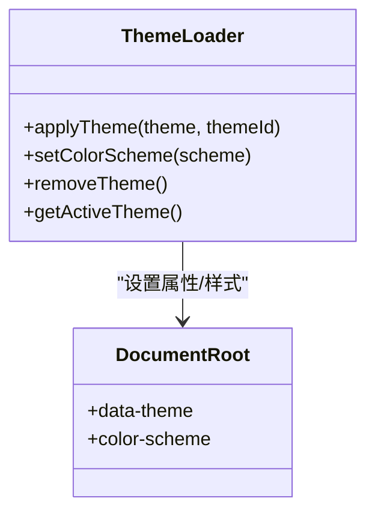
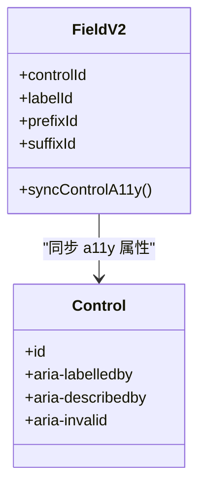
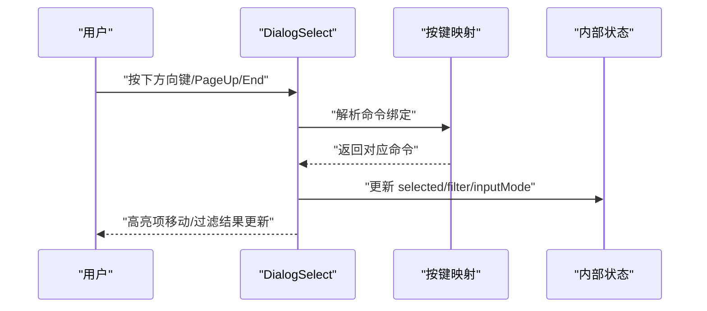
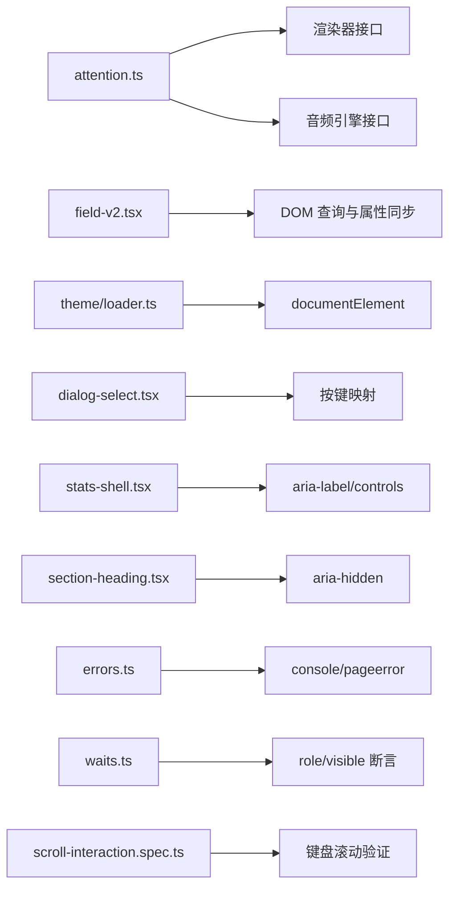

# 无障碍访问（a11y）

<cite>
**本文引用的文件**   
- [packages/tui/src/attention.ts](file://packages/tui/src/attention.ts)
- [packages/ui/src/theme/loader.ts](file://packages/ui/src/theme/loader.ts)
- [packages/ui/src/v2/components/field-v2.tsx](file://packages/ui/src/v2/components/field-v2.tsx)
- [packages/tui/src/ui/dialog-select.tsx](file://packages/tui/src/ui/dialog-select.tsx)
- [packages/stats/app/src/routes/stats-shell.tsx](file://packages/stats/app/src/routes/stats-shell.tsx)
- [packages/stats/app/src/routes/section-heading.tsx](file://packages/stats/app/src/routes/section-heading.tsx)
- [packages/app/e2e/utils/errors.ts](file://packages/app/e2e/utils/errors.ts)
- [packages/app/e2e/utils/waits.ts](file://packages/app/e2e/utils/waits.ts)
- [packages/app/e2e/performance/timeline-stability/scroll-interaction.spec.ts](file://packages/app/e2e/performance/timeline-stability/scroll-interaction.spec.ts)
- [packages/app/e2e/performance/timeline-stability/adverse.spec.ts](file://packages/app/e2e/performance/timeline-stability/adverse.spec.ts)
</cite>

## 目录
1. [简介](#简介)
2. [项目结构](#项目结构)
3. [核心组件](#核心组件)
4. [架构总览](#架构总览)
5. [详细组件分析](#详细组件分析)
6. [依赖关系分析](#依赖关系分析)
7. [性能与可访问性考量](#性能与可访问性考量)
8. [故障排查指南](#故障排查指南)
9. [结论](#结论)
10. [附录：WCAG 合规与最佳实践](#附录wcag-合规与最佳实践)

## 简介
本文件为 openNovel 的无障碍访问（a11y）系统提供系统化文档，覆盖语义化 HTML、ARIA 属性使用、键盘导航与焦点管理、屏幕阅读器支持、颜色对比度与视觉辅助、自动化测试与 WCAG 合规建议。内容基于仓库中现有实现进行归纳与扩展说明，帮助开发者在 UI 与交互层面持续提升可访问性体验。

## 项目结构
openNovel 的 a11y 相关能力分布在多个包中：
- TUI 注意力与通知子系统：负责系统级通知、声音提示与焦点状态联动
- UI 主题系统：负责明暗模式、色彩方案与对比度生成
- V2 表单字段组件：封装 label、prefix/suffix、invalid 状态等 a11y 属性同步
- 对话框选择器：键盘导航、命令绑定与焦点管理
- 统计页面头部：aria-label、aria-controls 等基础 a11y 标记
- E2E 工具：错误追踪、等待与键盘滚动验证

图表来源 
- [packages/tui/src/attention.ts:1-261](file://packages/tui/src/attention.ts#L1-L261)
- [packages/ui/src/theme/loader.ts:1-113](file://packages/ui/src/theme/loader.ts#L1-L113)
- [packages/ui/src/v2/components/field-v2.tsx:100-266](file://packages/ui/src/v2/components/field-v2.tsx#L100-L266)
- [packages/tui/src/ui/dialog-select.tsx:1-200](file://packages/tui/src/ui/dialog-select.tsx#L1-L200)
- [packages/stats/app/src/routes/stats-shell.tsx:102-141](file://packages/stats/app/src/routes/stats-shell.tsx#L102-L141)
- [packages/stats/app/src/routes/section-heading.tsx:1-24](file://packages/stats/app/src/routes/section-heading.tsx#L1-L24)
- [packages/app/e2e/utils/errors.ts:1-18](file://packages/app/e2e/utils/errors.ts#L1-L18)
- [packages/app/e2e/utils/waits.ts:1-11](file://packages/app/e2e/utils/waits.ts#L1-L11)
- [packages/app/e2e/performance/timeline-stability/scroll-interaction.spec.ts:137-164](file://packages/app/e2e/performance/timeline-stability/scroll-interaction.spec.ts#L137-L164)
- [packages/app/e2e/performance/timeline-stability/adverse.spec.ts:103-109](file://packages/app/e2e/performance/timeline-stability/adverse.spec.ts#L103-L109)

章节来源
- [packages/tui/src/attention.ts:1-261](file://packages/tui/src/attention.ts#L1-L261)
- [packages/ui/src/theme/loader.ts:1-113](file://packages/ui/src/theme/loader.ts#L1-L113)
- [packages/ui/src/v2/components/field-v2.tsx:100-266](file://packages/ui/src/v2/components/field-v2.tsx#L100-L266)
- [packages/tui/src/ui/dialog-select.tsx:1-200](file://packages/tui/src/ui/dialog-select.tsx#L1-L200)
- [packages/stats/app/src/routes/stats-shell.tsx:102-141](file://packages/stats/app/src/routes/stats-shell.tsx#L102-L141)
- [packages/stats/app/src/routes/section-heading.tsx:1-24](file://packages/stats/app/src/routes/section-heading.tsx#L1-L24)
- [packages/app/e2e/utils/errors.ts:1-18](file://packages/app/e2e/utils/errors.ts#L1-L18)
- [packages/app/e2e/utils/waits.ts:1-11](file://packages/app/e2e/utils/waits.ts#L1-L11)
- [packages/app/e2e/performance/timeline-stability/scroll-interaction.spec.ts:137-164](file://packages/app/e2e/performance/timeline-stability/scroll-interaction.spec.ts#L137-L164)
- [packages/app/e2e/performance/timeline-stability/adverse.spec.ts:103-109](file://packages/app/e2e/performance/timeline-stability/adverse.spec.ts#L103-L109)

## 核心组件
- 注意力与通知（TUI Attention）
  - 根据应用焦点状态（聚焦/失焦/未知）决定是否展示系统通知与播放声音
  - 支持多音包注册与激活、音量控制、消息与标题长度限制
  - 通过渲染器触发系统通知，并调用音频引擎播放声音
- 主题与色彩方案（Theme Loader）
  - 动态注入 CSS 变量，设置 documentElement 的 data-theme 与 color-scheme
  - 支持自动跟随系统明暗偏好
- 字段组件（Field V2）
  - 自动同步控件的 id、aria-labelledby、aria-describedby、aria-invalid
  - 将前缀/后缀区域与控件关联，提升屏幕阅读器可读性
- 对话框选择器（Dialog Select）
  - 内置键盘导航（上下、翻页、首尾）、输入模式切换（键盘/鼠标）
  - 命令绑定与快捷键显示，确保键盘可达性与可操作性
- 统计页头部（Stats Shell）
  - 使用 aria-label 描述品牌与导航，使用 aria-controls 关联菜单
- 章节标题（Section Heading）
  - 标题锚点使用 aria-hidden="true"，避免重复朗读

章节来源
- [packages/tui/src/attention.ts:1-261](file://packages/tui/src/attention.ts#L1-L261)
- [packages/ui/src/theme/loader.ts:1-113](file://packages/ui/src/theme/loader.ts#L1-L113)
- [packages/ui/src/v2/components/field-v2.tsx:100-266](file://packages/ui/src/v2/components/field-v2.tsx#L100-L266)
- [packages/tui/src/ui/dialog-select.tsx:1-200](file://packages/tui/src/ui/dialog-select.tsx#L1-L200)
- [packages/stats/app/src/routes/stats-shell.tsx:102-141](file://packages/stats/app/src/routes/stats-shell.tsx#L102-L141)
- [packages/stats/app/src/routes/section-heading.tsx:1-24](file://packages/stats/app/src/routes/section-heading.tsx#L1-L24)

## 架构总览
下图展示了 a11y 关键流程：用户操作触发界面更新，TUI 注意力模块依据焦点状态决定通知与声音；主题系统保证色彩方案与对比度；字段组件维护 a11y 属性一致性；E2E 用例验证键盘滚动与展开状态。

图表来源 
- [packages/ui/src/theme/loader.ts:1-113](file://packages/ui/src/theme/loader.ts#L1-L113)
- [packages/ui/src/v2/components/field-v2.tsx:100-266](file://packages/ui/src/v2/components/field-v2.tsx#L100-L266)
- [packages/tui/src/ui/dialog-select.tsx:1-200](file://packages/tui/src/ui/dialog-select.tsx#L1-L200)
- [packages/tui/src/attention.ts:1-261](file://packages/tui/src/attention.ts#L1-L261)

## 详细组件分析

### 注意力与通知（TUI Attention）
- 功能要点
  - 根据 focus 状态（focused/blurred/unknown）控制通知与声音的触发时机
  - 支持“仅失焦时通知”“始终播放声音”等策略
  - 音包机制允许注册与切换不同音效集合，默认内置多种音效
  - 文本归一化与长度限制，避免过长消息影响系统通知
- 处理流程
  - 校验配置与渲染器状态
  - 计算是否跳过通知或声音（基于 when 策略与当前焦点）
  - 调用渲染器触发系统通知
  - 按优先级尝试加载并播放音效
  - 返回结果包含是否成功、是否通知、是否播放声音以及跳过原因

图表来源 
- [packages/tui/src/attention.ts:151-205](file://packages/tui/src/attention.ts#L151-L205)

章节来源
- [packages/tui/src/attention.ts:1-261](file://packages/tui/src/attention.ts#L1-L261)

### 主题与色彩方案（Theme Loader）
- 功能要点
  - 动态注入 CSS 变量，设置根节点 data-theme 与 color-scheme
  - 支持自动跟随系统明暗偏好（prefers-color-scheme）
  - 提供 setColorScheme 接口以强制指定 light/dark/auto
- 对 a11y 的意义
  - 明确的 color-scheme 有助于操作系统与浏览器正确渲染高对比度与深色模式
  - 主题变量驱动的颜色组合需满足对比度要求（见后文“颜色对比度”）

图表来源 
- [packages/ui/src/theme/loader.ts:19-30](file://packages/ui/src/theme/loader.ts#L19-L30)
- [packages/ui/src/theme/loader.ts:106-112](file://packages/ui/src/theme/loader.ts#L106-L112)

章节来源
- [packages/ui/src/theme/loader.ts:1-113](file://packages/ui/src/theme/loader.ts#L1-L113)

### 字段组件（Field V2）
- 功能要点
  - 自动为控件设置 id、aria-labelledby、aria-describedby、aria-invalid
  - 前缀/后缀区域通过 aria-describedby 与控件关联
  - 无效状态同步到 shell 容器，便于样式与辅助技术识别
- 对 a11y 的意义
  - 标签与描述信息明确，提升屏幕阅读器的理解与播报准确性
  - 无效状态及时告知，减少用户困惑

图表来源 
- [packages/ui/src/v2/components/field-v2.tsx:81-100](file://packages/ui/src/v2/components/field-v2.tsx#L81-L100)
- [packages/ui/src/v2/components/field-v2.tsx:102-108](file://packages/ui/src/v2/components/field-v2.tsx#L102-L108)

章节来源
- [packages/ui/src/v2/components/field-v2.tsx:100-266](file://packages/ui/src/v2/components/field-v2.tsx#L100-L266)

### 对话框选择器（Dialog Select）
- 功能要点
  - 键盘导航：上下移动、翻页、首尾跳转
  - 输入模式切换：键盘/鼠标，避免误触
  - 命令绑定：将快捷键映射到具体动作，并在底部提示键位
- 对 a11y 的意义
  - 完整的键盘可达性与可操作性，符合 WCAG 2.1 的键盘无障碍要求
  - 清晰的键位提示帮助用户快速掌握交互方式

图表来源 
- [packages/tui/src/ui/dialog-select.tsx:372-426](file://packages/tui/src/ui/dialog-select.tsx#L372-L426)

章节来源
- [packages/tui/src/ui/dialog-select.tsx:1-200](file://packages/tui/src/ui/dialog-select.tsx#L1-L200)

### 统计页头部与章节标题
- 头部
  - 品牌链接与导航使用 aria-label 提供可读描述
  - 菜单按钮使用 aria-controls 关联目标区域
- 章节标题
  - 标题锚点使用 aria-hidden="true"，避免重复朗读

章节来源
- [packages/stats/app/src/routes/stats-shell.tsx:102-141](file://packages/stats/app/src/routes/stats-shell.tsx#L102-L141)
- [packages/stats/app/src/routes/section-heading.tsx:1-24](file://packages/stats/app/src/routes/section-heading.tsx#L1-L24)

## 依赖关系分析
- TUI Attention 依赖渲染器与音频引擎，同时受主题与配置影响（如是否启用通知、音量、音包）
- Field V2 依赖上下文与 DOM 查询，确保 a11y 属性与状态一致
- Theme Loader 直接操作 documentElement，影响全局 color-scheme 与主题变量
- E2E 工具用于验证键盘滚动、展开状态与错误监控

图表来源 
- [packages/tui/src/attention.ts:1-261](file://packages/tui/src/attention.ts#L1-L261)
- [packages/ui/src/v2/components/field-v2.tsx:100-266](file://packages/ui/src/v2/components/field-v2.tsx#L100-L266)
- [packages/ui/src/theme/loader.ts:1-113](file://packages/ui/src/theme/loader.ts#L1-L113)
- [packages/tui/src/ui/dialog-select.tsx:1-200](file://packages/tui/src/ui/dialog-select.tsx#L1-L200)
- [packages/stats/app/src/routes/stats-shell.tsx:102-141](file://packages/stats/app/src/routes/stats-shell.tsx#L102-L141)
- [packages/stats/app/src/routes/section-heading.tsx:1-24](file://packages/stats/app/src/routes/section-heading.tsx#L1-L24)
- [packages/app/e2e/utils/errors.ts:1-18](file://packages/app/e2e/utils/errors.ts#L1-L18)
- [packages/app/e2e/utils/waits.ts:1-11](file://packages/app/e2e/utils/waits.ts#L1-L11)
- [packages/app/e2e/performance/timeline-stability/scroll-interaction.spec.ts:137-164](file://packages/app/e2e/performance/timeline-stability/scroll-interaction.spec.ts#L137-L164)

章节来源
- [packages/tui/src/attention.ts:1-261](file://packages/tui/src/attention.ts#L1-L261)
- [packages/ui/src/v2/components/field-v2.tsx:100-266](file://packages/ui/src/v2/components/field-v2.tsx#L100-L266)
- [packages/ui/src/theme/loader.ts:1-113](file://packages/ui/src/theme/loader.ts#L1-L113)
- [packages/tui/src/ui/dialog-select.tsx:1-200](file://packages/tui/src/ui/dialog-select.tsx#L1-L200)
- [packages/stats/app/src/routes/stats-shell.tsx:102-141](file://packages/stats/app/src/routes/stats-shell.tsx#L102-L141)
- [packages/stats/app/src/routes/section-heading.tsx:1-24](file://packages/stats/app/src/routes/section-heading.tsx#L1-L24)
- [packages/app/e2e/utils/errors.ts:1-18](file://packages/app/e2e/utils/errors.ts#L1-L18)
- [packages/app/e2e/utils/waits.ts:1-11](file://packages/app/e2e/utils/waits.ts#L1-L11)
- [packages/app/e2e/performance/timeline-stability/scroll-interaction.spec.ts:137-164](file://packages/app/e2e/performance/timeline-stability/scroll-interaction.spec.ts#L137-L164)

## 性能与可访问性考量
- 注意力与通知
  - 仅在必要时加载与播放音效，避免不必要的资源消耗
  - 消息与标题长度限制，防止系统通知卡顿或截断
- 主题与色彩
  - 通过 CSS 变量与 color-scheme 提升渲染效率与系统级适配
  - 对比度算法与灰阶选择确保在不同背景下的可读性
- 键盘导航
  - 对话框选择器使用高效的状态管理与过滤，保持流畅的键盘体验
- E2E 验证
  - 使用 role 与 visible 断言确保元素可被辅助技术识别
  - 键盘滚动验证保障焦点元素在滚动时的可视性与稳定性

[本节为通用指导，不直接分析具体文件]

## 故障排查指南
- 控制台与页面错误追踪
  - 监听 console.error 与 pageerror，收集错误堆栈与消息
  - 结合断言工具确认无冒烟错误
- 等待与可见性
  - 使用 expectAppVisible 与 getByRole 确保元素就绪
- 键盘滚动与展开状态
  - 验证 PageUp/PageDown 滚动行为与 collapsible-trigger 的 aria-expanded 状态

章节来源
- [packages/app/e2e/utils/errors.ts:1-18](file://packages/app/e2e/utils/errors.ts#L1-L18)
- [packages/app/e2e/utils/waits.ts:1-11](file://packages/app/e2e/utils/waits.ts#L1-L11)
- [packages/app/e2e/performance/timeline-stability/scroll-interaction.spec.ts:137-164](file://packages/app/e2e/performance/timeline-stability/scroll-interaction.spec.ts#L137-L164)
- [packages/app/e2e/performance/timeline-stability/adverse.spec.ts:103-109](file://packages/app/e2e/performance/timeline-stability/adverse.spec.ts#L103-L109)

## 结论
openNovel 的 a11y 体系通过 TUI 注意力模块、主题系统与字段组件的协同，实现了通知、声音、色彩与表单可访问性的良好基础。配合 E2E 测试与键盘导航优化，能够满足 WCAG 的核心要求。后续可在对比度检测、语义化结构与 ARIA 完整性方面持续完善。

[本节为总结，不直接分析具体文件]

## 附录：WCAG 合规与最佳实践
- 语义化 HTML
  - 使用合适的标题层级与导航结构，避免滥用 div/span
  - 图像与图标需提供替代文本或使用 aria-hidden 隐藏装饰性元素
- ARIA 属性
  - 为交互控件提供 aria-label、aria-labelledby、aria-describedby、aria-invalid
  - 动态内容变更时使用 aria-live 或 role="status" 播报状态
- 键盘导航
  - 所有交互可通过键盘完成，Tab 顺序合理，焦点可见
  - 自定义控件遵循 WAI-ARIA 作者指南的行为约定
- 屏幕阅读器支持
  - 语音反馈清晰，状态通知及时，错误提示明确
  - 避免仅依赖颜色传达信息，提供文本或图标补充
- 颜色对比度与视觉辅助
  - 文本与背景的对比度至少达到 WCAG AA（普通文本 4.5:1，大文本 3:1）
  - 支持系统高对比度与缩放，确保布局稳定
- 自动化测试
  - 使用 axe-core、pa11y 等工具进行静态扫描
  - E2E 用例覆盖键盘导航、焦点管理与 ARIA 状态断言
- 特殊需求用户优化
  - 提供键盘快捷键与可配置的导航模式
  - 减少动画与闪烁，尊重 reduced-motion 偏好
  - 提供清晰的错误恢复路径与帮助信息

[本节为通用指导，不直接分析具体文件]