# 组件设计模式

<cite>
**本文引用的文件**
- [packages/app/src/app.tsx](file://packages/app/src/app.tsx)
- [packages/ui/src/context/helper.tsx](file://packages/ui/src/context/helper.tsx)
- [packages/ui/src/context/file.tsx](file://packages/ui/src/context/file.tsx)
- [packages/tui/src/context/helper.tsx](file://packages/tui/src/context/helper.tsx)
- [packages/ui/src/storybook/scaffold.tsx](file://packages/ui/src/storybook/scaffold.tsx)
- [packages/storybook/.storybook/main.ts](file://packages/storybook/.storybook/main.ts)
- [packages/storybook/.storybook/mocks/solid-router.tsx](file://packages/storybook/.storybook/mocks/solid-router.tsx)
</cite>

## 目录
1. [简介](#简介)
2. [项目结构](#项目结构)
3. [核心组件](#核心组件)
4. [架构总览](#架构总览)
5. [详细组件分析](#详细组件分析)
6. [依赖分析](#依赖分析)
7. [性能考虑](#性能考虑)
8. [故障排查指南](#故障排查指南)
9. [结论](#结论)
10. [附录](#附录)

## 简介
本文件系统化梳理 openNovel 的组件设计模式，重点覆盖：
- 组合模式、容器模式与展示模式的落地实践
- 高阶组件（HOC）与渲染函数的使用场景
- 状态提升与数据流向设计
- 组件通信模式（props、事件冒泡、状态共享）
- 组件复用策略（抽象组件、模板模式）
- 组件测试模式与 Mock 策略
- 组件文档生成与 Storybook 集成

上述内容均基于仓库中实际代码结构与实现进行归纳总结。

## 项目结构
openNovel 采用多包（monorepo）组织，UI 与业务逻辑解耦清晰：
- packages/app：应用入口、路由、Provider 装配、页面布局与业务上下文
- packages/ui：通用 UI 能力与 Context 工具（如 createSimpleContext）、Storybook 脚手架
- packages/tui：终端界面相关 Context 工具
- packages/storybook：Storybook 配置与 Mock 资源

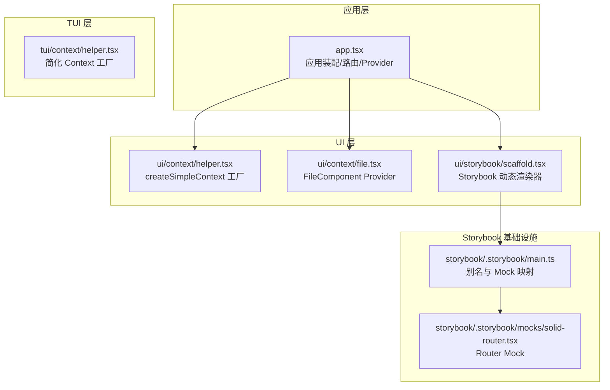

**图表来源**
- [packages/app/src/app.tsx](file://packages/app/src/app.tsx)
- [packages/ui/src/context/helper.tsx](file://packages/ui/src/context/helper.tsx)
- [packages/ui/src/context/file.tsx](file://packages/ui/src/context/file.tsx)
- [packages/ui/src/storybook/scaffold.tsx](file://packages/ui/src/storybook/scaffold.tsx)
- [packages/storybook/.storybook/main.ts](file://packages/storybook/.storybook/main.ts)
- [packages/storybook/.storybook/mocks/solid-router.tsx](file://packages/storybook/.storybook/mocks/solid-router.tsx)

**章节来源**
- [packages/app/src/app.tsx](file://packages/app/src/app.tsx)
- [packages/ui/src/context/helper.tsx](file://packages/ui/src/context/helper.tsx)
- [packages/ui/src/context/file.tsx](file://packages/ui/src/context/file.tsx)
- [packages/tui/src/context/helper.tsx](file://packages/tui/src/context/helper.tsx)
- [packages/ui/src/storybook/scaffold.tsx](file://packages/ui/src/storybook/scaffold.tsx)
- [packages/storybook/.storybook/main.ts](file://packages/storybook/.storybook/main.ts)
- [packages/storybook/.storybook/mocks/solid-router.tsx](file://packages/storybook/.storybook/mocks/solid-router.tsx)

## 核心组件
- Context 工厂 createSimpleContext：统一创建带 ready 门控的 Provider 与 use 钩子，保证异步就绪后再渲染子树，避免“未提供上下文”错误。
- FileComponent Provider：将可替换的文件组件通过 Context 注入，便于在不同上下文中注入不同实现（组合模式）。
- Storybook Scaffold：动态选择并渲染组件，内置 ErrorBoundary，支持 args 透传，降低 Story 编写成本。
- App 装配层：集中管理 Provider 层级、路由切换、连接健康检查、主题/语言/国际化等全局能力。

**章节来源**
- [packages/ui/src/context/helper.tsx](file://packages/ui/src/context/helper.tsx)
- [packages/ui/src/context/file.tsx](file://packages/ui/src/context/file.tsx)
- [packages/ui/src/storybook/scaffold.tsx](file://packages/ui/src/storybook/scaffold.tsx)
- [packages/app/src/app.tsx](file://packages/app/src/app.tsx)

## 架构总览
下图展示了从应用启动到页面渲染的关键路径，以及 Provider 的装配顺序与职责边界。

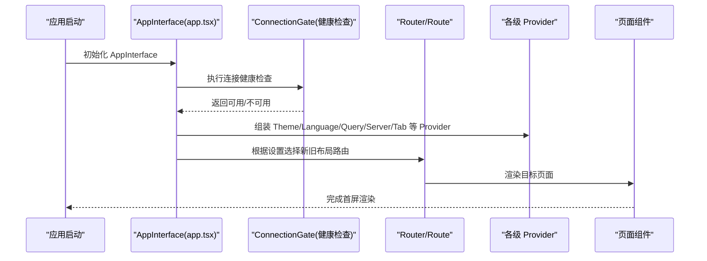

**图表来源**
- [packages/app/src/app.tsx](file://packages/app/src/app.tsx)

**章节来源**
- [packages/app/src/app.tsx](file://packages/app/src/app.tsx)

## 详细组件分析

### Context 工厂与 Provider 模式（组合模式）
- createSimpleContext 以工厂方式生成 Provider 与 use 钩子，内部通过 Show 控制 ready 门控，确保异步初始化完成后才渲染子树。
- 该模式在 ui 与 tui 两个包中均有实现，语义一致但细节略有差异（ui 版本支持 gate 开关与 Accessor 响应式 ready）。
- 典型用法：为某个领域能力（如 FileComponent、Marked、Theme、Language）提供统一的上下文注入点，子组件通过 use 获取值。

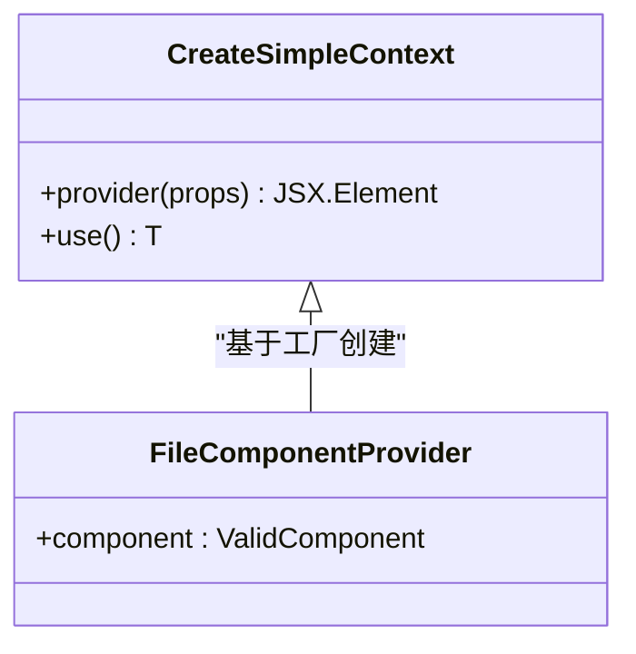

**图表来源**
- [packages/ui/src/context/helper.tsx](file://packages/ui/src/context/helper.tsx)
- [packages/ui/src/context/file.tsx](file://packages/ui/src/context/file.tsx)
- [packages/tui/src/context/helper.tsx](file://packages/tui/src/context/helper.tsx)

**章节来源**
- [packages/ui/src/context/helper.tsx](file://packages/ui/src/context/helper.tsx)
- [packages/ui/src/context/file.tsx](file://packages/ui/src/context/file.tsx)
- [packages/tui/src/context/helper.tsx](file://packages/tui/src/context/helper.tsx)

### 容器模式与展示模式
- 容器组件（Container）：负责数据获取、副作用、状态管理与 Provider 装配（如 app.tsx 中的 AppInterface、SelectedServerProviders、DraftProviders）。
- 展示组件（Presentational）：仅接收 props 渲染 UI，无副作用（如各页面与对话框组件）。
- 通过 Provider 与路由分层，将容器与展示解耦，提升可测试性与复用性。

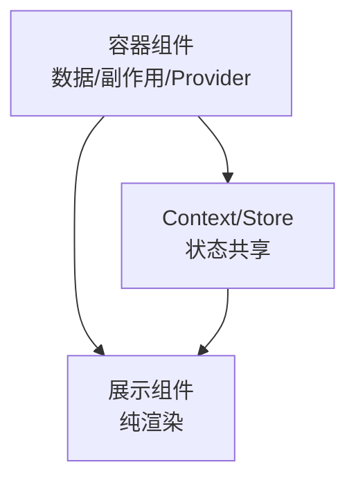

**章节来源**
- [packages/app/src/app.tsx](file://packages/app/src/app.tsx)

### 高阶组件（HOC）与渲染函数
- HOC 示例：ErrorBoundary、Show、For、Dynamic 等作为“高阶渲染器”，对子组件进行增强或条件渲染。
- 渲染函数：Scaffold 的 render(args) 将任意组件以 args 形式动态渲染，配合 pick 自动选择导出组件，减少样板代码。

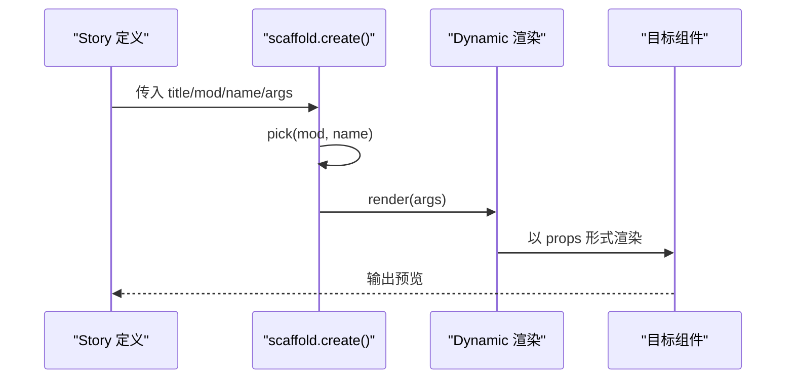

**图表来源**
- [packages/ui/src/storybook/scaffold.tsx](file://packages/ui/src/storybook/scaffold.tsx)

**章节来源**
- [packages/ui/src/storybook/scaffold.tsx](file://packages/ui/src/storybook/scaffold.tsx)

### 状态提升与数据流向
- 状态提升：在 app.tsx 中将服务器连接、SDK、同步、模型、标签页、权限、通知等状态提升到高层 Provider，供深层组件消费。
- 数据流向：单向向下传递 props 与 Context 值；事件向上冒泡或通过回调更新状态（如 ConnectionError 的重试与切换服务器）。

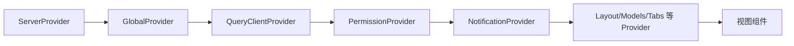

**图表来源**
- [packages/app/src/app.tsx](file://packages/app/src/app.tsx)

**章节来源**
- [packages/app/src/app.tsx](file://packages/app/src/app.tsx)

### 组件通信模式
- Props 传递：展示组件通过 props 接收数据与回调，保持纯渲染。
- 事件冒泡：子组件触发回调，父组件处理并更新状态（例如重试、切换服务器、导航跳转）。
- 状态共享：通过 Context（如 createSimpleContext）在组件树内共享跨层级状态，避免 prop drilling。

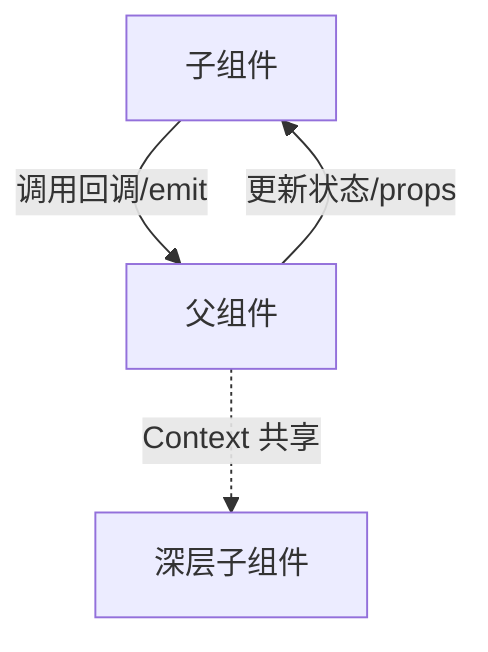

**章节来源**
- [packages/app/src/app.tsx](file://packages/app/src/app.tsx)
- [packages/ui/src/context/helper.tsx](file://packages/ui/src/context/helper.tsx)

### 组件复用策略（抽象组件与模板模式）
- 抽象组件：通过 Context 注入可替换实现（如 FileComponentProvider），使同一套 UI 在不同场景下呈现不同行为。
- 模板模式：Scaffold 提供统一的 Story 模板（meta + Basic 渲染），子类只需提供 mod 与 args，即可复用渲染流程与错误边界。

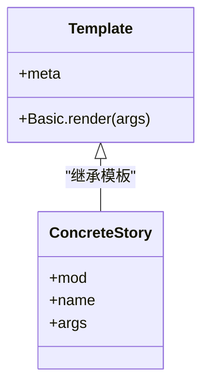

**图表来源**
- [packages/ui/src/storybook/scaffold.tsx](file://packages/ui/src/storybook/scaffold.tsx)

**章节来源**
- [packages/ui/src/context/file.tsx](file://packages/ui/src/context/file.tsx)
- [packages/ui/src/storybook/scaffold.tsx](file://packages/ui/src/storybook/scaffold.tsx)

### 组件测试模式与 Mock 策略
- 测试模式：利用 Storybook 的 Basic 渲染与 ErrorBoundary 捕获异常，快速验证组件在不同 props 下的表现。
- Mock 策略：通过 storybook main 配置模块别名与 mocks，替换真实依赖（如 router、context、hooks），隔离外部影响。

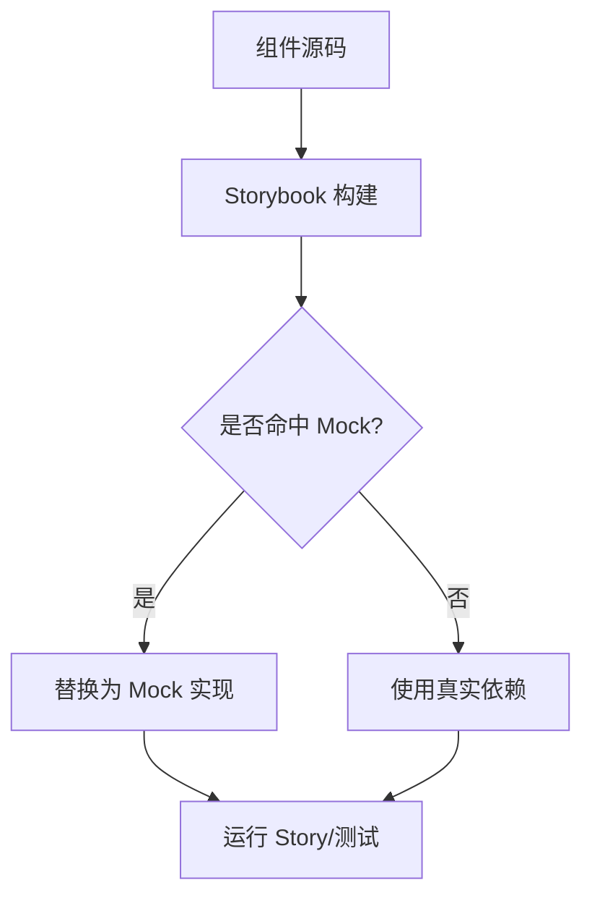

**图表来源**
- [packages/storybook/.storybook/main.ts](file://packages/storybook/.storybook/main.ts)
- [packages/storybook/.storybook/mocks/solid-router.tsx](file://packages/storybook/.storybook/mocks/solid-router.tsx)

**章节来源**
- [packages/storybook/.storybook/main.ts](file://packages/storybook/.storybook/main.ts)
- [packages/storybook/.storybook/mocks/solid-router.tsx](file://packages/storybook/.storybook/mocks/solid-router.tsx)

### 组件文档生成与 Storybook 集成
- 文档生成：Scaffold 自动生成 meta.title 与 component 引用，Basic 用例默认渲染，减少重复描述。
- 集成要点：main.ts 中配置 alias 与 mocks，确保 Story 环境稳定；router 与 context 的 Mock 保证组件独立运行。

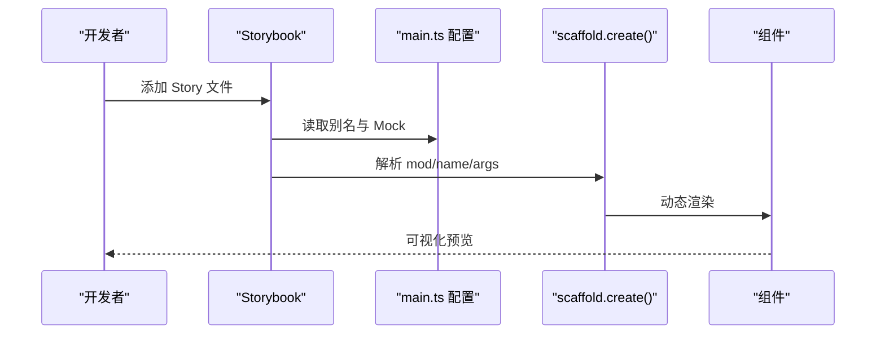

**图表来源**
- [packages/ui/src/storybook/scaffold.tsx](file://packages/ui/src/storybook/scaffold.tsx)
- [packages/storybook/.storybook/main.ts](file://packages/storybook/.storybook/main.ts)

**章节来源**
- [packages/ui/src/storybook/scaffold.tsx](file://packages/ui/src/storybook/scaffold.tsx)
- [packages/storybook/.storybook/main.ts](file://packages/storybook/.storybook/main.ts)

## 依赖分析
- 低耦合：Context 工厂与 Provider 解耦具体业务，便于扩展新领域能力。
- 明确边界：app.tsx 承担装配与路由，ui 包专注 UI 能力，storybook 包专注文档与测试。
- 潜在风险：过多 Provider 嵌套可能导致调试困难；建议按需拆分与懒加载。

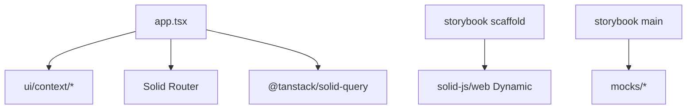

**图表来源**
- [packages/app/src/app.tsx](file://packages/app/src/app.tsx)
- [packages/ui/src/context/helper.tsx](file://packages/ui/src/context/helper.tsx)
- [packages/ui/src/storybook/scaffold.tsx](file://packages/ui/src/storybook/scaffold.tsx)
- [packages/storybook/.storybook/main.ts](file://packages/storybook/.storybook/main.ts)

**章节来源**
- [packages/app/src/app.tsx](file://packages/app/src/app.tsx)
- [packages/ui/src/context/helper.tsx](file://packages/ui/src/context/helper.tsx)
- [packages/ui/src/storybook/scaffold.tsx](file://packages/ui/src/storybook/scaffold.tsx)
- [packages/storybook/.storybook/main.ts](file://packages/storybook/.storybook/main.ts)

## 性能考虑
- 条件渲染：使用 Show 控制 ready 门控，避免不必要的渲染与报错。
- 惰性加载：路由与页面组件可使用 lazy 按需加载，减少首屏体积。
- 计算缓存：合理使用 createMemo/createRenderEffect 缓存派生状态，避免重复计算。
- 列表虚拟化：长列表建议使用虚拟化方案（参考 e2e 示例中的虚拟滚动思路）。

[本节为通用指导，不直接分析具体文件]

## 故障排查指南
- Context 未提供：当 use 钩子在 Provider 外被调用会抛出错误，检查 Provider 包裹范围与 gate 配置。
- 连接失败：ConnectionGate 会显示错误并提供重试与切换服务器选项，确认服务端可达性与网络配置。
- Story 渲染异常：Scaffold 内置 ErrorBoundary 捕获异常并展示堆栈，检查组件 props 与依赖 Mock。

**章节来源**
- [packages/ui/src/context/helper.tsx](file://packages/ui/src/context/helper.tsx)
- [packages/app/src/app.tsx](file://packages/app/src/app.tsx)
- [packages/ui/src/storybook/scaffold.tsx](file://packages/ui/src/storybook/scaffold.tsx)

## 结论
openNovel 的组件体系以 Context 工厂为核心，结合容器/展示分离、HOC 与渲染函数、Provider 装配与路由分层，形成了高内聚、低耦合、易测试、可扩展的组件设计模式。Storybook 的脚手架与 Mock 机制进一步提升了组件文档化与开发体验。建议在新增功能时遵循现有模式，保持数据流单向、状态提升合理、组件职责单一。

[本节为总结性内容，不直接分析具体文件]

## 附录
- 最佳实践清单
  - 使用 createSimpleContext 统一管理 Context 的 ready 门控与 use 钩子
  - 将数据与副作用放在容器组件，展示组件保持纯渲染
  - 通过 Provider 注入可替换实现，避免硬编码
  - 使用 Scaffold 标准化 Story 编写，减少样板代码
  - 借助 main.ts 的别名与 Mock 隔离外部依赖，提高稳定性

[本节为补充信息，不直接分析具体文件]