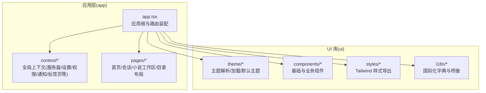
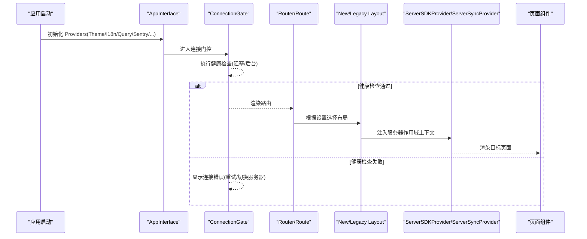
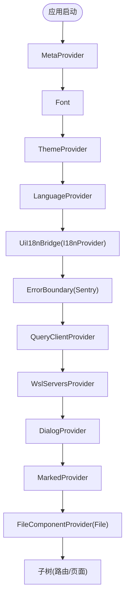
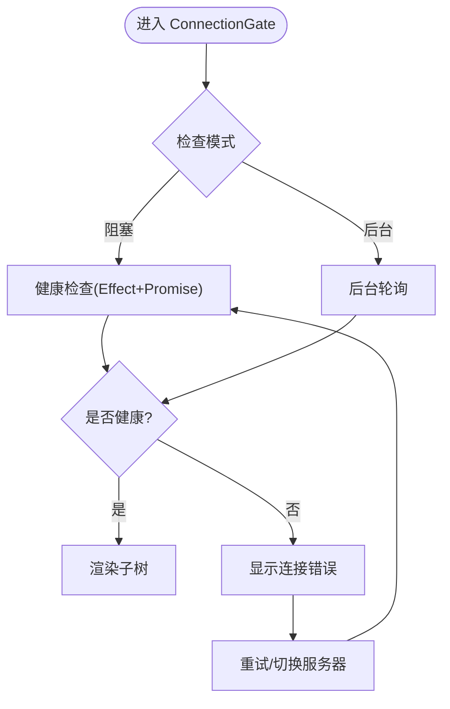
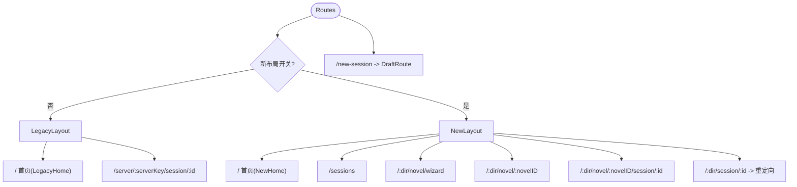
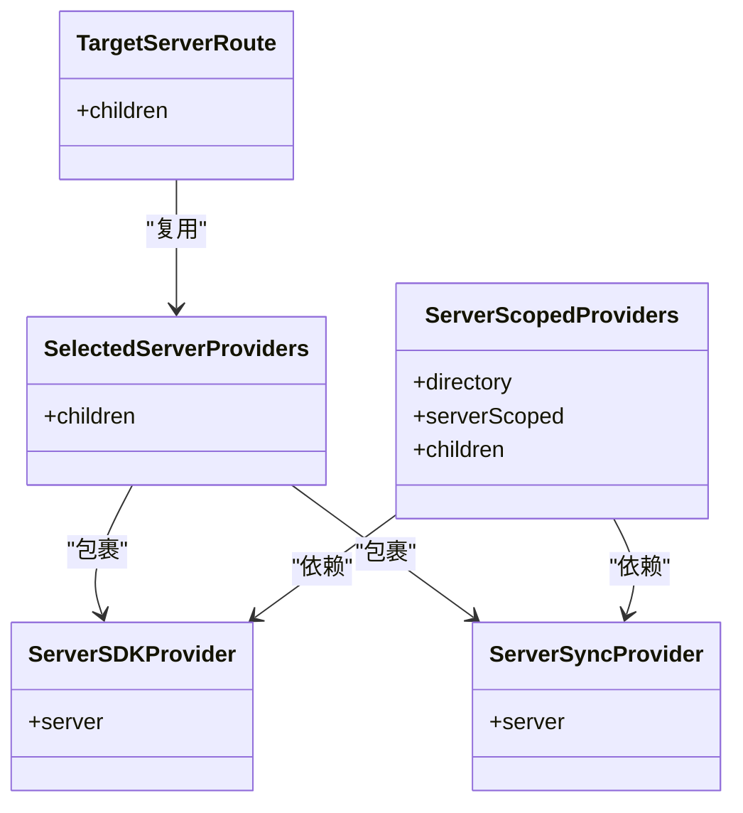
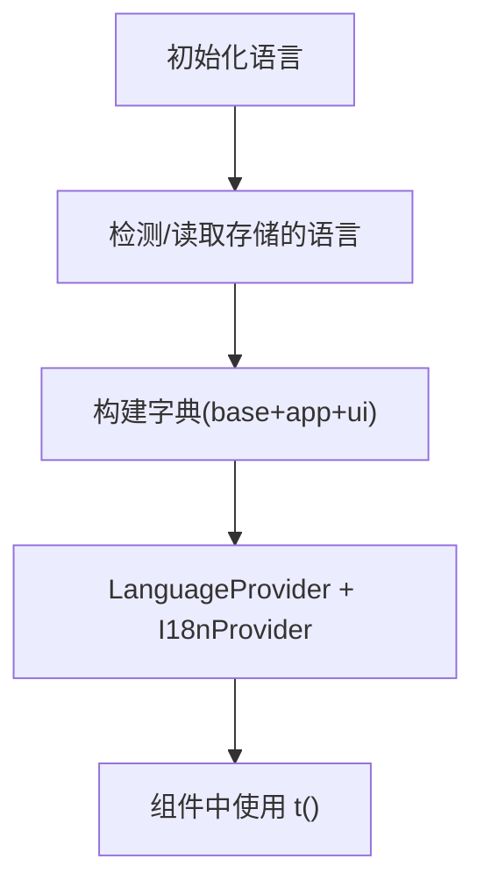
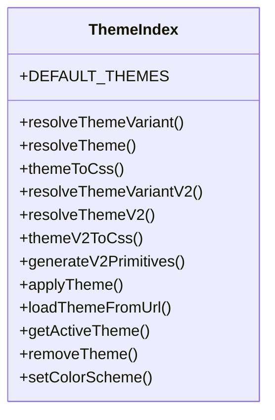
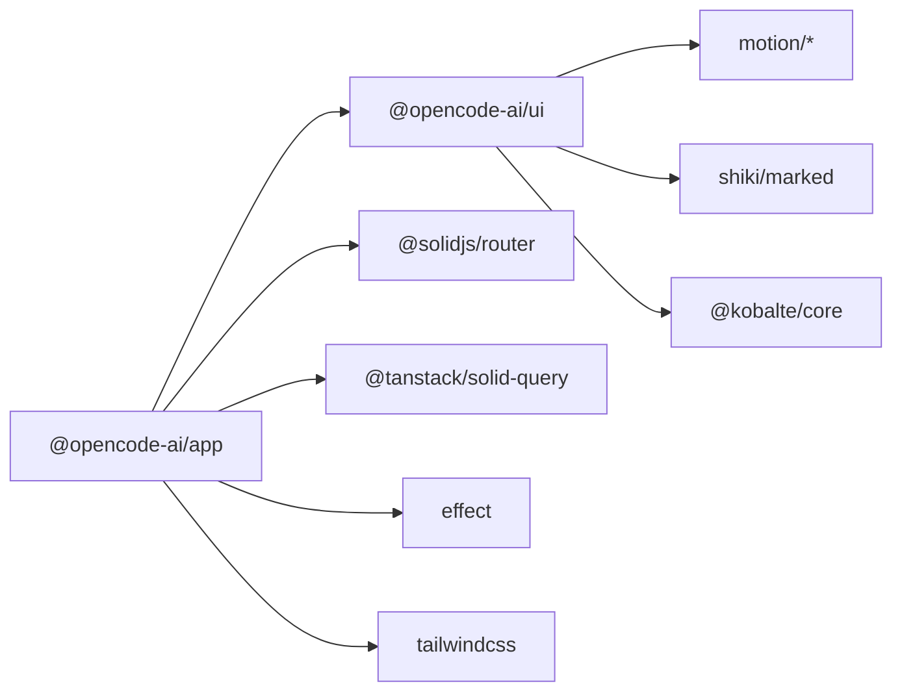

# 前端应用

<cite>
**本文引用的文件**   
- [packages/app/src/app.tsx](file://packages/app/src/app.tsx)
- [packages/app/package.json](file://packages/app/package.json)
- [packages/ui/package.json](file://packages/ui/package.json)
- [packages/ui/src/theme/index.ts](file://packages/ui/src/theme/index.ts)
- [packages/app/src/context/language.tsx](file://packages/app/src/context/language.tsx)
</cite>

## 目录
1. [简介](#简介)
2. [项目结构](#项目结构)
3. [核心组件](#核心组件)
4. [架构总览](#架构总览)
5. [详细组件分析](#详细组件分析)
6. [依赖分析](#依赖分析)
7. [性能考虑](#性能考虑)
8. [故障排查指南](#故障排查指南)
9. [结论](#结论)
10. [附录](#附录)

## 简介
本文件为 openNovel 前端应用的完整技术文档，聚焦 SolidJS 架构设计、组件结构、状态管理、路由与页面组织、UI 组件库（主题系统与国际化）、以及书架/工作空间/阅读器/审批流程等核心界面的实现要点。同时提供响应式设计与无障碍访问建议、动画与过渡策略、样式定制与主题支持、跨浏览器兼容性与性能优化方法，并说明组件组合模式及与其他 UI 元素的集成方式。

## 项目结构
openNovel 采用多包（monorepo）结构，前端相关主要位于 packages/app 与 packages/ui：
- packages/app：SolidJS 应用入口、路由、上下文（Provider）、页面布局、会话与小说工作区路由、连接门控与健康检查、错误边界与 Sentry 集成等。
- packages/ui：UI 组件库、主题系统（V1/V2）、图标与字体资源、Tailwind 样式导出、i18n 桥接等。

**图表来源** 
- [packages/app/src/app.tsx:1-120](file://packages/app/src/app.tsx#L1-L120)
- [packages/ui/src/theme/index.ts:1-79](file://packages/ui/src/theme/index.ts#L1-L79)

**章节来源**
- [packages/app/src/app.tsx:1-120](file://packages/app/src/app.tsx#L1-L120)
- [packages/app/package.json:1-97](file://packages/app/package.json#L1-L97)
- [packages/ui/package.json:1-114](file://packages/ui/package.json#L1-L114)

## 核心组件
- 应用根与 Provider 树：在应用启动时构建 Meta、Font、Theme、Language、I18n、ErrorBoundary、QueryClient、WslServers、Dialog、Marked、FileComponent 等上下文，确保全局能力可用。
- 连接门控（ConnectionGate）：对后端健康检查进行阻塞或后台轮询，失败时展示可重试的界面，并支持切换其他服务器。
- 路由与布局：根据“新布局开关”动态选择 LegacyLayout 或 NewLayout；按目录/会话/小说工作区划分路由层级。
- 会话与草稿：支持 /new-session 草稿创建与重定向，兼容旧版会话链接。
- 服务器作用域：通过 ServerSDKProvider/ServerSyncProvider 将 SDK 与同步上下文限定到当前服务器键，避免跨服务器状态污染。

**章节来源**
- [packages/app/src/app.tsx:253-399](file://packages/app/src/app.tsx#L253-L399)
- [packages/app/src/app.tsx:401-517](file://packages/app/src/app.tsx#L401-L517)
- [packages/app/src/app.tsx:528-643](file://packages/app/src/app.tsx#L528-L643)

## 架构总览
下图展示了从应用启动到路由渲染的关键流程，包括 Provider 装配、连接门控、路由选择与服务器作用域注入。

**图表来源** 
- [packages/app/src/app.tsx:253-399](file://packages/app/src/app.tsx#L253-L399)
- [packages/app/src/app.tsx:401-517](file://packages/app/src/app.tsx#L401-L517)
- [packages/app/src/app.tsx:528-643](file://packages/app/src/app.tsx#L528-L643)

## 详细组件分析

### 应用根与 Provider 树
- 职责：统一装配元信息、字体、主题、语言、I18n、错误边界、查询客户端、WSL 服务器、对话框、Markdown 解析、文件组件等。
- 关键点：
  - ThemeProvider 设置默认主题与配色方案，并在应用层暴露 onThemeApplied 回调以联动桌面端标题栏。
  - LanguageProvider + I18nProvider 完成国际化桥接，支持运行时切换语言。
  - ErrorBoundary 捕获异常并上报 Sentry，回退至错误页面。
  - QueryClientProvider 配置查询行为（如禁用自动重新获取）。

**图表来源** 
- [packages/app/src/app.tsx:365-399](file://packages/app/src/app.tsx#L365-L399)

**章节来源**
- [packages/app/src/app.tsx:365-399](file://packages/app/src/app.tsx#L365-L399)

### 连接门控与健康检查
- 职责：在应用可见前确保后端可达；支持阻塞模式与后台轮询；失败时提供重试与切换服务器能力。
- 关键点：
  - createResource 驱动健康检查，超时后降级为后台模式。
  - 使用 Effect 编排异步任务，保证非 HTTP 连接的宽限时间。
  - ConnectionError 组件展示友好提示与操作按钮。

**图表来源** 
- [packages/app/src/app.tsx:401-517](file://packages/app/src/app.tsx#L401-L517)

**章节来源**
- [packages/app/src/app.tsx:401-517](file://packages/app/src/app.tsx#L401-L517)

### 路由与布局
- 职责：根据“新布局开关”决定渲染 LegacyLayout 或 NewLayout；定义目录、会话、小说工作区等路由。
- 关键点：
  - Routes 中区分新旧布局路径，支持 /sessions、/:dir/novel/wizard、/:dir/novel/:novelID 等。
  - DraftRoute 处理 /new-session 草稿创建与重定向。
  - TargetSessionRoute 与 LegacyTargetSessionRoute 负责服务器作用域与历史链接兼容。

**图表来源** 
- [packages/app/src/app.tsx:586-643](file://packages/app/src/app.tsx#L586-L643)

**章节来源**
- [packages/app/src/app.tsx:586-643](file://packages/app/src/app.tsx#L586-L643)

### 服务器作用域与数据提供者
- 职责：将 SDK 与同步上下文限定到当前服务器键，避免跨服务器状态污染。
- 关键点：
  - SelectedServerProviders/TargetServerRoute 通过 ServerSDKProvider/ServerSyncProvider 包裹子树。
  - ServerScopedProviders 注入 ModelsProvider/LayoutProvider 等。

**图表来源** 
- [packages/app/src/app.tsx:112-177](file://packages/app/src/app.tsx#L112-L177)
- [packages/app/src/app.tsx:326-351](file://packages/app/src/app.tsx#L326-L351)

**章节来源**
- [packages/app/src/app.tsx:112-177](file://packages/app/src/app.tsx#L112-L177)
- [packages/app/src/app.tsx:326-351](file://packages/app/src/app.tsx#L326-L351)

### 国际化（i18n）
- 职责：基于 @solid-primitives/i18n 与 UI 库的 I18nProvider 桥接，支持多语言与动态切换。
- 关键点：
  - LanguageProvider 维护当前 Locale 与翻译函数 t。
  - UiI18nBridge 将语言上下文传递给 UI 库。
  - 字典合并策略：基础字典 + 应用字典 + UI 字典。

**图表来源** 
- [packages/app/src/context/language.tsx:79-104](file://packages/app/src/context/language.tsx#L79-L104)
- [packages/app/src/app.tsx:236-239](file://packages/app/src/app.tsx#L236-L239)

**章节来源**
- [packages/app/src/context/language.tsx:79-104](file://packages/app/src/context/language.tsx#L79-L104)
- [packages/app/src/app.tsx:236-239](file://packages/app/src/app.tsx#L236-L239)

### 主题系统
- 职责：提供 V1/V2 两套主题体系，支持颜色转换、调色板生成、CSS 变量注入与默认主题集合。
- 关键点：
  - resolveTheme/resolveThemeV2 解析主题变体与最终值。
  - applyTheme/loadThemeFromUrl/getActiveTheme/removeTheme/setColorScheme 控制主题加载与切换。
  - DEFAULT_THEMES 包含大量内置主题（如 catppuccin、oneDark、tokyonight 等）。

**图表来源** 
- [packages/ui/src/theme/index.ts:1-79](file://packages/ui/src/theme/index.ts#L1-L79)

**章节来源**
- [packages/ui/src/theme/index.ts:1-79](file://packages/ui/src/theme/index.ts#L1-L79)

### 书架界面、工作空间、阅读器、审批流程（概念性说明）
- 书架界面：通常由目录布局与列表组件构成，支持搜索、排序、分页与虚拟滚动（@tanstack/solid-virtual）。
- 工作空间：小说工作区路由（/:dir/novel/:novelID）承载章节管理、大纲、角色设定等模块，结合 TabsProvider 管理多标签。
- 阅读器：会话/章节阅读视图，支持 Markdown 渲染（marked-shiki）、高亮、注释、评论与键盘导航。
- 审批流程：在会话或内容变更场景中，通过命令面板与对话框组件实现提交、审核、驳回等操作流。

[本节为概念性说明，不直接分析具体文件]

## 依赖分析
- 应用依赖（packages/app/package.json）：
  - 框架与工具：solid-js、@solidjs/router、@solidjs/meta、vite、tailwindcss、effect、sentry。
  - UI 与交互：@kobalte/core、@corvu/drawer、@dnd-kit/*、solid-list、tw-animate-css。
  - 数据与网络：@tanstack/solid-query、@solid-primitives/websocket、luxon、shiki/marked。
- UI 库依赖（packages/ui/package.json）：
  - 主题与动效：motion、motion-dom、motion-utils、tw-animate-css。
  - 文本与语法：shiki、marked、katex、marked-katex-extension、marked-shiki。
  - DOM 与工具：dompurify、fuzzysort、remeda、solid-list。

**图表来源** 
- [packages/app/package.json:49-96](file://packages/app/package.json#L49-L96)
- [packages/ui/package.json:82-108](file://packages/ui/package.json#L82-L108)

**章节来源**
- [packages/app/package.json:49-96](file://packages/app/package.json#L49-L96)
- [packages/ui/package.json:82-108](file://packages/ui/package.json#L82-L108)

## 性能考虑
- 路由懒加载：会话新建等页面使用 lazy 按需加载，减少首屏体积。
- 查询缓存：QueryClient 关闭不必要的 refetch，降低重复请求。
- 虚拟列表：长列表场景使用 @tanstack/solid-virtual 提升渲染性能。
- 事件与监听：合理使用 @solid-primitives/event-listener/resize-observer 等，避免内存泄漏。
- 动画与过渡：优先使用 CSS 动画与 tw-animate-css，必要时引入 motion 库。
- 资源优化：图标精灵、字体与音频资源打包，按需加载。

[本节为通用指导，不直接分析具体文件]

## 故障排查指南
- 连接失败：
  - 现象：连接门控显示不可达，并提供重试与切换服务器选项。
  - 排查：检查服务器地址、网络连通性、健康检查超时配置。
- 路由跳转异常：
  - 现象：旧版会话链接无法正确重定向。
  - 排查：确认 newLayoutDesigns 开关与 sessionHref/legacySessionHref 逻辑。
- 主题未生效：
  - 现象：主题切换无效或颜色不一致。
  - 排查：检查 applyTheme/setColorScheme 调用与 CSS 变量注入。
- 国际化缺失：
  - 现象：部分文案未翻译。
  - 排查：确认 i18n 字典合并顺序与 key 是否存在。

**章节来源**
- [packages/app/src/app.tsx:401-517](file://packages/app/src/app.tsx#L401-L517)
- [packages/app/src/app.tsx:586-643](file://packages/app/src/app.tsx#L586-L643)
- [packages/ui/src/theme/index.ts:1-79](file://packages/ui/src/theme/index.ts#L1-L79)
- [packages/app/src/context/language.tsx:79-104](file://packages/app/src/context/language.tsx#L79-L104)

## 结论
openNovel 前端以 SolidJS 为核心，采用清晰的 Provider 分层与服务器作用域隔离，配合健壮的连接门控与路由设计，支撑起书架、工作空间、阅读器与审批流程等复杂场景。UI 库提供完善的主题系统与国际化能力，结合 Tailwind 与动画库实现灵活的样式与动效。通过合理的依赖管理与性能优化策略，可在多端与多浏览器环境下获得稳定体验。

[本节为总结性内容，不直接分析具体文件]

## 附录
- 响应式设计指南：
  - 使用 Tailwind 断点与弹性布局，适配移动端与桌面端。
  - 抽屉与侧边栏在小屏下折叠，关键操作置于底部导航或悬浮按钮。
- 无障碍访问合规性：
  - 为交互元素添加语义化标签与 aria-* 属性。
  - 确保键盘导航与焦点管理，避免焦点陷阱。
  - 对比度与色彩方案遵循 WCAG 标准。
- 样式定制与主题支持：
  - 通过 theme/index 提供的 API 扩展默认主题或加载远程主题。
  - 使用 CSS 变量覆盖局部样式，保持与设计令牌一致。
- 跨浏览器兼容性：
  - 针对 Safari/Firefox/Edge 做特性检测与降级处理。
  - 使用 polyfill 与转译工具确保 ES 特性与 API 可用性。
- 组件组合模式与集成：
  - 通过 Provider 注入上下文，组件间松耦合。
  - 使用插槽与 props 组合基础组件，形成业务级复合组件。

[本节为通用指导，不直接分析具体文件]