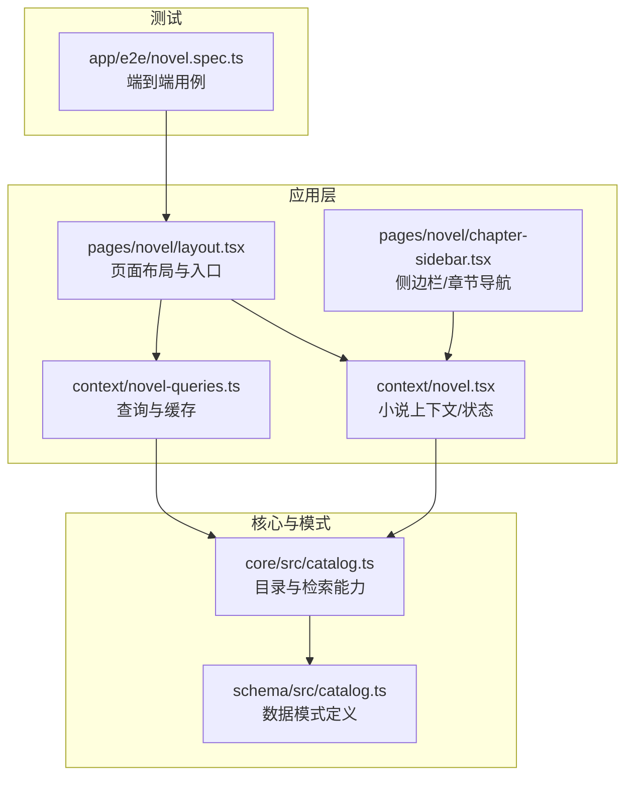
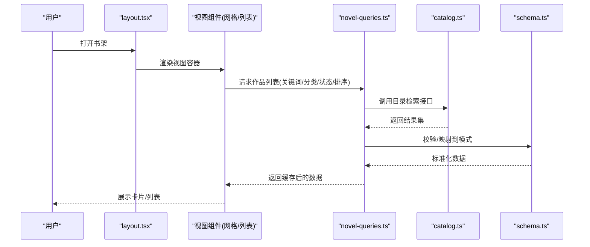
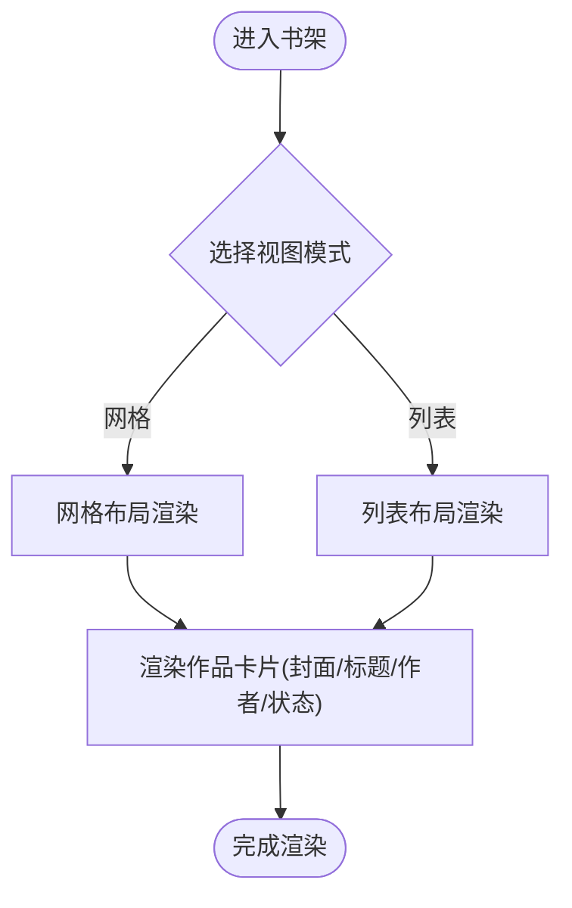
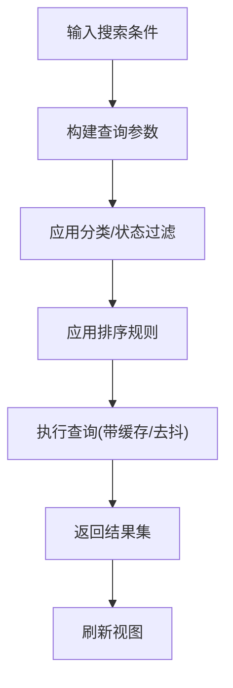
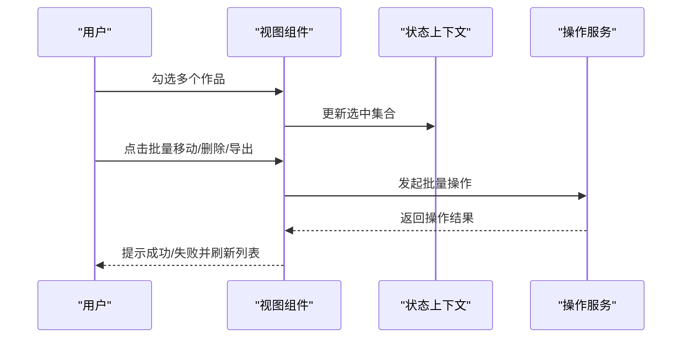
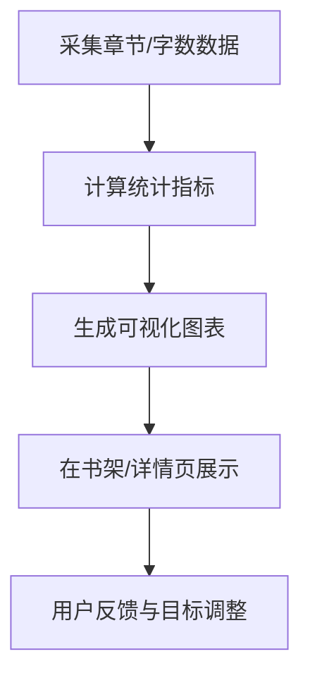
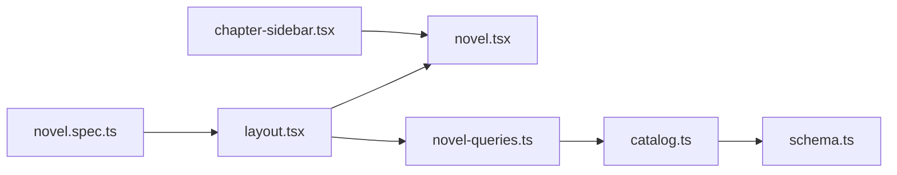

# 书架界面

<cite>
**本文引用的文件**   
- [packages/app/src/pages/novel/layout.tsx](file://packages/app/src/pages/novel/layout.tsx)
- [packages/app/src/pages/novel/chapter-sidebar.tsx](file://packages/app/src/pages/novel/chapter-sidebar.tsx)
- [packages/app/src/context/novel.tsx](file://packages/app/src/context/novel.tsx)
- [packages/app/src/context/novel-queries.ts](file://packages/app/src/context/novel-queries.ts)
- [packages/core/src/catalog.ts](file://packages/core/src/catalog.ts)
- [packages/schema/src/catalog.ts](file://packages/schema/src/catalog.ts)
- [packages/app/e2e/novel.spec.ts](file://packages/app/e2e/novel.spec.ts)
</cite>

## 目录
1. [简介](#简介)
2. [项目结构](#项目结构)
3. [核心组件](#核心组件)
4. [架构总览](#架构总览)
5. [详细组件分析](#详细组件分析)
6. [依赖分析](#依赖分析)
7. [性能考虑](#性能考虑)
8. [故障排查指南](#故障排查指南)
9. [结论](#结论)
10. [附录](#附录)

## 简介
本文件为 openNovel 的“书架界面”提供系统化、可落地的技术文档。内容覆盖作品列表展示（网格/列表视图切换、卡片信息）、搜索与过滤（关键词、分类、状态、排序）、批量操作（多选、移动、删除、导出）、进度跟踪（写作进度、统计、可视化图表），以及交互设计、响应式布局、加载状态与错误提示机制。文档同时给出架构图、流程图与优化建议，帮助读者快速理解并高效使用或扩展该功能。

## 项目结构
书架界面位于应用层页面与上下文管理之中，数据模型与目录能力由核心包与模式定义包提供，端到端测试覆盖关键交互路径。

**图示来源** 
- [packages/app/src/pages/novel/layout.tsx](file://packages/app/src/pages/novel/layout.tsx)
- [packages/app/src/pages/novel/chapter-sidebar.tsx](file://packages/app/src/pages/novel/chapter-sidebar.tsx)
- [packages/app/src/context/novel.tsx](file://packages/app/src/context/novel.tsx)
- [packages/app/src/context/novel-queries.ts](file://packages/app/src/context/novel-queries.ts)
- [packages/core/src/catalog.ts](file://packages/core/src/catalog.ts)
- [packages/schema/src/catalog.ts](file://packages/schema/src/catalog.ts)
- [packages/app/e2e/novel.spec.ts](file://packages/app/e2e/novel.spec.ts)

**章节来源**
- [packages/app/src/pages/novel/layout.tsx](file://packages/app/src/pages/novel/layout.tsx)
- [packages/app/src/pages/novel/chapter-sidebar.tsx](file://packages/app/src/pages/novel/chapter-sidebar.tsx)
- [packages/app/src/context/novel.tsx](file://packages/app/src/context/novel.tsx)
- [packages/app/src/context/novel-queries.ts](file://packages/app/src/context/novel-queries.ts)
- [packages/core/src/catalog.ts](file://packages/core/src/catalog.ts)
- [packages/schema/src/catalog.ts](file://packages/schema/src/catalog.ts)
- [packages/app/e2e/novel.spec.ts](file://packages/app/e2e/novel.spec.ts)

## 核心组件
- 页面布局与入口：负责整体框架、工具栏、视图切换容器与路由占位。
- 侧边栏/章节导航：用于章节列表、跳转与选中态管理。
- 小说上下文：集中管理当前作品、章节、阅读/编辑状态、用户偏好等。
- 查询与缓存：封装对目录服务的查询、分页、排序、过滤与本地缓存策略。
- 目录服务与模式：提供作品元数据、分类、状态、搜索与排序能力，以及统一的数据模式。

**章节来源**
- [packages/app/src/pages/novel/layout.tsx](file://packages/app/src/pages/novel/layout.tsx)
- [packages/app/src/pages/novel/chapter-sidebar.tsx](file://packages/app/src/pages/novel/chapter-sidebar.tsx)
- [packages/app/src/context/novel.tsx](file://packages/app/src/context/novel.tsx)
- [packages/app/src/context/novel-queries.ts](file://packages/app/src/context/novel-queries.ts)
- [packages/core/src/catalog.ts](file://packages/core/src/catalog.ts)
- [packages/schema/src/catalog.ts](file://packages/schema/src/catalog.ts)

## 架构总览
书架界面采用“页面 + 上下文 + 查询服务 + 目录能力”的分层架构。页面负责 UI 组合与交互；上下文承载状态与副作用；查询服务抽象数据获取与缓存；目录服务暴露统一的检索与排序接口；模式定义保证数据结构一致性。

**图示来源** 
- [packages/app/src/pages/novel/layout.tsx](file://packages/app/src/pages/novel/layout.tsx)
- [packages/app/src/context/novel-queries.ts](file://packages/app/src/context/novel-queries.ts)
- [packages/core/src/catalog.ts](file://packages/core/src/catalog.ts)
- [packages/schema/src/catalog.ts](file://packages/schema/src/catalog.ts)

## 详细组件分析

### 作品列表展示（网格/列表视图）
- 视图切换：通过工具栏按钮切换网格与列表两种展示方式，保持筛选与排序状态一致。
- 卡片信息：封面、标题、作者、状态（如连载中、已完结、草稿等）在卡片中清晰呈现。
- 响应式布局：根据屏幕宽度自动调整列数与卡片尺寸，确保移动端可读性。
- 空态与骨架屏：无数据时显示引导文案；加载时展示骨架占位，提升感知速度。

**图示来源** 
- [packages/app/src/pages/novel/layout.tsx](file://packages/app/src/pages/novel/layout.tsx)

**章节来源**
- [packages/app/src/pages/novel/layout.tsx](file://packages/app/src/pages/novel/layout.tsx)

### 搜索与过滤系统
- 关键词搜索：支持按标题、作者、描述等字段进行模糊匹配。
- 分类筛选：按题材/类型维度过滤，支持多选与清空。
- 状态过滤：按连载状态（如连载中、已完结、草稿）筛选。
- 排序：支持按更新时间、字数、评分等多维度排序。
- 查询编排：将关键词、分类、状态、排序参数组合后下发至目录服务，并在查询层做去抖与缓存。

**图示来源** 
- [packages/app/src/context/novel-queries.ts](file://packages/app/src/context/novel-queries.ts)
- [packages/core/src/catalog.ts](file://packages/core/src/catalog.ts)

**章节来源**
- [packages/app/src/context/novel-queries.ts](file://packages/app/src/context/novel-queries.ts)
- [packages/core/src/catalog.ts](file://packages/core/src/catalog.ts)

### 批量操作（多选、移动、删除、导出）
- 多选操作：支持全选/反选/按范围选择，顶部工具栏显示已选项数量。
- 批量移动：将选中作品移动到指定分类或文件夹。
- 批量删除：二次确认后进行删除，支持撤销或回收站恢复（若实现）。
- 批量导出：导出选中作品的元数据或内容（如 JSON/Markdown），提供下载链接。

**图示来源** 
- [packages/app/src/context/novel.tsx](file://packages/app/src/context/novel.tsx)

**章节来源**
- [packages/app/src/context/novel.tsx](file://packages/app/src/context/novel.tsx)

### 进度跟踪（写作进度、统计数据、可视化图表）
- 写作进度：显示每章字数、目标字数、完成百分比，支持设置每日/每周目标。
- 统计数据：累计字数、更新频率、章节数量、平均字数等指标。
- 可视化图表：柱状图/折线图展示字数趋势与更新节奏，便于复盘与规划。

**图示来源** 
- [packages/app/src/context/novel.tsx](file://packages/app/src/context/novel.tsx)

**章节来源**
- [packages/app/src/context/novel.tsx](file://packages/app/src/context/novel.tsx)

### 用户交互设计与响应式布局
- 交互设计：清晰的视觉层次、一致的图标语义、快捷键支持（如全选、切换视图）。
- 响应式布局：栅格自适应、触摸友好、键盘可达性。
- 可访问性：对比度、焦点顺序、ARIA 标签完善。

**章节来源**
- [packages/app/src/pages/novel/layout.tsx](file://packages/app/src/pages/novel/layout.tsx)

### 加载状态处理与错误提示机制
- 加载状态：骨架屏、进度条、懒加载占位。
- 错误提示：网络异常、权限不足、数据格式错误的友好提示与重试入口。
- 降级策略：离线缓存优先、弱网下减少请求、失败回退默认视图。

**章节来源**
- [packages/app/src/context/novel-queries.ts](file://packages/app/src/context/novel-queries.ts)

## 依赖分析
书架界面的依赖关系如下：页面依赖上下文与查询服务；查询服务依赖目录能力；目录能力基于模式定义保证数据一致性；端到端测试验证关键流程。

**图示来源** 
- [packages/app/src/pages/novel/layout.tsx](file://packages/app/src/pages/novel/layout.tsx)
- [packages/app/src/pages/novel/chapter-sidebar.tsx](file://packages/app/src/pages/novel/chapter-sidebar.tsx)
- [packages/app/src/context/novel.tsx](file://packages/app/src/context/novel.tsx)
- [packages/app/src/context/novel-queries.ts](file://packages/app/src/context/novel-queries.ts)
- [packages/core/src/catalog.ts](file://packages/core/src/catalog.ts)
- [packages/schema/src/catalog.ts](file://packages/schema/src/catalog.ts)
- [packages/app/e2e/novel.spec.ts](file://packages/app/e2e/novel.spec.ts)

**章节来源**
- [packages/app/src/pages/novel/layout.tsx](file://packages/app/src/pages/novel/layout.tsx)
- [packages/app/src/pages/novel/chapter-sidebar.tsx](file://packages/app/src/pages/novel/chapter-sidebar.tsx)
- [packages/app/src/context/novel.tsx](file://packages/app/src/context/novel.tsx)
- [packages/app/src/context/novel-queries.ts](file://packages/app/src/context/novel-queries.ts)
- [packages/core/src/catalog.ts](file://packages/core/src/catalog.ts)
- [packages/schema/src/catalog.ts](file://packages/schema/src/catalog.ts)
- [packages/app/e2e/novel.spec.ts](file://packages/app/e2e/novel.spec.ts)

## 性能考虑
- 虚拟滚动：长列表使用虚拟滚动降低 DOM 节点数量，提升渲染性能。
- 图片懒加载：封面按需加载，结合占位图与压缩策略。
- 查询缓存：对相同参数的查询结果进行缓存与失效控制，减少重复请求。
- 去抖与节流：搜索输入与窗口缩放事件进行去抖/节流。
- 增量更新：仅更新变化部分，避免整页重渲染。
- 资源预取：在空闲时预取下一页或相关分类数据。

[本节为通用指导，不直接分析具体文件]

## 故障排查指南
- 列表不更新：检查查询参数是否变化、缓存键是否正确、目录服务是否返回有效数据。
- 搜索无结果：确认关键词匹配字段、大小写与分词策略、过滤条件是否过严。
- 批量操作失败：核对权限、目标分类存在性、并发冲突与事务回滚。
- 进度统计异常：校验章节字数采集逻辑、时间范围与聚合规则。
- 截图与复现：使用端到端测试脚本录制步骤，定位问题边界。

**章节来源**
- [packages/app/e2e/novel.spec.ts](file://packages/app/e2e/novel.spec.ts)

## 结论
书架界面以清晰的职责分层与稳定的数据流为基础，提供了完整的作品展示、搜索过滤、批量操作与进度跟踪能力。通过合理的交互设计与性能优化策略，能够在多设备与不同网络环境下提供流畅体验。后续可扩展更多可视化图表、智能推荐与协作编辑能力。

[本节为总结性内容，不直接分析具体文件]

## 附录
- 界面截图：建议在真实设备上录制网格/列表视图、搜索过滤面板、批量操作弹窗与进度图表的截图，放入文档附件。
- 交互流程图：参考本文中的序列图与流程图，补充实际业务分支与异常路径。
- 性能基准：记录首屏渲染时间、滚动帧率、内存占用与网络请求次数，作为优化基线。

[本节为补充说明，不直接分析具体文件]