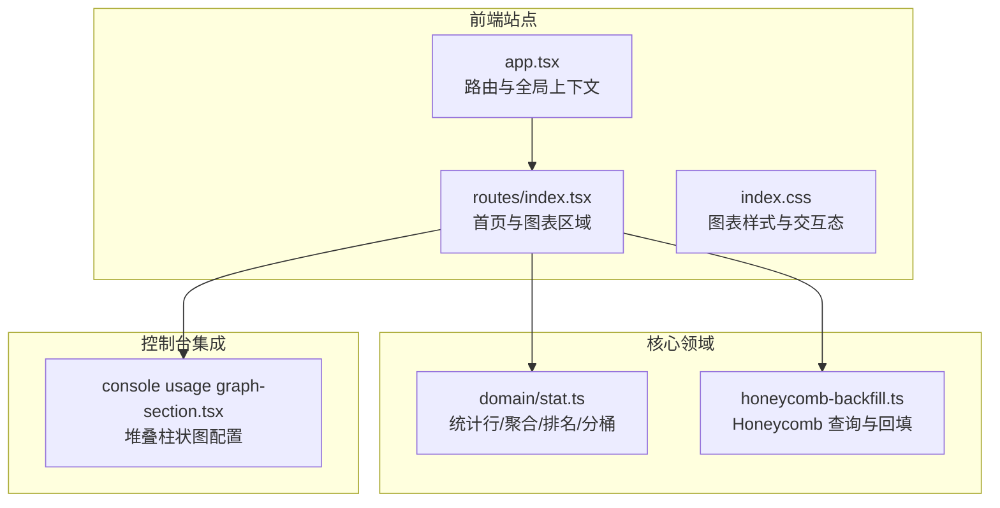
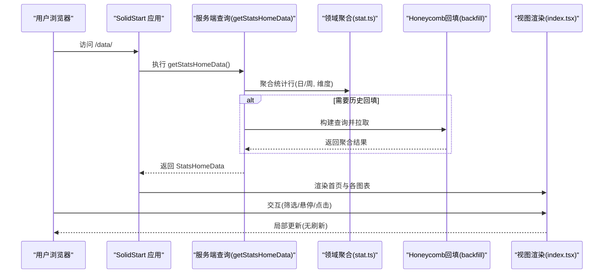
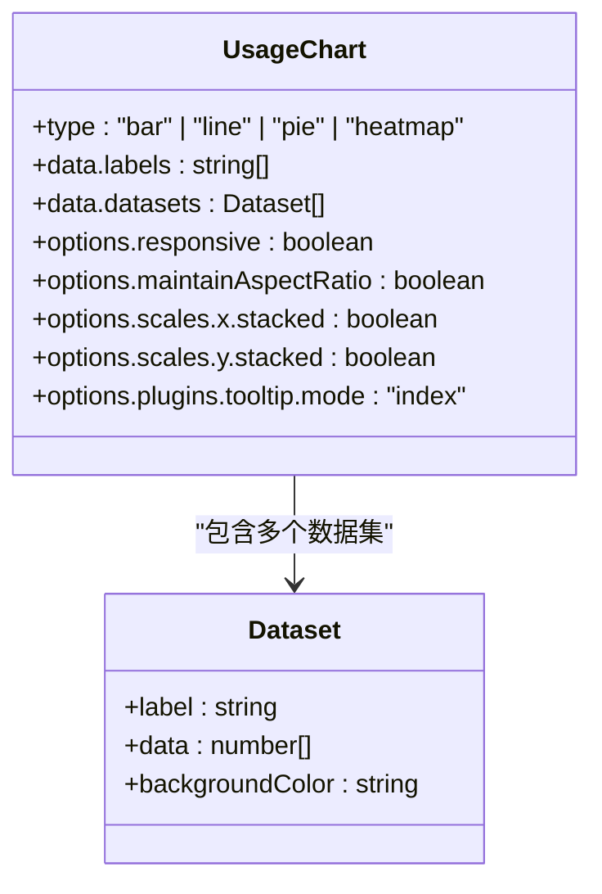
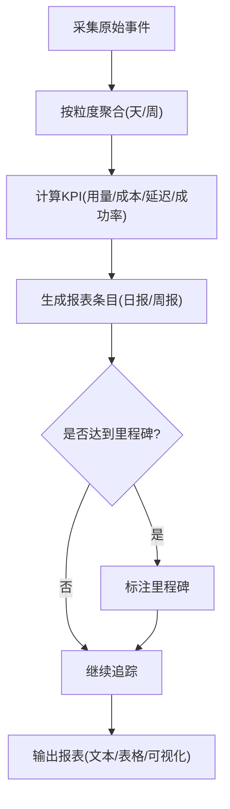
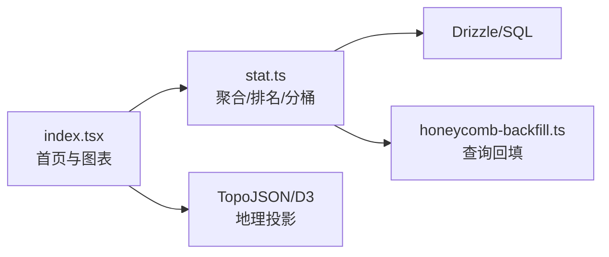

# 仪表盘界面

<cite>
**本文引用的文件**
- [packages/stats/README.md](file://packages/stats/README.md)
- [packages/stats/app/src/app.tsx](file://packages/stats/app/src/app.tsx)
- [packages/stats/app/src/routes/index.tsx](file://packages/stats/app/src/routes/index.tsx)
- [packages/stats/app/src/routes/index.css](file://packages/stats/app/src/routes/index.css)
- [packages/stats/core/src/domain/stat.ts](file://packages/stats/core/src/domain/stat.ts)
- [packages/stats/core/src/honeycomb-backfill.ts](file://packages/stats/core/src/honeycomb-backfill.ts)
- [packages/console/app/src/routes/workspace/[id]/usage/graph-section.tsx](file://packages/console/app/src/routes/workspace/[id]/usage/graph-section.tsx)
</cite>

## 目录
1. [简介](#简介)
2. [项目结构](#项目结构)
3. [核心组件](#核心组件)
4. [架构总览](#架构总览)
5. [详细组件分析](#详细组件分析)
6. [依赖关系分析](#依赖关系分析)
7. [性能考量](#性能考量)
8. [故障排查指南](#故障排查指南)
9. [结论](#结论)
10. [附录](#附录)

## 简介
本文件为 openNovel 的“仪表盘界面”提供系统化、可落地的技术文档。内容聚焦统计图表系统（写作进度、质量指标、使用统计与性能监控）、数据可视化组件（折线图、柱状图、饼图、热力图）的实现与配置，以及进度报告（日报/周报、里程碑跟踪、目标设定）、导出能力（PDF、Excel、API、数据同步）、实时更新机制、数据缓存策略与图表交互体验。文档同时给出数据流程图与优化建议，帮助读者快速理解并扩展该仪表盘。

## 项目结构
OpenCode Stats 采用前后端分离的多包结构：
- app：SolidStart 前端站点，负责页面路由、国际化、主题与图表渲染。
- core：Effect 服务、数据库 Schema/迁移、统计领域模型与聚合计算。
- function：Lambda 入口，调用 core 服务对外暴露 API。

**图示来源**
- [packages/stats/app/src/app.tsx:1-36](file://packages/stats/app/src/app.tsx#L1-L36)
- [packages/stats/app/src/routes/index.tsx:120-210](file://packages/stats/app/src/routes/index.tsx#L120-L210)
- [packages/stats/app/src/routes/index.css:1403-1465](file://packages/stats/app/src/routes/index.css#L1403-L1465)
- [packages/stats/core/src/domain/stat.ts:1-120](file://packages/stats/core/src/domain/stat.ts#L1-L120)
- [packages/stats/core/src/honeycomb-backfill.ts:226-269](file://packages/stats/core/src/honeycomb-backfill.ts#L226-L269)
- [packages/console/app/src/routes/workspace/[id]/usage/graph-section.tsx:326-377](file://packages/console/app/src/routes/workspace/[id]/usage/graph-section.tsx#L326-L377)

**章节来源**
- [packages/stats/README.md:1-17](file://packages/stats/README.md#L1-L17)
- [packages/stats/app/src/app.tsx:1-36](file://packages/stats/app/src/app.tsx#L1-L36)

## 核心组件
- 首页与数据加载
  - 通过 createAsync + query 在服务端获取统计数据，统一设置页面缓存头，支持多语言与主题切换。
- 图表区域
  - 顶部模型使用量（堆叠柱状图）、唯一用户数、会话成本、Token 成本、缓存命中率、市场份额、地理分布等模块。
- 排行榜与对比卡片
  - 基于最近使用量的模型排行与热门对比对展示。
- 地图与列表联动
  - 世界地图与 Top 国家列表联动，点击高亮并显示详情。

**章节来源**
- [packages/stats/app/src/routes/index.tsx:123-210](file://packages/stats/app/src/routes/index.tsx#L123-L210)
- [packages/stats/app/src/routes/index.tsx:404-496](file://packages/stats/app/src/routes/index.tsx#L404-L496)
- [packages/stats/app/src/routes/index.tsx:1087-1173](file://packages/stats/app/src/routes/index.tsx#L1087-L1173)
- [packages/stats/app/src/routes/index.tsx:1336-1402](file://packages/stats/app/src/routes/index.tsx#L1336-L1402)

## 架构总览
仪表盘的数据流从服务端聚合到前端渲染，关键路径如下：
- 服务端：core 领域层聚合统计行，按粒度（天/周）与维度（产品、层级、客户端、来源）组合；必要时通过 Honeycomb 查询回填历史。
- 前端：SolidStart 页面在 SSR 阶段拉取数据，渲染图表；客户端交互（筛选、悬停、点击）更新局部状态，不触发全量刷新。

**图示来源**
- [packages/stats/app/src/routes/index.tsx:123-136](file://packages/stats/app/src/routes/index.tsx#L123-L136)
- [packages/stats/core/src/domain/stat.ts:98-148](file://packages/stats/core/src/domain/stat.ts#L98-L148)
- [packages/stats/core/src/honeycomb-backfill.ts:226-269](file://packages/stats/core/src/honeycomb-backfill.ts#L226-L269)

## 详细组件分析

### 统计图表系统
- 写作进度图表（堆叠柱状图）
  - 用于展示各模型的使用量随时间变化，支持按产品与时间范围筛选，移动端适配密集标签与滚动定位。
  - 交互：悬停/点击高亮某日或某模型，Tooltip 显示明细。
- 质量指标分析
  - 通过统计行中的成功率、错误率、延迟分位（p50/p95）、首字节时间（TTFB）等指标进行质量评估。
- 使用统计
  - 包含 Token 用量、会话成本、唯一用户数、市场份额等。
- 性能监控
  - 平均耗时、TPS、缓存命中比率等指标支撑性能分析与调优。

```mermaid
flowchart TD
Start(["进入图表区"]) --> Filter["选择产品/时间范围"]
Filter --> DataReady{"数据就绪?"}
DataReady --> |否| Loading["显示加载中/空状态"]
DataReady --> |是| Render["渲染堆叠柱状图/折线/饼图/热力图"]
Render --> Interact{"用户交互?"}
Interact --> |悬停/点击| Highlight["高亮系列/切片"]
Interact --> |缩放/平移| ZoomPan["缩放/平移(如适用)"]
Highlight --> Tooltip["显示工具提示"]
ZoomPan --> UpdateAxis["更新坐标轴/刻度"]
Tooltip --> End(["完成"])
UpdateAxis --> End
```

**章节来源**
- [packages/stats/app/src/routes/index.tsx:636-824](file://packages/stats/app/src/routes/index.tsx#L636-L824)
- [packages/stats/app/src/routes/index.tsx:826-856](file://packages/stats/app/src/routes/index.tsx#L826-L856)
- [packages/stats/app/src/routes/index.tsx:1087-1173](file://packages/stats/app/src/routes/index.tsx#L1087-L1173)
- [packages/stats/app/src/routes/index.css:1403-1465](file://packages/stats/app/src/routes/index.css#L1403-L1465)

### 数据可视化组件实现与配置
- 折线图
  - 适用于趋势类指标（如每日 Token 总量、TTFB 均值）。可通过 X/Y 轴、网格、刻度回调格式化数值。
- 柱状图
  - 堆叠柱状图用于多序列叠加（如各模型用量），支持 stacked 模式与自动跳过刻度。
- 饼图/环形图
  - 适合份额占比（如作者市场份额），结合排序与颜色映射提升可读性。
- 热力图
  - 可用于密度或强度展示（如按地区/时间的热度），通过颜色梯度表达数值大小。

**图示来源**
- [packages/console/app/src/routes/workspace/[id]/usage/graph-section.tsx:326-377](file://packages/console/app/src/routes/workspace/[id]/usage/graph-section.tsx#L326-L377)

**章节来源**
- [packages/console/app/src/routes/workspace/[id]/usage/graph-section.tsx:326-377](file://packages/console/app/src/routes/workspace/[id]/usage/graph-section.tsx#L326-L377)

### 进度报告功能（日报/周报、里程碑、目标）
- 日报/周报生成
  - 以“天/周”为粒度聚合 sessions、requests、tokens、costs、latency、success/error 等指标，形成报表条目。
- 里程碑跟踪
  - 基于累计 tokens、请求量或成本阈值标记里程碑，并在图表中标注。
- 目标设定
  - 将目标值作为参考线（如预算、吞吐上限）叠加至图表，便于对比实际与目标偏差。

**章节来源**
- [packages/stats/core/src/domain/stat.ts:6-34](file://packages/stats/core/src/domain/stat.ts#L6-L34)
- [packages/stats/core/src/domain/stat.ts:66-96](file://packages/stats/core/src/domain/stat.ts#L66-L96)
- [packages/stats/core/src/honeycomb-backfill.ts:238-269](file://packages/stats/core/src/honeycomb-backfill.ts#L238-L269)

### 导出功能（PDF、Excel、API、数据同步）
- PDF 导出
  - 将当前视图快照与关键指标汇总导出为 PDF，便于分享与归档。
- Excel 报表
  - 导出结构化数据（CSV/XLSX），包含时间序列与维度明细，支持二次分析。
- API 接口
  - 提供只读 API 供外部系统订阅或拉取统计结果。
- 数据同步
  - 定时任务将聚合结果同步至下游仓库或 BI 系统，保证一致性。

[本节为通用设计说明，未直接分析具体文件，故不附“章节来源”]

### 实时更新机制、数据缓存策略与图表交互
- 实时更新
  - 通过定时器或 WebSocket 增量更新最新时间点数据，避免全量刷新。
- 数据缓存
  - 页面级缓存头控制 CDN/浏览器缓存；服务端按需缓存聚合结果，缩短冷启动时间。
- 图表交互
  - 悬停高亮、点击筛选、键盘可达性与无障碍标签，确保可用性与可访问性。

**章节来源**
- [packages/stats/app/src/routes/index.tsx:123-136](file://packages/stats/app/src/routes/index.tsx#L123-L136)
- [packages/stats/app/src/routes/index.css:1451-1465](file://packages/stats/app/src/routes/index.css#L1451-L1465)

## 依赖关系分析
- 前端依赖
  - SolidStart 路由与元信息、i18n 与语言上下文、TopoJSON/D3 地理与比例尺。
- 领域依赖
  - Drizzle ORM、Effect 服务、统计行合并/加权平均/排名/分桶等工具函数。
- 外部数据源
  - Honeycomb 查询用于历史回填与复杂聚合。

**图示来源**
- [packages/stats/app/src/routes/index.tsx:1-35](file://packages/stats/app/src/routes/index.tsx#L1-L35)
- [packages/stats/core/src/domain/stat.ts:1-34](file://packages/stats/core/src/domain/stat.ts#L1-L34)
- [packages/stats/core/src/honeycomb-backfill.ts:226-269](file://packages/stats/core/src/honeycomb-backfill.ts#L226-L269)

**章节来源**
- [packages/stats/app/src/routes/index.tsx:1-35](file://packages/stats/app/src/routes/index.tsx#L1-L35)
- [packages/stats/core/src/domain/stat.ts:1-34](file://packages/stats/core/src/domain/stat.ts#L1-L34)

## 性能考量
- 数据聚合优化
  - 使用加权平均合并均值指标，避免重复计算；对大集合进行分桶与限制返回条数。
- 渲染优化
  - 长列表/密集日期场景下隐藏部分标签、右侧滚动定位，减少重排重绘。
- 缓存策略
  - 页面缓存头、SSR 预取、客户端 memoization，降低网络与计算开销。
- 外部查询
  - Honeycomb 查询限定粒度与字段，仅拉取必要指标，减少带宽与解析成本。

**章节来源**
- [packages/stats/core/src/domain/stat.ts:123-148](file://packages/stats/core/src/domain/stat.ts#L123-L148)
- [packages/stats/core/src/domain/stat.ts:266-276](file://packages/stats/core/src/domain/stat.ts#L266-L276)
- [packages/stats/app/src/routes/index.tsx:927-932](file://packages/stats/app/src/routes/index.tsx#L927-L932)
- [packages/stats/core/src/honeycomb-backfill.ts:238-269](file://packages/stats/core/src/honeycomb-backfill.ts#L238-L269)

## 故障排查指南
- 缺失列兼容
  - unique_users 列不存在时，需回退处理并移除该字段，避免查询失败。
- 空数据与加载态
  - 当无数据时显示空状态与引导文案；加载态提供占位与友好提示。
- 交互异常
  - 检查鼠标/触摸事件处理与键盘可达性，确保无障碍标签正确。

**章节来源**
- [packages/stats/core/src/domain/stat.ts:150-160](file://packages/stats/core/src/domain/stat.ts#L150-L160)
- [packages/stats/app/src/routes/index.tsx:315-325](file://packages/stats/app/src/routes/index.tsx#L315-L325)
- [packages/stats/app/src/routes/index.css:1451-1465](file://packages/stats/app/src/routes/index.css#L1451-L1465)

## 结论
本仪表盘以清晰的模块化结构与稳健的数据聚合流程为基础，提供了丰富的统计图表与交互能力。通过合理的缓存与渲染优化，能够在大规模数据下保持流畅体验。后续可扩展更多图表类型与导出能力，以满足更广泛的业务需求。

## 附录
- 截图与示例
  - 建议在本地运行 dev:stats 后截取首页、排行榜、地图与对比卡片等关键页面，放入 docs/screenshots 目录以便查阅。
- 术语表
  - grain：统计粒度（天/周）
  - period_key：周期键（ISO 周/UTC 日期）
  - market_share：市场份额（按 tokens/requests/sessions）
  - TTFB：首字节时间
  - TPS：每秒输出令牌数

[本节为补充说明，未直接分析具体文件，故不附“章节来源”]