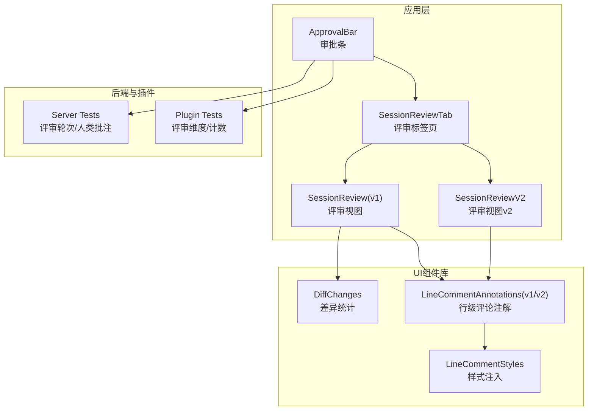
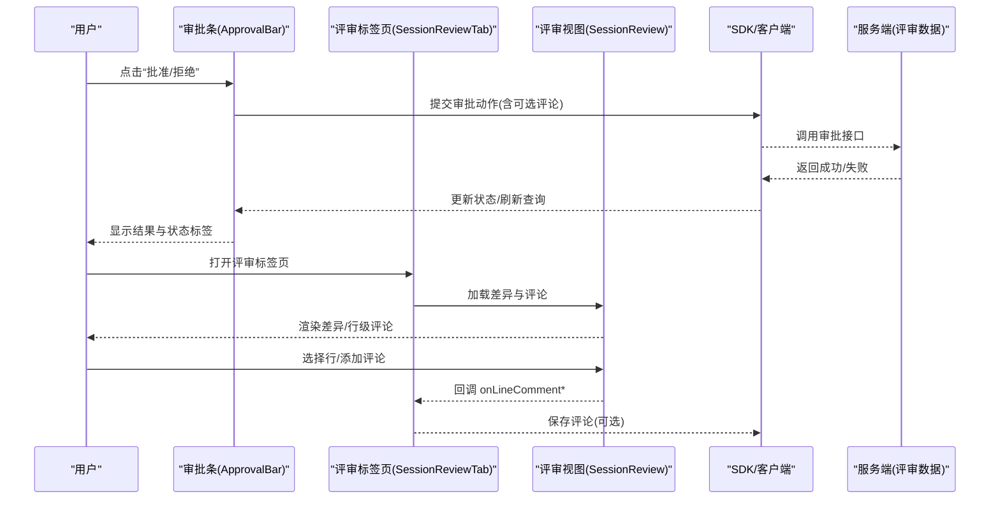
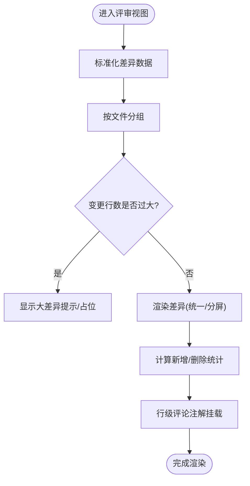
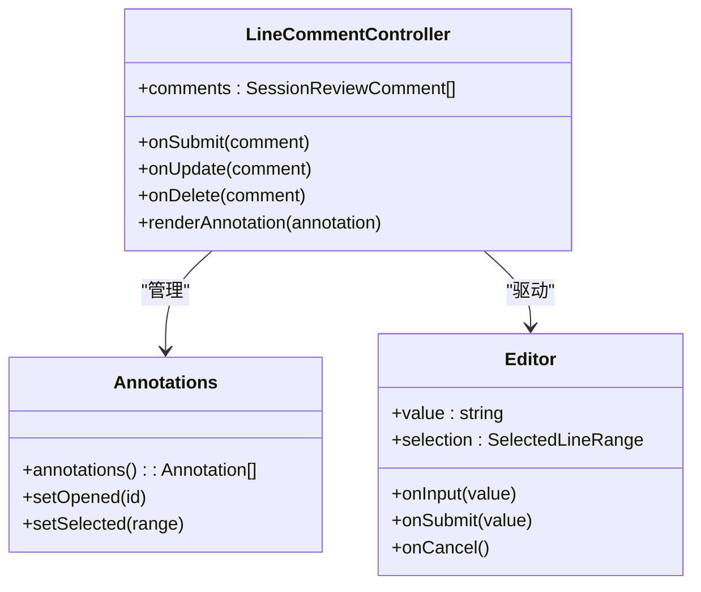
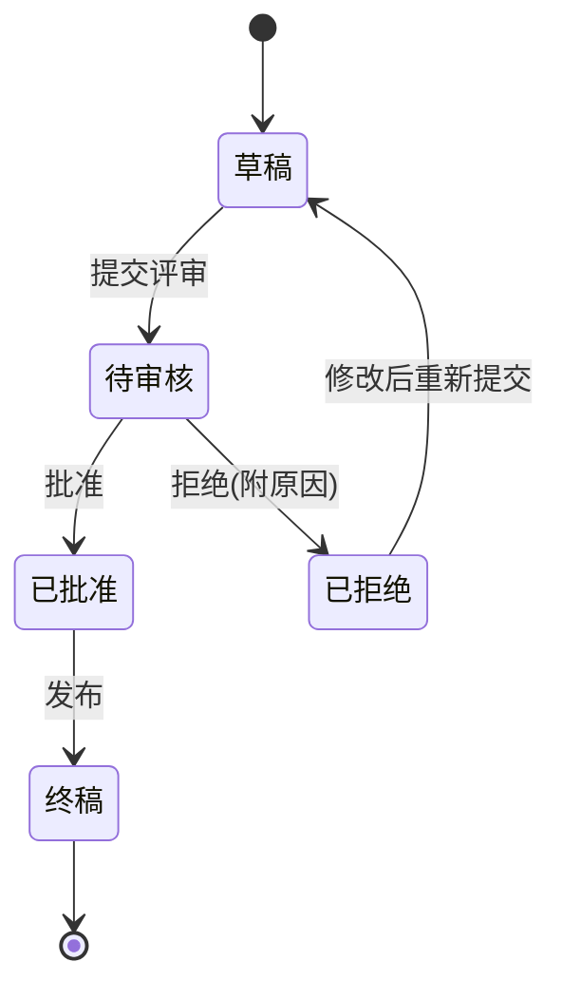
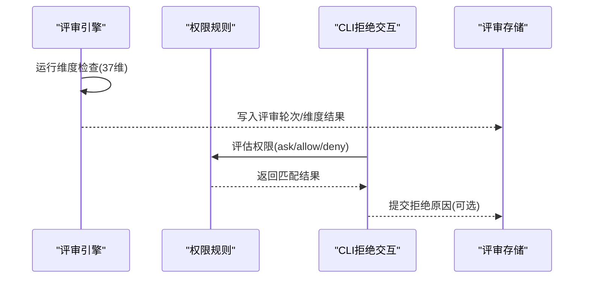
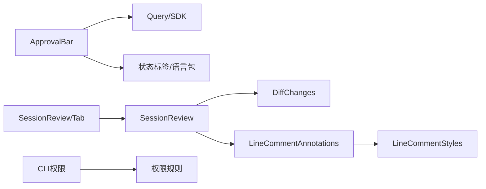

# 审批流程界面

<cite>
**本文引用的文件**   
- [approval-bar.tsx](file://packages/app/src/pages/novel/approval-bar.tsx)
- [review-tab.tsx](file://packages/app/src/pages/session/review-tab.tsx)
- [session-review.tsx](file://packages/session-ui/src/components/session-review.tsx)
- [session-review-v2.tsx](file://packages/session-ui/src/v2/components/session-review-v2.tsx)
- [diff-changes.tsx](file://packages/ui/src/components/diff-changes.tsx)
- [line-comment-annotations.tsx](file://packages/session-ui/src/components/line-comment-annotations.tsx)
- [line-comment-annotations-v2.tsx](file://packages/session-ui/src/v2/components/line-comment-annotations-v2.tsx)
- [line-comment-styles.ts](file://packages/session-ui/src/components/line-comment-styles.ts)
- [review-diff-kinds.test.ts](file://packages/app/src/pages/session/v2/review-diff-kinds.test.ts)
- [novel-writer review.test.ts](file://packages/plugin/test/novel-writer/review.test.ts)
- [novel.test.ts](file://packages/server/test/novel.test.ts)
- [permission.shared.ts](file://packages/opencode/src/cli/cmd/run/permission.shared.ts)
- [footer.permission.tsx](file://packages/opencode/src/cli/cmd/run/footer.permission.tsx)
- [agent.test.ts](file://packages/core/test/config/agent.test.ts)
- [permission-task.test.ts](file://packages/opencode/test/permission-task.test.ts)
</cite>

## 目录
1. [简介](#简介)
2. [项目结构](#项目结构)
3. [核心组件](#核心组件)
4. [架构总览](#架构总览)
5. [详细组件分析](#详细组件分析)
6. [依赖关系分析](#依赖关系分析)
7. [性能考量](#性能考量)
8. [故障排查指南](#故障排查指南)
9. [结论](#结论)
10. [附录](#附录)

## 简介
本文件为 openNovel 的“审批流程界面”提供系统化文档，覆盖版本对比系统（差异高亮、变更追踪、合并请求与冲突解决）、评论系统（行级评论、全局批注、回复讨论与状态标记）、状态管理（草稿、待审核、已批准、已拒绝等流转与通知）、审批工作流（多级审核、角色权限、审批规则与自动化检查），以及批量审批、模板管理、审计日志与报告生成。文档以代码为依据，辅以流程图与时序图，帮助读者快速理解并高效使用。

## 项目结构
审批相关的前端界面主要分布在以下模块：
- 小说章节审批条与评审详情面板：packages/app/src/pages/novel/approval-bar.tsx
- 会话评审标签页与滚动恢复：packages/app/src/pages/session/review-tab.tsx
- 通用评审视图（v1）：packages/session-ui/src/components/session-review.tsx
- 评审视图 v2（侧边栏、工具栏、切换模式）：packages/session-ui/src/v2/components/session-review-v2.tsx
- 差异统计可视化：packages/ui/src/components/diff-changes.tsx
- 行级评论注解渲染与管理（v1/v2）：packages/session-ui/src/components/line-comment-annotations.tsx, packages/session-ui/src/v2/components/line-comment-annotations-v2.tsx
- 行级评论样式注入：packages/session-ui/src/components/line-comment-styles.ts
- 评审差异分类与过滤逻辑测试：packages/app/src/pages/session/v2/review-diff-kinds.test.ts
- 评审轮次与人类批注持久化测试：packages/plugin/test/novel-writer/review.test.ts, packages/server/test/novel.test.ts
- 权限与拒绝交互（CLI）：packages/opencode/src/cli/cmd/run/permission.shared.ts, packages/opencode/src/cli/cmd/run/footer.permission.tsx
- 代理权限配置与评估：packages/core/test/config/agent.test.ts, packages/opencode/test/permission-task.test.ts

图表来源 
- [approval-bar.tsx:1-383](file://packages/app/src/pages/novel/approval-bar.tsx#L1-L383)
- [review-tab.tsx:1-172](file://packages/app/src/pages/session/review-tab.tsx#L1-L172)
- [session-review.tsx:1-657](file://packages/session-ui/src/components/session-review.tsx#L1-L657)
- [session-review-v2.tsx:1-341](file://packages/session-ui/src/v2/components/session-review-v2.tsx#L1-L341)
- [diff-changes.tsx:1-116](file://packages/ui/src/components/diff-changes.tsx#L1-L116)
- [line-comment-annotations.tsx:71-114](file://packages/session-ui/src/components/line-comment-annotations.tsx#L71-L114)
- [line-comment-annotations-v2.tsx:83-122](file://packages/session-ui/src/v2/components/line-comment-annotations-v2.tsx#L83-L122)
- [line-comment-styles.ts:259-292](file://packages/session-ui/src/components/line-comment-styles.ts#L259-L292)
- [novel-writer review.test.ts:67-98](file://packages/plugin/test/novel-writer/review.test.ts#L67-L98)
- [novel.test.ts:268-308](file://packages/server/test/novel.test.ts#L268-L308)

章节来源
- [approval-bar.tsx:1-383](file://packages/app/src/pages/novel/approval-bar.tsx#L1-L383)
- [review-tab.tsx:1-172](file://packages/app/src/pages/session/review-tab.tsx#L1-L172)

## 核心组件
- 审批条 ApprovalBar：展示章节状态、操作按钮（批准/拒绝）、评审详情折叠面板（轮次、总体结果、维度明细、人类批注）。支持跳转到对应会话查看完整评审。
- 评审标签页 SessionReviewTab：封装 SessionReview，处理滚动恢复、文件读取、行级评论事件桥接。
- 评审视图 SessionReview(v1)：差异列表、展开/折叠、统一/分屏模式切换、大差异保护、行级评论编辑器与注解渲染。
- 评审视图 SessionReviewV2：侧边栏文件树、筛选、键盘导航、展开/折叠非差异行、工具栏控制。
- 差异统计 DiffChanges：将新增/删除行数映射为可视化条或数字，辅助快速感知变更规模。
- 行级评论注解 LineCommentAnnotations(v1/v2)：评论创建、编辑、删除、选择范围、提及、样式注入。

章节来源
- [approval-bar.tsx:1-383](file://packages/app/src/pages/novel/approval-bar.tsx#L1-L383)
- [review-tab.tsx:1-172](file://packages/app/src/pages/session/review-tab.tsx#L1-L172)
- [session-review.tsx:1-657](file://packages/session-ui/src/components/session-review.tsx#L1-L657)
- [session-review-v2.tsx:1-341](file://packages/session-ui/src/v2/components/session-review-v2.tsx#L1-L341)
- [diff-changes.tsx:1-116](file://packages/ui/src/components/diff-changes.tsx#L1-L116)
- [line-comment-annotations.tsx:71-114](file://packages/session-ui/src/components/line-comment-annotations.tsx#L71-L114)
- [line-comment-annotations-v2.tsx:83-122](file://packages/session-ui/src/v2/components/line-comment-annotations-v2.tsx#L83-L122)

## 架构总览
审批流程由前端界面、评审视图与后端评审数据共同构成。用户通过审批条触发批准/拒绝，评审视图展示差异与评论，后端维护评审轮次与人类批注，CLI 权限机制支撑拒绝交互。

图表来源 
- [approval-bar.tsx:245-383](file://packages/app/src/pages/novel/approval-bar.tsx#L245-L383)
- [review-tab.tsx:46-172](file://packages/app/src/pages/session/review-tab.tsx#L46-L172)
- [session-review.tsx:164-657](file://packages/session-ui/src/components/session-review.tsx#L164-L657)

## 详细组件分析

### 版本对比系统与差异高亮
- 差异数据结构：统一/分屏两种模式，支持 SnapshotFileDiff 与 VcsFileDiff；对二进制/媒体文件进行特殊处理。
- 大差异保护：超过阈值时显示占位并提供强制渲染选项，避免卡顿。
- 差异统计：DiffChanges 将新增/删除行数聚合为可视化条或数字，便于概览。
- 差异分类与过滤：根据文件路径与状态归类，支持按子串过滤。

图表来源 
- [session-review.tsx:164-657](file://packages/session-ui/src/components/session-review.tsx#L164-L657)
- [diff-changes.tsx:1-116](file://packages/ui/src/components/diff-changes.tsx#L1-L116)
- [review-diff-kinds.test.ts:1-42](file://packages/app/src/pages/session/v2/review-diff-kinds.test.ts#L1-L42)

章节来源
- [session-review.tsx:164-657](file://packages/session-ui/src/components/session-review.tsx#L164-L657)
- [diff-changes.tsx:1-116](file://packages/ui/src/components/diff-changes.tsx#L1-L116)
- [review-diff-kinds.test.ts:1-42](file://packages/app/src/pages/session/v2/review-diff-kinds.test.ts#L1-L42)

### 评论系统（行级评论、全局批注、回复讨论与状态标记）
- 行级评论：基于 SelectedLineRange 的选择范围，支持创建、编辑、删除、预览上下文、提及。
- 注解渲染：v1/v2 两套实现，均通过独立宿主节点与 Solid root 管理，避免重渲染开销。
- 样式注入：动态注入 CSS，确保一致外观。
- 聚焦与滚动：外部可指定焦点评论，自动滚动到目标位置。

图表来源 
- [line-comment-annotations.tsx:71-114](file://packages/session-ui/src/components/line-comment-annotations.tsx#L71-L114)
- [line-comment-annotations-v2.tsx:83-122](file://packages/session-ui/src/v2/components/line-comment-annotations-v2.tsx#L83-L122)
- [line-comment-styles.ts:259-292](file://packages/session-ui/src/components/line-comment-styles.ts#L259-L292)

章节来源
- [session-review.tsx:434-486](file://packages/session-ui/src/components/session-review.tsx#L434-L486)
- [line-comment-annotations.tsx:71-114](file://packages/session-ui/src/components/line-comment-annotations.tsx#L71-L114)
- [line-comment-annotations-v2.tsx:83-122](file://packages/session-ui/src/v2/components/line-comment-annotations-v2.tsx#L83-L122)
- [line-comment-styles.ts:259-292](file://packages/session-ui/src/components/line-comment-styles.ts#L259-L292)

### 状态管理与审批流转
- 状态标签：planned/draft/outline/failed/drafting/audited/revised/pending_review/final/rejected/published 等，映射不同颜色与文案。
- 审批动作：批准直接生效；拒绝需输入原因，成功后刷新状态。
- 评审轮次：内容未变更时再次评审并入同一轮；内容变更后开启新轮次。
- 人类批注：保留 source=human 的记录，包含 overall 与 summary。

图表来源 
- [approval-bar.tsx:21-33](file://packages/app/src/pages/novel/approval-bar.tsx#L21-L33)
- [approval-bar.tsx:264-286](file://packages/app/src/pages/novel/approval-bar.tsx#L264-L286)
- [novel.test.ts:268-308](file://packages/server/test/novel.test.ts#L268-L308)

章节来源
- [approval-bar.tsx:21-33](file://packages/app/src/pages/novel/approval-bar.tsx#L21-L33)
- [approval-bar.tsx:264-286](file://packages/app/src/pages/novel/approval-bar.tsx#L264-L286)
- [novel.test.ts:268-308](file://packages/server/test/novel.test.ts#L268-L308)

### 审批工作流（多级审核、角色权限、审批规则与自动化检查）
- 评审维度：37 维 9 大类分组，涵盖人物、关系、时间线、地点、剧情、世界观、风格、逻辑、细节等。
- 自动化检查：deterministic/auditor 源分别代表确定性规则与深度审查，记录 PASS/WARN/FAIL 及证据。
- 权限与拒绝：CLI 中支持 ask/allow/deny 规则匹配，拒绝时可填写原因并等待权限事件。
- 代理权限：按 agent 维度配置权限，最后匹配优先。

图表来源 
- [approval-bar.tsx:41-52](file://packages/app/src/pages/novel/approval-bar.tsx#L41-L52)
- [novel-writer review.test.ts:67-98](file://packages/plugin/test/novel-writer/review.test.ts#L67-L98)
- [permission.shared.ts:200-256](file://packages/opencode/src/cli/cmd/run/permission.shared.ts#L200-L256)
- [footer.permission.tsx:293-331](file://packages/opencode/src/cli/cmd/run/footer.permission.tsx#L293-L331)
- [agent.test.ts:59-136](file://packages/core/test/config/agent.test.ts#L59-L136)
- [permission-task.test.ts:40-67](file://packages/opencode/test/permission-task.test.ts#L40-L67)

章节来源
- [approval-bar.tsx:41-52](file://packages/app/src/pages/novel/approval-bar.tsx#L41-L52)
- [novel-writer review.test.ts:67-98](file://packages/plugin/test/novel-writer/review.test.ts#L67-L98)
- [permission.shared.ts:200-256](file://packages/opencode/src/cli/cmd/run/permission.shared.ts#L200-L256)
- [footer.permission.tsx:293-331](file://packages/opencode/src/cli/cmd/run/footer.permission.tsx#L293-L331)
- [agent.test.ts:59-136](file://packages/core/test/config/agent.test.ts#L59-L136)
- [permission-task.test.ts:40-67](file://packages/opencode/test/permission-task.test.ts#L40-L67)

### 合并请求与冲突解决（概念性说明）
- 差异合并：在评审视图中以统一/分屏模式呈现，结合 DiffChanges 统计变更规模。
- 冲突定位：通过行级评论标注问题位置，配合证据字段辅助定位。
- 解决策略：作者依据评论修改内容，触发新一轮评审；若内容未变则复用同轮。

[本节为概念性说明，不直接分析具体文件]

### 批量审批、模板管理、审计日志与报告生成（概念性说明）
- 批量审批：可在审批条基础上扩展批量操作入口，结合状态标签与轮次筛选。
- 模板管理：可将 37 维分组与判定规则抽象为模板，支持按项目定制。
- 审计日志：人类批注与自动化评审结果持久化，形成可追溯记录。
- 报告生成：汇总各轮次的 PASS/WARN/FAIL 统计与证据，输出可读报告。

[本节为概念性说明，不直接分析具体文件]

## 依赖关系分析
- 组件耦合：ApprovalBar 依赖查询与 SDK；SessionReviewTab 桥接 SessionReview；SessionReview 依赖 UI 组件库与行级评论注解。
- 外部依赖：SolidJS、TanStack Query、Pierre Diff、i18n、文件读取等。
- 权限与规则：CLI 权限规则与代理权限配置影响拒绝流程与行为。

图表来源 
- [approval-bar.tsx:1-383](file://packages/app/src/pages/novel/approval-bar.tsx#L1-L383)
- [review-tab.tsx:1-172](file://packages/app/src/pages/session/review-tab.tsx#L1-L172)
- [session-review.tsx:1-657](file://packages/session-ui/src/components/session-review.tsx#L1-L657)
- [diff-changes.tsx:1-116](file://packages/ui/src/components/diff-changes.tsx#L1-L116)
- [line-comment-annotations.tsx:71-114](file://packages/session-ui/src/components/line-comment-annotations.tsx#L71-L114)
- [line-comment-styles.ts:259-292](file://packages/session-ui/src/components/line-comment-styles.ts#L259-L292)
- [permission.shared.ts:200-256](file://packages/opencode/src/cli/cmd/run/permission.shared.ts#L200-L256)

章节来源
- [approval-bar.tsx:1-383](file://packages/app/src/pages/novel/approval-bar.tsx#L1-L383)
- [review-tab.tsx:1-172](file://packages/app/src/pages/session/review-tab.tsx#L1-L172)
- [session-review.tsx:1-657](file://packages/session-ui/src/components/session-review.tsx#L1-L657)

## 性能考量
- 大差异保护：变更行数超过阈值时延迟渲染，避免阻塞。
- 可见性优化：仅渲染可视区域内的差异项，减少 DOM 压力。
- 注解宿主隔离：每个注解拥有独立宿主与 Solid root，降低重渲染成本。
- 样式注入一次性：样式注入防重复，避免多次插入。

章节来源
- [session-review.tsx:204-231](file://packages/session-ui/src/components/session-review.tsx#L204-L231)
- [line-comment-annotations.tsx:98-114](file://packages/session-ui/src/components/line-comment-annotations.tsx#L98-L114)
- [line-comment-styles.ts:275-292](file://packages/session-ui/src/components/line-comment-styles.ts#L275-L292)

## 故障排查指南
- 评审轮次异常：确认内容是否变更；未变更应复用同轮，变更后开启新轮。
- 人类批注缺失：检查 human 源记录是否持久化，overall 与 summary 是否正确。
- 权限拒绝卡住：检查 CLI 权限规则匹配与 reject 消息提交。
- 代理权限冲突：确认最后匹配优先原则，避免 deny/allow 冲突。

章节来源
- [novel.test.ts:268-308](file://packages/server/test/novel.test.ts#L268-L308)
- [novel-writer review.test.ts:67-98](file://packages/plugin/test/novel-writer/review.test.ts#L67-L98)
- [permission.shared.ts:226-256](file://packages/opencode/src/cli/cmd/run/permission.shared.ts#L226-L256)
- [agent.test.ts:114-136](file://packages/core/test/config/agent.test.ts#L114-L136)

## 结论
openNovel 的审批流程界面以清晰的组件分层与完善的评审能力为核心，支持差异高亮、行级评论、多维自动化检查与权限驱动的拒绝交互。通过大差异保护、可见性优化与注解宿主隔离，兼顾了性能与体验。建议在此基础上扩展批量审批、模板管理与报告生成，进一步提升协作效率与可追溯性。

## 附录
- 界面截图参考：e2e 测试中生成的截图路径可用于验证审批条与评审视图的显示效果。
- 最佳实践：
  - 使用统一/分屏模式结合 DiffChanges 快速定位变更。
  - 利用行级评论与证据字段精准描述问题。
  - 遵循权限规则与代理权限优先级，避免冲突。
  - 关注评审轮次与人类批注，确保可追溯与复盘。

[本节为补充信息，不直接分析具体文件]