# 工作空间界面

<cite>
**本文引用的文件**   
- [README.md](file://README.md)
- [package.json](file://package.json)
- [packages/app/src/pages/novel/layout.tsx](file://packages/app/src/pages/novel/layout.tsx)
- [packages/app/src/pages/directory-layout.tsx](file://packages/app/src/pages/directory-layout.tsx)
- [packages/app/src/pages/novel/workspace-frame.tsx](file://packages/app/src/pages/novel/workspace-frame.tsx)
- [packages/app/src/context/novel.tsx](file://packages/app/src/context/novel.tsx)
- [packages/app/src/components/file-tree-v2-model.ts](file://packages/app/src/components/file-tree-v2-model.ts)
- [packages/app/src/context/file.tsx](file://packages/app/src/context/file.tsx)
- [packages/app/src/context/file/view-cache.ts](file://packages/app/src/context/file/view-cache.ts)
- [packages/app/src/pages/novel/chapter-editor.tsx](file://packages/app/src/pages/novel/chapter-editor.tsx)
- [packages/server/src/handlers/novel.ts](file://packages/server/src/handlers/novel.ts)
- [packages/core/test/config/agent.test.ts](file://packages/core/test/config/agent.test.ts)
- [specs/v2/config.md](file://specs/v2/config.md)
- [packages/app/src/context/layout-scroll.ts](file://packages/app/src/context/layout-scroll.ts)
- [packages/app/src/components/titlebar-history.ts](file://packages/app/src/components/titlebar-history.ts)
- [packages/effect-drizzle-sqlite/src/sqlite-core/effect/session.ts](file://packages/effect-drizzle-sqlite/src/sqlite-core/effect/session.ts)
- [packages/app/src/pages/novel/workspace-data.ts](file://packages/app/src/pages/novel/workspace-data.ts)
- [packages/app/src/context/novel-queries.ts](file://packages/app/src/context/novel-queries.ts)
</cite>

## 更新摘要
**变更内容**   
- 新增阅读位置持久化功能，支持跨会话恢复阅读进度
- 改进后退导航行为，优化历史记录管理
- 优化查询性能，引入缓存策略和并发控制
- 增强与书架系统的集成，提升用户体验

## 目录
1. [简介](#简介)
2. [项目结构](#项目结构)
3. [核心组件](#核心组件)
4. [架构总览](#架构总览)
5. [详细组件分析](#详细组件分析)
6. [依赖关系分析](#依赖关系分析)
7. [性能考量](#性能考量)
8. [故障排查指南](#故障排查指南)
9. [结论](#结论)
10. [附录](#附录)

## 简介
openNovel 是一款 AI 驱动的小说写作工作台，提供从大纲到审校、修订与导出的完整创作流程。工作空间界面围绕"作品设置、AI 模型配置、审查规则定制、导出格式"等配置管理，"目录导航、上传下载、版本控制、协作编辑"等文件管理，以及"权限、实时同步、评论与冲突解决"等协作能力展开。同时支持主题、快捷键、语言与插件等个性化设置，并提供多标签页、拖拽、撤销重做与数据备份恢复等体验优化。

**最新更新**：新增了阅读位置持久化功能，改进了后退导航行为，优化了查询性能，并增强了与书架系统的集成。

## 项目结构
- 前端 UI：SolidJS 应用（packages/app），负责书架、工作区、审批流等页面与交互。
- 后端服务：opencode 服务端（packages/opencode）与处理器（packages/server），提供小说、章节、版本、会话等 API。
- 数据层：novel-store（packages/novel-store）、schema/protocol（packages/schema, packages/protocol）定义数据契约与协议。
- 插件与工具：writing pipeline（packages/plugin）支撑起草、连续性审校、提交审校等。
- 工程化：monorepo（Bun/Turbo），统一脚本与依赖管理。

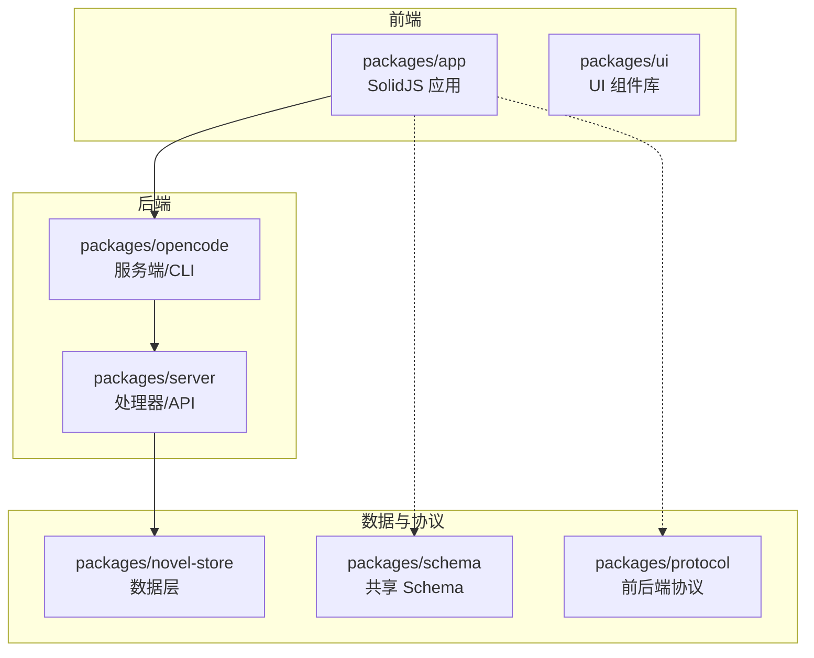

**图表来源** 
- [README.md:60-69](file://README.md#L60-L69)
- [package.json:26-96](file://package.json#L26-L96)

**章节来源**
- [README.md:60-69](file://README.md#L60-L69)
- [package.json:26-96](file://package.json#L26-L96)

## 核心组件
- 工作区框架：NovelWorkspaceFrame 组织三栏布局（左侧章节/大纲、中间阅读/写作/关系/地图、右侧角色/伏笔/张力面板），并集成审批状态、导出与会话嵌入模式。
- 目录与 SDK 上下文：DirectoryDataProvider 解析 base64 编码的目录参数，注入 SDKProvider 与 LocalProvider，统一管理路径切换与会话路由。
- 小说上下文：NovelProvider 封装列表、详情、会话绑定等请求，维护 loading/error 状态。
- 文件树与缓存：FileTreeV2Model 构建扁平路径树；file context 实现按需加载、并发去重与错误提示；view-cache 持久化滚动位置与选行。
- 章节编辑器：ChapterEditor 支持自动保存、字数目标指示、历史版本预览与恢复、快捷键保存。
- 服务器处理器：novel handler 提供章节更新、回滚、版本恢复等逻辑，保证版本链一致性与幂等性。

**最新更新**：新增了阅读位置持久化机制，通过 `persisted` 钩子和全局存储实现跨会话的阅读进度保存。

**章节来源**
- [packages/app/src/pages/novel/workspace-frame.tsx:32-177](file://packages/app/src/pages/novel/workspace-frame.tsx#L32-L177)
- [packages/app/src/pages/directory-layout.tsx:16-74](file://packages/app/src/pages/directory-layout.tsx#L16-L74)
- [packages/app/src/context/novel.tsx:15-98](file://packages/app/src/context/novel.tsx#L15-98)
- [packages/app/src/components/file-tree-v2-model.ts:22-42](file://packages/app/src/components/file-tree-v2-model.ts#L22-42)
- [packages/app/src/context/file.tsx:139-188](file://packages/app/src/context/file.tsx#L139-188)
- [packages/app/src/context/file/view-cache.ts:37-87](file://packages/app/src/context/file/view-cache.ts#L37-87)
- [packages/app/src/pages/novel/chapter-editor.tsx:29-124](file://packages/app/src/pages/novel/chapter-editor.tsx#L29-124)
- [packages/server/src/handlers/novel.ts:522-569](file://packages/server/src/handlers/novel.ts#L522-569)
- [packages/server/src/handlers/novel.ts:800-840](file://packages/server/src/handlers/novel.ts#L800-840)

## 架构总览
工作空间采用"前端上下文 + 后端处理器"的分层架构。前端通过 SDKProvider 与 ServerSDK 发起请求，使用 SolidJS store/memo 管理状态；后端以 Effect 编排数据库操作，返回标准化结果。

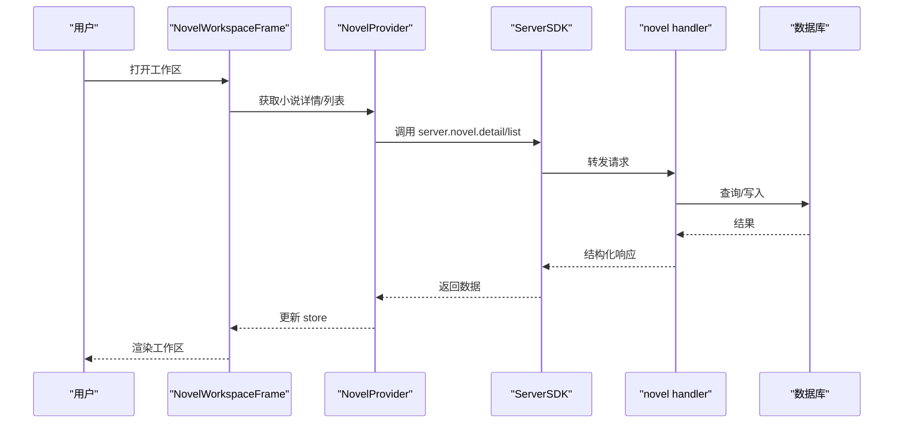

**图表来源** 
- [packages/app/src/pages/novel/workspace-frame.tsx:32-177](file://packages/app/src/pages/novel/workspace-frame.tsx#L32-177)
- [packages/app/src/context/novel.tsx:67-98](file://packages/app/src/context/novel.tsx#L67-98)
- [packages/server/src/handlers/novel.ts:522-569](file://packages/server/src/handlers/novel.ts#L522-569)

## 详细组件分析

### 工作区框架 NovelWorkspaceFrame
- 功能要点
  - 顶部标题与元信息（书名、类型、状态），支持编辑模式切换保存。
  - 导出按钮触发 Markdown 内容下载。
  - 写作流水线状态条（进行中/审校中），支持取消生成。
  - 三栏布局：左侧章节/大纲切换、中间阅读/写作/关系/地图、右侧角色/伏笔/张力。
  - 审批待办计数与审批条。
- 关键交互
  - 编辑模式：标题、简介、类型、风格（基调/视角/时态）、规则（键值对）。
  - 导出：调用 useExportNovel，Blob 下载。
  - 取消生成：查找绑定会话并中止。

**最新更新**：新增了阅读位置持久化功能，通过 `persisted` 钩子保存每本小说的最后阅读章节，重新打开时自动恢复到上次位置。

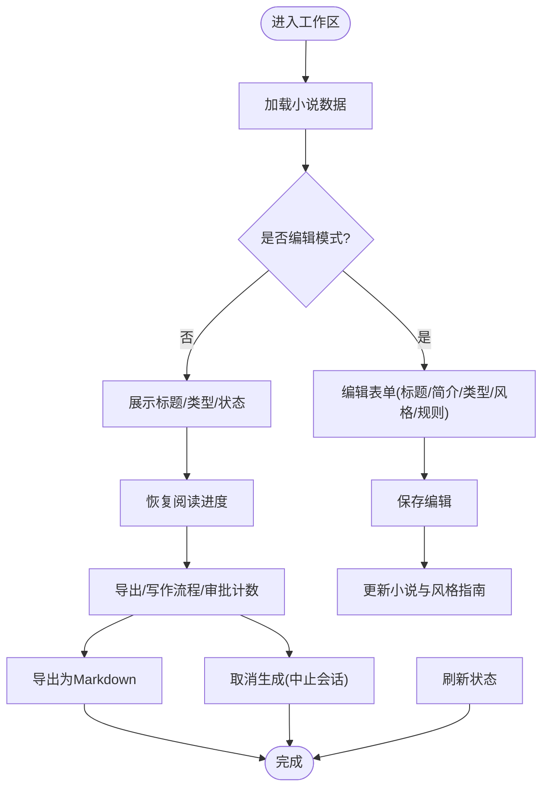

**图表来源** 
- [packages/app/src/pages/novel/workspace-frame.tsx:103-150](file://packages/app/src/pages/novel/workspace-frame.tsx#L103-150)
- [packages/app/src/pages/novel/workspace-frame.tsx:93-101](file://packages/app/src/pages/novel/workspace-frame.tsx#L93-101)
- [packages/app/src/pages/novel/workspace-frame.tsx:78-90](file://packages/app/src/pages/novel/workspace-frame.tsx#L78-90)

**章节来源**
- [packages/app/src/pages/novel/workspace-frame.tsx:32-177](file://packages/app/src/pages/novel/workspace-frame.tsx#L32-177)
- [packages/app/src/pages/novel/workspace-frame.tsx:178-264](file://packages/app/src/pages/novel/workspace-frame.tsx#L178-264)
- [packages/app/src/pages/novel/workspace-frame.tsx:312-323](file://packages/app/src/pages/novel/workspace-frame.tsx#L312-323)

### 阅读位置持久化系统
**新增功能**：实现了完整的阅读位置持久化机制，确保用户可以在不同会话间无缝恢复阅读进度。

- 持久化存储：使用 `Persist.global("novel.reading-progress")` 存储每本小说的最后阅读章节ID
- 状态管理：通过 `persisted` 钩子创建响应式状态，支持初始化和实时更新
- 自动恢复：组件挂载时自动检查并恢复上次的阅读位置
- 实时更新：章节切换时立即更新持久化状态

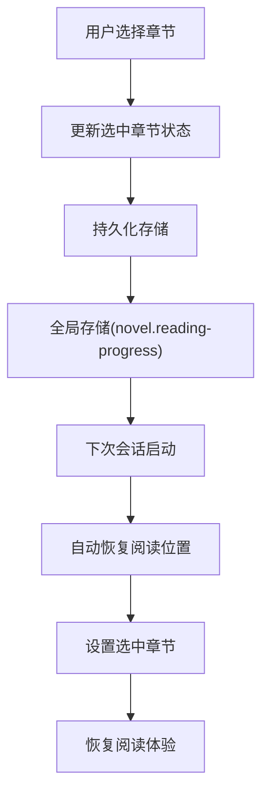

**图表来源** 
- [packages/app/src/pages/novel/workspace-frame.tsx:56-69](file://packages/app/src/pages/novel/workspace-frame.tsx#L56-69)

**章节来源**
- [packages/app/src/pages/novel/workspace-frame.tsx:56-69](file://packages/app/src/pages/novel/workspace-frame.tsx#L56-69)

### 后退导航系统
**改进功能**：重构了后退导航逻辑，提供更流畅的浏览体验。

- 历史记录管理：维护最多100条历史记录栈，防止内存溢出
- 智能去重：避免重复添加相同的路径条目
- 动作追踪：区分用户主动导航和程序化导航
- 边界处理：正确处理栈顶和栈底的边界情况

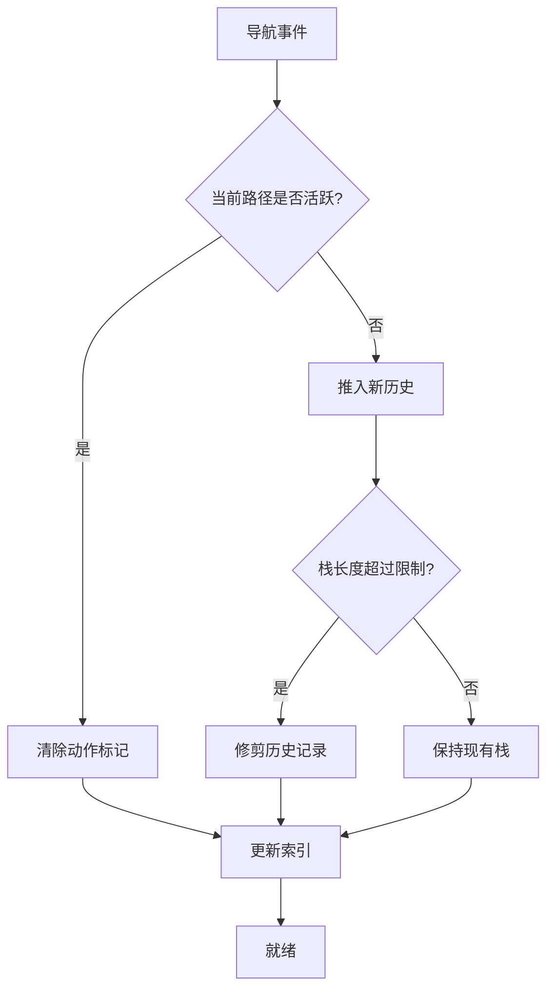

**图表来源** 
- [packages/app/src/components/titlebar-history.ts:11-41](file://packages/app/src/components/titlebar-history.ts#L11-41)

**章节来源**
- [packages/app/src/components/titlebar-history.ts:1-58](file://packages/app/src/components/titlebar-history.ts#L1-58)

### 目录与 SDK 上下文 DirectoryDataProvider
- 职责
  - 解析 URL 中的 base64 目录参数，校验有效性。
  - 注入 SDKProvider、LocalProvider，统一目录作用域。
  - 根据同步状态自动替换目录段，保持路由一致性。
  - 会话 ID 持久化 pin/unpin。
- 关键点
  - decodeDirectory 解码并校验 ProjectDirString。
  - createResource 拉取会话同步，失败静默处理。

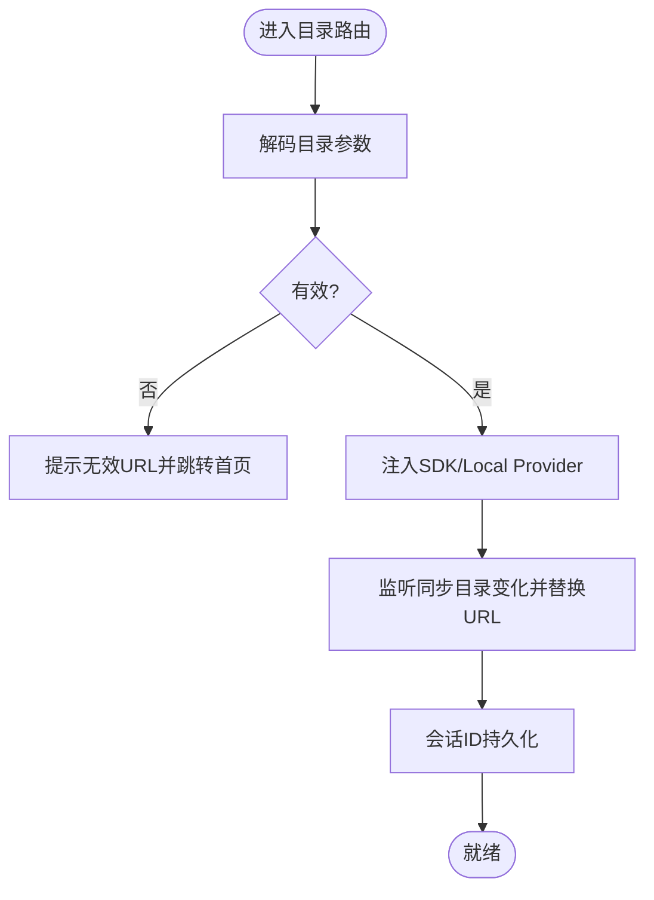

**图表来源** 
- [packages/app/src/pages/directory-layout.tsx:79-83](file://packages/app/src/pages/directory-layout.tsx#L79-83)
- [packages/app/src/pages/directory-layout.tsx:36-58](file://packages/app/src/pages/directory-layout.tsx#L36-58)

**章节来源**
- [packages/app/src/pages/directory-layout.tsx:16-74](file://packages/app/src/pages/directory-layout.tsx#L16-74)
- [packages/app/src/pages/directory-layout.tsx:85-122](file://packages/app/src/pages/directory-layout.tsx#L85-122)

### 小说上下文 NovelProvider
- 职责
  - 维护 novels 列表与 currentNovel 详情（含 styleGuide、stats）。
  - 提供 fetchNovels、setCurrentNovel、getNovelForSession 等方法。
  - 基于 ServerSDK 构造 OpenCode 客户端，携带鉴权头。
- 错误处理
  - try/catch 捕获异常，设置 error 消息，finally 重置 loading。

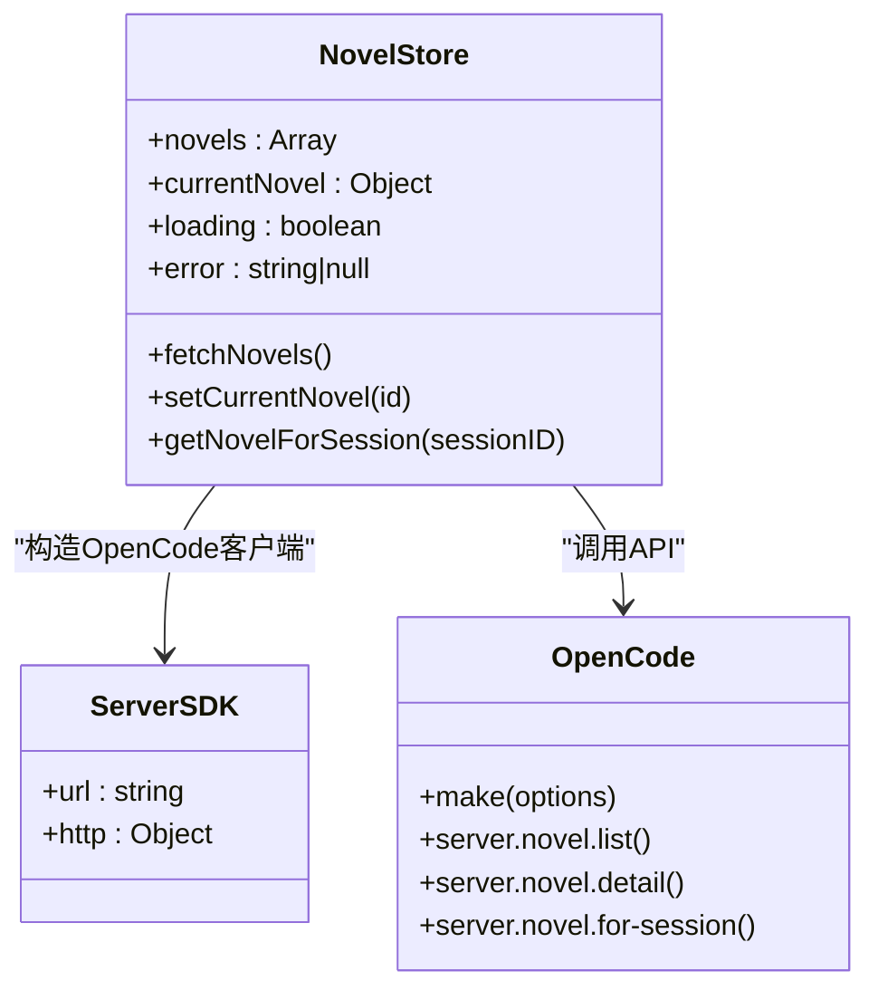

**图表来源** 
- [packages/app/src/context/novel.tsx:15-98](file://packages/app/src/context/novel.tsx#L15-98)

**章节来源**
- [packages/app/src/context/novel.tsx:15-98](file://packages/app/src/context/novel.tsx#L15-98)

### 文件管理与视图缓存
- 文件树模型 FileTreeV2Model
  - normalizeFileTreeV2Path 规范化路径（反斜杠转正斜杠、去首尾斜杠、压缩连续斜杠）。
  - buildFileTreeV2Model 将路径数组构建为 Map 节点集合，区分 file/directory。
- 文件上下文 file.tsx
  - load(input, options) 按目录作用域加载文件，避免重复请求（inflight 去重）。
  - setLoaded/setLoadError 更新状态并提示错误。
- 视图缓存 view-cache.ts
  - 持久化每个文件的 scrollTop、scrollLeft、selectedLines。
  - 超过阈值时执行 pruneView 清理旧条目。

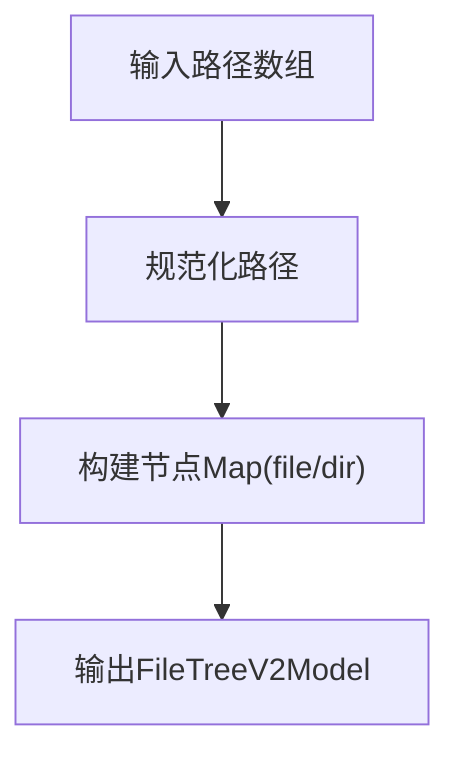

**图表来源** 
- [packages/app/src/components/file-tree-v2-model.ts:22-42](file://packages/app/src/components/file-tree-v2-model.ts#L22-42)

**章节来源**
- [packages/app/src/components/file-tree-v2-model.ts:22-42](file://packages/app/src/components/file-tree-v2-model.ts#L22-42)
- [packages/app/src/context/file.tsx:139-188](file://packages/app/src/context/file.tsx#L139-188)
- [packages/app/src/context/file/view-cache.ts:37-87](file://packages/app/src/context/file/view-cache.ts#L37-87)

### 滚动位置持久化
**新增功能**：实现了细粒度的滚动位置持久化，支持多个会话和标签页的独立滚动状态管理。

- 防抖机制：默认200ms防抖，避免频繁写入存储
- 增量更新：只保存变化的滚动位置，减少存储开销
- 快照恢复：支持从持久化快照恢复滚动状态
- 资源清理：组件卸载时自动清理定时器

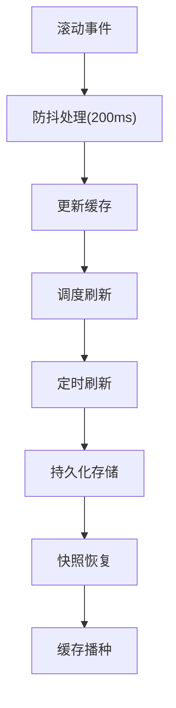

**图表来源** 
- [packages/app/src/context/layout-scroll.ts:16-91](file://packages/app/src/context/layout-scroll.ts#L16-91)

**章节来源**
- [packages/app/src/context/layout-scroll.ts:1-127](file://packages/app/src/context/layout-scroll.ts#L1-127)

### 章节编辑器与版本控制
- 编辑器特性
  - 自动保存：最后一次编辑后 2s 触发保存，不退出编辑器。
  - 字数目标指示：低于/接近/高于目标长度显示不同颜色。
  - 历史版本：预览与恢复指定版本，成功后提示。
  - 快捷键：Ctrl/Cmd+S 手动保存。
- 版本控制后端
  - rollbackChapter：创建新版本记录并回滚到前一版本。
  - restoreChapterVersion：恢复到指定 version，插入新归档记录。

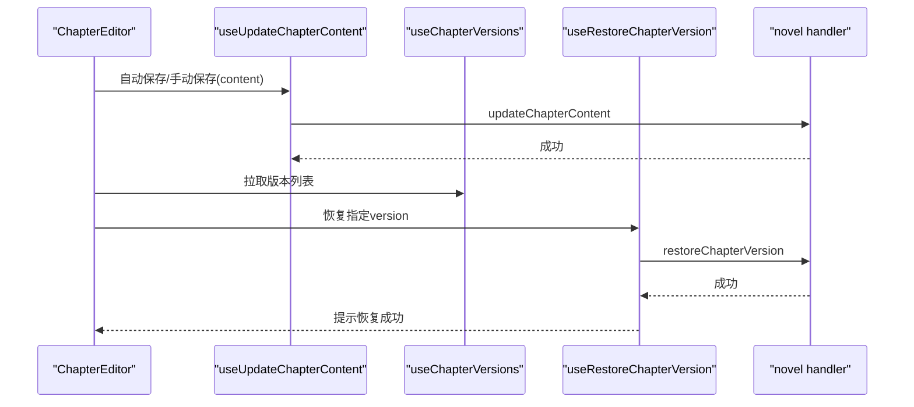

**图表来源** 
- [packages/app/src/pages/novel/chapter-editor.tsx:59-72](file://packages/app/src/pages/novel/chapter-editor.tsx#L59-72)
- [packages/app/src/pages/novel/chapter-editor.tsx:102-111](file://packages/app/src/pages/novel/chapter-editor.tsx#L102-111)
- [packages/server/src/handlers/novel.ts:522-569](file://packages/server/src/handlers/novel.ts#L522-569)
- [packages/server/src/handlers/novel.ts:800-840](file://packages/server/src/handlers/novel.ts#L800-840)

**章节来源**
- [packages/app/src/pages/novel/chapter-editor.tsx:29-124](file://packages/app/src/pages/novel/chapter-editor.tsx#L29-124)
- [packages/server/src/handlers/novel.ts:522-569](file://packages/server/src/handlers/novel.ts#L522-569)
- [packages/server/src/handlers/novel.ts:800-840](file://packages/server/src/handlers/novel.ts#L800-840)

### 工作区设置：主题、快捷键、语言与插件
- 主题切换：命令面板注册 theme.set.* 与 scheme.cycle，支持预览与提交。
- 快捷键：settings-keybinds 提供重置与覆盖机制。
- 语言：useLanguage 全局国际化。
- 插件：TUI 插件管理器 internal:plugin-manager 支持安装范围切换与状态展示。

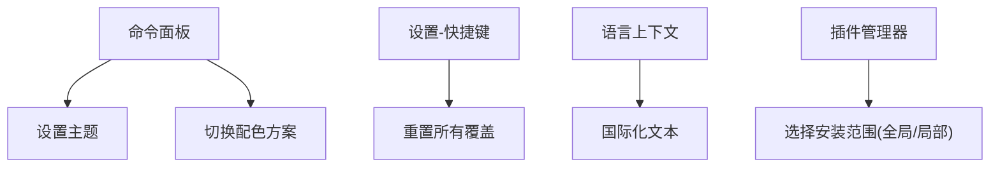

**图表来源** 
- [packages/app/src/pages/layout.tsx:1030-1063](file://packages/app/src/pages/layout.tsx#L1030-1063)
- [packages/app/src/components/settings-keybinds.tsx:478-490](file://packages/app/src/components/settings-keybinds.tsx#L478-490)
- [packages/tui/src/feature-plugins/system/plugins.tsx:1-45](file://packages/tui/src/feature-plugins/system/plugins.tsx#L1-L45)

**章节来源**
- [packages/app/src/pages/layout.tsx:1030-1063](file://packages/app/src/pages/layout.tsx#L1030-1063)
- [packages/app/src/components/settings-keybinds.tsx:478-490](file://packages/app/src/components/settings-keybinds.tsx#L478-490)
- [packages/tui/src/feature-plugins/system/plugins.tsx:1-45](file://packages/tui/src/feature-plugins/system/plugins.tsx#L1-L45)

### 多标签页、拖拽与撤销重做
- 多标签页：titlebar-tab-nav 与 titlebar-tab-gesture 提供关闭、拖拽、重命名限制等交互。
- 撤销重做：编辑器内通过本地状态与自动保存策略实现；版本控制由后端版本表保障可回滚。
- 数据备份恢复：通过导出 Markdown 与版本恢复接口实现。

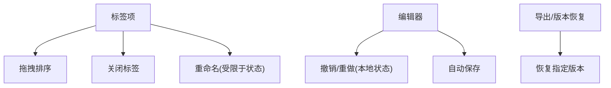

**图表来源** 
- [packages/app/src/components/titlebar-tab-nav.tsx:339-369](file://packages/app/src/components/titlebar-tab-nav.tsx#L339-369)
- [packages/app/src/components/titlebar-tab-gesture.ts:1-17](file://packages/app/src/components/titlebar-tab-gesture.ts#L1-L17)
- [packages/app/src/pages/novel/chapter-editor.tsx:59-72](file://packages/app/src/pages/novel/chapter-editor.tsx#L59-72)
- [packages/server/src/handlers/novel.ts:800-840](file://packages/server/src/handlers/novel.ts#L800-840)

**章节来源**
- [packages/app/src/components/titlebar-tab-nav.tsx:339-369](file://packages/app/src/components/titlebar-tab-nav.tsx#L339-369)
- [packages/app/src/components/titlebar-tab-gesture.ts:1-17](file://packages/app/src/components/titlebar-tab-gesture.ts#L1-L17)
- [packages/app/src/pages/novel/chapter-editor.tsx:59-72](file://packages/app/src/pages/novel/chapter-editor.tsx#L59-72)
- [packages/server/src/handlers/novel.ts:800-840](file://packages/server/src/handlers/novel.ts#L800-840)

### 协作功能：权限、实时同步、评论与冲突解决
- 权限管理：Agent 配置支持细粒度权限（read/edit/bash）与作用域资源，合并多个文档配置形成最终策略。
- 实时同步：DirectoryDataProvider 监听同步目录变化并替换 URL；Session 同步通过 createResource 拉取。
- 评论系统：审批流（ApprovalBar）与活动状态（useNovelActivity）提供结构化审核与反馈入口。
- 冲突解决：版本控制与恢复接口确保多人协作时的内容一致性。

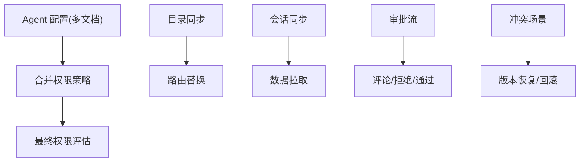

**图表来源** 
- [packages/core/test/config/agent.test.ts:59-136](file://packages/core/test/config/agent.test.ts#L59-136)
- [specs/v2/config.md:212-290](file://specs/v2/config.md#L212-290)
- [packages/app/src/pages/directory-layout.tsx:36-58](file://packages/app/src/pages/directory-layout.tsx#L36-58)

**章节来源**
- [packages/core/test/config/agent.test.ts:59-136](file://packages/core/test/config/agent.test.ts#L59-136)
- [specs/v2/config.md:212-290](file://specs/v2/config.md#L212-290)
- [packages/app/src/pages/directory-layout.tsx:36-58](file://packages/app/src/pages/directory-layout.tsx#L36-58)

### 查询性能优化
**新增功能**：实现了全面的查询性能优化，包括缓存策略、并发控制和智能失效。

- TanStack Query 集成：使用专业的数据获取和缓存解决方案
- 智能缓存：基于查询键的细粒度缓存，避免重复请求
- 并发控制：同一查询的并发请求合并，减少网络负载
- 自动失效：数据变更时自动失效相关缓存
- 事务安全：在事务中跳过缓存，保证数据一致性

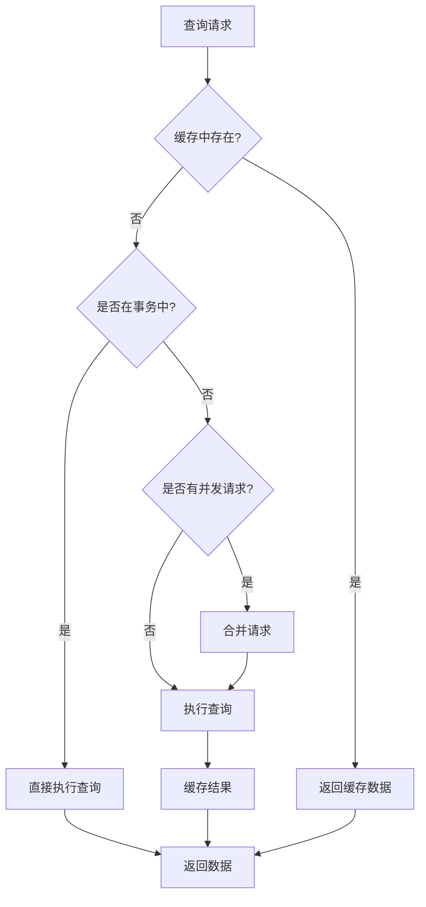

**图表来源** 
- [packages/effect-drizzle-sqlite/src/sqlite-core/effect/session.ts:235-270](file://packages/effect-drizzle-sqlite/src/sqlite-core/effect/session.ts#L235-270)

**章节来源**
- [packages/app/src/context/novel-queries.ts:1-800](file://packages/app/src/context/novel-queries.ts#L1-800)
- [packages/effect-drizzle-sqlite/src/sqlite-core/effect/session.ts:235-270](file://packages/effect-drizzle-sqlite/src/sqlite-core/effect/session.ts#L235-270)

### 工作区数据聚合
**新增功能**：统一的查询数据聚合器，简化组件中的数据获取逻辑。

- 数据聚合：将多个相关的查询结果聚合为一个状态对象
- 加载状态：统一的加载状态管理，支持组合多个查询的加载状态
- 错误处理：集中化的错误处理，提供清晰的错误信息
- 响应式更新：基于 SolidJS 的响应式更新机制

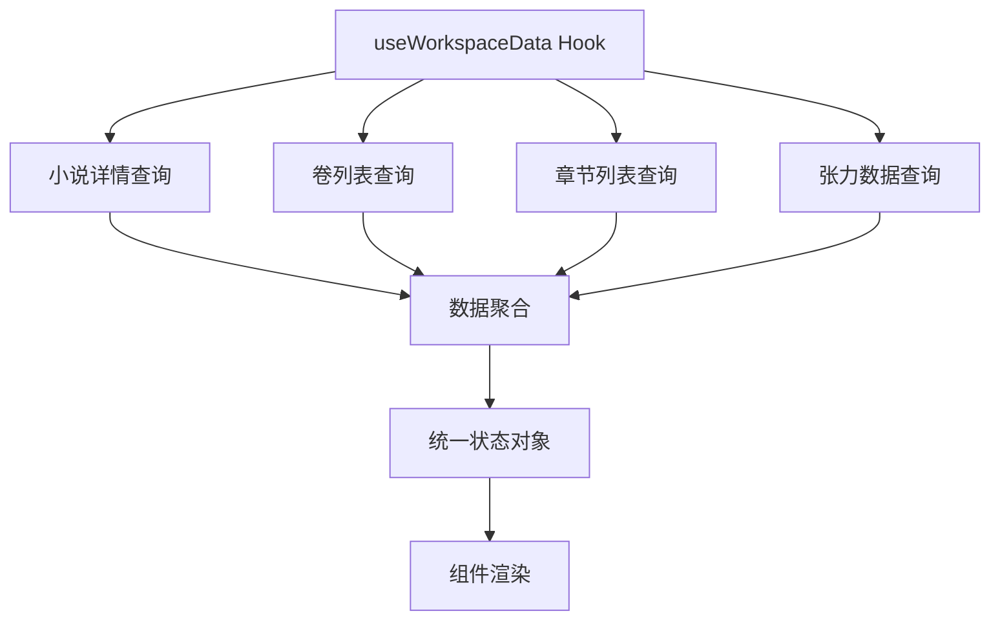

**图表来源** 
- [packages/app/src/pages/novel/workspace-data.ts:19-66](file://packages/app/src/pages/novel/workspace-data.ts#L19-66)

**章节来源**
- [packages/app/src/pages/novel/workspace-data.ts:1-66](file://packages/app/src/pages/novel/workspace-data.ts#L1-66)

## 依赖关系分析
- 前端依赖
  - SolidJS Router、@solidjs/start、TailwindCSS、Opencode UI v2 组件。
  - 自定义 Context（novel、file、sync、language）管理状态与副作用。
- 后端依赖
  - Effect 编排数据库操作，Drizzle ORM 访问 SQLite。
  - Hono/OpenAPI 暴露 API。
- 包管理
  - Bun monorepo 与 catalog 统一依赖版本，Turbo 加速构建。

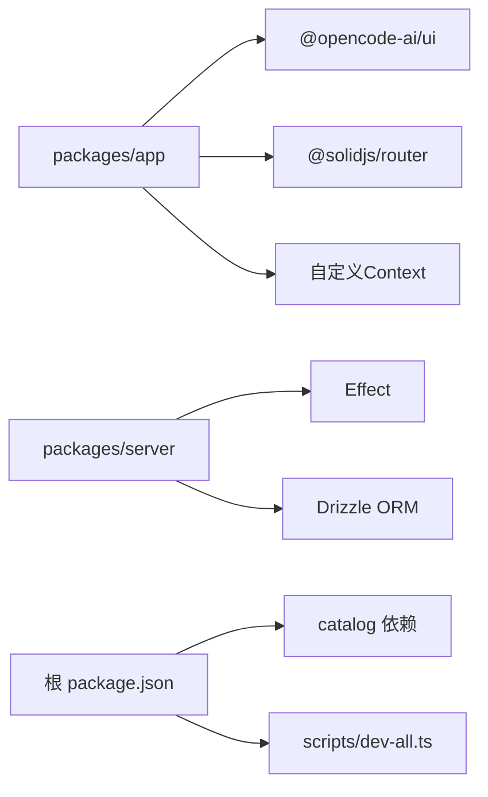

**图表来源** 
- [package.json:26-96](file://package.json#L26-96)
- [README.md:60-69](file://README.md#L60-69)

**章节来源**
- [package.json:26-96](file://package.json#L26-96)
- [README.md:60-69](file://README.md#L60-69)

## 性能考量
- 文件加载
  - 并发去重（inflight）避免重复请求。
  - 视图缓存限制最大条目数，定期修剪。
- 渲染优化
  - SolidJS 响应式 store/memo 减少不必要重渲染。
  - 虚拟列表（TanStack Virtual）用于长列表场景。
- 网络与存储
  - 后端 Effect 串行化数据库操作，降低锁竞争。
  - 导出为 Markdown 大文件时注意 Blob URL 生命周期管理。
- **新增优化**
  - 查询缓存：TanStack Query 提供智能缓存和失效策略
  - 滚动持久化：防抖机制减少存储写入频率
  - 历史记录管理：限制历史记录长度，防止内存泄漏

[本节为通用指导，无需特定文件引用]

## 故障排查指南
- 目录参数无效
  - 现象：跳转到首页并提示无效 URL。
  - 排查：检查 decodeDirectory 解码结果与 ProjectDirString 校验。
- 文件加载失败
  - 现象：toast 提示加载失败。
  - 排查：确认 file.read 路径与作用域是否正确，查看 inflight 去重逻辑。
- 版本回滚失败
  - 现象：抛出 ChapterNotFoundError。
  - 排查：确认存在版本历史，检查 rollback/restore 接口入参。
- 会话取消失败
  - 现象：取消生成无响应。
  - 排查：确认 findBoundNovelSession 找到绑定会话，检查 abort 调用。
- **新增问题**
  - 阅读位置未恢复：检查 persisted 钩子的初始化状态和存储键名
  - 导航历史异常：验证 applyPath 函数的边界处理和动作标记
  - 查询性能问题：检查缓存策略配置和并发控制逻辑

**章节来源**
- [packages/app/src/pages/directory-layout.tsx:96-111](file://packages/app/src/pages/directory-layout.tsx#L96-111)
- [packages/app/src/context/file.tsx:151-165](file://packages/app/src/context/file.tsx#L151-165)
- [packages/server/src/handlers/novel.ts:522-569](file://packages/server/src/handlers/novel.ts#L522-569)
- [packages/app/src/pages/novel/workspace-frame.tsx:78-90](file://packages/app/src/pages/novel/workspace-frame.tsx#L78-90)

## 结论
openNovel 的工作空间界面以清晰的模块划分与稳健的状态管理为基础，结合后端版本控制与权限策略，提供了完整的小说创作与协作体验。通过主题、快捷键、语言与插件的个性化设置，以及多标签、拖拽、撤销重做与备份恢复等功能，显著提升了用户体验。

**最新改进**：新增的阅读位置持久化功能让用户能够无缝恢复阅读进度，改进的后退导航系统提供了更流畅的浏览体验，优化的查询性能确保了大规模数据下的响应速度，增强的书架集成为用户创造了更好的整体体验。建议在生产环境中进一步优化缓存策略与网络重试机制，提升大规模协作下的稳定性与性能。

[本节为总结，无需特定文件引用]

## 附录
- 截图参考
  - 书架与工作区、阅读器与审批界面见 README 截图部分。
- 快速启动
  - 使用 bun run dev:all 同时启动后端与前端，浏览器访问端口 4444。

**章节来源**
- [README.md:13-33](file://README.md#L13-33)
- [README.md:34-58](file://README.md#L34-58)