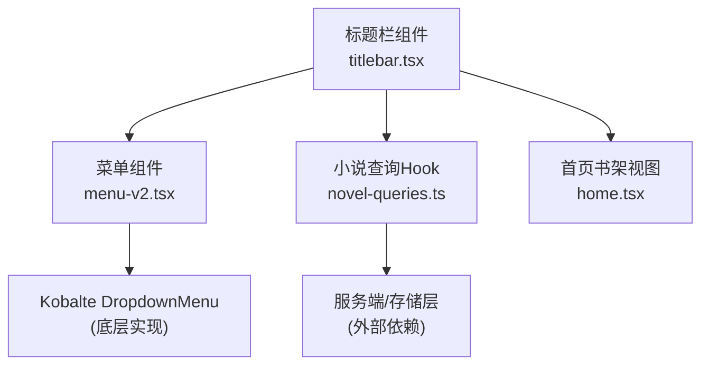
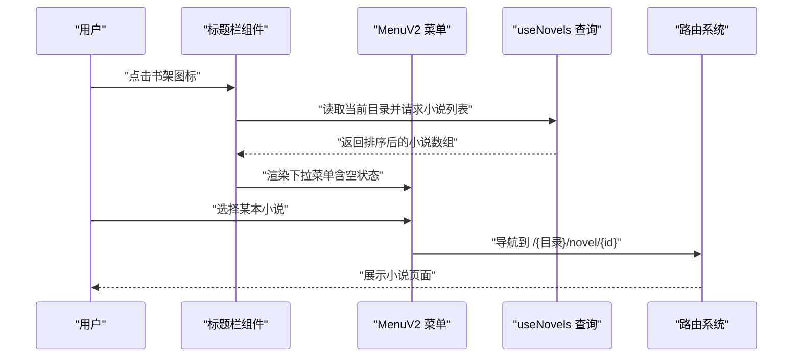
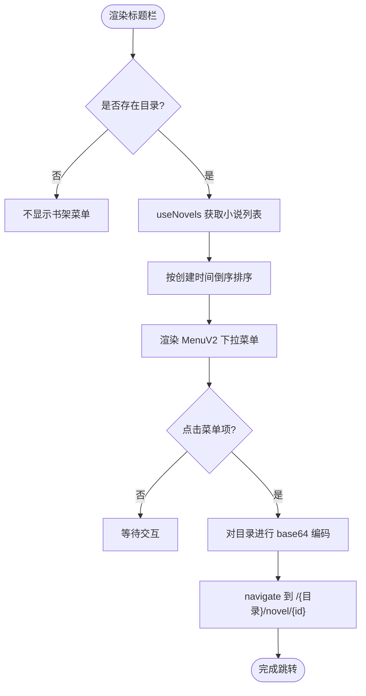
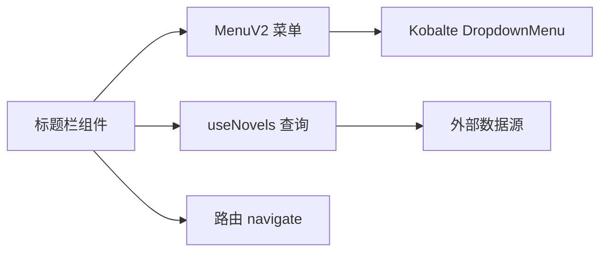

# 标题栏书架菜单

<cite>
**本文引用的文件**   
- [packages/app/src/components/titlebar.tsx](file://packages/app/src/components/titlebar.tsx)
- [packages/ui/src/v2/components/menu-v2.tsx](file://packages/ui/src/v2/components/menu-v2.tsx)
- [packages/app/src/pages/home.tsx](file://packages/app/src/pages/home.tsx)
- [packages/app/src/context/novel-queries.ts](file://packages/app/src/context/novel-queries.ts)
</cite>

## 目录
1. [简介](#简介)
2. [项目结构](#项目结构)
3. [核心组件](#核心组件)
4. [架构总览](#架构总览)
5. [详细组件分析](#详细组件分析)
6. [依赖关系分析](#依赖关系分析)
7. [性能考虑](#性能考虑)
8. [故障排查指南](#故障排查指南)
9. [结论](#结论)

## 简介
本文件聚焦“标题栏书架菜单”的实现与使用，说明其在应用标题栏中的位置、触发方式、数据来源、渲染逻辑以及与路由跳转的交互。该功能通过标题栏按钮打开下拉菜单，展示当前项目目录下的小说列表，点击条目后直接跳转到对应小说页面，便于用户快速从标题栏进入阅读或编辑场景。

## 项目结构
- 标题栏主组件负责在 v2 布局下渲染书架入口按钮与下拉菜单内容。
- 菜单 UI 基于统一的 MenuV2 组件封装，提供一致的交互与样式。
- 数据层通过 useNovels 查询当前目录的小说集合，并按创建时间倒序排列。
- 首页 home.tsx 展示了书架的整体视图与筛选排序能力，标题栏书架菜单复用同一数据源以保持一致性。

图表来源
- [packages/app/src/components/titlebar.tsx](file://packages/app/src/components/titlebar.tsx)
- [packages/ui/src/v2/components/menu-v2.tsx](file://packages/ui/src/v2/components/menu-v2.tsx)
- [packages/app/src/context/novel-queries.ts](file://packages/app/src/context/novel-queries.ts)
- [packages/app/src/pages/home.tsx](file://packages/app/src/pages/home.tsx)

章节来源
- [packages/app/src/components/titlebar.tsx](file://packages/app/src/components/titlebar.tsx)
- [packages/ui/src/v2/components/menu-v2.tsx](file://packages/ui/src/v2/components/menu-v2.tsx)
- [packages/app/src/pages/home.tsx](file://packages/app/src/pages/home.tsx)
- [packages/app/src/context/novel-queries.ts](file://packages/app/src/context/novel-queries.ts)

## 核心组件
- 标题栏书架入口：在 v2 标题栏中显示一个图标按钮，用于打开书架菜单。
- 书架下拉菜单：使用 MenuV2 组件渲染，包含空状态提示与小说条目列表。
- 数据查询 Hook：useNovels 根据目录参数获取小说列表，并在标题栏中进行排序。
- 路由跳转：点击菜单项后，将当前目录进行编码并导航到小说详情页。

章节来源
- [packages/app/src/components/titlebar.tsx](file://packages/app/src/components/titlebar.tsx)
- [packages/ui/src/v2/components/menu-v2.tsx](file://packages/ui/src/v2/components/menu-v2.tsx)
- [packages/app/src/context/novel-queries.ts](file://packages/app/src/context/novel-queries.ts)

## 架构总览
标题栏书架菜单的数据流与交互流程如下：

图表来源
- [packages/app/src/components/titlebar.tsx](file://packages/app/src/components/titlebar.tsx)
- [packages/ui/src/v2/components/menu-v2.tsx](file://packages/ui/src/v2/components/menu-v2.tsx)
- [packages/app/src/context/novel-queries.ts](file://packages/app/src/context/novel-queries.ts)

## 详细组件分析

### 标题栏书架菜单（titlebar.tsx）
- 入口按钮：v2 标题栏中使用图标按钮作为触发器，设置无障碍标签为书架标题。
- 数据准备：通过 useNovels 获取当前目录的小说列表，并按 createdAt 倒序排列。
- 菜单渲染：使用 MenuV2 的 Trigger、Portal、Content、Item 组合，空数据时显示空状态文本。
- 路由跳转：点击菜单项后，将目录进行 base64 编码并拼接路径，调用 navigate 跳转至小说页。
- 条件显示：仅当存在 novelDirectory 时才渲染书架菜单，避免无项目时的无效入口。

图表来源
- [packages/app/src/components/titlebar.tsx](file://packages/app/src/components/titlebar.tsx)

章节来源
- [packages/app/src/components/titlebar.tsx](file://packages/app/src/components/titlebar.tsx)

### 菜单组件（menu-v2.tsx）
- 组件职责：封装 Kobalte 的下拉菜单能力，提供 Item、CheckboxItem、RadioItem、SubTrigger、Separator、GroupLabel 等子组件。
- 交互特性：支持快捷键、徽章、后缀元素，统一 slot 标记便于样式与测试定位。
- 上下文菜单：同时暴露 Context 相关组件，可用于右键菜单等场景。

章节来源
- [packages/ui/src/v2/components/menu-v2.tsx](file://packages/ui/src/v2/components/menu-v2.tsx)

### 小说查询（novel-queries.ts）
- 作用：根据目录参数发起查询，返回小说列表数据。
- 使用场景：标题栏书架菜单与首页书架视图均使用该 Hook，保证数据一致性。
- 排序策略：标题栏内对结果进行倒序排序，优先展示最新创建的小说。

章节来源
- [packages/app/src/context/novel-queries.ts](file://packages/app/src/context/novel-queries.ts)

### 首页书架视图（home.tsx）
- 功能对比：首页提供完整的书架界面，包括搜索、分类筛选、排序切换、删除确认等。
- 数据一致性：与标题栏书架菜单共用 useNovels，确保列表内容与排序一致。
- 导航入口：首页也支持直接跳转到新建向导或具体小说页面。

章节来源
- [packages/app/src/pages/home.tsx](file://packages/app/src/pages/home.tsx)

## 依赖关系分析
- 标题栏组件依赖：
  - MenuV2：用于渲染下拉菜单。
  - useNovels：用于获取小说数据。
  - 路由工具：navigate 用于页面跳转。
  - 平台与主题：用于适配不同操作系统与主题样式。
- 菜单组件依赖：
  - Kobalte DropdownMenu：底层菜单能力。
  - SolidJS 响应式：用于状态管理与渲染。
- 数据层依赖：
  - 外部服务或存储：由 useNovels 内部实现决定，标题栏仅消费其返回值。

图表来源
- [packages/app/src/components/titlebar.tsx](file://packages/app/src/components/titlebar.tsx)
- [packages/ui/src/v2/components/menu-v2.tsx](file://packages/ui/src/v2/components/menu-v2.tsx)
- [packages/app/src/context/novel-queries.ts](file://packages/app/src/context/novel-queries.ts)

章节来源
- [packages/app/src/components/titlebar.tsx](file://packages/app/src/components/titlebar.tsx)
- [packages/ui/src/v2/components/menu-v2.tsx](file://packages/ui/src/v2/components/menu-v2.tsx)
- [packages/app/src/context/novel-queries.ts](file://packages/app/src/context/novel-queries.ts)

## 性能考虑
- 数据缓存：useNovels 应合理使用缓存与失效策略，避免重复请求。
- 排序开销：标题栏内对列表进行排序，若数据量较大可考虑在服务端排序或增加分页。
- 渲染优化：菜单仅在存在目录时渲染，减少不必要的 DOM 节点。
- 事件处理：点击菜单项的路由跳转应避免重复触发，必要时添加防抖或去重逻辑。

## 故障排查指南
- 菜单不显示：
  - 检查是否提供了有效的目录参数。
  - 确认 useNovels 返回的数据是否为空。
- 点击无效：
  - 验证 navigate 调用是否正确传入编码后的目录与小说 ID。
  - 检查路由配置是否匹配目标路径。
- 空状态异常：
  - 确认语言包中书架空状态的文案是否正确加载。
- 排序不符合预期：
  - 检查 createdAt 字段是否存在且数值有效。
  - 确认排序逻辑是否在标题栏内正确执行。

章节来源
- [packages/app/src/components/titlebar.tsx](file://packages/app/src/components/titlebar.tsx)
- [packages/ui/src/v2/components/menu-v2.tsx](file://packages/ui/src/v2/components/menu-v2.tsx)
- [packages/app/src/context/novel-queries.ts](file://packages/app/src/context/novel-queries.ts)

## 结论
标题栏书架菜单以简洁的方式将书架入口嵌入到标题栏，通过统一的菜单组件与数据查询 Hook，实现了与首页书架视图一致的数据体验。其设计注重易用性与性能，适合快速访问常用小说。未来可考虑扩展更多操作（如收藏、分享）与更丰富的过滤选项，以提升用户体验。