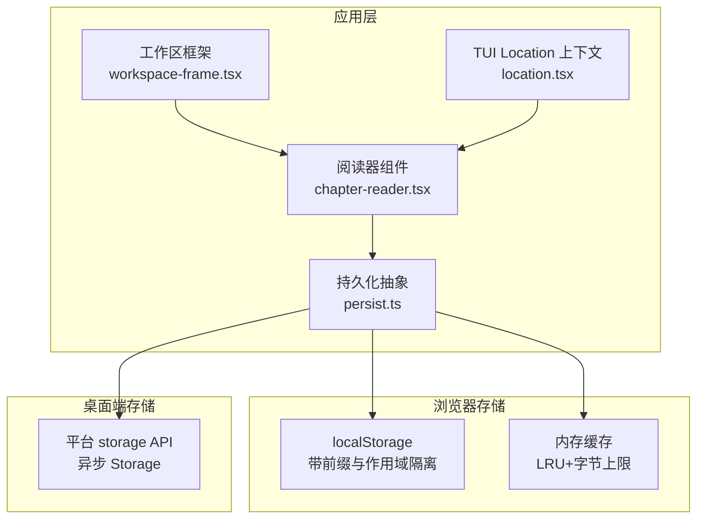
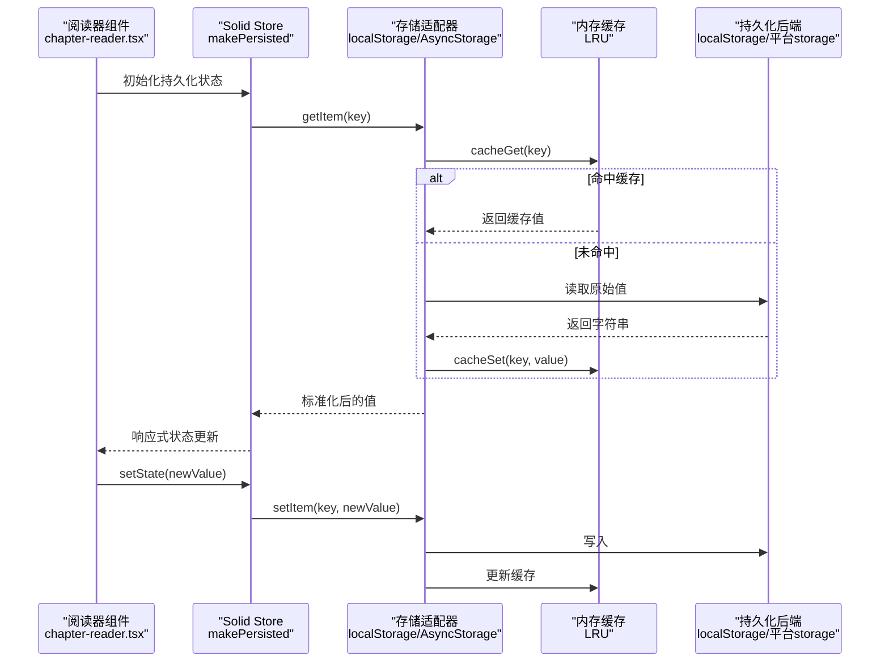
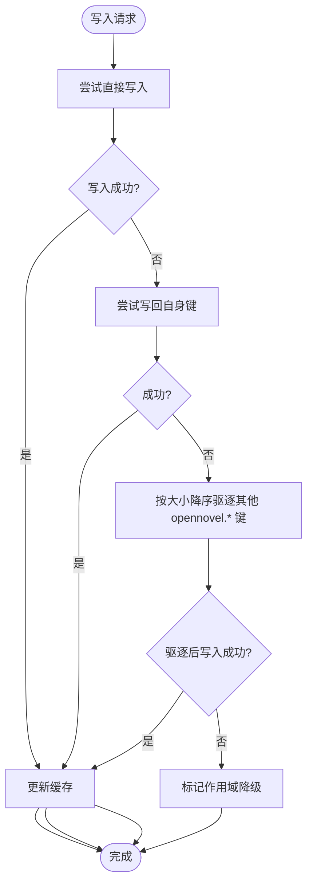
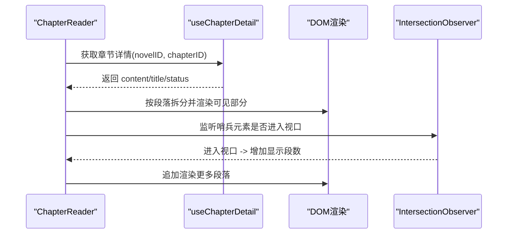
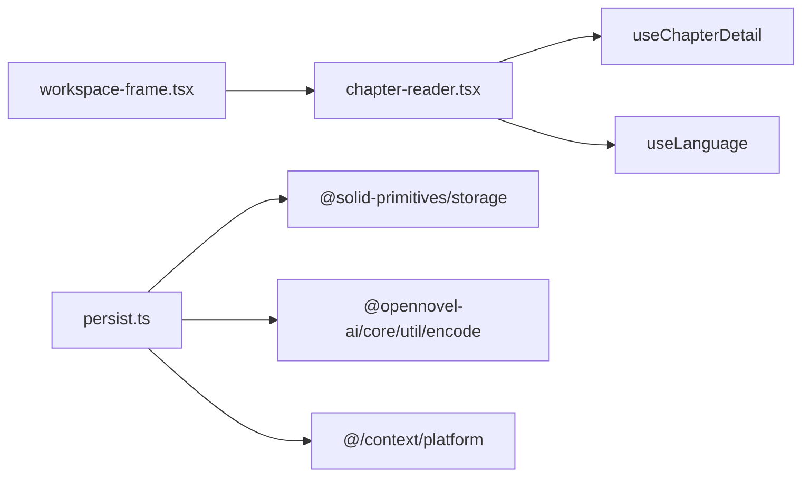

# 阅读位置持久化

<cite>
**本文引用的文件**   
- [packages/app/src/utils/persist.ts](file://packages/app/src/utils/persist.ts)
- [packages/app/src/utils/persist.test.ts](file://packages/app/src/utils/persist.test.ts)
- [packages/app/src/pages/novel/chapter-reader.tsx](file://packages/app/src/pages/novel/chapter-reader.tsx)
- [packages/app/src/pages/novel/workspace-frame.tsx](file://packages/app/src/pages/novel/workspace-frame.tsx)
- [packages/tui/src/context/location.tsx](file://packages/tui/src/context/location.tsx)
- [packages/opennovel/src/server/routes/instance/httpapi/novel-reader.html](file://packages/opennovel/src/server/routes/instance/httpapi/novel-reader.html)
</cite>

## 目录
1. [简介](#简介)
2. [项目结构](#项目结构)
3. [核心组件](#核心组件)
4. [架构总览](#架构总览)
5. [详细组件分析](#详细组件分析)
6. [依赖关系分析](#依赖关系分析)
7. [性能考量](#性能考量)
8. [故障排查指南](#故障排查指南)
9. [结论](#结论)
10. [附录](#附录)

## 简介
本文件围绕“阅读位置持久化”能力，系统性梳理代码库中的存储抽象、读写流程、迁移与容错机制，并结合阅读器组件的滚动与分页逻辑，给出端到端的实现说明与优化建议。重点覆盖：
- 统一的持久化目标定义与选择（全局、窗口、工作区、会话、草稿等）
- localStorage 的缓存、配额超限与降级策略
- 跨平台（Web/Desktop）异步存储适配
- 旧数据迁移与键名规范化
- 阅读器组件的滚动位置与章节切换交互

## 项目结构
与“阅读位置持久化”直接相关的模块主要位于应用层 utils 与页面组件中：
- 持久化抽象与实现：packages/app/src/utils/persist.ts
- 持久化测试用例：packages/app/src/utils/persist.test.ts
- 阅读器组件（章节阅读、懒加载、滚动）：packages/app/src/pages/novel/chapter-reader.tsx
- 工作区框架（阅读器容器）：packages/app/src/pages/novel/workspace-frame.tsx
- TUI 上下文（LocationRef 提供）：packages/tui/src/context/location.tsx
- 服务端简易阅读器（历史实现，非主路径）：packages/opennovel/src/server/routes/instance/httpapi/novel-reader.html

图表来源 
- [packages/app/src/utils/persist.ts:1-662](file://packages/app/src/utils/persist.ts#L1-L662)
- [packages/app/src/pages/novel/chapter-reader.tsx:1-216](file://packages/app/src/pages/novel/chapter-reader.tsx#L1-L216)
- [packages/app/src/pages/novel/workspace-frame.tsx:455-502](file://packages/app/src/pages/novel/workspace-frame.tsx#L455-L502)
- [packages/tui/src/context/location.tsx:1-15](file://packages/tui/src/context/location.tsx#L1-L15)

章节来源
- [packages/app/src/utils/persist.ts:1-662](file://packages/app/src/utils/persist.ts#L1-L662)
- [packages/app/src/pages/novel/chapter-reader.tsx:1-216](file://packages/app/src/pages/novel/chapter-reader.tsx#L1-L216)
- [packages/app/src/pages/novel/workspace-frame.tsx:455-502](file://packages/app/src/pages/novel/workspace-frame.tsx#L455-L502)
- [packages/tui/src/context/location.tsx:1-15](file://packages/tui/src/context/location.tsx#L1-L15)

## 核心组件
- 持久化目标与工厂
  - 支持全局、窗口、工作区、会话、草稿、服务器作用域等多种目标类型，统一通过 Persist.* 方法生成配置对象。
  - 针对桌面端与 Web 端分别选择同步或异步存储适配器。
- 存储适配器与容错
  - 为 localStorage 封装前缀与作用域隔离，内置内存缓存与 LRU 清理。
  - 写入失败时触发“写回重试 + 驱逐旧项”的配额恢复策略；异常作用域自动降级，避免污染其他作用域。
- 数据迁移与规范化
  - 读取时进行 JSON 解析、校验、合并默认值与可选迁移函数处理，确保数据结构演进兼容。
  - 支持从旧存储键迁移到当前命名空间，并清理旧键。
- 删除与清理
  - removePersisted 可一次性清理当前与历史存储键，保证数据一致性。

章节来源
- [packages/app/src/utils/persist.ts:17-24](file://packages/app/src/utils/persist.ts#L17-L24)
- [packages/app/src/utils/persist.ts:26-37](file://packages/app/src/utils/persist.ts#L26-L37)
- [packages/app/src/utils/persist.ts:379-464](file://packages/app/src/utils/persist.ts#L379-L464)
- [packages/app/src/utils/persist.ts:466-516](file://packages/app/src/utils/persist.ts#L466-L516)
- [packages/app/src/utils/persist.ts:528-551](file://packages/app/src/utils/persist.ts#L528-L551)
- [packages/app/src/utils/persist.ts:553-662](file://packages/app/src/utils/persist.ts#L553-L662)

## 架构总览
下图展示“阅读位置持久化”的整体调用链：阅读器组件通过持久化工具将状态绑定到合适的存储后端，并在不同平台下使用同步或异步适配器。

图表来源 
- [packages/app/src/utils/persist.ts:379-464](file://packages/app/src/utils/persist.ts#L379-L464)
- [packages/app/src/utils/persist.ts:553-662](file://packages/app/src/utils/persist.ts#L553-L662)
- [packages/app/src/pages/novel/chapter-reader.tsx:1-216](file://packages/app/src/pages/novel/chapter-reader.tsx#L1-L216)

## 详细组件分析

### 持久化子系统（persist.ts）
- 关键职责
  - 定义持久化目标（全局、窗口、工作区、会话、草稿、服务器作用域）。
  - 选择合适存储适配器（Web 同步 localStorage，桌面异步 platform.storage）。
  - 提供缓存、配额恢复、降级、迁移与清理能力。
- 重要实现要点
  - 前缀与作用域隔离：localStorageWithPrefix 以 “prefix:key” 形式隔离不同作用域。
  - 内存缓存：cache 维护最多 500 项、8MB 的 LRU 缓存，减少重复 I/O。
  - 配额恢复：write 先尝试直接写入，失败后尝试写回自身，再失败则按大小降序驱逐其他 opennovel.* 键，直至成功。
  - 降级开关：fallback 记录作用域级禁用标志，避免持续抛错影响整体体验。
  - 数据规范化：normalize 负责 JSON 解析、迁移函数执行、与默认值合并，并回写规范化结果。
  - 迁移路径：migrateLegacy/migrateLegacyAsync 支持从多个旧存储键迁移至新命名空间，并清理旧键。
  - 删除接口：removePersisted 支持同时清理当前与历史存储键。

图表来源 
- [packages/app/src/utils/persist.ts:143-164](file://packages/app/src/utils/persist.ts#L143-L164)
- [packages/app/src/utils/persist.ts:111-141](file://packages/app/src/utils/persist.ts#L111-L141)
- [packages/app/src/utils/persist.ts:78-107](file://packages/app/src/utils/persist.ts#L78-L107)

章节来源
- [packages/app/src/utils/persist.ts:32-68](file://packages/app/src/utils/persist.ts#L32-L68)
- [packages/app/src/utils/persist.ts:111-164](file://packages/app/src/utils/persist.ts#L111-L164)
- [packages/app/src/utils/persist.ts:208-231](file://packages/app/src/utils/persist.ts#L208-L231)
- [packages/app/src/utils/persist.ts:233-273](file://packages/app/src/utils/persist.ts#L233-L273)
- [packages/app/src/utils/persist.ts:275-338](file://packages/app/src/utils/persist.ts#L275-L338)
- [packages/app/src/utils/persist.ts:379-464](file://packages/app/src/utils/persist.ts#L379-L464)
- [packages/app/src/utils/persist.ts:528-551](file://packages/app/src/utils/persist.ts#L528-L551)
- [packages/app/src/utils/persist.ts:553-662](file://packages/app/src/utils/persist.ts#L553-L662)

### 阅读器组件（chapter-reader.tsx）
- 功能概述
  - 根据选中的章节 ID 拉取详情，按段落拆分渲染。
  - 长内容采用 IntersectionObserver 懒加载，分段显示以提升性能。
  - 提供上一章/下一章导航，便于用户翻页。
- 与持久化的关系
  - 该组件本身不直接读写持久化存储，但通常由上层工作区框架管理选中章节与滚动位置，并通过持久化工具将“当前章节ID、滚动偏移、显示段数”等状态持久化。
  - 当章节切换时重置懒加载计数，确保首次进入章节的正确体验。

图表来源 
- [packages/app/src/pages/novel/chapter-reader.tsx:67-119](file://packages/app/src/pages/novel/chapter-reader.tsx#L67-L119)

章节来源
- [packages/app/src/pages/novel/chapter-reader.tsx:48-119](file://packages/app/src/pages/novel/chapter-reader.tsx#L48-L119)
- [packages/app/src/pages/novel/chapter-reader.tsx:121-215](file://packages/app/src/pages/novel/chapter-reader.tsx#L121-L215)

### 工作区框架（workspace-frame.tsx）
- 角色定位
  - 作为阅读器的容器，管理标签页、左侧大纲、右侧编辑器/阅读器视图。
  - 在“阅读”模式下注入 ChapterReader，并传递 novelID、chapters、selectedChapterId 与 onSelectChapter。
- 与持久化的关系
  - 通常在此层结合持久化工具，将 selectedChapterId、滚动位置、布局设置等状态持久化，以便刷新或重启后恢复阅读进度。

章节来源
- [packages/app/src/pages/novel/workspace-frame.tsx:455-502](file://packages/app/src/pages/novel/workspace-frame.tsx#L455-L502)

### TUI Location 上下文（location.tsx）
- 角色定位
  - 提供 LocationRef 的访问器，供上层组件获取当前文档/工作区位置信息。
- 与持久化的关系
  - 阅读位置常与 location 关联（如目录、会话），用于构建持久化键（例如 workspace/session 作用域）。

章节来源
- [packages/tui/src/context/location.tsx:1-15](file://packages/tui/src/context/location.tsx#L1-L15)

### 服务端简易阅读器（novel-reader.html）
- 角色定位
  - 服务端提供的轻量 HTML 阅读器，包含章节导航与基础渲染。
- 与持久化的关系
  - 该实现为历史路径，未集成现代持久化机制；当前主路径以 React/Solid 应用为主。

章节来源
- [packages/opennovel/src/server/routes/instance/httpapi/novel-reader.html:1777-1812](file://packages/opennovel/src/server/routes/instance/httpapi/novel-reader.html#L1777-L1812)

## 依赖关系分析
- 组件耦合
  - chapter-reader.tsx 依赖查询与语言上下文，不直接依赖存储；持久化由上层组合。
  - persist.ts 依赖平台上下文与 Solid 存储原语，屏蔽底层差异。
- 外部依赖
  - @solid-primitives/storage 提供 makePersisted 与 Storage 类型。
  - core/util/encode 提供 checksum，用于生成稳定的存储键。
- 潜在循环依赖
  - 无直接循环；持久化工具仅被上层业务组件调用。

图表来源 
- [packages/app/src/pages/novel/chapter-reader.tsx:1-6](file://packages/app/src/pages/novel/chapter-reader.tsx#L1-L6)
- [packages/app/src/utils/persist.ts:1-7](file://packages/app/src/utils/persist.ts#L1-L7)

章节来源
- [packages/app/src/pages/novel/chapter-reader.tsx:1-6](file://packages/app/src/pages/novel/chapter-reader.tsx#L1-L6)
- [packages/app/src/utils/persist.ts:1-7](file://packages/app/src/utils/persist.ts#L1-L7)

## 性能考量
- 内存缓存
  - 限制条目数量与总字节数，避免无限增长；LRU 淘汰最久未用项。
- 配额恢复
  - 遇到 QuotaExceededError 时自动驱逐旧数据，保障写入成功率。
- 懒加载
  - 长章节按段落分批渲染，降低首屏压力与重排开销。
- 作用域隔离
  - 通过前缀与命名空间隔离不同作用域的数据，减少冲突与扫描成本。

[本节为通用指导，不直接分析具体文件]

## 故障排查指南
- 常见问题
  - 写入失败且无法恢复：检查是否触发配额错误，确认 evict 是否成功释放空间。
  - 作用域异常：查看 fallback 标志是否被设置，确认是否因特定作用域抛错导致降级。
  - 数据损坏：normalize 会拒绝非法 JSON，必要时清理损坏键并重试。
  - 迁移失败：核对 legacy 键列表与迁移函数，确保旧数据能正确迁移到新命名空间。
- 调试建议
  - 使用 PersistTesting 暴露的工具函数验证行为（如 localStorageWithPrefix、normalize、migrateLegacy）。
  - 通过 removePersisted 清理残留数据，重新初始化状态。

章节来源
- [packages/app/src/utils/persist.test.ts:77-108](file://packages/app/src/utils/persist.test.ts#L77-L108)
- [packages/app/src/utils/persist.test.ts:110-135](file://packages/app/src/utils/persist.test.ts#L110-L135)
- [packages/app/src/utils/persist.test.ts:137-167](file://packages/app/src/utils/persist.test.ts#L137-L167)
- [packages/app/src/utils/persist.test.ts:169-185](file://packages/app/src/utils/persist.test.ts#L169-L185)
- [packages/app/src/utils/persist.test.ts:187-211](file://packages/app/src/utils/persist.test.ts#L187-L211)

## 结论
“阅读位置持久化”通过统一的持久化抽象与健壮的存储适配器，实现了跨平台、多作用域、可迁移、可恢复的状态管理。配合阅读器组件的懒加载与滚动控制，提供了流畅的阅读体验。建议在业务层结合 Persist.* 目标工厂与 persisted 工具，将“当前章节、滚动偏移、显示段数、布局设置”等关键状态持久化，以确保用户中断后可无缝恢复。

[本节为总结性内容，不直接分析具体文件]

## 附录
- 最佳实践
  - 使用 Persist.workspace/Persist.session/Persist.draft 等工厂明确作用域与命名空间。
  - 对可能变更的结构体提供 migrate 函数，确保向后兼容。
  - 在关键路径上捕获存储异常，必要时提示用户清理缓存或重置设置。
  - 对超大内容启用懒加载与分页，避免阻塞主线程。

[本节为通用指导，不直接分析具体文件]