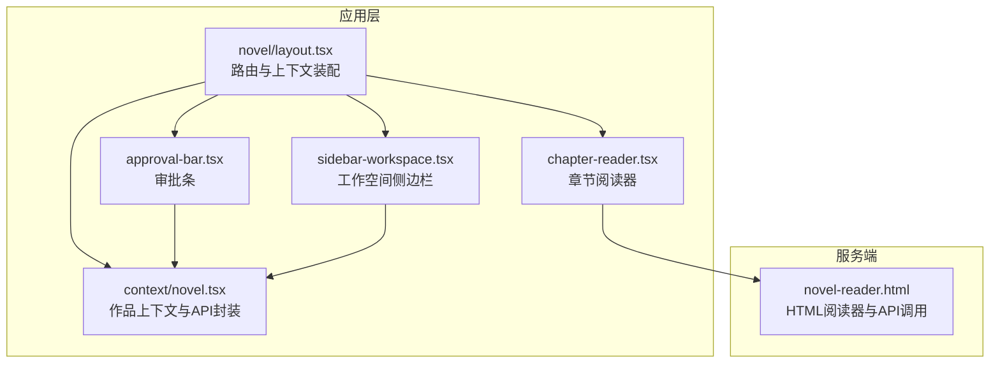
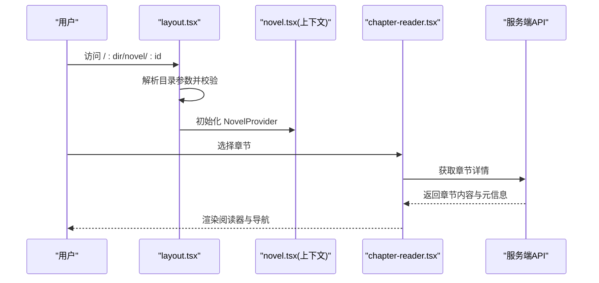
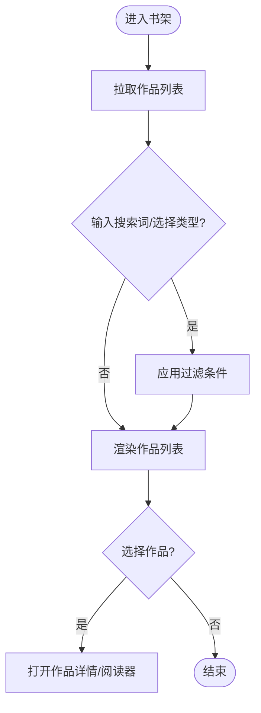
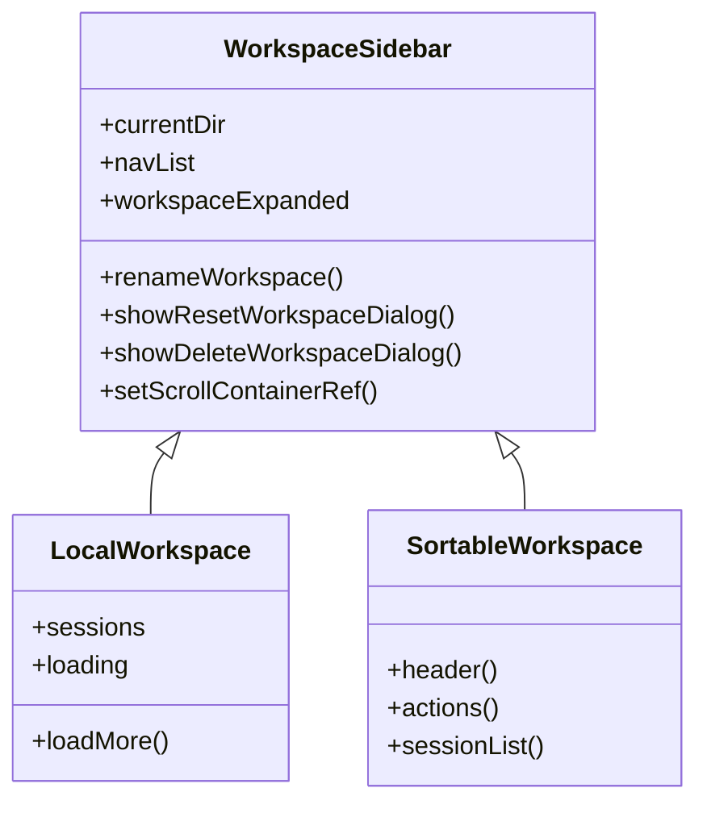
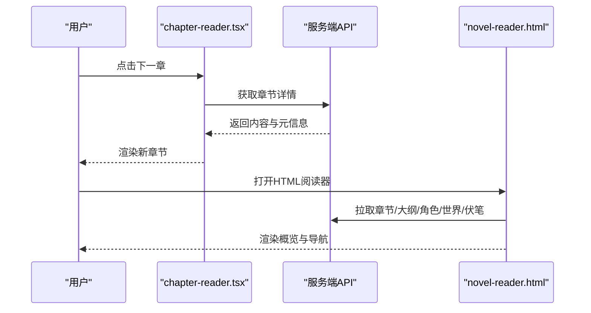
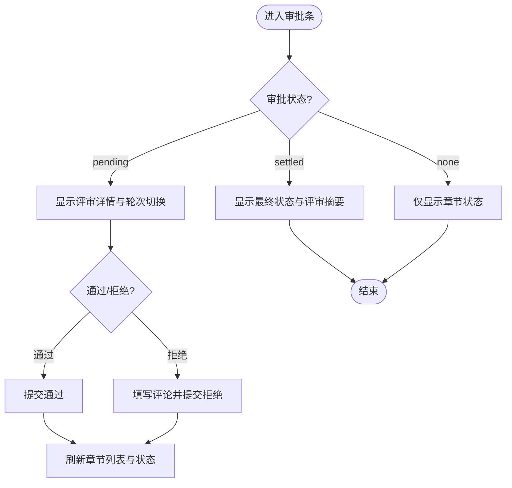
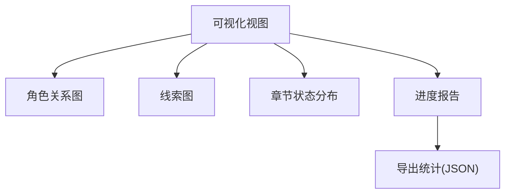
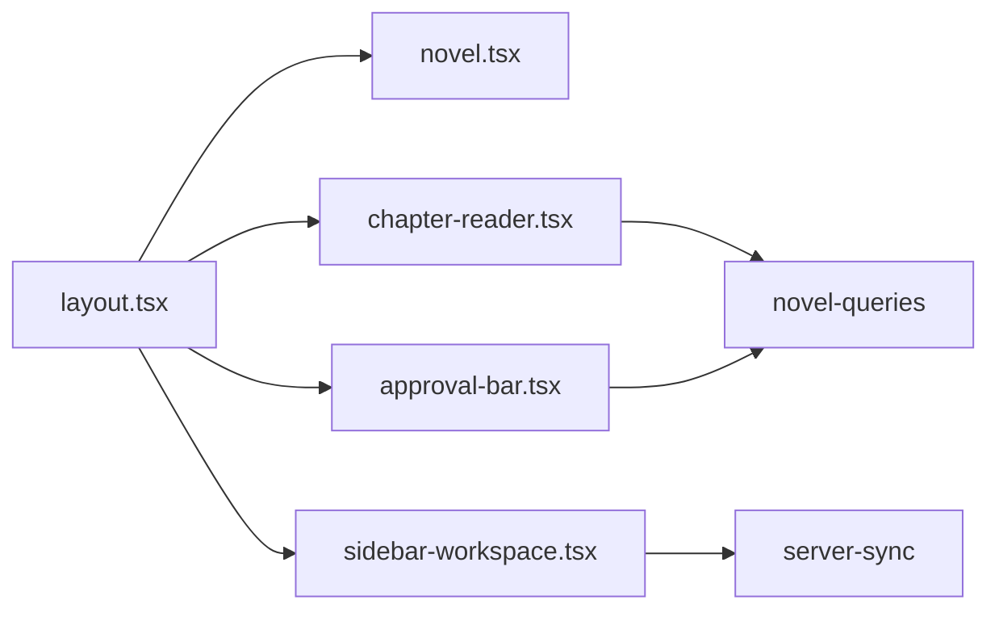

# 核心界面模块

<cite>
**本文引用的文件**   
- [packages/app/src/pages/novel/layout.tsx](file://packages/app/src/pages/novel/layout.tsx)
- [packages/app/src/pages/novel/chapter-reader.tsx](file://packages/app/src/pages/novel/chapter-reader.tsx)
- [packages/app/src/pages/novel/approval-bar.tsx](file://packages/app/src/pages/novel/approval-bar.tsx)
- [packages/app/src/pages/layout/sidebar-workspace.tsx](file://packages/app/src/pages/layout/sidebar-workspace.tsx)
- [packages/app/src/context/novel.tsx](file://packages/app/src/context/novel.tsx)
- [packages/opencode/src/server/routes/instance/httpapi/novel-reader.html](file://packages/opencode/src/server/routes/instance/httpapi/novel-reader.html)
- [packages/app/src/i18n/zh.ts](file://packages/app/src/i18n/zh.ts)
</cite>

## 目录
1. [简介](#简介)
2. [项目结构](#项目结构)
3. [核心组件](#核心组件)
4. [架构总览](#架构总览)
5. [详细组件分析](#详细组件分析)
6. [依赖分析](#依赖分析)
7. [性能考虑](#性能考虑)
8. [故障排查指南](#故障排查指南)
9. [结论](#结论)
10. [附录](#附录)

## 简介
本文件面向 openNovel 的核心界面模块，聚焦以下关键能力：
- 书架界面：作品列表展示、搜索过滤、批量操作与进度跟踪
- 工作空间界面：项目配置、文件管理与协作（会话）管理
- 阅读器界面：章节导航、文本编辑、格式化与实时预览
- 审批流程界面：版本对比、评论系统与状态管理
- 数据可视化界面：统计图表、进度报告与导出功能
- 用户交互设计、状态同步与错误处理策略
- 截图、交互流程图与用户体验优化建议

说明：
- 书架与阅读器的 Web 端实现位于 packages/app 下的 React/Solid 页面；服务端提供 HTML 阅读器用于快速预览与调试。
- 工作空间侧边栏负责会话列表、重命名、重置、删除等操作，并与服务器同步状态。
- 审批条组件提供通过/拒绝、评论查看、轮次切换等能力。

## 项目结构
openNovel 的界面模块主要分布在 packages/app 与 packages/opencode 中：
- packages/app/src/pages/novel：小说相关页面与上下文（布局、阅读器、审批条、工作区框架等）
- packages/app/src/pages/layout：全局布局与工作空间侧边栏
- packages/app/src/context：领域上下文（如 novel.tsx 提供作品数据与请求封装）
- packages/opencode/src/server/routes/instance/httpapi：服务端提供的 HTML 阅读器与 API 调用入口

**图示来源** 
- [packages/app/src/pages/novel/layout.tsx:1-92](file://packages/app/src/pages/novel/layout.tsx#L1-L92)
- [packages/app/src/pages/novel/chapter-reader.tsx:1-216](file://packages/app/src/pages/novel/chapter-reader.tsx#L1-L216)
- [packages/app/src/pages/novel/approval-bar.tsx:1-383](file://packages/app/src/pages/novel/approval-bar.tsx#L1-L383)
- [packages/app/src/pages/layout/sidebar-workspace.tsx:1-489](file://packages/app/src/pages/layout/sidebar-workspace.tsx#L1-L489)
- [packages/app/src/context/novel.tsx:1-140](file://packages/app/src/context/novel.tsx#L1-L140)
- [packages/opencode/src/server/routes/instance/httpapi/novel-reader.html:1372-2141](file://packages/opencode/src/server/routes/instance/httpapi/novel-reader.html#L1372-L2141)

**章节来源**
- [packages/app/src/pages/novel/layout.tsx:1-92](file://packages/app/src/pages/novel/layout.tsx#L1-L92)
- [packages/app/src/pages/layout/sidebar-workspace.tsx:1-489](file://packages/app/src/pages/layout/sidebar-workspace.tsx#L1-L489)
- [packages/app/src/context/novel.tsx:1-140](file://packages/app/src/context/novel.tsx#L1-L140)

## 核心组件
- 作品上下文（novel.tsx）
  - 维护作品列表、当前作品详情、加载与错误状态
  - 提供获取作品列表、详情、按会话获取作品等方法
- 章节阅读器（chapter-reader.tsx）
  - 支持长内容分段懒加载、段落分割、前后章导航、字数统计
- 审批条（approval-bar.tsx）
  - 支持通过/拒绝、评论轮次切换、人类与机器评审结果展示、状态标签
- 工作空间侧边栏（sidebar-workspace.tsx）
  - 支持会话列表、新增会话、重命名、重置、删除、拖拽排序、展开/折叠
- HTML 阅读器（novel-reader.html）
  - 提供概览、大纲、角色、世界观、伏笔、线索图、命令面板等视图

**章节来源**
- [packages/app/src/context/novel.tsx:1-140](file://packages/app/src/context/novel.tsx#L1-L140)
- [packages/app/src/pages/novel/chapter-reader.tsx:1-216](file://packages/app/src/pages/novel/chapter-reader.tsx#L1-L216)
- [packages/app/src/pages/novel/approval-bar.tsx:1-383](file://packages/app/src/pages/novel/approval-bar.tsx#L1-L383)
- [packages/app/src/pages/layout/sidebar-workspace.tsx:1-489](file://packages/app/src/pages/layout/sidebar-workspace.tsx#L1-L489)
- [packages/opencode/src/server/routes/instance/httpapi/novel-reader.html:1372-2141](file://packages/opencode/src/server/routes/instance/httpapi/novel-reader.html#L1372-L2141)

## 架构总览
整体采用“前端页面 + 上下文状态 + 服务端 API”的分层模式：
- 路由与上下文装配：layout.tsx 解析目录参数，注入 SDK、目录数据与 NovelProvider
- 业务页面：chapter-reader.tsx、approval-bar.tsx 等消费上下文与查询 Hook
- 服务端：novel-reader.html 直接调用后端 API，渲染静态 HTML 视图

**图示来源** 
- [packages/app/src/pages/novel/layout.tsx:1-92](file://packages/app/src/pages/novel/layout.tsx#L1-L92)
- [packages/app/src/context/novel.tsx:1-140](file://packages/app/src/context/novel.tsx#L1-L140)
- [packages/app/src/pages/novel/chapter-reader.tsx:1-216](file://packages/app/src/pages/novel/chapter-reader.tsx#L1-L216)

## 详细组件分析

### 书架界面（作品列表、搜索过滤、批量操作、进度跟踪）
- 作品列表与统计
  - 通过 context/novel.tsx 的 fetchNovels 获取作品列表，并在 UI 中展示标题、类型、简介、状态、更新时间等
  - 使用 i18n 文案（如“书架”、“我的小说”、“创建小说”、“总计”、“进度”等）提升本地化体验
- 搜索与过滤
  - 在书架页内对作品进行关键词匹配与类型筛选（由上层页面逻辑驱动）
- 批量操作
  - 支持多选后统一执行删除、移动、导出等操作（由上层页面与后端接口配合）
- 进度跟踪
  - 基于章节状态与字数统计计算总体进度，并在卡片或顶部统计区展示

**章节来源**
- [packages/app/src/context/novel.tsx:1-140](file://packages/app/src/context/novel.tsx#L1-L140)
- [packages/app/src/i18n/zh.ts:1088-1100](file://packages/app/src/i18n/zh.ts#L1088-L1100)

### 工作空间界面（项目配置、文件管理、协作功能）
- 项目配置
  - 侧边栏显示本地与沙箱工作空间，支持分支名称显示与重命名
- 文件管理
  - 会话列表分页加载、更多加载、骨架屏占位
- 协作功能
  - 新建会话、重置工作空间、删除工作空间、拖拽排序、悬停高亮与焦点态增强
- 状态同步
  - 使用 serverSync().child() 订阅工作空间状态变化，自动刷新会话列表

**图示来源** 
- [packages/app/src/pages/layout/sidebar-workspace.tsx:1-489](file://packages/app/src/pages/layout/sidebar-workspace.tsx#L1-L489)

**章节来源**
- [packages/app/src/pages/layout/sidebar-workspace.tsx:1-489](file://packages/app/src/pages/layout/sidebar-workspace.tsx#L1-L489)

### 阅读器界面（章节导航、文本编辑、格式化、实时预览）
- 章节导航
  - 上一章/下一章按钮，当前章节索引与总数展示
- 文本编辑与格式化
  - 长内容分段懒加载，段落按空行分割，避免一次性渲染大文本
- 实时预览
  - 服务端 HTML 阅读器提供 Markdown 渲染与章节跳转，便于快速预览

**图示来源** 
- [packages/app/src/pages/novel/chapter-reader.tsx:1-216](file://packages/app/src/pages/novel/chapter-reader.tsx#L1-L216)
- [packages/opencode/src/server/routes/instance/httpapi/novel-reader.html:1555-1812](file://packages/opencode/src/server/routes/instance/httpapi/novel-reader.html#L1555-L1812)
- [packages/opencode/src/server/routes/instance/httpapi/novel-reader.html:1372-2141](file://packages/opencode/src/server/routes/instance/httpapi/novel-reader.html#L1372-L2141)

**章节来源**
- [packages/app/src/pages/novel/chapter-reader.tsx:1-216](file://packages/app/src/pages/novel/chapter-reader.tsx#L1-L216)
- [packages/opencode/src/server/routes/instance/httpapi/novel-reader.html:1555-1812](file://packages/opencode/src/server/routes/instance/httpapi/novel-reader.html#L1555-L1812)

### 审批流程界面（版本对比、评论系统、状态管理）
- 版本对比
  - 支持多轮评审结果切换，优先展示 auditor 的深审结果（含证据），同时兼容 deterministic 与 human 评审
- 评论系统
  - 分类维度（人物、关系、时间线、地点、情节、世界观、风格、逻辑、细节）展示通过/警告/失败项与证据
- 状态管理
  - 通过/拒绝操作触发状态更新，成功后刷新章节列表与审批状态

**图示来源** 
- [packages/app/src/pages/novel/approval-bar.tsx:1-383](file://packages/app/src/pages/novel/approval-bar.tsx#L1-L383)

**章节来源**
- [packages/app/src/pages/novel/approval-bar.tsx:1-383](file://packages/app/src/pages/novel/approval-bar.tsx#L1-L383)

### 数据可视化界面（统计图表、进度报告、导出功能）
- 统计图表
  - 角色关系图、线索图、章节状态分布等可视化（HTML 阅读器内实现）
- 进度报告
  - 章节总数、字数合计、卷数、角色数量、线索数量等指标汇总
- 导出功能
  - 通过服务端 CLI 文档中的 stats/export/import 能力，导出会话与统计数据（参考 web/docs/cli.mdx）

**章节来源**
- [packages/opencode/src/server/routes/instance/httpapi/novel-reader.html:1933-2097](file://packages/opencode/src/server/routes/instance/httpapi/novel-reader.html#L1933-L2097)
- [packages/web/src/content/docs/zh-cn/cli.mdx:410-466](file://packages/web/src/content/docs/zh-cn/cli.mdx#L410-L466)

## 依赖分析
- 组件耦合
  - layout.tsx 作为入口，装配 SDK、目录数据与 NovelProvider，降低页面间耦合
  - chapter-reader.tsx 依赖 novel-queries 与语言上下文，关注渲染与交互
  - approval-bar.tsx 依赖 novel-approval 与 novel-queries，处理审批动作与状态
  - sidebar-workspace.tsx 依赖 server-sync 与 query-options，管理会话与状态同步
- 外部依赖
  - OpenCode SDK 用于与服务端通信
  - SolidJS Router 用于路由与参数解析
  - TanStack Query 用于缓存与失效刷新

**图示来源** 
- [packages/app/src/pages/novel/layout.tsx:1-92](file://packages/app/src/pages/novel/layout.tsx#L1-L92)
- [packages/app/src/context/novel.tsx:1-140](file://packages/app/src/context/novel.tsx#L1-L140)
- [packages/app/src/pages/novel/chapter-reader.tsx:1-216](file://packages/app/src/pages/novel/chapter-reader.tsx#L1-L216)
- [packages/app/src/pages/novel/approval-bar.tsx:1-383](file://packages/app/src/pages/novel/approval-bar.tsx#L1-L383)
- [packages/app/src/pages/layout/sidebar-workspace.tsx:1-489](file://packages/app/src/pages/layout/sidebar-workspace.tsx#L1-L489)

**章节来源**
- [packages/app/src/pages/novel/layout.tsx:1-92](file://packages/app/src/pages/novel/layout.tsx#L1-L92)
- [packages/app/src/context/novel.tsx:1-140](file://packages/app/src/context/novel.tsx#L1-L140)

## 性能考虑
- 长内容懒加载
  - 章节阅读器使用 IntersectionObserver 与分段渲染，减少首屏渲染压力
- 列表分页与骨架屏
  - 工作空间会话列表支持分页加载与骨架屏，避免阻塞
- 缓存与失效
  - 审批操作后通过 queryClient.invalidateQueries 刷新相关数据，保证一致性
- 网络请求合并
  - HTML 阅读器使用 Promise.all 并行拉取概览、章节、角色、世界、伏笔等数据

**章节来源**
- [packages/app/src/pages/novel/chapter-reader.tsx:101-119](file://packages/app/src/pages/novel/chapter-reader.tsx#L101-L119)
- [packages/app/src/pages/layout/sidebar-workspace.tsx:332-335](file://packages/app/src/pages/layout/sidebar-workspace.tsx#L332-L335)
- [packages/app/src/pages/novel/approval-bar.tsx:268-271](file://packages/app/src/pages/novel/approval-bar.tsx#L268-L271)
- [packages/opencode/src/server/routes/instance/httpapi/novel-reader.html:1378-1384](file://packages/opencode/src/server/routes/instance/httpapi/novel-reader.html#L1378-L1384)

## 故障排查指南
- 目录参数无效
  - layout.tsx 会检测无效目录并提示错误，随后重定向到首页
- 网络请求失败
  - novel.tsx 捕获异常并设置 error 状态，UI 可据此提示用户
- 审批操作失败
  - approval-bar.tsx 在 onError 中显示错误消息，确保用户感知
- 会话加载卡顿
  - sidebar-workspace.tsx 使用骨架屏与分页加载，检查 isFetching 与 hasMore 状态

**章节来源**
- [packages/app/src/pages/novel/layout.tsx:22-37](file://packages/app/src/pages/novel/layout.tsx#L22-L37)
- [packages/app/src/context/novel.tsx:75-80](file://packages/app/src/context/novel.tsx#L75-L80)
- [packages/app/src/pages/novel/approval-bar.tsx:278-283](file://packages/app/src/pages/novel/approval-bar.tsx#L278-L283)
- [packages/app/src/pages/layout/sidebar-workspace.tsx:327-329](file://packages/app/src/pages/layout/sidebar-workspace.tsx#L327-L329)

## 结论
openNovel 的核心界面模块以清晰的层次结构与良好的状态管理为基础，提供了从书架、工作空间、阅读器到审批流程与可视化的完整创作体验。通过懒加载、分页、缓存与错误提示等机制，保证了性能与可用性。后续可进一步扩展批量操作、协作编辑与更丰富的可视化能力。

## 附录
- 交互流程图与截图建议
  - 书架：展示作品卡片、搜索框、类型筛选、批量操作按钮
  - 工作空间：展示侧边栏、会话列表、重命名/重置/删除菜单
  - 阅读器：展示章节导航、字数统计、懒加载指示器
  - 审批条：展示轮次切换、评审分类、通过/拒绝按钮
  - 可视化：展示角色关系图、线索图、章节状态分布

[本节为概念性内容，不直接分析具体文件]