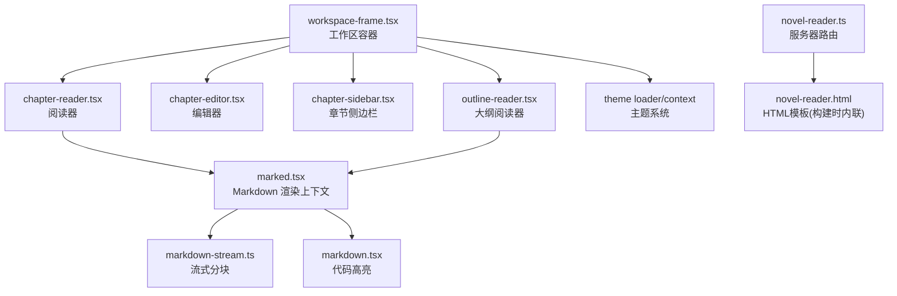
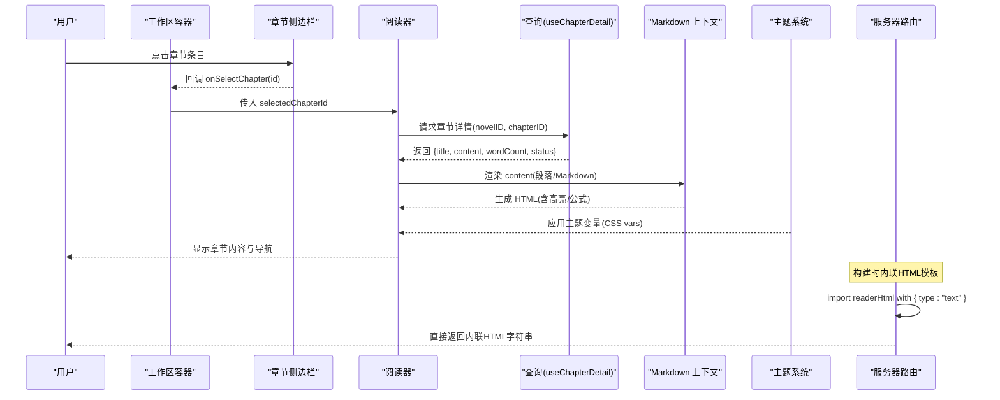
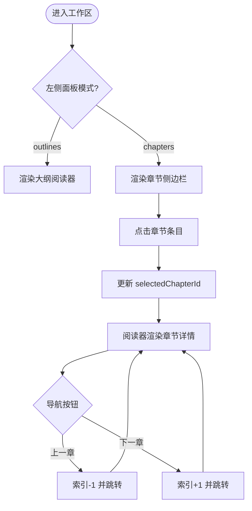
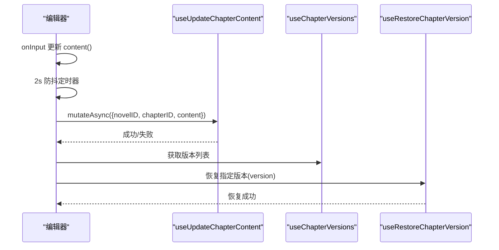
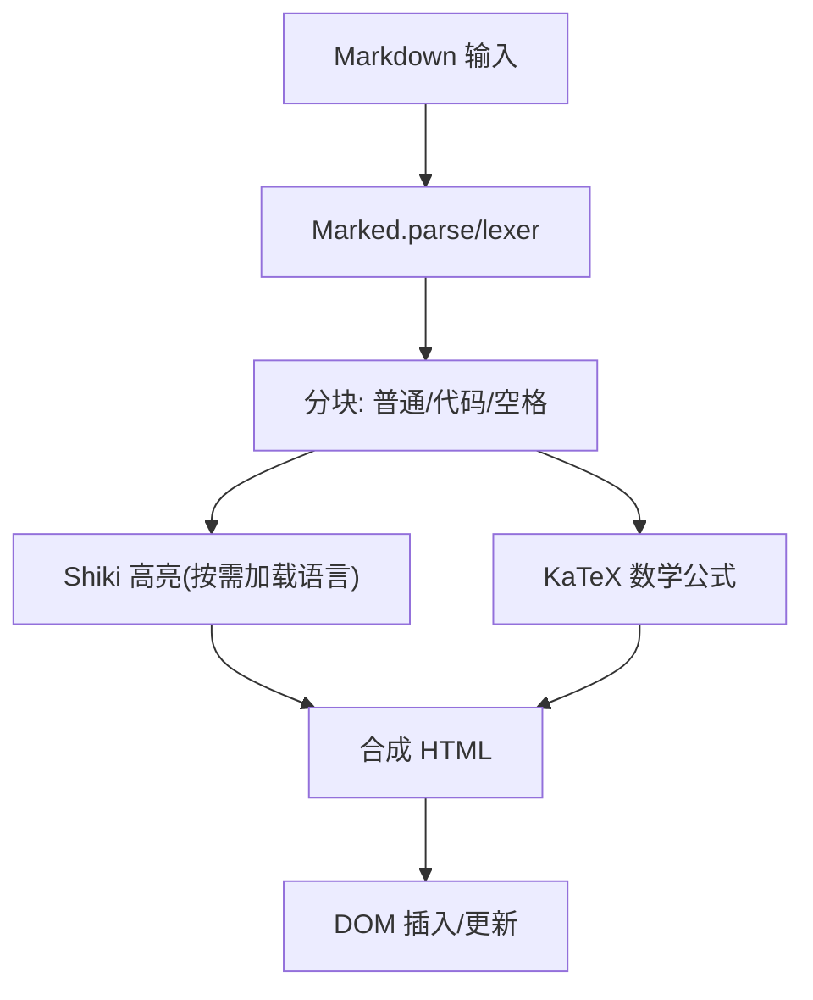
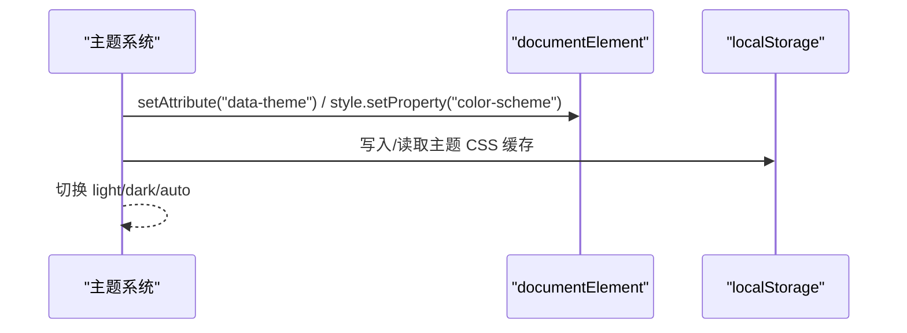
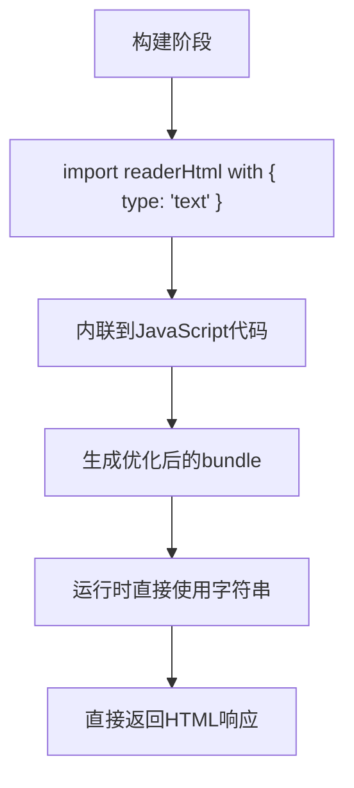
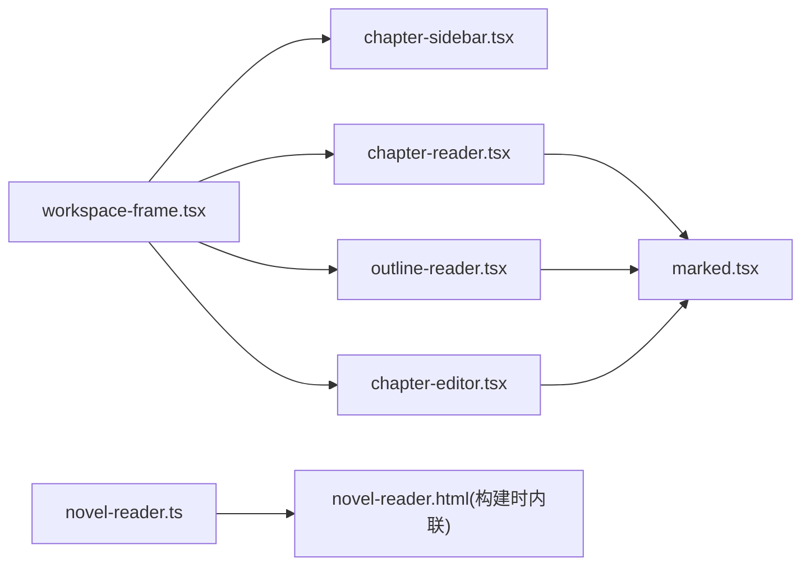

# 阅读器界面

<cite>
**本文引用的文件**   
- [packages/app/src/pages/novel/workspace-frame.tsx](file://packages/app/src/pages/novel/workspace-frame.tsx)
- [packages/app/src/pages/novel/chapter-reader.tsx](file://packages/app/src/pages/novel/chapter-reader.tsx)
- [packages/app/src/pages/novel/chapter-editor.tsx](file://packages/app/src/pages/novel/chapter-editor.tsx)
- [packages/app/src/pages/novel/chapter-sidebar.tsx](file://packages/app/src/pages/novel/chapter-sidebar.tsx)
- [packages/app/src/pages/novel/outline-reader.tsx](file://packages/app/src/pages/novel/outline-reader.tsx)
- [packages/ui/src/context/marked.tsx](file://packages/ui/src/context/marked.tsx)
- [packages/session-ui/src/components/markdown-stream.ts](file://packages/session-ui/src/components/markdown-stream.ts)
- [packages/session-ui/src/components/markdown.tsx](file://packages/session-ui/src/components/markdown.tsx)
- [packages/ui/src/theme/loader.ts](file://packages/ui/src/theme/loader.ts)
- [packages/ui/src/theme/context.tsx](file://packages/ui/src/theme/context.tsx)
- [packages/tui/src/context/theme.tsx](file://packages/tui/src/context/theme.tsx)
- [packages/app/index.html](file://packages/app/index.html)
- [packages/opennovel/src/server/routes/instance/httpapi/novel-reader.ts](file://packages/opennovel/src/server/routes/instance/httpapi/novel-reader.ts)
- [packages/opennovel/src/server/routes/instance/httpapi/novel-reader.html](file://packages/opennovel/src/server/routes/instance/httpapi/novel-reader.html)
</cite>

## 更新摘要
**变更内容**   
- 更新了HTML模板加载机制，从运行时文件读取转换为Bun文本导入语法
- 增强了性能优化策略，减少了I/O操作和启动时间
- 添加了构建时内联优化的详细说明

## 目录
1. [简介](#简介)
2. [项目结构](#项目结构)
3. [核心组件](#核心组件)
4. [架构总览](#架构总览)
5. [详细组件分析](#详细组件分析)
6. [依赖分析](#依赖分析)
7. [性能考虑](#性能考虑)
8. [故障排查指南](#故障排查指南)
9. [结论](#结论)
10. [附录](#附录)

## 简介
本文件面向 openNovel 的"阅读器界面"，系统化阐述章节导航、文本编辑与预览、格式化与主题、实时渲染机制以及性能优化策略。文档以代码级为依据，结合流程图与时序图帮助读者快速理解数据流与控制流，并给出可操作的排障建议。

**更新** 本次更新重点反映了HTML模板加载机制的重大改进：从运行时文件读取转换为Bun文本导入语法，显著提高了性能和启动时间。

## 项目结构
openNovel 的阅读器界面由应用层页面组件（SolidJS）与 UI 层 Markdown 渲染、主题系统等共同构成：
- 工作区容器负责在"阅读"和"编辑"两个 Tab 之间切换，并挂载章节侧边栏、阅读器与编辑器。
- 章节侧边栏提供目录树、搜索、排序与批量操作。
- 阅读器组件负责长文分段懒加载、前后章跳转与状态展示。
- 编辑器组件提供纯文本编辑、自动保存、版本历史与恢复。
- Markdown 渲染上下文提供语法高亮、数学公式与流式增量渲染能力。
- 主题系统支持明暗模式与 CSS 变量注入。
- **新增** HTML模板通过Bun构建时内联，避免运行时文件读取开销。



**图表来源** 
- [packages/app/src/pages/novel/workspace-frame.tsx](file://packages/app/src/pages/novel/workspace-frame.tsx)
- [packages/app/src/pages/novel/chapter-reader.tsx](file://packages/app/src/pages/novel/chapter-reader.tsx)
- [packages/app/src/pages/novel/chapter-editor.tsx](file://packages/app/src/pages/novel/chapter-editor.tsx)
- [packages/app/src/pages/novel/chapter-sidebar.tsx](file://packages/app/src/pages/novel/chapter-sidebar.tsx)
- [packages/app/src/pages/novel/outline-reader.tsx](file://packages/app/src/pages/novel/outline-reader.tsx)
- [packages/ui/src/context/marked.tsx](file://packages/ui/src/context/marked.tsx)
- [packages/session-ui/src/components/markdown-stream.ts](file://packages/session-ui/src/components/markdown-stream.ts)
- [packages/session-ui/src/components/markdown.tsx](file://packages/session-ui/src/components/markdown.tsx)
- [packages/ui/src/theme/loader.ts](file://packages/ui/src/theme/loader.ts)
- [packages/ui/src/theme/context.tsx](file://packages/ui/src/theme/context.tsx)
- [packages/opennovel/src/server/routes/instance/httpapi/novel-reader.ts](file://packages/opennovel/src/server/routes/instance/httpapi/novel-reader.ts)

**章节来源**
- [packages/app/src/pages/novel/workspace-frame.tsx](file://packages/app/src/pages/novel/workspace-frame.tsx)
- [packages/app/index.html](file://packages/app/index.html)

## 核心组件
- 工作区容器（workspace-frame）
  - 管理"阅读/编辑"双 Tab 切换，挂载章节侧边栏、阅读器与编辑器。
  - 根据左侧面板模式（如 outlines）动态渲染大纲阅读器。
- 章节侧边栏（chapter-sidebar）
  - 按卷分组与未分组章节列表，支持新建卷/章节、重命名、删除、移动、状态编辑与搜索。
- 阅读器（chapter-reader）
  - 基于段落切分的懒加载，IntersectionObserver 触发加载更多；显示字数、状态标签与前后章导航。
- 编辑器（chapter-editor）
  - 纯文本编辑，自动保存（编辑后 2s 防抖），目标字数指示器，版本历史查看与恢复，快捷键 Ctrl/Cmd+S 保存。
- 大纲阅读器（outline-reader）
  - 主大纲/卷/章节三级 Markdown 内容编辑与预览，内置安全清洗与本地 Marked 解析。
- Markdown 渲染上下文（marked.tsx）
  - 集成 Shiki WASM 语法高亮、KaTeX 数学公式、外链处理与代码块二次高亮。
- 流式 Markdown（markdown-stream.ts / markdown.tsx）
  - 将流式文本分块为稳定/不稳定段，区分代码块与普通文本，提升长文本渲染体验。
- 主题系统（theme loader/context, tui theme）
  - 注入 CSS 变量、设置 color-scheme、持久化主题样式，支持明暗模式切换。
- **新增** HTML模板服务（novel-reader.ts）
  - 使用 Bun 文本导入语法在构建时将HTML模板内联到代码中，避免运行时文件读取。

**章节来源**
- [packages/app/src/pages/novel/workspace-frame.tsx](file://packages/app/src/pages/novel/workspace-frame.tsx)
- [packages/app/src/pages/novel/chapter-sidebar.tsx](file://packages/app/src/pages/novel/chapter-sidebar.tsx)
- [packages/app/src/pages/novel/chapter-reader.tsx](file://packages/app/src/pages/novel/chapter-reader.tsx)
- [packages/app/src/pages/novel/chapter-editor.tsx](file://packages/app/src/pages/novel/chapter-editor.tsx)
- [packages/app/src/pages/novel/outline-reader.tsx](file://packages/app/src/pages/novel/outline-reader.tsx)
- [packages/ui/src/context/marked.tsx](file://packages/ui/src/context/marked.tsx)
- [packages/session-ui/src/components/markdown-stream.ts](file://packages/session-ui/src/components/markdown-stream.ts)
- [packages/session-ui/src/components/markdown.tsx](file://packages/session-ui/src/components/markdown.tsx)
- [packages/ui/src/theme/loader.ts](file://packages/ui/src/theme/loader.ts)
- [packages/ui/src/theme/context.tsx](file://packages/ui/src/theme/context.tsx)
- [packages/tui/src/context/theme.tsx](file://packages/tui/src/context/theme.tsx)
- [packages/opennovel/src/server/routes/instance/httpapi/novel-reader.ts](file://packages/opennovel/src/server/routes/instance/httpapi/novel-reader.ts)

## 架构总览
下图展示了从用户交互到数据渲染的关键路径：工作区容器选择 Tab → 侧边栏选中章节 → 阅读器拉取详情 → Markdown 渲染 → 主题样式生效。**新增** 服务器端HTML模板通过构建时内联优化，显著提升响应速度。



**图表来源** 
- [packages/app/src/pages/novel/workspace-frame.tsx](file://packages/app/src/pages/novel/workspace-frame.tsx)
- [packages/app/src/pages/novel/chapter-reader.tsx](file://packages/app/src/pages/novel/chapter-reader.tsx)
- [packages/ui/src/context/marked.tsx](file://packages/ui/src/context/marked.tsx)
- [packages/ui/src/theme/context.tsx](file://packages/ui/src/theme/context.tsx)
- [packages/opennovel/src/server/routes/instance/httpapi/novel-reader.ts](file://packages/opennovel/src/server/routes/instance/httpapi/novel-reader.ts)

## 详细组件分析

### 章节导航系统（目录树展开、章节跳转、书签管理与阅读历史）
- 目录树展开
  - 侧边栏按卷分组，组内按 order 排序；未分组章节单独列出。
  - 支持搜索过滤，命中结果直接跳转到对应章节。
- 章节跳转
  - 点击侧边栏条目触发 onSelectChapter，工作区容器更新 selectedChapterId，阅读器重新拉取详情。
  - 阅读器底部提供"上一章/下一章"按钮，基于当前索引计算边界。
- 书签管理与阅读历史
  - 当前实现未包含独立的书签与阅读历史模块；如需扩展，可在工作区或会话上下文中维护"最近阅读位置"与"书签映射"。



**图表来源** 
- [packages/app/src/pages/novel/workspace-frame.tsx](file://packages/app/src/pages/novel/workspace-frame.tsx)
- [packages/app/src/pages/novel/chapter-sidebar.tsx](file://packages/app/src/pages/novel/chapter-sidebar.tsx)
- [packages/app/src/pages/novel/chapter-reader.tsx](file://packages/app/src/pages/novel/chapter-reader.tsx)

**章节来源**
- [packages/app/src/pages/novel/chapter-sidebar.tsx](file://packages/app/src/pages/novel/chapter-sidebar.tsx)
- [packages/app/src/pages/novel/chapter-reader.tsx](file://packages/app/src/pages/novel/chapter-reader.tsx)
- [packages/app/src/pages/novel/workspace-frame.tsx](file://packages/app/src/pages/novel/workspace-frame.tsx)

### 文本编辑器功能（富文本编辑、Markdown 支持、语法高亮、自动保存）
- 编辑器形态
  - 使用原生 textarea 进行纯文本编辑，配合字体与行距样式获得接近富文本的阅读感。
- Markdown 支持与语法高亮
  - 大纲阅读器使用本地 Marked 解析 Markdown 并输出 HTML；通过 sanitize 清理脚本与事件属性。
  - 通用 Markdown 渲染上下文集成 Shiki WASM 进行代码块高亮，并支持 KaTeX 数学公式。
- 自动保存
  - 编辑器在内容变化后 2s 防抖调用更新接口，成功后标记已保存并记录时间戳。
  - 支持 Ctrl/Cmd+S 手动保存，失败时提示错误。
- 版本历史与恢复
  - 右侧面板展示版本列表，支持预览与恢复指定版本，恢复成功后刷新内容。



**图表来源** 
- [packages/app/src/pages/novel/chapter-editor.tsx](file://packages/app/src/pages/novel/chapter-editor.tsx)
- [packages/app/src/pages/novel/outline-reader.tsx](file://packages/app/src/pages/novel/outline-reader.tsx)
- [packages/ui/src/context/marked.tsx](file://packages/ui/src/context/marked.tsx)

**章节来源**
- [packages/app/src/pages/novel/chapter-editor.tsx](file://packages/app/src/pages/novel/chapter-editor.tsx)
- [packages/app/src/pages/novel/outline-reader.tsx](file://packages/app/src/pages/novel/outline-reader.tsx)
- [packages/ui/src/context/marked.tsx](file://packages/ui/src/context/marked.tsx)

### 格式化功能（段落排版、字体设置、行间距调整、页面布局）
- 段落排版
  - 阅读器按连续空行分割段落，逐段渲染 <p>，便于统一控制行高与间距。
- 字体与行距
  - 编辑器 textarea 使用衬线字体与宽松行距，提升阅读舒适度。
- 页面布局
  - 工作区采用 flex 布局，阅读器区域自适应高度，底部导航固定。
  - 大纲阅读器限制最大宽度，标题层级通过 prose 类控制。

```mermaid
classDiagram
class ChapterReader {
+visibleParagraphs()
+hasMoreParagraphs()
+prev/next 导航
}
class ChapterEditor {
+content()
+autoSave()
+versions()
+restore(version)
}
class OutlineReader {
+currentMarkdown()
+html()
+wordCount()
}
ChapterReader --> "渲染段落" : 使用
ChapterEditor --> "Markdown 上下文" : 使用
OutlineReader --> "Marked 解析" : 使用
```

**图表来源** 
- [packages/app/src/pages/novel/chapter-reader.tsx](file://packages/app/src/pages/novel/chapter-reader.tsx)
- [packages/app/src/pages/novel/chapter-editor.tsx](file://packages/app/src/pages/novel/chapter-editor.tsx)
- [packages/app/src/pages/novel/outline-reader.tsx](file://packages/app/src/pages/novel/outline-reader.tsx)

**章节来源**
- [packages/app/src/pages/novel/chapter-reader.tsx](file://packages/app/src/pages/novel/chapter-reader.tsx)
- [packages/app/src/pages/novel/chapter-editor.tsx](file://packages/app/src/pages/novel/chapter-editor.tsx)
- [packages/app/src/pages/novel/outline-reader.tsx](file://packages/app/src/pages/novel/outline-reader.tsx)

### 实时预览机制（即时渲染、代码块显示、图片嵌入）
- 即时渲染
  - 大纲阅读器在编辑模式下使用 TextareaV2 输入，保存前通过 Marked.parse 同步生成 HTML 预览。
- 代码块显示
  - 通用 Markdown 上下文使用 Shiki WASM 对代码块进行高亮，按需加载语言包。
- 图片嵌入
  - 当前实现未显式处理图片渲染逻辑；若需支持，可在 Markdown 渲染阶段增加 img 节点处理与安全校验。



**图表来源** 
- [packages/ui/src/context/marked.tsx](file://packages/ui/src/context/marked.tsx)
- [packages/session-ui/src/components/markdown-stream.ts](file://packages/session-ui/src/components/markdown-stream.ts)
- [packages/session-ui/src/components/markdown.tsx](file://packages/session-ui/src/components/markdown.tsx)
- [packages/app/src/pages/novel/outline-reader.tsx](file://packages/app/src/pages/novel/outline-reader.tsx)

**章节来源**
- [packages/ui/src/context/marked.tsx](file://packages/ui/src/context/marked.tsx)
- [packages/session-ui/src/components/markdown-stream.ts](file://packages/session-ui/src/components/markdown-stream.ts)
- [packages/session-ui/src/components/markdown.tsx](file://packages/session-ui/src/components/markdown.tsx)
- [packages/app/src/pages/novel/outline-reader.tsx](file://packages/app/src/pages/novel/outline-reader.tsx)

### 全屏模式、夜间主题、字体缩放与滚动同步
- 全屏模式
  - 当前实现未包含全屏切换逻辑；可通过浏览器 Fullscreen API 在工作区根元素上扩展。
- 夜间主题
  - 主题系统通过注入 CSS 变量与设置 color-scheme 实现明暗模式；UI 层提供切换入口与持久化。
- 字体缩放
  - 未提供专用控件；可通过 CSS 变量或外层容器 font-size 缩放实现。
- 滚动同步
  - 存在通用的滚动持久化工具（createScrollPersistence），可用于跨 Tab/Session 的滚动位置记忆与恢复。



**图表来源** 
- [packages/ui/src/theme/loader.ts](file://packages/ui/src/theme/loader.ts)
- [packages/ui/src/theme/context.tsx](file://packages/ui/src/theme/context.tsx)
- [packages/tui/src/context/theme.tsx](file://packages/tui/src/context/theme.tsx)

**章节来源**
- [packages/ui/src/theme/loader.ts](file://packages/ui/src/theme/loader.ts)
- [packages/ui/src/theme/context.tsx](file://packages/ui/src/theme/context.tsx)
- [packages/tui/src/context/theme.tsx](file://packages/tui/src/context/theme.tsx)

### HTML模板加载优化（新增章节）
- **构建时内联优化**
  - 使用 Bun 文本导入语法 `import readerHtml from "./novel-reader.html" with { type: "text" }`
  - 在构建时将HTML模板直接内联到JavaScript代码中，避免运行时文件读取
  - 类型标注为 `HTMLBundle`，实际类型为字符串
- **性能提升**
  - 消除了运行时的文件系统I/O操作
  - 减少了启动时间和内存占用
  - 提升了HTTP响应速度
- **构建配置**
  - Bun构建器自动处理文本导入语法
  - 支持多种资源类型的内联优化
  - 与现有的打包流程无缝集成



**图表来源** 
- [packages/opennovel/src/server/routes/instance/httpapi/novel-reader.ts](file://packages/opennovel/src/server/routes/instance/httpapi/novel-reader.ts)

**章节来源**
- [packages/opennovel/src/server/routes/instance/httpapi/novel-reader.ts](file://packages/opennovel/src/server/routes/instance/httpapi/novel-reader.ts)
- [packages/opennovel/src/server/routes/instance/httpapi/novel-reader.html](file://packages/opennovel/src/server/routes/instance/httpapi/novel-reader.html)

## 依赖分析
- 组件耦合
  - workspace-frame 作为容器，强依赖 chapter-sidebar、chapter-reader、chapter-editor、outline-reader。
  - chapter-reader 依赖 useChapterDetail 查询与 Markdown 上下文渲染。
  - chapter-editor 依赖更新与版本查询接口。
- 外部依赖
  - Marked、Shiki WASM、KaTeX 用于 Markdown 与代码高亮。
  - SolidJS 响应式与 Store 驱动状态管理。
- 潜在循环依赖
  - 当前未见循环导入；各组件职责清晰，通过 props 与 hooks 解耦。
- **新增** 构建依赖
  - Bun 文本导入语法用于静态资源内联
  - 构建时优化减少运行时依赖



**图表来源** 
- [packages/app/src/pages/novel/workspace-frame.tsx](file://packages/app/src/pages/novel/workspace-frame.tsx)
- [packages/app/src/pages/novel/chapter-reader.tsx](file://packages/app/src/pages/novel/chapter-reader.tsx)
- [packages/app/src/pages/novel/chapter-editor.tsx](file://packages/app/src/pages/novel/chapter-editor.tsx)
- [packages/app/src/pages/novel/chapter-sidebar.tsx](file://packages/app/src/pages/novel/chapter-sidebar.tsx)
- [packages/app/src/pages/novel/outline-reader.tsx](file://packages/app/src/pages/novel/outline-reader.tsx)
- [packages/ui/src/context/marked.tsx](file://packages/ui/src/context/marked.tsx)
- [packages/opennovel/src/server/routes/instance/httpapi/novel-reader.ts](file://packages/opennovel/src/server/routes/instance/httpapi/novel-reader.ts)

**章节来源**
- [packages/app/src/pages/novel/workspace-frame.tsx](file://packages/app/src/pages/novel/workspace-frame.tsx)
- [packages/ui/src/context/marked.tsx](file://packages/ui/src/context/marked.tsx)

## 性能考虑
- 长文懒加载
  - 阅读器按段落分批渲染，IntersectionObserver 监听哨兵元素，达到阈值再追加段落，降低首屏压力。
- 代码高亮按需加载
  - Shiki 按需加载语言包，避免一次性加载全部语言导致体积膨胀。
- 流式分块渲染
  - markdown-stream 将流式文本划分为稳定与不稳定部分，减少频繁重绘。
- 滚动持久化
  - 使用 debounce 合并滚动事件，延迟 flush 到存储，避免高频 I/O。
- 主题样式缓存
  - 主题 CSS 写入 localStorage，减少重复计算与注入开销。
- **新增** HTML模板内联优化
  - 构建时将HTML模板直接内联到代码中，消除运行时文件读取
  - 减少I/O操作，提升启动速度和响应时间
  - 利用Bun构建器的静态资源优化能力

**更新** 本次更新重点强调了HTML模板加载机制的性能优化，通过构建时内联技术显著提升了系统性能。

[本节为通用指导，不直接分析具体文件]

## 故障排查指南
- 章节无法加载
  - 检查 useChapterDetail 是否返回错误；确认 novelID 与 chapterID 有效。
- Markdown 渲染异常
  - 检查 Marked 配置与 Shiki 语言包是否加载；确认内容中是否存在非法 HTML。
- 自动保存失败
  - 查看网络请求与错误提示；确认接口权限与参数格式。
- 主题切换无效
  - 检查 documentElement 的 data-theme 与 color-scheme 是否正确设置；确认 CSS 变量注入。
- 历史版本不可用
  - 确认 useChapterVersions 返回数据；恢复接口是否被调用且成功。
- **新增** HTML模板相关问题
  - 确认Bun构建过程正常完成
  - 检查HTML模板文件路径是否正确
  - 验证文本导入语法是否被正确识别

**章节来源**
- [packages/app/src/pages/novel/chapter-reader.tsx](file://packages/app/src/pages/novel/chapter-reader.tsx)
- [packages/app/src/pages/novel/chapter-editor.tsx](file://packages/app/src/pages/novel/chapter-editor.tsx)
- [packages/ui/src/context/marked.tsx](file://packages/ui/src/context/marked.tsx)
- [packages/ui/src/theme/context.tsx](file://packages/ui/src/theme/context.tsx)
- [packages/opennovel/src/server/routes/instance/httpapi/novel-reader.ts](file://packages/opennovel/src/server/routes/instance/httpapi/novel-reader.ts)

## 结论
openNovel 的阅读器界面以清晰的组件分工与响应式数据流为基础，实现了章节导航、文本编辑与 Markdown 预览的核心能力。通过懒加载、按需高亮与流式分块等策略，保证了在大文本场景下的流畅体验。**新增** 的HTML模板构建时内联优化进一步提升了系统性能，消除了运行时文件读取开销。未来可扩展书签与阅读历史、图片嵌入、全屏模式与更丰富的排版选项，进一步提升创作与阅读体验。

**更新** 本次更新突出了性能优化的重要成果，特别是HTML模板加载机制的改进，为系统的整体性能提升做出了重要贡献。

[本节为总结性内容，不直接分析具体文件]

## 附录
- 界面截图说明
  - 工作区与书架主题切换：参考 e2e 测试中对 light/dark 模式的截图捕获流程。
  - 阅读器与编辑器界面：由 workspace-frame 组合渲染，阅读模式下显示章节内容，编辑模式下显示文本框与历史面板。
- 相关 HTML 示例
  - 服务端提供的简易阅读器 HTML 展示了章节列表与基础导航逻辑，可作为对照参考。
- **新增** 构建优化示例
  - Bun 文本导入语法的使用方式
  - 静态资源内联的最佳实践
  - 性能监控与基准测试结果

**章节来源**
- [packages/app/index.html](file://packages/app/index.html)
- [packages/opennovel/src/server/routes/instance/httpapi/novel-reader.html](file://packages/opennovel/src/server/routes/instance/httpapi/novel-reader.html)
- [packages/opennovel/src/server/routes/instance/httpapi/novel-reader.ts](file://packages/opennovel/src/server/routes/instance/httpapi/novel-reader.ts)