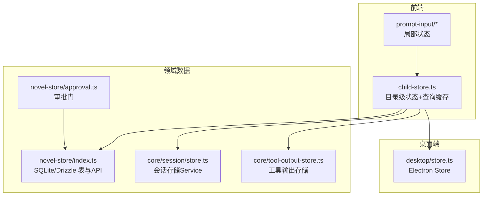
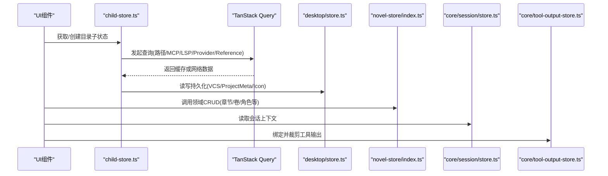
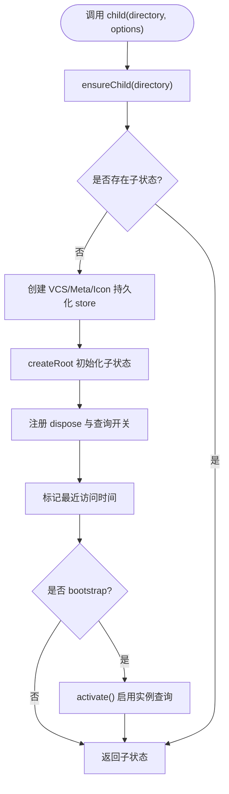
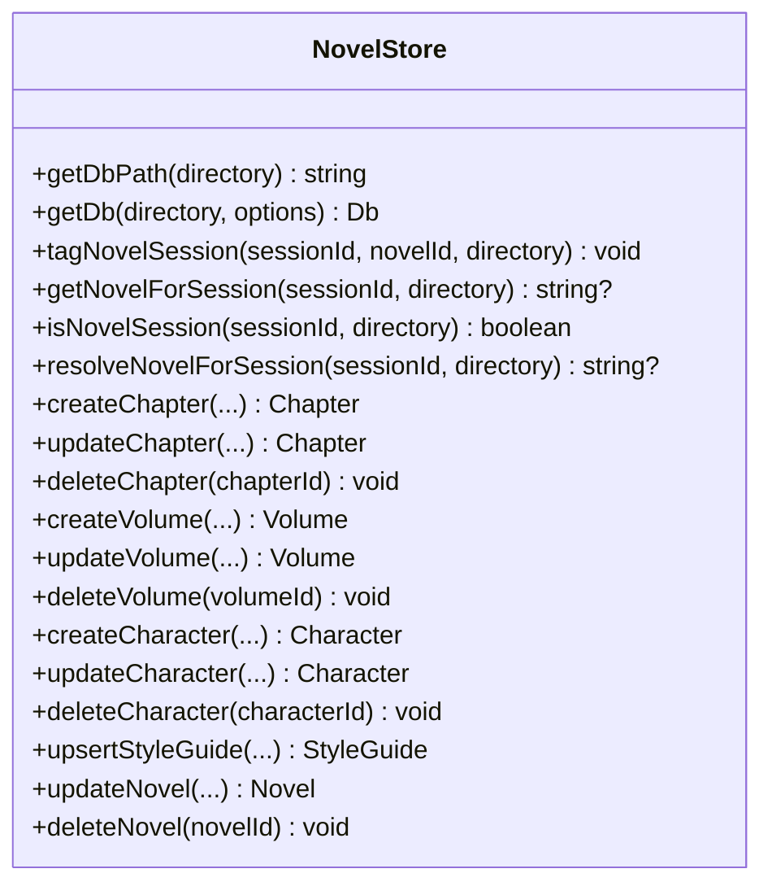
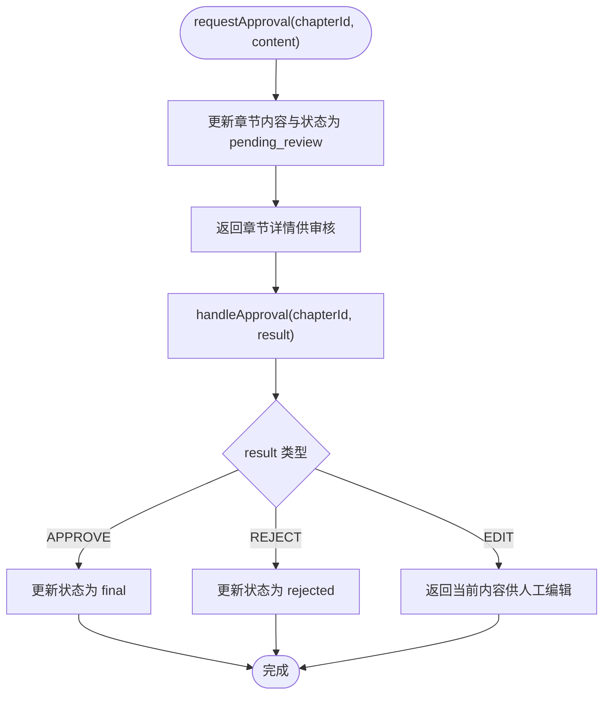
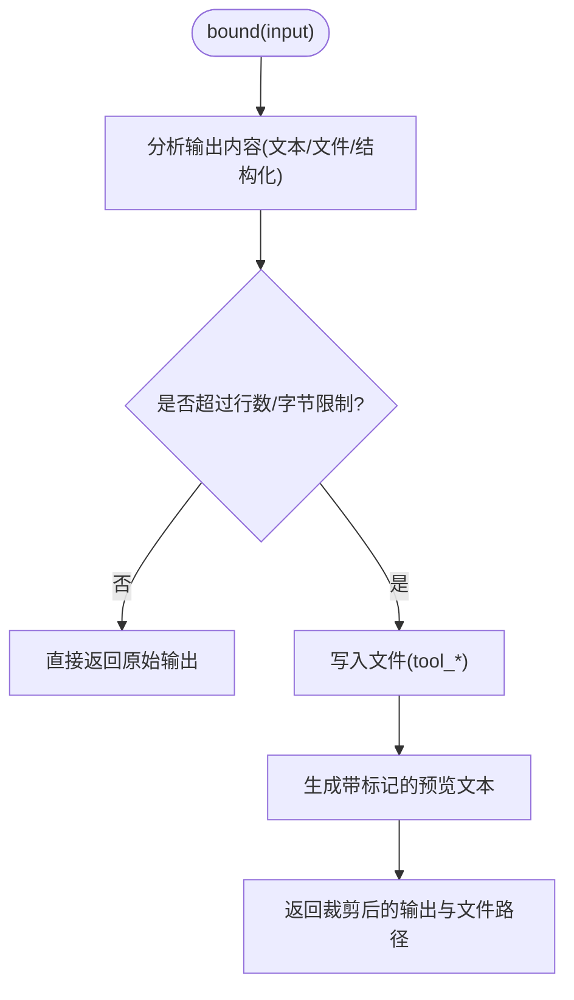
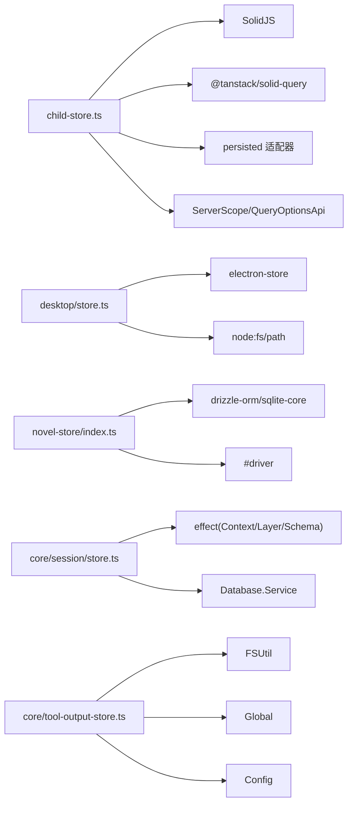

# 状态管理

<cite>
**本文引用的文件**   
- [packages/novel-store/src/index.ts](file://packages/novel-store/src/index.ts)
- [packages/novel-store/src/approval.ts](file://packages/novel-store/src/approval.ts)
- [packages/core/src/session/store.ts](file://packages/core/src/session/store.ts)
- [packages/core/src/tool-output-store.ts](file://packages/core/src/tool-output-store.ts)
- [packages/app/src/context/global-sync/child-store.ts](file://packages/app/src/context/global-sync/child-store.ts)
- [packages/desktop/src/main/store.ts](file://packages/desktop/src/main/store.ts)
- [packages/app/src/components/prompt-input/submission-state.ts](file://packages/app/src/components/prompt-input/submission-state.ts)
- [packages/app/src/components/prompt-input/transient-state.ts](file://packages/app/src/components/prompt-input/transient-state.ts)
</cite>

## 目录
1. [简介](#简介)
2. [项目结构](#项目结构)
3. [核心组件](#核心组件)
4. [架构总览](#架构总览)
5. [详细组件分析](#详细组件分析)
6. [依赖关系分析](#依赖关系分析)
7. [性能考量](#性能考量)
8. [故障排查指南](#故障排查指南)
9. [结论](#结论)
10. [附录](#附录)

## 简介
本文件为 openNovel 的状态管理系统提供全面文档，围绕基于 SolidJS 的信号与 store 的状态管理模式展开，覆盖：
- 局部状态、全局状态与持久化状态的管理策略
- 客户端-服务器状态同步、离线支持与冲突解决
- 异步状态处理（请求缓存、错误重试、加载状态）
- 状态调试工具（快照、变更追踪、性能分析）
- 状态迁移策略（版本兼容性与数据升级）
- 测试策略、性能优化技巧与内存管理最佳实践
- 实际示例与常见问题解决方案

openNovel 的状态体系由三层构成：
- 前端 UI 层：SolidJS createSignal/createStore + TanStack Query 的响应式状态与查询缓存
- 应用进程层：Electron Store 等本地持久化存储
- 领域数据层：novel-store（SQLite/Drizzle）与 core 服务（Effect 层）提供的会话、工具输出等能力

## 项目结构
与状态管理相关的核心模块分布如下：
- 前端状态与同步
  - packages/app/src/context/global-sync/child-store.ts：按目录维度的子状态管理器，集成持久化、查询缓存与生命周期管理
  - packages/app/src/components/prompt-input/*.ts：输入框相关局部状态与提交态
- 桌面端持久化
  - packages/desktop/src/main/store.ts：Electron Store 封装与清理
- 领域数据与工具
  - packages/novel-store/src/index.ts：小说领域表定义、DB 路径解析、Schema 初始化、CRUD API
  - packages/novel-store/src/approval.ts：章节人工审批门
  - packages/core/src/session/store.ts：会话存储 Effect Service
  - packages/core/src/tool-output-store.ts：工具输出存储与裁剪、保留策略

图表来源
- [packages/app/src/context/global-sync/child-store.ts](file://packages/app/src/context/global-sync/child-store.ts)
- [packages/desktop/src/main/store.ts](file://packages/desktop/src/main/store.ts)
- [packages/novel-store/src/index.ts](file://packages/novel-store/src/index.ts)
- [packages/novel-store/src/approval.ts](file://packages/novel-store/src/approval.ts)
- [packages/core/src/session/store.ts](file://packages/core/src/session/store.ts)
- [packages/core/src/tool-output-store.ts](file://packages/core/src/tool-output-store.ts)

章节来源
- [packages/app/src/context/global-sync/child-store.ts](file://packages/app/src/context/global-sync/child-store.ts)
- [packages/desktop/src/main/store.ts](file://packages/desktop/src/main/store.ts)
- [packages/novel-store/src/index.ts](file://packages/novel-store/src/index.ts)
- [packages/novel-store/src/approval.ts](file://packages/novel-store/src/approval.ts)
- [packages/core/src/session/store.ts](file://packages/core/src/session/store.ts)
- [packages/core/src/tool-output-store.ts](file://packages/core/src/tool-output-store.ts)

## 核心组件
- child-store.ts：目录级状态工厂，负责创建并维护每个工作目录的子状态（store），集成持久化缓存（VCS/ProjectMeta/Icon）、TanStack Query 缓存、MCP/LSP/Provider 等查询开关与激活控制，以及内存淘汰策略。
- desktop/store.ts：Electron Store 单例缓存，避免重复实例化导致的路径问题；提供空文件清理接口。
- novel-store/index.ts：领域数据层，定义小说相关表结构与数据库连接缓存，暴露 CRUD API（章节、卷、角色、风格指南等）。
- novel-store/approval.ts：章节生成后的人工审批门，支持通过/驳回/编辑三种结果路由。
- core/session/store.ts：会话存储 Effect Service，提供会话信息、消息上下文与 runner 上下文读取。
- core/tool-output-store.ts：工具输出存储，支持大小/行数限制、预览裁剪、文件落盘与定期清理。

章节来源
- [packages/app/src/context/global-sync/child-store.ts](file://packages/app/src/context/global-sync/child-store.ts)
- [packages/desktop/src/main/store.ts](file://packages/desktop/src/main/store.ts)
- [packages/novel-store/src/index.ts](file://packages/novel-store/src/index.ts)
- [packages/novel-store/src/approval.ts](file://packages/novel-store/src/approval.ts)
- [packages/core/src/session/store.ts](file://packages/core/src/session/store.ts)
- [packages/core/src/tool-output-store.ts](file://packages/core/src/tool-output-store.ts)

## 架构总览
整体状态流分为“UI 响应式状态”、“查询缓存与同步”、“持久化存储”和“领域数据服务”四层：
- UI 层使用 SolidJS 的 createSignal/createStore 驱动视图更新
- 查询层使用 @tanstack/solid-query 进行网络请求缓存、加载状态与错误处理
- 持久化层使用 Electron Store 或自定义 persisted 适配器将关键状态写入磁盘
- 领域层通过 novel-store 与 core 服务访问 SQLite/文件系统，保证数据一致性与可审计性

图表来源
- [packages/app/src/context/global-sync/child-store.ts](file://packages/app/src/context/global-sync/child-store.ts)
- [packages/desktop/src/main/store.ts](file://packages/desktop/src/main/store.ts)
- [packages/novel-store/src/index.ts](file://packages/novel-store/src/index.ts)
- [packages/core/src/session/store.ts](file://packages/core/src/session/store.ts)
- [packages/core/src/tool-output-store.ts](file://packages/core/src/tool-output-store.ts)

## 详细组件分析

### 前端目录级状态管理器（child-store.ts）
- 职责
  - 为每个目录创建独立的子状态（Store<State>），包含项目元信息、图标、配置、路径、会话列表、MCP/LSP/Provider 查询结果等
  - 使用 TanStack Query 管理异步查询，提供 isLoading、data 等状态
  - 使用 persisted 适配器对 VCS/ProjectMeta/Icon 做持久化缓存
  - 维护生命周期（激活/禁用 MCP、启动引导）、内存淘汰（最大目录数、空闲 TTL）
- 关键点
  - ensureChild：懒创建子状态，注册 dispose 回调，合并持久化初始值
  - activate/disableMcp：控制查询启用与 MCP 开关
  - runEviction：根据 pinned、TTL、MAX_DIR_STORES 淘汰不活跃目录
  - projectMeta/projectIcon：增量更新持久化与内存状态

图表来源
- [packages/app/src/context/global-sync/child-store.ts](file://packages/app/src/context/global-sync/child-store.ts)

章节来源
- [packages/app/src/context/global-sync/child-store.ts](file://packages/app/src/context/global-sync/child-store.ts)

### 桌面端持久化存储（desktop/store.ts）
- 职责
  - 封装 electron-store，按名称缓存实例，避免模块加载顺序导致的 userData 路径问题
  - 提供空文件清理与强制删除接口
- 关键点
  - getStore：首次实例化时设置 cwd=fileExtension/accessPropertiesByDotNotation 等选项
  - removeStoreFileIfEmpty：若文件为空则删除并从缓存移除

章节来源
- [packages/desktop/src/main/store.ts](file://packages/desktop/src/main/store.ts)

### 领域数据存储（novel-store/index.ts）
- 职责
  - 定义小说相关表结构（novels、volumes、chapters、characters、relationships、style_guide、world_entries、tension_log、hook_rotation、entity_refs、pending_updates、saga_sessions、description_history 等）
  - 提供 DB 路径解析与连接缓存（按目录隔离）
  - 暴露会话标记与懒绑定 API（tagNovelSession/getNovelForSession/isNovelSession/resolveNovelForSession）
  - 提供丰富的 CRUD API（章节、卷、角色、风格指南等）
- 关键点
  - getDb：按目录路径缓存 Db 实例，支持 fresh 模式
  - tagNovelSession：幂等标记会话与小说关联
  - resolveNovelForSession：当仅有一本小说时自动懒绑定

图表来源
- [packages/novel-store/src/index.ts](file://packages/novel-store/src/index.ts)

章节来源
- [packages/novel-store/src/index.ts](file://packages/novel-store/src/index.ts)

### 章节人工审批门（novel-store/approval.ts）
- 职责
  - requestApproval：保存写手生成的章节内容，标记待审核并返回详情供人工审核
  - handleApproval：根据审批结果（通过/驳回/编辑）路由到不同分支，更新章节状态
- 关键点
  - 状态流转：draft -> pending_review -> final/rejected/editing
  - 返回结构化结果，便于上层决策

图表来源
- [packages/novel-store/src/approval.ts](file://packages/novel-store/src/approval.ts)

章节来源
- [packages/novel-store/src/approval.ts](file://packages/novel-store/src/approval.ts)

### 会话存储（core/session/store.ts）
- 职责
  - 提供会话信息查询、消息上下文加载、runner 上下文加载、按消息 ID 查询
  - 使用 Effect 组合与 Schema 解码，确保类型安全与错误处理
- 关键点
  - get：按 sessionID 查询会话信息
  - context/runnerContext：加载历史消息上下文
  - message：按消息 ID 解码并返回会话与消息

章节来源
- [packages/core/src/session/store.ts](file://packages/core/src/session/store.ts)

### 工具输出存储（core/tool-output-store.ts）
- 职责
  - 对工具输出进行裁剪与预览，超过阈值时落盘并返回路径
  - 定期清理旧文件（保留期默认 7 天）
- 关键点
  - bound：根据 maxLines/maxBytes 裁剪文本，必要时写入文件并返回路径
  - cleanup：扫描 tool-output 目录并按 mtime 清理过期文件
  - cleanupLayer：后台定时执行清理任务

图表来源
- [packages/core/src/tool-output-store.ts](file://packages/core/src/tool-output-store.ts)

章节来源
- [packages/core/src/tool-output-store.ts](file://packages/core/src/tool-output-store.ts)

### 输入框局部状态（prompt-input/*）
- submission-state.ts：管理提示词提交的目标、上下文与恢复逻辑
- transient-state.ts：管理输入框临时状态（弹出菜单、历史记录索引、拖拽类型等），并在身份变化时重置

章节来源
- [packages/app/src/components/prompt-input/submission-state.ts](file://packages/app/src/components/prompt-input/submission-state.ts)
- [packages/app/src/components/prompt-input/transient-state.ts](file://packages/app/src/components/prompt-input/transient-state.ts)

## 依赖关系分析
- child-store.ts 依赖
  - SolidJS：createRoot、createSignal、createStore、onCleanup、getOwner
  - TanStack Query：useQuery 用于路径/MCP/LSP/Provider/Reference 查询
  - 持久化：@/utils/persist 的 Persist.serverWorkspace 适配
  - 业务：ServerScope、QueryOptionsApi、NormalizedProviderListResponse
- desktop/store.ts 依赖
  - electron-store：跨平台用户数据目录存储
  - Node fs/path：文件操作与路径拼接
- novel-store/index.ts 依赖
  - Drizzle ORM：sqliteTable、查询构建器、索引定义
  - #driver：数据库驱动抽象（Bun/Node）
- core/session/store.ts 依赖
  - Effect：Context/Layer/Schema/Effect
  - Database.Service：数据库访问
  - SessionHistory/Message/Schema：会话历史与消息模型
- core/tool-output-store.ts 依赖
  - FSUtil/Global/Config：文件系统、全局路径、配置
  - Identifier：递增标识符生成

图表来源
- [packages/app/src/context/global-sync/child-store.ts](file://packages/app/src/context/global-sync/child-store.ts)
- [packages/desktop/src/main/store.ts](file://packages/desktop/src/main/store.ts)
- [packages/novel-store/src/index.ts](file://packages/novel-store/src/index.ts)
- [packages/core/src/session/store.ts](file://packages/core/src/session/store.ts)
- [packages/core/src/tool-output-store.ts](file://packages/core/src/tool-output-store.ts)

章节来源
- [packages/app/src/context/global-sync/child-store.ts](file://packages/app/src/context/global-sync/child-store.ts)
- [packages/desktop/src/main/store.ts](file://packages/desktop/src/main/store.ts)
- [packages/novel-store/src/index.ts](file://packages/novel-store/src/index.ts)
- [packages/core/src/session/store.ts](file://packages/core/src/session/store.ts)
- [packages/core/src/tool-output-store.ts](file://packages/core/src/tool-output-store.ts)

## 性能考量
- 前端状态
  - 使用 createSignal/createStore 细粒度响应式更新，避免全量重渲染
  - TanStack Query 缓存减少重复请求，结合 enabled 开关按需拉取
  - child-store 的内存淘汰策略（MAX_DIR_STORES、DIR_IDLE_TTL_MS）防止内存泄漏
- 持久化
  - Electron Store 单例缓存避免频繁 I/O 与路径问题
  - 仅对必要字段（VCS/ProjectMeta/Icon）做持久化，降低写入频率
- 领域数据
  - novel-store 的 DB 连接缓存（Map）减少连接开销
  - 工具输出裁剪与落盘避免大对象在内存中堆积
- 建议
  - 对高频更新字段使用 createSignal，复杂对象使用 createStore
  - 合理设置 Query 的 staleTime/gcTime，避免频繁刷新
  - 定期运行清理任务（如 tool-output 清理）释放磁盘空间

[本节为通用指导，不直接分析具体文件]

## 故障排查指南
- 子状态创建失败
  - 现象：ensureChild 抛出“storeCreateFailed”
  - 排查：检查 persisted 适配器是否可用、owner 是否正确、目录键是否为空
  - 参考：child-store.ts 中的 ensureChild 与 onPersistedInit 流程
- 会话状态不一致
  - 现象：会话与小说绑定异常
  - 排查：使用 isNovelSession/resolveNovelForSession 检查绑定情况，确认 tagNovelSession 是否幂等执行
  - 参考：novel-store/index.ts 的会话标记与懒绑定逻辑
- 工具输出过大
  - 现象：输出被截断且无完整内容
  - 排查：检查 MAX_LINES/MAX_BYTES 配置，查看 outputPaths 是否返回有效文件路径
  - 参考：tool-output-store.ts 的 bound 与 cleanup 逻辑
- 持久化文件未生效
  - 现象：重启后 VCS/ProjectMeta/Icon 丢失
  - 排查：确认 getStore 的 name 与 userData 路径正确，检查空文件清理是否误删
  - 参考：desktop/store.ts 的 getStore 与 removeStoreFileIfEmpty

章节来源
- [packages/app/src/context/global-sync/child-store.ts](file://packages/app/src/context/global-sync/child-store.ts)
- [packages/novel-store/src/index.ts](file://packages/novel-store/src/index.ts)
- [packages/core/src/tool-output-store.ts](file://packages/core/src/tool-output-store.ts)
- [packages/desktop/src/main/store.ts](file://packages/desktop/src/main/store.ts)

## 结论
openNovel 的状态管理体系以 SolidJS 信号与 store 为核心，结合 TanStack Query 的查询缓存与 Electron Store 的持久化能力，形成了清晰的前端-桌面-领域数据分层架构。通过 child-store 的目录级状态管理、novel-store 的领域数据抽象与 core 服务的工具能力，系统实现了高效、可扩展且易于调试的状态管理方案。建议在后续迭代中继续强化离线同步与冲突解决策略，完善状态快照与性能分析工具链，以提升用户体验与开发效率。

[本节为总结性内容，不直接分析具体文件]

## 附录
- 状态迁移策略
  - 领域数据层可通过 Drizzle 迁移脚本演进 schema，保持向后兼容
  - 前端持久化字段需定义版本号（如 vcs.v1/project.v1/icon.v1），在升级时进行数据转换
- 测试策略
  - 对 child-store 的生命周期与淘汰逻辑编写单元测试
  - 对 novel-store 的 CRUD 与审批门进行集成测试
  - 对 tool-output-store 的裁剪与清理逻辑进行边界测试
- 常见示例
  - 创建章节并进入人工审核流程：调用 createChapter -> requestApproval -> handleApproval(APPROVE/REJECT/EDIT)
  - 获取目录状态并启用 MCP：child(directory, {mcp:true}) -> enableMcp -> 查询 MCP 资源
  - 工具输出裁剪：调用 bound({sessionID, toolCallID, output}) -> 返回裁剪输出与文件路径

[本节为补充说明，不直接分析具体文件]