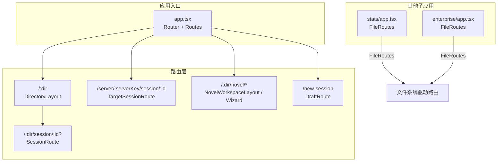
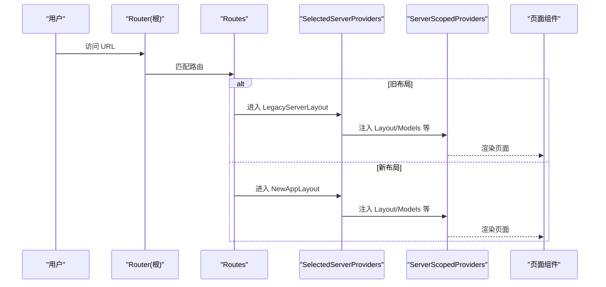
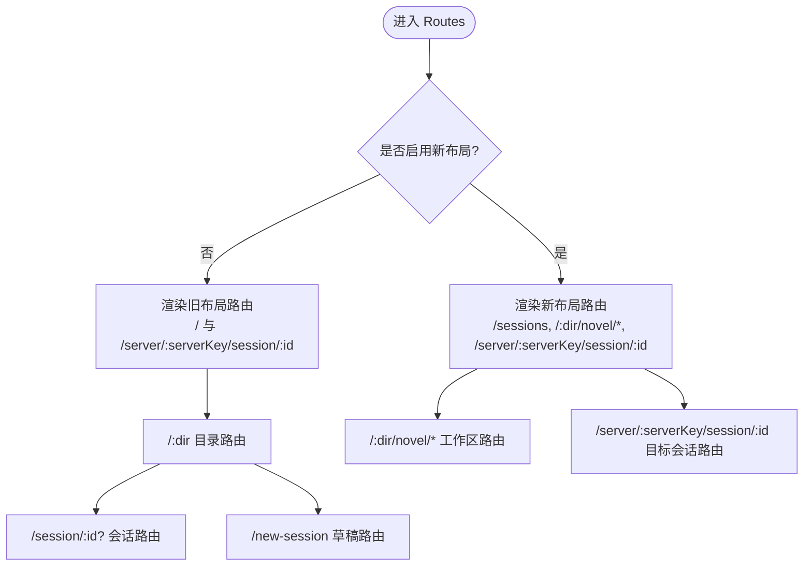
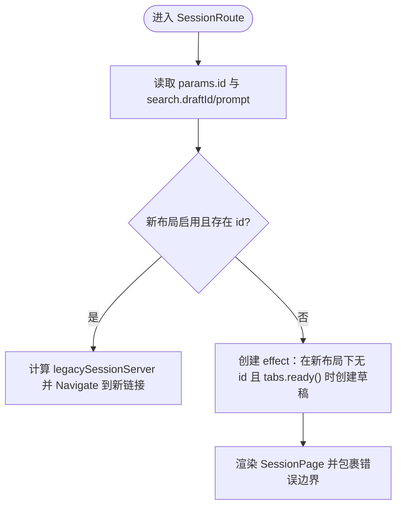
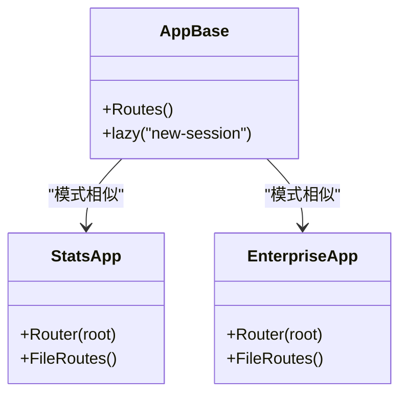
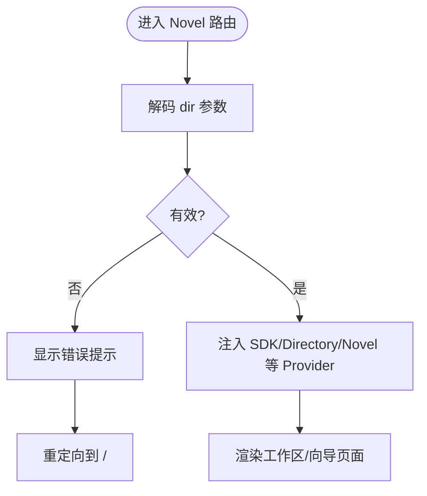
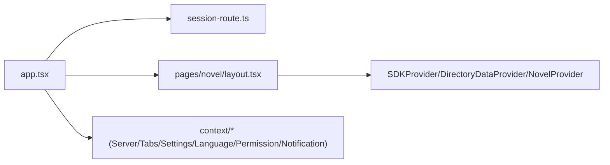

# 路由与导航

<cite>
**本文引用的文件**   
- [packages/app/src/app.tsx](file://packages/app/src/app.tsx)
- [packages/app/src/utils/session-route.ts](file://packages/app/src/utils/session-route.ts)
- [packages/app/src/pages/novel/layout.tsx](file://packages/app/src/pages/novel/layout.tsx)
- [packages/stats/app/src/app.tsx](file://packages/stats/app/src/app.tsx)
- [packages/enterprise/src/app.tsx](file://packages/enterprise/src/app.tsx)
- [packages/opencode/src/server/routes/instance/httpapi/novel-reader.ts](file://packages/opencode/src/server/routes/instance/httpapi/novel-reader.ts)
</cite>

## 目录
1. [简介](#简介)
2. [项目结构](#项目结构)
3. [核心组件](#核心组件)
4. [架构总览](#架构总览)
5. [详细组件分析](#详细组件分析)
6. [依赖关系分析](#依赖关系分析)
7. [性能考虑](#性能考虑)
8. [故障排查指南](#故障排查指南)
9. [结论](#结论)
10. [附录](#附录)

## 简介
本文件面向 openNovel 的路由与导航系统，基于 Solid Router 实现。内容涵盖：
- 静态、动态与嵌套路由的设计与组织
- 路由参数处理（路径参数、查询参数）与重定向逻辑
- 页面懒加载策略（代码分割、预加载与缓存优化）
- 导航状态管理（面包屑、历史记录、深度链接支持）
- 权限控制路由（角色验证、资源访问控制、重定向）
- 路由性能优化、SEO 友好配置与移动端适配
- 路由测试策略与常见问题排查

## 项目结构
openNovel 的 Web 应用入口通过 Solid Router 提供根路由容器，并在不同子应用中复用相同模式。核心路由定义集中在应用主入口中，按“旧布局/新布局”双分支组织，同时包含服务器作用域路由与 Novel 工作区路由。

图表来源
- [packages/app/src/app.tsx:586-621](file://packages/app/src/app.tsx#L586-L621)
- [packages/stats/app/src/app.tsx:1-35](file://packages/stats/app/src/app.tsx#L1-L35)
- [packages/enterprise/src/app.tsx:71-94](file://packages/enterprise/src/app.tsx#L71-L94)

章节来源
- [packages/app/src/app.tsx:586-621](file://packages/app/src/app.tsx#L586-L621)
- [packages/stats/app/src/app.tsx:1-35](file://packages/stats/app/src/app.tsx#L1-L35)
- [packages/enterprise/src/app.tsx:71-94](file://packages/enterprise/src/app.tsx#L71-L94)

## 核心组件
- Router 根容器：设置 base、transformUrl、root 包裹 Provider，并挂载 FileRoutes 或自定义 Routes。
- Routes 路由表：根据设置开关选择新旧布局路由；包含目录路由、会话路由、目标服务器会话路由、Novel 工作区路由与草稿路由。
- SessionRoute：解析路径参数与查询参数，结合 Tabs 与 SDK 上下文进行重定向与渲染。
- TargetSessionRoute：基于 serverKey 解析服务器身份，注入 ServerSDKProvider 与 ServerSyncProvider。
- NovelWorkspaceLayout / NovelWizardLayout：解析 dir 参数，校验有效性，错误时提示并重定向至首页。
- DraftRoute：根据 draftId 查找 Tab，必要时重定向到对应目录会话或渲染新建会话页。

章节来源
- [packages/app/src/app.tsx:1-120](file://packages/app/src/app.tsx#L1-L120)
- [packages/app/src/app.tsx:586-621](file://packages/app/src/app.tsx#L586-L621)
- [packages/app/src/pages/novel/layout.tsx:1-91](file://packages/app/src/pages/novel/layout.tsx#L1-L91)

## 架构总览
下图展示了从 Router 根到具体页面的调用链与数据提供者装配过程，包括服务器作用域与目录作用域的 Provider 注入顺序。

图表来源
- [packages/app/src/app.tsx:550-584](file://packages/app/src/app.tsx#L550-L584)
- [packages/app/src/app.tsx:586-621](file://packages/app/src/app.tsx#L586-L621)

## 详细组件分析

### 路由表与嵌套路由设计
- 静态路由：如 “/sessions”、“/new-session”。
- 动态路由：如 “/:dir/session/:id?”、“/:dir/novel/:novelID”、“/server/:serverKey/session/:id”。
- 嵌套路由：以 “/:dir” 为父级，嵌套 “session/:id?”；Novel 工作区在 “/:dir/novel/*” 下进一步嵌套。
- 重定向：当新布局启用时，旧版 “/:dir/session” 无 id 的情况被替换为 “/new-session?draftId=…”。

图表来源
- [packages/app/src/app.tsx:586-621](file://packages/app/src/app.tsx#L586-L621)

章节来源
- [packages/app/src/app.tsx:586-621](file://packages/app/src/app.tsx#L586-L621)

### 路由参数处理（路径参数与查询参数）
- 路径参数：使用 useParams 获取 dir、serverKey、novelID、id 等。
- 查询参数：使用 useSearchParams 获取 draftId、prompt 等。
- 参数校验：requireServerKey 对 serverKey 段进行 Base64 解码与合法性校验，非法则抛出错误。
- 参数转换：legacySessionHref 与 sessionHref 用于生成兼容新旧布局的会话链接。

图表来源
- [packages/app/src/app.tsx:76-110](file://packages/app/src/app.tsx#L76-L110)
- [packages/app/src/utils/session-route.ts:1-40](file://packages/app/src/utils/session-route.ts#L1-L40)

章节来源
- [packages/app/src/app.tsx:76-110](file://packages/app/src/app.tsx#L76-L110)
- [packages/app/src/utils/session-route.ts:1-40](file://packages/app/src/utils/session-route.ts#L1-L40)

### 页面懒加载与代码分割
- 使用 Solid 的 lazy 函数对 “/new-session” 页面进行按需加载，减少首屏体积。
- 在其他子应用中采用 FileRoutes，由框架自动进行文件级路由与代码分割。

图表来源
- [packages/app/src/app.tsx:74](file://packages/app/src/app.tsx#L74)
- [packages/stats/app/src/app.tsx:1-35](file://packages/stats/app/src/app.tsx#L1-L35)
- [packages/enterprise/src/app.tsx:71-94](file://packages/enterprise/src/app.tsx#L71-L94)

章节来源
- [packages/app/src/app.tsx:74](file://packages/app/src/app.tsx#L74)
- [packages/stats/app/src/app.tsx:1-35](file://packages/stats/app/src/app.tsx#L1-L35)
- [packages/enterprise/src/app.tsx:71-94](file://packages/enterprise/src/app.tsx#L71-L94)

### 导航状态管理（面包屑、历史记录、深度链接）
- 历史记录：通过 Solid Router 的 Navigate 与 useNavigate 进行编程式导航，支持 replace 模式避免多余历史项。
- 深度链接：/server/:serverKey/session/:id 与 /:dir/session/:id 均支持直接打开特定会话；serverKey 与 dir 使用 Base64 编码保证稳定性。
- 面包屑：当前仓库未提供统一的面包屑组件实现，可在 DirectoryLayout 或各页面内自行维护。

章节来源
- [packages/app/src/app.tsx:149-165](file://packages/app/src/app.tsx#L149-L165)
- [packages/app/src/utils/session-route.ts:1-40](file://packages/app/src/utils/session-route.ts#L1-L40)

### 权限控制路由（角色验证、资源访问控制、重定向）
- 当前路由层未内置基于角色的访问控制（RBAC）。权限相关能力位于独立模块（如 TUI 中的 PermissionProvider），但并未在路由守卫中集成。
- 建议在需要保护的页面组件内部进行权限检查，或在路由组件外层封装统一的权限守卫组件，结合 useSettings 与全局权限上下文进行判断与重定向。

章节来源
- [packages/tui/src/context/permission.tsx:1-26](file://packages/tui/src/context/permission.tsx#L1-L26)

### Novel 工作区路由与参数校验
- NovelWorkspaceLayout 与 NovelWizardLayout 均对 dir 参数进行解码与校验，若无效则弹出错误提示并重定向至首页。
- 成功时注入 SDKProvider、DirectoryDataProvider 与 NovelProvider，确保工作区数据可用。

图表来源
- [packages/app/src/pages/novel/layout.tsx:1-91](file://packages/app/src/pages/novel/layout.tsx#L1-L91)

章节来源
- [packages/app/src/pages/novel/layout.tsx:1-91](file://packages/app/src/pages/novel/layout.tsx#L1-L91)

### 后端 Reader 路由（服务端侧）
- novelReaderRoute 暴露 /reader 与 /api/novels 等接口，用于小说阅读器与数据获取。
- directory 参数可从 URL 查询参数或请求头 x-opencode-directory 获取。

章节来源
- [packages/opencode/src/server/routes/instance/httpapi/novel-reader.ts:1-41](file://packages/opencode/src/server/routes/instance/httpapi/novel-reader.ts#L1-L41)

## 依赖关系分析
- app.tsx 作为路由与 Provider 装配的核心，依赖多个上下文（Server、Tabs、Settings、Language、Permission、Notification 等）。
- session-route.ts 提供会话链接生成与 serverKey 校验工具。
- novel/layout.tsx 依赖 SDK、Directory、Novel 等上下文，确保工作区数据流正确。

图表来源
- [packages/app/src/app.tsx:586-621](file://packages/app/src/app.tsx#L586-L621)
- [packages/app/src/utils/session-route.ts:1-40](file://packages/app/src/utils/session-route.ts#L1-L40)
- [packages/app/src/pages/novel/layout.tsx:1-91](file://packages/app/src/pages/novel/layout.tsx#L1-L91)

章节来源
- [packages/app/src/app.tsx:586-621](file://packages/app/src/app.tsx#L586-L621)
- [packages/app/src/utils/session-route.ts:1-40](file://packages/app/src/utils/session-route.ts#L1-L40)
- [packages/app/src/pages/novel/layout.tsx:1-91](file://packages/app/src/pages/novel/layout.tsx#L1-L91)

## 性能考虑
- 代码分割：对非首屏页面（如 new-session）使用 lazy 加载，降低初始包体。
- 路由切换开销：尽量将稳定的 Provider（如 Language、Theme、Meta）放在 Router root，避免重复挂载。
- 预加载与缓存：可结合浏览器缓存与 TanStack Query 的 refetch 策略（已在 QueryClient 中关闭不必要的自动 refetch）。
- SEO：在 stats/enterprise 子应用中通过 MetaProvider 与 Title 设置标题；在主应用中可根据页面动态更新 meta 信息。

[本节为通用指导，不直接分析具体文件]

## 故障排查指南
- 路径参数无效：
  - 症状：Novel 路由报错并跳转首页。
  - 原因：dir 参数无法解码或校验失败。
  - 处理：检查 URL 中 dir 是否为正确的 Base64 编码。
  章节来源
  - [packages/app/src/pages/novel/layout.tsx:1-91](file://packages/app/src/pages/novel/layout.tsx#L1-L91)

- serverKey 校验失败：
  - 症状：进入 /server/:serverKey/session/:id 时报错。
  - 原因：serverKey 段不是合法的 Base64 编码。
  - 处理：使用 requireServerKey 生成的链接，避免手动拼接。
  章节来源
  - [packages/app/src/utils/session-route.ts:1-40](file://packages/app/src/utils/session-route.ts#L1-L40)

- 新布局下的草稿重定向异常：
  - 症状：访问 “/:dir/session” 无 id 时未跳转到 “/new-session”。
  - 原因：tabs 未就绪或 sdk().directory 为空。
  - 处理：确认 Tabs 初始化完成与 SDK 目录已加载。
  章节来源
  - [packages/app/src/app.tsx:96-103](file://packages/app/src/app.tsx#L96-L103)

- 连接健康检查失败：
  - 症状：启动时显示连接错误界面。
  - 原因：服务器不可达或健康检查超时。
  - 处理：重试或切换到其他可用服务器。
  章节来源
  - [packages/app/src/app.tsx:401-470](file://packages/app/src/app.tsx#L401-L470)

## 结论
openNovel 的路由与导航系统以 Solid Router 为核心，通过清晰的静态/动态/嵌套路由组织，配合参数校验与重定向逻辑，实现了新旧布局并存与平滑迁移。懒加载与 Provider 分层提升了性能与可维护性。未来可在路由层引入统一的权限守卫与面包屑组件，进一步提升安全性与用户体验。

[本节为总结，不直接分析具体文件]

## 附录
- 路由最佳实践建议：
  - 所有敏感路径参数应进行解码与校验，避免 XSS 与越权访问。
  - 将稳定 Provider 置于 Router root，减少重复挂载。
  - 对大体积页面使用 lazy 加载，并结合骨架屏提升感知性能。
  - 在需要权限控制的页面组件内实施细粒度鉴权，必要时封装路由守卫。
  - 使用统一的链接生成工具（如 sessionHref、legacySessionHref）确保兼容性。

[本节为通用指导，不直接分析具体文件]