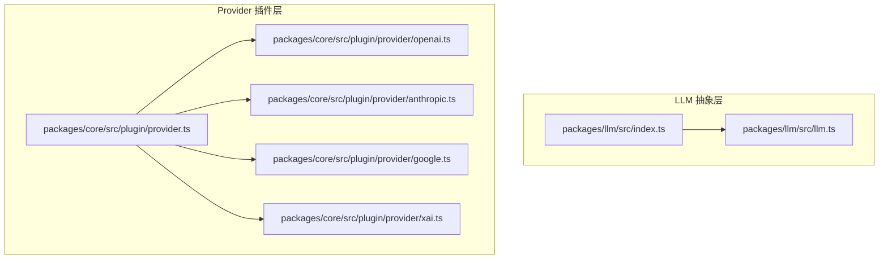
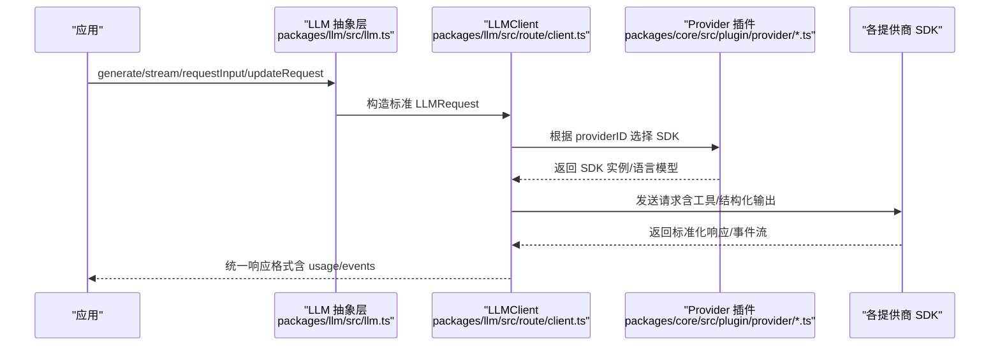
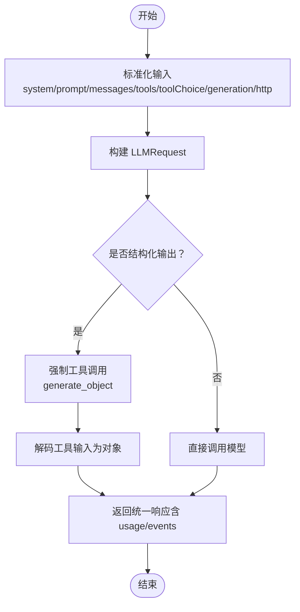
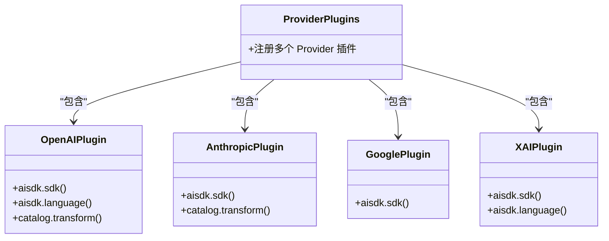
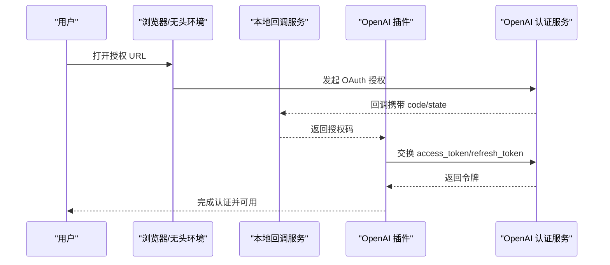
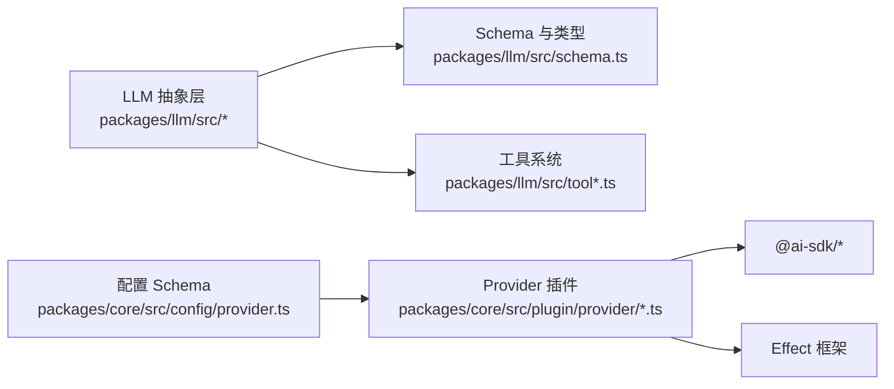

# AI 提供商适配层

<cite>
**本文引用的文件**   
- [packages/llm/src/index.ts](file://packages/llm/src/index.ts)
- [packages/llm/src/llm.ts](file://packages/llm/src/llm.ts)
- [packages/core/src/plugin/provider.ts](file://packages/core/src/plugin/provider.ts)
- [packages/core/src/plugin/provider/openai.ts](file://packages/core/src/plugin/provider/openai.ts)
- [packages/core/src/plugin/provider/anthropic.ts](file://packages/core/src/plugin/provider/anthropic.ts)
- [packages/core/src/plugin/provider/google.ts](file://packages/core/src/plugin/provider/google.ts)
- [packages/core/src/plugin/provider/xai.ts](file://packages/core/src/plugin/provider/xai.ts)
- [packages/core/src/config/provider.ts](file://packages/core/src/config/provider.ts)
- [packages/core/src/provider.ts](file://packages/core/src/provider.ts)
</cite>

## 目录
1. [简介](#简介)
2. [项目结构](#项目结构)
3. [核心组件](#核心组件)
4. [架构总览](#架构总览)
5. [详细组件分析](#详细组件分析)
6. [依赖关系分析](#依赖关系分析)
7. [性能考量](#性能考量)
8. [故障排查指南](#故障排查指南)
9. [结论](#结论)
10. [附录：新提供商接入指南](#附录新提供商接入指南)

## 简介
本文件面向“AI 提供商适配层”的设计与实现，聚焦统一接口、参数映射、响应格式化、适配器模式（请求转换、错误处理、数据标准化），以及多提供商（OpenAI、Anthropic、Google、X.AI 等）的具体差异与配置方法。同时提供新提供商接入的开发指南，包括接口要求、测试要点、配置示例、动态加载与版本兼容性策略。

## 项目结构
该适配层由两部分组成：
- LLM 抽象层（packages/llm）：定义统一的请求/响应模型、工具调用、结构化输出生成、事件流等能力，屏蔽底层协议差异。
- Provider 插件层（packages/core/src/plugin/provider）：以插件形式注册各提供商的 SDK 实例、语言模型绑定、请求头增强、OAuth 集成等。

**图示来源** 
- [packages/llm/src/index.ts:1-34](file://packages/llm/src/index.ts#L1-L34)
- [packages/llm/src/llm.ts:1-187](file://packages/llm/src/llm.ts#L1-L187)
- [packages/core/src/plugin/provider.ts:1-72](file://packages/core/src/plugin/provider.ts#L1-L72)
- [packages/core/src/plugin/provider/openai.ts:1-293](file://packages/core/src/plugin/provider/openai.ts#L1-L293)
- [packages/core/src/plugin/provider/anthropic.ts:1-28](file://packages/core/src/plugin/provider/anthropic.ts#L1-L28)
- [packages/core/src/plugin/provider/google.ts:1-16](file://packages/core/src/plugin/provider/google.ts#L1-L16)
- [packages/core/src/plugin/provider/xai.ts:1-23](file://packages/core/src/plugin/provider/xai.ts#L1-L23)

**章节来源**
- [packages/llm/src/index.ts:1-34](file://packages/llm/src/index.ts#L1-L34)
- [packages/core/src/plugin/provider.ts:1-72](file://packages/core/src/plugin/provider.ts#L1-L72)

## 核心组件
- 统一入口与类型导出：LLM 模块对外暴露客户端、认证、Provider 定义、工具系统、事件与错误类型等，确保上层调用一致。
- 请求构建与标准化：将用户输入（system/prompt/messages/tools/toolChoice/generation/http/providerOptions）转换为标准 LLMRequest，并支持更新与补丁。
- 结构化输出：通过内部强制工具调用，使所有提供商返回一致的 JSON 对象结果，避免各提供商原生 JSON 模式的差异。
- 插件化 Provider：每个提供商以插件形式注入 SDK 实例、语言模型绑定、请求头增强、OAuth 流程等。

**章节来源**
- [packages/llm/src/index.ts:1-34](file://packages/llm/src/index.ts#L1-L34)
- [packages/llm/src/llm.ts:1-187](file://packages/llm/src/llm.ts#L1-L187)

## 架构总览
下图展示了从应用调用到具体提供商 SDK 的完整链路，包含请求标准化、工具选择、结构化输出、以及各提供商的差异化处理。

**图示来源** 
- [packages/llm/src/llm.ts:1-187](file://packages/llm/src/llm.ts#L1-L187)
- [packages/core/src/plugin/provider/openai.ts:154-189](file://packages/core/src/plugin/provider/openai.ts#L154-L189)
- [packages/core/src/plugin/provider/anthropic.ts:4-27](file://packages/core/src/plugin/provider/anthropic.ts#L4-L27)
- [packages/core/src/plugin/provider/google.ts:4-15](file://packages/core/src/plugin/provider/google.ts#L4-L15)
- [packages/core/src/plugin/provider/xai.ts:5-22](file://packages/core/src/plugin/provider/xai.ts#L5-L22)

## 详细组件分析

### 统一接口与请求标准化（LLM 抽象层）
- 输入规范化：将 system/prompt/messages/tools/toolChoice/generation/http/providerOptions 等输入统一为 LLMRequest，保证下游一致性。
- 结构化输出：generateObject 通过强制工具调用，屏蔽各提供商 JSON 模式差异，返回统一对象与响应元信息。
- 事件与使用量：响应中包含 events 与 usage，便于追踪与计费。

**图示来源** 
- [packages/llm/src/llm.ts:49-75](file://packages/llm/src/llm.ts#L49-L75)
- [packages/llm/src/llm.ts:110-186](file://packages/llm/src/llm.ts#L110-L186)

**章节来源**
- [packages/llm/src/llm.ts:49-75](file://packages/llm/src/llm.ts#L49-L75)
- [packages/llm/src/llm.ts:110-186](file://packages/llm/src/llm.ts#L110-L186)

### Provider 插件与 SDK 注入
- 插件注册：ProviderPlugins 集中注册各提供商插件，按 id 区分。
- SDK 注入：插件在 aisdk.sdk 钩子中按需动态导入对应 SDK 包并创建实例。
- 语言模型绑定：部分插件在 aisdk.language 钩子中将模型与特定语言 API（如 responses）绑定。
- 请求头增强：例如 Anthropic 插件为请求添加 beta 特性头。

**图示来源** 
- [packages/core/src/plugin/provider.ts:36-71](file://packages/core/src/plugin/provider.ts#L36-L71)
- [packages/core/src/plugin/provider/openai.ts:154-189](file://packages/core/src/plugin/provider/openai.ts#L154-L189)
- [packages/core/src/plugin/provider/anthropic.ts:4-27](file://packages/core/src/plugin/provider/anthropic.ts#L4-L27)
- [packages/core/src/plugin/provider/google.ts:4-15](file://packages/core/src/plugin/provider/google.ts#L4-L15)
- [packages/core/src/plugin/provider/xai.ts:5-22](file://packages/core/src/plugin/provider/xai.ts#L5-L22)

**章节来源**
- [packages/core/src/plugin/provider.ts:36-71](file://packages/core/src/plugin/provider.ts#L36-L71)
- [packages/core/src/plugin/provider/openai.ts:154-189](file://packages/core/src/plugin/provider/openai.ts#L154-L189)
- [packages/core/src/plugin/provider/anthropic.ts:4-27](file://packages/core/src/plugin/provider/anthropic.ts#L4-L27)
- [packages/core/src/plugin/provider/google.ts:4-15](file://packages/core/src/plugin/provider/google.ts#L4-L15)
- [packages/core/src/plugin/provider/xai.ts:5-22](file://packages/core/src/plugin/provider/xai.ts#L5-L22)

### OpenAI 插件：OAuth 与 Responses 语言绑定
- OAuth 流程：支持浏览器与无头两种授权方式，本地回调端口用于接收授权码，完成 token 交换与刷新。
- 模型别名：对特定模型进行启用/禁用控制，适配不同 API 路径（Responses vs Chat Completions）。
- 语言绑定：将 OpenAI 模型绑定到 responses 语言 API，统一结构化输出行为。

**图示来源** 
- [packages/core/src/plugin/provider/openai.ts:39-94](file://packages/core/src/plugin/provider/openai.ts#L39-L94)
- [packages/core/src/plugin/provider/openai.ts:96-152](file://packages/core/src/plugin/provider/openai.ts#L96-L152)
- [packages/core/src/plugin/provider/openai.ts:195-224](file://packages/core/src/plugin/provider/openai.ts#L195-L224)

**章节来源**
- [packages/core/src/plugin/provider/openai.ts:39-94](file://packages/core/src/plugin/provider/openai.ts#L39-L94)
- [packages/core/src/plugin/provider/openai.ts:96-152](file://packages/core/src/plugin/provider/openai.ts#L96-L152)
- [packages/core/src/plugin/provider/openai.ts:195-224](file://packages/core/src/plugin/provider/openai.ts#L195-L224)

### Anthropic 插件：请求头增强
- 为所有 Anthropic 请求添加 beta 特性头，启用 interleaved-thinking 与 fine-grained tool streaming。
- 动态导入 @ai-sdk/anthropic 并创建 SDK 实例。

**章节来源**
- [packages/core/src/plugin/provider/anthropic.ts:4-27](file://packages/core/src/plugin/provider/anthropic.ts#L4-L27)

### Google 插件：SDK 注入
- 动态导入 @ai-sdk/google 并创建 GenerativeAI SDK 实例。

**章节来源**
- [packages/core/src/plugin/provider/google.ts:4-15](file://packages/core/src/plugin/provider/google.ts#L4-L15)

### X.AI 插件：Responses 语言绑定
- 动态导入 @ai-sdk/xai 并创建 SDK 实例。
- 将 X.AI 模型绑定到 responses 语言 API，统一结构化输出。

**章节来源**
- [packages/core/src/plugin/provider/xai.ts:5-22](file://packages/core/src/plugin/provider/xai.ts#L5-L22)

### 配置与 Schema：Provider/Model 描述
- 配置项涵盖 headers/body、成本、限制、变体、能力等，支持 AISDK 与 Native 两种 API 类型。
- Info 描述 Provider 基本信息、环境变量、API 类型、请求模板与模型集合。

**章节来源**
- [packages/core/src/config/provider.ts:7-72](file://packages/core/src/config/provider.ts#L7-L72)
- [packages/core/src/provider.ts:1-26](file://packages/core/src/provider.ts#L1-L26)

## 依赖关系分析
- LLM 抽象层依赖 schema、tool、tool-runtime 等模块，提供统一请求/响应与工具执行能力。
- Provider 插件依赖 Effect 框架与各自 SDK 包，通过 ctx.aisdk 钩子注入 SDK 实例与语言模型。
- 配置层通过 Schema 校验 Provider/Model 描述，确保运行时安全与一致性。

**图示来源** 
- [packages/llm/src/index.ts:1-34](file://packages/llm/src/index.ts#L1-L34)
- [packages/core/src/plugin/provider.ts:36-71](file://packages/core/src/plugin/provider.ts#L36-L71)
- [packages/core/src/config/provider.ts:7-72](file://packages/core/src/config/provider.ts#L7-L72)

**章节来源**
- [packages/llm/src/index.ts:1-34](file://packages/llm/src/index.ts#L1-L34)
- [packages/core/src/plugin/provider.ts:36-71](file://packages/core/src/plugin/provider.ts#L36-L71)
- [packages/core/src/config/provider.ts:7-72](file://packages/core/src/config/provider.ts#L7-L72)

## 性能考量
- 结构化输出通过工具调用实现，可能增加一次往返；若需极致性能，可评估提供商原生 JSON 模式（但会牺牲一致性）。
- 动态导入 SDK 可减少冷启动开销，按需加载。
- 事件流与 usage 统计有助于监控与限流，建议结合缓存与重试策略优化。

[本节为通用指导，不直接分析具体文件]

## 故障排查指南
- 结构化输出失败：检查工具解码与 schema 匹配，确认模型是否按要求调用强制工具。
- OAuth 异常：核对本地回调端口、state 校验、token 交换与刷新逻辑。
- 请求头缺失：确认 Anthropic 等插件是否正确注入 beta 头。
- 模型不可用：检查 catalog.transform 中的启用/禁用逻辑与模型 ID 映射。

**章节来源**
- [packages/llm/src/llm.ts:110-186](file://packages/llm/src/llm.ts#L110-L186)
- [packages/core/src/plugin/provider/openai.ts:195-224](file://packages/core/src/plugin/provider/openai.ts#L195-L224)
- [packages/core/src/plugin/provider/anthropic.ts:4-27](file://packages/core/src/plugin/provider/anthropic.ts#L4-L27)

## 结论
该适配层通过 LLM 抽象层统一请求/响应与工具调用，配合 Provider 插件机制实现多提供商的动态加载与差异化处理。结构化输出与事件流保障了一致性与可观测性，配置 Schema 确保部署安全。整体设计具备良好的扩展性与可维护性。

[本节为总结，不直接分析具体文件]

## 附录：新提供商接入指南

### 接口实现要求
- 插件定义：在 ProviderPlugins 中注册新插件，提供唯一 id。
- SDK 注入：在 ctx.aisdk.sdk 钩子中动态导入并创建 SDK 实例。
- 语言绑定（可选）：在 ctx.aisdk.language 钩子中将模型绑定到特定语言 API（如 responses）。
- 请求头增强（可选）：在 ctx.catalog.transform 中为请求添加必要头部或特性开关。

**章节来源**
- [packages/core/src/plugin/provider.ts:36-71](file://packages/core/src/plugin/provider.ts#L36-L71)
- [packages/core/src/plugin/provider/anthropic.ts:4-27](file://packages/core/src/plugin/provider/anthropic.ts#L4-L27)
- [packages/core/src/plugin/provider/google.ts:4-15](file://packages/core/src/plugin/provider/google.ts#L4-L15)
- [packages/core/src/plugin/provider/xai.ts:5-22](file://packages/core/src/plugin/provider/xai.ts#L5-L22)

### 测试用例编写
- 覆盖结构化输出：验证 generateObject 是否能正确解码工具输入并返回对象。
- 覆盖事件流：验证 events 与 usage 字段是否存在且符合预期。
- 覆盖 OAuth：验证授权码交换、token 刷新与错误处理。

[本节为通用指导，不直接分析具体文件]

### 配置示例
- Provider Info：包含 name、env、api（AISDK/Native）、request（headers/body/variant）、models 等。
- Model 描述：包含 family、name、capabilities、cost、limit、variants 等。

**章节来源**
- [packages/core/src/config/provider.ts:7-72](file://packages/core/src/config/provider.ts#L7-L72)

### 提供商选择策略
- 基于 providerID 与 api.type/package 精确匹配 SDK 实例。
- 支持 AISDK 与 Native 两种 API 类型，优先使用 AISDK 以获得一致行为。

**章节来源**
- [packages/core/src/provider.ts:1-26](file://packages/core/src/provider.ts#L1-L26)
- [packages/core/src/config/provider.ts:7-72](file://packages/core/src/config/provider.ts#L7-L72)

### 动态加载机制
- 插件在运行时按需动态导入 SDK 包，减少初始负载。
- 通过 ctx.aisdk.sdk/language 钩子注入 SDK 与语言模型。

**章节来源**
- [packages/core/src/plugin/provider/openai.ts:175-187](file://packages/core/src/plugin/provider/openai.ts#L175-L187)
- [packages/core/src/plugin/provider/anthropic.ts:19-25](file://packages/core/src/plugin/provider/anthropic.ts#L19-L25)
- [packages/core/src/plugin/provider/google.ts:7-13](file://packages/core/src/plugin/provider/google.ts#L7-L13)
- [packages/core/src/plugin/provider/xai.ts:8-19](file://packages/core/src/plugin/provider/xai.ts#L8-L19)

### 版本兼容性处理
- 通过 catalog.transform 调整模型启用状态与别名，适配不同 API 路径。
- 使用 Effect 的错误处理与重试策略提升鲁棒性。

**章节来源**
- [packages/core/src/plugin/provider/openai.ts:161-174](file://packages/core/src/plugin/provider/openai.ts#L161-L174)
- [packages/llm/src/llm.ts:110-186](file://packages/llm/src/llm.ts#L110-L186)