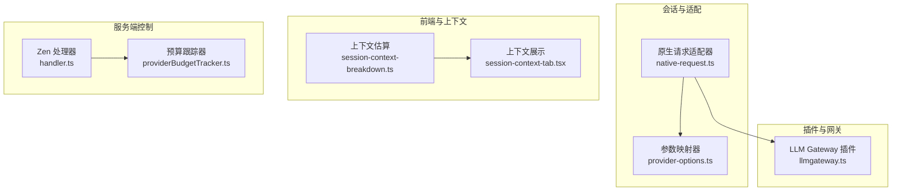
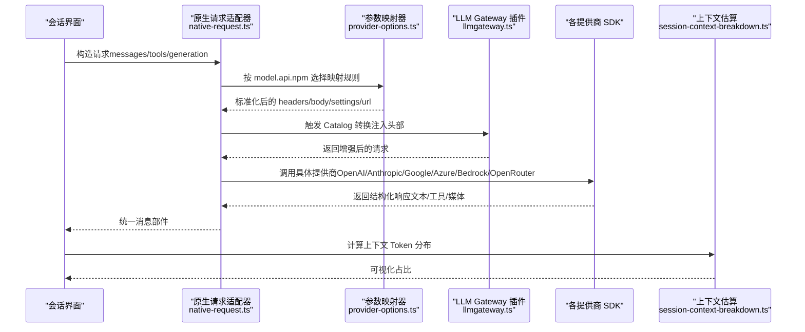
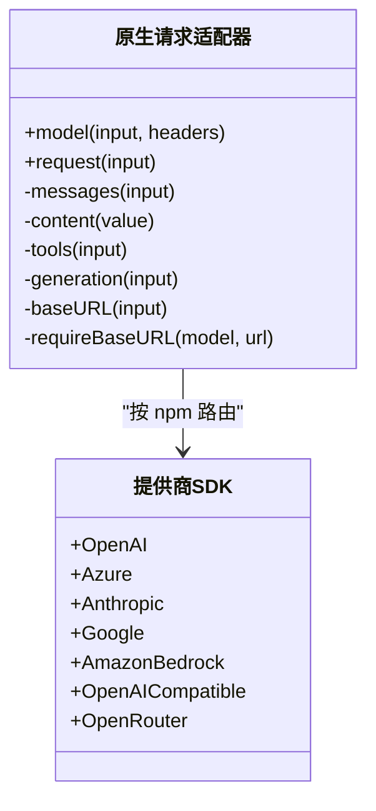
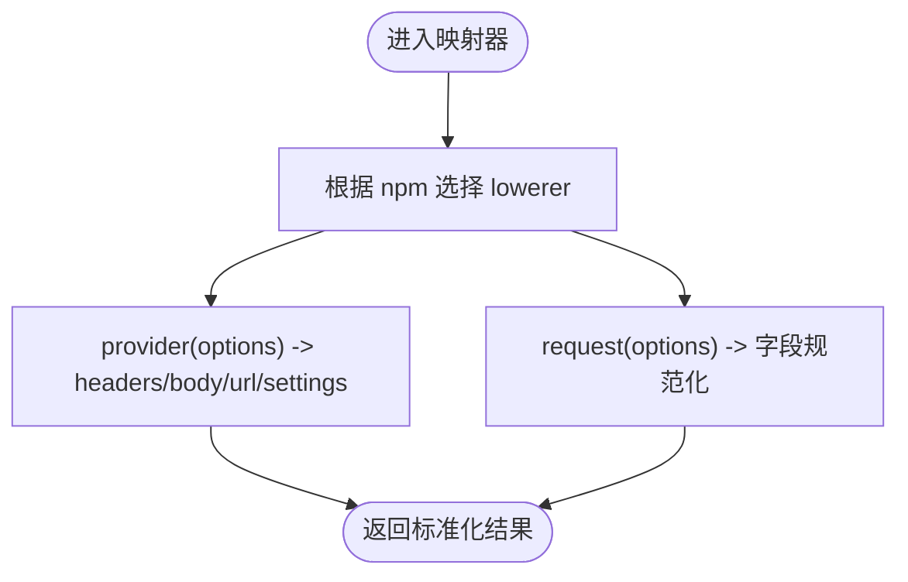
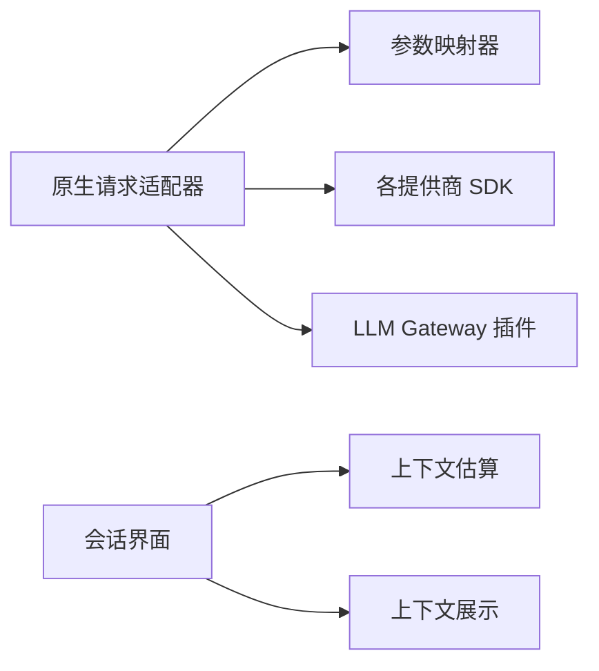
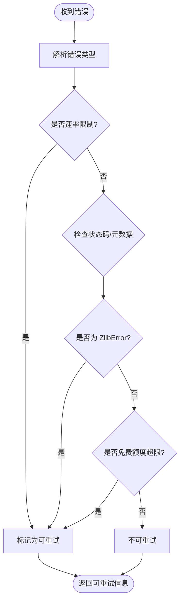

# AI 集成

<cite>
**本文引用的文件**   
- [native-request.ts](file://packages/opencode/src/session/llm/native-request.ts)
- [provider-options.ts](file://packages/core/src/v1/config/provider-options.ts)
- [llmgateway.ts](file://packages/core/src/plugin/provider/llmgateway.ts)
- [session-context-breakdown.ts](file://packages/app/src/components/session/session-context-breakdown.ts)
- [session-context-tab.tsx](file://packages/app/src/components/session/session-context-tab.tsx)
- [compaction.ts](file://packages/core/src/session/compaction.ts)
- [retry.test.ts](file://packages/opencode/test/session/retry.test.ts)
- [handler.ts](file://packages/console/app/src/routes/zen/util/handler.ts)
- [providerBudgetTracker.ts](file://packages/console/app/src/routes/zen/util/providerBudgetTracker.ts)
- [dialog-custom-provider-form.ts](file://packages/app/src/components/dialog-custom-provider-form.ts)
- [provider.ts](file://packages/core/src/v1/config/provider.ts)
</cite>

## 目录
1. [简介](#简介)
2. [项目结构](#项目结构)
3. [核心组件](#核心组件)
4. [架构总览](#架构总览)
5. [详细组件分析](#详细组件分析)
6. [依赖关系分析](#依赖关系分析)
7. [性能与成本优化](#性能与成本优化)
8. [故障转移、负载均衡与重试策略](#故障转移负载均衡与重试策略)
9. [调试、日志与监控](#调试日志与监控)
10. [结论](#结论)
11. [附录：配置与使用指南](#附录配置与使用指南)

## 简介
本文件面向 openNovel 的 AI 集成系统，系统性阐述多提供商适配层的设计与实现，涵盖统一接口定义、参数映射与响应格式化；详细说明支持的 AI 提供商（OpenAI、Anthropic、Google、Azure、Bedrock、OpenRouter 及 OpenAI 兼容生态）的配置与使用方法；解释提示工程（系统提示模板、上下文管理与输出解析）；描述故障转移机制、负载均衡与请求重试策略；并给出成本优化、速率限制与配额管理方案，以及调试工具、日志记录与性能监控建议。

## 项目结构
openNovel 的 AI 集成由多个包协同完成：
- 会话与原生适配器：负责将上层会话消息转换为各 SDK 可识别的请求格式，并路由到具体提供商。
- 配置与参数映射：提供统一的 provider 选项下推器，将通用配置映射为各提供商所需的头部、URL、Body 与设置。
- 插件与网关：通过插件在运行时注入特定头信息或修改请求行为（例如 LLM Gateway）。
- 前端上下文估算：对会话上下文进行 Token 估算与可视化，辅助提示工程与成本控制。
- 控制台侧预算与限流：在服务端对提供商预算、TPM/TPS 等指标进行跟踪与限制。

图表来源 
- [native-request.ts:153-179](file://packages/opencode/src/session/llm/native-request.ts#L153-L179)
- [provider-options.ts:128-160](file://packages/core/src/v1/config/provider-options.ts#L128-L160)
- [llmgateway.ts:1-27](file://packages/core/src/plugin/provider/llmgateway.ts#L1-L27)
- [session-context-breakdown.ts:1-132](file://packages/app/src/components/session/session-context-breakdown.ts#L1-L132)
- [session-context-tab.tsx:155-198](file://packages/app/src/components/session/session-context-tab.tsx#L155-L198)
- [handler.ts:602-849](file://packages/console/app/src/routes/zen/util/handler.ts#L602-L849)
- [providerBudgetTracker.ts:39-58](file://packages/console/app/src/routes/zen/util/providerBudgetTracker.ts#L39-L58)

章节来源
- [native-request.ts:153-179](file://packages/opencode/src/session/llm/native-request.ts#L153-L179)
- [provider-options.ts:128-160](file://packages/core/src/v1/config/provider-options.ts#L128-L160)
- [llmgateway.ts:1-27](file://packages/core/src/plugin/provider/llmgateway.ts#L1-L27)
- [session-context-breakdown.ts:1-132](file://packages/app/src/components/session/session-context-breakdown.ts#L1-L132)
- [session-context-tab.tsx:155-198](file://packages/app/src/components/session/session-context-tab.tsx#L155-L198)
- [handler.ts:602-849](file://packages/console/app/src/routes/zen/util/handler.ts#L602-L849)
- [providerBudgetTracker.ts:39-58](file://packages/console/app/src/routes/zen/util/providerBudgetTracker.ts#L39-L58)

## 核心组件
- 原生请求适配器（Native Request Adapter）
  - 职责：将会话消息、工具定义、生成参数等统一封装为 @opencode-ai/llm 请求对象，并根据 model.api.npm 选择对应 SDK 客户端（OpenAI、Azure、Anthropic、Google、Bedrock、OpenAI Compatible、OpenRouter）。
  - 关键点：构建 baseURL、headers、limits（context/output），支持 system 消息与 tool-call/tool-result 内容部件，透传 providerOptions 与 providerMetadata。
- 参数映射器（Provider Options Lowerer）
  - 职责：将通用 Provider 配置下推为各提供商所需的 headers、body、url、settings，并对字段名进行规范化（如 snake_case）。
  - 关键点：针对 OpenAI、Anthropic、Google、Azure、Bedrock、OpenAI Compatible 等提供专用映射规则，处理 reasoning、text verbosity、generationConfig 等特性。
- LLM Gateway 插件
  - 职责：在 Catalog 转换阶段，对符合条件的 OpenAI Compatible 提供商（特定 URL）注入必要请求头（HTTP-Referer、X-Title、X-Source）。
- 上下文估算与展示
  - 职责：根据消息与部件估算系统、用户、助手、工具等 Token 占比，帮助定位上下文占用与成本热点。
- 压缩与摘要提示
  - 职责：基于历史对话生成“锚定摘要”，用于长上下文压缩与节省 Token。

章节来源
- [native-request.ts:153-179](file://packages/opencode/src/session/llm/native-request.ts#L153-L179)
- [provider-options.ts:128-160](file://packages/core/src/v1/config/provider-options.ts#L128-L160)
- [llmgateway.ts:1-27](file://packages/core/src/plugin/provider/llmgateway.ts#L1-L27)
- [session-context-breakdown.ts:1-132](file://packages/app/src/components/session/session-context-breakdown.ts#L1-L132)
- [compaction.ts:161-168](file://packages/core/src/session/compaction.ts#L161-L168)

## 架构总览
下图展示了从会话到多提供商的统一调用路径，包括参数映射、SDK 路由、插件注入与上下文估算。

图表来源 
- [native-request.ts:153-179](file://packages/opencode/src/session/llm/native-request.ts#L153-L179)
- [provider-options.ts:128-160](file://packages/core/src/v1/config/provider-options.ts#L128-L160)
- [llmgateway.ts:1-27](file://packages/core/src/plugin/provider/llmgateway.ts#L1-L27)
- [session-context-breakdown.ts:1-132](file://packages/app/src/components/session/session-context-breakdown.ts#L1-L132)

## 详细组件分析

### 原生请求适配器（Native Request Adapter）
- 设计要点
  - 统一输入：包含 model、apiKey、baseURL、system、messages、tools、toolChoice、temperature/topP/topK/maxOutputTokens、providerOptions、headers。
  - 消息与部件：支持 text、media、reasoning、tool-call、tool-result，保留 providerMetadata 与 providerExecuted。
  - 模型路由：依据 model.api.npm 选择 SDK 客户端，并为 Azure/OpenAI Compatible 强制要求 baseURL。
  - 生成参数：temperature、topP、topK、maxTokens 按需传递。
- 错误与边界
  - 不支持的 npm 包直接抛出错误，快速失败。
  - 对非对象 content parts 或非法 media data 类型进行校验。

图表来源 
- [native-request.ts:153-179](file://packages/opencode/src/session/llm/native-request.ts#L153-L179)

章节来源
- [native-request.ts:153-179](file://packages/opencode/src/session/llm/native-request.ts#L153-L179)

### 参数映射器（Provider Options Lowerer）
- 设计要点
  - 每个提供商有独立的 lowerer，负责：
    - provider(options)：生成 headers、body、url、settings。
    - request(options)：将通用字段映射为提供商 API 所需字段（如 snake_case、嵌套结构）。
  - 特殊处理：
    - OpenAI/Azure：Authorization Bearer、组织/项目、reasoning/text verbosity。
    - Anthropic：x-api-key/authToken、output_config（effort/task_budget）、metadata.userId。
    - Google：x-goog-api-key、generationConfig（thinkingConfig/responseModalities/mediaResolution/imageConfig）。
    - Bedrock：additionalModelRequestFields。
    - OpenAI Compatible：reasoning_effort 等兼容字段。
- 扩展性
  - 新增提供商只需添加 lowerer 并注册到映射表。

图表来源 
- [provider-options.ts:128-160](file://packages/core/src/v1/config/provider-options.ts#L128-L160)

章节来源
- [provider-options.ts:128-160](file://packages/core/src/v1/config/provider-options.ts#L128-L160)

### LLM Gateway 插件
- 设计要点
  - 在 Catalog 转换阶段遍历所有提供商，筛选出 disabled=false、api.type=aisdk、api.package=@ai-sdk/openai-compatible、api.url=https://api.llmgateway.io/v1 的项。
  - 若存在对应 Integration，则注入 HTTP-Referer、X-Title、X-Source 请求头。
- 适用场景
  - 统一接入第三方网关，便于审计与计费。

章节来源
- [llmgateway.ts:1-27](file://packages/core/src/plugin/provider/llmgateway.ts#L1-L27)

### 上下文估算与展示
- 设计要点
  - 统计 system/user/assistant/tool 四类内容的字符数，估算 Token 数量（近似 chars/4）。
  - 当估算总量超过 input 时，按比例缩放各部分 Token，剩余归入 other。
  - 前端展示百分比与宽度，帮助用户理解上下文占用。
- 使用位置
  - 会话 Tab 中动态计算并显示 breakdown。

章节来源
- [session-context-breakdown.ts:1-132](file://packages/app/src/components/session/session-context-breakdown.ts#L1-L132)
- [session-context-tab.tsx:155-198](file://packages/app/src/components/session/session-context-tab.tsx#L155-L198)

### 压缩与摘要提示
- 设计要点
  - 根据 previousSummary 与 context 生成“更新锚定摘要”的提示模板，减少长对话 Token 消耗。
- 使用位置
  - 会话压缩流程中构建 prompt。

章节来源
- [compaction.ts:161-168](file://packages/core/src/session/compaction.ts#L161-L168)

## 依赖关系分析
- 模块耦合
  - 原生请求适配器依赖参数映射器与 SDK 客户端；插件在 Catalog 阶段注入头部；前端估算与展示独立于后端。
- 外部依赖
  - 各提供商 SDK（@ai-sdk/* 与 @openrouter/ai-sdk-provider）。
- 潜在循环依赖
  - 当前未见循环导入；插件通过 Effect 与 Catalog 事件解耦。

图表来源 
- [native-request.ts:153-179](file://packages/opencode/src/session/llm/native-request.ts#L153-L179)
- [provider-options.ts:128-160](file://packages/core/src/v1/config/provider-options.ts#L128-L160)
- [llmgateway.ts:1-27](file://packages/core/src/plugin/provider/llmgateway.ts#L1-L27)
- [session-context-breakdown.ts:1-132](file://packages/app/src/components/session/session-context-breakdown.ts#L1-L132)
- [session-context-tab.tsx:155-198](file://packages/app/src/components/session/session-context-tab.tsx#L155-L198)

章节来源
- [native-request.ts:153-179](file://packages/opencode/src/session/llm/native-request.ts#L153-L179)
- [provider-options.ts:128-160](file://packages/core/src/v1/config/provider-options.ts#L128-L160)
- [llmgateway.ts:1-27](file://packages/core/src/plugin/provider/llmgateway.ts#L1-L27)
- [session-context-breakdown.ts:1-132](file://packages/app/src/components/session/session-context-breakdown.ts#L1-L132)
- [session-context-tab.tsx:155-198](file://packages/app/src/components/session/session-context-tab.tsx#L155-L198)

## 性能与成本优化
- 上下文 Token 估算
  - 通过 session-context-breakdown.ts 估算系统、用户、助手、工具 Token 占比，指导精简提示与裁剪历史。
- 压缩与摘要
  - 使用 compaction.ts 的摘要模板，降低长对话的 Token 消耗。
- 限额与超时
  - provider.ts 定义了 headerTimeout、chunkTimeout 等，避免长时间阻塞与资源浪费。
- 预算与配额
  - handler.ts 与 providerBudgetTracker.ts 结合 Redis 跟踪 TPM/TPS 与预算，防止超支。

章节来源
- [session-context-breakdown.ts:1-132](file://packages/app/src/components/session/session-context-breakdown.ts#L1-L132)
- [compaction.ts:161-168](file://packages/core/src/session/compaction.ts#L161-L168)
- [provider.ts:101-121](file://packages/core/src/v1/config/provider.ts#L101-L121)
- [handler.ts:602-849](file://packages/console/app/src/routes/zen/util/handler.ts#L602-L849)
- [providerBudgetTracker.ts:39-58](file://packages/console/app/src/routes/zen/util/providerBudgetTracker.ts#L39-L58)

## 故障转移、负载均衡与重试策略
- 重试判定
  - retry.test.ts 覆盖多种错误场景：数字错误码、非 JSON 消息、纯文本速率限制、Too many requests、服务不可用、ZlibError 解压失败、免费额度超限等。
- 负载均衡与优先级
  - handler.ts 根据权重、预算优先级、TPM/TPS 限制过滤候选提供商，并按权重展开候选列表。
- 预算跟踪
  - providerBudgetTracker.ts 使用 Redis 维护每提供商/优先级的有效预算与累计花费，确保跨优先级预算分配合理。

图表来源 
- [retry.test.ts:136-268](file://packages/opencode/test/session/retry.test.ts#L136-L268)

章节来源
- [retry.test.ts:136-268](file://packages/opencode/test/session/retry.test.ts#L136-L268)
- [handler.ts:602-849](file://packages/console/app/src/routes/zen/util/handler.ts#L602-L849)
- [providerBudgetTracker.ts:39-58](file://packages/console/app/src/routes/zen/util/providerBudgetTracker.ts#L39-L58)

## 调试、日志与监控
- 自定义提供商表单验证
  - dialog-custom-provider-form.ts 对名称、baseURL、重复 ID、头部键值等进行校验，提升配置质量。
- 日志与追踪
  - 建议在原生请求适配器与参数映射器中增加关键步骤日志（如 baseURL、headers、limits、映射前后对比）。
- 监控指标
  - 统计各提供商成功率、延迟、Token 用量、预算消耗、重试次数与失败原因分类。

章节来源
- [dialog-custom-provider-form.ts:66-100](file://packages/app/src/components/dialog-custom-provider-form.ts#L66-L100)

## 结论
openNovel 的 AI 集成通过原生请求适配器与参数映射器实现了多提供商的统一接入与灵活扩展；借助插件机制可在运行时注入必要的请求头；前端上下文估算与压缩摘要有助于控制 Token 成本；服务端预算与限流保障稳定性与公平性。整体架构清晰、可扩展性强，适合持续演进与多提供商生态对接。

## 附录：配置与使用指南
- 支持的提供商与 SDK
  - OpenAI、Azure、Anthropic、Google、Amazon Bedrock、OpenAI Compatible、OpenRouter。
- 配置要点
  - 为每个提供商设置 apiKey、baseURL（Azure 与 OpenAI Compatible 必须）、headers、body、settings。
  - 使用 provider-options.ts 中的 lowerer 进行字段映射与规范化。
- 使用步骤
  - 在会话中构造 messages、tools、generation 参数，调用 native-request.ts 的 request。
  - 如需接入 LLM Gateway，确保 api.type=aisdk、package=@ai-sdk/openai-compatible、url=https://api.llmgateway.io/v1，并存在对应 Integration。
- 成本与配额
  - 利用上下文估算与压缩摘要降低 Token 消耗。
  - 通过 handler.ts 与 providerBudgetTracker.ts 设置 TPM/TPS 与预算限制。

章节来源
- [native-request.ts:153-179](file://packages/opencode/src/session/llm/native-request.ts#L153-L179)
- [provider-options.ts:128-160](file://packages/core/src/v1/config/provider-options.ts#L128-L160)
- [llmgateway.ts:1-27](file://packages/core/src/plugin/provider/llmgateway.ts#L1-L27)
- [session-context-breakdown.ts:1-132](file://packages/app/src/components/session/session-context-breakdown.ts#L1-L132)
- [compaction.ts:161-168](file://packages/core/src/session/compaction.ts#L161-L168)
- [handler.ts:602-849](file://packages/console/app/src/routes/zen/util/handler.ts#L602-L849)
- [providerBudgetTracker.ts:39-58](file://packages/console/app/src/routes/zen/util/providerBudgetTracker.ts#L39-L58)