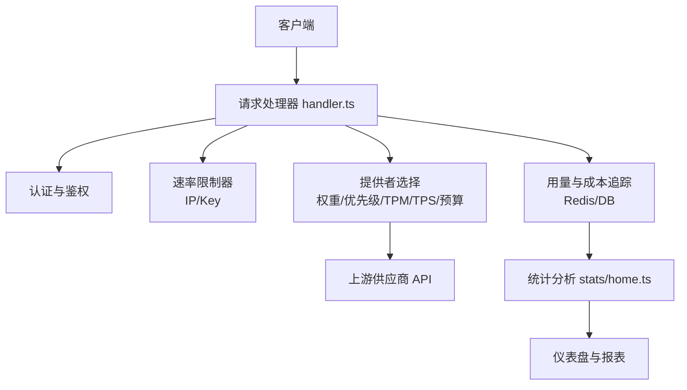
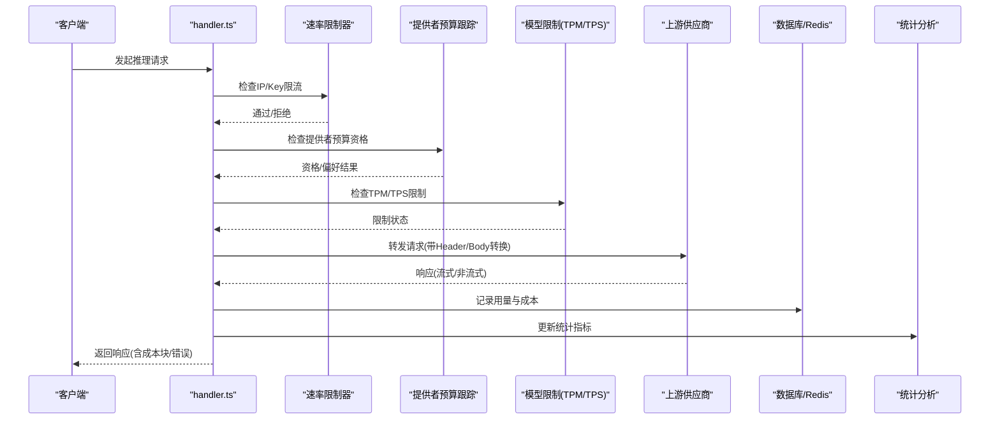
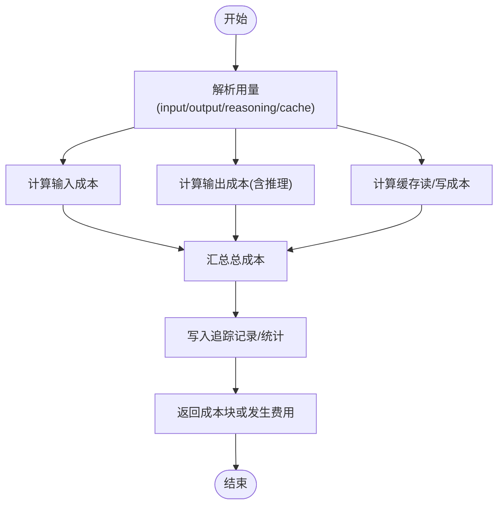
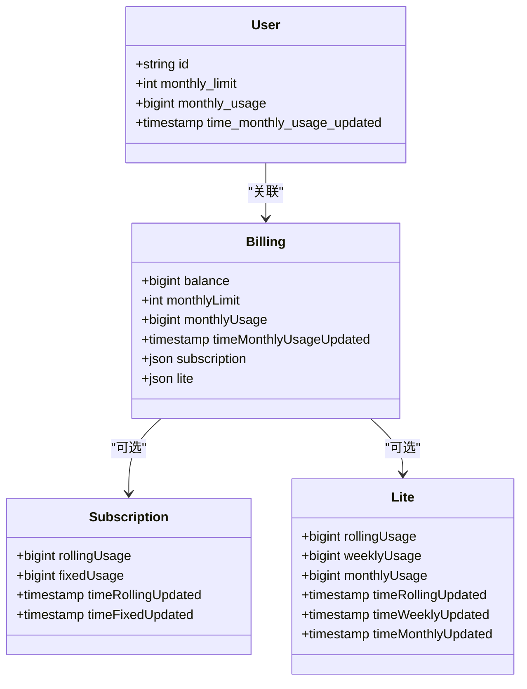
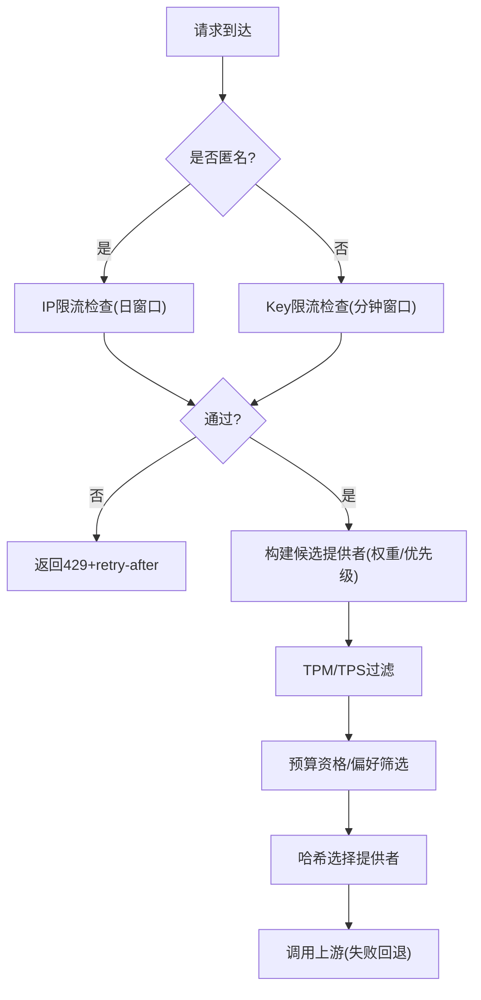
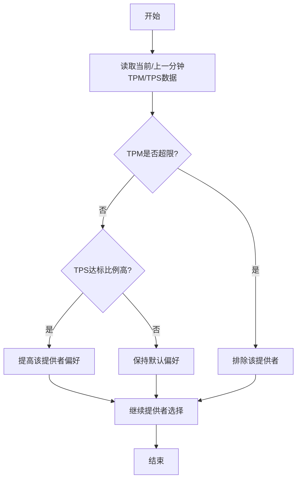
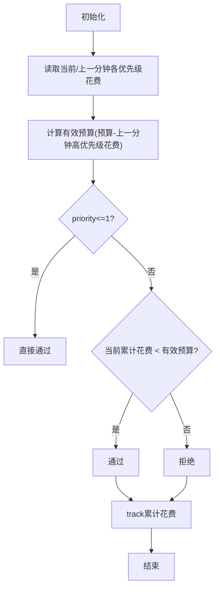
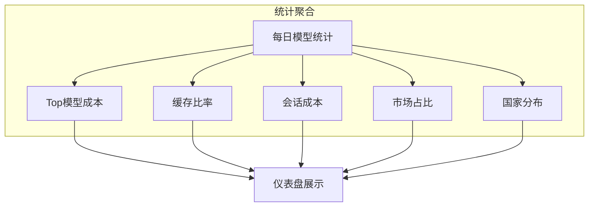
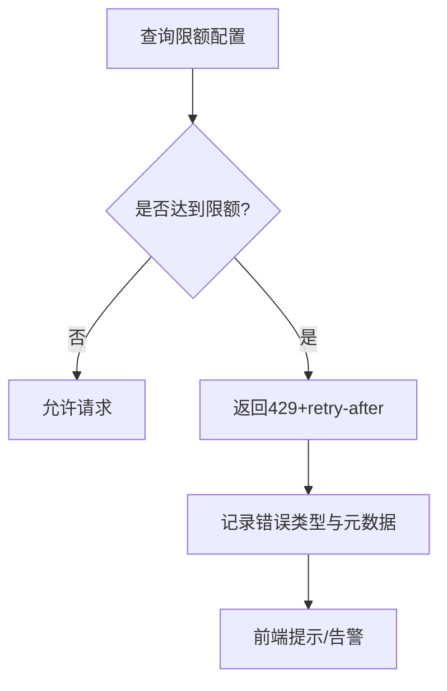
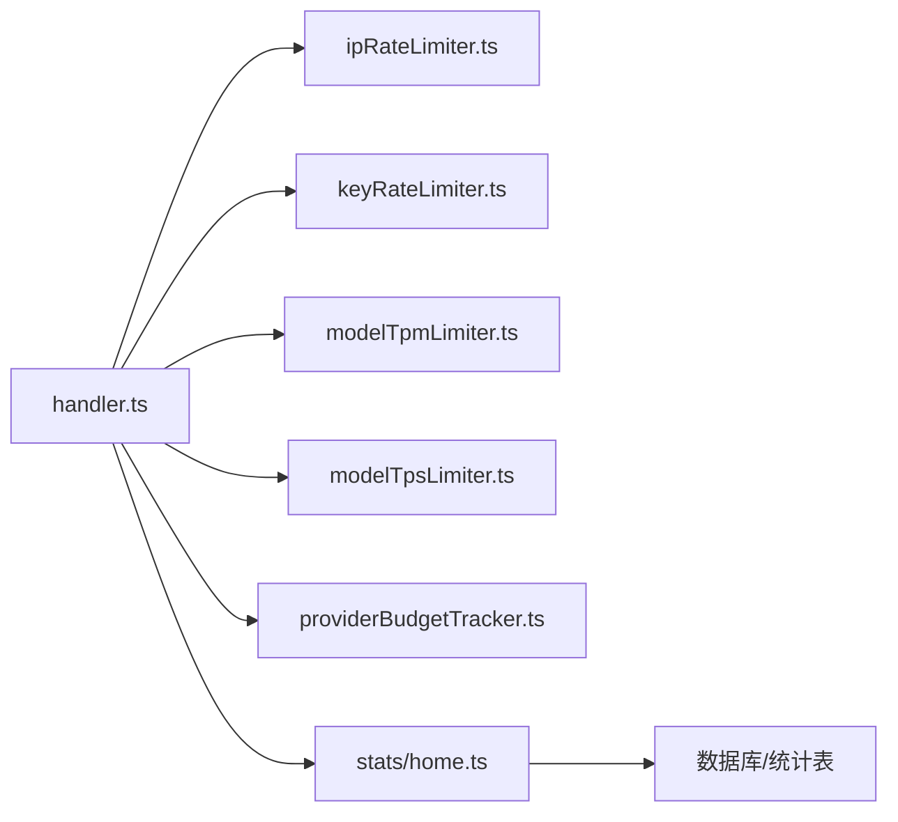

# 成本优化与配额管理

<cite>
**本文引用的文件**
- [packages/console/app/src/routes/zen/util/handler.ts](file://packages/console/app/src/routes/zen/util/handler.ts)
- [packages/console/app/src/routes/zen/util/providerBudgetTracker.ts](file://packages/console/app/src/routes/zen/util/providerBudgetTracker.ts)
- [packages/console/app/src/routes/zen/util/ipRateLimiter.ts](file://packages/console/app/src/routes/zen/util/ipRateLimiter.ts)
- [packages/console/app/src/routes/zen/util/keyRateLimiter.ts](file://packages/console/app/src/routes/zen/util/keyRateLimiter.ts)
- [packages/console/app/src/routes/zen/util/modelTpmLimiter.ts](file://packages/console/app/src/routes/zen/util/modelTpmLimiter.ts)
- [packages/console/app/src/routes/zen/util/modelTpsLimiter.ts](file://packages/console/app/src/routes/zen/util/modelTpsLimiter.ts)
- [packages/stats/core/src/domain/home.ts](file://packages/stats/core/src/domain/home.ts)
- [packages/stats/core/migrations/20260522121617_common_dust/migration.sql](file://packages/stats/core/migrations/20260522121617_common_dust/migration.sql)
- [packages/console/core/migrations/20260417071612_tidy_diamondback/migration.sql](file://packages/console/core/migrations/20260417071612_tidy_diamondback/migration.sql)
- [packages/console/core/migrations/20260414235536_lame_wild_child/migration.sql](file://packages/console/core/migrations/20260414235536_lame_wild_child/migration.sql)
- [packages/console/support/src/lib/lookup.ts](file://packages/console/support/src/lib/lookup.ts)
- [packages/console/app/src/routes/workspace/[id]/billing/black-section.tsx](file://packages/console/app/src/routes/workspace/[id]/billing/black-section.tsx)
- [packages/console/app/src/routes/workspace/[id]/go/lite-section.tsx](file://packages/console/app/src/routes/workspace/[id]/go/lite-section.tsx)
</cite>

## 目录
1. [引言](#引言)
2. [项目结构](#项目结构)
3. [核心组件](#核心组件)
4. [架构总览](#架构总览)
5. [详细组件分析](#详细组件分析)
6. [依赖关系分析](#依赖关系分析)
7. [性能考量](#性能考量)
8. [故障排查指南](#故障排查指南)
9. [结论](#结论)
10. [附录](#附录)

## 引言
本文件面向“成本优化与配额管理系统”，系统性阐述以下能力：
- 成本计算模型：按 token 计费、API 调用费用、缓存收益（读/写）的量化方法。
- 配额管理策略：用户级限制、全局配额、动态调整机制（含订阅/轻量版/余额扣费）。
- 速率限制器：令牌桶/滑动窗口思想在 IP/Key/模型维度的实现，以及优先级队列在提供者选择中的应用。
- 成本监控与分析：实时统计、趋势展示、缓存命中率与每百万 token 成本等指标。
- 预算控制与预警：阈值设置、通知策略、自动暂停/限流。
- 成本优化最佳实践与性能调优建议。

## 项目结构
围绕成本与配额的核心代码分布在控制台应用路由处理、统计分析与数据库迁移中：
- 请求处理与计费追踪：handler.ts 串联认证、鉴权、提供者选择、流量转发、用量采集与成本计算。
- 提供者预算跟踪：providerBudgetTracker.ts 基于 Redis 的分钟级预算累计与优先级判定。
- 速率限制器：ipRateLimiter.ts、keyRateLimiter.ts 分别对匿名 IP 与认证 Key 进行滑动窗口计数。
- 模型维度限制：modelTpmLimiter.ts（每分钟输入 token）、modelTpsLimiter.ts（每秒输出 token 目标达成率）。
- 统计分析：stats/home.ts 聚合每日用量、成本、缓存比率等指标；迁移脚本定义统计表结构。
- 配额与订阅：support/lookup.ts 与 UI 页面 black-section.tsx、lite-section.tsx 提供限额分析与展示。

**图示来源**
- [packages/console/app/src/routes/zen/util/handler.ts](file://packages/console/app/src/routes/zen/util/handler.ts)
- [packages/console/app/src/routes/zen/util/ipRateLimiter.ts](file://packages/console/app/src/routes/zen/util/ipRateLimiter.ts)
- [packages/console/app/src/routes/zen/util/keyRateLimiter.ts](file://packages/console/app/src/routes/zen/util/keyRateLimiter.ts)
- [packages/console/app/src/routes/zen/util/modelTpmLimiter.ts](file://packages/console/app/src/routes/zen/util/modelTpmLimiter.ts)
- [packages/console/app/src/routes/zen/util/modelTpsLimiter.ts](file://packages/console/app/src/routes/zen/util/modelTpsLimiter.ts)
- [packages/console/app/src/routes/zen/util/providerBudgetTracker.ts](file://packages/console/app/src/routes/zen/util/providerBudgetTracker.ts)
- [packages/stats/core/src/domain/home.ts](file://packages/stats/core/src/domain/home.ts)

**章节来源**
- [packages/console/app/src/routes/zen/util/handler.ts](file://packages/console/app/src/routes/zen/util/handler.ts)
- [packages/stats/core/src/domain/home.ts](file://packages/stats/core/src/domain/home.ts)

## 核心组件
- 成本计算与追踪
  - 非流式响应：解析用量后计算各分项成本并累加，写入追踪记录，返回发生费用。
  - 流式响应：逐块解析用量，计算成本并以增量块形式推送。
- 提供者预算跟踪
  - 按 provider + priority + minute 维度累计花费，支持优先级“填充”策略与上一分钟预留。
- 速率限制器
  - IP 限制：按日滑动窗口，区分新/老用户，超限返回重试时间。
  - Key 限制：按分钟滑动窗口，达到上限即限流。
- 模型维度限制
  - TPM：按 provider/model 每分钟输入 token 累计。
  - TPS：按 provider/model/tpsGoal 统计达标/未达标次数，用于动态偏好选择。
- 统计分析
  - 聚合 top 模型成本、缓存比率、会话成本、市场占比、国家分布等。

**章节来源**
- [packages/console/app/src/routes/zen/util/handler.ts](file://packages/console/app/src/routes/zen/util/handler.ts)
- [packages/console/app/src/routes/zen/util/providerBudgetTracker.ts](file://packages/console/app/src/routes/zen/util/providerBudgetTracker.ts)
- [packages/console/app/src/routes/zen/util/ipRateLimiter.ts](file://packages/console/app/src/routes/zen/util/ipRateLimiter.ts)
- [packages/console/app/src/routes/zen/util/keyRateLimiter.ts](file://packages/console/app/src/routes/zen/util/keyRateLimiter.ts)
- [packages/console/app/src/routes/zen/util/modelTpmLimiter.ts](file://packages/console/app/src/routes/zen/util/modelTpmLimiter.ts)
- [packages/console/app/src/routes/zen/util/modelTpsLimiter.ts](file://packages/console/app/src/routes/zen/util/modelTpsLimiter.ts)
- [packages/stats/core/src/domain/home.ts](file://packages/stats/core/src/domain/home.ts)

## 架构总览
下图展示了从请求进入、鉴权、限速、提供者选择、调用上游、用量采集到成本统计的全链路。

**图示来源**
- [packages/console/app/src/routes/zen/util/handler.ts](file://packages/console/app/src/routes/zen/util/handler.ts)
- [packages/console/app/src/routes/zen/util/ipRateLimiter.ts](file://packages/console/app/src/routes/zen/util/ipRateLimiter.ts)
- [packages/console/app/src/routes/zen/util/keyRateLimiter.ts](file://packages/console/app/src/routes/zen/util/keyRateLimiter.ts)
- [packages/console/app/src/routes/zen/util/modelTpmLimiter.ts](file://packages/console/app/src/routes/zen/util/modelTpmLimiter.ts)
- [packages/console/app/src/routes/zen/util/modelTpsLimiter.ts](file://packages/console/app/src/routes/zen/util/modelTpsLimiter.ts)
- [packages/console/app/src/routes/zen/util/providerBudgetTracker.ts](file://packages/console/app/src/routes/zen/util/providerBudgetTracker.ts)
- [packages/stats/core/src/domain/home.ts](file://packages/stats/core/src/domain/home.ts)

## 详细组件分析

### 成本计算模型（Token 计费、API 费用、缓存收益）
- 成本构成
  - 输入成本：inputTokens × input 单价
  - 输出成本：outputTokens × output 单价
  - 推理成本：reasoningTokens 计入输出侧成本
  - 缓存收益：cacheReadTokens（读缓存）与 cacheWrite5m/cacheWrite1hTokens（写缓存）分别计价
  - 总成本：以上各项之和（单位统一为微分，最终按需换算）
- 计算流程
  - 非流式：解析完整响应后一次性计算并写入追踪记录。
  - 流式：边解析边计算，将成本以增量块形式推送到客户端。
- 成本展示与分析
  - 每百万 token 成本：total/input/output/cached 四类视角
  - 缓存比率：cacheReadTokens / (inputTokens + cacheReadTokens)
  - 会话成本：总成本/会话数

**图示来源**
- [packages/console/app/src/routes/zen/util/handler.ts](file://packages/console/app/src/routes/zen/util/handler.ts)
- [packages/stats/core/src/domain/home.ts](file://packages/stats/core/src/domain/home.ts)

**章节来源**
- [packages/console/app/src/routes/zen/util/handler.ts](file://packages/console/app/src/routes/zen/util/handler.ts)
- [packages/stats/core/src/domain/home.ts](file://packages/stats/core/src/domain/home.ts)

### 配额管理策略（用户级限制、全局配额、动态调整）
- 用户级限制
  - 月度限额与使用量：user.monthly_limit、monthly_usage、更新时间戳
  - 订阅计划限制：BlackData/LiteData 提供滚动窗口、周度、月度限额分析
- 全局配额
  - 工作区/平台级限额：BillingTable.balance、monthlyLimit、subscription/lite 字段
- 动态调整
  - 根据当前使用量与窗口时间动态判断是否触发限流或暂停
  - 结合订阅计划与轻量版策略，灵活切换余额扣费或免费额度

**图示来源**
- [packages/console/core/migrations/20251007043715_panoramic_harrier/migration.sql](file://packages/console/core/migrations/20251007043715_panoramic_harrier/migration.sql)
- [packages/console/support/src/lib/lookup.ts](file://packages/console/support/src/lib/lookup.ts)
- [packages/console/app/src/routes/workspace/[id]/billing/black-section.tsx](file://packages/console/app/src/routes/workspace/[id]/billing/black-section.tsx)
- [packages/console/app/src/routes/workspace/[id]/go/lite-section.tsx](file://packages/console/app/src/routes/workspace/[id]/go/lite-section.tsx)

**章节来源**
- [packages/console/support/src/lib/lookup.ts](file://packages/console/support/src/lib/lookup.ts)
- [packages/console/app/src/routes/workspace/[id]/billing/black-section.tsx](file://packages/console/app/src/routes/workspace/[id]/billing/black-section.tsx)
- [packages/console/app/src/routes/workspace/[id]/go/lite-section.tsx](file://packages/console/app/src/routes/workspace/[id]/go/lite-section.tsx)

### 速率限制器（令牌桶/滑动窗口/优先级队列）
- IP 限流（匿名）
  - 滑动窗口：按日计数，区分新用户（生命周期计数）与老用户
  - 超限策略：返回 retry-after 提示
- Key 限流（认证）
  - 滑动窗口：按分钟计数，达到上限即限流
- 优先级队列（提供者选择）
  - 依据权重、优先级、TPM/TPS 限制、预算资格与偏好，构建候选列表并按哈希选择
  - 失败回退：最多三次尝试不同提供者，最终回退至指定 fallback

**图示来源**
- [packages/console/app/src/routes/zen/util/ipRateLimiter.ts](file://packages/console/app/src/routes/zen/util/ipRateLimiter.ts)
- [packages/console/app/src/routes/zen/util/keyRateLimiter.ts](file://packages/console/app/src/routes/zen/util/keyRateLimiter.ts)
- [packages/console/app/src/routes/zen/util/handler.ts](file://packages/console/app/src/routes/zen/util/handler.ts)

**章节来源**
- [packages/console/app/src/routes/zen/util/ipRateLimiter.ts](file://packages/console/app/src/routes/zen/util/ipRateLimiter.ts)
- [packages/console/app/src/routes/zen/util/keyRateLimiter.ts](file://packages/console/app/src/routes/zen/util/keyRateLimiter.ts)
- [packages/console/app/src/routes/zen/util/handler.ts](file://packages/console/app/src/routes/zen/util/handler.ts)

### 模型维度限制（TPM/TPS）
- TPM（每分钟输入 token）
  - 按 provider/model 维度累计输入 token，超过配置阈值则过滤该提供者
- TPS（每秒输出 token 目标）
  - 统计达标/未达标次数，用于动态偏好选择（高 TPS 时优先）

**图示来源**
- [packages/console/app/src/routes/zen/util/modelTpmLimiter.ts](file://packages/console/app/src/routes/zen/util/modelTpmLimiter.ts)
- [packages/console/app/src/routes/zen/util/modelTpsLimiter.ts](file://packages/console/app/src/routes/zen/util/modelTpsLimiter.ts)

**章节来源**
- [packages/console/app/src/routes/zen/util/modelTpmLimiter.ts](file://packages/console/app/src/routes/zen/util/modelTpmLimiter.ts)
- [packages/console/app/src/routes/zen/util/modelTpsLimiter.ts](file://packages/console/app/src/routes/zen/util/modelTpsLimiter.ts)

### 提供者预算跟踪（分钟级预算与优先级）
- 预算维度：provider + priority + minute
- 有效预算：当前分钟预算减去上一分钟更高优先级的已用额度
- 资格判定：priority=1 无条件通过；higher priority 需满足当前累计花费小于有效预算
- 偏好判定：若上一分钟花费低于预算的 80%，则优先选择该提供者

**图示来源**
- [packages/console/app/src/routes/zen/util/providerBudgetTracker.ts](file://packages/console/app/src/routes/zen/util/providerBudgetTracker.ts)

**章节来源**
- [packages/console/app/src/routes/zen/util/providerBudgetTracker.ts](file://packages/console/app/src/routes/zen/util/providerBudgetTracker.ts)

### 成本监控与分析（实时统计、趋势预测、优化建议）
- 实时统计
  - 用量点：tokens/users/sessions/cost 随时间序列展示
  - 排行榜：top 模型按 tokens 排序，显示变化幅度
  - 市场占比：provider 维度 token 份额
- 成本与缓存
  - 每百万 token 成本：total/input/output/cached
  - 缓存比率：cacheReadTokens/(inputTokens+cacheReadTokens)
  - 会话成本：cost/session
- 趋势与对比
  - 模型对比：多模型间 usage/cost/tokensPerSession 对比
  - 国家分布：按国家/大洲统计 token 份额

**图示来源**
- [packages/stats/core/src/domain/home.ts](file://packages/stats/core/src/domain/home.ts)

**章节来源**
- [packages/stats/core/src/domain/home.ts](file://packages/stats/core/src/domain/home.ts)

### 预算控制与预警（阈值设置、通知策略、自动暂停）
- 阈值设置
  - 订阅计划：固定周度限额、滚动窗口限额
  - 轻量版：滚动/周度/月度限额
  - 余额扣费：当 useBalance=true 时优先扣余额
- 通知策略
  - 限流错误：返回 429 与 retry-after
  - 错误类型：Auth/Credits/Monthly/User/Model/RateLimit 等分类
- 自动暂停
  - 达到限额后拒绝请求，直到窗口重置或限额提升

**图示来源**
- [packages/console/support/src/lib/lookup.ts](file://packages/console/support/src/lib/lookup.ts)
- [packages/console/app/src/routes/workspace/[id]/billing/black-section.tsx](file://packages/console/app/src/routes/workspace/[id]/billing/black-section.tsx)
- [packages/console/app/src/routes/workspace/[id]/go/lite-section.tsx](file://packages/console/app/src/routes/workspace/[id]/go/lite-section.tsx)
- [packages/console/app/src/routes/zen/util/handler.ts](file://packages/console/app/src/routes/zen/util/handler.ts)

**章节来源**
- [packages/console/support/src/lib/lookup.ts](file://packages/console/support/src/lib/lookup.ts)
- [packages/console/app/src/routes/workspace/[id]/billing/black-section.tsx](file://packages/console/app/src/routes/workspace/[id]/billing/black-section.tsx)
- [packages/console/app/src/routes/workspace/[id]/go/lite-section.tsx](file://packages/console/app/src/routes/workspace/[id]/go/lite-section.tsx)
- [packages/console/app/src/routes/zen/util/handler.ts](file://packages/console/app/src/routes/zen/util/handler.ts)

## 依赖关系分析
- 模块耦合
  - handler.ts 依赖多个限流器与预算跟踪器，形成强内聚的请求处理层
  - stats/home.ts 依赖数据库视图/表，聚合多维度统计
- 外部依赖
  - Redis：限流计数、预算累计
  - 数据库：用量与统计持久化
- 循环依赖
  - 未发现明显循环依赖，模块职责清晰

**图示来源**
- [packages/console/app/src/routes/zen/util/handler.ts](file://packages/console/app/src/routes/zen/util/handler.ts)
- [packages/stats/core/src/domain/home.ts](file://packages/stats/core/src/domain/home.ts)

**章节来源**
- [packages/console/app/src/routes/zen/util/handler.ts](file://packages/console/app/src/routes/zen/util/handler.ts)
- [packages/stats/core/src/domain/home.ts](file://packages/stats/core/src/domain/home.ts)

## 性能考量
- 限流与预算
  - 使用 Redis 管道批量操作，降低网络往返
  - 滑动窗口粒度：IP 按日、Key 按分钟、预算按分钟，平衡精度与开销
- 模型限制
  - TPM/TPS 使用数据库增量更新，避免频繁全量扫描
- 统计聚合
  - 按天粒度聚合，减少实时计算压力
- 流式处理
  - 边解析边计算成本，减少内存峰值

[本节为通用指导，不直接分析具体文件]

## 故障排查指南
- 常见错误类型
  - 认证错误：缺少/无效 API Key
  - 余额不足：CreditsError
  - 月度限额：MonthlyLimitError
  - 用户限额：UserLimitError
  - 模型不支持：ModelError
  - 区域限制：RegionError
  - 速率限制：RateLimitError/FreeUsageLimitError/GoUsageLimitError/BlackUsageLimitError
- 排查步骤
  - 检查限流计数与预算累计是否正确
  - 查看错误类型与 metadata（如 workspace、limitName）
  - 确认订阅/轻量版限额与窗口时间
  - 验证 TPM/TPS 配置与当前使用量

**章节来源**
- [packages/console/app/src/routes/zen/util/handler.ts](file://packages/console/app/src/routes/zen/util/handler.ts)
- [packages/console/support/src/lib/lookup.ts](file://packages/console/support/src/lib/lookup.ts)

## 结论
本系统通过精细化的成本计算、多维度的配额管理与智能的提供者选择，实现了高效的成本优化与稳定的服务体验。结合实时监控与统计分析，可快速定位瓶颈并给出优化建议。建议持续优化限流粒度、预算策略与统计聚合频率，以进一步提升性能与成本效益。

[本节为总结性内容，不直接分析具体文件]

## 附录
- 统计表结构（节选）
  - stat 表包含 sessions、requests、input_tokens、output_tokens、reasoning_tokens、cache_read_tokens、total_tokens、input_cost_microcents、output_cost_microcents、total_cost_microcents 等字段
- 限流表结构（节选）
  - key_rate_limit、model_rate_limit 表用于存储键值与区间计数

**章节来源**
- [packages/stats/core/migrations/20260522121617_common_dust/migration.sql](file://packages/stats/core/migrations/20260522121617_common_dust/migration.sql)
- [packages/console/core/migrations/20260417071612_tidy_diamondback/migration.sql](file://packages/console/core/migrations/20260417071612_tidy_diamondback/migration.sql)
- [packages/console/core/migrations/20260414235536_lame_wild_child/migration.sql](file://packages/console/core/migrations/20260414235536_lame_wild_child/migration.sql)