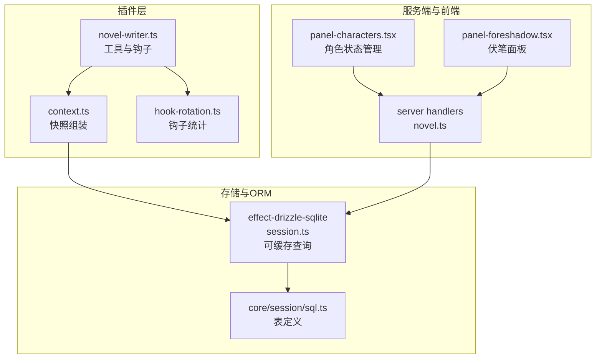
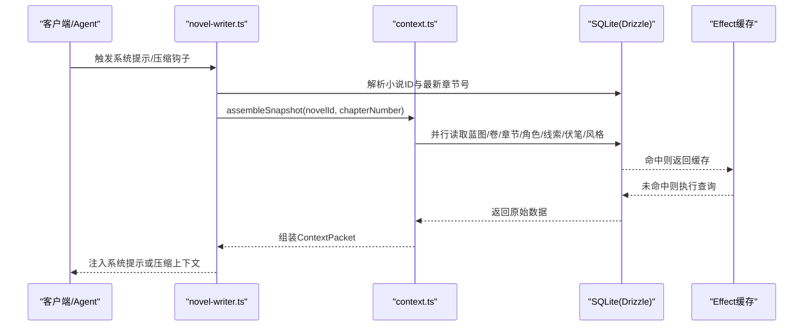
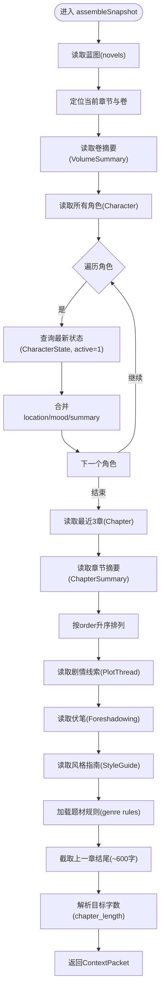
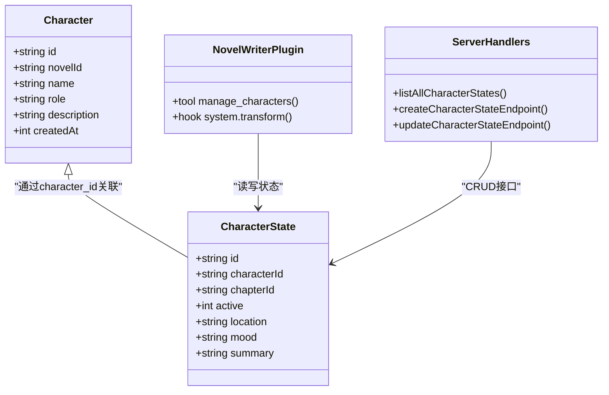
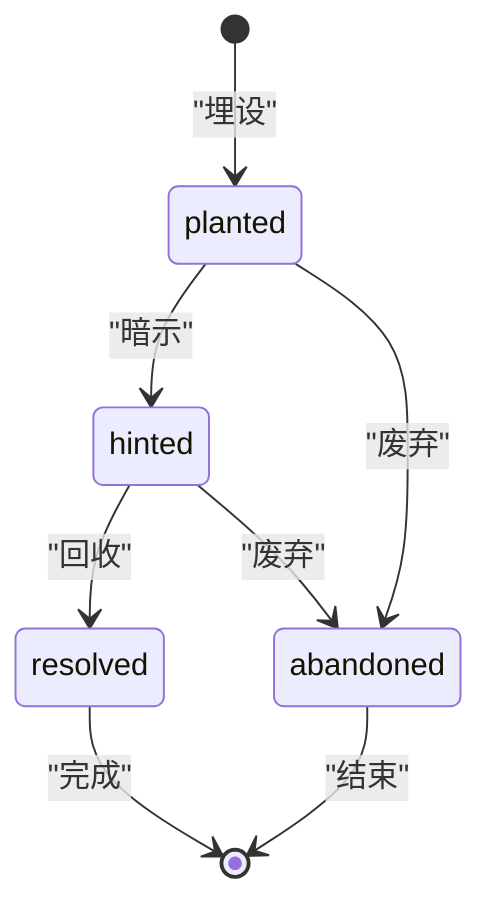
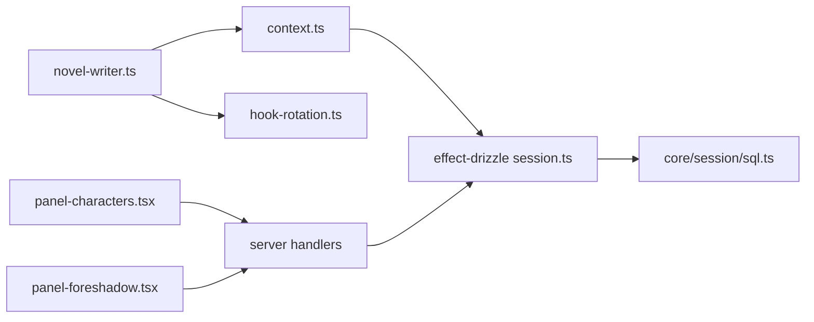

# 上下文构建器

<cite>
**本文引用的文件**   
- [packages/plugin/src/novel-writer.ts](file://packages/plugin/src/novel-writer.ts)
- [packages/plugin/src/novel-writer/context.ts](file://packages/plugin/src/novel-writer/context.ts)
- [packages/plugin/src/novel-writer/hook-rotation.ts](file://packages/plugin/src/novel-writer/hook-rotation.ts)
- [packages/effect-drizzle-sqlite/src/sqlite-core/effect/session.ts](file://packages/effect-drizzle-sqlite/src/sqlite-core/effect/session.ts)
- [packages/core/src/session/sql.ts](file://packages/core/src/session/sql.ts)
- [packages/schema/src/novel.ts](file://packages/schema/src/novel.ts)
- [packages/server/src/handlers/novel.ts](file://packages/server/src/handlers/novel.ts)
- [packages/app/src/pages/novel/panel-characters.tsx](file://packages/app/src/pages/novel/panel-characters.tsx)
- [packages/app/src/pages/novel/panel-foreshadow.tsx](file://packages/app/src/pages/novel/panel-foreshadow.tsx)
</cite>

## 目录
1. [简介](#简介)
2. [项目结构](#项目结构)
3. [核心组件](#核心组件)
4. [架构总览](#架构总览)
5. [详细组件分析](#详细组件分析)
6. [依赖关系分析](#依赖关系分析)
7. [性能考量](#性能考量)
8. [故障排查指南](#故障排查指南)
9. [结论](#结论)
10. [附录](#附录)

## 简介
本文件为“上下文构建器”的详细技术文档，聚焦于小说写作场景下的上下文快照组装与使用。内容涵盖：
- 从数据库提取小说蓝图、活跃角色、最近章节摘要、剧情线索、伏笔和风格指南等数据并组装成结构化上下文。
- 角色信息整合机制（状态追踪、位置更新、情绪变化记录）。
- 情节线索关联算法（伏笔埋设状态跟踪与推进逻辑）。
- 上下文压缩策略（优先级排序、冗余过滤、长度控制）。
- 性能优化方案（缓存机制、增量更新、批量查询）。
- 上下文验证与数据完整性检查（连续性校验与错误处理）。

## 项目结构
上下文构建器位于插件层，通过工具与钩子暴露能力，底层基于 SQLite + Drizzle ORM 进行数据访问，并通过 Effect 驱动的可缓存会话执行查询。

图表来源
- [packages/plugin/src/novel-writer.ts](file://packages/plugin/src/novel-writer.ts)
- [packages/plugin/src/novel-writer/context.ts](file://packages/plugin/src/novel-writer/context.ts)
- [packages/plugin/src/novel-writer/hook-rotation.ts](file://packages/plugin/src/novel-writer/hook-rotation.ts)
- [packages/effect-drizzle-sqlite/src/sqlite-core/effect/session.ts](file://packages/effect-drizzle-sqlite/src/sqlite-core/effect/session.ts)
- [packages/core/src/session/sql.ts](file://packages/core/src/session/sql.ts)
- [packages/server/src/handlers/novel.ts](file://packages/server/src/handlers/novel.ts)
- [packages/app/src/pages/novel/panel-characters.tsx](file://packages/app/src/pages/novel/panel-characters.tsx)
- [packages/app/src/pages/novel/panel-foreshadow.tsx](file://packages/app/src/pages/novel/panel-foreshadow.tsx)

章节来源
- [packages/plugin/src/novel-writer.ts](file://packages/plugin/src/novel-writer.ts)
- [packages/plugin/src/novel-writer/context.ts](file://packages/plugin/src/novel-writer/context.ts)

## 核心组件
- 上下文快照组装：assembleSnapshot 负责按优先级分层读取并组装 P0~P4 的数据包，目标在 ch100 时控制在约 8K tokens 以内。
- 角色状态管理：CharacterState 表维护角色的 active/location/mood/summary，支持创建、更新、删除与最新状态查询。
- 剧情线索与伏笔：PlotThread 与 Foreshadowing 表分别承载主线/支线线索与埋设/回收状态，提供创建、更新与列表接口。
- 钩子轮换统计：getHookStats 用于统计最近使用的钩子类型，检测连续单一类型的风险并发出警告。
- 可缓存查询：Effect Drizzle Session 在执行 select 时根据策略启用缓存、自动失效或跳过，提升读取性能。

章节来源
- [packages/plugin/src/novel-writer/context.ts](file://packages/plugin/src/novel-writer/context.ts)
- [packages/plugin/src/novel-writer/hook-rotation.ts](file://packages/plugin/src/novel-writer/hook-rotation.ts)
- [packages/effect-drizzle-sqlite/src/sqlite-core/effect/session.ts](file://packages/effect-drizzle-sqlite/src/sqlite-core/effect/session.ts)

## 架构总览
上下文构建器的整体流程如下：
- 系统提示注入与会话压缩钩子触发时，解析当前会话绑定的小说 ID。
- 调用 assembleSnapshot 读取蓝图、卷摘要、最近章节摘要、活跃角色、剧情线索、伏笔、风格指南与上一章结尾片段。
- 将结构化快照序列化为文本注入系统提示或压缩上下文。
- 工具 assemble_context_snapshot 暴露给 agent 直接获取可读的上下文摘要。

图表来源
- [packages/plugin/src/novel-writer.ts](file://packages/plugin/src/novel-writer.ts)
- [packages/plugin/src/novel-writer/context.ts](file://packages/plugin/src/novel-writer/context.ts)
- [packages/effect-drizzle-sqlite/src/sqlite-core/effect/session.ts](file://packages/effect-drizzle-sqlite/src/sqlite-core/effect/session.ts)

## 详细组件分析

### 上下文快照组装（assembleSnapshot）
- 输入：novelId、chapterNumber、可选 directory。
- 输出：ContextPacket，包含 P0~P4 各层级数据与上一章结尾片段、目标字数下限。
- 关键步骤：
  - P0 蓝图：读取 novels 表。
  - 定位当前章节与所在卷，读取 VolumeSummaryTable 获取卷摘要。
  - P1 活跃角色：遍历 characters，取每个角色的最新 CharacterState（active=1），合并 location/mood/summary。
  - P2 最近3章摘要：按 order 降序取最近3章，读取 ChapterSummaryTable 并升序排列。
  - P3 剧情线索与伏笔：读取 plot_threads 与 foreshadowing 表。
  - P4 风格指南与题材规则：读取 style_guide 与动态导入 genre rules。
  - 上一章结尾原文：取前一章 content 的最后约600字。
  - 目标字数下限：从 style_guide.rules.chapter_length 解析。

图表来源
- [packages/plugin/src/novel-writer/context.ts](file://packages/plugin/src/novel-writer/context.ts)

章节来源
- [packages/plugin/src/novel-writer/context.ts](file://packages/plugin/src/novel-writer/context.ts)

### 角色信息整合机制
- 数据结构：Character（基础信息）、CharacterState（状态历史，含 active/location/mood/summary/chapter_id）。
- 操作接口：
  - createCharacterState：新增状态记录，默认 active=1。
  - updateCharacterState：部分字段更新（active/location/mood/summary）。
  - deleteCharacterState：删除指定状态记录。
- 前端交互：
  - panel-characters.tsx 提供状态增删改查界面，支持切换 active 标记与编辑 location/mood/summary。
- 后端接口：
  - server handlers 提供 listAllCharacterStates、create/update 端点，并进行权限校验（novel_id 匹配）。

图表来源
- [packages/schema/src/novel.ts](file://packages/schema/src/novel.ts)
- [packages/server/src/handlers/novel.ts](file://packages/server/src/handlers/novel.ts)
- [packages/app/src/pages/novel/panel-characters.tsx](file://packages/app/src/pages/novel/panel-characters.tsx)

章节来源
- [packages/server/src/handlers/novel.ts](file://packages/server/src/handlers/novel.ts)
- [packages/app/src/pages/novel/panel-characters.tsx](file://packages/app/src/pages/novel/panel-characters.tsx)
- [packages/schema/src/novel.ts](file://packages/schema/src/novel.ts)

### 情节线索关联算法（伏笔埋设与推进）
- 数据结构：
  - PlotThread：title/status/priority/description/closed_at。
  - Foreshadowing：content/state(planted/hinted/resolved/abandoned)/planted_chapter_id/resolved_chapter_id。
- 操作接口：
  - createForeshadowing：新增伏笔，默认 state=planted。
  - updateForeshadowing：更新 content/state/resolvedChapterId。
  - deleteForeshadowing：删除伏笔。
- 前端面板：
  - panel-foreshadow.tsx 提供状态选择（planted→hinted→resolved→abandoned）与章节关联显示。
- 推进逻辑：
  - 埋设阶段：planted 表示已埋设但未揭示。
  - 暗示阶段：hinted 表示已有线索暗示。
  - 回收阶段：resolved 表示已回收，关联 resolved_chapter_id。
  - 废弃阶段：abandoned 表示不再使用。

图表来源
- [packages/core/src/session/sql.ts](file://packages/core/src/session/sql.ts)
- [packages/server/src/handlers/novel.ts](file://packages/server/src/handlers/novel.ts)
- [packages/app/src/pages/novel/panel-foreshadow.tsx](file://packages/app/src/pages/novel/panel-foreshadow.tsx)

章节来源
- [packages/server/src/handlers/novel.ts](file://packages/server/src/handlers/novel.ts)
- [packages/app/src/pages/novel/panel-foreshadow.tsx](file://packages/app/src/pages/novel/panel-foreshadow.tsx)
- [packages/core/src/session/sql.ts](file://packages/core/src/session/sql.ts)

### 钩子轮换统计
- getHookStats：读取 HookRotationTable 最近 N 条记录，统计连续相同 hookType 的次数，超过阈值发出警告。
- 用途：避免钩子类型过于单一，保持节奏变化。

章节来源
- [packages/plugin/src/novel-writer/hook-rotation.ts](file://packages/plugin/src/novel-writer/hook-rotation.ts)

### 上下文压缩策略
- 优先级分层：
  - P0 蓝图（书名/题材/梗概）
  - P1 活跃角色（名称+一句话描述）
  - P2 卷摘要+最近3章摘要
  - P3 剧情线索+伏笔
  - P4 风格指南+题材规则
- 长度控制：
  - 目标在 ch100 时控制在约 8K tokens 以内。
  - 上一章结尾片段限制约 600 字。
- 冗余过滤：
  - 仅保留 active 角色状态。
  - 章节摘要仅取最近3章并按顺序排列。
  - 题材规则按需动态加载。

章节来源
- [packages/plugin/src/novel-writer/context.ts](file://packages/plugin/src/novel-writer/context.ts)
- [packages/plugin/src/novel-writer.ts](file://packages/plugin/src/novel-writer.ts)

## 依赖关系分析
- 插件层依赖 context.ts 进行快照组装，依赖 hook-rotation.ts 进行钩子统计。
- 存储层依赖 effect-drizzle-sqlite 的可缓存会话执行查询，表定义来自 core/session/sql.ts。
- 服务端 handlers 提供 CRUD 接口，前端面板通过 hooks 调用服务端接口。

图表来源
- [packages/plugin/src/novel-writer.ts](file://packages/plugin/src/novel-writer.ts)
- [packages/plugin/src/novel-writer/context.ts](file://packages/plugin/src/novel-writer/context.ts)
- [packages/plugin/src/novel-writer/hook-rotation.ts](file://packages/plugin/src/novel-writer/hook-rotation.ts)
- [packages/effect-drizzle-sqlite/src/sqlite-core/effect/session.ts](file://packages/effect-drizzle-sqlite/src/sqlite-core/effect/session.ts)
- [packages/core/src/session/sql.ts](file://packages/core/src/session/sql.ts)
- [packages/server/src/handlers/novel.ts](file://packages/server/src/handlers/novel.ts)
- [packages/app/src/pages/novel/panel-characters.tsx](file://packages/app/src/pages/novel/panel-characters.tsx)
- [packages/app/src/pages/novel/panel-foreshadow.tsx](file://packages/app/src/pages/novel/panel-foreshadow.tsx)

章节来源
- [packages/plugin/src/novel-writer.ts](file://packages/plugin/src/novel-writer.ts)
- [packages/plugin/src/novel-writer/context.ts](file://packages/plugin/src/novel-writer/context.ts)
- [packages/effect-drizzle-sqlite/src/sqlite-core/effect/session.ts](file://packages/effect-drizzle-sqlite/src/sqlite-core/effect/session.ts)

## 性能考量
- 缓存机制：
  - Effect Drizzle Session 对 select 查询启用缓存策略（skip/invalidate/try），在事务内跳过缓存以提升一致性。
  - 自动失效：写入后触发 onMutate 使相关表缓存失效。
- 增量更新：
  - CharacterState 支持部分字段更新，减少不必要的全量覆盖。
  - Foreshadowing 支持渐进式状态推进（planted→hinted→resolved）。
- 批量查询：
  - continuity-check 模块并行读取多表数据，减少往返开销。
  - assembleSnapshot 中角色状态逐条查询，可在高并发场景下考虑批量 JOIN 优化。
- 长度控制：
  - 章节摘要限制最近3章，上一章结尾片段限制约600字，确保上下文体积可控。

章节来源
- [packages/effect-drizzle-sqlite/src/sqlite-core/effect/session.ts](file://packages/effect-drizzle-sqlite/src/sqlite-core/effect/session.ts)
- [packages/plugin/src/novel-writer/context.ts](file://packages/plugin/src/novel-writer/context.ts)

## 故障排查指南
- 常见错误：
  - 无效请求（InvalidRequestError）：参数缺失或格式错误。
  - 未授权（UnauthorizedError）：会话未绑定或权限不足。
  - 冲突（ConflictError）：资源冲突（如重复角色名）。
  - 服务不可用（ServiceUnavailableError）：上游依赖异常。
  - 未知错误（UnknownError）：未捕获异常。
- 调试建议：
  - 检查 assembleSnapshot 返回值是否为 null（小说不存在）。
  - 确认 CharacterState 的 active 标记是否正确。
  - 查看钩子轮换警告是否频繁出现。
  - 启用 Effect 日志以观察缓存命中情况。

章节来源
- [packages/protocol/src/errors.ts](file://packages/protocol/src/errors.ts)
- [packages/opencode/src/server/routes/instance/httpapi/errors.ts](file://packages/opencode/src/server/routes/instance/httpapi/errors.ts)

## 结论
上下文构建器通过分层优先级组装、角色状态追踪、伏笔推进与钩子轮换统计，为 AI 写作提供了稳定、可控且高效的上下文环境。结合可缓存查询与增量更新，系统在大规模章节增长时仍能保持性能与一致性。未来可进一步优化批量查询与缓存策略，以应对更高并发与更大数据量场景。

## 附录
- 术语表：
  - 上下文快照：结构化数据包，包含 P0~P4 层级信息。
  - 活跃角色：active=1 的角色状态记录。
  - 伏笔：埋设/暗示/回收/废弃状态的剧情元素。
  - 钩子：写作技巧的类型化标记，用于节奏控制。
- 参考实现路径：
  - 快照组装：[packages/plugin/src/novel-writer/context.ts](file://packages/plugin/src/novel-writer/context.ts)
  - 角色状态：[packages/server/src/handlers/novel.ts](file://packages/server/src/handlers/novel.ts)
  - 伏笔管理：[packages/app/src/pages/novel/panel-foreshadow.tsx](file://packages/app/src/pages/novel/panel-foreshadow.tsx)
  - 钩子统计：[packages/plugin/src/novel-writer/hook-rotation.ts](file://packages/plugin/src/novel-writer/hook-rotation.ts)
  - 缓存机制：[packages/effect-drizzle-sqlite/src/sqlite-core/effect/session.ts](file://packages/effect-drizzle-sqlite/src/sqlite-core/effect/session.ts)