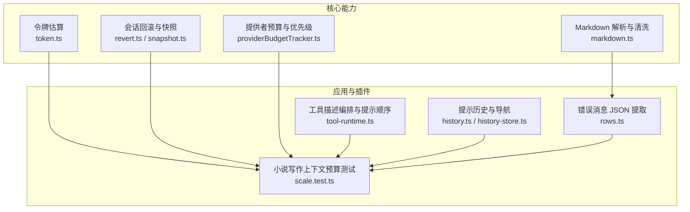
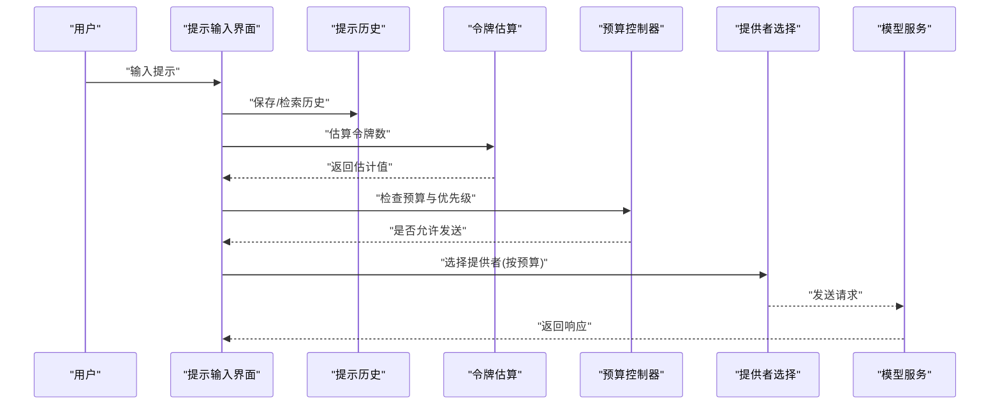
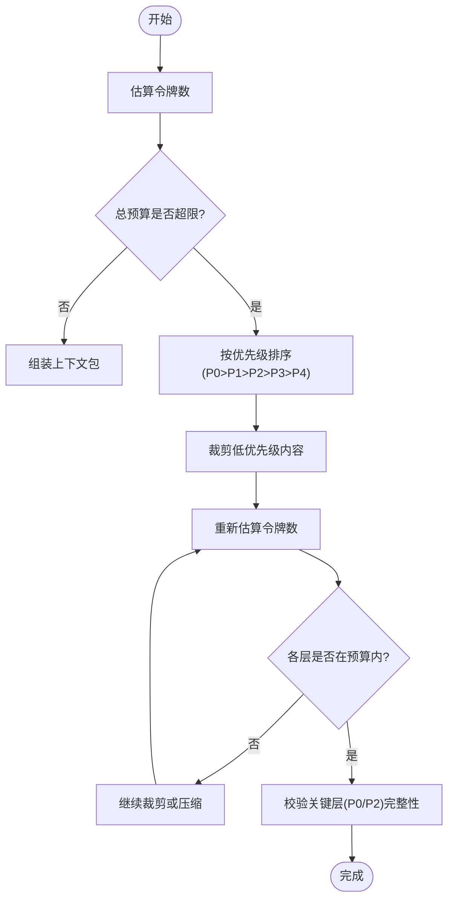
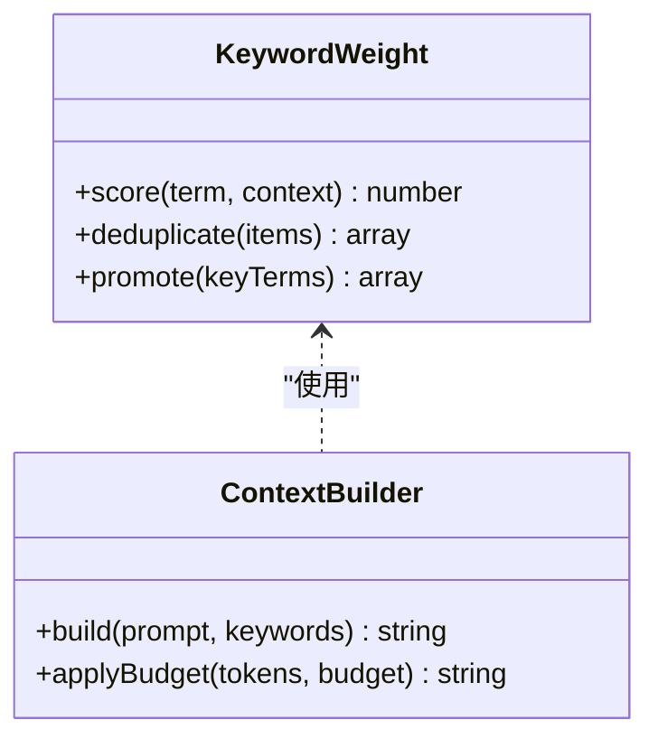
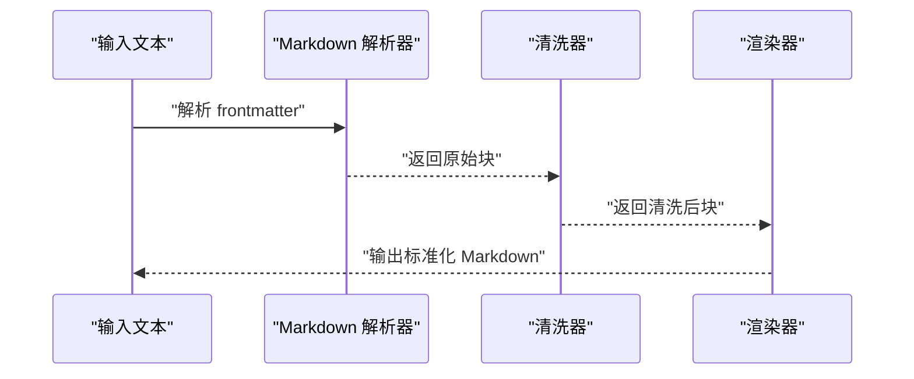
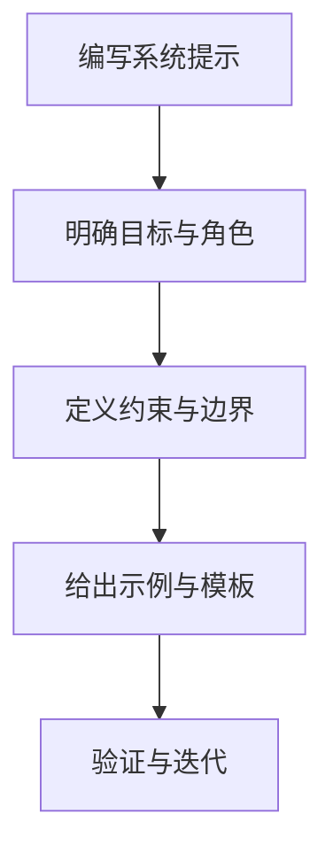
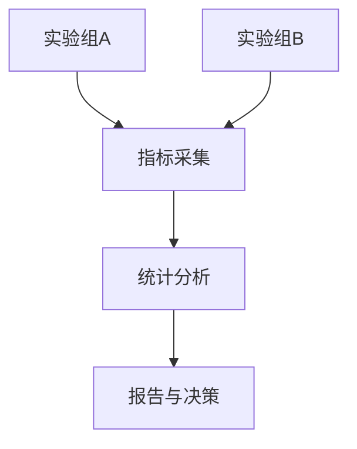
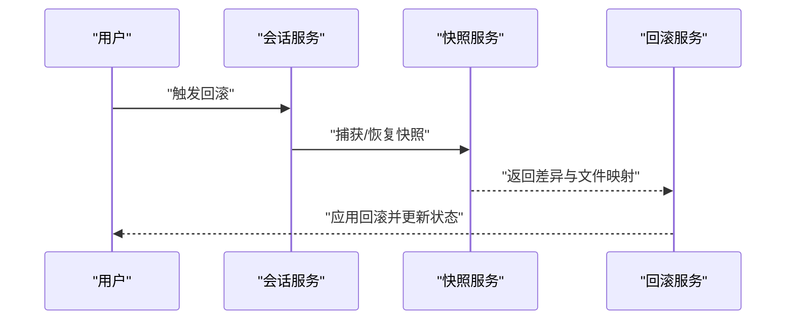
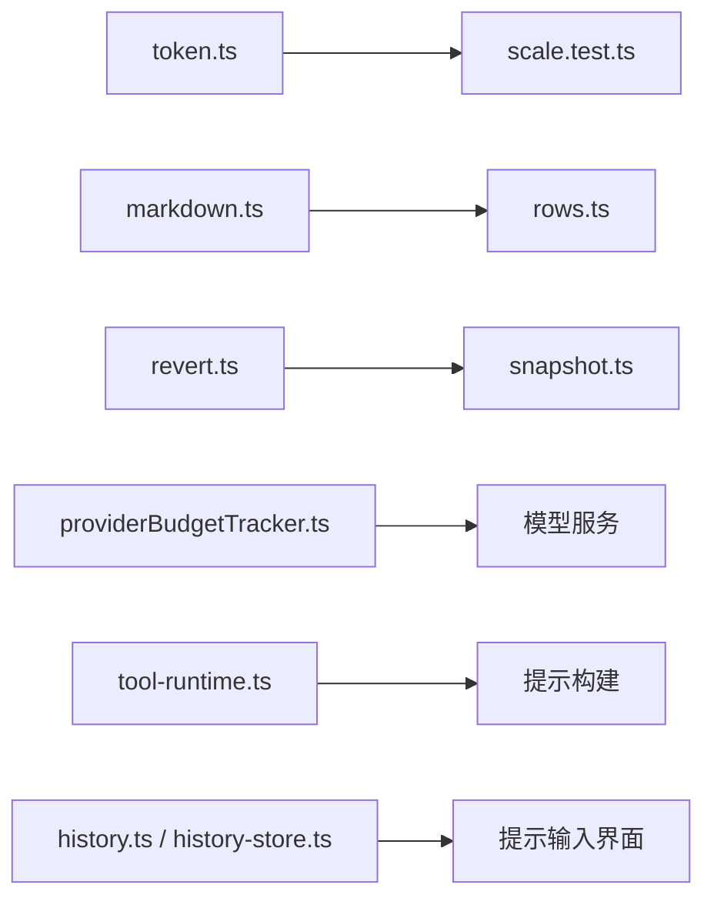

# 提示优化策略

<cite>
**本文引用的文件**   
- [packages/core/src/util/token.ts](file://packages/core/src/util/token.ts)
- [packages/opencode/src/util/tokentoken.ts](file://packages/opencode/src/util/token.ts)
- [packages/core/src/config/markdown.ts](file://packages/core/src/config/markdown.ts)
- [packages/plugin/test/novel-writer/scale.test.ts](file://packages/plugin/test/novel-writer/scale.test.ts)
- [packages/core/src/session/runner/max-steps.ts](file://packages/core/src/session/runner/max-steps.ts)
- [packages/console/app/src/routes/zen/util/providerBudgetTracker.ts](file://packages/console/app/src/routes/zen/util/providerBudgetTracker.ts)
- [packages/codemode/src/tool-runtime.ts](file://packages/codemode/src/tool-runtime.ts)
- [packages/web/src/content/docs/ja/agents.mdx](file://packages/web/src/content/docs/ja/agents.mdx)
- [packages/core/src/session/revert.ts](file://packages/core/src/session/revert.ts)
- [packages/schema/src/revert.ts](file://packages/schema/src/revert.ts)
- [packages/core/src/snapshot.ts](file://packages/core/src/snapshot.ts)
- [packages/tui/src/prompt/history.tsx](file://packages/tui/src/prompt/history.tsx)
- [packages/opencode/src/cli/cmd/run/prompt.shared.ts](file://packages/opencode/src/cli/cmd/run/prompt.shared.ts)
- [packages/app/src/components/prompt-input/history-store.ts](file://packages/app/src/components/prompt-input/history-store.ts)
- [packages/app/src/components/prompt-input/history.ts](file://packages/app/src/components/prompt-input/history.ts)
- [packages/app/src/pages/session/timeline/rows.ts](file://packages/app/src/pages/session/timeline/rows.ts)
</cite>

## 目录
1. [简介](#简介)
2. [项目结构](#项目结构)
3. [核心组件](#核心组件)
4. [架构总览](#架构总览)
5. [详细组件分析](#详细组件分析)
6. [依赖关系分析](#依赖关系分析)
7. [性能考量](#性能考量)
8. [故障排查指南](#故障排查指南)
9. [结论](#结论)
10. [附录](#附录)

## 简介
本文件围绕“提示优化策略”进行系统化说明，覆盖以下关键主题：
- 提示长度控制机制：最大令牌数限制、智能截断策略与内容优先级排序。
- 关键词权重系统：重要概念强化、重复内容去重与语义相关性评分（方法论与落地建议）。
- 格式规范化流程：Markdown 结构优化、JSON 输出格式化与特殊字符转义。
- 提示词工程最佳实践：指令清晰度、约束明确性与示例有效性。
- A/B 测试框架：效果评估指标、性能监控与结果分析。
- 提示词版本管理与回滚机制：基于会话快照与差异的可靠回滚路径。

## 项目结构
本项目在多个包中实现了与提示相关的功能：
- 令牌估算与预算控制：core 提供令牌估算；plugin 测试用例定义了分层预算与裁剪策略。
- 格式解析与规范化：core 的 Markdown frontmatter 解析与清洗。
- 工具描述与提示顺序：codemode 对工具描述段落顺序进行编排，确保关键信息不被截断。
- 会话与回滚：core 的 revert/snapshot 机制支持状态回滚与差异展示。
- 历史与频率：tui 与 app 层提供提示历史、持久化与导航能力。
- 提供者预算与优先级：console 层实现按提供者与优先级的预算跟踪与筛选。

**图表来源** 
- [packages/core/src/util/token.ts:1-6](file://packages/core/src/util/token.ts#L1-L6)
- [packages/core/src/config/markdown.ts:1-37](file://packages/core/src/config/markdown.ts#L1-L37)
- [packages/core/src/session/revert.ts:60-121](file://packages/core/src/session/revert.ts#L60-L121)
- [packages/core/src/snapshot.ts:189-217](file://packages/core/src/snapshot.ts#L189-L217)
- [packages/console/app/src/routes/zen/util/providerBudgetTracker.ts:89-137](file://packages/console/app/src/routes/zen/util/providerBudgetTracker.ts#L89-L137)
- [packages/plugin/test/novel-writer/scale.test.ts:483-953](file://packages/plugin/test/novel-writer/scale.test.ts#L483-L953)
- [packages/codemode/src/tool-runtime.ts:546-561](file://packages/codemode/src/tool-runtime.ts#L546-L561)
- [packages/app/src/components/prompt-input/history.ts:150-195](file://packages/app/src/components/prompt-input/history.ts#L150-L195)
- [packages/app/src/components/prompt-input/history-store.ts:31-47](file://packages/app/src/components/prompt-input/history-store.ts#L31-L47)
- [packages/app/src/pages/session/timeline/rows.ts:201-237](file://packages/app/src/pages/session/timeline/rows.ts#L201-L237)

**章节来源**
- [packages/core/src/util/token.ts:1-6](file://packages/core/src/util/token.ts#L1-L6)
- [packages/core/src/config/markdown.ts:1-37](file://packages/core/src/config/markdown.ts#L1-L37)
- [packages/plugin/test/novel-writer/scale.test.ts:483-953](file://packages/plugin/test/novel-writer/scale.test.ts#L483-L953)
- [packages/codemode/src/tool-runtime.ts:546-561](file://packages/codemode/src/tool-runtime.ts#L546-L561)
- [packages/console/app/src/routes/zen/util/providerBudgetTracker.ts:89-137](file://packages/console/app/src/routes/zen/util/providerBudgetTracker.ts#L89-L137)
- [packages/core/src/session/revert.ts:60-121](file://packages/core/src/session/revert.ts#L60-L121)
- [packages/core/src/snapshot.ts:189-217](file://packages/core/src/snapshot.ts#L189-L217)
- [packages/app/src/components/prompt-input/history.ts:150-195](file://packages/app/src/components/prompt-input/history.ts#L150-L195)
- [packages/app/src/components/prompt-input/history-store.ts:31-47](file://packages/app/src/components/prompt-input/history-store.ts#L31-L47)
- [packages/app/src/pages/session/timeline/rows.ts:201-237](file://packages/app/src/pages/session/timeline/rows.ts#L201-L237)

## 核心组件
- 令牌估算器：提供快速估算输入字符串的 token 数量，用于预算控制与截断决策。
- Markdown 解析与清洗：安全解析 frontmatter，兼容不同编码风格，避免解析失败。
- 会话回滚与快照：记录并恢复文件状态，生成差异，支持撤销/确认操作。
- 提供者预算与优先级：按提供者维度与优先级分配预算，限制高成本调用。
- 工具描述编排：将关键信息放在不易被截断的位置，提升提示质量。
- 提示历史与导航：持久化历史、去重、上下导航与评论保留。
- 错误消息解析：从文本中提取结构化 JSON，便于统一处理与显示。

**章节来源**
- [packages/core/src/util/token.ts:1-6](file://packages/core/src/util/token.ts#L1-L6)
- [packages/core/src/config/markdown.ts:1-37](file://packages/core/src/config/markdown.ts#L1-L37)
- [packages/core/src/session/revert.ts:60-121](file://packages/core/src/session/revert.ts#L60-L121)
- [packages/console/app/src/routes/zen/util/providerBudgetTracker.ts:89-137](file://packages/console/app/src/routes/zen/util/providerBudgetTracker.ts#L89-L137)
- [packages/codemode/src/tool-runtime.ts:546-561](file://packages/codemode/src/tool-runtime.ts#L546-L561)
- [packages/app/src/components/prompt-input/history.ts:150-195](file://packages/app/src/components/prompt-input/history.ts#L150-L195)
- [packages/app/src/components/prompt-input/history-store.ts:31-47](file://packages/app/src/components/prompt-input/history-store.ts#L31-L47)
- [packages/app/src/pages/session/timeline/rows.ts:201-237](file://packages/app/src/pages/session/timeline/rows.ts#L201-L237)

## 架构总览
下图展示了提示优化相关的关键模块及其交互关系：令牌估算驱动预算控制，Markdown 解析保障输入稳定性，会话回滚确保可逆性，提供者预算限制调用成本，工具描述编排提升提示可读性，历史管理增强用户体验。

**图表来源** 
- [packages/core/src/util/token.ts:1-6](file://packages/core/src/util/token.ts#L1-L6)
- [packages/console/app/src/routes/zen/util/providerBudgetTracker.ts:89-137](file://packages/console/app/src/routes/zen/util/providerBudgetTracker.ts#L89-L137)
- [packages/app/src/components/prompt-input/history.ts:150-195](file://packages/app/src/components/prompt-input/history.ts#L150-L195)
- [packages/app/src/components/prompt-input/history-store.ts:31-47](file://packages/app/src/components/prompt-input/history-store.ts#L31-L47)

## 详细组件分析

### 提示长度控制机制
- 最大令牌数限制：通过令牌估算器计算输入长度，结合分层预算（如 P0-P4）与总预算上限（例如 8K tokens）进行控制。
- 智能截断策略：按优先级从高到低裁剪低优先级内容，保证关键信息（如蓝图、摘要）不被删除。
- 内容优先级排序：P0 蓝图（标题、类型、简介）始终保留；P2 卷/章摘要优先保留；P3/P4 线索、伏笔、风格规则等按需压缩。

**图表来源** 
- [packages/core/src/util/token.ts:1-6](file://packages/core/src/util/token.ts#L1-L6)
- [packages/plugin/test/novel-writer/scale.test.ts:483-953](file://packages/plugin/test/novel-writer/scale.test.ts#L483-L953)

**章节来源**
- [packages/core/src/util/token.ts:1-6](file://packages/core/src/util/token.ts#L1-L6)
- [packages/plugin/test/novel-writer/scale.test.ts:483-953](file://packages/plugin/test/novel-writer/scale.test.ts#L483-L953)

### 关键词权重系统
- 重要概念强化：在工具描述与系统提示中将关键信息置于开头与不可省略段落，降低被截断风险。
- 重复内容去重：在构建上下文时合并相似条目，减少冗余 token 消耗。
- 语义相关性评分：根据内容与当前任务的相关性打分，决定保留或压缩程度（方法层面建议）。

**图表来源** 
- [packages/codemode/src/tool-runtime.ts:546-561](file://packages/codemode/src/tool-runtime.ts#L546-L561)

**章节来源**
- [packages/codemode/src/tool-runtime.ts:546-561](file://packages/codemode/src/tool-runtime.ts#L546-L561)

### 格式规范化流程
- Markdown 结构优化：解析 frontmatter 并清洗非法值，确保配置稳定可用。
- JSON 输出格式化：从错误消息中抽取 JSON，统一结构与字段，便于前端展示与处理。
- 特殊字符转义：在渲染与传输过程中对特殊字符进行处理，避免解析错误。

**图表来源** 
- [packages/core/src/config/markdown.ts:1-37](file://packages/core/src/config/markdown.ts#L1-L37)
- [packages/app/src/pages/session/timeline/rows.ts:201-237](file://packages/app/src/pages/session/timeline/rows.ts#L201-L237)

**章节来源**
- [packages/core/src/config/markdown.ts:1-37](file://packages/core/src/config/markdown.ts#L1-L37)
- [packages/app/src/pages/session/timeline/rows.ts:201-237](file://packages/app/src/pages/session/timeline/rows.ts#L201-L237)

### 提示词工程最佳实践
- 指令清晰度：使用明确动词与目标，避免歧义；在系统提示中强调约束条件。
- 约束明确性：限定步骤数、工具使用范围与输出格式，防止越界行为。
- 示例有效性：提供占位符示例而非真实数据，保持示例通用性与安全性。

**章节来源**
- [packages/core/src/session/runner/max-steps.ts:1-16](file://packages/core/src/session/runner/max-steps.ts#L1-L16)
- [packages/web/src/content/docs/ja/agents.mdx:297-351](file://packages/web/src/content/docs/ja/agents.mdx#L297-L351)
- [packages/codemode/src/tool-runtime.ts:546-561](file://packages/codemode/src/tool-runtime.ts#L546-L561)

### A/B 测试框架
- 效果评估指标：成功率、平均耗时、首字节时间（ttfb）、输出吞吐、成本与错误率。
- 性能监控：统计层聚合指标，支持分位数（p50/p95）与计数统计。
- 结果分析：对比不同提示版本的指标差异，识别最优策略。

**章节来源**
- [packages/stats/core/src/domain/inference.ts:39-49](file://packages/stats/core/src/domain/inference.ts#L39-L49)

### 提示词版本管理与回滚机制
- 版本管理：每次提示变更伴随会话事件与快照，形成可追溯的版本链。
- 回滚路径：基于快照恢复文件状态，生成差异并支持撤销/确认。
- 一致性保障：回滚后发布事件，确保 UI 与后端状态一致。

**图表来源** 
- [packages/core/src/session/revert.ts:60-121](file://packages/core/src/session/revert.ts#L60-L121)
- [packages/schema/src/revert.ts:1-24](file://packages/schema/src/revert.ts#L1-L24)
- [packages/core/src/snapshot.ts:189-217](file://packages/core/src/snapshot.ts#L189-L217)

**章节来源**
- [packages/core/src/session/revert.ts:60-121](file://packages/core/src/session/revert.ts#L60-L121)
- [packages/schema/src/revert.ts:1-24](file://packages/schema/src/revert.ts#L1-L24)
- [packages/core/src/snapshot.ts:189-217](file://packages/core/src/snapshot.ts#L189-L217)

## 依赖关系分析
- 令牌估算与预算控制：core 的 token 估算为 plugin 的分层预算提供基础。
- Markdown 解析与错误处理：core 的 markdown 解析为 app 的错误消息处理提供输入稳定性。
- 会话回滚与快照：core 的 revert/snapshot 为提示版本管理提供底层支撑。
- 提供者预算与优先级：console 的预算跟踪影响模型选择与调用成本。
- 工具描述编排：codemode 的提示顺序编排直接影响提示质量与可截断性。
- 提示历史与导航：tui 与 app 的历史管理提升交互体验与效率。

**图表来源** 
- [packages/core/src/util/token.ts:1-6](file://packages/core/src/util/token.ts#L1-L6)
- [packages/plugin/test/novel-writer/scale.test.ts:483-953](file://packages/plugin/test/novel-writer/scale.test.ts#L483-L953)
- [packages/core/src/config/markdown.ts:1-37](file://packages/core/src/config/markdown.ts#L1-L37)
- [packages/app/src/pages/session/timeline/rows.ts:201-237](file://packages/app/src/pages/session/timeline/rows.ts#L201-L237)
- [packages/core/src/session/revert.ts:60-121](file://packages/core/src/session/revert.ts#L60-L121)
- [packages/core/src/snapshot.ts:189-217](file://packages/core/src/snapshot.ts#L189-L217)
- [packages/console/app/src/routes/zen/util/providerBudgetTracker.ts:89-137](file://packages/console/app/src/routes/zen/util/providerBudgetTracker.ts#L89-L137)
- [packages/codemode/src/tool-runtime.ts:546-561](file://packages/codemode/src/tool-runtime.ts#L546-L561)
- [packages/app/src/components/prompt-input/history.ts:150-195](file://packages/app/src/components/prompt-input/history.ts#L150-L195)
- [packages/app/src/components/prompt-input/history-store.ts:31-47](file://packages/app/src/components/prompt-input/history-store.ts#L31-L47)

**章节来源**
- [packages/core/src/util/token.ts:1-6](file://packages/core/src/util/token.ts#L1-L6)
- [packages/plugin/test/novel-writer/scale.test.ts:483-953](file://packages/plugin/test/novel-writer/scale.test.ts#L483-L953)
- [packages/core/src/config/markdown.ts:1-37](file://packages/core/src/config/markdown.ts#L1-L37)
- [packages/app/src/pages/session/timeline/rows.ts:201-237](file://packages/app/src/pages/session/timeline/rows.ts#L201-L237)
- [packages/core/src/session/revert.ts:60-121](file://packages/core/src/session/revert.ts#L60-L121)
- [packages/core/src/snapshot.ts:189-217](file://packages/core/src/snapshot.ts#L189-L217)
- [packages/console/app/src/routes/zen/util/providerBudgetTracker.ts:89-137](file://packages/console/app/src/routes/zen/util/providerBudgetTracker.ts#L89-L137)
- [packages/codemode/src/tool-runtime.ts:546-561](file://packages/codemode/src/tool-runtime.ts#L546-L561)
- [packages/app/src/components/prompt-input/history.ts:150-195](file://packages/app/src/components/prompt-input/history.ts#L150-L195)
- [packages/app/src/components/prompt-input/history-store.ts:31-47](file://packages/app/src/components/prompt-input/history-store.ts#L31-L47)

## 性能考量
- 令牌估算复杂度：O(n)，n 为输入长度，适合实时估算。
- 预算控制开销：分层预算与优先级排序带来额外计算，但可通过缓存与增量更新降低开销。
- Markdown 解析容错：清洗与重试机制增加少量 CPU 开销，但显著提升稳定性。
- 历史与持久化：I/O 操作可能成为瓶颈，需考虑异步写入与批量更新。

[本节为通用指导，不直接分析具体文件]

## 故障排查指南
- 提示历史损坏：自动修复无效行并强制限制大小，确保可用性。
- CLI 历史限制：设置历史上限，避免内存膨胀。
- 错误消息解析失败：尝试多种 JSON 提取策略，提高鲁棒性。
- 回滚不一致：检查快照与差异生成是否正确，确认事件发布与状态同步。

**章节来源**
- [packages/tui/src/prompt/history.tsx:49-66](file://packages/tui/src/prompt/history.tsx#L49-L66)
- [packages/opencode/src/cli/cmd/run/prompt.shared.ts:1-49](file://packages/opencode/src/cli/cmd/run/prompt.shared.ts#L1-L49)
- [packages/app/src/pages/session/timeline/rows.ts:201-237](file://packages/app/src/pages/session/timeline/rows.ts#L201-L237)
- [packages/core/src/session/revert.ts:60-121](file://packages/core/src/session/revert.ts#L60-L121)

## 结论
通过令牌估算、分层预算、优先级排序与格式规范化，项目实现了高效且稳定的提示优化策略。结合会话回滚与提供者预算控制，系统在成本与质量之间取得平衡。历史管理与错误解析提升了用户体验与鲁棒性。未来可进一步引入语义相关性评分与更精细的去重策略，以持续提升提示质量与性能。

[本节为总结性内容，不直接分析具体文件]

## 附录
- 术语表：
  - 令牌（Token）：文本的基本单位，用于估算与预算控制。
  - 预算（Budget）：对 token 数量的限制，分为层级与总量。
  - 优先级（Priority）：内容的重要性等级，决定裁剪顺序。
  - 快照（Snapshot）：文件状态的备份，用于回滚与差异生成。
  - 回滚（Revert）：恢复到指定快照状态的操作。

[本节为补充信息，不直接分析具体文件]