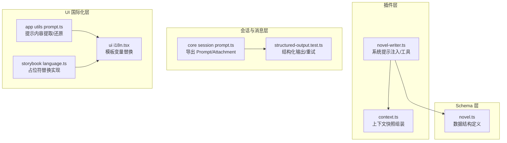
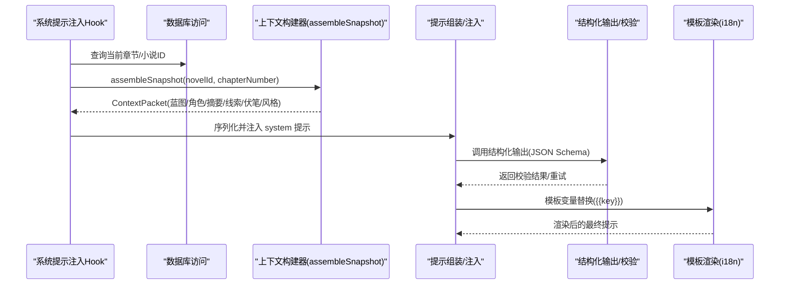
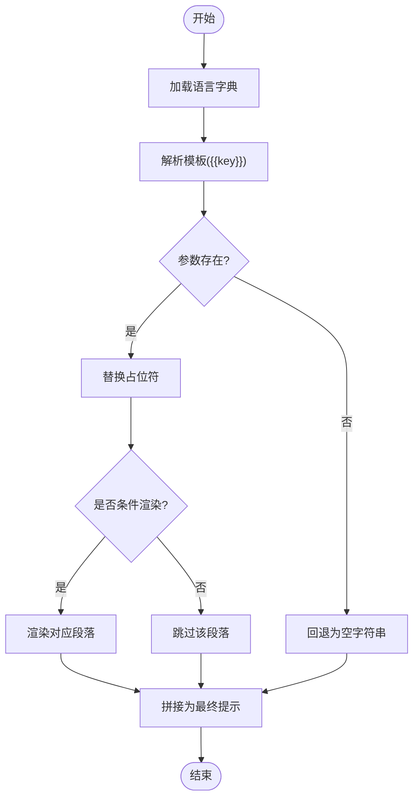
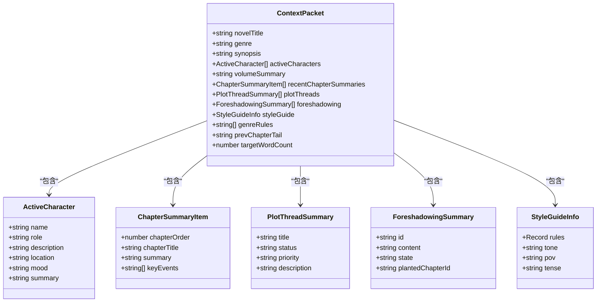
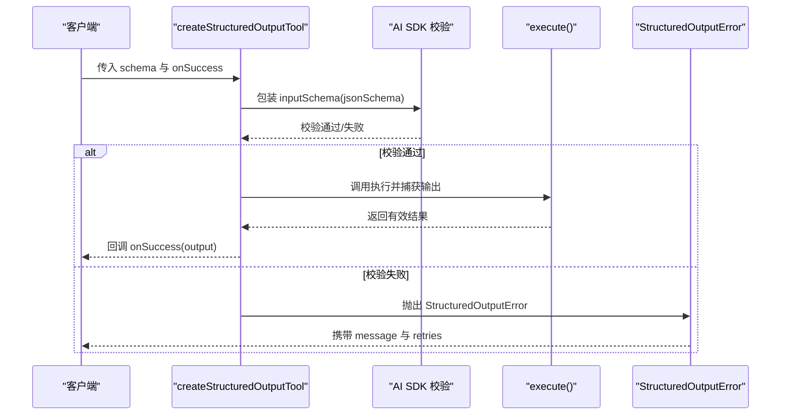
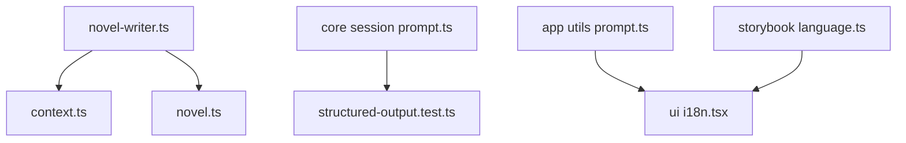

# 提示工程系统

<cite>
**本文引用的文件**   
- [novel-writer.ts](file://packages/plugin/src/novel-writer.ts)
- [context.ts](file://packages/plugin/src/novel-writer/context.ts)
- [novel.ts](file://packages/schema/src/novel.ts)
- [prompt.ts](file://packages/core\src\session\prompt.ts)
- [structured-output.test.ts](file://packages/opencode/test/session/structured-output.test.ts)
- [prompt.ts](file://packages/app/src/utils/prompt.ts)
- [i18n.tsx](file://packages/ui/src/context/i18n.tsx)
- [language.ts](file://packages/storybook/.storybook/mocks/app/context/language.ts)
- [scale.test.ts](file://packages/plugin/test/novel-writer/scale.test.ts)
</cite>

## 目录
1. [简介](#简介)
2. [项目结构](#项目结构)
3. [核心组件](#核心组件)
4. [架构总览](#架构总览)
5. [详细组件分析](#详细组件分析)
6. [依赖关系分析](#依赖关系分析)
7. [性能考量](#性能考量)
8. [故障排查指南](#故障排查指南)
9. [结论](#结论)
10. [附录](#附录)

## 简介
本文件面向“提示工程系统”的完整文档，聚焦以下目标：
- 说明系统提示模板的设计架构，包括模板变量替换、条件渲染与多语言支持。
- 详细描述上下文构建器的工作原理，包括小说元数据提取、角色信息整合与情节线索关联。
- 解释提示优化策略，包括长度控制、关键词权重与格式规范化。
- 描述输出解析机制，包括 JSON 结构化解析、内容验证与错误恢复。
- 提供自定义提示模板的开发指南，包括模板语法、调试方法与性能优化。
- 包含 A/B 测试框架与效果评估指标（概念性说明）。

## 项目结构
围绕提示工程的核心代码分布在插件层、Schema 定义层、会话与消息处理层以及 UI 国际化层：
- 插件层：负责在系统提示中注入小说写作上下文、工具调用与流程编排。
- Schema 层：统一数据结构定义，确保输入输出的类型安全与一致性。
- 会话与消息层：提供结构化输出能力、提示组装与格式化。
- UI 国际化层：实现模板变量替换与多语言渲染。

**图表来源** 
- [novel-writer.ts:94-191](file://packages/plugin/src/novel-writer.ts#L94-L191)
- [context.ts:179-321](file://packages/plugin/src/novel-writer/context.ts#L179-L321)
- [novel.ts:8-17](file://packages/schema/src/novel.ts#L8-L17)
- [prompt.ts:1-2](file://packages/core/src/session/prompt.ts#L1-L2)
- [structured-output.test.ts:12-65](file://packages/opencode/test/session/structured-output.test.ts#L12-L65)
- [prompt.ts:56-204](file://packages/app/src/utils/prompt.ts#L56-L204)
- [i18n.tsx:13-20](file://packages/ui/src/context/i18n.tsx#L13-L20)
- [language.ts:126-134](file://packages/storybook/.storybook/mocks/app/context/language.ts#L126-L134)

**章节来源**
- [novel-writer.ts:94-191](file://packages/plugin/src/novel-writer.ts#L94-L191)
- [context.ts:179-321](file://packages/plugin/src/novel-writer/context.ts#L179-L321)
- [novel.ts:8-17](file://packages/schema/src/novel.ts#L8-L17)
- [prompt.ts:1-2](file://packages/core/src/session/prompt.ts#L1-L2)
- [structured-output.test.ts:12-65](file://packages/opencode/test/session/structured-output.test.ts#L12-L65)
- [prompt.ts:56-204](file://packages/app/src/utils/prompt.ts#L56-L204)
- [i18n.tsx:13-20](file://packages/ui/src/context/i18n.tsx#L13-L20)
- [language.ts:126-134](file://packages/storybook/.storybook/mocks/app/context/language.ts#L126-L134)

## 核心组件
- 系统提示注入与上下文快照：通过插件 hook 将小说蓝图、活跃角色、卷摘要、最近章节摘要、剧情线索、伏笔、风格指南等注入系统提示，保证 AI 生成的一致性与连贯性。
- 上下文构建器：按优先级分层组装 ContextPacket，控制 token 预算，确保长文本场景下的稳定性。
- 结构化输出与校验：基于 JSON Schema 的输出模式，配合重试计数与错误类型，提升结构化数据的可靠性。
- 模板变量替换与多语言：使用 {{key}} 占位符进行模板渲染，支持多语言字典与回退逻辑。
- 提示内容提取与还原：从消息部件中提取用户原始提示，支持文件、图片与代理引用。

**章节来源**
- [novel-writer.ts:94-191](file://packages/plugin/src/novel-writer.ts#L94-L191)
- [context.ts:179-321](file://packages/plugin/src/novel-writer/context.ts#L179-L321)
- [structured-output.test.ts:12-65](file://packages/opencode/test/session/structured-output.test.ts#L12-L65)
- [i18n.tsx:13-20](file://packages/ui/src/context/i18n.tsx#L13-L20)
- [prompt.ts:56-204](file://packages/app/src/utils/prompt.ts#L56-L204)

## 架构总览
下图展示系统提示注入、上下文构建、结构化输出与模板渲染的整体交互流程。

**图表来源** 
- [novel-writer.ts:94-191](file://packages/plugin/src/novel-writer.ts#L94-L191)
- [context.ts:179-321](file://packages/plugin/src/novel-writer/context.ts#L179-L321)
- [structured-output.test.ts:12-65](file://packages/opencode/test/session/structured-output.test.ts#L12-L65)
- [i18n.tsx:13-20](file://packages/ui/src/context/i18n.tsx#L13-L20)

## 详细组件分析

### 系统提示模板设计架构
- 模板变量替换：采用 {{key}} 占位符，由 i18n 模块统一渲染；若参数缺失则回退为空字符串。
- 条件渲染：根据上下文快照中的字段是否存在或满足阈值，选择性注入段落（如活跃角色列表、卷摘要、剧情线索、伏笔、风格指南等）。
- 多语言支持：通过字典模块加载不同语言的键值对，结合占位符渲染，确保跨语言一致性与可扩展性。

**图表来源** 
- [i18n.tsx:13-20](file://packages/ui/src/context/i18n.tsx#L13-L20)
- [language.ts:126-134](file://packages/storybook/.storybook/mocks/app/context/language.ts#L126-L134)

**章节来源**
- [i18n.tsx:13-20](file://packages/ui/src/context/i18n.tsx#L13-L20)
- [language.ts:126-134](file://packages/storybook/.storybook/mocks/app/context/language.ts#L126-L134)

### 上下文构建器工作原理
- 元数据提取：读取小说蓝图（书名、题材、梗概）、当前章节与所属卷信息。
- 角色信息整合：查询活跃角色及其最新状态（位置、情绪、摘要），过滤非活跃角色。
- 情节线索关联：汇总剧情线索与伏笔，标注状态与优先级，辅助 AI 保持叙事连贯。
- 层级压缩：按 P0-P4 优先级分层组装，控制 token 预算（目标 ch100 时 <8K tokens）。

**图表来源** 
- [context.ts:125-151](file://packages/plugin/src/novel-writer/context.ts#L125-L151)
- [context.ts:52-113](file://packages/plugin/src/novel-writer/context.ts#L52-L113)

**章节来源**
- [context.ts:179-321](file://packages/plugin/src/novel-writer/context.ts#L179-L321)
- [context.ts:125-151](file://packages/plugin/src/novel-writer/context.ts#L125-L151)

### 提示优化策略
- 长度控制：通过层级压缩与 token 估算，确保上下文在预算内；写章工具强制字数下限与上限，避免过短或过长。
- 关键词权重：在系统提示中以标题分段（如【活跃角色】、【剧情线索】）突出关键信息，提高模型注意力。
- 格式规范化：统一输出结构（JSON Schema），减少自由文本的不确定性，便于后续解析与校验。

**章节来源**
- [novel-writer.ts:242-329](file://packages/plugin/src/novel-writer.ts#L242-L329)
- [scale.test.ts:187-200](file://packages/plugin/test/novel-writer/scale.test.ts#L187-L200)

### 输出解析机制
- JSON 结构化解析：通过 SessionV1.Format 与 createStructuredOutputTool 定义 schema，AI SDK 在 execute 前完成类型校验。
- 内容验证：支持嵌套对象、数组与必填字段校验，失败时返回 StructuredOutputError。
- 错误恢复：提供 retryCount 配置，循环重试直至成功或达到上限。

**图表来源** 
- [structured-output.test.ts:165-235](file://packages/opencode/test/session/structured-output.test.ts#L165-L235)
- [structured-output.test.ts:67-100](file://packages/opencode/test/session/structured-output.test.ts#L67-L100)

**章节来源**
- [structured-output.test.ts:12-65](file://packages/opencode/test/session/structured-output.test.ts#L12-L65)
- [structured-output.test.ts:165-235](file://packages/opencode/test/session/structured-output.test.ts#L165-L235)

### 自定义提示模板开发指南
- 模板语法：使用 {{key}} 占位符，确保键名与字典一致；缺失值自动回退为空字符串。
- 调试方法：通过单元测试验证模板渲染与参数替换；利用日志输出中间态提示，定位问题。
- 性能优化：减少不必要的条件分支与重复渲染；按需加载语言字典，避免全量导入。

**章节来源**
- [i18n.tsx:13-20](file://packages/ui/src/context/i18n.tsx#L13-L20)
- [language.ts:126-134](file://packages/storybook/.storybook/mocks/app/context/language.ts#L126-L134)

### A/B 测试框架与效果评估指标（概念性说明）
- A/B 测试框架：建议基于会话维度划分实验组与对照组，记录提示模板版本、上下文快照与输出质量评分。
- 评估指标：包括一致性（连续性检查 PASS/WARN/FAIL 比例）、可读性（人工评分）、成本（token 用量与耗时）、多样性（重复率与相似度）。
- 数据采集：通过结构化输出与评审记录持久化，便于后续分析与可视化。

[本节为概念性说明，不直接分析具体文件]

## 依赖关系分析
- 插件层依赖 Schema 层的数据结构定义，确保输入输出的一致性。
- 会话与消息层依赖结构化输出工具与错误类型，保障提示工程的健壮性。
- UI 国际化层依赖模板渲染逻辑，支持多语言与占位符替换。

**图表来源** 
- [novel-writer.ts:94-191](file://packages/plugin/src/novel-writer.ts#L94-L191)
- [context.ts:179-321](file://packages/plugin/src/novel-writer/context.ts#L179-L321)
- [novel.ts:8-17](file://packages/schema/src/novel.ts#L8-L17)
- [prompt.ts:1-2](file://packages/core/src/session/prompt.ts#L1-L2)
- [structured-output.test.ts:12-65](file://packages/opencode/test/session/structured-output.test.ts#L12-L65)
- [prompt.ts:56-204](file://packages/app/src/utils/prompt.ts#L56-L204)
- [i18n.tsx:13-20](file://packages/ui/src/context/i18n.tsx#L13-L20)
- [language.ts:126-134](file://packages/storybook/.storybook/mocks/app/context/language.ts#L126-L134)

**章节来源**
- [novel-writer.ts:94-191](file://packages/plugin/src/novel-writer.ts#L94-L191)
- [context.ts:179-321](file://packages/plugin/src/novel-writer/context.ts#L179-L321)
- [novel.ts:8-17](file://packages/schema/src/novel.ts#L8-L17)
- [prompt.ts:1-2](file://packages/core/src/session/prompt.ts#L1-L2)
- [structured-output.test.ts:12-65](file://packages/opencode/test/session/structured-output.test.ts#L12-L65)
- [prompt.ts:56-204](file://packages/app/src/utils/prompt.ts#L56-L204)
- [i18n.tsx:13-20](file://packages/ui/src/context/i18n.tsx#L13-L20)
- [language.ts:126-134](file://packages/storybook/.storybook/mocks/app/context/language.ts#L126-L134)

## 性能考量
- Token 预算控制：通过层级压缩与章节摘要限制，确保长文本场景下的稳定性。
- 数据库查询优化：仅查询必要字段与最近数据，减少 I/O 开销。
- 模板渲染优化：按需加载语言字典，避免全量导入；使用正则替换高效处理占位符。

**章节来源**
- [context.ts:179-321](file://packages/plugin/src/novel-writer/context.ts#L179-L321)
- [scale.test.ts:187-200](file://packages/plugin/test/novel-writer/scale.test.ts#L187-L200)
- [i18n.tsx:13-20](file://packages/ui/src/context/i18n.tsx#L13-L20)

## 故障排查指南
- 结构化输出失败：检查 JSON Schema 定义是否正确，确认必填字段与类型匹配；查看 StructuredOutputError 的 message 与 retries。
- 模板渲染异常：验证占位符键名是否与字典一致；检查参数是否为空或缺失。
- 上下文快照不完整：确认数据库连接与表结构正确；检查 assembleSnapshot 的查询条件与返回值。

**章节来源**
- [structured-output.test.ts:67-100](file://packages/opencode/test/session/structured-output.test.ts#L67-L100)
- [i18n.tsx:13-20](file://packages/ui/src/context/i18n.tsx#L13-L20)
- [context.ts:179-321](file://packages/plugin/src/novel-writer/context.ts#L179-L321)

## 结论
本提示工程系统通过模块化设计与严格的类型约束，实现了稳定的上下文构建、高效的模板渲染与可靠的输出解析。未来可进一步扩展 A/B 测试框架与评估指标，以持续优化提示质量与用户体验。

[本节为总结性内容，不直接分析具体文件]

## 附录
- 术语表：ContextPacket、StructuredOutputError、i18n 模板等。
- 参考链接：相关源码文件路径与行号已在各章节标注，便于深入阅读。

[本节为补充信息，不直接分析具体文件]