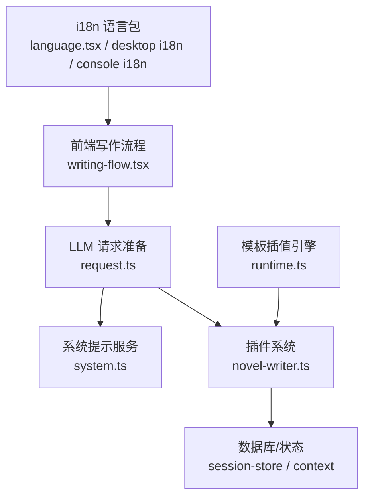
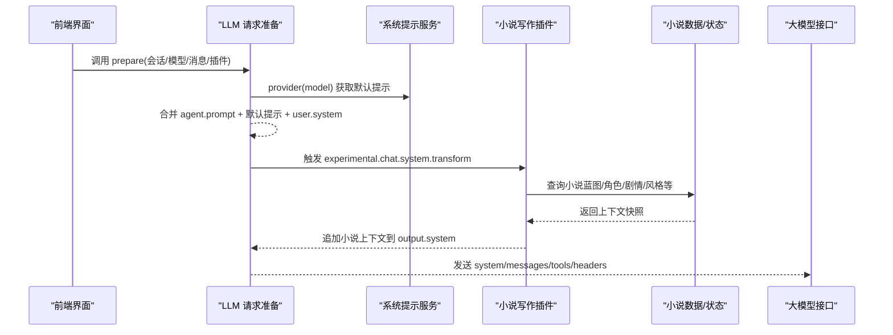
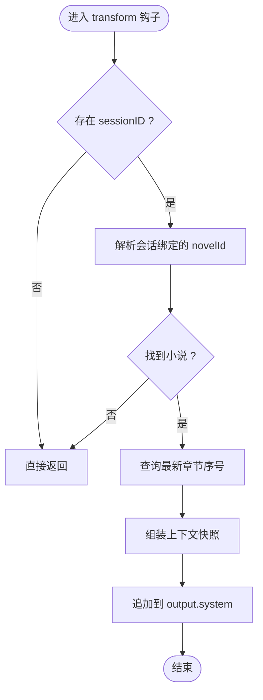
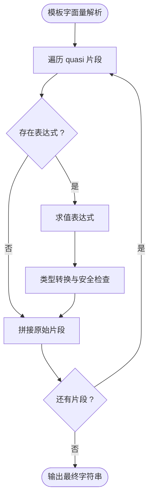
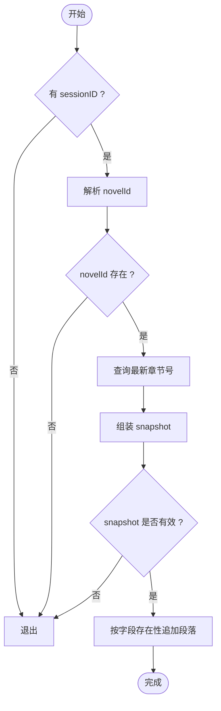
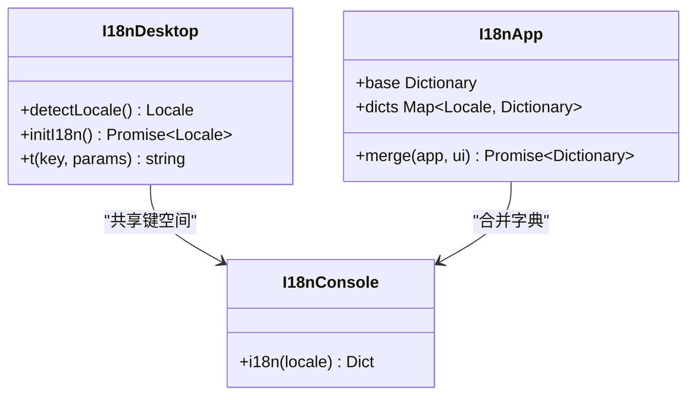
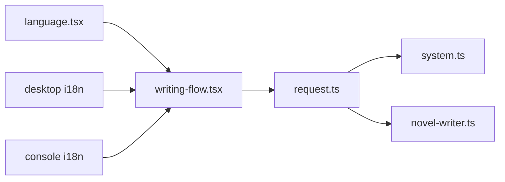

# 系统提示模板管理

<cite>
**本文引用的文件**
- [packages/opencode/src/session/llm/request.ts](file://packages/opencode/src/session/llm/request.ts)
- [packages/opencode/src/session/system.ts](file://packages/opencode/src/session/system.ts)
- [packages/plugin/src/novel-writer.ts](file://packages/plugin/src/novel-writer.ts)
- [packages/app/src/pages/novel/writing-flow.tsx](file://packages/app/src/pages/novel/writing-flow.tsx)
- [packages/app/src/context/novel.tsx](file://packages/app/src/context/novel.tsx)
- [packages/app/src/context/language.tsx](file://packages/app/src/context/language.tsx)
- [packages/desktop/src/renderer/i18n/index.ts](file://packages/desktop/src/renderer/i18n/index.ts)
- [packages/console/app/src/i18n/index.ts](file://packages/console/app/src/i18n/index.ts)
- [packages/codemode/src/interpreter/runtime.ts](file://packages/codemode/src/interpreter/runtime.ts)
- [packages/opencode/test/session/instruction.test.ts](file://packages/opencode/test/session/instruction.test.ts)
- [packages/opencode/test/session/system.test.ts](file://packages/opencode/test/session/system.test.ts)
</cite>

## 目录
1. [简介](#简介)
2. [项目结构](#项目结构)
3. [核心组件](#核心组件)
4. [架构总览](#架构总览)
5. [详细组件分析](#详细组件分析)
6. [依赖关系分析](#依赖关系分析)
7. [性能考量](#性能考量)
8. [故障排查指南](#故障排查指南)
9. [结论](#结论)
10. [附录](#附录)

## 简介
本文件面向“系统提示模板管理系统”，聚焦小说写作场景下的系统提示注入机制、模板变量替换、条件渲染逻辑、多语言支持策略，以及自定义系统提示的开发与调试方法。文档同时覆盖模板版本管理与向后兼容建议，帮助开发者在会话中动态插入高质量的小说上下文指令，确保不同模型、不同语言环境下的稳定表现。

## 项目结构
围绕系统提示的构建与注入，代码库主要涉及以下模块：
- LLM 请求准备层：负责组装 system 消息、触发插件钩子、合并参数与头部信息
- 系统提示服务：按模型选择默认提示、生成环境与技能/MCP 指令
- 小说写作插件：通过 hook 将小说蓝图、角色、剧情线索等上下文注入 system
- 前端交互流程：创建/绑定会话并发送初始提示
- 多语言 i18n：检测与切换语言，提供本地化文案
- 模板插值引擎：用于表达式求值与字符串拼接（CodeMode）

**图表来源**
- [packages/opencode/src/session/llm/request.ts:56-100](file://packages/opencode/src/session/llm/request.ts#L56-L100)
- [packages/opencode/src/session/system.ts:27-42](file://packages/opencode/src/session/system.ts#L27-L42)
- [packages/plugin/src/novel-writer.ts:94-191](file://packages/plugin/src/novel-writer.ts#L94-L191)
- [packages/app/src/pages/novel/writing-flow.tsx:37-78](file://packages/app/src/pages/novel/writing-flow.tsx#L37-L78)
- [packages/app/src/context/language.tsx:79-104](file://packages/app/src/context/language.tsx#L79-L104)
- [packages/desktop/src/renderer/i18n/index.ts:77-109](file://packages/desktop/src/renderer/i18n/index.ts#L77-L109)
- [packages/console/app/src/i18n/index.ts:21-45](file://packages/console/app/src/i18n/index.ts#L21-L45)
- [packages/codemode/src/interpreter/runtime.ts:2894-2922](file://packages/codemode/src/interpreter/runtime.ts#L2894-L2922)

**章节来源**
- [packages/opencode/src/session/llm/request.ts:56-100](file://packages/opencode/src/session/llm/request.ts#L56-L100)
- [packages/opencode/src/session/system.ts:27-42](file://packages/opencode/src/session/system.ts#L27-L42)
- [packages/plugin/src/novel-writer.ts:94-191](file://packages/plugin/src/novel-writer.ts#L94-L191)
- [packages/app/src/pages/novel/writing-flow.tsx:37-78](file://packages/app/src/pages/novel/writing-flow.tsx#L37-L78)

## 核心组件
- LLM 请求准备器（prepare）
  - 聚合 agent.prompt、SystemPrompt.provider(model)、用户 system 文本，过滤空串后拼接为 system
  - 触发插件钩子 experimental.chat.system.transform，允许插件修改 system
  - 对 OpenAI OAuth 等特殊路径设置 instructions 字段或拆分 system 数组
- 系统提示服务（SystemPrompt.Service）
  - 根据 model.api.id 选择对应默认提示（如 Meta Muse Spark、GPT、Gemini、Claude 等）
  - 生成 environment、skills、mcp 指令片段
- 小说写作插件（NovelWriterPlugin）
  - 实现 experimental.chat.system.transform 钩子，向 system 注入小说上下文快照
  - 实现 experimental.session.compacting 钩子，压缩时保留关键摘要
  - 暴露一系列工具函数（write_chapter、revise_chapter、manage_characters、generate_*_outline、assemble_context_snapshot、check_continuity 等）
- 前端写作流程
  - 查找已绑定会话或新建会话，发送包含“写下一章”和可选“自定义指令”的 prompt
- i18n 多语言
  - 桌面端 detectLocale 与语言包加载；控制台与 App 侧提供翻译键映射
- 模板插值引擎（CodeMode runtime）
  - 支持模板字面量与表达式求值，保证安全沙箱内求值与类型转换

**章节来源**
- [packages/opencode/src/session/llm/request.ts:56-100](file://packages/opencode/src/session/llm/request.ts#L56-L100)
- [packages/opencode/src/session/system.ts:27-42](file://packages/opencode/src/session/system.ts#L27-L42)
- [packages/plugin/src/novel-writer.ts:94-191](file://packages/plugin/src/novel-writer.ts#L94-L191)
- [packages/app/src/pages/novel/writing-flow.tsx:37-78](file://packages/app/src/pages/novel/writing-flow.tsx#L37-L78)
- [packages/desktop/src/renderer/i18n/index.ts:77-109](file://packages/desktop/src/renderer/i18n/index.ts#L77-L109)
- [packages/console/app/src/i18n/index.ts:21-45](file://packages/console/app/src/i18n/index.ts#L21-L45)
- [packages/codemode/src/interpreter/runtime.ts:2894-2922](file://packages/codemode/src/interpreter/runtime.ts#L2894-L2922)

## 架构总览
下图展示一次“写下一章”请求从前端到 LLM 的完整链路，包括系统提示的组装与插件注入。

**图表来源**
- [packages/opencode/src/session/llm/request.ts:56-100](file://packages/opencode/src/session/llm/request.ts#L56-L100)
- [packages/opencode/src/session/system.ts:27-42](file://packages/opencode/src/session/system.ts#L27-L42)
- [packages/plugin/src/novel-writer.ts:94-191](file://packages/plugin/src/novel-writer.ts#L94-L191)

## 详细组件分析

### 系统提示注入机制（experimental.chat.system.transform）
- 触发时机：在 prepare 阶段，系统提示初步组装后，统一触发该钩子
- 输入输出：input 包含 sessionID、model；output.system 为可被插件修改的数组
- 小说上下文注入：插件根据会话绑定的小说 ID，查询最新章序号，组装快照并追加到 system
- 条件渲染：若无 sessionID 或未绑定小说，直接跳过，避免非小说会话被污染

**图表来源**
- [packages/opencode/src/session/llm/request.ts:68-73](file://packages/opencode/src/session/llm/request.ts#L68-L73)
- [packages/plugin/src/novel-writer.ts:101-191](file://packages/plugin/src/novel-writer.ts#L101-L191)

**章节来源**
- [packages/opencode/src/session/llm/request.ts:68-73](file://packages/opencode/src/session/llm/request.ts#L68-L73)
- [packages/plugin/src/novel-writer.ts:101-191](file://packages/plugin/src/novel-writer.ts#L101-L191)

### 模板变量替换系统（插值语法）
- 模板字面量与表达式求值：由 CodeMode 运行时提供 evaluateTemplateLiteral，支持在模板中嵌入表达式
- 安全与类型：表达式结果经 coerceToString 处理，保持日期/正则等类型的可读形式，而非 JSON 包装
- 适用场景：可用于插件内部或工具输出的格式化，但系统提示注入本身采用字符串拼接方式（见下文）

**图表来源**
- [packages/codemode/src/interpreter/runtime.ts:2894-2922](file://packages/codemode/src/interpreter/runtime.ts#L2894-L2922)

**章节来源**
- [packages/codemode/src/interpreter/runtime.ts:2894-2922](file://packages/codemode/src/interpreter/runtime.ts#L2894-L2922)

### 条件渲染逻辑（基于会话状态与小说类型）
- 会话状态判断：transform 钩子首先检查 input.sessionID，无则跳过
- 小说绑定判断：resolveNovelForSession 返回 null 时不注入
- 内容选择性：仅当 snapshot 中存在活跃角色/卷摘要/最近章节摘要/剧情线索/伏笔/风格指南/题材规则时，才追加相应段落
- 压缩阶段：compacting 钩子同样按 P0/P1/P2 优先级注入蓝图、角色、卷摘要

**图表来源**
- [packages/plugin/src/novel-writer.ts:101-191](file://packages/plugin/src/novel-writer.ts#L101-L191)

**章节来源**
- [packages/plugin/src/novel-writer.ts:101-191](file://packages/plugin/src/novel-writer.ts#L101-L191)

### 多语言支持机制（模板与文案）
- 语言检测：desktop i18n 根据 navigator.languages 推断 locale（en/zh/zht/ko/de/es/fr/...）
- 语言包加载：console/app 侧提供 i18n(locale) 返回对应字典，App 侧维护 base 与合并后的 dicts
- 使用方式：前端通过 t(key, params) 获取本地化文案，用于提示词前缀、按钮文案等
- 模板语言：系统提示默认以英文为主，小说上下文快照当前为中文；可按需扩展多语言模板

**图表来源**
- [packages/desktop/src/renderer/i18n/index.ts:77-109](file://packages/desktop/src/renderer/i18n/index.ts#L77-L109)
- [packages/console/app/src/i18n/index.ts:21-45](file://packages/console/app/src/i18n/index.ts#L21-L45)
- [packages/app/src/context/language.tsx:79-104](file://packages/app/src/context/language.tsx#L79-L104)

**章节来源**
- [packages/desktop/src/renderer/i18n/index.ts:77-109](file://packages/desktop/src/renderer/i18n/index.ts#L77-L109)
- [packages/console/app/src/i18n/index.ts:21-45](file://packages/console/app/src/i18n/index.ts#L21-L45)
- [packages/app/src/context/language.tsx:79-104](file://packages/app/src/context/language.tsx#L79-L104)

### 自定义系统提示开发指南
- 钩子规范
  - 名称：experimental.chat.system.transform
  - 输入：{ sessionID, model }
  - 输出：{ system: string[] }，可在数组末尾追加新段落
- 模板语法
  - 系统提示注入采用字符串拼接；如需复杂插值，可在插件内部使用 CodeMode 运行时进行表达式求值
- 调试方法
  - 使用 instruction.test 验证 AGENTS.md 等系统指令路径解析
  - 使用 system.test 校验 skills/mcp 输出排序与稳定性
- 性能优化
  - 仅在必要时查询数据库（如只取最新章、最近摘要）
  - 控制 snapshot 字段数量，避免过长 system 导致 token 浪费
  - 复用已解析的 novelId，避免重复解析

**章节来源**
- [packages/opencode/test/session/instruction.test.ts:114-164](file://packages/opencode/test/session/instruction.test.ts#L114-L164)
- [packages/opencode/test/session/system.test.ts:86-116](file://packages/opencode/test/session/system.test.ts#L86-L116)
- [packages/plugin/src/novel-writer.ts:94-191](file://packages/plugin/src/novel-writer.ts#L94-L191)

### 模板版本管理与向后兼容
- 版本策略建议
  - 为系统提示模板引入版本号（如 v1/v2），在插件中按模型/会话元数据选择模板
  - 对旧版模板提供降级路径，确保老会话仍可正常运行
- 兼容性处理
  - 在 transform 钩子中检查 snapshot 字段是否存在，缺失时使用默认值或跳过
  - 对新增字段（如 genreRules、styleGuide）做可选处理，避免破坏旧数据结构
- 测试保障
  - 针对新旧模板分别编写用例，确保 skills/mcp 输出稳定且排序一致

[本节为概念性说明，未直接分析具体文件]

## 依赖关系分析
- request.ts 依赖 SystemPrompt.Service 获取默认提示，并通过 plugin.trigger 触发 hooks
- novel-writer.ts 依赖 session-store 与 context 组装快照，依赖 drizzle-orm 操作数据库
- writing-flow.tsx 依赖 SDK 客户端创建/绑定会话，并调用 session.prompt
- i18n 模块相互独立，但共同服务于前端文案本地化

**图表来源**
- [packages/opencode/src/session/llm/request.ts:56-100](file://packages/opencode/src/session/llm/request.ts#L56-L100)
- [packages/opencode/src/session/system.ts:27-42](file://packages/opencode/src/session/system.ts#L27-L42)
- [packages/plugin/src/novel-writer.ts:94-191](file://packages/plugin/src/novel-writer.ts#L94-L191)
- [packages/app/src/pages/novel/writing-flow.tsx:37-78](file://packages/app/src/pages/novel/writing-flow.tsx#L37-L78)
- [packages/app/src/context/language.tsx:79-104](file://packages/app/src/context/language.tsx#L79-L104)
- [packages/desktop/src/renderer/i18n/index.ts:77-109](file://packages/desktop/src/renderer/i18n/index.ts#L77-L109)
- [packages/console/app/src/i18n/index.ts:21-45](file://packages/console/app/src/i18n/index.ts#L21-L45)

**章节来源**
- [packages/opencode/src/session/llm/request.ts:56-100](file://packages/opencode/src/session/llm/request.ts#L56-L100)
- [packages/opencode/src/session/system.ts:27-42](file://packages/opencode/src/session/system.ts#L27-L42)
- [packages/plugin/src/novel-writer.ts:94-191](file://packages/plugin/src/novel-writer.ts#L94-L191)
- [packages/app/src/pages/novel/writing-flow.tsx:37-78](file://packages/app/src/pages/novel/writing-flow.tsx#L37-L78)

## 性能考量
- 减少不必要的数据库查询：仅在 transform/compacting 钩子中按需读取必要字段
- 控制 system 长度：避免注入过多冗余信息，优先保留高价值上下文（蓝图、角色、卷摘要、最近章节摘要）
- 缓存与复用：对频繁使用的 snapshot 片段进行缓存（例如同一会话多次调用）
- 工具执行门禁：write_chapter/revise_chapter 内置字数与重复度检查，防止无效写入与回滚开销

[本节为通用指导，未直接分析具体文件]

## 故障排查指南
- 系统提示未注入
  - 检查是否有 sessionID；若无，transform 会直接返回
  - 确认 resolveNovelForSession 是否能返回 novelId
- 模板插值异常
  - 检查表达式求值是否抛出 InterpreterRuntimeError
  - 确认 coerceToString 是否正确处理对象/日期/正则
- 多语言文案缺失
  - 检查 i18n(locale) 是否返回对应字典
  - 确认 t(key, params) 的 key 是否存在于字典中
- 指令路径问题
  - 使用 instruction.test 验证 AGENTS.md 路径解析是否符合预期

**章节来源**
- [packages/plugin/src/novel-writer.ts:101-191](file://packages/plugin/src/novel-writer.ts#L101-L191)
- [packages/codemode/src/interpreter/runtime.ts:2894-2922](file://packages/codemode/src/interpreter/runtime.ts#L2894-L2922)
- [packages/console/app/src/i18n/index.ts:21-45](file://packages/console/app/src/i18n/index.ts#L21-L45)
- [packages/opencode/test/session/instruction.test.ts:114-164](file://packages/opencode/test/session/instruction.test.ts#L114-L164)

## 结论
系统提示模板管理通过“请求准备 + 系统提示服务 + 插件钩子”的分层设计，实现了灵活、可扩展的小说上下文注入。结合模板插值引擎与多语言支持，开发者可以按需定制提示模板、控制条件渲染，并在保证性能与兼容性的前提下持续演进。建议引入模板版本化管理与完善的测试用例，以确保长期稳定性。

[本节为总结性内容，未直接分析具体文件]

## 附录
- 常用钩子
  - experimental.chat.system.transform：系统提示注入
  - experimental.session.compacting：会话压缩上下文保留
- 常用工具
  - write_chapter、revise_chapter、manage_characters、generate_*_outline、assemble_context_snapshot、check_continuity
- 参考测试
  - instruction.test：系统指令路径解析
  - system.test：skills/mcp 输出稳定性

[本节为补充信息，未直接分析具体文件]