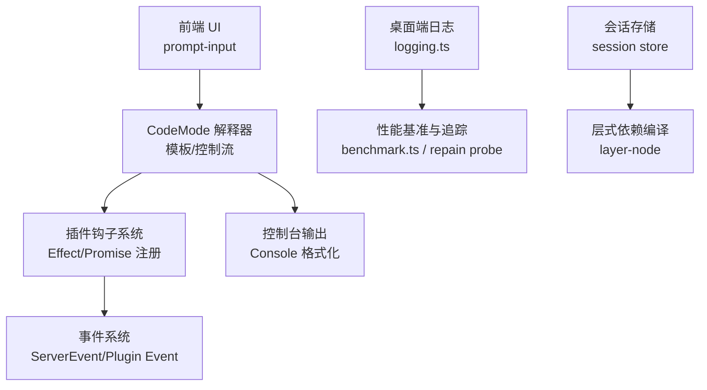
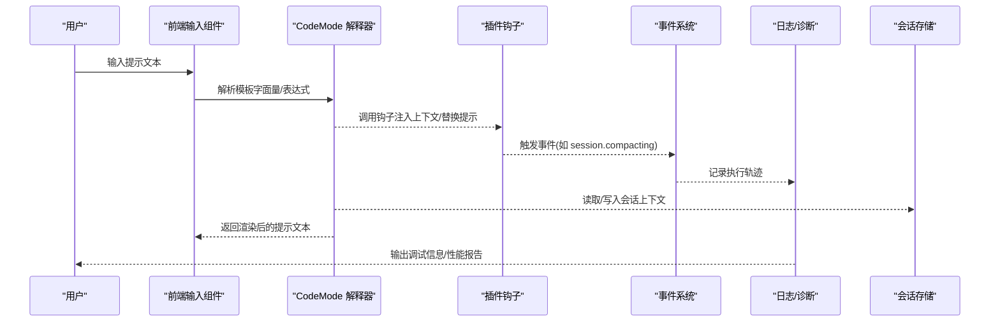
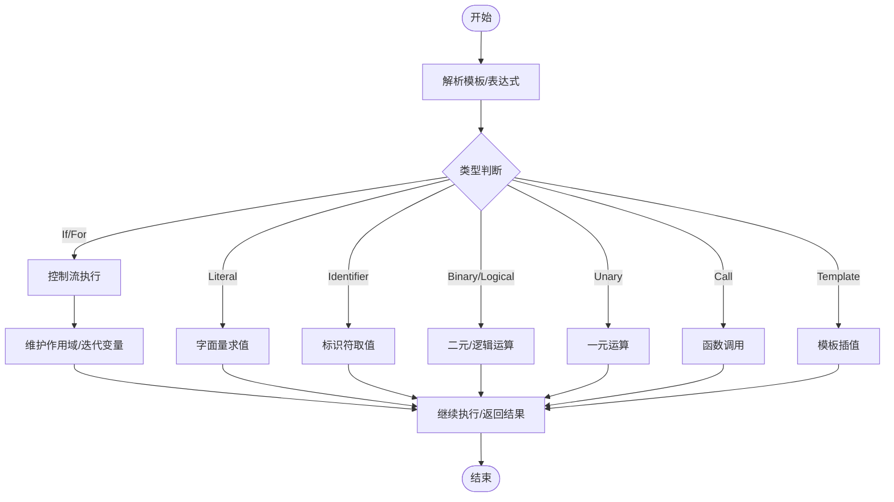
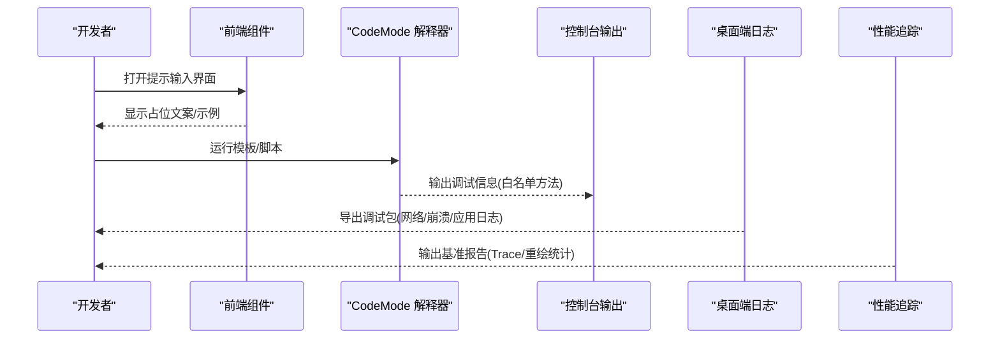
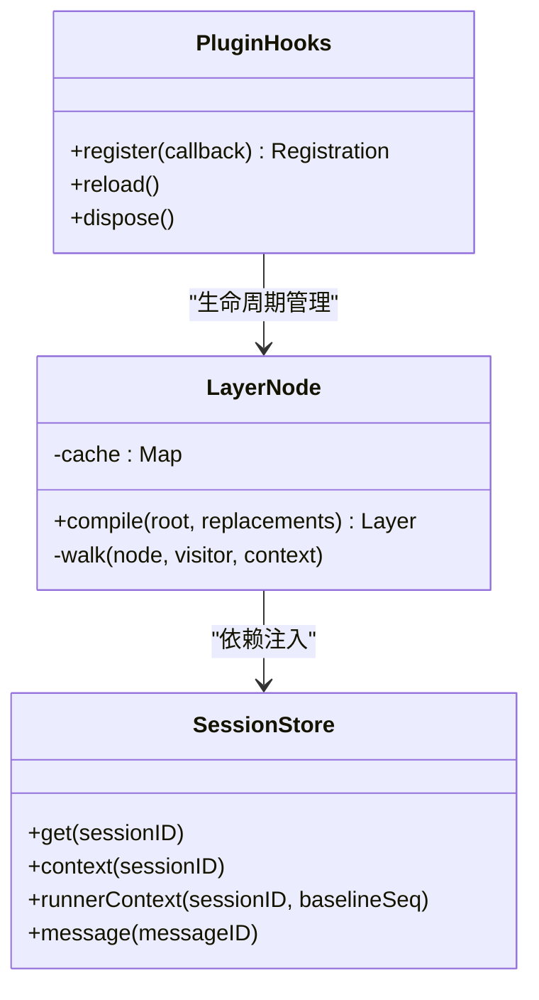
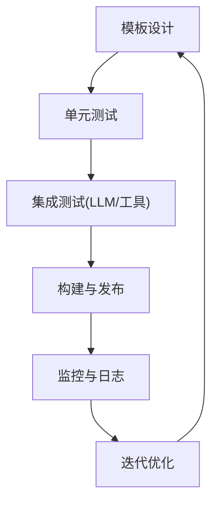
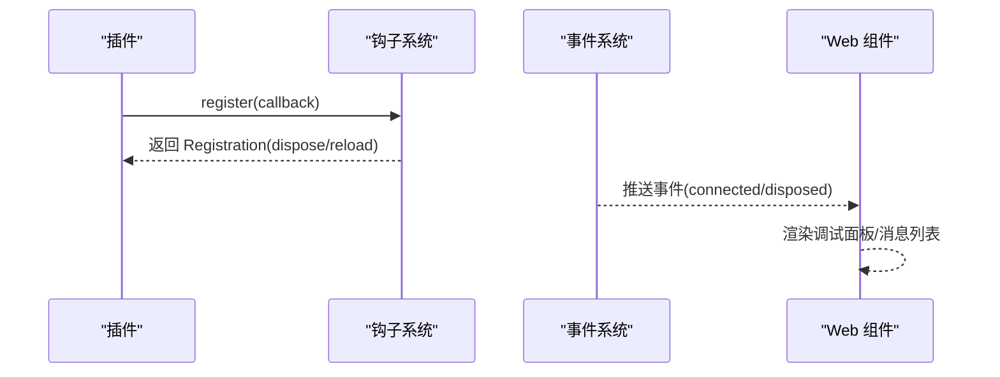
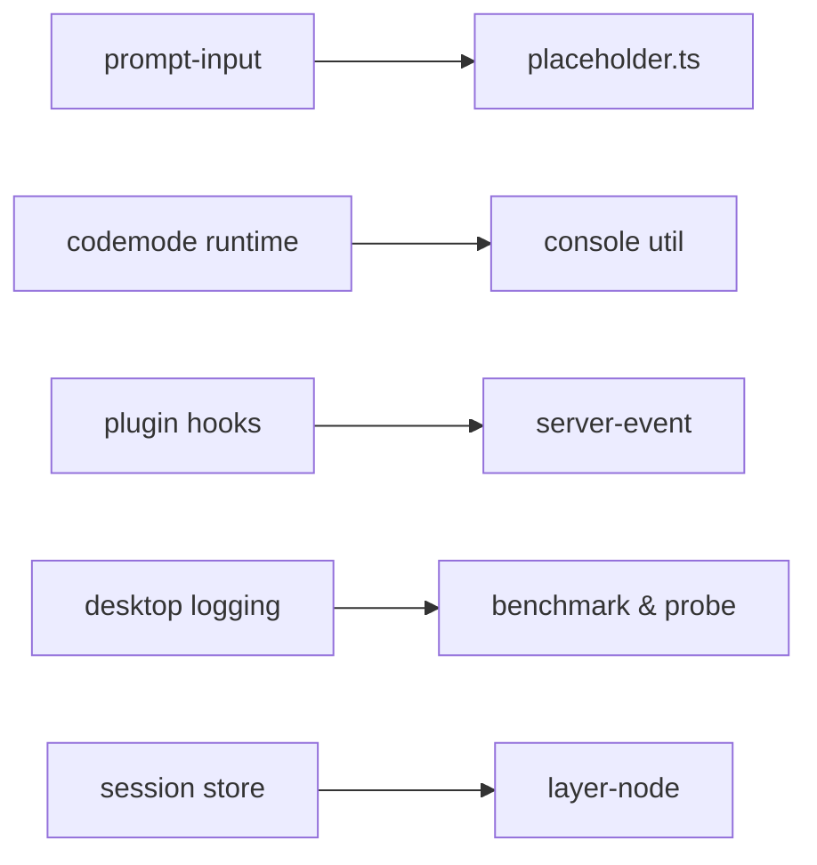

# 自定义提示开发

<cite>
**本文引用的文件**   
- [README.md](file://README.md)
- [CONTRIBUTING.md](file://CONTRIBUTING.md)
- [AGENTS.md](file://AGENTS.md)
- [packages/app/src/components/prompt-input/placeholder.ts](file://packages/app/src/components/prompt-input/placeholder.ts)
- [packages/app/src/components/prompt-input/placeholder.test.ts](file://packages/app/src/components/prompt-input/placeholder.test.ts)
- [packages/codemode/src/interpreter/runtime.ts](file://packages/codemode/src/interpreter/runtime.ts)
- [packages/codemode/test/stdlib.test.ts](file://packages/codemode/test/stdlib.test.ts)
- [packages/plugin/src/v2/effect/registration.ts](file://packages/plugin/src/v2/effect/registration.ts)
- [packages/plugin/src/v2/promise/registration.ts](file://packages/plugin/src/v2/promise/registration.ts)
- [packages/schema/src/server-event.ts](file://packages/schema/src/server-event.ts)
- [packages/desktop/src/main/logging.ts](file://packages/desktop/src/main/logging.ts)
- [packages/console/core/src/util/log.ts](file://packages/console/core/src/util/log.ts)
- [packages/web/src/components/Share.tsx](file://packages/web/src/components/Share.tsx)
- [packages/app/e2e/performance/benchmark.ts](file://packages/app/e2e/performance/benchmark.ts)
- [packages/app/e2e/performance/timeline/session-tab-repaint-probe.ts](file://packages/app/e2e/performance/timeline/session-tab-repaint-probe.ts)
- [packages/core/src/effect/layer-node.ts](file://packages/core/src/effect/layer-node.ts)
- [packages/core/src/session/store.ts](file://packages/core/src/session/store.ts)
- [packages/opencode/test/lib/llm-server.ts](file://packages/opencode/test/lib/llm-server.ts)
- [packages/llm/test/recorded-scenarios.ts](file://packages/llm/test/recorded-scenarios.ts)
</cite>

## 目录
1. [简介](#简介)
2. [项目结构](#项目结构)
3. [核心组件](#核心组件)
4. [架构总览](#架构总览)
5. [详细组件分析](#详细组件分析)
6. [依赖关系分析](#依赖关系分析)
7. [性能考量](#性能考量)
8. [故障排查指南](#故障排查指南)
9. [结论](#结论)
10. [附录](#附录)

## 简介
本文件面向“自定义提示”（Prompt）开发者，系统化说明模板语法规范、调试方法、性能优化技巧、开发工作流以及与现有系统的集成方式。内容基于仓库中的实际实现与测试用例，确保可操作性与可追溯性。

## 项目结构
openNovel 是一个以 Bun 为核心的 monorepo，包含前端 UI、后端服务、插件体系、LLM 交互、桌面端日志与诊断等模块。与“自定义提示”相关的关键位置包括：
- 前端输入占位符与提示文案生成逻辑
- CodeMode 解释器对模板字面量、条件判断、循环迭代与函数调用的支持
- 插件钩子与事件系统，用于注入或替换提示上下文
- 日志与性能诊断工具，用于定位问题与瓶颈
- 会话存储与层式依赖编译，支撑提示执行环境

图表来源 
- [packages/app/src/components/prompt-input/placeholder.ts:1-20](file://packages/app/src/components/prompt-input/placeholder.ts#L1-L20)
- [packages/codemode/src/interpreter/runtime.ts:1018-1066](file://packages/codemode/src/interpreter/runtime.ts#L1018-L1066)
- [packages/plugin/src/v2/effect/registration.ts:1-16](file://packages/plugin/src/v2/effect/registration.ts#L1-L16)
- [packages/schema/src/server-event.ts:1-9](file://packages/schema/src/server-event.ts#L1-L9)
- [packages/console/core/src/util/log.ts:1-55](file://packages/console/core/src/util/log.ts#L1-L55)
- [packages/desktop/src/main/logging.ts:44-88](file://packages/desktop/src/main/logging.ts#L44-L88)
- [packages/app/e2e/performance/benchmark.ts:1-144](file://packages/app/e2e/performance/benchmark.ts#L1-L144)
- [packages/app/e2e/performance/timeline/session-tab-repaint-probe.ts:26-65](file://packages/app/e2e/performance/timeline/session-tab-repaint-probe.ts#L26-L65)
- [packages/core/src/effect/layer-node.ts:244-272](file://packages/core/src/effect/layer-node.ts#L244-L272)
- [packages/core/src/session/store.ts:34-63](file://packages/core/src/session/store.ts#L34-L63)

章节来源
- [README.md:1-77](file://README.md#L1-L77)
- [CONTRIBUTING.md:1-68](file://CONTRIBUTING.md#L1-L68)
- [AGENTS.md:1-162](file://AGENTS.md#L1-L162)

## 核心组件
- 提示占位符与文案生成：根据模式、评论数量、是否建议等参数动态选择提示文案，便于用户理解当前输入能力。
- CodeMode 解释器：提供模板字面量插值、条件表达式、循环语句、数组展开、函数调用与控制流语义，是自定义提示模板的执行引擎。
- 插件钩子系统：通过 Effect 或 Promise 两种风格注册回调，支持热重载与资源释放，用于注入上下文或替换默认提示。
- 事件系统：定义服务器与插件事件，驱动状态同步与跨模块通信。
- 日志与诊断：桌面端日志导出、网络日志捕获、浏览器性能追踪与重绘探针，辅助定位性能瓶颈。
- 会话存储与层式依赖：持久化会话与消息，编译层依赖图并缓存结果，提升启动与执行效率。

章节来源
- [packages/app/src/components/prompt-input/placeholder.ts:1-20](file://packages/app/src/components/prompt-input/placeholder.ts#L1-L20)
- [packages/codemode/src/interpreter/runtime.ts:1018-1066](file://packages/codemode/src/interpreter/runtime.ts#L1018-L1066)
- [packages/plugin/src/v2/effect/registration.ts:1-16](file://packages/plugin/src/v2/effect/registration.ts#L1-L16)
- [packages/schema/src/server-event.ts:1-9](file://packages/schema/src/server-event.ts#L1-L9)
- [packages/desktop/src/main/logging.ts:44-88](file://packages/desktop/src/main/logging.ts#L44-L88)
- [packages/core/src/effect/layer-node.ts:244-272](file://packages/core/src/effect/layer-node.ts#L244-L272)
- [packages/core/src/session/store.ts:34-63](file://packages/core/src/session/store.ts#L34-L63)

## 架构总览
下图展示“自定义提示”从前端输入到模板执行、插件注入、事件通知与日志追踪的整体流程。

图表来源 
- [packages/app/src/components/prompt-input/placeholder.ts:1-20](file://packages/app/src/components/prompt-input/placeholder.ts#L1-L20)
- [packages/codemode/src/interpreter/runtime.ts:1406-1439](file://packages/codemode/src/interpreter/runtime.ts#L1406-L1439)
- [packages/plugin/src/v2/effect/registration.ts:1-16](file://packages/plugin/src/v2/effect/registration.ts#L1-L16)
- [packages/schema/src/server-event.ts:1-9](file://packages/schema/src/server-event.ts#L1-L9)
- [packages/desktop/src/main/logging.ts:44-88](file://packages/desktop/src/main/logging.ts#L44-L88)
- [packages/core/src/session/store.ts:34-63](file://packages/core/src/session/store.ts#L34-L63)

## 详细组件分析

### 模板语法规范（变量引用、条件判断、循环迭代、函数调用）
- 变量引用：通过标识符解析获取绑定值；在模板插值中，边界值会被安全地转换为字符串形式（如 ISO 日期、正则字面量）。
- 条件判断：支持三元表达式与 if/else 分支，按测试节点求值后进入相应分支。
- 循环迭代：支持 for/for-in 等循环结构，具备独立的迭代作用域与更新表达式；数组展开语法可用。
- 函数调用：CallExpression 支持调用宿主暴露的函数与工具引用；控制台输出方法被白名单限制，避免不安全操作。

图表来源 
- [packages/codemode/src/interpreter/runtime.ts:1406-1439](file://packages/codemode/src/interpreter/runtime.ts#L1406-L1439)
- [packages/codemode/src/interpreter/runtime.ts:1018-1066](file://packages/codemode/src/interpreter/runtime.ts#L1018-L1066)
- [packages/codemode/src/interpreter/runtime.ts:2894-2922](file://packages/codemode/src/interpreter/runtime.ts#L2894-L2922)
- [packages/codemode/src/interpreter/runtime.ts:1964-1982](file://packages/codemode/src/interpreter/runtime.ts#L1964-L1982)

章节来源
- [packages/codemode/src/interpreter/runtime.ts:1406-1439](file://packages/codemode/src/interpreter/runtime.ts#L1406-L1439)
- [packages/codemode/src/interpreter/runtime.ts:1018-1066](file://packages/codemode/src/interpreter/runtime.ts#L1018-L1066)
- [packages/codemode/src/interpreter/runtime.ts:2894-2922](file://packages/codemode/src/interpreter/runtime.ts#L2894-L2922)
- [packages/codemode/test/stdlib.test.ts:61-93](file://packages/codemode/test/stdlib.test.ts#L61-L93)

### 调试方法（提示词预览、执行日志分析、性能瓶颈定位）
- 提示词预览：前端组件根据模式与上下文动态显示占位文案，便于快速验证输入预期。
- 执行日志分析：控制台输出方法被限制为白名单集合，深度格式化对象与数组，避免循环引用导致崩溃；桌面端支持导出完整调试包（含网络日志、崩溃转储）。
- 性能瓶颈定位：使用 Playwright 基准框架收集 Chrome Trace，结合重绘探针统计样本与错误分类，定位渲染抖动与回流问题。

图表来源 
- [packages/app/src/components/prompt-input/placeholder.ts:1-20](file://packages/app/src/components/prompt-input/placeholder.ts#L1-L20)
- [packages/console/core/src/util/log.ts:1-55](file://packages/console/core/src/util/log.ts#L1-L55)
- [packages/desktop/src/main/logging.ts:44-88](file://packages/desktop/src/main/logging.ts#L44-L88)
- [packages/app/e2e/performance/benchmark.ts:1-144](file://packages/app/e2e/performance/benchmark.ts#L1-L144)
- [packages/app/e2e/performance/timeline/session-tab-repaint-probe.ts:26-65](file://packages/app/e2e/performance/timeline/session-tab-repaint-probe.ts#L26-L65)

章节来源
- [packages/app/src/components/prompt-input/placeholder.ts:1-20](file://packages/app/src/components/prompt-input/placeholder.ts#L1-L20)
- [packages/console/core/src/util/log.ts:1-55](file://packages/console/core/src/util/log.ts#L1-L55)
- [packages/desktop/src/main/logging.ts:44-88](file://packages/desktop/src/main/logging.ts#L44-L88)
- [packages/app/e2e/performance/benchmark.ts:1-144](file://packages/app/e2e/performance/benchmark.ts#L1-L144)
- [packages/app/e2e/performance/timeline/session-tab-repaint-probe.ts:26-65](file://packages/app/e2e/performance/timeline/session-tab-repaint-probe.ts#L26-L65)

### 性能优化技巧（模板缓存、懒加载、异步处理）
- 模板缓存：层式依赖编译过程中维护 Map 缓存，避免重复构建与合并，提高启动与执行效率。
- 懒加载：重型模块按需动态导入，减少启动开销；在窄作用域内解绑绑定，保持代码路径清晰。
- 异步处理：插件钩子与事件系统支持 Promise/Effect 双模型，允许非阻塞执行与资源释放；会话存储采用 Effect 编排 IO 操作。

图表来源 
- [packages/core/src/effect/layer-node.ts:244-272](file://packages/core/src/effect/layer-node.ts#L244-L272)
- [packages/core/src/session/store.ts:34-63](file://packages/core/src/session/store.ts#L34-L63)
- [packages/plugin/src/v2/effect/registration.ts:1-16](file://packages/plugin/src/v2/effect/registration.ts#L1-L16)

章节来源
- [packages/core/src/effect/layer-node.ts:244-272](file://packages/core/src/effect/layer-node.ts#L244-L272)
- [packages/core/src/session/store.ts:34-63](file://packages/core/src/session/store.ts#L34-L63)
- [packages/plugin/src/v2/effect/registration.ts:1-16](file://packages/plugin/src/v2/effect/registration.ts#L1-L16)

### 开发工作流（模板设计、单元测试、集成测试、部署流程）
- 模板设计：在 CodeMode 解释器支持的语法范围内编写模板，利用控制台输出进行逐步调试。
- 单元测试：针对占位符生成逻辑与标准库行为编写测试，覆盖边界条件与类型转换。
- 集成测试：使用 LLM 服务端模拟与录制场景，验证工具调用、推理与输出一致性。
- 部署流程：遵循贡献指南与风格规范，提交前运行类型检查、测试与 lint；变更协议后重新生成 SDK。

章节来源
- [packages/app/src/components/prompt-input/placeholder.test.ts:1-48](file://packages/app/src/components/prompt-input/placeholder.test.ts#L1-L48)
- [packages/llm/test/recorded-scenarios.ts:157-194](file://packages/llm/test/recorded-scenarios.ts#L157-L194)
- [packages/opencode/test/lib/llm-server.ts:349-392](file://packages/opencode/test/lib/llm-server.ts#L349-L392)
- [CONTRIBUTING.md:1-68](file://CONTRIBUTING.md#L1-L68)
- [AGENTS.md:1-162](file://AGENTS.md#L1-L162)

### 与现有系统集成（钩子注册、事件监听、状态同步）
- 钩子注册：插件通过 Effect 或 Promise 接口注册回调，支持 dispose 与 reload，确保生命周期可控。
- 事件监听：服务器与插件事件统一通过事件库存管理，订阅者接收结构化数据并响应。
- 状态同步：Web 组件支持调试视图，实时展示消息列表与 JSON 序列化结果，便于观察状态变化。

图表来源 
- [packages/plugin/src/v2/effect/registration.ts:1-16](file://packages/plugin/src/v2/effect/registration.ts#L1-L16)
- [packages/plugin/src/v2/promise/registration.ts:1-11](file://packages/plugin/src/v2/promise/registration.ts#L1-L11)
- [packages/schema/src/server-event.ts:1-9](file://packages/schema/src/server-event.ts#L1-L9)
- [packages/web/src/components/Share.tsx:435-466](file://packages/web/src/components/Share.tsx#L435-L466)

章节来源
- [packages/plugin/src/v2/effect/registration.ts:1-16](file://packages/plugin/src/v2/effect/registration.ts#L1-L16)
- [packages/plugin/src/v2/promise/registration.ts:1-11](file://packages/plugin/src/v2/promise/registration.ts#L1-L11)
- [packages/schema/src/server-event.ts:1-9](file://packages/schema/src/server-event.ts#L1-L9)
- [packages/web/src/components/Share.tsx:435-466](file://packages/web/src/components/Share.tsx#L435-L466)

## 依赖关系分析
- 组件耦合：前端输入组件依赖占位符生成逻辑；解释器依赖控制台输出与工具引用；插件钩子与事件系统松耦合，通过类型化接口通信。
- 外部依赖：Bun 运行时、Effect 库、Playwright 测试框架、Chrome Trace 采集。
- 潜在循环：层式依赖编译避免循环，通过缓存与扁平化合并降低复杂度。

图表来源 
- [packages/app/src/components/prompt-input/placeholder.ts:1-20](file://packages/app/src/components/prompt-input/placeholder.ts#L1-L20)
- [packages/codemode/src/interpreter/runtime.ts:1964-1982](file://packages/codemode/src/interpreter/runtime.ts#L1964-L1982)
- [packages/plugin/src/v2/effect/registration.ts:1-16](file://packages/plugin/src/v2/effect/registration.ts#L1-L16)
- [packages/schema/src/server-event.ts:1-9](file://packages/schema/src/server-event.ts#L1-L9)
- [packages/desktop/src/main/logging.ts:44-88](file://packages/desktop/src/main/logging.ts#L44-L88)
- [packages/app/e2e/performance/benchmark.ts:1-144](file://packages/app/e2e/performance/benchmark.ts#L1-L144)
- [packages/core/src/effect/layer-node.ts:244-272](file://packages/core/src/effect/layer-node.ts#L244-L272)
- [packages/core/src/session/store.ts:34-63](file://packages/core/src/session/store.ts#L34-L63)

章节来源
- [packages/app/src/components/prompt-input/placeholder.ts:1-20](file://packages/app/src/components/prompt-input/placeholder.ts#L1-L20)
- [packages/codemode/src/interpreter/runtime.ts:1964-1982](file://packages/codemode/src/interpreter/runtime.ts#L1964-L1982)
- [packages/plugin/src/v2/effect/registration.ts:1-16](file://packages/plugin/src/v2/effect/registration.ts#L1-L16)
- [packages/schema/src/server-event.ts:1-9](file://packages/schema/src/server-event.ts#L1-L9)
- [packages/desktop/src/main/logging.ts:44-88](file://packages/desktop/src/main/logging.ts#L44-L88)
- [packages/app/e2e/performance/benchmark.ts:1-144](file://packages/app/e2e/performance/benchmark.ts#L1-L144)
- [packages/core/src/effect/layer-node.ts:244-272](file://packages/core/src/effect/layer-node.ts#L244-L272)
- [packages/core/src/session/store.ts:34-63](file://packages/core/src/session/store.ts#L34-L63)

## 性能考量
- 模板执行：避免深层递归与复杂正则；合理使用插值与类型转换，减少边界序列化开销。
- 日志输出：控制台格式化设置最大深度，防止大对象导致卡顿；仅在必要时启用网络日志。
- 渲染稳定性：使用重绘探针识别错位与多余重排，关注首帧与切换时的视觉稳定性指标。
- 依赖编译：层式依赖缓存与合并减少重复计算；按需动态导入降低冷启动时间。

[本节为通用指导，不直接分析具体文件]

## 故障排查指南
- 提示文案异常：检查占位符生成逻辑的参数组合（模式、评论数、建议开关），确认翻译键与示例值正确。
- 模板执行错误：查看控制台输出与错误堆栈，确认变量绑定与作用域；检查循环与条件分支逻辑。
- 性能问题：导出调试包，分析网络请求与 CPU 火焰图；结合重绘探针统计样本分类，定位抖动源。
- 插件生命周期：确保 dispose 与 reload 正确实现，避免内存泄漏与重复注册。

章节来源
- [packages/app/src/components/prompt-input/placeholder.ts:1-20](file://packages/app/src/components/prompt-input/placeholder.ts#L1-L20)
- [packages/console/core/src/util/log.ts:1-55](file://packages/console/core/src/util/log.ts#L1-L55)
- [packages/desktop/src/main/logging.ts:44-88](file://packages/desktop/src/main/logging.ts#L44-L88)
- [packages/app/e2e/performance/timeline/session-tab-repaint-probe.ts:26-65](file://packages/app/e2e/performance/timeline/session-tab-repaint-probe.ts#L26-L65)

## 结论
通过 CodeMode 解释器、插件钩子与事件系统，openNovel 提供了强大且可扩展的“自定义提示”能力。配合完善的调试与性能工具，开发者可以高效设计、测试与优化模板，并与现有系统无缝集成。遵循风格与贡献规范，可保障代码质量与团队协作效率。

[本节为总结性内容，不直接分析具体文件]

## 附录
- 最佳实践
  - 模板尽量简洁，避免复杂嵌套与副作用。
  - 使用占位符与示例提升用户体验。
  - 通过插件钩子注入领域上下文，而非硬编码。
  - 启用最小必要日志，定期清理历史日志。
- 常见问题
  - 模板插值类型不匹配：确保边界值可安全转换为字符串。
  - 循环作用域污染：使用独立迭代作用域，避免变量泄露。
  - 插件未释放资源：实现 dispose 并在卸载时调用。
  - 性能回退：禁用不必要的网络日志与重绘探针，聚焦关键路径。

[本节为通用指导，不直接分析具体文件]