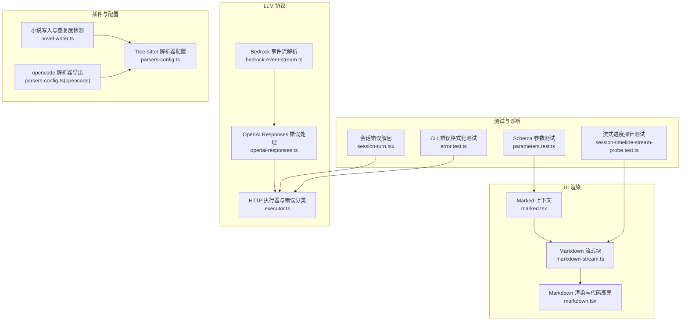
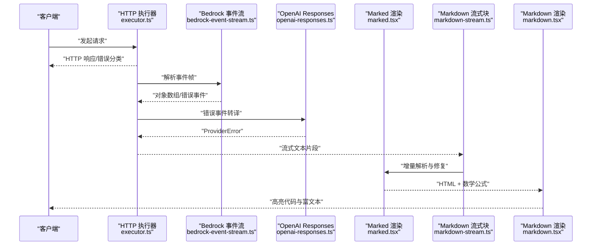
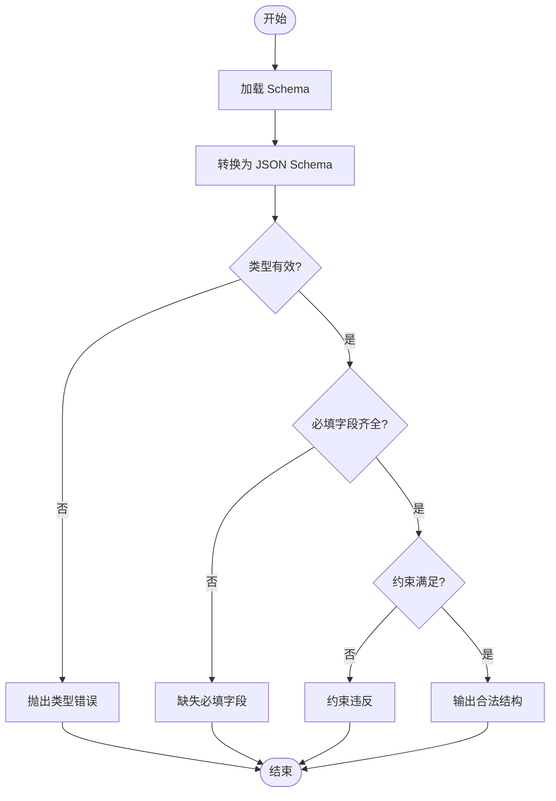
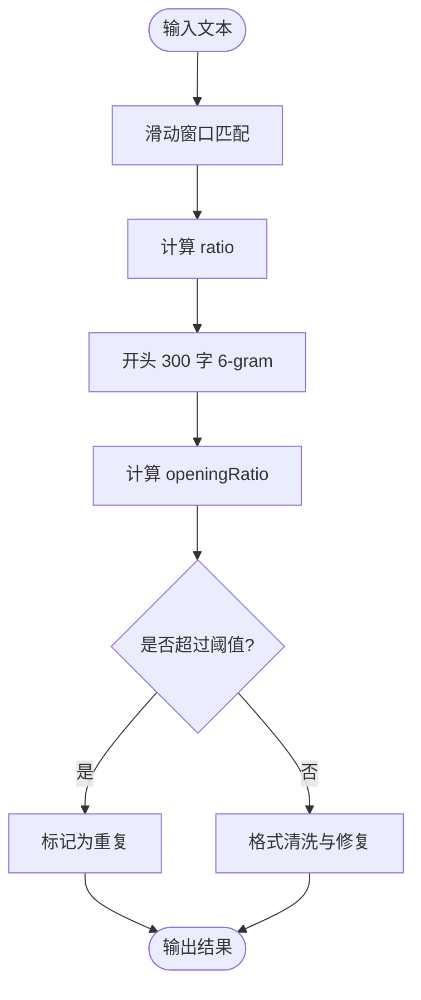
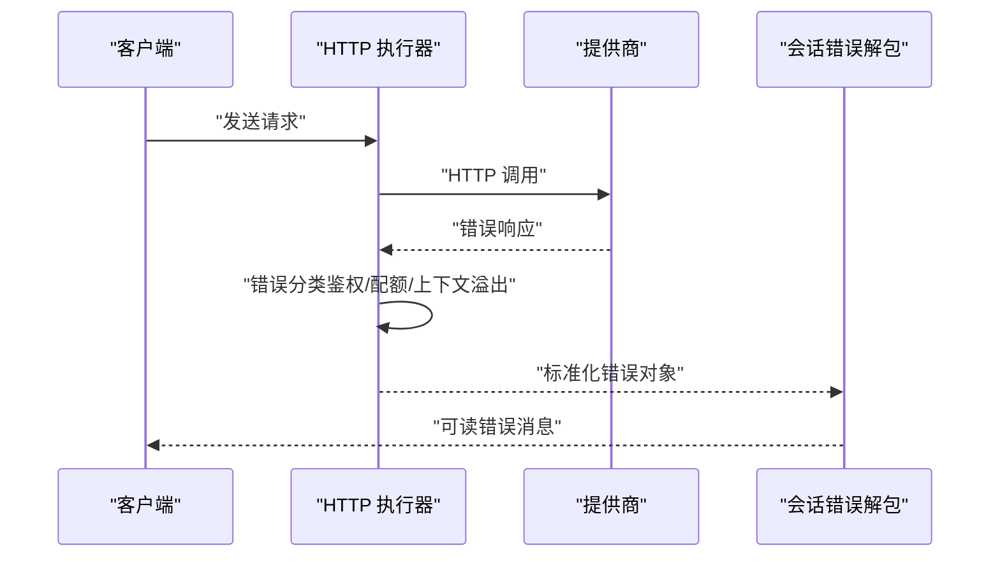
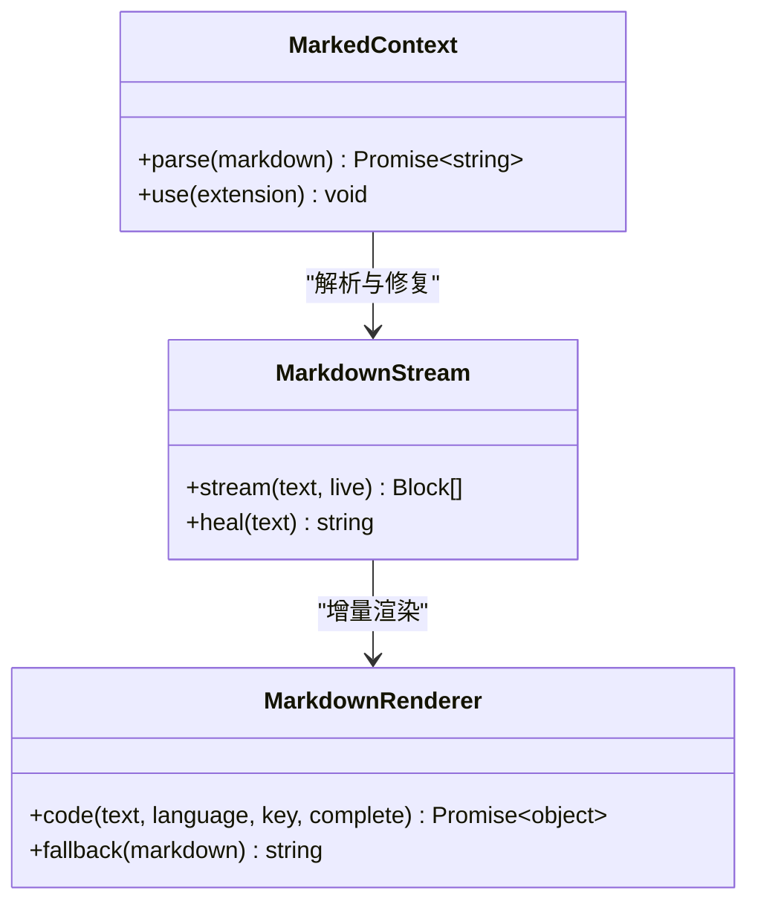
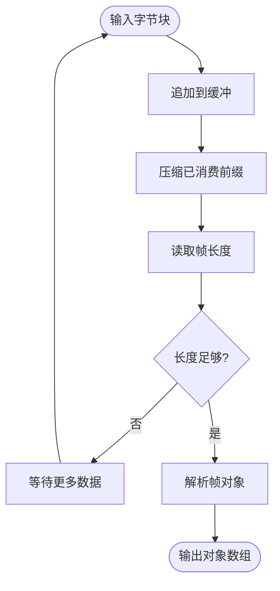
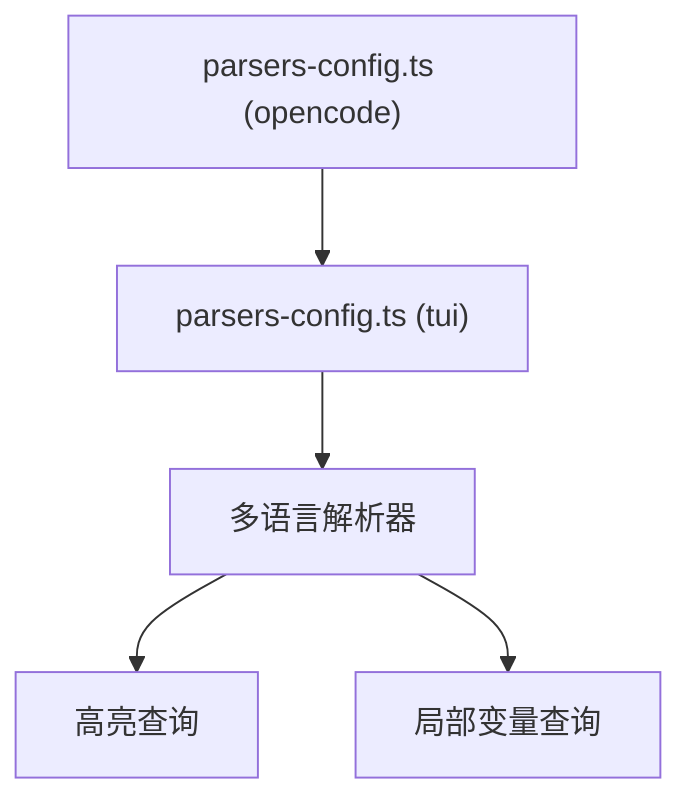
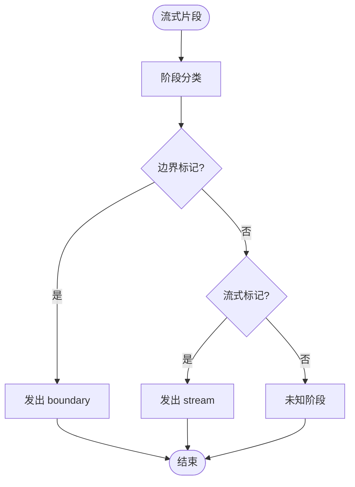
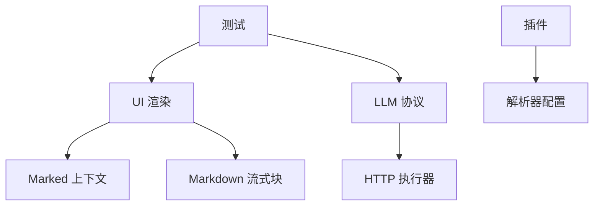

# 输出解析机制

<cite>
**本文引用的文件**   
- [packages/plugin/src/novel-writer.ts](file://packages/plugin/src/novel-writer.ts)
- [packages/ui/src/context/marked.tsx](file://packages/ui/src/context/marked.tsx)
- [packages/session-ui/src/components/markdown-stream.ts](file://packages/session-ui/src/components/markdown-stream.ts)
- [packages/session-ui/src/components/markdown.tsx](file://packages/session-ui/src/components/markdown.tsx)
- [packages/llm/src/protocols/bedrock-event-stream.ts](file://packages/llm/src/protocols/bedrock-event-stream.ts)
- [packages/llm/src/protocols/openai-responses.ts](file://packages/llm/src/protocols/openai-responses.ts)
- [packages/llm/src/route/executor.ts](file://packages/llm/src/route/executor.ts)
- [packages/opencode/test/tool/parameters.test.ts](file://packages/opencode/test/tool/parameters.test.ts)
- [packages/codemode/src/tool-schema.ts](file://packages/codemode/src/tool-schema.ts)
- [packages/tui/src/parsers-config.ts](file://packages/tui/src/parsers-config.ts)
- [packages/opencode/parsers-config.ts](file://packages/opencode/parsers-config.ts)
- [packages/app/e2e/performance/unit/session-timeline-stream-probe.test.ts](file://packages/app/e2e/performance/unit/session-timeline-stream-probe.test.ts)
- [packages/session-ui/src/components/session-turn.tsx](file://packages/session-ui/src/components/session-turn.tsx)
- [packages/opencode/test/cli/error.test.ts](file://packages/opencode/test/cli/error.test.ts)
</cite>

## 目录
1. [简介](#简介)
2. [项目结构](#项目结构)
3. [核心组件](#核心组件)
4. [架构总览](#架构总览)
5. [详细组件分析](#详细组件分析)
6. [依赖关系分析](#依赖关系分析)
7. [性能考量](#性能考量)
8. [故障排查指南](#故障排查指南)
9. [结论](#结论)
10. [附录](#附录)（如有需要）

## 简介
本文件面向“输出解析机制”，聚焦于从 LLM 返回的流式或批量内容，如何被安全、高效地解析与校验，并最终渲染为 Markdown/富文本。文档覆盖：
- JSON 结构化解析流程：Schema 验证、字段类型检查、必填项校验
- 内容验证规则：字数统计、重复度检测、敏感内容过滤、格式合规性检查
- 错误恢复机制：解析失败重试、降级处理、用户反馈
- 输出格式化选项：Markdown 渲染、代码高亮、数学公式与富文本转换
- 性能优化：流式解析、内存管理、并发处理
- 日志记录与调试工具使用

## 项目结构
与输出解析相关的关键模块分布在 UI 渲染、LLM 协议适配、插件侧内容质量检查以及配置与测试中：
- UI 层负责 Markdown 渲染、代码高亮、数学公式与流式增量更新
- LLM 协议层负责事件流解析、帧缓冲、错误分类与上下文溢出识别
- 插件侧提供内容质量检查（如重复度检测）
- 配置层提供语言/语法解析器清单
- 测试覆盖 Schema 生成、流式进度标记等关键行为

**图表来源** 
- [packages/ui/src/context/marked.tsx:411-570](file://packages/ui/src/context/marked.tsx#L411-L570)
- [packages/session-ui/src/components/markdown-stream.ts:48-79](file://packages/session-ui/src/components/markdown-stream.ts#L48-L79)
- [packages/session-ui/src/components/markdown.tsx:65-640](file://packages/session-ui/src/components/markdown.tsx#L65-L640)
- [packages/llm/src/protocols/bedrock-event-stream.ts:22-42](file://packages/llm/src/protocols/bedrock-event-stream.ts#L22-L42)
- [packages/llm/src/protocols/openai-responses.ts:904-921](file://packages/llm/src/protocols/openai-responses.ts#L904-L921)
- [packages/llm/src/route/executor.ts:225-265](file://packages/llm/src/route/executor.ts#L225-L265)
- [packages/plugin/src/novel-writer.ts:2307-2366](file://packages/plugin/src/novel-writer.ts#L2307-L2366)
- [packages/tui/src/parsers-config.ts:1-387](file://packages/tui/src/parsers-config.ts#L1-L387)
- [packages/opencode/parsers-config.ts:1-2](file://packages/opencode/parsers-config.ts#L1-L2)
- [packages/opencode/test/tool/parameters.test.ts:56-84](file://packages/opencode/test/tool/parameters.test.ts#L56-L84)
- [packages/app/e2e/performance/unit/session-timeline-stream-probe.test.ts:1-14](file://packages/app/e2e/performance/unit/session-timeline-stream-probe.test.ts#L1-L14)
- [packages/session-ui/src/components/session-turn.tsx:29-80](file://packages/session-ui/src/components/session-turn.tsx#L29-L80)
- [packages/opencode/test/cli/error.test.ts:36-65](file://packages/opencode/test/cli/error.test.ts#L36-L65)

**章节来源**
- [packages/ui/src/context/marked.tsx:411-570](file://packages/ui/src/context/marked.tsx#L411-L570)
- [packages/session-ui/src/components/markdown-stream.ts:48-79](file://packages/session-ui/src/components/markdown-stream.ts#L48-L79)
- [packages/session-ui/src/components/markdown.tsx:65-640](file://packages/session-ui/src/components/markdown.tsx#L65-L640)
- [packages/llm/src/protocols/bedrock-event-stream.ts:22-42](file://packages/llm/src/protocols/bedrock-event-stream.ts#L22-L42)
- [packages/llm/src/protocols/openai-responses.ts:904-921](file://packages/llm/src/protocols/openai-responses.ts#L904-L921)
- [packages/llm/src/route/executor.ts:225-265](file://packages/llm/src/route/executor.ts#L225-L265)
- [packages/plugin/src/novel-writer.ts:2307-2366](file://packages/plugin/src/novel-writer.ts#L2307-L2366)
- [packages/tui/src/parsers-config.ts:1-387](file://packages/tui/src/parsers-config.ts#L1-L387)
- [packages/opencode/parsers-config.ts:1-2](file://packages/opencode/parsers-config.ts#L1-L2)
- [packages/opencode/test/tool/parameters.test.ts:56-84](file://packages/opencode/test/tool/parameters.test.ts#L56-L84)
- [packages/app/e2e/performance/unit/session-timeline-stream-probe.test.ts:1-14](file://packages/app/e2e/performance/unit/session-timeline-stream-probe.test.ts#L1-L14)
- [packages/session-ui/src/components/session-turn.tsx:29-80](file://packages/session-ui/src/components/session-turn.tsx#L29-L80)
- [packages/opencode/test/cli/error.test.ts:36-65](file://packages/opencode/test/cli/error.test.ts#L36-L65)

## 核心组件
- JSON 结构化解析与 Schema 验证
  - 通过 Schema 到 JSON Schema 的转换，确保模型输出符合预期结构与约束（类型、必填、范围、模式）。
  - 参考测试用例验证了内联子 Schema、可空字段保留、allOf 约束保留、整数安全边界等。
- 内容验证规则
  - 重复度检测：窗口匹配 + n-gram Jaccard 相似度，用于发现“照抄”和“重演”级重复。
  - 字数统计与格式合规性：在 Markdown 渲染前进行基础清洗与修复，避免非法片段进入渲染管线。
- 错误恢复机制
  - HTTP 层错误分类（鉴权、配额、限流、上下文溢出等），结合响应体语义判断。
  - 流式解析中的错误事件统一转换为 ProviderError，便于上层重试或降级。
- 输出格式化选项
  - Markdown 渲染：支持链接、数学公式（KaTeX）、代码高亮（Shiki WASM）。
  - 流式增量渲染：按 token 边界切分，保证稳定部分不抖动。
- 性能优化
  - 流式帧缓冲与紧凑内存管理，限制缓冲区增长。
  - 按需加载语言与主题，减少初始开销。
  - 并发处理：多语言高亮与数学公式渲染异步化。

**章节来源**
- [packages/opencode/test/tool/parameters.test.ts:56-84](file://packages/opencode/test/tool/parameters.test.ts#L56-L84)
- [packages/codemode/src/tool-schema.ts:67-178](file://packages/codemode/src/tool-schema.ts#L67-L178)
- [packages/plugin/src/novel-writer.ts:2307-2366](file://packages/plugin/src/novel-writer.ts#L2307-L2366)
- [packages/llm/src/route/executor.ts:225-265](file://packages/llm/src/route/executor.ts#L225-L265)
- [packages/llm/src/protocols/openai-responses.ts:904-921](file://packages/llm/src/protocols/openai-responses.ts#L904-L921)
- [packages/ui/src/context/marked.tsx:411-570](file://packages/ui/src/context/marked.tsx#L411-L570)
- [packages/session-ui/src/components/markdown-stream.ts:48-79](file://packages/session-ui/src/components/markdown-stream.ts#L48-L79)
- [packages/session-ui/src/components/markdown.tsx:65-640](file://packages/session-ui/src/components/markdown.tsx#L65-L640)
- [packages/llm/src/protocols/bedrock-event-stream.ts:22-42](file://packages/llm/src/protocols/bedrock-event-stream.ts#L22-L42)

## 架构总览
下图展示了从 LLM 协议层到 UI 渲染层的端到端数据流，包括错误分类、流式解析与渲染管线。

**图表来源** 
- [packages/llm/src/route/executor.ts:225-265](file://packages/llm/src/route/executor.ts#L225-L265)
- [packages/llm/src/protocols/bedrock-event-stream.ts:22-42](file://packages/llm/src/protocols/bedrock-event-stream.ts#L22-L42)
- [packages/llm/src/protocols/openai-responses.ts:904-921](file://packages/llm/src/protocols/openai-responses.ts#L904-L921)
- [packages/ui/src/context/marked.tsx:411-570](file://packages/ui/src/context/marked.tsx#L411-L570)
- [packages/session-ui/src/components/markdown-stream.ts:48-79](file://packages/session-ui/src/components/markdown-stream.ts#L48-L79)
- [packages/session-ui/src/components/markdown.tsx:65-640](file://packages/session-ui/src/components/markdown.tsx#L65-L640)

## 详细组件分析

### JSON 结构化解析与 Schema 验证
- 目标：将 TypeScript Schema 转换为 JSON Schema，确保模型输出满足类型、必填、范围与模式约束。
- 关键点：
  - 内联命名子 Schema，提升提供者兼容性
  - 保留可空字段的 anyOf 约束
  - 保留 allOf 重复约束，避免去重丢失信息
  - 整数字段绑定安全范围，防止越界
- 复杂度与优化：
  - 转换过程为线性遍历，时间复杂度 O(n)，空间复杂度 O(n)
  - 对嵌套结构采用深度优先递归，注意栈深度控制

**图表来源** 
- [packages/opencode/test/tool/parameters.test.ts:56-84](file://packages/opencode/test/tool/parameters.test.ts#L56-L84)
- [packages/codemode/src/tool-schema.ts:67-178](file://packages/codemode/src/tool-schema.ts#L67-L178)

**章节来源**
- [packages/opencode/test/tool/parameters.test.ts:56-84](file://packages/opencode/test/tool/parameters.test.ts#L56-L84)
- [packages/codemode/src/tool-schema.ts:67-178](file://packages/codemode/src/tool-schema.ts#L67-L178)

### 内容验证规则：重复度检测与格式合规性
- 重复度检测：
  - 50 字符窗口（步长 10）匹配前文章节，计算“照抄”比例
  - 开头 300 字 6-gram Jaccard 相似度，捕捉“重演”场景
  - 阈值判定：ratio > 0.15 或 openingRatio > 0.05 视为重复
- 格式合规性：
  - Markdown 流式解析时进行修复（remend），避免不完整片段导致渲染异常
  - 代码块与数学公式隔离处理，防止误解析

**图表来源** 
- [packages/plugin/src/novel-writer.ts:2307-2366](file://packages/plugin/src/novel-writer.ts#L2307-L2366)
- [packages/session-ui/src/components/markdown-stream.ts:48-79](file://packages/session-ui/src/components/markdown-stream.ts#L48-L79)

**章节来源**
- [packages/plugin/src/novel-writer.ts:2307-2366](file://packages/plugin/src/novel-writer.ts#L2307-L2366)
- [packages/session-ui/src/components/markdown-stream.ts:48-79](file://packages/session-ui/src/components/markdown-stream.ts#L48-L79)

### 错误恢复机制：重试、降级与用户反馈
- HTTP 层错误分类：
  - 鉴权失败（401/403）、配额不足（429）、上下文溢出（400/404/409/413/422）
  - 基于响应体正则匹配 content policy/safety 等关键词
- 流式错误处理：
  - OpenAI Responses 错误统一转为 ProviderError，携带分类信息
- 用户反馈：
  - 会话错误解包：从字符串中提取 JSON 或提取 message/type/code 字段，形成可读提示
  - CLI 错误格式化：针对配置 JSONC 诊断、账户传输错误等进行清晰展示

**图表来源** 
- [packages/llm/src/route/executor.ts:225-265](file://packages/llm/src/route/executor.ts#L225-L265)
- [packages/llm/src/protocols/openai-responses.ts:904-921](file://packages/llm/src/protocols/openai-responses.ts#L904-L921)
- [packages/session-ui/src/components/session-turn.tsx:29-80](file://packages/session-ui/src/components/session-turn.tsx#L29-L80)
- [packages/opencode/test/cli/error.test.ts:36-65](file://packages/opencode/test/cli/error.test.ts#L36-L65)

**章节来源**
- [packages/llm/src/route/executor.ts:225-265](file://packages/llm/src/route/executor.ts#L225-L265)
- [packages/llm/src/protocols/openai-responses.ts:904-921](file://packages/llm/src/protocols/openai-responses.ts#L904-L921)
- [packages/session-ui/src/components/session-turn.tsx:29-80](file://packages/session-ui/src/components/session-turn.tsx#L29-L80)
- [packages/opencode/test/cli/error.test.ts:36-65](file://packages/opencode/test/cli/error.test.ts#L36-L65)

### 输出格式化选项：Markdown 渲染、代码高亮与富文本转换
- Markdown 渲染：
  - 使用 marked 扩展，支持外链渲染、KaTeX 数学公式
  - 代码块高亮通过 Shiki WASM 动态加载语言与主题
- 流式增量渲染：
  - 按 token 边界切分，稳定部分不抖动，未完结部分以 live 模式显示
- 富文本转换：
  - HTML 片段清理与修复，数学公式在非代码区域处理，避免误解析

**图表来源** 
- [packages/ui/src/context/marked.tsx:411-570](file://packages/ui/src/context/marked.tsx#L411-L570)
- [packages/session-ui/src/components/markdown-stream.ts:48-79](file://packages/session-ui/src/components/markdown-stream.ts#L48-L79)
- [packages/session-ui/src/components/markdown.tsx:65-640](file://packages/session-ui/src/components/markdown.tsx#L65-L640)

**章节来源**
- [packages/ui/src/context/marked.tsx:411-570](file://packages/ui/src/context/marked.tsx#L411-L570)
- [packages/session-ui/src/components/markdown-stream.ts:48-79](file://packages/session-ui/src/components/markdown-stream.ts#L48-L79)
- [packages/session-ui/src/components/markdown.tsx:65-640](file://packages/session-ui/src/components/markdown.tsx#L65-L640)

### 流式解析与内存管理：Bedrock 事件流
- 帧缓冲策略：
  - 追加新块并压缩已消费前缀，限制缓冲区增长至一个网络块长度
  - 读取头部长度，按帧边界解析对象数组
- 性能特性：
  - 低内存占用，避免大对象累积
  - 流式处理，边收边解析，降低延迟

**图表来源** 
- [packages/llm/src/protocols/bedrock-event-stream.ts:22-42](file://packages/llm/src/protocols/bedrock-event-stream.ts#L22-L42)

**章节来源**
- [packages/llm/src/protocols/bedrock-event-stream.ts:22-42](file://packages/llm/src/protocols/bedrock-event-stream.ts#L22-L42)

### 解析器配置与语言支持
- Tree-sitter 解析器配置：
  - 多种语言（Python、Rust、Go、C++、JSON、YAML 等）的 WASM 解析器与查询文件
  - 支持 highlights 与 locals，增强语法高亮与局部变量识别
- opencode 导出：
  - 复用 tui 的 parsers-config，保持跨端一致性

**图表来源** 
- [packages/tui/src/parsers-config.ts:1-387](file://packages/tui/src/parsers-config.ts#L1-L387)
- [packages/opencode/parsers-config.ts:1-2](file://packages/opencode/parsers-config.ts#L1-L2)

**章节来源**
- [packages/tui/src/parsers-config.ts:1-387](file://packages/tui/src/parsers-config.ts#L1-L387)
- [packages/opencode/parsers-config.ts:1-2](file://packages/opencode/parsers-config.ts#L1-L2)

### 流式进度探针与测试
- 流式进度探针：
  - 根据标记字符串分类阶段（boundary/stream/complete/unknown）
  - 在 fixture 边界处发出进度标记，便于性能基准测试
- 用途：
  - 评估流式渲染稳定性与吞吐
  - 定位卡顿与丢帧问题

**图表来源** 
- [packages/app/e2e/performance/unit/session-timeline-stream-probe.test.ts:1-14](file://packages/app/e2e/performance/unit/session-timeline-stream-probe.test.ts#L1-L14)

**章节来源**
- [packages/app/e2e/performance/unit/session-timeline-stream-probe.test.ts:1-14](file://packages/app/e2e/performance/unit/session-timeline-stream-probe.test.ts#L1-L14)

## 依赖关系分析
- 组件耦合：
  - UI 渲染依赖 Marked 上下文与 Markdown 流式块，二者共同完成增量渲染
  - LLM 协议层与 HTTP 执行器紧密耦合，错误分类直接影响上层重试策略
- 外部依赖：
  - Shiki WASM 用于代码高亮，按需加载语言与主题
  - KaTeX 用于数学公式渲染
  - Tree-sitter WASM 用于语法解析与高亮
- 潜在循环依赖：
  - 当前结构无直接循环，但需注意插件与 UI 之间的接口约定

**图表来源** 
- [packages/ui/src/context/marked.tsx:411-570](file://packages/ui/src/context/marked.tsx#L411-L570)
- [packages/session-ui/src/components/markdown-stream.ts:48-79](file://packages/session-ui/src/components/markdown-stream.ts#L48-L79)
- [packages/llm/src/route/executor.ts:225-265](file://packages/llm/src/route/executor.ts#L225-L265)
- [packages/tui/src/parsers-config.ts:1-387](file://packages/tui/src/parsers-config.ts#L1-L387)
- [packages/app/e2e/performance/unit/session-timeline-stream-probe.test.ts:1-14](file://packages/app/e2e/performance/unit/session-timeline-stream-probe.test.ts#L1-L14)

**章节来源**
- [packages/ui/src/context/marked.tsx:411-570](file://packages/ui/src/context/marked.tsx#L411-L570)
- [packages/session-ui/src/components/markdown-stream.ts:48-79](file://packages/session-ui/src/components/markdown-stream.ts#L48-L79)
- [packages/llm/src/route/executor.ts:225-265](file://packages/llm/src/route/executor.ts#L225-L265)
- [packages/tui/src/parsers-config.ts:1-387](file://packages/tui/src/parsers-config.ts#L1-L387)
- [packages/app/e2e/performance/unit/session-timeline-stream-probe.test.ts:1-14](file://packages/app/e2e/performance/unit/session-timeline-stream-probe.test.ts#L1-L14)

## 性能考量
- 流式解析：
  - 帧缓冲压缩与前缀丢弃，避免内存膨胀
  - 增量渲染仅更新不稳定部分，减少重绘
- 内存管理：
  - 按需加载语言与主题，降低初始内存占用
  - 数学公式与代码高亮异步化，避免阻塞主线程
- 并发处理：
  - 多语言高亮并行加载，提高首屏渲染速度
  - 错误分类与重试策略并行执行，缩短恢复时间

[本节为通用指导，无需特定文件引用]

## 故障排查指南
- 常见错误类型：
  - 鉴权失败（401/403）：检查令牌与权限
  - 配额不足（429）：查看限流策略与重试间隔
  - 上下文溢出（400/404/409/413/422）：缩短输入或启用分段处理
- 调试工具：
  - 会话错误解包：提取 JSON 或 message/type/code，快速定位问题
  - CLI 错误格式化：针对配置 JSONC 诊断与账户传输错误进行清晰展示
  - 流式进度探针：通过标记字符串评估流式渲染稳定性

**章节来源**
- [packages/session-ui/src/components/session-turn.tsx:29-80](file://packages/session-ui/src/components/session-turn.tsx#L29-L80)
- [packages/opencode/test/cli/error.test.ts:36-65](file://packages/opencode/test/cli/error.test.ts#L36-L65)
- [packages/app/e2e/performance/unit/session-timeline-stream-probe.test.ts:1-14](file://packages/app/e2e/performance/unit/session-timeline-stream-probe.test.ts#L1-L14)

## 结论
本输出解析机制通过 Schema 验证、内容质量检查、错误分类与流式渲染，构建了健壮且高效的解析管线。结合内存优化与并发处理，能够在大规模流式场景中保持稳定与高性能。建议在生产环境中启用详细的错误日志与进度探针，以便快速定位与优化性能瓶颈。

[本节为总结，无需特定文件引用]

## 附录
- 术语表：
  - Schema：数据结构定义与约束
  - 流式解析：逐块接收并即时处理数据
  - 帧缓冲：网络数据帧的临时存储与解析
  - 高亮：语法着色与代码可视化
- 最佳实践：
  - 始终对模型输出进行 Schema 验证
  - 使用流式进度探针监控渲染稳定性
  - 合理设置重复度检测阈值，避免误判

[本节为补充信息，无需特定文件引用]