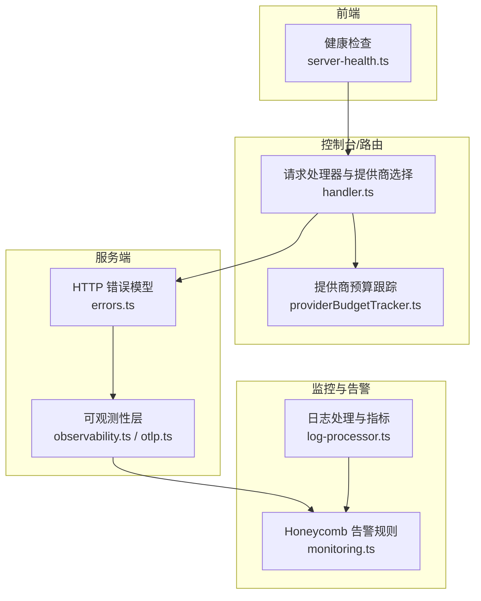
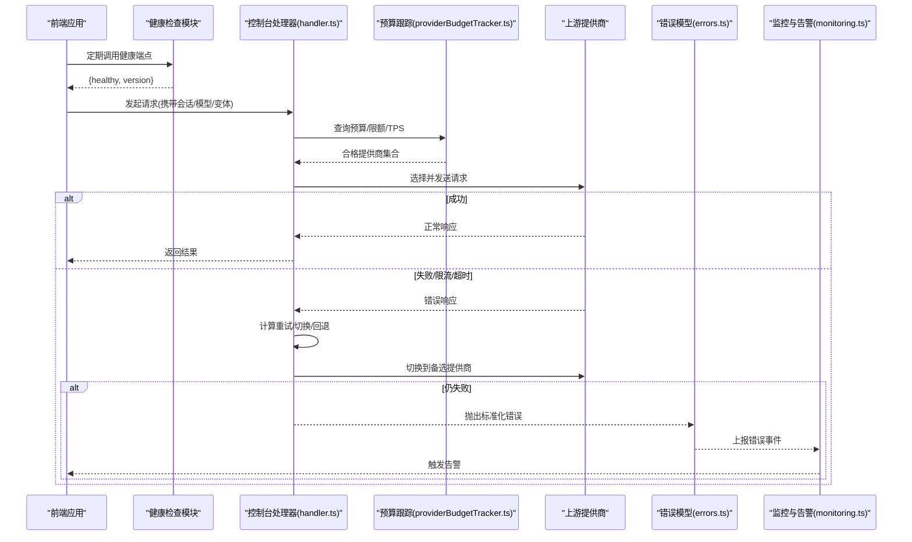
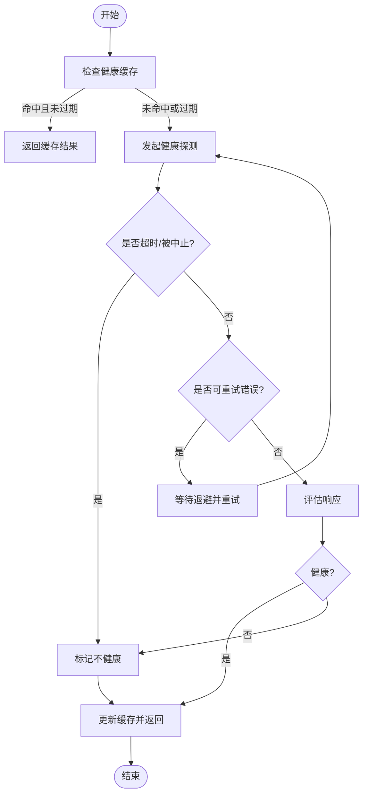
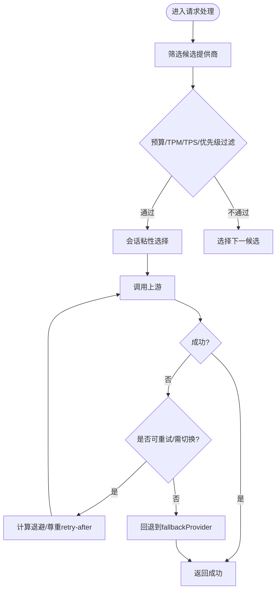
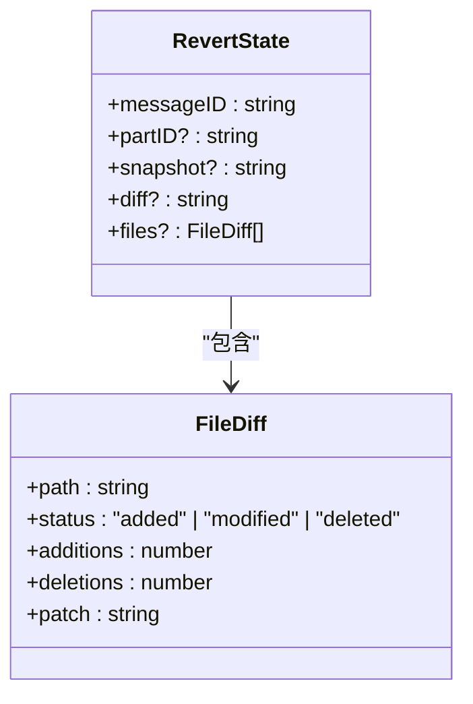
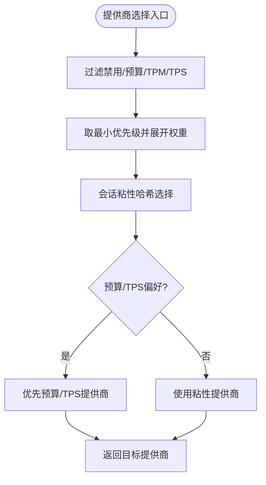
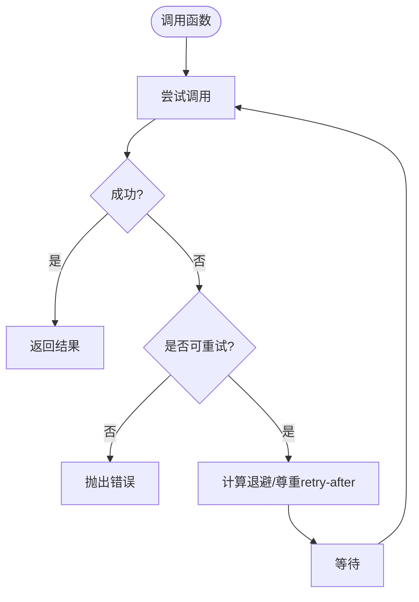
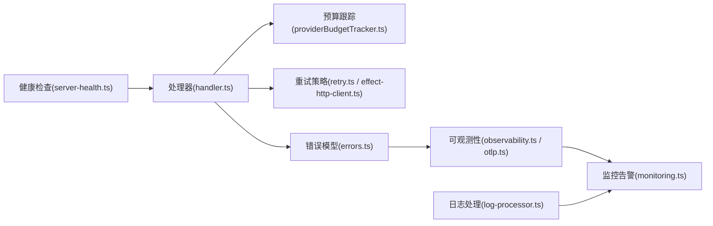

# 故障转移机制

<cite>
**本文引用的文件**   
- [packages/app/src/utils/server-health.ts](file://packages/app/src/utils/server-health.ts)
- [packages/console/app/src/routes/zen/util/handler.ts](file://packages/console/app/src/routes/zen/util/handler.ts)
- [packages/console/app/src/routes/zen/util/providerBudgetTracker.ts](file://packages/console/app/src/routes/zen/util/providerBudgetTracker.ts)
- [packages/core/src/util/retry.ts](file://packages/core/src/util/retry.ts)
- [packages/opencode/src/util/effect-http-client.ts](file://packages/opencode/src/util/effect-http-client.ts)
- [infra/monitoring.ts](file://infra/monitoring.ts)
- [packages/opencode/src/server/routes/instance/httpapi/errors.ts](file://packages/opencode/src/server/routes/instance/httpapi/errors.ts)
- [packages/opencode/test/session/retry.test.ts](file://packages/opencode/test/session/retry.test.ts)
- [packages/schema/src/revert.ts](file://packages/schema/src/revert.ts)
- [packages/opencode/test/snapshot/snapshot.test.ts](file://packages/opencode/test/snapshot/snapshot.test.ts)
- [packages/opencode/test/session/revert-compact.test.ts](file://packages/opencode/test/session/revert-compact.test.ts)
- [packages/core/src/observability.ts](file://packages/core/src/observability.ts)
- [packages/core/src/observability/otlp.ts](file://packages/core/src/observability/otlp.ts)
- [packages/console/function/src/log-processor.ts](file://packages/console/function/src/log-processor.ts)
</cite>

## 目录
1. [简介](#简介)
2. [项目结构](#项目结构)
3. [核心组件](#核心组件)
4. [架构总览](#架构总览)
5. [详细组件分析](#详细组件分析)
6. [依赖关系分析](#依赖关系分析)
7. [性能考量](#性能考量)
8. [故障排查指南](#故障排查指南)
9. [结论](#结论)
10. [附录](#附录)

## 简介
本文件面向 AI 服务的高可用与容错，系统化阐述健康检查、自动切换、回滚与版本管理、多提供商容错（主备/负载均衡/流量分发）、混沌工程与故障注入、以及告警与应急响应配置。内容基于仓库中的前端健康探测、控制台路由选择器、重试策略、错误模型、遥测与监控等实现进行归纳与扩展说明，帮助读者在不深入源码的情况下理解并落地一套健壮的故障转移体系。

## 项目结构
围绕“AI 服务故障转移”的关键代码分布在以下模块：
- 客户端健康探测与轮询：packages/app/src/utils/server-health.ts
- 控制台请求路由与提供商选择（含失败重试与回退）：packages/console/app/src/routes/zen/util/handler.ts
- 提供商预算与配额跟踪：packages/console/app/src/routes/zen/util/providerBudgetTracker.ts
- 通用重试工具与 HTTP 客户端瞬态重试：packages/core/src/util/retry.ts、packages/opencode/src/util/effect-http-client.ts
- 错误模型与 HTTP 状态映射：packages/opencode/src/server/routes/instance/httpapi/errors.ts
- 监控与告警规则：infra/monitoring.ts
- 日志处理与指标上报：packages/console/function/src/log-processor.ts
- 可观测性层（OTLP/Tracing）：packages/core/src/observability.ts、packages/core/src/observability/otlp.ts
- 回滚与快照（版本管理）：packages/schema/src/revert.ts、packages/opencode/test/snapshot/snapshot.test.ts、packages/opencode/test/session/revert-compact.test.ts

图表来源
- [packages/app/src/utils/server-health.ts:70-154](file://packages/app/src/utils/server-health.ts#L70-L154)
- [packages/console/app/src/routes/zen/util/handler.ts:589-665](file://packages/console/app/src/routes/zen/util/handler.ts#L589-L665)
- [packages/console/app/src/routes/zen/util/providerBudgetTracker.ts:39-87](file://packages/console/app/src/routes/zen/util/providerBudgetTracker.ts#L39-L87)
- [packages/opencode/src/server/routes/instance/httpapi/errors.ts:1-51](file://packages/opencode/src/server/routes/instance/httpapi/errors.ts#L1-L51)
- [packages/core/src/observability.ts:1-24](file://packages/core/src/observability.ts#L1-L24)
- [packages/core/src/observability/otlp.ts:1-48](file://packages/core/src/observability/otlp.ts#L1-L48)
- [infra/monitoring.ts:132-287](file://infra/monitoring.ts#L132-L287)
- [packages/console/function/src/log-processor.ts:24-54](file://packages/console/function/src/log-processor.ts#L24-L54)

章节来源
- [packages/app/src/utils/server-health.ts:70-154](file://packages/app/src/utils/server-health.ts#L70-L154)
- [packages/console/app/src/routes/zen/util/handler.ts:589-665](file://packages/console/app/src/routes/zen/util/handler.ts#L589-L665)
- [packages/console/app/src/routes/zen/util/providerBudgetTracker.ts:39-87](file://packages/console/app/src/routes/zen/util/providerBudgetTracker.ts#L39-L87)
- [packages/core/src/util/retry.ts:1-42](file://packages/core/src/util/retry.ts#L1-L42)
- [packages/opencode/src/util/effect-http-client.ts:1-11](file://packages/opencode/src/util/effect-http-client.ts#L1-L11)
- [infra/monitoring.ts:132-287](file://infra/monitoring.ts#L132-L287)
- [packages/opencode/src/server/routes/instance/httpapi/errors.ts:1-51](file://packages/opencode/src/server/routes/instance/httpapi/errors.ts#L1-L51)
- [packages/console/function/src/log-processor.ts:24-54](file://packages/console/function/src/log-processor.ts#L24-L54)
- [packages/core/src/observability.ts:1-24](file://packages/core/src/observability.ts#L1-L24)
- [packages/core/src/observability/otlp.ts:1-48](file://packages/core/src/observability/otlp.ts#L1-L48)

## 核心组件
- 健康检查系统
  - 主动探测：周期性调用后端健康端点，支持超时、重试与缓存，返回健康状态与版本信息。
  - 被动检测：通过业务请求的错误码与响应体判断上游不可用，驱动上层切换或降级。
  - 心跳机制：前端定时刷新健康状态，结合缓存避免频繁探测；服务端可通过健康端点暴露心跳。
- 自动切换策略
  - 故障检测阈值：基于重试次数、错误类型（网络/限流/5xx）判定是否切换。
  - 切换延迟控制：指数退避、上限限制、尊重 retry-after 头。
  - 状态同步：sticky provider、TPM/TPS 限制、预算配额与优先级共同决定目标提供商。
- 回滚机制
  - 版本管理：以快照/差异记录为基础，支持按消息 ID 回滚与撤销。
  - 数据一致性：保证回滚顺序与冲突合并，确保最终一致。
  - 快速恢复：优先回滚到最近稳定快照，必要时使用备用提供商继续服务。
- 多提供商容错
  - 主备模式：最高优先级提供商为主，其余为备；达到最大重试次数后回退至 fallbackProvider。
  - 负载均衡：按权重展开候选集，结合会话粘性哈希选择具体实例。
  - 流量分发：结合预算、TPM/TPS 限制与低 TPS 规避策略动态调整。
- 监控与告警
  - 指标采集：HTTP 错误率、TPS、免费额度用量等。
  - 告警规则：错误率突增、TPS 过低、免费额度异常等触发通知。
- 可观测性与日志
  - OTLP 链路追踪、结构化日志、统一资源属性，便于定位问题。

章节来源
- [packages/app/src/utils/server-health.ts:70-154](file://packages/app/src/utils/server-health.ts#L70-L154)
- [packages/console/app/src/routes/zen/util/handler.ts:589-665](file://packages/console/app/src/routes/zen/util/handler.ts#L589-L665)
- [packages/console/app/src/routes/zen/util/providerBudgetTracker.ts:39-87](file://packages/console/app/src/routes/zen/util/providerBudgetTracker.ts#L39-L87)
- [packages/core/src/util/retry.ts:1-42](file://packages/core/src/util/retry.ts#L1-L42)
- [packages/opencode/src/util/effect-http-client.ts:1-11](file://packages/opencode/src/util/effect-http-client.ts#L1-L11)
- [infra/monitoring.ts:132-287](file://infra/monitoring.ts#L132-L287)
- [packages/opencode/src/server/routes/instance/httpapi/errors.ts:1-51](file://packages/opencode/src/server/routes/instance/httpapi/errors.ts#L1-L51)
- [packages/core/src/observability.ts:1-24](file://packages/core/src/observability.ts#L1-L24)
- [packages/core/src/observability/otlp.ts:1-48](file://packages/core/src/observability/otlp.ts#L1-L48)

## 架构总览
下图展示了从前端健康探测到控制台提供商选择、再到服务端错误处理与监控告警的整体流程。

图表来源
- [packages/app/src/utils/server-health.ts:70-154](file://packages/app/src/utils/server-health.ts#L70-L154)
- [packages/console/app/src/routes/zen/util/handler.ts:589-665](file://packages/console/app/src/routes/zen/util/handler.ts#L589-L665)
- [packages/console/app/src/routes/zen/util/providerBudgetTracker.ts:39-87](file://packages/console/app/src/routes/zen/util/providerBudgetTracker.ts#L39-L87)
- [packages/opencode/src/server/routes/instance/httpapi/errors.ts:1-51](file://packages/opencode/src/server/routes/instance/httpapi/errors.ts#L1-L51)
- [infra/monitoring.ts:132-287](file://infra/monitoring.ts#L132-L287)

## 详细组件分析

### 健康检查系统（主动探测/被动检测/心跳）
- 主动探测
  - 周期性调用健康端点，支持超时信号、重试与结果缓存，返回健康状态与版本。
  - 重试策略针对网络类错误（如连接重置、拒绝、超时）进行有限次重试。
- 被动检测
  - 业务请求失败时，根据错误类型（限流、5xx、超时）触发上层切换逻辑。
- 心跳机制
  - 前端每固定间隔刷新健康状态，结合内存缓存减少重复探测。
  - 服务端健康端点应持续反映进程/依赖的健康度。

图表来源
- [packages/app/src/utils/server-health.ts:70-154](file://packages/app/src/utils/server-health.ts#L70-L154)

章节来源
- [packages/app/src/utils/server-health.ts:70-154](file://packages/app/src/utils/server-health.ts#L70-L154)

### 自动切换策略（阈值/延迟/状态同步）
- 故障检测阈值
  - 最大失败重试次数达到上限后强制切换或回退。
  - 对限流（rate limit）、低 TPS、TPM 超限进行过滤与规避。
- 切换延迟控制
  - 指数退避 + 上限限制，尊重 retry-after-ms 与 retry-after（秒/日期）。
  - 对无效或过大的头部值进行安全裁剪。
- 状态同步
  - 使用 sticky provider 保持会话亲和。
  - 结合预算优先级、TPM/TPS 限制与低 TPS 规避，动态选择最优提供商。

图表来源
- [packages/console/app/src/routes/zen/util/handler.ts:589-665](file://packages/console/app/src/routes/zen/util/handler.ts#L589-L665)
- [packages/console/app/src/routes/zen/util/providerBudgetTracker.ts:39-87](file://packages/console/app/src/routes/zen/util/providerBudgetTracker.ts#L39-L87)
- [packages/opencode/test/session/retry.test.ts:31-88](file://packages/opencode/test/session/retry.test.ts#L31-L88)

章节来源
- [packages/console/app/src/routes/zen/util/handler.ts:589-665](file://packages/console/app/src/routes/zen/util/handler.ts#L589-L665)
- [packages/console/app/src/routes/zen/util/providerBudgetTracker.ts:39-87](file://packages/console/app/src/routes/zen/util/providerBudgetTracker.ts#L39-L87)
- [packages/opencode/test/session/retry.test.ts:31-88](file://packages/opencode/test/session/retry.test.ts#L31-L88)

### 回滚机制（版本管理/一致性/快速恢复）
- 版本管理
  - 基于快照与差异（FileDiff）记录变更，支持多次快照与补丁生成。
  - 支持按消息 ID 指定回滚目标，并可撤销回滚。
- 数据一致性
  - 回滚顺序与冲突合并保证最终一致，跨 chunk 的大批量回滚亦受保障。
- 快速恢复
  - 优先恢复到最近稳定快照；若涉及文件删除/新增，确保状态还原完整。

图表来源
- [packages/schema/src/revert.ts:1-24](file://packages/schema/src/revert.ts#L1-L24)

章节来源
- [packages/schema/src/revert.ts:1-24](file://packages/schema/src/revert.ts#L1-L24)
- [packages/opencode/test/snapshot/snapshot.test.ts:1141-1218](file://packages/opencode/test/snapshot/snapshot.test.ts#L1141-L1218)
- [packages/opencode/test/session/revert-compact.test.ts:508-638](file://packages/opencode/test/session/revert-compact.test.ts#L508-L638)

### 多提供商容错架构（主备/负载均衡/流量分发）
- 主备模式
  - 最高优先级提供商作为主，达到最大重试次数后回退至 fallbackProvider。
- 负载均衡
  - 按权重展开候选集，结合会话粘性哈希选择具体实例，提升稳定性。
- 流量分发
  - 预算优先级、TPM/TPS 限制与低 TPS 规避共同影响选择策略。

图表来源
- [packages/console/app/src/routes/zen/util/handler.ts:589-665](file://packages/console/app/src/routes/zen/util/handler.ts#L589-L665)
- [packages/console/app/src/routes/zen/util/providerBudgetTracker.ts:39-87](file://packages/console/app/src/routes/zen/util/providerBudgetTracker.ts#L39-L87)

章节来源
- [packages/console/app/src/routes/zen/util/handler.ts:589-665](file://packages/console/app/src/routes/zen/util/handler.ts#L589-L665)
- [packages/console/app/src/routes/zen/util/providerBudgetTracker.ts:39-87](file://packages/console/app/src/routes/zen/util/providerBudgetTracker.ts#L39-L87)

### 重试与瞬态错误处理
- 通用重试
  - 指数退避、最大延迟、可重试条件（网络相关错误）。
- HTTP 客户端瞬态重试
  - 对 errors-and-responses 进行指数退避+抖动重试。
- 会话级重试策略
  - 解析 retry-after-ms/秒/日期，限制最大延迟，忽略无效提示。
  - 识别限流文本（如 rate limit exceeded），进行可重试判定。

图表来源
- [packages/core/src/util/retry.ts:1-42](file://packages/core/src/util/retry.ts#L1-L42)
- [packages/opencode/src/util/effect-http-client.ts:1-11](file://packages/opencode/src/util/effect-http-client.ts#L1-L11)
- [packages/opencode/test/session/retry.test.ts:31-88](file://packages/opencode/test/session/retry.test.ts#L31-L88)

章节来源
- [packages/core/src/util/retry.ts:1-42](file://packages/core/src/util/retry.ts#L1-L42)
- [packages/opencode/src/util/effect-http-client.ts:1-11](file://packages/opencode/src/util/effect-http-client.ts#L1-L11)
- [packages/opencode/test/session/retry.test.ts:31-88](file://packages/opencode/test/session/retry.test.ts#L31-L88)

### 错误模型与 HTTP 状态映射
- 标准化错误类型
  - InvalidRequestError(400)、UnauthorizedError(401)、ForbiddenError(403)、ConflictError(409)
  - UpstreamError(502)、ServiceUnavailableError(503)、TimeoutError(504)、UnknownError(500)
- 中间件与测试
  - 未知缺陷统一返回安全 body，包含引用 ID，便于日志关联。
  - 配置错误、存储缺失等场景的映射与边界行为在测试中覆盖。

章节来源
- [packages/opencode/src/server/routes/instance/httpapi/errors.ts:1-51](file://packages/opencode/src/server/routes/instance/httpapi/errors.ts#L1-L51)
- [packages/opencode/test/server/httpapi-error-middleware.test.ts:30-67](file://packages/opencode/test/server/httpapi-error-middleware.test.ts#L30-L67)

### 监控与告警规则
- 指标维度
  - 模型 HTTP 错误率、TPS（分 Go/Zen）、免费额度请求量等。
- 告警阈值
  - 错误率突增（>=0.7）、TPS 过低（<=10）、免费额度异常（>=50）等。
- 通知渠道
  - Webhook 接收变量化通知，便于接入不同平台。

章节来源
- [infra/monitoring.ts:132-287](file://infra/monitoring.ts#L132-L287)
- [packages/console/function/src/log-processor.ts:24-54](file://packages/console/function/src/log-processor.ts#L24-L54)

### 可观测性与日志
- 可观测性层
  - 统一日志与 OTLP 追踪，资源属性包含环境、运行 ID、客户端标识等。
- 日志处理
  - 结构化日志输出，提取 _metric: 前缀指标，分类事件类型（如 llm.error、completions）。

章节来源
- [packages/core/src/observability.ts:1-24](file://packages/core/src/observability.ts#L1-L24)
- [packages/core/src/observability/otlp.ts:1-48](file://packages/core/src/observability/otlp.ts#L1-L48)
- [packages/console/function/src/log-processor.ts:24-54](file://packages/console/function/src/log-processor.ts#L24-L54)

## 依赖关系分析
- 前端健康检查依赖 SDK 健康端点与 fetch，结果缓存于内存 Map。
- 控制台处理器依赖预算跟踪、TPM/TPS 限制、粘性提供商与重试策略。
- 错误模型与服务端中间件负责将领域错误映射为 HTTP 状态与安全响应体。
- 监控与告警依赖日志处理与指标聚合，形成闭环反馈。

图表来源
- [packages/app/src/utils/server-health.ts:70-154](file://packages/app/src/utils/server-health.ts#L70-L154)
- [packages/console/app/src/routes/zen/util/handler.ts:589-665](file://packages/console/app/src/routes/zen/util/handler.ts#L589-L665)
- [packages/console/app/src/routes/zen/util/providerBudgetTracker.ts:39-87](file://packages/console/app/src/routes/zen/util/providerBudgetTracker.ts#L39-L87)
- [packages/core/src/util/retry.ts:1-42](file://packages/core/src/util/retry.ts#L1-L42)
- [packages/opencode/src/util/effect-http-client.ts:1-11](file://packages/opencode/src/util/effect-http-client.ts#L1-L11)
- [packages/opencode/src/server/routes/instance/httpapi/errors.ts:1-51](file://packages/opencode/src/server/routes/instance/httpapi/errors.ts#L1-L51)
- [packages/core/src/observability.ts:1-24](file://packages/core/src/observability.ts#L1-L24)
- [packages/core/src/observability/otlp.ts:1-48](file://packages/core/src/observability/otlp.ts#L1-L48)
- [infra/monitoring.ts:132-287](file://infra/monitoring.ts#L132-L287)
- [packages/console/function/src/log-processor.ts:24-54](file://packages/console/function/src/log-processor.ts#L24-L54)

章节来源
- [packages/app/src/utils/server-health.ts:70-154](file://packages/app/src/utils/server-health.ts#L70-L154)
- [packages/console/app/src/routes/zen/util/handler.ts:589-665](file://packages/console/app/src/routes/zen/util/handler.ts#L589-L665)
- [packages/console/app/src/routes/zen/util/providerBudgetTracker.ts:39-87](file://packages/console/app/src/routes/zen/util/providerBudgetTracker.ts#L39-L87)
- [packages/core/src/util/retry.ts:1-42](file://packages/core/src/util/retry.ts#L1-L42)
- [packages/opencode/src/util/effect-http-client.ts:1-11](file://packages/opencode/src/util/effect-http-client.ts#L1-L11)
- [packages/opencode/src/server/routes/instance/httpapi/errors.ts:1-51](file://packages/opencode/src/server/routes/instance/httpapi/errors.ts#L1-L51)
- [packages/core/src/observability.ts:1-24](file://packages/core/src/observability.ts#L1-L24)
- [packages/core/src/observability/otlp.ts:1-48](file://packages/core/src/observability/otlp.ts#L1-L48)
- [infra/monitoring.ts:132-287](file://infra/monitoring.ts#L132-L287)
- [packages/console/function/src/log-processor.ts:24-54](file://packages/console/function/src/log-processor.ts#L24-L54)

## 性能考量
- 健康检查缓存与节流：合理设置缓存时间与轮询间隔，降低探测开销。
- 重试退避与上限：避免雪崩，保护上游与自身资源。
- 预算与限额：通过 TPM/TPS 限制与预算优先级控制流量分布，防止单点过载。
- 粘性会话：减少跨节点切换带来的状态不一致与额外开销。
- 指标采样与聚合：在高吞吐下采用批处理与降采样，平衡精度与成本。

[本节为通用指导，无需特定文件来源]

## 故障排查指南
- 健康检查失败
  - 检查超时与重试配置，确认健康端点可达与响应体字段。
- 自动切换未生效
  - 核对预算/TPM/TPS 限制与优先级配置，确认 sticky provider 是否存在。
- 重试延迟异常
  - 检查 retry-after 头部格式与数值范围，确认最大延迟限制。
- 错误响应泄露敏感信息
  - 确认中间件已启用，未知缺陷返回安全 body 并包含引用 ID。
- 监控告警未触发
  - 校验指标采集与日志处理管道，确认 Honeycomb 告警规则阈值与频率。

章节来源
- [packages/app/src/utils/server-health.ts:70-154](file://packages/app/src/utils/server-health.ts#L70-L154)
- [packages/console/app/src/routes/zen/util/handler.ts:589-665](file://packages/console/app/src/routes/zen/util/handler.ts#L589-L665)
- [packages/opencode/test/server/httpapi-error-middleware.test.ts:30-67](file://packages/opencode/test/server/httpapi-error-middleware.test.ts#L30-L67)
- [infra/monitoring.ts:132-287](file://infra/monitoring.ts#L132-L287)

## 结论
本方案通过前端健康探测、控制台智能选择与重试、标准化错误模型、预算与限额控制、以及完善的监控告警与可观测性，构建了端到端的 AI 服务故障转移体系。配合快照与回滚机制，可在复杂变更与故障场景下快速恢复并保持数据一致性。建议在生产环境中结合混沌工程实践持续验证与优化阈值与策略参数。

[本节为总结性内容，无需特定文件来源]

## 附录
- 故障模拟与测试方法（混沌工程与故障注入）
  - 网络层：丢包、延迟、断连（econnreset/econnrefused/enotfound/timedout）
  - 应用层：限流（rate limit exceeded）、5xx 错误、超时（504）
  - 资源层：TPM/TPS 超限、预算耗尽
  - 工具建议：网络模拟器（tc/netem）、代理拦截（mitmproxy）、上游模拟（wiremock）、压测工具（wrk/k6）
  - 演练步骤：定义故障场景 → 注入故障 → 观察健康检查与切换 → 验证回滚与恢复 → 收集指标与日志 → 复盘优化阈值与策略

[本节为概念性指导，无需特定文件来源]