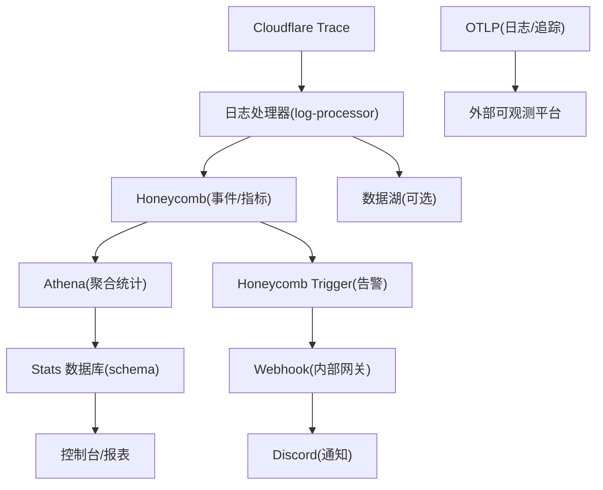
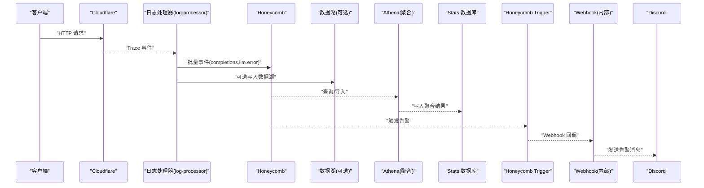
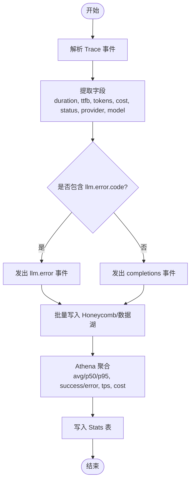
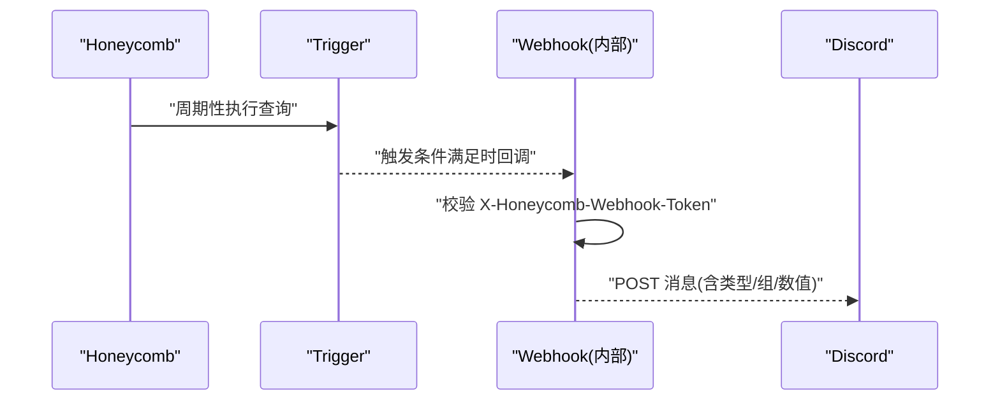
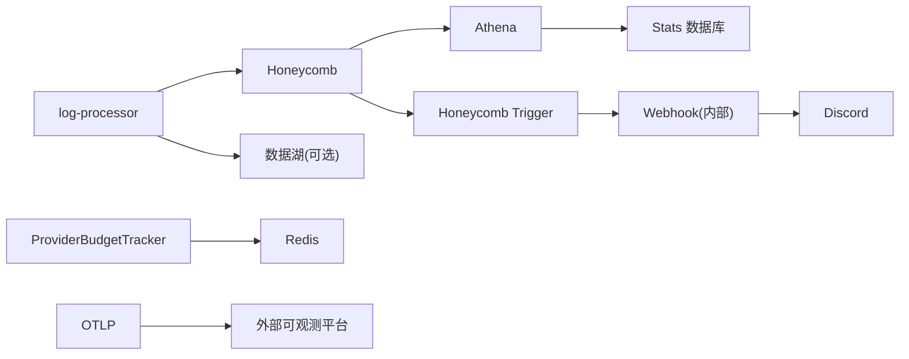

# 监控与告警

<cite>
**本文引用的文件**   
- [infra/monitoring.ts](file://infra/monitoring.ts)
- [packages/console/function/src/log-processor.ts](file://packages/console/function/src/log-processor.ts)
- [packages/stats/core/src/domain/inference.ts](file://packages/stats/core/src/domain/inference.ts)
- [packages/stats/core/src/database/schema.ts](file://packages/stats/core/src/database/schema.ts)
- [packages/console/app/src/routes/zen/util/providerBudgetTracker.ts](file://packages/console/app/src/routes/zen/util/providerBudgetTracker.ts)
- [packages/console/app/src/routes/honeycomb/webhook.ts](file://packages/console/app/src/routes/honeycomb/webhook.ts)
- [packages/core/src/observability/otlp.ts](file://packages/core/src/observability/otlp.ts)
</cite>

## 目录
1. [简介](#简介)
2. [项目结构](#项目结构)
3. [核心组件](#核心组件)
4. [架构总览](#架构总览)
5. [详细组件分析](#详细组件分析)
6. [依赖关系分析](#依赖关系分析)
7. [性能考虑](#性能考虑)
8. [故障诊断指南](#故障诊断指南)
9. [结论](#结论)
10. [附录](#附录)

## 简介
本文件面向 AI 请求管理系统的监控与告警，覆盖以下目标：
- 关键指标采集与聚合：请求成功率、平均响应时间、错误率分布、资源使用率（Token/Cost）等。
- 延迟分析工具：P50/P95/P99 延迟统计、慢查询分析与性能瓶颈定位方法。
- 成本追踪机制：按提供商调用成本统计、预算控制与费用优化建议。
- 告警规则配置：阈值设置、通知渠道管理与告警升级策略。
- 监控仪表板模板：Grafana 面板配置思路与自定义指标展示。
- 故障诊断工具与日志分析方法。

## 项目结构
系统围绕“事件采集 → 实时处理 → 指标聚合 → 可视化与告警”的链路构建：
- 事件采集与标准化：日志处理器将 Cloudflare Trace 转换为结构化事件，并写入 Honeycomb 与可选的数据湖。
- 指标聚合与统计：通过 Athena SQL 对事件进行多维度聚合，输出日/周粒度统计。
- 成本与预算：基于 Redis 的分钟级预算跟踪，结合优先级策略控制路由。
- 告警与通知：Honeycomb Trigger 驱动 Webhook，统一转发到 Discord。
- 可观测性：OTLP 日志与链路追踪上报。



图表来源
- [packages/console/function/src/log-processor.ts:1-212](file://packages/console/function/src/log-processor.ts#L1-L212)
- [infra/monitoring.ts:1-288](file://infra/monitoring.ts#L1-L288)
- [packages/stats/core/src/domain/inference.ts:1-268](file://packages/stats/core/src/domain/inference.ts#L1-L268)
- [packages/stats/core/src/database/schema.ts:122-146](file://packages/stats/core/src/database/schema.ts#L122-L146)
- [packages/core/src/observability/otlp.ts:1-80](file://packages/core/src/observability/otlp.ts#L1-L80)

章节来源
- [packages/console/function/src/log-processor.ts:1-212](file://packages/console/function/src/log-processor.ts#L1-L212)
- [infra/monitoring.ts:1-288](file://infra/monitoring.ts#L1-L288)
- [packages/stats/core/src/domain/inference.ts:1-268](file://packages/stats/core/src/domain/inference.ts#L1-L268)
- [packages/stats/core/src/database/schema.ts:122-146](file://packages/stats/core/src/database/schema.ts#L122-L146)
- [packages/core/src/observability/otlp.ts:1-80](file://packages/core/src/observability/otlp.ts#L1-L80)

## 核心组件
- 日志处理器：从 Cloudflare Trace 提取请求上下文、状态码、耗时、Token/Cost、TPS 等字段，生成两类事件：completions 与 llm.error，并批量投递至 Honeycomb 与数据湖。
- 指标聚合器：基于 Athena SQL 对事件进行维度分组（model/provider/geo），计算成功/错误计数、延迟分位数、TTFB、输出 TPS、Token/Cost 等。
- 预算跟踪器：按提供商与优先级维护分钟级预算消耗，支持 qualify/prefer 决策与 track 记录。
- 告警引擎：Honeycomb Trigger 定义查询与阈值，触发后通过 Webhook 统一推送至 Discord。
- 可观测性：OTLP 日志与链路追踪上报，附带服务名、版本、环境、实例 ID 等属性。

章节来源
- [packages/console/function/src/log-processor.ts:1-212](file://packages/console/function/src/log-processor.ts#L1-L212)
- [packages/stats/core/src/domain/inference.ts:1-268](file://packages/stats/core/src/domain/inference.ts#L1-L268)
- [packages/console/app/src/routes/zen/util/providerBudgetTracker.ts:1-151](file://packages/console/app/src/routes/zen/util/providerBudgetTracker.ts#L1-L151)
- [infra/monitoring.ts:1-288](file://infra/monitoring.ts#L1-L288)
- [packages/core/src/observability/otlp.ts:1-80](file://packages/core/src/observability/otlp.ts#L1-L80)

## 架构总览
下图展示了从请求到监控告警的端到端流程，以及关键数据流与控制点。



图表来源
- [packages/console/function/src/log-processor.ts:1-212](file://packages/console/function/src/log-processor.ts#L1-L212)
- [infra/monitoring.ts:1-288](file://infra/monitoring.ts#L1-L288)
- [packages/stats/core/src/domain/inference.ts:1-268](file://packages/stats/core/src/domain/inference.ts#L1-L268)

## 详细组件分析

### 指标采集与延迟分析
- 采集字段：duration_ms、time_to_first_byte、tokens.input/output/reasoning/cache_read、cost.*microcents、status、provider/model、user_agent 等。
- 延迟统计：在聚合层计算 avg/p50/p95（当前代码实现包含 P50/P95；P99 可通过扩展近似分位数或查询参数获得）。
- 错误率：按 status 分类统计 success_count/error_count，并在告警中计算错误比例。
- TPS：根据首尾字节时间差与输出 Token 数计算 output_tps。



图表来源
- [packages/console/function/src/log-processor.ts:1-212](file://packages/console/function/src/log-processor.ts#L1-L212)
- [packages/stats/core/src/domain/inference.ts:1-268](file://packages/stats/core/src/domain/inference.ts#L1-L268)

章节来源
- [packages/console/function/src/log-processor.ts:1-212](file://packages/console/function/src/log-processor.ts#L1-L212)
- [packages/stats/core/src/domain/inference.ts:1-268](file://packages/stats/core/src/domain/inference.ts#L1-L268)
- [packages/stats/core/src/database/schema.ts:122-146](file://packages/stats/core/src/database/schema.ts#L122-L146)

### 成本追踪与预算控制
- 维度：按 provider + priority（优先级）+ minute 维度累计花费（微分美分）。
- 策略：
  - Priority 1 无条件允许；更高优先级需检查当前分钟累计花费是否低于有效预算。
  - prefer 用于在历史消费未超过预算 80% 时优先选择该优先级。
- 存储：Redis 键空间按 provider:priority:interval 组织，保留最近两分钟以支持跨区间调整。
- 追踪：每次消费调用 track(provider, priority, costInCent)，并记录 metric 用于审计。

```mermaid
classDiagram
class ProviderBudgetTracker {
+check() Promise~{qualify(preferred), prefer()}~
+track(provider, priority, costInCent) Promise~void~
-effectiveBudget : Record~string, Record~number, number~~
-spentThroughPriority : Record~string, Record~number, number~~
-previousSpentThroughPriority : Record~string, Record~number, number~~
-budgetByProvider : Record~string, number~
-maxPriorityByProvider : Record~string, number~
}
```

图表来源
- [packages/console/app/src/routes/zen/util/providerBudgetTracker.ts:1-151](file://packages/console/app/src/routes/zen/util/providerBudgetTracker.ts#L1-L151)

章节来源
- [packages/console/app/src/routes/zen/util/providerBudgetTracker.ts:1-151](file://packages/console/app/src/routes/zen/util/providerBudgetTracker.ts#L1-L151)

### 告警规则与通知渠道
- 规则类型：
  - 模型 HTTP 错误率上升（区分 Go/Zen 产品线）。
  - 模型 TPS 过低（按模型维度）。
  - 提供商 HTTP 错误率上升。
  - 免费额度请求量异常增长（带基线对比）。
- 阈值与频率：不同规则设定不同的 timeRange、frequency 与 thresholds。
- 通知渠道：Honeycomb Webhook 接收后由内部网关校验 token，再统一发送到 Discord。



图表来源
- [infra/monitoring.ts:1-288](file://infra/monitoring.ts#L1-L288)
- [packages/console/app/src/routes/honeycomb/webhook.ts:40-82](file://packages/console/app/src/routes/honeycomb/webhook.ts#L40-L82)

章节来源
- [infra/monitoring.ts:1-288](file://infra/monitoring.ts#L1-L288)
- [packages/console/app/src/routes/honeycomb/webhook.ts:40-82](file://packages/console/app/src/routes/honeycomb/webhook.ts#L40-L82)

### 可观测性与资源使用率
- OTLP 日志与链路追踪：通过环境变量 OTEL_EXPORTER_OTLP_ENDPOINT/HEADERS 配置，自动注入服务名、版本、环境、实例 ID 等属性。
- 资源使用率：通过事件中的 tokens.* 与 cost.* 字段聚合得到输入/输出/缓存 Token 用量与成本，作为资源使用率的代理指标。

章节来源
- [packages/core/src/observability/otlp.ts:1-80](file://packages/core/src/observability/otlp.ts#L1-L80)
- [packages/console/function/src/log-processor.ts:1-212](file://packages/console/function/src/log-processor.ts#L1-L212)
- [packages/stats/core/src/domain/inference.ts:1-268](file://packages/stats/core/src/domain/inference.ts#L1-L268)

## 依赖关系分析
- 日志处理器依赖 Cloudflare Trace 与 Honeycomb API Key，可选依赖数据湖 Ingest。
- 指标聚合依赖 Athena 与 Stats 数据库 schema。
- 告警依赖 Honeycomb Trigger 与 Webhook 网关，最终到达 Discord。
- 预算跟踪依赖 Redis 与 logger.metric。
- 可观测性依赖 OTEL 导出器与全局 Context Manager。



图表来源
- [packages/console/function/src/log-processor.ts:1-212](file://packages/console/function/src/log-processor.ts#L1-L212)
- [infra/monitoring.ts:1-288](file://infra/monitoring.ts#L1-L288)
- [packages/stats/core/src/domain/inference.ts:1-268](file://packages/stats/core/src/domain/inference.ts#L1-L268)
- [packages/console/app/src/routes/zen/util/providerBudgetTracker.ts:1-151](file://packages/console/app/src/routes/zen/util/providerBudgetTracker.ts#L1-L151)
- [packages/core/src/observability/otlp.ts:1-80](file://packages/core/src/observability/otlp.ts#L1-L80)

## 性能考虑
- 延迟分位数：当前聚合实现提供 P50/P95；如需 P99，可在 Athena 查询中扩展近似分位数函数或在上游事件增加更细粒度的时间戳采样。
- 聚合效率：使用 GROUPING SETS 一次性扫描源表生成多粒度统计，降低重复扫描开销。
- 预算更新：Redis 管道批量写入，保持两分钟窗口，避免频繁过期与竞态。
- 告警频率：合理设置 timeRange 与 frequency，避免高频查询导致成本上升。
- 网络重试：HTTP 客户端采用指数退避与抖动策略，提升稳定性。

[本节为通用指导，不直接分析具体文件]

## 故障诊断指南
- 快速定位错误：
  - 查看 llm.error 事件，关注 llm.error.code/message 与 error.response/type/message。
  - 通过 user_agent 过滤 opencode 客户端流量，缩小范围。
- 延迟问题排查：
  - 比较 avg_duration_ms 与 p50/p95 差异，识别长尾延迟。
  - 观察 ttfb 分位数，判断首字节延迟是否异常。
  - 检查 output_tps 是否显著下降，定位下游提供商瓶颈。
- 成本异常：
  - 核对 cost_total_microcents 与 tokens.* 的对应关系，确认计费口径。
  - 检查预算跟踪的 qualify/prefer 逻辑是否生效，必要时调整优先级或预算。
- 告警误报/漏报：
  - 审查 Trigger 的 filters/formulas/thresholds，确保排除 401/特定 429 等场景。
  - 验证 Webhook token 校验与 Discord 消息格式。

章节来源
- [packages/console/function/src/log-processor.ts:1-212](file://packages/console/function/src/log-processor.ts#L1-L212)
- [infra/monitoring.ts:1-288](file://infra/monitoring.ts#L1-L288)
- [packages/stats/core/src/domain/inference.ts:1-268](file://packages/stats/core/src/domain/inference.ts#L1-L268)
- [packages/console/app/src/routes/zen/util/providerBudgetTracker.ts:1-151](file://packages/console/app/src/routes/zen/util/providerBudgetTracker.ts#L1-L151)

## 结论
本监控系统以事件为中心，贯穿采集、聚合、可视化与告警全链路。通过标准化的字段与多维聚合，能够准确反映请求成功率、延迟分布、错误率与资源使用；借助预算跟踪与告警规则，可实现成本可控与风险前置。建议在后续迭代中补充 P99 延迟、更多维度的错误分类与更细粒度的成本归因，以提升诊断能力与优化效果。

[本节为总结性内容，不直接分析具体文件]

## 附录

### 关键指标清单与含义
- 请求成功率：success_count / (success_count + error_count)。
- 平均响应时间：avg_duration_ms。
- 延迟分位数：p50_duration_ms、p95_duration_ms（可扩展 p99）。
- TTFB：avg_ttfb_ms、p50_ttfb_ms、p95_ttfb_ms。
- 输出吞吐：avg_output_tps。
- Token 用量：input/output/reasoning/cache_read/total。
- 成本：input/output/cache_read/write/total microcents。

章节来源
- [packages/stats/core/src/domain/inference.ts:1-268](file://packages/stats/core/src/domain/inference.ts#L1-L268)
- [packages/stats/core/src/database/schema.ts:122-146](file://packages/stats/core/src/database/schema.ts#L122-L146)

### 告警规则参考（示例）
- 模型 HTTP 错误率上升：按 model 维度计算错误比例，阈值 ≥ 0.7，时间窗口 900s，频率 300s。
- 模型 TPS 过低：按 model 维度取 TPS 的 P50，阈值 ≤ 10，时间窗口 1800s，频率 600s。
- 提供商 HTTP 错误率上升：按 provider 维度计算错误比例，阈值 ≥ 0.7，时间窗口 900s，频率 300s。
- 免费额度请求量异常：COUNT 过滤 isFreeTier=true，阈值 ≥ 50，时间窗口 3600s，频率 900s，带基线对比。

章节来源
- [infra/monitoring.ts:1-288](file://infra/monitoring.ts#L1-L288)

### 监控仪表板模板（Grafana 思路）
- 概览面板：
  - QPS、成功率、错误率（按 model/provider/geo 分组）。
  - 平均延迟与 P50/P95（可加 P99）。
  - 输出 TPS 趋势。
- 成本面板：
  - 每日/每周 total_cost_microcents 堆叠图（按 provider）。
  - Token 用量占比（input/output/reasoning/cache_read）。
- 预算面板：
  - 各 provider 的预算使用率（当前分钟累计 vs 预算）。
  - 优先级 qualify/prefer 命中率。
- 告警面板：
  - 最近触发告警列表与详情（链接回 Honeycomb）。

[本节为概念性说明，不直接映射具体文件]

### 日志分析方法
- 筛选事件类型：completions 与 llm.error。
- 关键字段：status、llm.error.code、error.type、error.message、provider、model、user_agent、ip.prefix。
- 地理维度：cf.continent/country/city/region/timezone。
- 时间维度：event_timestamp、duration、ttfb、timestamp_first_byte/last_byte。

章节来源
- [packages/console/function/src/log-processor.ts:1-212](file://packages/console/function/src/log-processor.ts#L1-L212)