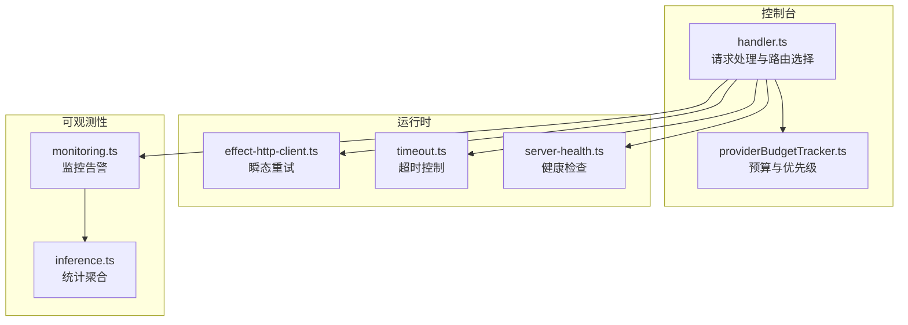
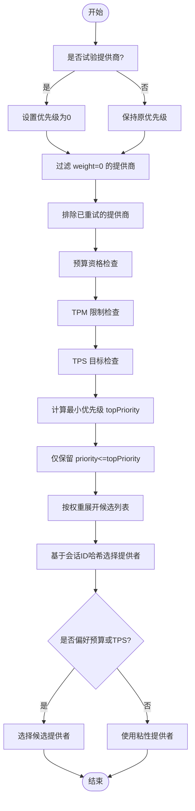
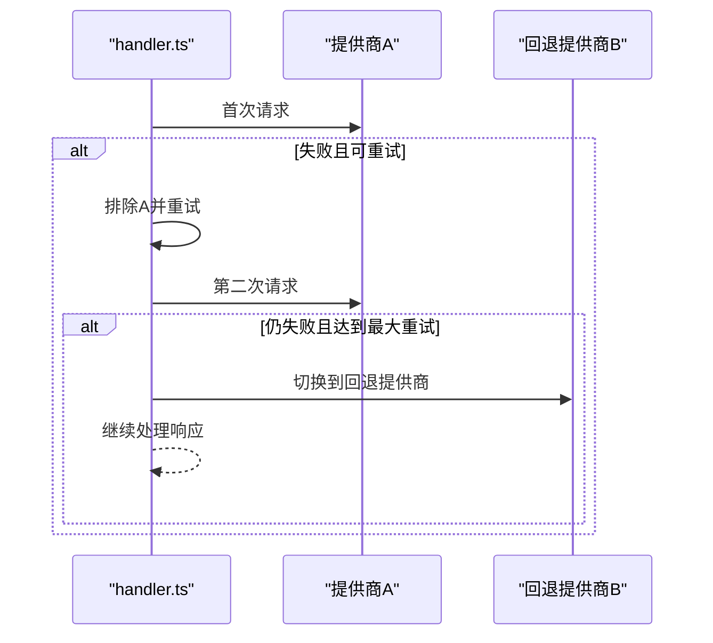
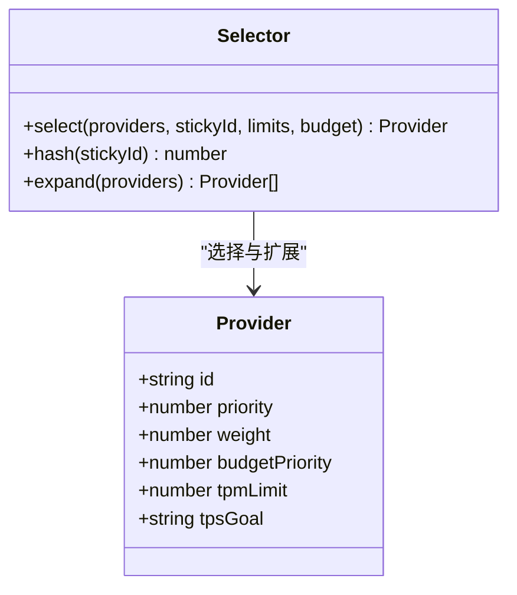
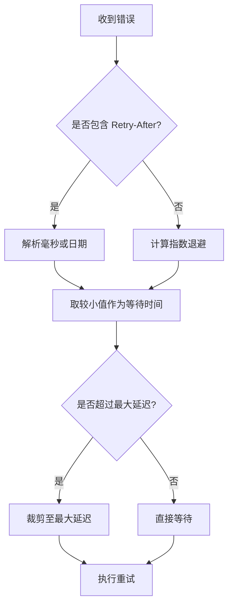
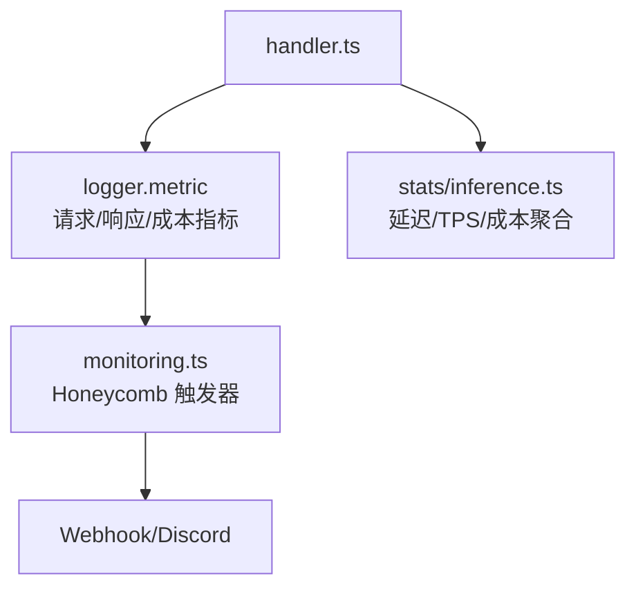
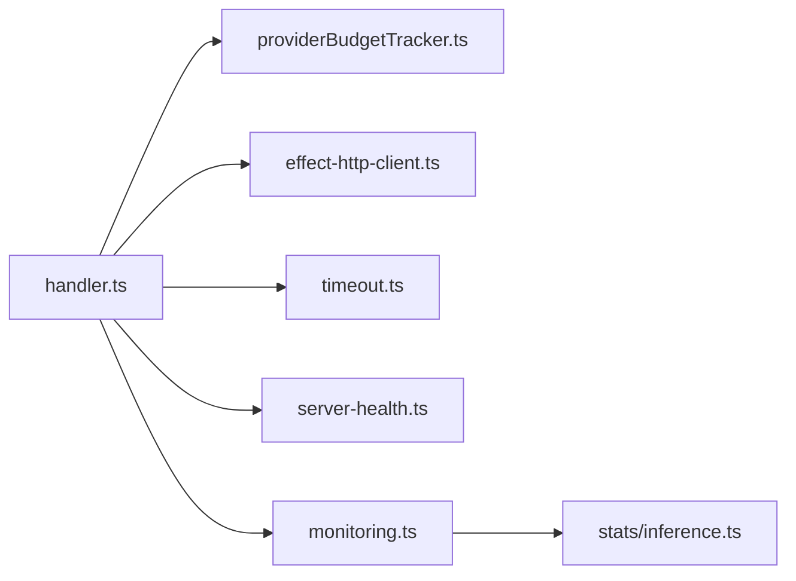

# 请求管理与故障转移

<cite>
**本文引用的文件**   
- [packages/console/app/src/routes/zen/util/handler.ts](file://packages/console/app/src/routes/zen/util/handler.ts)
- [packages/console/app/src/routes/zen/util/providerBudgetTracker.ts](file://packages/console/app/src/routes/zen/util/providerBudgetTracker.ts)
- [packages/opencode/test/session/retry.test.ts](file://packages/opencode/test/session/retry.test.ts)
- [packages/opencode/src/util/effect-http-client.ts](file://packages/opencode/src/util/effect-http-client.ts)
- [packages/opencode/src/util/timeout.ts](file://packages/opencode/src/util/timeout.ts)
- [packages/app/src/utils/server-health.ts](file://packages/app/src/utils/server-health.ts)
- [infra/monitoring.ts](file://infra/monitoring.ts)
- [packages/stats/core/src/domain/inference.ts](file://packages/stats/core/src/domain/inference.ts)
</cite>

## 目录
1. [简介](#简介)
2. [项目结构](#项目结构)
3. [核心组件](#核心组件)
4. [架构总览](#架构总览)
5. [详细组件分析](#详细组件分析)
6. [依赖关系分析](#依赖关系分析)
7. [性能考量](#性能考量)
8. [故障排查指南](#故障排查指南)
9. [结论](#结论)
10. [附录](#附录)

## 简介
本文件面向 AI 请求管理系统的“请求队列调度、故障转移、负载均衡、重试机制、监控告警与降级熔断”等关键能力，基于仓库中的控制台路由处理器、预算追踪、健康检查、HTTP 客户端重试与超时、以及监控告警配置等实现进行系统化说明。文档力求以循序渐进的方式帮助读者理解系统如何对多提供商模型进行统一接入、智能选择、弹性容错与可观测性保障。

## 项目结构
围绕 AI 请求管理的核心代码主要分布在以下位置：
- 控制台请求处理与路由选择：packages/console/app/src/routes/zen/util/handler.ts
- 提供商预算与优先级控制：packages/console/app/src/routes/zen/util/providerBudgetTracker.ts
- 会话级重试策略与错误分类（测试覆盖）：packages/opencode/test/session/retry.test.ts
- HTTP 客户端瞬态重试封装：packages/opencode/src/util/effect-http-client.ts
- 通用超时工具：packages/opencode/src/util/timeout.ts
- 服务端健康检查与轮询：packages/app/src/utils/server-health.ts
- 监控与告警规则（Honeycomb）：infra/monitoring.ts
- 统计聚合查询（延迟、TPS、成本）：packages/stats/core/src/domain/inference.ts

图表来源
- [packages/console/app/src/routes/zen/util/handler.ts](file://packages/console/app/src/routes/zen/util/handler.ts)
- [packages/console/app/src/routes/zen/util/providerBudgetTracker.ts](file://packages/console/app/src/routes/zen/util/providerBudgetTracker.ts)
- [packages/opencode/src/util/effect-http-client.ts](file://packages/opencode/src/util/effect-http-client.ts)
- [packages/opencode/src/util/timeout.ts](file://packages/opencode/src/util/timeout.ts)
- [packages/app/src/utils/server-health.ts](file://packages/app/src/utils/server-health.ts)
- [infra/monitoring.ts](file://infra/monitoring.ts)
- [packages/stats/core/src/domain/inference.ts](file://packages/stats/core/src/domain/inference.ts)

章节来源
- [packages/console/app/src/routes/zen/util/handler.ts](file://packages/console/app/src/routes/zen/util/handler.ts)
- [packages/console/app/src/routes/zen/util/providerBudgetTracker.ts](file://packages/console/app/src/routes/zen/util/providerBudgetTracker.ts)
- [packages/opencode/src/util/effect-http-client.ts](file://packages/opencode/src/util/effect-http-client.ts)
- [packages/opencode/src/util/timeout.ts](file://packages/opencode/src/util/timeout.ts)
- [packages/app/src/utils/server-health.ts](file://packages/app/src/utils/server-health.ts)
- [infra/monitoring.ts](file://infra/monitoring.ts)
- [packages/stats/core/src/domain/inference.ts](file://packages/stats/core/src/domain/inference.ts)

## 核心组件
- 请求处理与提供者选择（handler.ts）
  - 负责鉴权、限流、模型校验、提供者选择、请求转发、流式响应处理、用量与成本统计、失败回退与重试。
  - 提供按权重与优先级的负载均衡、粘性会话、预算与 TPS/TPM 限制、以及最大重试次数后的固定回退提供者。
- 提供商预算追踪（providerBudgetTracker.ts）
  - 基于 Redis 的分钟级预算计数，支持多级优先级与“填充”策略，确保高优先级先占额度，低优先级在剩余空间内使用。
- 重试与错误分类（retry.test.ts + effect-http-client.ts + timeout.ts）
  - 会话层重试策略支持指数退避、Retry-After 头解析、网络/网关类错误分类；HTTP 客户端层提供瞬态重试封装；通用超时工具用于请求级超时保护。
- 健康检查（server-health.ts）
  - 带超时、重试与健康缓存的服务端健康探测，周期性轮询并暴露状态。
- 监控与告警（monitoring.ts + inference.ts）
  - 基于 Honeycomb 的指标与触发器，涵盖模型/提供商错误率、低 TPS、免费配额激增等；统计聚合包含延迟分位、TPS、成本与成功率。

章节来源
- [packages/console/app/src/routes/zen/util/handler.ts](file://packages/console/app/src/routes/zen/util/handler.ts)
- [packages/console/app/src/routes/zen/util/providerBudgetTracker.ts](file://packages/console/app/src/routes/zen/util/providerBudgetTracker.ts)
- [packages/opencode/test/session/retry.test.ts](file://packages/opencode/test/session/retry.test.ts)
- [packages/opencode/src/util/effect-http-client.ts](file://packages/opencode/src/util/effect-http-client.ts)
- [packages/opencode/src/util/timeout.ts](file://packages/opencode/src/util/timeout.ts)
- [packages/app/src/utils/server-health.ts](file://packages/app/src/utils/server-health.ts)
- [infra/monitoring.ts](file://infra/monitoring.ts)
- [packages/stats/core/src/domain/inference.ts](file://packages/stats/core/src/domain/inference.ts)

## 架构总览
下图展示了从请求进入控制台到最终返回响应的整体流程，包括提供者选择、预算与限额校验、重试与回退、流式处理与统计上报。

```mermaid
sequenceDiagram
participant C as "客户端"
participant H as "handler.ts<br/>请求处理"
participant P as "providerBudgetTracker.ts<br/>预算追踪"
participant E as "effect-http-client.ts<br/>HTTP 重试"
participant U as "timeout.ts<br/>超时"
participant S as "server-health.ts<br/>健康检查"
participant M as "monitoring.ts<br/>监控告警"
C->>H : 发起 AI 请求
H->>H : 鉴权/限流/模型校验
H->>P : 计算可用预算与优先级
H->>H : 选择提供者(权重/优先级/粘性/TPM/TPS)
H->>E : 发送请求(含瞬态重试)
H->>U : 应用超时保护
alt 成功
H-->>C : 返回响应(非流/流式)
else 失败且可重试
H->>H : 排除当前提供者并重试
H->>E : 再次发送
opt 达到最大重试
H->>H : 切换到回退提供者
end
end
H->>M : 上报指标(延迟/成本/错误)
S-->>H : 健康状态(周期轮询)
```

图表来源
- [packages/console/app/src/routes/zen/util/handler.ts](file://packages/console/app/src/routes/zen/util/handler.ts)
- [packages/console/app/src/routes/zen/util/providerBudgetTracker.ts](file://packages/console/app/src/routes/zen/util/providerBudgetTracker.ts)
- [packages/opencode/src/util/effect-http-client.ts](file://packages/opencode/src/util/effect-http-client.ts)
- [packages/opencode/src/util/timeout.ts](file://packages/opencode/src/util/timeout.ts)
- [packages/app/src/utils/server-health.ts](file://packages/app/src/utils/server-health.ts)
- [infra/monitoring.ts](file://infra/monitoring.ts)

## 详细组件分析

### 请求队列调度算法（优先级、并发与资源分配）
- 优先级管理
  - 通过 provider.priority 与 trialProviders 动态调整优先级，试验提供商优先。
  - 预算优先级 budgetPriority 支持多级“填充”策略，高优先级先占额度，低优先级仅在剩余空间内使用。
- 并发控制
  - 前端任务队列示例（directory-picker-domain.ts）展示用户/后台两类任务的并发上限与提升策略，体现“用户任务优先”的调度思想。
- 资源分配
  - TPM 限制（modelTpmLimiter）与 TPS 目标（modelTpsLimiter）共同约束每个提供商/模型的吞吐。
  - 预算追踪（providerBudgetTracker）按分钟粒度记录消费，结合上一分钟的使用情况计算有效预算。

图表来源
- [packages/console/app/src/routes/zen/util/handler.ts](file://packages/console/app/src/routes/zen/util/handler.ts)
- [packages/console/app/src/routes/zen/util/providerBudgetTracker.ts](file://packages/console/app/src/routes/zen/util/providerBudgetTracker.ts)

章节来源
- [packages/console/app/src/routes/zen/util/handler.ts](file://packages/console/app/src/routes/zen/util/handler.ts)
- [packages/console/app/src/routes/zen/util/providerBudgetTracker.ts](file://packages/console/app/src/routes/zen/util/providerBudgetTracker.ts)

### 故障转移机制（健康检查、自动切换与回滚策略）
- 健康检查
  - server-health.ts 提供带超时、重试与健康缓存的健康探测，周期性轮询服务状态。
- 自动切换
  - handler.ts 在请求失败时根据状态码与业务规则决定是否重试其他提供商，并在达到最大重试次数后切换到配置的 fallbackProvider。
- 回滚策略
  - 当多次重试仍失败时，强制使用回退提供者，避免雪崩；同时记录错误指标以便后续分析与告警。

图表来源
- [packages/console/app/src/routes/zen/util/handler.ts](file://packages/console/app/src/routes/zen/util/handler.ts)
- [packages/app/src/utils/server-health.ts](file://packages/app/src/utils/server-health.ts)

章节来源
- [packages/console/app/src/routes/zen/util/handler.ts](file://packages/console/app/src/routes/zen/util/handler.ts)
- [packages/app/src/utils/server-health.ts](file://packages/app/src/utils/server-health.ts)

### 负载均衡策略（轮询、加权分配与基于性能的动态调整）
- 轮询与粘性
  - 基于会话 ID 的最后若干字符进行哈希，将请求稳定分配到同一提供商，保证会话一致性。
- 加权分配
  - 通过 provider.weight 将候选提供商重复加入候选池，实现按权重的概率分布。
- 基于性能的动态调整
  - modelTpsLimiter 统计 TPS 表现，若某提供商 TPS 持续偏低则降低其被选中的概率；budgetPriority 与 prefer 逻辑进一步偏向预算充裕或 TPS 更优的提供商。

图表来源
- [packages/console/app/src/routes/zen/util/handler.ts](file://packages/console/app/src/routes/zen/util/handler.ts)

章节来源
- [packages/console/app/src/routes/zen/util/handler.ts](file://packages/console/app/src/routes/zen/util/handler.ts)

### 重试机制（指数退避、超时处理与错误分类）
- 指数退避
  - SessionRetry.delay 支持指数退避，并优先采用 Retry-After 头（毫秒或日期），上限受运行时定时器限制。
- 超时处理
  - withTimeout 封装 Promise 超时，确保请求不会无限挂起；checkServerHealth 也内置超时信号。
- 错误分类
  - retryable 函数识别 too_many_requests、resource_exhausted、5xx、WebSocket 断开、ZlibError 等场景，决定是否可以重试。

图表来源
- [packages/opencode/test/session/retry.test.ts](file://packages/opencode/test/session/retry.test.ts)
- [packages/opencode/src/util/timeout.ts](file://packages/opencode/src/util/timeout.ts)

章节来源
- [packages/opencode/test/session/retry.test.ts](file://packages/opencode/test/session/retry.test.ts)
- [packages/opencode/src/util/timeout.ts](file://packages/opencode/src/util/timeout.ts)

### 监控与告警（请求统计、延迟分析与成本追踪）
- 指标采集
  - handler.ts 在请求生命周期中上报 is_stream、model、provider、response_length、ttfb、cost 等指标。
- 延迟分析
  - stats/inference.ts 聚合 avg/p50/p95 延迟与输出 TPS，支撑性能基线与异常检测。
- 成本追踪
  - providerBudgetTracker.ts 按分钟记录每提供商/优先级的花费，配合 logger.metric 上报。
- 告警规则
  - monitoring.ts 定义模型/提供商错误率、低 TPS、免费配额激增等触发器，并通过 Webhook 通知。

图表来源
- [packages/console/app/src/routes/zen/util/handler.ts](file://packages/console/app/src/routes/zen/util/handler.ts)
- [packages/console/app/src/routes/zen/util/providerBudgetTracker.ts](file://packages/console/app/src/routes/zen/util/providerBudgetTracker.ts)
- [infra/monitoring.ts](file://infra/monitoring.ts)
- [packages/stats/core/src/domain/inference.ts](file://packages/stats/core/src/domain/inference.ts)

章节来源
- [packages/console/app/src/routes/zen/util/handler.ts](file://packages/console/app/src/routes/zen/util/handler.ts)
- [packages/console/app/src/routes/zen/util/providerBudgetTracker.ts](file://packages/console/app/src/routes/zen/util/providerBudgetTracker.ts)
- [infra/monitoring.ts](file://infra/monitoring.ts)
- [packages/stats/core/src/domain/inference.ts](file://packages/stats/core/src/domain/inference.ts)

### 降级策略与熔断保护机制
- 降级策略
  - 当预算不足或 TPS 过低时，selector 会跳过不满足条件的提供商，转而选择预算充裕或性能更优的提供商；达到最大重试次数后强制切换到回退提供商，实现软降级。
- 熔断保护
  - 通过监控错误率与 TPS 阈值触发告警，结合健康检查与重试上限，避免对不稳定提供商持续打流；HTTP 客户端层的瞬态重试与超时保护防止级联失败。

章节来源
- [packages/console/app/src/routes/zen/util/handler.ts](file://packages/console/app/src/routes/zen/util/handler.ts)
- [packages/opencode/src/util/effect-http-client.ts](file://packages/opencode/src/util/effect-http-client.ts)
- [infra/monitoring.ts](file://infra/monitoring.ts)

## 依赖关系分析
- handler.ts 依赖：
  - providerBudgetTracker.ts（预算与优先级）
  - modelTpmLimiter / modelTpsLimiter（吞吐限制）
  - effect-http-client.ts（瞬态重试）
  - timeout.ts（超时）
  - server-health.ts（健康检查）
  - monitoring.ts（指标与告警）
- 数据流向：
  - 请求进入 → 鉴权/限流 → 预算/限额校验 → 提供者选择 → 请求转发 → 统计上报 → 响应返回。

图表来源
- [packages/console/app/src/routes/zen/util/handler.ts](file://packages/console/app/src/routes/zen/util/handler.ts)
- [packages/console/app/src/routes/zen/util/providerBudgetTracker.ts](file://packages/console/app/src/routes/zen/util/providerBudgetTracker.ts)
- [packages/opencode/src/util/effect-http-client.ts](file://packages/opencode/src/util/effect-http-client.ts)
- [packages/opencode/src/util/timeout.ts](file://packages/opencode/src/util/timeout.ts)
- [packages/app/src/utils/server-health.ts](file://packages/app/src/utils/server-health.ts)
- [infra/monitoring.ts](file://infra/monitoring.ts)
- [packages/stats/core/src/domain/inference.ts](file://packages/stats/core/src/domain/inference.ts)

章节来源
- [packages/console/app/src/routes/zen/util/handler.ts](file://packages/console/app/src/routes/zen/util/handler.ts)
- [packages/console/app/src/routes/zen/util/providerBudgetTracker.ts](file://packages/console/app/src/routes/zen/util/providerBudgetTracker.ts)
- [packages/opencode/src/util/effect-http-client.ts](file://packages/opencode/src/util/effect-http-client.ts)
- [packages/opencode/src/util/timeout.ts](file://packages/opencode/src/util/timeout.ts)
- [packages/app/src/utils/server-health.ts](file://packages/app/src/utils/server-health.ts)
- [infra/monitoring.ts](file://infra/monitoring.ts)
- [packages/stats/core/src/domain/inference.ts](file://packages/stats/core/src/domain/inference.ts)

## 性能考量
- 延迟优化
  - 首字节时间（TTFB）与端到端延迟通过指标上报与分位统计（p50/p95）进行监控；TPS 低时自动降低相关提供商权重。
- 吞吐控制
  - TPM/TPS 限制与预算追踪共同作用，避免单提供商过载；粘性会话减少跨提供商切换带来的额外开销。
- 资源利用
  - 预算优先级确保高价值流量优先；失败快速回退与重试上限避免资源浪费。

[本节为通用指导，不直接分析具体文件]

## 故障排查指南
- 常见问题定位
  - 错误分类：查看 retryable 判断逻辑，确认是否为网络/网关/速率限制等可重试错误。
  - 重试策略：检查指数退避与 Retry-After 头是否正确解析；确认最大重试次数与回退提供商配置。
  - 健康检查：确认健康探测超时、重试次数与缓存策略是否符合预期。
  - 预算与限额：核对预算优先级、TPM/TPS 限制与当前分钟使用量。
- 指标与告警
  - 通过 Honeycomb 触发器查看模型/提供商错误率、低 TPS、免费配额激增等告警；结合 stats/inference.ts 的聚合结果定位瓶颈。

章节来源
- [packages/opencode/test/session/retry.test.ts](file://packages/opencode/test/session/retry.test.ts)
- [packages/app/src/utils/server-health.ts](file://packages/app/src/utils/server-health.ts)
- [infra/monitoring.ts](file://infra/monitoring.ts)
- [packages/stats/core/src/domain/inference.ts](file://packages/stats/core/src/domain/inference.ts)

## 结论
该 AI 请求管理系统通过精细化的优先级与预算控制、健壮的故障转移与重试机制、灵活的负载均衡策略以及完善的监控告警体系，实现了高可用、高性能与可控成本的 AI 请求处理能力。建议在生产环境中持续优化 TPS/TPM 阈值与预算策略，并结合告警反馈快速迭代，以提升整体稳定性与用户体验。

[本节为总结，不直接分析具体文件]

## 附录
- 术语表
  - TPM：每分钟令牌数（Token Per Minute）
  - TPS：每秒令牌数（Tokens Per Second）
  - TTFT/TTFB：首字节时间（Time To First Byte）
  - 预算优先级：提供商在不同优先级下的额度占用策略
  - 粘性会话：基于会话 ID 的稳定提供商分配

[本节为概念说明，不直接分析具体文件]