# 请求队列调度

<cite>
**本文引用的文件**   
- [packages/app/src/components/directory-picker-domain.ts](file://packages/app/src/components/directory-picker-domain.ts)
- [packages/opencode/src/util/queue.ts](file://packages/opencode/src/util/queue.ts)
- [packages/session-ui/src/components/markdown-worker-transport.ts](file://packages/session-ui/src/components/markdown-worker-transport.ts)
- [packages/session-ui/src/components/markdown-worker-queue.ts](file://packages/session-ui/src/components/markdown-worker-queue.ts)
- [packages/app/src/context/global-sync/queue.ts](file://packages/app/src/context/global-sync/queue.ts)
- [packages/opencode/src/cli/cmd/run/runtime.queue.ts](file://packages/opencode/src/cli/cmd/run/runtime.queue.ts)
- [packages/core/src/integration.ts](file://packages/core/src/integration.ts)
- [packages/console/app/src/routes/zen/util/handler.ts](file://packages/console/app/src/routes/zen/util/handler.ts)
- [packages/console/app/src/routes/zen/util/providerBudgetTracker.ts](file://packages/console/app/src/routes/zen/util/providerBudgetTracker.ts)
- [packages/app/src/context/server-sdk.tsx](file://packages/app/src/context/server-sdk.tsx)
- [packages/stats/core/src/domain/inference.ts](file://packages/stats/core/src/domain/inference.ts)
</cite>

## 目录
1. [简介](#简介)
2. [项目结构](#项目结构)
3. [核心组件](#核心组件)
4. [架构总览](#架构总览)
5. [详细组件分析](#详细组件分析)
6. [依赖关系分析](#依赖关系分析)
7. [性能考虑](#性能考虑)
8. [故障排查指南](#故障排查指南)
9. [结论](#结论)
10. [附录](#附录)

## 简介
本文件面向 AI 请求队列调度系统，系统性说明以下能力：
- 请求优先级管理算法：高优先级抢占与公平调度策略
- 并发控制实现：最大并发数限制、线程池管理与资源隔离
- 队列数据结构设计：FIFO、优先级队列与“死信”处理（过期清理）
- 请求生命周期管理：入队、出队、执行状态跟踪与超时处理
- 性能优化配置：队列大小调优、内存管理与垃圾回收策略
- 监控指标与调试工具使用方法

本仓库包含多个与队列和调度相关的模块，涵盖前端任务队列、Worker 传输与队列、CLI 串行提示队列、通用异步队列与并发工作器、以及重试与预算限流等。下文将逐一解析并给出可视化图示。

## 项目结构
围绕“请求队列调度”的关键代码分布在以下模块：
- 应用层优先级任务队列：用于 UI 交互优先的后台任务调度
- Worker 传输与队列：用于 Markdown 渲染等后台任务的最新请求覆盖与顺序消费
- CLI 串行提示队列：交互式模式下按序执行用户输入
- 通用异步队列与并发工作器：基础队列与并发控制工具
- 全局刷新队列：批量合并与节流刷新
- 集成层重试与过期清理：请求尝试的生命周期与“死信”清理
- 提供者选择与预算限流：基于权重、TPM/TPS 与预算的优先级筛选
- 服务端事件合并：高频增量事件的合并与去重

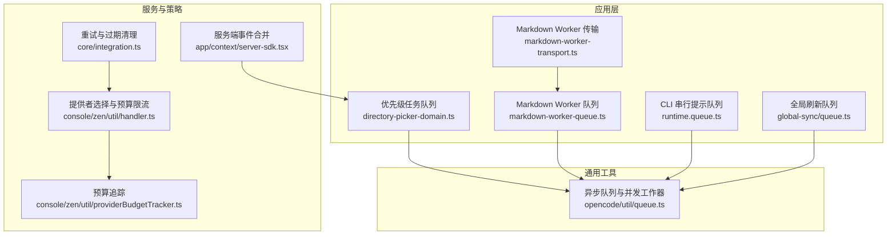

**图表来源** 
- [packages/app/src/components/directory-picker-domain.ts:141-212](file://packages/app/src/components/directory-picker-domain.ts#L141-L212)
- [packages/session-ui/src/components/markdown-worker-transport.ts:1-42](file://packages/session-ui/src/components/markdown-worker-transport.ts#L1-L42)
- [packages/session-ui/src/components/markdown-worker-queue.ts:1-65](file://packages/session-ui/src/components/markdown-worker-queue.ts#L1-L65)
- [packages/opencode/src/cli/cmd/run/runtime.queue.ts:59-350](file://packages/opencode/src/cli/cmd/run/runtime.queue.ts#L59-L350)
- [packages/app/src/context/global-sync/queue.ts:1-88](file://packages/app/src/context/global-sync/queue.ts#L1-L88)
- [packages/opencode/src/util/queue.ts:1-33](file://packages/opencode/src/util/queue.ts#L1-L33)
- [packages/core/src/integration.ts:346-364](file://packages/core/src/integration.ts#L346-L364)
- [packages/console/app/src/routes/zen/util/handler.ts:602-630](file://packages/console/app/src/routes/zen/util/handler.ts#L602-L630)
- [packages/console/app/src/routes/zen/util/providerBudgetTracker.ts:39-87](file://packages/console/app/src/routes/zen/util/providerBudgetTracker.ts#L39-L87)
- [packages/app/src/context/server-sdk.tsx:29-72](file://packages/app/src/context/server-sdk.tsx#L29-L72)

**章节来源**
- [packages/app/src/components/directory-picker-domain.ts:141-212](file://packages/app/src/components/directory-picker-domain.ts#L141-L212)
- [packages/opencode/src/util/queue.ts:1-33](file://packages/opencode/src/util/queue.ts#L1-L33)
- [packages/session-ui/src/components/markdown-worker-transport.ts:1-42](file://packages/session-ui/src/components/markdown-worker-transport.ts#L1-L42)
- [packages/session-ui/src/components/markdown-worker-queue.ts:1-65](file://packages/session-ui/src/components/markdown-worker-queue.ts#L1-L65)
- [packages/app/src/context/global-sync/queue.ts:1-88](file://packages/app/src/context/global-sync/queue.ts#L1-L88)
- [packages/opencode/src/cli/cmd/run/runtime.queue.ts:59-350](file://packages/opencode/src/cli/cmd/run/runtime.queue.ts#L59-L350)
- [packages/core/src/integration.ts:346-364](file://packages/core/src/integration.ts#L346-L364)
- [packages/console/app/src/routes/zen/util/handler.ts:602-630](file://packages/console/app/src/routes/zen/util/handler.ts#L602-L630)
- [packages/console/app/src/routes/zen/util/providerBudgetTracker.ts:39-87](file://packages/console/app/src/routes/zen/util/providerBudgetTracker.ts#L39-L87)
- [packages/app/src/context/server-sdk.tsx:29-72](file://packages/app/src/context/server-sdk.tsx#L29-L72)

## 核心组件
- 优先级任务队列（应用层）
  - 支持“用户”与“后台”两级优先级；用户级可抢占后台任务
  - 通过 Map 维护活跃任务，避免重复 key；完成时释放槽位并继续排程
  - 提供 promote 接口动态提升优先级
- Worker 传输与队列（会话 UI）
  - 传输层维护 active 与 queued 两个映射，支持“最新请求覆盖”
  - 队列层以单消费者顺序执行，支持 dispose 与 supersede 语义
- CLI 串行提示队列（命令行）
  - 严格串行执行，支持 /new 新建会话、空提示拒绝、退出命令
  - 暴露队列长度与排队项编辑/删除，统计每轮耗时
- 通用异步队列与并发工作器
  - AsyncQueue 实现 push/next/asyncIterator，支持生产者-消费者解耦
  - work(concurrency, items, fn) 实现固定并发度的并行任务执行
- 全局刷新队列
  - 支持暂停/恢复、根级 bootstrap 与实例级 bootstrapInstance
  - 批量取 2 个目录并发刷新，使用 setTimeout(0) 节流
- 重试与过期清理（集成层）
  - 周期性扫描 pending 尝试，标记 expired 并在保留期后清理
- 提供者选择与预算限流
  - 基于 provider.priority、weight、tpmLimit、tpsGoal 与 budgetPriority 过滤与加权
- 服务端事件合并
  - 对 message.part.delta 进行同键合并，减少 UI 更新抖动

**章节来源**
- [packages/app/src/components/directory-picker-domain.ts:141-212](file://packages/app/src/components/directory-picker-domain.ts#L141-L212)
- [packages/session-ui/src/components/markdown-worker-transport.ts:1-42](file://packages/session-ui/src/components/markdown-worker-transport.ts#L1-L42)
- [packages/session-ui/src/components/markdown-worker-queue.ts:1-65](file://packages/session-ui/src/components/markdown-worker-queue.ts#L1-L65)
- [packages/opencode/src/cli/cmd/run/runtime.queue.ts:59-350](file://packages/opencode/src/cli/cmd/run/runtime.queue.ts#L59-L350)
- [packages/opencode/src/util/queue.ts:1-33](file://packages/opencode/src/util/queue.ts#L1-L33)
- [packages/app/src/context/global-sync/queue.ts:1-88](file://packages/app/src/context/global-sync/queue.ts#L1-L88)
- [packages/core/src/integration.ts:346-364](file://packages/core/src/integration.ts#L346-L364)
- [packages/console/app/src/routes/zen/util/handler.ts:602-630](file://packages/console/app/src/routes/zen/util/handler.ts#L602-L630)
- [packages/console/app/src/routes/zen/util/providerBudgetTracker.ts:39-87](file://packages/console/app/src/routes/zen/util/providerBudgetTracker.ts#L39-L87)
- [packages/app/src/context/server-sdk.tsx:29-72](file://packages/app/src/context/server-sdk.tsx#L29-L72)

## 架构总览
下图展示从请求入队到执行、再到结果返回与清理的整体流程，包括优先级抢占、并发控制、超时与“死信”清理。

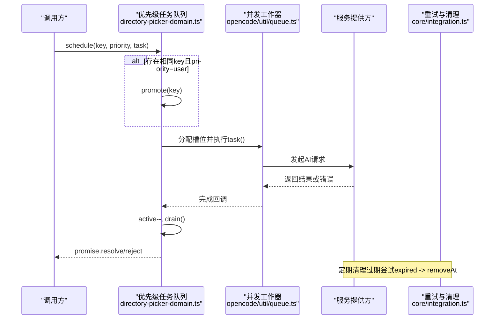

**图表来源** 
- [packages/app/src/components/directory-picker-domain.ts:141-212](file://packages/app/src/components/directory-picker-domain.ts#L141-L212)
- [packages/opencode/src/util/queue.ts:21-33](file://packages/opencode/src/util/queue.ts#L21-L33)
- [packages/core/src/integration.ts:346-364](file://packages/core/src/integration.ts#L346-L364)

## 详细组件分析

### 优先级任务队列（应用层）
- 设计要点
  - 双队列：user 与 background，drain 时优先 user.pop()，否则 background.shift()
  - 活跃任务 Map 保证同一 key 仅一个运行中任务；schedule 时若已存在且新 priority 为 user，则 promote
  - 完成回调释放槽位并触发 drain，确保并发上限恒定
- 复杂度
  - promote 使用 indexOf + splice，最坏 O(n)；建议热点路径下保持较小队列或使用 Set+Map 优化
- 并发控制
  - 通过 active 计数与 while(active < concurrency) 循环限制并发
- 数据流
  - 入队：push 到对应优先级队列
  - 出队：drain 从 user 优先取出
  - 执行：包装 Promise 并 resolve/reject 给调用方
  - 清理：complete 中删除 Map 条目并继续排程

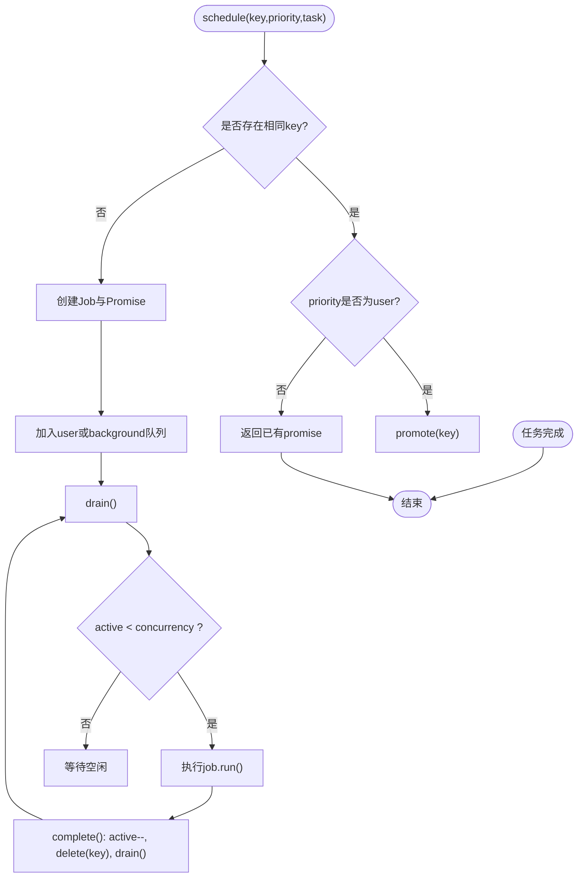

**图表来源** 
- [packages/app/src/components/directory-picker-domain.ts:141-212](file://packages/app/src/components/directory-picker-domain.ts#L141-L212)

**章节来源**
- [packages/app/src/components/directory-picker-domain.ts:141-212](file://packages/app/src/components/directory-picker-domain.ts#L141-L212)

### Worker 传输与队列（会话 UI）
- 传输层（Transport）
  - active 与 queued 双映射，send 时若 key 已在 active，则将旧请求 supersede 并放入 queued
  - complete 时校验 id，确保只处理当前活跃请求；完成后从 queued 取下一个
- 队列层（Queue）
  - 单消费者顺序执行 jobs，支持 dispose 与 supersede
  - 通过 slots 映射跟踪每个 key 的当前 slot，避免重复执行
- 适用场景
  - 适合“最新请求覆盖”的渲染/计算任务，避免中间态闪烁

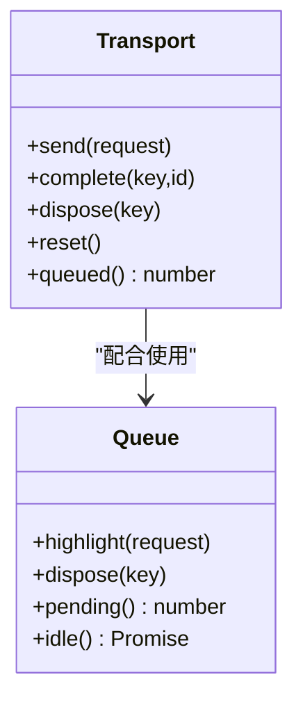

**图表来源** 
- [packages/session-ui/src/components/markdown-worker-transport.ts:1-42](file://packages/session-ui/src/components/markdown-worker-transport.ts#L1-L42)
- [packages/session-ui/src/components/markdown-worker-queue.ts:1-65](file://packages/session-ui/src/components/markdown-worker-queue.ts#L1-L65)

**章节来源**
- [packages/session-ui/src/components/markdown-worker-transport.ts:1-42](file://packages/session-ui/src/components/markdown-worker-transport.ts#L1-L42)
- [packages/session-ui/src/components/markdown-worker-queue.ts:1-65](file://packages/session-ui/src/components/markdown-worker-queue.ts#L1-L65)

### CLI 串行提示队列（命令行）
- 行为特性
  - 严格串行执行，支持 /exit、/quit、/new 命令
  - 普通提示在活跃非 shell 轮次内进入本地队列，可在 UI 编辑/删除
  - 记录每轮耗时，便于诊断响应延迟
- 生命周期
  - submit 入队 -> drain 串行取出 -> run 执行 -> 统计时长 -> 下一轮

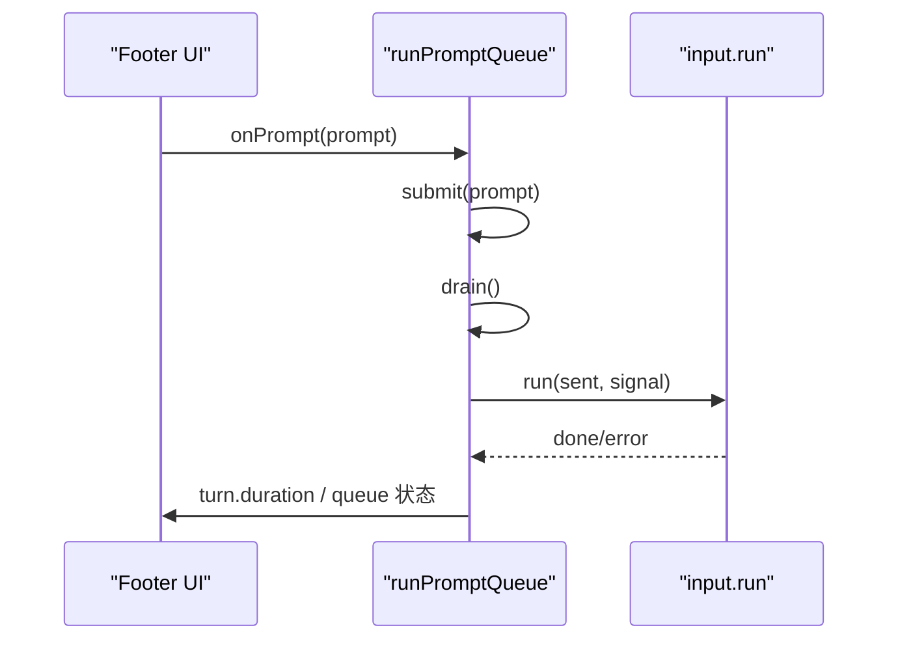

**图表来源** 
- [packages/opencode/src/cli/cmd/run/runtime.queue.ts:59-350](file://packages/opencode/src/cli/cmd/run/runtime.queue.ts#L59-L350)

**章节来源**
- [packages/opencode/src/cli/cmd/run/runtime.queue.ts:59-350](file://packages/opencode/src/cli/cmd/run/runtime.queue.ts#L59-L350)

### 通用异步队列与并发工作器
- AsyncQueue
  - push 优先唤醒等待者，否则入队；next 先查队列为空则挂起等待
  - 支持 asyncIterator 迭代消费
- work(concurrency, items, fn)
  - 固定并发度 worker 循环 pop 任务并执行，直到队列为空

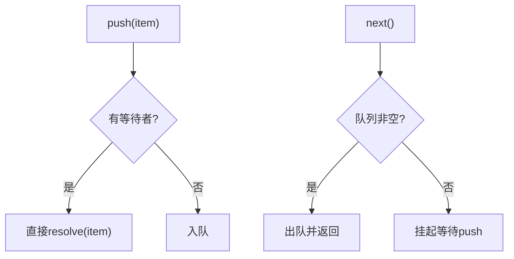

**图表来源** 
- [packages/opencode/src/util/queue.ts:1-33](file://packages/opencode/src/util/queue.ts#L1-L33)

**章节来源**
- [packages/opencode/src/util/queue.ts:1-33](file://packages/opencode/src/util/queue.ts#L1-L33)

### 全局刷新队列
- 功能
  - 支持 paused 暂停；root 标志触发一次 bootstrap，随后批量取 2 个目录并发 bootstrapInstance
  - 使用 setTimeout(0) 节流，避免同步风暴
- 适用场景
  - 目录树/索引刷新等批量操作

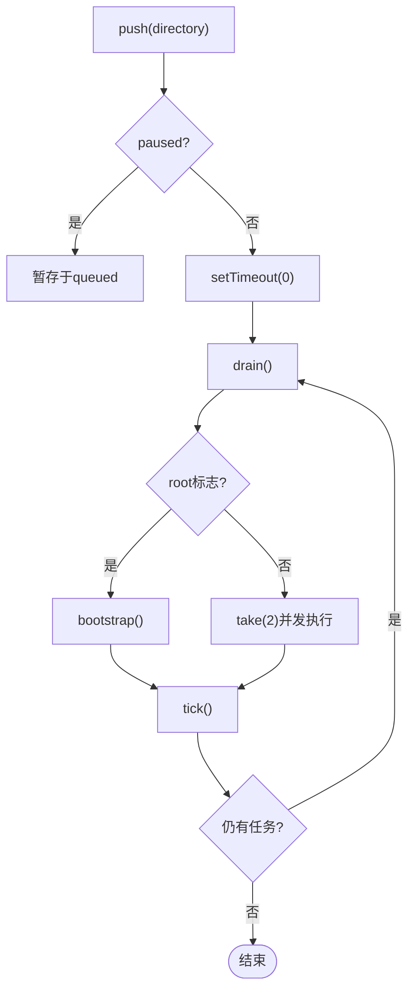

**图表来源** 
- [packages/app/src/context/global-sync/queue.ts:1-88](file://packages/app/src/context/global-sync/queue.ts#L1-L88)

**章节来源**
- [packages/app/src/context/global-sync/queue.ts:1-88](file://packages/app/src/context/global-sync/queue.ts#L1-L88)

### 重试与过期清理（集成层）
- 机制
  - 周期性 scrub 扫描 attempts Map，将 pending 且 expires <= now 的标记为 expired
  - 非 pending 且在 removeAt <= now 的条目被删除
- 价值
  - 防止长期残留的尝试占用内存，形成“死信”清理闭环

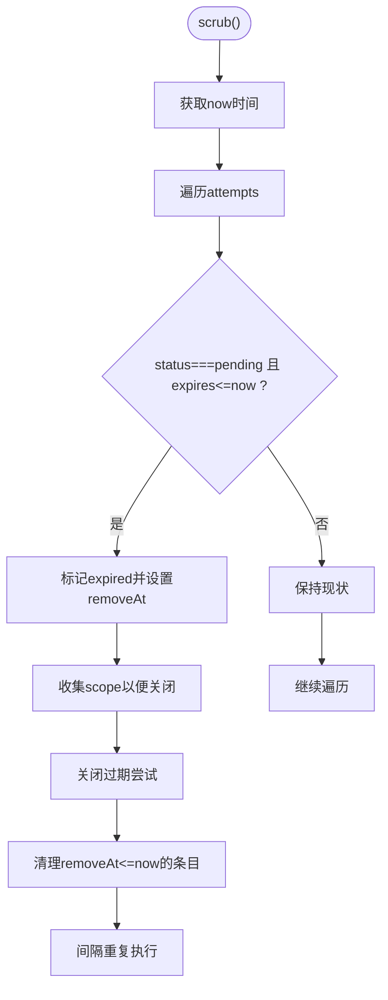

**图表来源** 
- [packages/core/src/integration.ts:346-364](file://packages/core/src/integration.ts#L346-L364)

**章节来源**
- [packages/core/src/integration.ts:346-364](file://packages/core/src/integration.ts#L346-L364)

### 提供者选择与预算限流
- 选择策略
  - 过滤 weight=0、排除重试黑名单、预算优先级资格、TPM 限额、低 TPS 质量
  - 选取最小 topPriority，并按 provider.weight 复制候选
- 预算追踪
  - 基于 Redis 存储 per-provider/priority 的用量，结合上一分钟用量计算有效预算

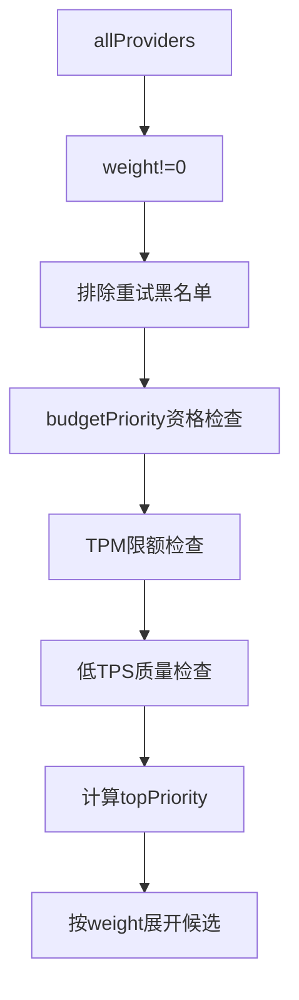

**图表来源** 
- [packages/console/app/src/routes/zen/util/handler.ts:602-630](file://packages/console/app/src/routes/zen/util/handler.ts#L602-L630)
- [packages/console/app/src/routes/zen/util/providerBudgetTracker.ts:39-87](file://packages/console/app/src/routes/zen/util/providerBudgetTracker.ts#L39-L87)

**章节来源**
- [packages/console/app/src/routes/zen/util/handler.ts:602-630](file://packages/console/app/src/routes/zen/util/handler.ts#L602-L630)
- [packages/console/app/src/routes/zen/util/providerBudgetTracker.ts:39-87](file://packages/console/app/src/routes/zen/util/providerBudgetTracker.ts#L39-L87)

### 服务端事件合并
- 目的
  - 对高频 message.part.delta 事件进行合并，降低 UI 更新频率
- 方法
  - enqueueServerEvent 合并相邻同键事件；coalesceServerEvents 批量合并

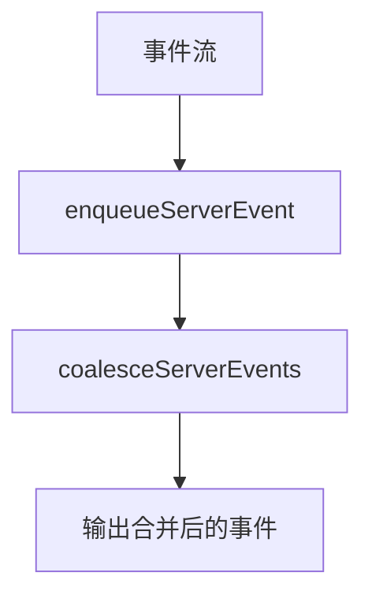

**图表来源** 
- [packages/app/src/context/server-sdk.tsx:29-72](file://packages/app/src/context/server-sdk.tsx#L29-L72)

**章节来源**
- [packages/app/src/context/server-sdk.tsx:29-72](file://packages/app/src/context/server-sdk.tsx#L29-L72)

## 依赖关系分析
- 组件耦合
  - 优先级任务队列依赖并发工作器（work）进行任务执行
  - Worker 传输与队列相互协作，传输层负责覆盖语义，队列层负责顺序消费
  - CLI 队列独立串行执行，不与其他队列共享状态
  - 重试与清理作为横切关注点，作用于所有需要生命周期的尝试
  - 提供者选择与预算追踪影响上游调度决策
- 外部依赖
  - Redis 用于预算追踪
  - Effect/Schedule 用于定时清理
- 潜在环路
  - 各队列之间无循环依赖，均为单向调用

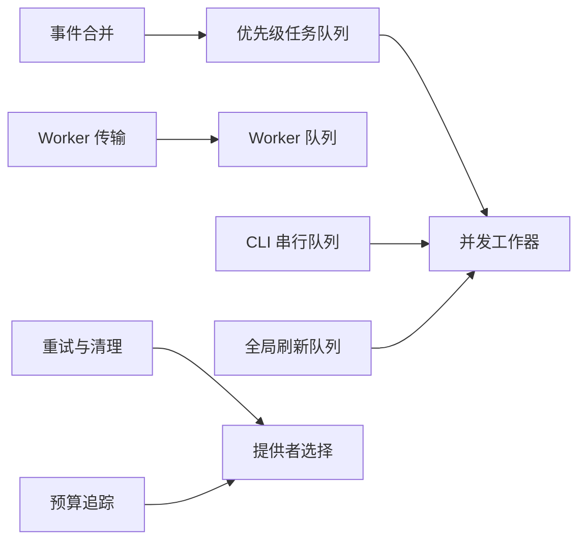

**图表来源** 
- [packages/app/src/components/directory-picker-domain.ts:141-212](file://packages/app/src/components/directory-picker-domain.ts#L141-L212)
- [packages/opencode/src/util/queue.ts:21-33](file://packages/opencode/src/util/queue.ts#L21-L33)
- [packages/session-ui/src/components/markdown-worker-transport.ts:1-42](file://packages/session-ui/src/components/markdown-worker-transport.ts#L1-L42)
- [packages/session-ui/src/components/markdown-worker-queue.ts:1-65](file://packages/session-ui/src/components/markdown-worker-queue.ts#L1-L65)
- [packages/opencode/src/cli/cmd/run/runtime.queue.ts:59-350](file://packages/opencode/src/cli/cmd/run/runtime.queue.ts#L59-L350)
- [packages/app/src/context/global-sync/queue.ts:1-88](file://packages/app/src/context/global-sync/queue.ts#L1-L88)
- [packages/core/src/integration.ts:346-364](file://packages/core/src/integration.ts#L346-L364)
- [packages/console/app/src/routes/zen/util/handler.ts:602-630](file://packages/console/app/src/routes/zen/util/handler.ts#L602-L630)
- [packages/console/app/src/routes/zen/util/providerBudgetTracker.ts:39-87](file://packages/console/app/src/routes/zen/util/providerBudgetTracker.ts#L39-L87)
- [packages/app/src/context/server-sdk.tsx:29-72](file://packages/app/src/context/server-sdk.tsx#L29-L72)

**章节来源**
- [packages/app/src/components/directory-picker-domain.ts:141-212](file://packages/app/src/components/directory-picker-domain.ts#L141-L212)
- [packages/opencode/src/util/queue.ts:21-33](file://packages/opencode/src/util/queue.ts#L21-L33)
- [packages/session-ui/src/components/markdown-worker-transport.ts:1-42](file://packages/session-ui/src/components/markdown-worker-transport.ts#L1-L42)
- [packages/session-ui/src/components/markdown-worker-queue.ts:1-65](file://packages/session-ui/src/components/markdown-worker-queue.ts#L1-L65)
- [packages/opencode/src/cli/cmd/run/runtime.queue.ts:59-350](file://packages/opencode/src/cli/cmd/run/runtime.queue.ts#L59-L350)
- [packages/app/src/context/global-sync/queue.ts:1-88](file://packages/app/src/context/global-sync/queue.ts#L1-L88)
- [packages/core/src/integration.ts:346-364](file://packages/core/src/integration.ts#L346-L364)
- [packages/console/app/src/routes/zen/util/handler.ts:602-630](file://packages/console/app/src/routes/zen/util/handler.ts#L602-L630)
- [packages/console/app/src/routes/zen/util/providerBudgetTracker.ts:39-87](file://packages/console/app/src/routes/zen/util/providerBudgetTracker.ts#L39-L87)
- [packages/app/src/context/server-sdk.tsx:29-72](file://packages/app/src/context/server-sdk.tsx#L29-L72)

## 性能考虑
- 队列大小调优
  - 优先级队列：根据业务峰值调整 concurrency，避免过多排队导致内存增长
  - Worker 队列：合理设置 supersede 策略，避免堆积过久
  - CLI 队列：串行执行天然限制吞吐，适合交互场景
- 内存管理
  - 及时清理 Map/Set 中的已完成条目，防止泄漏
  - 合并高频事件（如 delta），降低渲染压力
- 垃圾回收策略
  - 控制对象创建频率，复用 Job/Slot 结构
  - 使用短生命周期 Promise 与一次性作用域，缩短 GC 压力
- 并发控制
  - 使用固定并发度 work(concurrency, ...) 避免过载
  - 对于 IO 密集任务，适当提高并发；CPU 密集任务需保守设置
- 监控指标
  - 建议采集 p50/p95 延迟、成功/失败计数、样本量、平均输出 TPS 等
  - 参考统计字段：p50_duration_ms、p95_duration_ms、avg_ttfb_ms、success_count、error_count、sample_count、avg_output_tps

[本节为通用指导，不直接分析具体文件]

## 故障排查指南
- 常见问题定位
  - 任务未执行：检查 active 计数与 drain 逻辑，确认是否达到并发上限
  - 任务被覆盖：确认 supersede 语义是否符合预期（Worker 传输层）
  - 队列积压：查看 queued.size 与 pending，必要时扩容或降频
  - 超时中断：检查 timeoutMs 与 AbortController 传播
  - “死信”残留：确认 scrub 周期与 removeAt 清理逻辑
- 调试工具
  - CLI 队列暴露 queue 长度与每轮 duration，便于观察排队与耗时
  - Worker 队列提供 pending()/idle() 查询与阻塞等待
  - 事件合并可减少抖动，便于定位 UI 卡顿
- 重试与预算
  - 检查 provider 过滤条件（weight、tpmLimit、tpsGoal、budgetPriority）
  - 核对 Redis 预算键值与上一分钟用量，确保有效预算正确

**章节来源**
- [packages/opencode/src/cli/cmd/run/runtime.queue.ts:59-350](file://packages/opencode/src/cli/cmd/run/runtime.queue.ts#L59-L350)
- [packages/session-ui/src/components/markdown-worker-queue.ts:1-65](file://packages/session-ui/src/components/markdown-worker-queue.ts#L1-L65)
- [packages/console/app/src/routes/zen/util/handler.ts:602-630](file://packages/console/app/src/routes/zen/util/handler.ts#L602-L630)
- [packages/console/app/src/routes/zen/util/providerBudgetTracker.ts:39-87](file://packages/console/app/src/routes/zen/util/providerBudgetTracker.ts#L39-L87)
- [packages/core/src/integration.ts:346-364](file://packages/core/src/integration.ts#L346-L364)

## 结论
本仓库提供了多层次的队列与调度能力：
- 应用层优先级队列满足 UI 交互抢占需求
- Worker 传输与队列保障“最新覆盖”的顺序消费
- CLI 串行队列确保交互一致性
- 通用异步队列与并发工作器提供基础构建块
- 全局刷新队列实现批量节流刷新
- 重试与过期清理形成“死信”闭环
- 提供者选择与预算限流保障公平与成本可控
- 事件合并降低 UI 抖动

通过合理配置并发度、队列大小与清理策略，并结合监控指标与调试工具，可实现稳定高效的 AI 请求调度系统。

[本节为总结性内容，不直接分析具体文件]

## 附录
- 关键指标字段参考
  - p50_duration_ms、p95_duration_ms、avg_ttfb_ms、success_count、error_count、sample_count、avg_output_tps

**章节来源**
- [packages/stats/core/src/domain/inference.ts:39-49](file://packages/stats/core/src/domain/inference.ts#L39-L49)