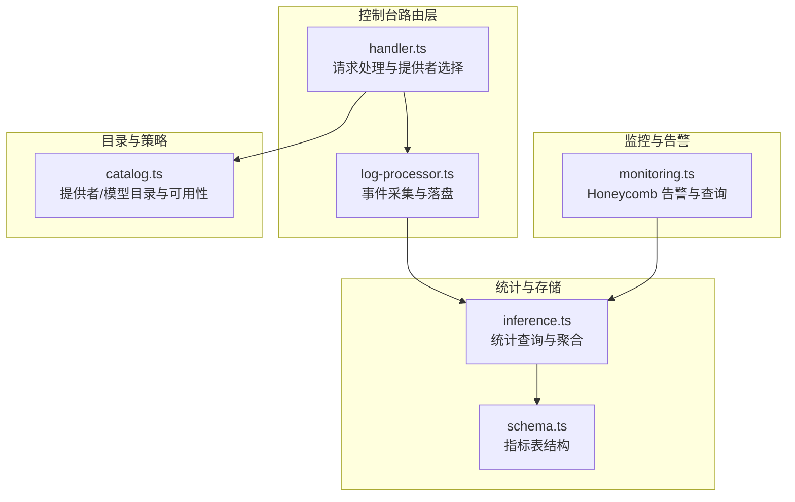
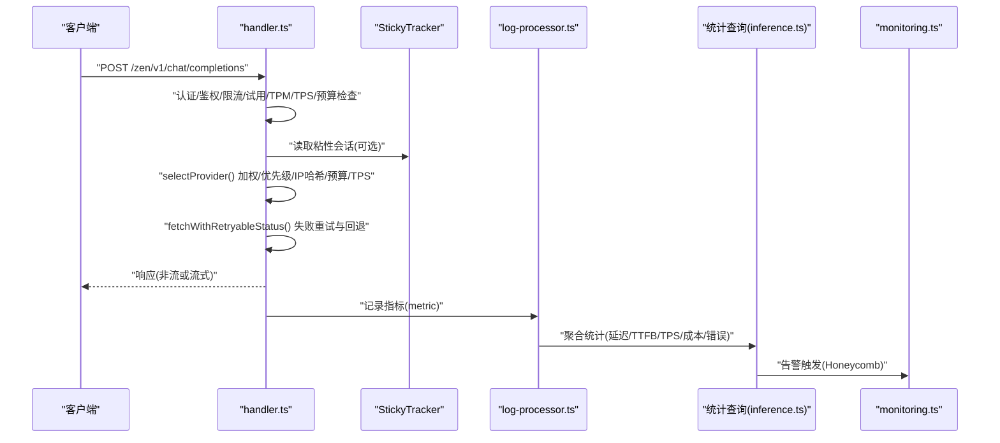
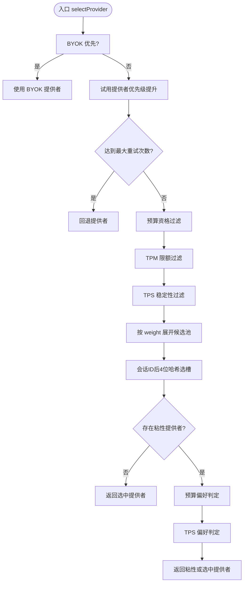
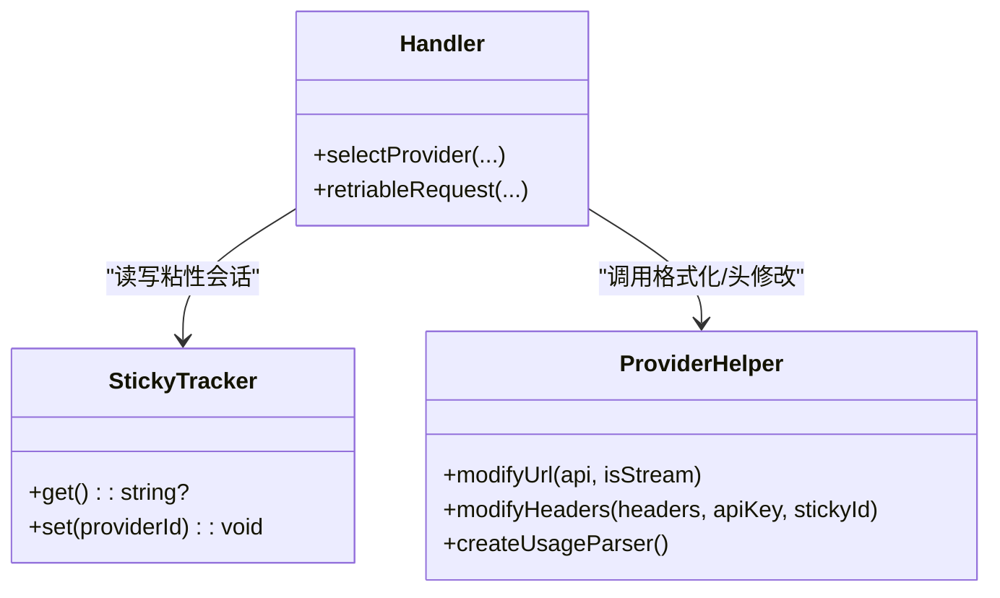
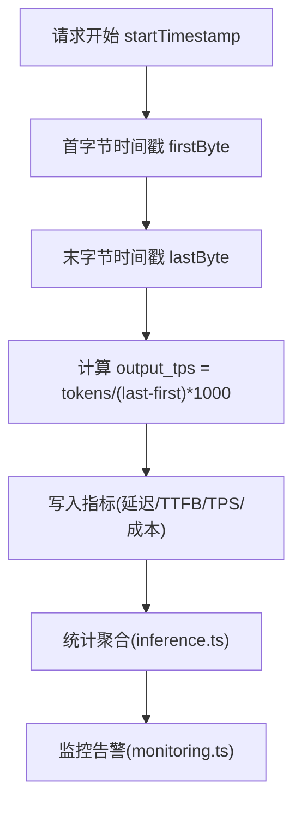
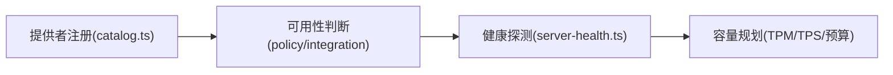
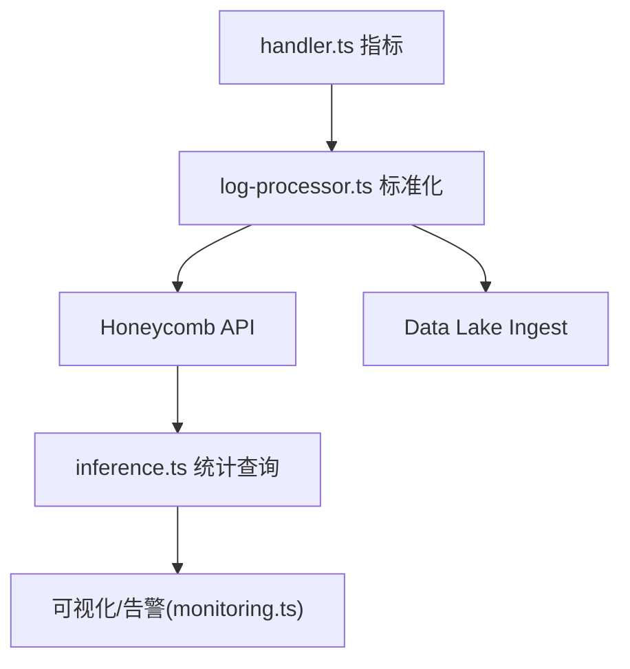
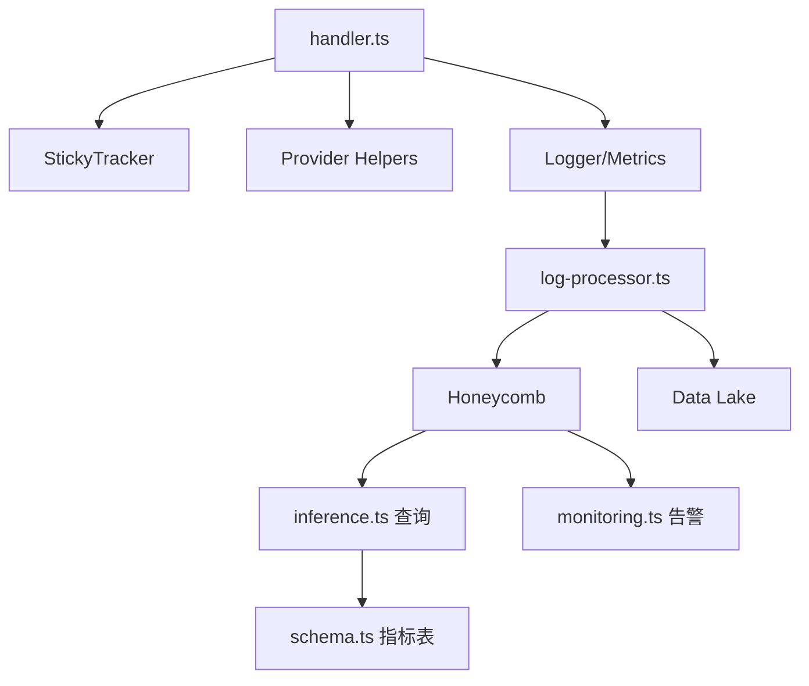

# 负载均衡策略

<cite>
**本文引用的文件**   
- [packages/console/app/src/routes/zen/util/handler.ts](file://packages/console/app/src/routes/zen/util/handler.ts)
- [packages/console/function/src/log-processor.ts](file://packages/console/function/src/log-processor.ts)
- [packages/stats/core/src/domain/inference.ts](file://packages/stats/core/src/domain/inference.ts)
- [packages/stats/core/src/database/schema.ts](file://packages/stats/core/src/database/schema.ts)
- [infra/monitoring.ts](file://infra/monitoring.ts)
- [packages/core/src/catalog.ts](file://packages/core/src/catalog.ts)
- [packages/app/src/utils/server-health.ts](file://packages/app/src/utils/server-health.ts)
- [packages/app/src/components/status-popover-body.tsx](file://packages/app/src/components/status-popover-body.tsx)
</cite>

## 目录
1. [简介](#简介)
2. [项目结构](#项目结构)
3. [核心组件](#核心组件)
4. [架构总览](#架构总览)
5. [详细组件分析](#详细组件分析)
6. [依赖关系分析](#依赖关系分析)
7. [性能考量](#性能考量)
8. [故障排查指南](#故障排查指南)
9. [结论](#结论)
10. [附录](#附录)

## 简介
本文件面向 AI 服务负载均衡系统，系统化梳理并说明以下能力：
- 轮询与分配算法：简单轮询、加权轮询、最少连接数（以 TPS 为代理）的决策路径。
- 基于性能的动态调整：响应时间监控、吞吐量统计、自适应权重与预算控制。
- 会话保持机制：粘性会话、IP 哈希、自定义路由规则。
- 后端节点管理：提供者注册、健康状态维护与容量规划思路。
- 配置模板与最佳实践：不同场景下的推荐参数与调优建议。
- 监控仪表板与性能分析工具：指标采集、查询定义与告警策略。

## 项目结构
本项目在“控制台路由层”实现请求到提供者的选择与转发；在“日志处理与统计”中完成指标聚合与持久化；在“基础设施监控”中定义告警与看板；在“目录与策略层”提供模型与提供者元数据与可用性判断。

**图表来源** 
- [packages/console/app/src/routes/zen/util/handler.ts:1-800](file://packages/console/app/src/routes/zen/util/handler.ts#L1-L800)
- [packages/console/function/src/log-processor.ts:1-212](file://packages/console/function/src/log-processor.ts#L1-L212)
- [packages/stats/core/src/domain/inference.ts:1-268](file://packages/stats/core/src/domain/inference.ts#L1-L268)
- [packages/stats/core/src/database/schema.ts:122-146](file://packages/stats/core/src/database/schema.ts#L122-L146)
- [infra/monitoring.ts:1-288](file://infra/monitoring.ts#L1-L288)
- [packages/core/src/catalog.ts:1-302](file://packages/core/src/catalog.ts#L1-L302)

**章节来源**
- [packages/console/app/src/routes/zen/util/handler.ts:1-800](file://packages/console/app/src/routes/zen/util/handler.ts#L1-L800)
- [packages/console/function/src/log-processor.ts:1-212](file://packages/console/function/src/log-processor.ts#L1-L212)
- [packages/stats/core/src/domain/inference.ts:1-268](file://packages/stats/core/src/domain/inference.ts#L1-L268)
- [packages/stats/core/src/database/schema.ts:122-146](file://packages/stats/core/src/database/schema.ts#L122-L146)
- [infra/monitoring.ts:1-288](file://infra/monitoring.ts#L1-L288)
- [packages/core/src/catalog.ts:1-302](file://packages/core/src/catalog.ts#L1-L302)

## 核心组件
- 请求处理与提供者选择（handler.ts）
  - 认证、鉴权、限流、试用额度、TPM/TPS 限制、预算跟踪、重试与回退、粘性会话、IP 哈希、自定义路由规则。
- 日志与事件处理（log-processor.ts）
  - 从 Cloudflare Trace 拉取事件，标准化字段，推送至 Honeycomb 与 Data Lake，包含 IP 前缀归一化。
- 统计聚合（inference.ts）
  - 构建 Athena/Honeycomb 查询，按维度（模型/提供者/地理/地理×模型）聚合延迟、TTFB、TPS、成本、错误率等。
- 指标存储（schema.ts）
  - 定义指标表的列结构与默认值，支撑多维统计查询。
- 监控告警（monitoring.ts）
  - 定义模型 HTTP 错误率、提供者错误率、低 TPS 等触发器，并通过 Webhook 通知。
- 目录与可用性（catalog.ts）
  - 提供者/模型注册、可用性与默认模型选择、小模型自动挑选策略。

**章节来源**
- [packages/console/app/src/routes/zen/util/handler.ts:1-800](file://packages/console/app/src/routes/zen/util/handler.ts#L1-L800)
- [packages/console/function/src/log-processor.ts:1-212](file://packages/console/function/src/log-processor.ts#L1-L212)
- [packages/stats/core/src/domain/inference.ts:1-268](file://packages/stats/core/src/domain/inference.ts#L1-L268)
- [packages/stats/core/src/database/schema.ts:122-146](file://packages/stats/core/src/database/schema.ts#L122-L146)
- [infra/monitoring.ts:1-288](file://infra/monitoring.ts#L1-L288)
- [packages/core/src/catalog.ts:1-302](file://packages/core/src/catalog.ts#L1-L302)

## 架构总览
下图展示一次请求从进入控制台路由到最终返回的完整流程，包括提供者选择、重试与回退、指标采集与统计。

**图表来源** 
- [packages/console/app/src/routes/zen/util/handler.ts:160-450](file://packages/console/app/src/routes/zen/util/handler.ts#L160-L450)
- [packages/console/function/src/log-processor.ts:1-120](file://packages/console/function/src/log-processor.ts#L1-L120)
- [packages/stats/core/src/domain/inference.ts:20-160](file://packages/stats/core/src/domain/inference.ts#L20-L160)
- [infra/monitoring.ts:160-238](file://infra/monitoring.ts#L160-L238)

## 详细组件分析

### 组件A：提供者选择与轮询/加权/最少连接（TPS）
- 加权轮询
  - 通过 provider.weight 将提供者展开为候选池，再结合优先级与过滤条件（预算、TPM、TPS）得到最终候选集。
- 简单轮询
  - 当所有提供者权重一致且无额外约束时，等价于顺序轮询。
- 最少连接（以 TPS 代理）
  - 使用 modelTpsLimits 中的 qualify/unqualify 计数，优先选择 TPS 表现更稳定的提供者，作为“负载更低”的代理。

**图表来源** 
- [packages/console/app/src/routes/zen/util/handler.ts:564-685](file://packages/console/app/src/routes/zen/util/handler.ts#L564-L685)

**章节来源**
- [packages/console/app/src/routes/zen/util/handler.ts:564-685](file://packages/console/app/src/routes/zen/util/handler.ts#L564-L685)

### 组件B：会话保持（粘性会话、IP 哈希、自定义路由）
- 粘性会话
  - 通过 stickyId（session ID 或 workspace 或 IP）与 stickyProviderTracker 记录最近成功提供者，后续请求优先命中。
- IP 哈希
  - 对 stickyId 后 4 个字符进行 32 位哈希，映射到候选池索引，保证同一会话稳定落到同一提供者。
- 自定义路由规则
  - 支持 header/body 替换、URL 改写、格式转换等，由 provider helper 注入。

**图表来源** 
- [packages/console/app/src/routes/zen/util/handler.ts:140-170](file://packages/console/app/src/routes/zen/util/handler.ts#L140-L170)
- [packages/console/app/src/routes/zen/util/handler.ts:632-665](file://packages/console/app/src/routes/zen/util/handler.ts#L632-L665)

**章节来源**
- [packages/console/app/src/routes/zen/util/handler.ts:140-170](file://packages/console/app/src/routes/zen/util/handler.ts#L140-L170)
- [packages/console/app/src/routes/zen/util/handler.ts:632-665](file://packages/console/app/src/routes/zen/util/handler.ts#L632-L665)

### 组件C：基于性能的动态调整（响应时间、吞吐、自适应权重）
- 响应时间监控
  - 记录 time_to_first_byte、timestamp.first_byte/last_byte、duration，用于 TTFT/延迟分布评估。
- 吞吐量统计
  - 计算 output_tps（tokens_output / (timestamp_last_byte - timestamp_first_byte) * 1000），并按 provider/model 维度聚合。
- 自适应权重
  - 通过 modelTpsLimits 的 qualify/unqualify 比率与 providerBudgetTracker 的预算配额，动态影响选择结果。

**图表来源** 
- [packages/console/app/src/routes/zen/util/handler.ts:350-430](file://packages/console/app/src/routes/zen/util/handler.ts#L350-L430)
- [packages/stats/core/src/domain/inference.ts:110-125](file://packages/stats/core/src/domain/inference.ts#L110-L125)

**章节来源**
- [packages/console/app/src/routes/zen/util/handler.ts:350-430](file://packages/console/app/src/routes/zen/util/handler.ts#L350-L430)
- [packages/stats/core/src/domain/inference.ts:110-125](file://packages/stats/core/src/domain/inference.ts#L110-L125)

### 组件D：后端节点管理（注册、健康、容量规划）
- 提供者注册与可用性
  - catalog.ts 维护 provider 与 model 的元数据，结合 integration 与 policy 判断可用性。
- 健康状态维护
  - server-health.ts 周期性探测健康端点，缓存结果并排序显示。
- 容量规划
  - 通过 TPM/TPS 限制与预算跟踪，避免单提供者过载；结合历史 TPS 与错误率进行容量评估。

**图表来源** 
- [packages/core/src/catalog.ts:71-76](file://packages/core/src/catalog.ts#L71-L76)
- [packages/app/src/utils/server-health.ts:70-154](file://packages/app/src/utils/server-health.ts#L70-L154)

**章节来源**
- [packages/core/src/catalog.ts:71-76](file://packages/core/src/catalog.ts#L71-L76)
- [packages/app/src/utils/server-health.ts:70-154](file://packages/app/src/utils/server-health.ts#L70-L154)

### 组件E：监控仪表板与性能分析工具
- 指标采集
  - handler.ts 通过 logger.metric 输出结构化指标；log-processor.ts 标准化并投递至 Honeycomb/Data Lake。
- 统计查询
  - inference.ts 定义多维度聚合查询（延迟分位、TTFB、TPS、成本、错误率）。
- 告警策略
  - monitoring.ts 定义模型/提供者错误率、低 TPS、免费层请求激增等触发器。

**图表来源** 
- [packages/console/app/src/routes/zen/util/handler.ts:110-130](file://packages/console/app/src/routes/zen/util/handler.ts#L110-L130)
- [packages/console/function/src/log-processor.ts:56-85](file://packages/console/function/src/log-processor.ts#L56-L85)
- [packages/stats/core/src/domain/inference.ts:20-160](file://packages/stats/core/src/domain/inference.ts#L20-L160)
- [infra/monitoring.ts:160-238](file://infra/monitoring.ts#L160-L238)

**章节来源**
- [packages/console/app/src/routes/zen/util/handler.ts:110-130](file://packages/console/app/src/routes/zen/util/handler.ts#L110-L130)
- [packages/console/function/src/log-processor.ts:56-85](file://packages/console/function/src/log-processor.ts#L56-L85)
- [packages/stats/core/src/domain/inference.ts:20-160](file://packages/stats/core/src/domain/inference.ts#L20-L160)
- [infra/monitoring.ts:160-238](file://infra/monitoring.ts#L160-L238)

## 依赖关系分析
- handler.ts 依赖：
  - 认证/限流/试用/TPM/TPS/预算跟踪模块
  - StickyTracker（粘性会话）
  - Provider Helper（OpenAI/Anthropic/Google/OA兼容）
  - 日志与指标上报
- log-processor.ts 依赖：
  - Cloudflare Trace 事件
  - Honeycomb API 与 Data Lake Ingest
- inference.ts 依赖：
  - Athena/Honeycomb 查询规范
- monitoring.ts 依赖：
  - Honeycomb Trigger/Webhook

**图表来源** 
- [packages/console/app/src/routes/zen/util/handler.ts:1-800](file://packages/console/app/src/routes/zen/util/handler.ts#L1-L800)
- [packages/console/function/src/log-processor.ts:1-212](file://packages/console/function/src/log-processor.ts#L1-L212)
- [packages/stats/core/src/domain/inference.ts:1-268](file://packages/stats/core/src/domain/inference.ts#L1-L268)
- [packages/stats/core/src/database/schema.ts:122-146](file://packages/stats/core/src/database/schema.ts#L122-L146)
- [infra/monitoring.ts:1-288](file://infra/monitoring.ts#L1-L288)

**章节来源**
- [packages/console/app/src/routes/zen/util/handler.ts:1-800](file://packages/console/app/src/routes/zen/util/handler.ts#L1-L800)
- [packages/console/function/src/log-processor.ts:1-212](file://packages/console/function/src/log-processor.ts#L1-L212)
- [packages/stats/core/src/domain/inference.ts:1-268](file://packages/stats/core/src/domain/inference.ts#L1-L268)
- [packages/stats/core/src/database/schema.ts:122-146](file://packages/stats/core/src/database/schema.ts#L122-L146)
- [infra/monitoring.ts:1-288](file://infra/monitoring.ts#L1-L288)

## 性能考量
- 延迟与 TTFB
  - 关注 time_to_first_byte 与 p50/p95 延迟，优化首包时间与上游网络。
- 吞吐量（TPS）
  - 通过 output_tps 评估模型/提供者吞吐，结合 qualify/unqualify 比例做动态切换。
- 错误率与回退
  - 针对非 4xx 错误进行有限重试，超过阈值回退到备用提供者。
- 资源限制
  - TPM/TPS 限制与预算跟踪防止过载与超支。
- 缓存与复用
  - 流式传输减少解析开销，二进制解码器降低 CPU 消耗。

[本节为通用指导，不直接分析具体文件]

## 故障排查指南
- 常见问题定位
  - 查看 error.type/error.message 与 llm.error.code，区分认证、限流、模型不支持、上游错误。
  - 检查 status 码与 response_length，确认是否流式中断或上游异常。
- 粘性会话问题
  - 确认 stickyId 生成逻辑与 stickyProviderTracker 的读写一致性。
- 指标缺失
  - 校验 logger.metric 字段是否与 log-processor.ts 的 toLakeEvent 映射一致。
- 告警误报
  - 检查 monitoring.ts 的过滤器与阈值设置，排除 401/429 等预期错误。

**章节来源**
- [packages/console/app/src/routes/zen/util/handler.ts:446-533](file://packages/console/app/src/routes/zen/util/handler.ts#L446-L533)
- [packages/console/function/src/log-processor.ts:97-155](file://packages/console/function/src/log-processor.ts#L97-L155)
- [infra/monitoring.ts:160-238](file://infra/monitoring.ts#L160-L238)

## 结论
本负载均衡系统通过加权轮询、优先级与预算/TPS 约束实现智能选择，结合粘性会话与 IP 哈希保障稳定性，并以完善的指标采集与告警体系支撑性能调优与故障定位。建议在多提供者环境下持续观察 TPS、延迟与错误率，动态调整权重与限额，确保高可用与成本可控。

[本节为总结性内容，不直接分析具体文件]

## 附录

### 配置模板与最佳实践
- 基础模板
  - 启用多个提供者，设置合理权重与优先级；开启预算跟踪与 TPM/TPS 限制。
- 高可用场景
  - 配置 fallbackProvider 与 MAX_FAILOVER_RETRIES；启用重试与回退。
- 低延迟场景
  - 优先选择 TPS 高的提供者；开启粘性会话减少抖动。
- 成本控制
  - 设置 budgetPriority 与 tpmLimit；监控 cost_total_microcents 与 success_count。

[本节为通用指导，不直接分析具体文件]

### 监控仪表板与性能分析工具使用说明
- 指标采集
  - 在 handler.ts 中通过 logger.metric 输出结构化指标；log-processor.ts 标准化并投递。
- 统计查询
  - 使用 inference.ts 的 buildStatsQuery 获取多维度聚合结果。
- 告警配置
  - 参考 monitoring.ts 定义错误率、低 TPS、免费层请求激增等触发器。

**章节来源**
- [packages/console/app/src/routes/zen/util/handler.ts:110-130](file://packages/console/app/src/routes/zen/util/handler.ts#L110-L130)
- [packages/console/function/src/log-processor.ts:56-85](file://packages/console/function/src/log-processor.ts#L56-L85)
- [packages/stats/core/src/domain/inference.ts:20-160](file://packages/stats/core/src/domain/inference.ts#L20-L160)
- [infra/monitoring.ts:160-238](file://infra/monitoring.ts#L160-L238)