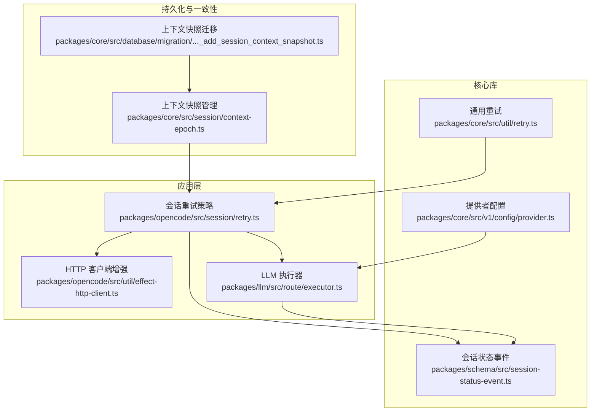
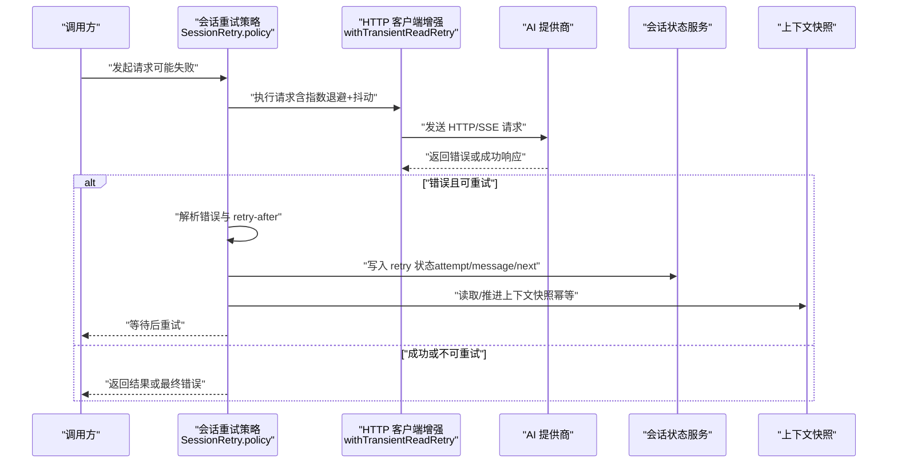
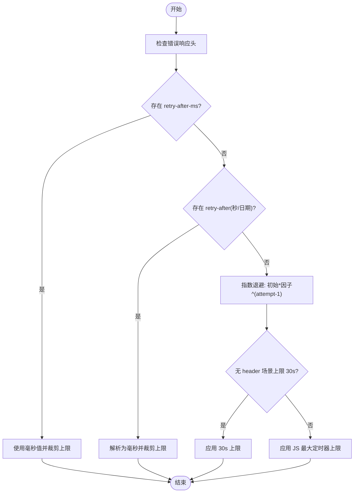
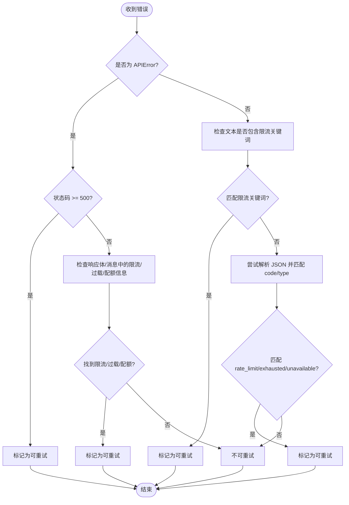
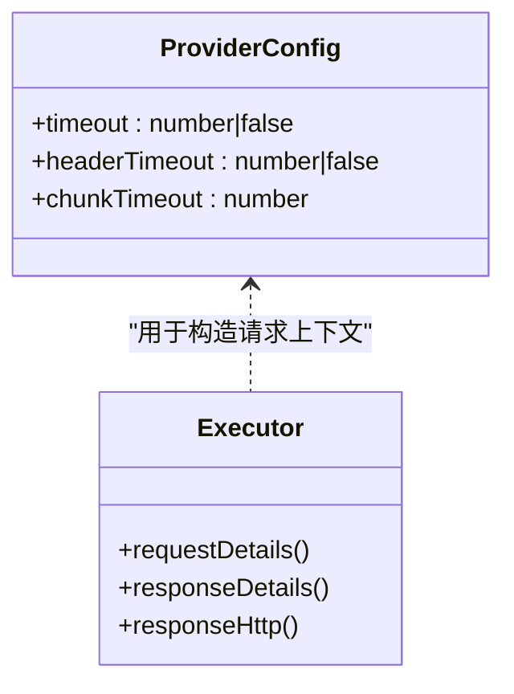
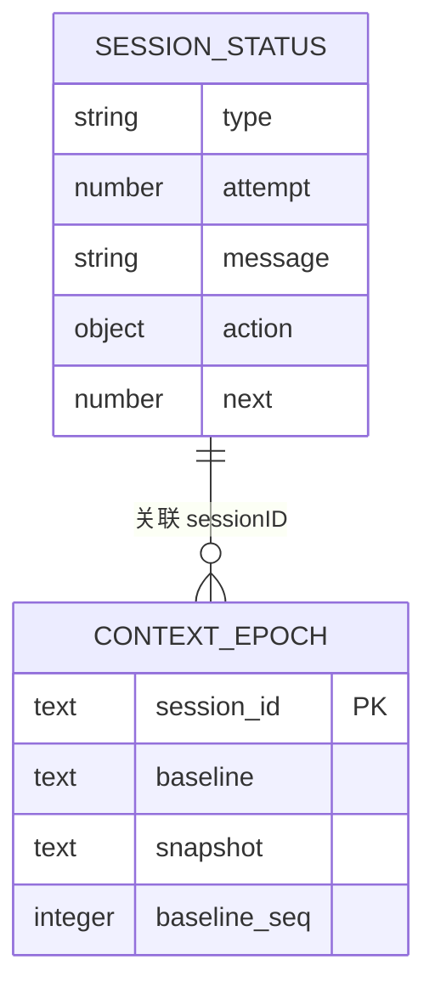
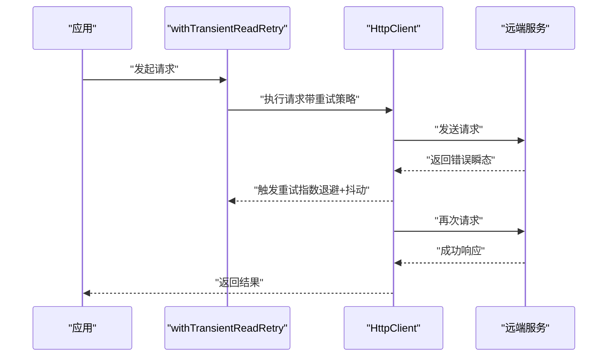
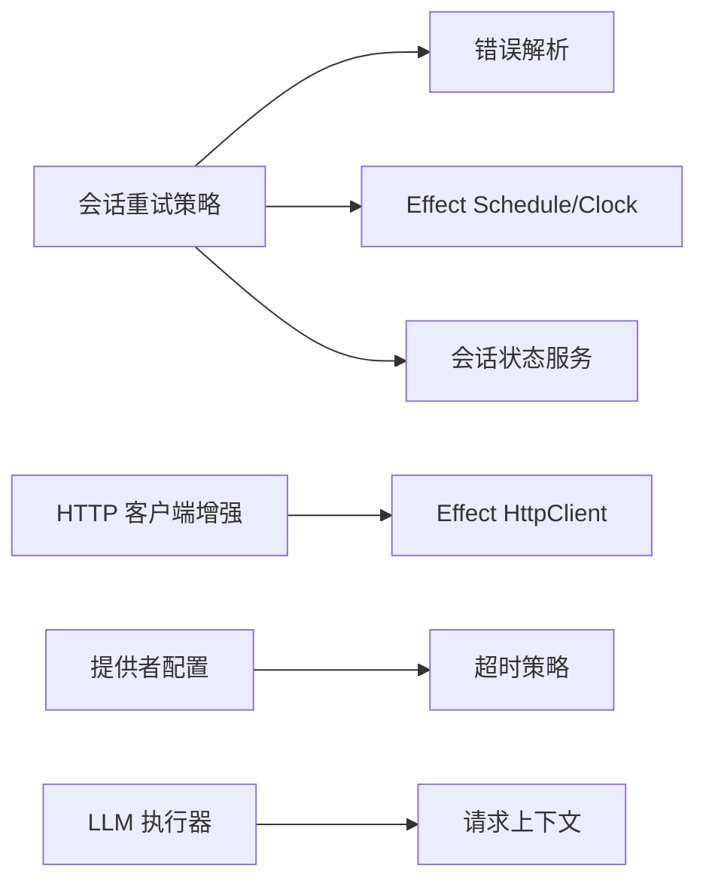

# 重试与指数退避

<cite>
**本文引用的文件**   
- [packages/core/src/util/retry.ts](file://packages/core/src/util/retry.ts)
- [packages/opencode/src/session/retry.ts](file://packages/opencode/src/session/retry.ts)
- [packages/opencode/test/session/retry.test.ts](file://packages/opencode/test/session/retry.test.ts)
- [packages/opencode/src/util/effect-http-client.ts](file://packages/opencode/src/util/effect-http-client.ts)
- [packages/core/src/v1/config/provider.ts](file://packages/core/src/v1/config/provider.ts)
- [packages/llm/src/route/executor.ts](file://packages/llm/src/route/executor.ts)
- [packages/schema/src/session-status-event.ts](file://packages/schema/src/session-status-event.ts)
- [packages/core/src/database/migration/20260605003541_add_session_context_snapshot.ts](file://packages/core/src/database/migration/20260605003541_add_session_context_snapshot.ts)
- [packages/core/src/session/context-epoch.ts](file://packages/core/src/session/context-epoch.ts)
</cite>

## 目录
1. [简介](#简介)
2. [项目结构](#项目结构)
3. [核心组件](#核心组件)
4. [架构总览](#架构总览)
5. [详细组件分析](#详细组件分析)
6. [依赖关系分析](#依赖关系分析)
7. [性能考量](#性能考量)
8. [故障排查指南](#故障排查指南)
9. [结论](#结论)
10. [附录：配置示例与最佳实践](#附录配置示例与最佳实践)

## 简介
本文件系统化梳理 AI 请求重试机制，覆盖指数退避算法、错误分类策略、超时处理、重试上下文管理与一致性保障，并提供不同 API 类型的重试策略配置建议、性能影响分析与调试技巧。目标是帮助开发者快速理解并正确配置重试行为，提升系统稳定性与用户体验。

## 项目结构
围绕“重试与指数退避”的关键代码分布在以下模块：
- 通用重试工具（core）：提供基础重试函数与临时性错误识别
- 会话级重试策略（opencode）：实现更精细的延迟计算、可重试判定、策略编排与状态更新
- HTTP 客户端增强（opencode）：基于 Effect 的瞬态错误自动重试包装
- 提供者配置（core）：定义连接/头部/分片等超时参数
- LLM 执行器（llm）：构造请求上下文与响应细节，便于日志与诊断
- 会话状态事件（schema）：统一描述 idle/busy/retry 状态
- 上下文快照（core）：保证重试过程中的数据一致性与幂等性

**图表来源** 
- [packages/core/src/util/retry.ts:1-43](file://packages/core/src/util/retry.ts#L1-L43)
- [packages/opencode/src/session/retry.ts:1-202](file://packages/opencode/src/session/retry.ts#L1-L202)
- [packages/opencode/src/util/effect-http-client.ts:1-11](file://packages/opencode/src/util/effect-http-client.ts#L1-L11)
- [packages/core/src/v1/config/provider.ts:1-122](file://packages/core/src/v1/config/provider.ts#L1-L122)
- [packages/llm/src/route/executor.ts:204-223](file://packages/llm/src/route/executor.ts#L204-L223)
- [packages/schema/src/session-status-event.ts:1-51](file://packages/schema/src/session-status-event.ts#L1-L51)
- [packages/core/src/database/migration/20260605003541_add_session_context_snapshot.ts:1-21](file://packages/core/src/database/migration/20260605003541_add_session_context_snapshot.ts#L1-L21)
- [packages/core/src/session/context-epoch.ts:1-174](file://packages/core/src/session/context-epoch.ts#L1-L174)

**章节来源**
- [packages/core/src/util/retry.ts:1-43](file://packages/core/src/util/retry.ts#L1-L43)
- [packages/opencode/src/session/retry.ts:1-202](file://packages/opencode/src/session/retry.ts#L1-L202)
- [packages/opencode/src/util/effect-http-client.ts:1-11](file://packages/opencode/src/util/effect-http-client.ts#L1-L11)
- [packages/core/src/v1/config/provider.ts:1-122](file://packages/core/src/v1/config/provider.ts#L1-L122)
- [packages/llm/src/route/executor.ts:204-223](file://packages/llm/src/route/executor.ts#L204-L223)
- [packages/schema/src/session-status-event.ts:1-51](file://packages/schema/src/session-status-event.ts#L1-L51)
- [packages/core/src/database/migration/20260605003541_add_session_context_snapshot.ts:1-21](file://packages/core/src/database/migration/20260605003541_add_session_context_snapshot.ts#L1-L21)
- [packages/core/src/session/context-epoch.ts:1-174](file://packages/core/src/session/context-epoch.ts#L1-L174)

## 核心组件
- 通用重试函数（core）
  - 支持自定义尝试次数、初始延迟、增长因子、最大延迟与可重试判断函数
  - 默认按指数退避计算等待时间，并在最后一次尝试后抛出最后错误
- 会话级重试策略（opencode）
  - 解析服务端 retry-after 头（毫秒或秒或 HTTP 日期），优先使用更短的延迟
  - 对 5xx 错误强制视为可重试；对限流、过载、配额限制等进行语义识别
  - 通过 Effect Schedule 编排重试步骤，并更新会话状态（attempt/message/action/next）
- HTTP 客户端增强（opencode）
  - 基于 Effect 的 HttpClient 包装，针对瞬态错误进行指数退避+抖动重试
- 提供者超时配置（core）
  - 支持整体请求超时、响应头超时、SSE 分片超时等细粒度控制
- LLM 执行器（llm）
  - 构建请求上下文与响应详情，便于记录与诊断
- 会话状态事件（schema）
  - 统一描述 idle/busy/retry 三种状态，retry 携带尝试次数、消息、动作与下次重试时间
- 上下文快照（core）
  - 维护 session 的上下文基线与快照，确保重试过程中的幂等与一致性

**章节来源**
- [packages/core/src/util/retry.ts:1-43](file://packages/core/src/util/retry.ts#L1-L43)
- [packages/opencode/src/session/retry.ts:1-202](file://packages/opencode/src/session/retry.ts#L1-L202)
- [packages/opencode/src/util/effect-http-client.ts:1-11](file://packages/opencode/src/util/effect-http-client.ts#L1-L11)
- [packages/core/src/v1/config/provider.ts:1-122](file://packages/core/src/v1/config/provider.ts#L1-L122)
- [packages/llm/src/route/executor.ts:204-223](file://packages/llm/src/route/executor.ts#L204-L223)
- [packages/schema/src/session-status-event.ts:1-51](file://packages/schema/src/session-status-event.ts#L1-L51)
- [packages/core/src/session/context-epoch.ts:1-174](file://packages/core/src/session/context-epoch.ts#L1-L174)

## 架构总览
下图展示一次带重试的 AI 请求从调用到落盘的关键路径，以及各组件的职责与交互。

**图表来源** 
- [packages/opencode/src/session/retry.ts:176-199](file://packages/opencode/src/session/retry.ts#L176-L199)
- [packages/opencode/src/util/effect-http-client.ts:4-11](file://packages/opencode/src/util/effect-http-client.ts#L4-L11)
- [packages/schema/src/session-status-event.ts:9-33](file://packages/schema/src/session-status-event.ts#L9-L33)
- [packages/core/src/session/context-epoch.ts:122-174](file://packages/core/src/session/context-epoch.ts#L122-L174)

## 详细组件分析

### 指数退避与延迟计算
- 通用重试（core）
  - 默认尝试次数 3，初始延迟 500ms，增长因子 2，最大延迟 10s
  - 每次失败后等待 delay * factor^attempt，直至达到 maxDelay
- 会话重试（opencode）
  - 默认初始延迟 2s，增长因子 2，无 header 时上限 30s
  - 优先读取 retry-after-ms，其次 retry-after（秒或 HTTP 日期），否则回退到指数退避
  - 所有延迟均被裁剪至 JS 定时器最大值，避免溢出

**图表来源** 
- [packages/opencode/src/session/retry.ts:35-66](file://packages/opencode/src/session/retry.ts#L35-L66)
- [packages/core/src/util/retry.ts:27-42](file://packages/core/src/util/retry.ts#L27-L42)

**章节来源**
- [packages/opencode/src/session/retry.ts:26-66](file://packages/opencode/src/session/retry.ts#L26-L66)
- [packages/core/src/util/retry.ts:1-43](file://packages/core/src/util/retry.ts#L1-L43)

### 错误分类策略
- 可重试错误
  - 5xx 服务器错误（即使 SDK 标记不可重试也重试）
  - 限流/过载/配额限制（too_many_requests、resource_exhausted、rate_limit、Too many requests 等）
  - 文本中包含速率限制相关提示
- 不可重试错误
  - 上下文溢出错误（明确不重试）
  - 未知 JSON 错误码或非 JSON 文本（无法识别）
- 临时性错误（网络层）
  - 包含特定关键字的错误消息（如网络断开、连接重置、超时、socket hang up 等）

**图表来源** 
- [packages/opencode/src/session/retry.ts:68-152](file://packages/opencode/src/session/retry.ts#L68-L152)
- [packages/core/src/util/retry.ts:9-25](file://packages/core/src/util/retry.ts#L9-L25)

**章节来源**
- [packages/opencode/src/session/retry.ts:68-152](file://packages/opencode/src/session/retry.ts#L68-L152)
- [packages/core/src/util/retry.ts:9-25](file://packages/core/src/util/retry.ts#L9-L25)

### 超时处理机制
- 整体请求超时：provider 配置项 timeout（毫秒，false 表示禁用）
- 响应头超时：headerTimeout（毫秒，false 表示禁用），用于非 OpenAI 提供商可选启用
- SSE 分片超时：chunkTimeout（毫秒），在指定时间内未收到新分片则中止请求
- 执行器上下文：记录请求与响应详情，便于定位超时原因

**图表来源** 
- [packages/core/src/v1/config/provider.ts:95-114](file://packages/core/src/v1/config/provider.ts#L95-L114)
- [packages/llm/src/route/executor.ts:204-223](file://packages/llm/src/route/executor.ts#L204-L223)

**章节来源**
- [packages/core/src/v1/config/provider.ts:95-114](file://packages/core/src/v1/config/provider.ts#L95-L114)
- [packages/llm/src/route/executor.ts:204-223](file://packages/llm/src/route/executor.ts#L204-L223)

### 重试上下文管理与一致性
- 会话状态事件
  - retry 状态包含 attempt、message、action（reason/provider/title/link）、next（下次重试时间戳）
- 上下文快照
  - 维护 session 的 baseline 与 snapshot，确保重试过程中输入与上下文的一致性
  - 首次完整观察初始化 epoch，后续变更以原子方式推进快照

**图表来源** 
- [packages/schema/src/session-status-event.ts:9-33](file://packages/schema/src/session-status-event.ts#L9-L33)
- [packages/core/src/database/migration/20260605003541_add_session_context_snapshot.ts:1-21](file://packages/core/src/database/migration/20260605003541_add_session_context_snapshot.ts#L1-L21)
- [packages/core/src/session/context-epoch.ts:122-174](file://packages/core/src/session/context-epoch.ts#L122-L174)

**章节来源**
- [packages/schema/src/session-status-event.ts:9-33](file://packages/schema/src/session-status-event.ts#L9-L33)
- [packages/core/src/database/migration/20260605003541_add_session_context_snapshot.ts:1-21](file://packages/core/src/database/migration/20260605003541_add_session_context_snapshot.ts#L1-L21)
- [packages/core/src/session/context-epoch.ts:122-174](file://packages/core/src/session/context-epoch.ts#L122-L174)

### HTTP 客户端增强（Effect）
- 使用 HttpClient.retryTransient 对瞬态错误进行指数退避+抖动重试
- 适用于底层网络波动导致的短暂失败，减少上层重试压力

**图表来源** 
- [packages/opencode/src/util/effect-http-client.ts:4-11](file://packages/opencode/src/util/effect-http-client.ts#L4-L11)

**章节来源**
- [packages/opencode/src/util/effect-http-client.ts:1-11](file://packages/opencode/src/util/effect-http-client.ts#L1-L11)

## 依赖关系分析
- 会话重试策略依赖：
  - 错误解析与可重试判定（SessionV1 APIError、文本/JSON 模式）
  - Effect Schedule 与 Clock 用于编排与时间控制
  - 会话状态服务用于持久化重试进度
- HTTP 客户端增强依赖 Effect 的 HttpClient 与 Schedule
- 提供者配置决定超时策略，影响重试触发时机
- LLM 执行器负责构造上下文与响应细节，辅助日志与诊断

**图表来源** 
- [packages/opencode/src/session/retry.ts:176-199](file://packages/opencode/src/session/retry.ts#L176-L199)
- [packages/opencode/src/util/effect-http-client.ts:4-11](file://packages/opencode/src/util/effect-http-client.ts#L4-L11)
- [packages/core/src/v1/config/provider.ts:95-114](file://packages/core/src/v1/config/provider.ts#L95-L114)
- [packages/llm/src/route/executor.ts:204-223](file://packages/llm/src/route/executor.ts#L204-L223)

**章节来源**
- [packages/opencode/src/session/retry.ts:176-199](file://packages/opencode/src/session/retry.ts#L176-L199)
- [packages/opencode/src/util/effect-http-client.ts:4-11](file://packages/opencode/src/util/effect-http-client.ts#L4-L11)
- [packages/core/src/v1/config/provider.ts:95-114](file://packages/core/src/v1/config/provider.ts#L95-L114)
- [packages/llm/src/route/executor.ts:204-223](file://packages/llm/src/route/executor.ts#L204-L223)

## 性能考量
- 指数退避与抖动
  - 抖动可降低突发重试风暴风险，提高系统稳定性
- 延迟上限
  - 无 header 场景上限 30s，避免长时间阻塞；JS 定时器上限保护
- 重试次数
  - 通用重试默认 3 次；HTTP 客户端增强默认 2 次，按需调整
- 超时配置
  - 合理设置 headerTimeout 与 chunkTimeout，避免长尾请求占用资源
- 负载与拥塞
  - 对 5xx 与限流类错误立即退避，降低上游压力

[本节为通用指导，无需具体文件引用]

## 故障排查指南
- 查看会话状态事件
  - 关注 retry 状态的 attempt、message、action、next，确认重试进度与原因
- 检查 retry-after 头
  - 若服务端返回 retry-after-ms 或 retry-after，应优先遵循其指示
- 验证超时配置
  - 确认 timeout/headerTimeout/chunkTimeout 是否符合预期，避免误判
- 分析错误分类
  - 确认错误是否被识别为可重试（5xx、限流、过载、配额限制）
- 日志与上下文
  - 利用执行器的 request/response 详情定位问题根因

**章节来源**
- [packages/schema/src/session-status-event.ts:9-33](file://packages/schema/src/session-status-event.ts#L9-L33)
- [packages/opencode/src/session/retry.ts:35-66](file://packages/opencode/src/session/retry.ts#L35-L66)
- [packages/core/src/v1/config/provider.ts:95-114](file://packages/core/src/v1/config/provider.ts#L95-L114)
- [packages/llm/src/route/executor.ts:204-223](file://packages/llm/src/route/executor.ts#L204-L223)

## 结论
本项目的重试机制通过“通用重试工具 + 会话级策略 + HTTP 客户端增强”的分层设计，实现了稳健的指数退避、精准的错误分类与灵活的超时控制。配合会话状态事件与上下文快照，保证了重试过程中的可观测性与一致性。建议根据 API 类型与上游特性调优重试参数，以获得最佳稳定性与性能平衡。

[本节为总结，无需具体文件引用]

## 附录：配置示例与最佳实践
- 通用重试（core）
  - attempts=3, delay=500ms, factor=2, maxDelay=10s
  - 适用：网络层瞬态错误、短连接抖动
- 会话重试（opencode）
  - RETRY_INITIAL_DELAY=2000ms, RETRY_BACKOFF_FACTOR=2, RETRY_MAX_DELAY_NO_HEADERS=30s
  - 优先使用 retry-after-ms > retry-after（秒/日期）> 指数退避
  - 适用：AI 提供商限流、过载、配额限制、5xx 错误
- HTTP 客户端增强（effect）
  - times=2, schedule=exponential(200)+jittered
  - 适用：底层 HTTP 瞬态错误
- 超时配置（provider）
  - timeout：整体请求超时（毫秒，false 禁用）
  - headerTimeout：响应头超时（毫秒，false 禁用，非 OpenAI 可选）
  - chunkTimeout：SSE 分片超时（毫秒）
- 最佳实践
  - 对幂等请求可适当增加 attempts；对非幂等请求谨慎重试
  - 结合 retry-after 头动态调整延迟，避免盲目重试
  - 监控会话状态事件与执行器日志，及时定位瓶颈与异常

**章节来源**
- [packages/core/src/util/retry.ts:1-43](file://packages/core/src/util/retry.ts#L1-L43)
- [packages/opencode/src/session/retry.ts:26-66](file://packages/opencode/src/session/retry.ts#L26-L66)
- [packages/opencode/src/util/effect-http-client.ts:4-11](file://packages/opencode/src/util/effect-http-client.ts#L4-L11)
- [packages/core/src/v1/config/provider.ts:95-114](file://packages/core/src/v1/config/provider.ts#L95-L114)