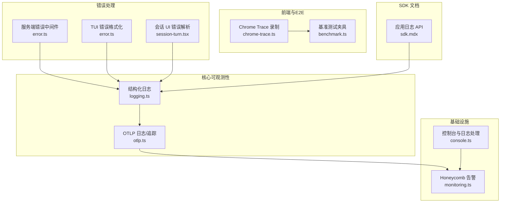
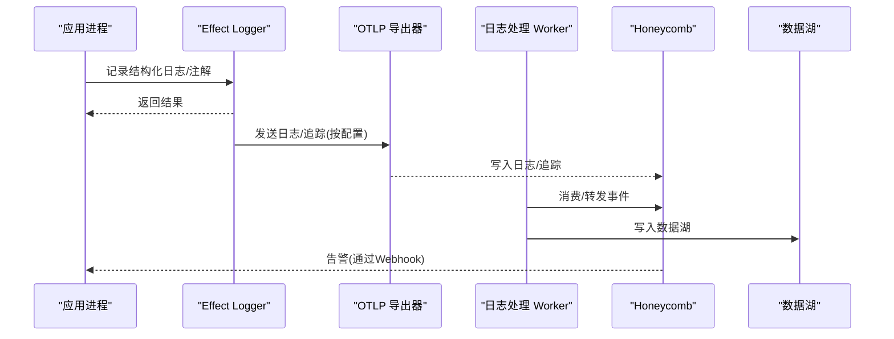
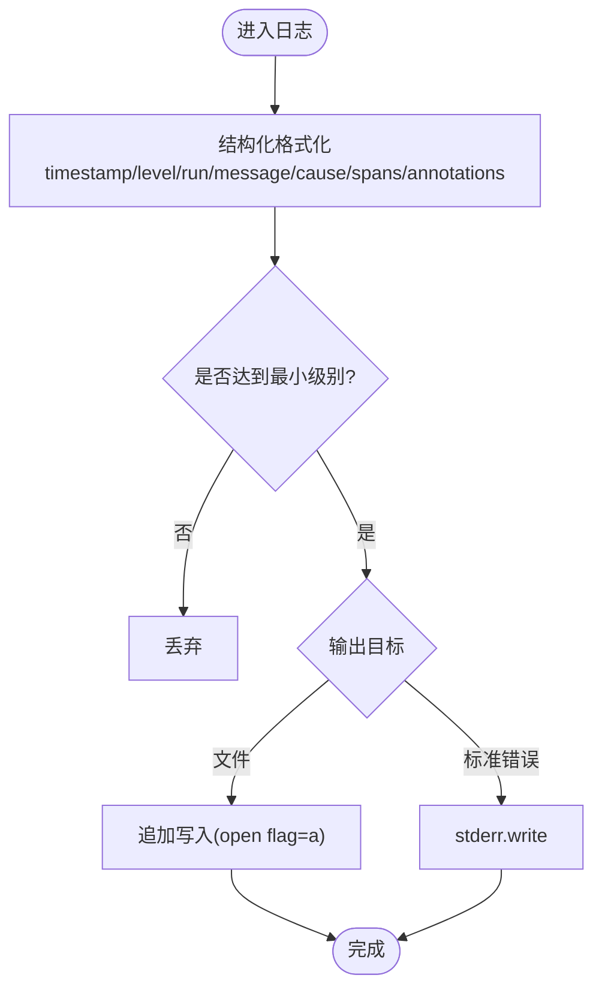
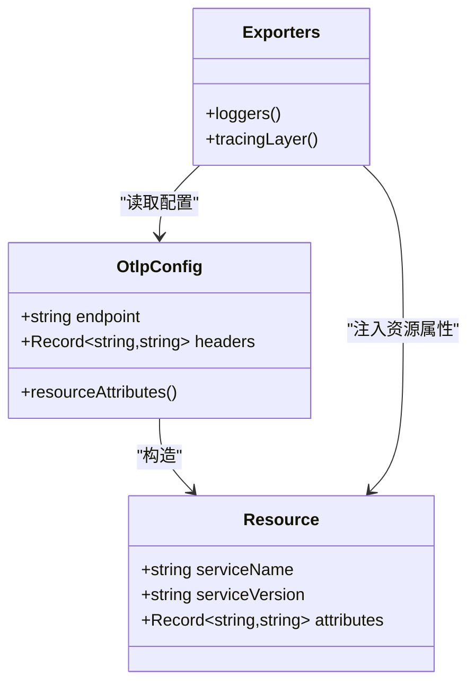
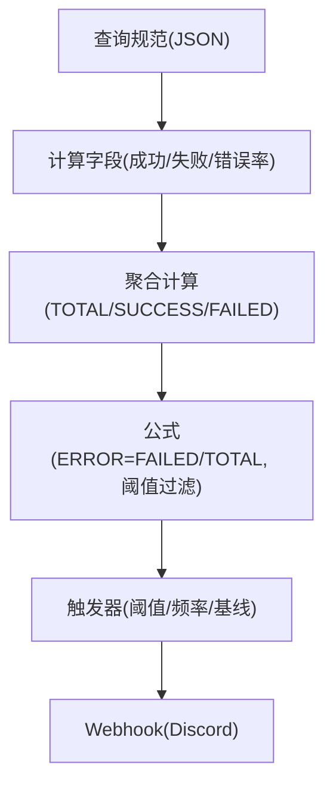
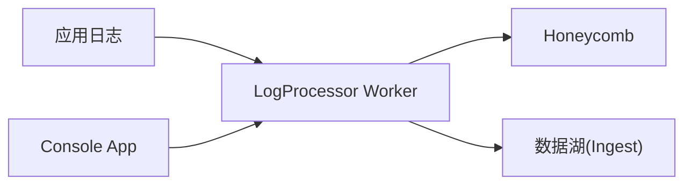
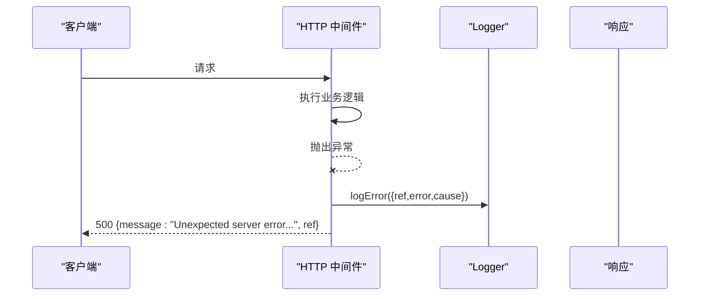
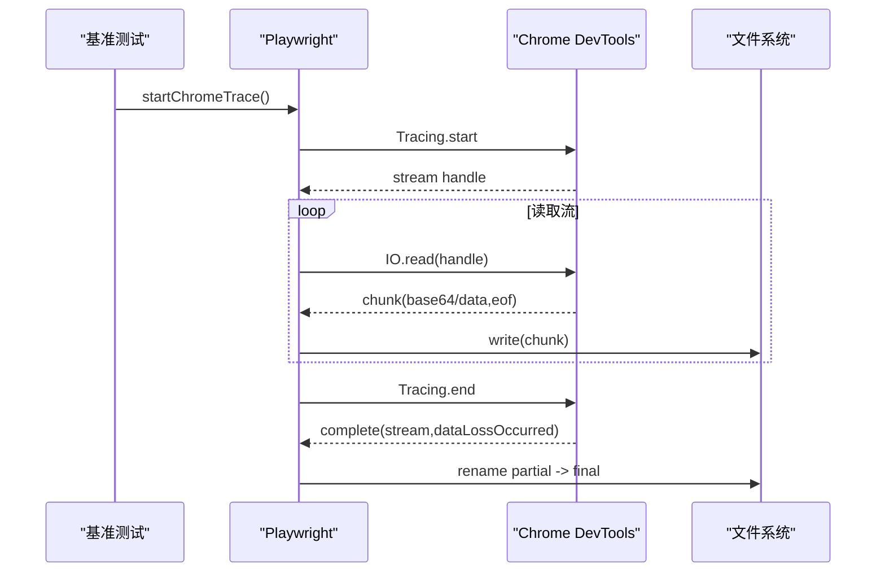
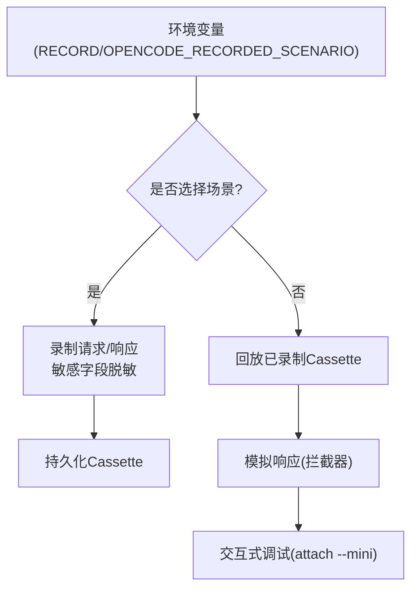
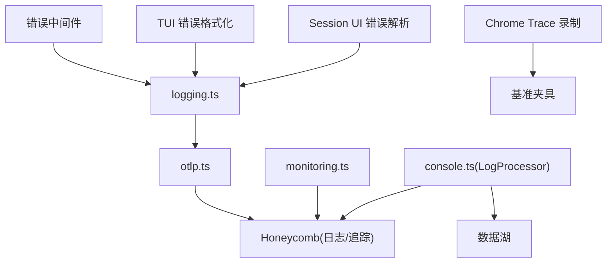

# 调试与监控系统

<cite>
**本文引用的文件**   
- [packages/core/src/observability/logging.ts](file://packages/core/src/observability/logging.ts)
- [packages/core/src/observability/otlp.ts](file://packages/core/src/observability/otlp.ts)
- [infra/monitoring.ts](file://infra/monitoring.ts)
- [infra/console.ts](file://infra/console.ts)
- [packages/opencode/src/server/routes/instance/httpapi/middleware/error.ts](file://packages/opencode/src/server/routes/instance/httpapi/middleware/error.ts)
- [packages/app/e2e/performance/chrome-trace.ts](file://packages/app/e2e/performance/chrome-trace.ts)
- [packages/app/e2e/performance/benchmark.ts](file://packages/app/e2e/performance/benchmark.ts)
- [packages/tui/src/util/error.ts](file://packages/tui/src/util/error.ts)
- [packages/session-ui/src/components/session-turn.tsx](file://packages/session-ui/src/components/session-turn.tsx)
- [packages/web/src/content/docs/sdk.mdx](file://packages/web/src/content/docs/sdk.mdx)
</cite>

## 目录
1. [简介](#简介)
2. [项目结构](#项目结构)
3. [核心组件](#核心组件)
4. [架构总览](#架构总览)
5. [详细组件分析](#详细组件分析)
6. [依赖关系分析](#依赖关系分析)
7. [性能考量](#性能考量)
8. [故障排查指南](#故障排查指南)
9. [结论](#结论)
10. [附录](#附录)

## 简介
本文件面向 AI 集成场景的调试与监控，系统化说明日志记录策略（结构化日志、级别管理、敏感信息脱敏）、性能指标采集（请求延迟、吞吐、错误率、资源使用）、分布式追踪（链路跟踪、采样与可视化）、调试工具集（请求回放、模拟响应、交互式调试）以及监控仪表板配置（关键指标、告警规则、报告生成），并给出问题诊断流程与常见故障排除建议。

## 项目结构
本项目在多个包中提供可观测性与调试能力：
- 核心可观测性：结构化日志、OTLP 日志与追踪导出、资源属性注入
- 基础设施：Honeycomb 告警与 Webhook、日志处理 Worker、控制台应用
- 前端与 E2E：Chrome Trace 录制与分析、基准测试夹具
- 错误处理与格式化：服务端错误中间件、TUI 错误格式化、会话 UI 错误解析
- SDK 文档：应用日志写入 API

**图表来源** 
- [packages/core/src/observability/logging.ts:1-72](file://packages/core/src/observability/logging.ts#L1-L72)
- [packages/core/src/observability/otlp.ts:1-80](file://packages/core/src/observability/otlp.ts#L1-L80)
- [infra/monitoring.ts:1-288](file://infra/monitoring.ts#L1-L288)
- [infra/console.ts:228-308](file://infra/console.ts#L228-L308)
- [packages/app/e2e/performance/chrome-trace.ts:49-95](file://packages/app/e2e/performance/chrome-trace.ts#L49-L95)
- [packages/app/e2e/performance/benchmark.ts:1-15](file://packages/app/e2e/performance/benchmark.ts#L1-L15)
- [packages/opencode/src/server/routes/instance/httpapi/middleware/error.ts:28-43](file://packages/opencode/src/server/routes/instance/httpapi/middleware/error.ts#L28-L43)
- [packages/tui/src/util/error.ts:97-182](file://packages/tui/src/util/error.ts#L97-L182)
- [packages/session-ui/src/components/session-turn.tsx:29-80](file://packages/session-ui/src/components/session-turn.tsx#L29-L80)
- [packages/web/src/content/docs/sdk.mdx:183-234](file://packages/web/src/content/docs/sdk.mdx#L183-L234)

**章节来源**
- [packages/core/src/observability/logging.ts:1-72](file://packages/core/src/observability/logging.ts#L1-L72)
- [packages/core/src/observability/otlp.ts:1-80](file://packages/core/src/observability/otlp.ts#L1-L80)
- [infra/monitoring.ts:1-288](file://infra/monitoring.ts#L1-L288)
- [infra/console.ts:228-308](file://infra/console.ts#L228-L308)
- [packages/app/e2e/performance/chrome-trace.ts:49-95](file://packages/app/e2e/performance/chrome-trace.ts#L49-L95)
- [packages/app/e2e/performance/benchmark.ts:1-15](file://packages/app/e2e/performance/benchmark.ts#L1-L15)
- [packages/opencode/src/server/routes/instance/httpapi/middleware/error.ts:28-43](file://packages/opencode/src/server/routes/instance/httpapi/middleware/error.ts#L28-L43)
- [packages/tui/src/util/error.ts:97-182](file://packages/tui/src/util/error.ts#L97-L182)
- [packages/session-ui/src/components/session-turn.tsx:29-80](file://packages/session-ui/src/components/session-turn.tsx#L29-L80)
- [packages/web/src/content/docs/sdk.mdx:183-234](file://packages/web/src/content/docs/sdk.mdx#L183-L234)

## 核心组件
- 结构化日志与级别管理：基于 Effect Logger，输出扁平化键值对日志，支持文件与标准错误双通道；通过环境变量控制最小日志级别。
- OTLP 日志与追踪：根据端点与环境变量动态启用 OTLP 日志与追踪导出，注入服务名、版本、运行 ID、客户端类型等资源属性。
- Honeycomb 告警：以代码定义查询与触发器，覆盖模型 HTTP 错误率、提供者错误率、低 TPS、免费层请求激增等。
- 日志处理管道：Cloudflare Worker 作为日志处理器，接入 Honeycomb 与数据湖。
- 错误处理与格式化：服务端统一错误中间件生成引用 ID 并记录堆栈；TUI 与 Session UI 提供错误消息提取与格式化。
- 性能录制与分析：Playwright + Chrome DevTools Protocol 录制 trace，辅助定位渲染与网络瓶颈。
- SDK 日志写入：通过 SDK 暴露 app.log 接口写入结构化日志。

**章节来源**
- [packages/core/src/observability/logging.ts:1-72](file://packages/core/src/observability/logging.ts#L1-L72)
- [packages/core/src/observability/otlp.ts:1-80](file://packages/core/src/observability/otlp.ts#L1-L80)
- [infra/monitoring.ts:1-288](file://infra/monitoring.ts#L1-L288)
- [infra/console.ts:228-308](file://infra/console.ts#L228-L308)
- [packages/opencode/src/server/routes/instance/httpapi/middleware/error.ts:28-43](file://packages/opencode/src/server/routes/instance/httpapi/middleware/error.ts#L28-L43)
- [packages/tui/src/util/error.ts:97-182](file://packages/tui/src/util/error.ts#L97-L182)
- [packages/session-ui/src/components/session-turn.tsx:29-80](file://packages/session-ui/src/components/session-turn.tsx#L29-L80)
- [packages/app/e2e/performance/chrome-trace.ts:49-95](file://packages/app/e2e/performance/chrome-trace.ts#L49-L95)
- [packages/app/e2e/performance/benchmark.ts:1-15](file://packages/app/e2e/performance/benchmark.ts#L1-L15)
- [packages/web/src/content/docs/sdk.mdx:183-234](file://packages/web/src/content/docs/sdk.mdx#L183-L234)

## 架构总览
下图展示了从应用日志到外部可观测性平台的关键路径：应用内结构化日志与追踪经 OTLP 导出至后端，日志处理 Worker 将事件投递至 Honeycomb 与数据湖；Honeycomb 触发器驱动告警并通过 Webhook 通知。

**图表来源** 
- [packages/core/src/observability/logging.ts:1-72](file://packages/core/src/observability/logging.ts#L1-L72)
- [packages/core/src/observability/otlp.ts:1-80](file://packages/core/src/observability/otlp.ts#L1-L80)
- [infra/console.ts:228-308](file://infra/console.ts#L228-L308)
- [infra/monitoring.ts:1-288](file://infra/monitoring.ts#L1-L288)

## 详细组件分析

### 结构化日志与级别管理
- 输出格式：扁平化的 key=value 行，包含时间戳、级别、run 标识、消息、cause、spans、annotations 等字段，避免嵌套 JSON 导致解析困难。
- 级别控制：通过环境变量设置最小级别，默认 INFO，支持 DEBUG/INFO/WARN/ERROR。
- 输出目标：默认写入文件，可选同时输出到 stderr（受环境变量控制）。
- 并发安全：文件写入采用批处理窗口，避免高空闲 CPU 占用。

**图表来源** 
- [packages/core/src/observability/logging.ts:1-72](file://packages/core/src/observability/logging.ts#L1-L72)

**章节来源**
- [packages/core/src/observability/logging.ts:1-72](file://packages/core/src/observability/logging.ts#L1-L72)

### OTLP 日志与分布式追踪
- 条件启用：当配置了 OTLP 端点时启用日志与追踪导出。
- 资源属性：自动注入 service.name、service.version、deployment.environment.name、opencode.client、opencode.run、service.instance.id 等，并可合并 OTEL_RESOURCE_ATTRIBUTES。
- 追踪上下文：注册 AsyncLocalStorageContextManager，确保 AI SDK 创建的 span 能正确父子关联。
- 导出目标：日志 /v1/logs，追踪 /v1/traces，支持自定义 headers。

**图表来源** 
- [packages/core/src/observability/otlp.ts:1-80](file://packages/core/src/observability/otlp.ts#L1-L80)

**章节来源**
- [packages/core/src/observability/otlp.ts:1-80](file://packages/core/src/observability/otlp.ts#L1-L80)

### Honeycomb 告警与仪表板
- 告警类型：
  - 模型 HTTP 错误率（区分 Go/Zen 产品线）
  - 提供者 HTTP 错误率
  - 模型低 TPS（P50 输出速率）
  - 免费层请求量激增
- 计算字段：通过表达式动态计算成功/失败状态与错误率，避免静态名称导致的缓存陈旧问题。
- 通知渠道：Discord Webhook，模板中包含 URL、类型、名称、状态、分组等信息。

**图表来源** 
- [infra/monitoring.ts:1-288](file://infra/monitoring.ts#L1-L288)

**章节来源**
- [infra/monitoring.ts:1-288](file://infra/monitoring.ts#L1-L288)

### 日志处理管道
- Cloudflare Worker 作为日志处理器，链接 Honeycomb API Key 与数据湖 Ingest。
- Console 应用通过 Tail Consumers 消费 Worker 日志，便于集中查看与审计。

**图表来源** 
- [infra/console.ts:228-308](file://infra/console.ts#L228-L308)

**章节来源**
- [infra/console.ts:228-308](file://infra/console.ts#L228-L308)

### 错误处理与格式化
- 服务端中间件：捕获未处理异常，生成唯一 ref 并记录结构化错误日志，返回统一未知错误响应。
- TUI 错误格式化：兼容 Error 实例、对象、无枚举属性的“不透明”错误，避免输出无用空对象。
- 会话 UI 错误解析：从字符串或 JSON 中提取 message/type/code，提升可读性。

**图表来源** 
- [packages/opencode/src/server/routes/instance/httpapi/middleware/error.ts:28-43](file://packages/opencode/src/server/routes/instance/httpapi/middleware/error.ts#L28-L43)

**章节来源**
- [packages/opencode/src/server/routes/instance/httpapi/middleware/error.ts:28-43](file://packages/opencode/src/server/routes/instance/httpapi/middleware/error.ts#L28-L43)
- [packages/tui/src/util/error.ts:97-182](file://packages/tui/src/util/error.ts#L97-L182)
- [packages/session-ui/src/components/session-turn.tsx:29-80](file://packages/session-ui/src/components/session-turn.tsx#L29-L80)

### 性能指标与 Chrome Trace 录制
- 录制方式：通过 Playwright 与 Chrome DevTools Protocol 启动 Tracing，捕获 IO 流并落盘为 JSON。
- 基准夹具：提供 report/reportState 钩子，便于在测试中收集指标与上下文。
- 典型指标：导航列表、停止函数、trace 文件名生成策略（含 runID、name、hash、nonce、selectors 标记）。

**图表来源** 
- [packages/app/e2e/performance/chrome-trace.ts:49-95](file://packages/app/e2e/performance/chrome-trace.ts#L49-L95)
- [packages/app/e2e/performance/benchmark.ts:1-15](file://packages/app/e2e/performance/benchmark.ts#L1-L15)

**章节来源**
- [packages/app/e2e/performance/chrome-trace.ts:49-95](file://packages/app/e2e/performance/chrome-trace.ts#L49-L95)
- [packages/app/e2e/performance/benchmark.ts:1-15](file://packages/app/e2e/performance/benchmark.ts#L1-L15)

### 调试工具集（请求回放、模拟响应、交互式调试）
- 请求回放：通过环境变量 RECORD 与 OPENCODE_RECORDED_SCENARIO 控制录制与选择场景；录制体内容会进行敏感字段脱敏（如 token、safety_identifier 等）。
- 模拟响应：测试中使用 HttpClient 拦截器构造 Response，用于 OpenAPI 生成与用例验证。
- 交互式调试：CLI attach 命令支持 mini 模式下的 replay/replayLimit 参数，便于快速复现与定位问题。

**图表来源** 
- [packages/opencode/test/session/llm-native-recorded.test.ts:209-238](file://packages/opencode/test/session/llm-native-recorded.test.ts#L209-L238)
- [packages/codemode/test/openapi.test.ts:31-60](file://packages/codemode/test/openapi.test.ts#L31-L60)
- [packages/opencode/src/cli/cmd/attach.ts:70-115](file://packages/opencode/src/cli/cmd/attach.ts#L70-L115)

**章节来源**
- [packages/opencode/test/session/llm-native-recorded.test.ts:209-238](file://packages/opencode/test/session/llm-native-recorded.test.ts#L209-L238)
- [packages/codemode/test/openapi.test.ts:31-60](file://packages/codemode/test/openapi.test.ts#L31-L60)
- [packages/opencode/src/cli/cmd/attach.ts:70-115](file://packages/opencode/src/cli/cmd/attach.ts#L70-L115)

### 监控仪表板与报告
- 关键指标：模型/提供者 HTTP 错误率、TPS（P50）、免费层请求量、成本与用量统计（在 stats 模块中体现）。
- 告警规则：基于 Honeycomb 查询与触发器，按产品维度与时间范围评估，阈值与频率可调。
- 报告生成：Console 与 Stats 应用提供图表与汇总视图，便于定期复盘。

**章节来源**
- [infra/monitoring.ts:1-288](file://infra/monitoring.ts#L1-L288)
- [packages/stats/core/src/domain/inference.ts:39-49](file://packages/stats/core/src/domain/inference.ts#L39-L49)
- [packages/stats/core/src/honeycomb-backfill.ts:837-933](file://packages/stats/core/src/honeycomb-backfill.ts#L837-L933)
- [packages/stats/app/src/routes/[lab]/[model].tsx:1299-1323](file://packages/stats/app/src/routes/[lab]/[model].tsx#L1299-L1323)

### SDK 日志写入
- 通过 SDK 暴露 app.log 方法，支持传入 service、level、message 等字段，便于在业务侧写入结构化日志。

**章节来源**
- [packages/web/src/content/docs/sdk.mdx:183-234](file://packages/web/src/content/docs/sdk.mdx#L183-L234)

## 依赖关系分析
- 组件耦合：
  - logging.ts 与 otlp.ts 共同构成可观测性基础层，前者负责本地输出，后者负责远端导出。
  - monitoring.ts 依赖 Honeycomb 提供商，定义查询与触发器，与 console.ts 中的日志处理 Worker 协同。
  - 错误处理中间件与 TUI/Session UI 的错误格式化相互补充，保证端到端错误可见性。
  - E2E 性能录制与基准夹具为性能回归提供自动化支撑。
- 外部依赖：
  - Effect Logger/Observability、OpenTelemetry SDK、Honeycomb Terraform Provider、Cloudflare Workers、AWS S3/Lake 等。

**图表来源** 
- [packages/core/src/observability/logging.ts:1-72](file://packages/core/src/observability/logging.ts#L1-L72)
- [packages/core/src/observability/otlp.ts:1-80](file://packages/core/src/observability/otlp.ts#L1-L80)
- [infra/monitoring.ts:1-288](file://infra/monitoring.ts#L1-L288)
- [infra/console.ts:228-308](file://infra/console.ts#L228-L308)
- [packages/opencode/src/server/routes/instance/httpapi/middleware/error.ts:28-43](file://packages/opencode/src/server/routes/instance/httpapi/middleware/error.ts#L28-L43)
- [packages/tui/src/util/error.ts:97-182](file://packages/tui/src/util/error.ts#L97-L182)
- [packages/session-ui/src/components/session-turn.tsx:29-80](file://packages/session-ui/src/components/session-turn.tsx#L29-L80)
- [packages/app/e2e/performance/chrome-trace.ts:49-95](file://packages/app/e2e/performance/chrome-trace.ts#L49-L95)
- [packages/app/e2e/performance/benchmark.ts:1-15](file://packages/app/e2e/performance/benchmark.ts#L1-L15)

**章节来源**
- [packages/core/src/observability/logging.ts:1-72](file://packages/core/src/observability/logging.ts#L1-L72)
- [packages/core/src/observability/otlp.ts:1-80](file://packages/core/src/observability/otlp.ts#L1-L80)
- [infra/monitoring.ts:1-288](file://infra/monitoring.ts#L1-L288)
- [infra/console.ts:228-308](file://infra/console.ts#L228-L308)
- [packages/opencode/src/server/routes/instance/httpapi/middleware/error.ts:28-43](file://packages/opencode/src/server/routes/instance/httpapi/middleware/error.ts#L28-L43)
- [packages/tui/src/util/error.ts:97-182](file://packages/tui/src/util/error.ts#L97-L182)
- [packages/session-ui/src/components/session-turn.tsx:29-80](file://packages/session-ui/src/components/session-turn.tsx#L29-L80)
- [packages/app/e2e/performance/chrome-trace.ts:49-95](file://packages/app/e2e/performance/chrome-trace.ts#L49-L95)
- [packages/app/e2e/performance/benchmark.ts:1-15](file://packages/app/e2e/performance/benchmark.ts#L1-L15)

## 性能考量
- 日志批处理：避免将 batchWindow 设为 0，防止空闲 CPU 升高。
- 追踪采样：使用 BatchSpanProcessor 批量导出，降低网络开销。
- Trace 录制：仅在需要时开启，避免影响主流程性能。
- 告警频率：合理设置 frequency 与阈值，减少误报与噪音。

[本节为通用指导，无需特定文件来源]

## 故障排查指南
- 无法导出日志/追踪：
  - 检查 OTEL_EXPORTER_OTLP_ENDPOINT 与 OTEL_EXPORTER_OTLP_HEADERS 配置是否正确。
  - 确认 resourceAttributes 解析是否成功（OTEL_RESOURCE_ATTRIBUTES 格式需符合 key=value 且支持 %2F/%3D 编码）。
- 日志缺失或级别过高：
  - 检查 OPENCODE_LOG_LEVEL 与 OPENCODE_PRINT_LOGS 环境变量。
  - 确认文件写入权限与磁盘空间。
- 告警未触发：
  - 核对 Honeycomb 查询与计算字段表达式，确认时间范围与过滤条件。
  - 检查 Webhook 地址与密钥配置。
- 错误信息不可读：
  - 使用 TUI 错误格式化与 Session UI 错误解析工具，提取 message/type/code。
  - 在服务端中间件中查找 ref 并在日志中检索对应条目。
- 性能问题定位：
  - 使用 Chrome Trace 录制与基准夹具，分析导航、IO 与渲染耗时。
  - 结合 Honeycomb 错误率与 TPS 指标，定位瓶颈。

**章节来源**
- [packages/core/src/observability/otlp.ts:1-80](file://packages/core/src/observability/otlp.ts#L1-L80)
- [packages/core/src/observability/logging.ts:1-72](file://packages/core/src/observability/logging.ts#L1-L72)
- [infra/monitoring.ts:1-288](file://infra/monitoring.ts#L1-L288)
- [packages/tui/src/util/error.ts:97-182](file://packages/tui/src/util/error.ts#L97-L182)
- [packages/session-ui/src/components/session-turn.tsx:29-80](file://packages/session-ui/src/components/session-turn.tsx#L29-L80)
- [packages/app/e2e/performance/chrome-trace.ts:49-95](file://packages/app/e2e/performance/chrome-trace.ts#L49-L95)

## 结论
本项目提供了完善的 AI 集成调试与监控能力：结构化日志与 OTLP 导出确保可观测性；Honeycomb 告警与日志处理 Worker 构建起稳定的监控闭环；错误处理与格式化提升排障效率；Chrome Trace 与基准夹具为性能回归保驾护航。建议在生产环境严格配置日志级别与告警阈值，结合 Trace 与指标进行持续优化。

[本节为总结，无需特定文件来源]

## 附录
- 环境变量参考：
  - OPENCODE_LOG_LEVEL：最小日志级别（DEBUG/INFO/WARN/ERROR）
  - OPENCODE_PRINT_LOGS：是否同时输出到 stderr
  - OTEL_EXPORTER_OTLP_ENDPOINT：OTLP 端点
  - OTEL_EXPORTER_OTLP_HEADERS：OTLP 请求头
  - OTEL_RESOURCE_ATTRIBUTES：资源属性（key=value，支持 URL 编码）
- 常用命令：
  - CLI attach --mini：进入迷你模式进行交互式调试与回放
  - 基准测试：通过 Playwright 夹具启动 Chrome Trace 录制

[本节为补充信息，无需特定文件来源]