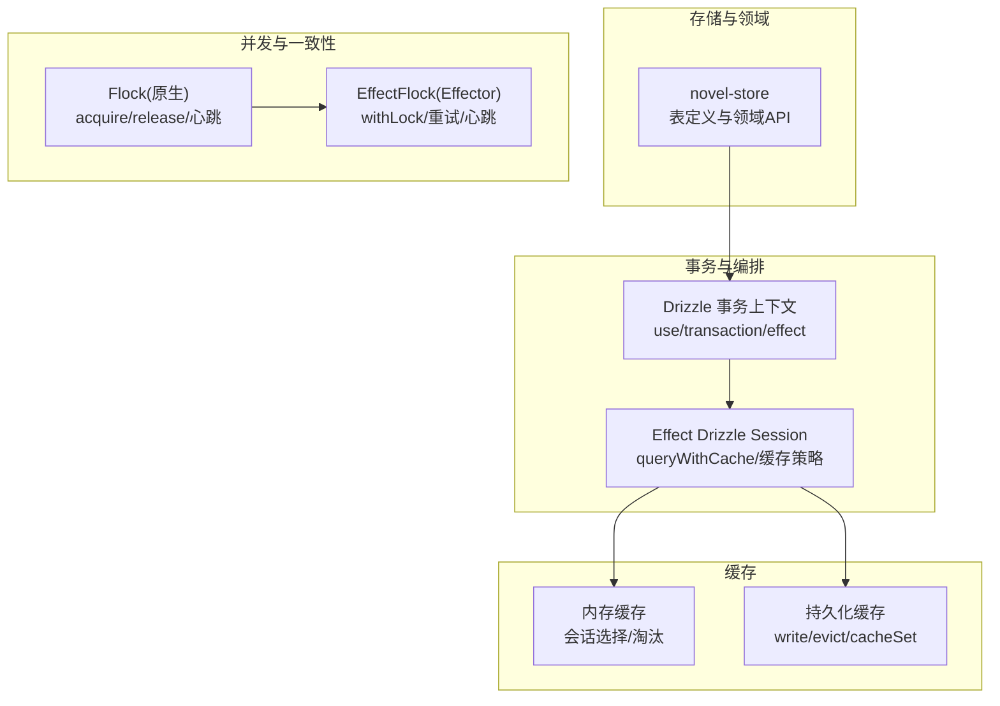
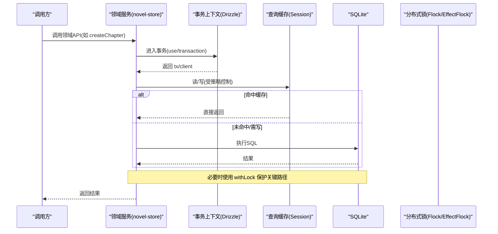
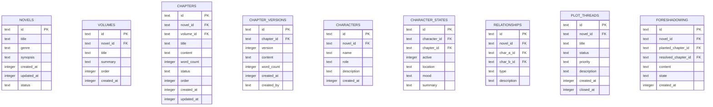
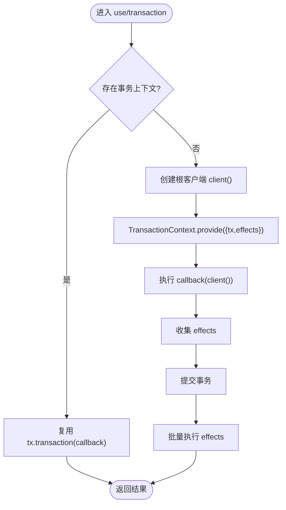
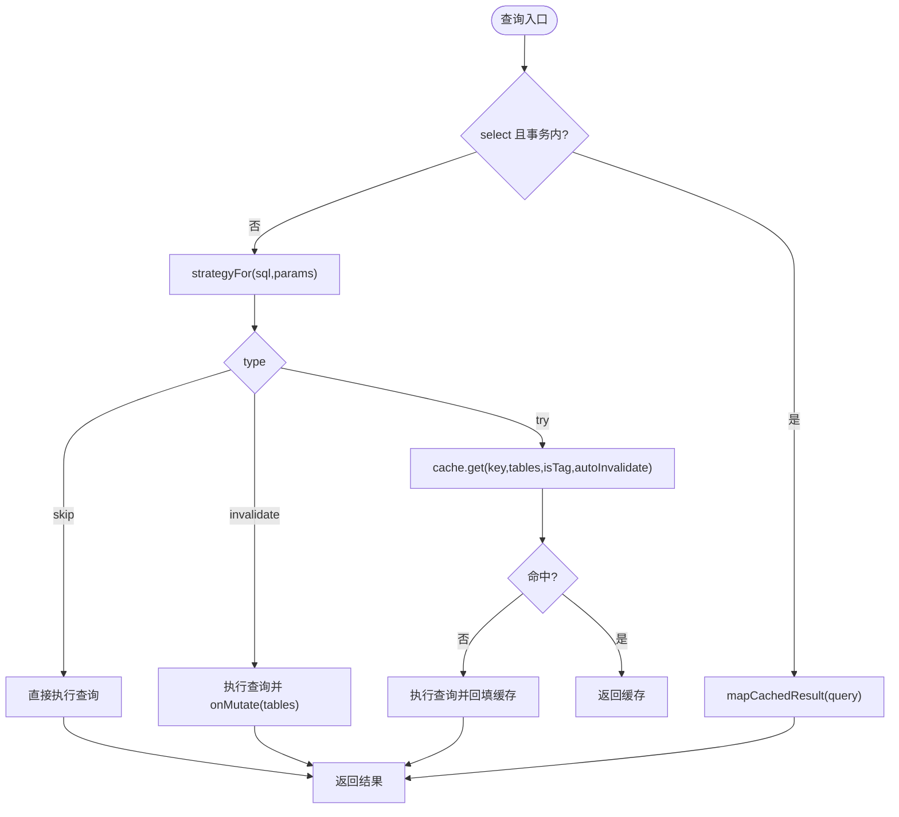
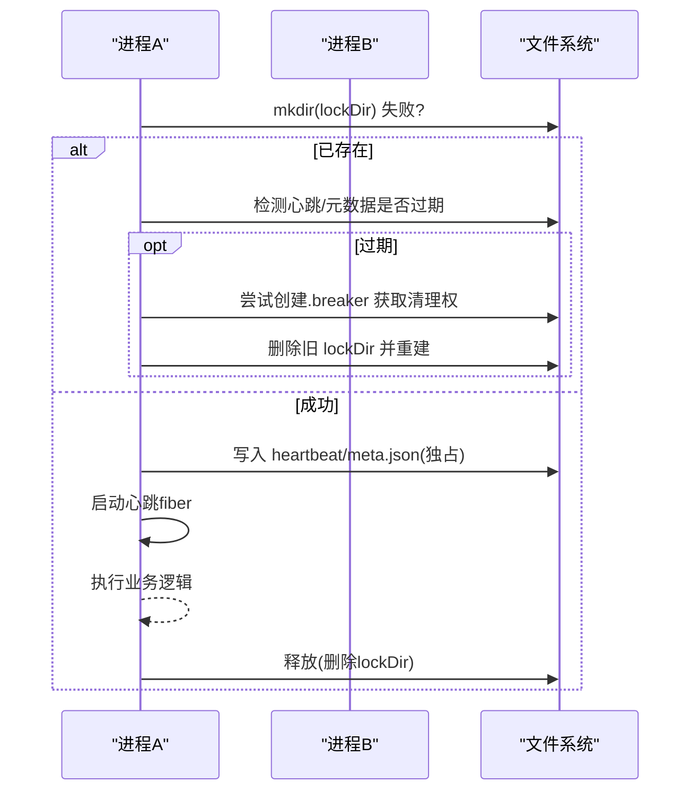
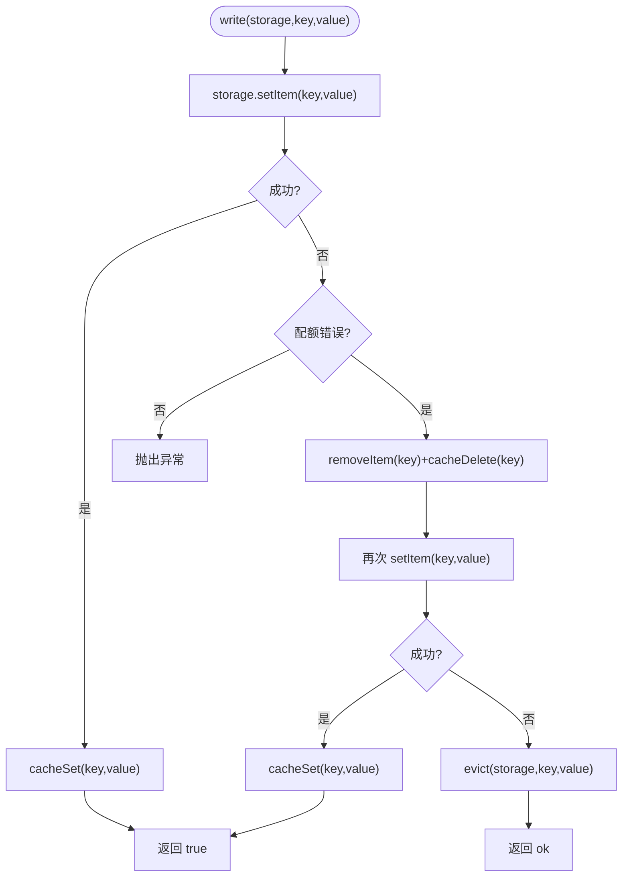
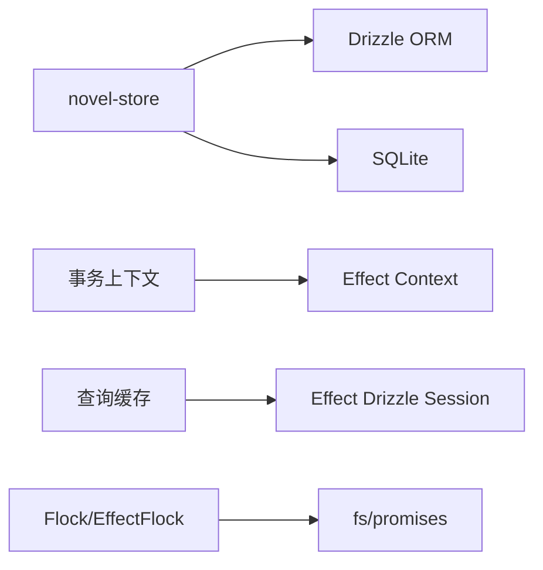

# 业务逻辑层

<cite>
**本文引用的文件**   
- [packages/novel-store/src/index.ts](file://packages/novel-store/src/index.ts)
- [packages/console/core/src/drizzle/index.ts](file://packages/console/core/src/drizzle/index.ts)
- [packages/effect-drizzle-sqlite/src/sqlite-core/effect/session.ts](file://packages/effect-drizzle-sqlite/src/sqlite-core/effect/session.ts)
- [packages/core/src/util/flock.ts](file://packages/core/src/util/flock.ts)
- [packages/core/src/util/effect-flock.ts](file://packages/core/src/util/effect-flock.ts)
- [packages/app/src/context/global-sync/session-cache.ts](file://packages/app/src/context/global-sync/session-cache.ts)
- [packages/app/src/utils/persist.ts](file://packages/app/src/utils/persist.ts)
- [specs/storage/effect-sqlite-package.md](file://specs/storage/effect-sqlite-package.md)
</cite>

## 目录
1. [简介](#简介)
2. [项目结构](#项目结构)
3. [核心组件](#核心组件)
4. [架构总览](#架构总览)
5. [详细组件分析](#详细组件分析)
6. [依赖关系分析](#依赖关系分析)
7. [性能考量](#性能考量)
8. [故障排查指南](#故障排查指南)
9. [结论](#结论)
10. [附录](#附录)

## 简介
本文件面向 openNovel 的业务逻辑层，聚焦服务层设计模式与小说创作核心流程。内容涵盖：
- 依赖注入、接口抽象与事务管理
- 章节管理、角色关系维护与情节线索追踪
- 数据验证规则、业务约束与状态转换
- 缓存策略（内存缓存、Redis 集成点与失效机制）
- 并发控制、锁机制与分布式一致性保证
- 错误处理与重试策略最佳实践

## 项目结构
openNovel 的业务逻辑层以“存储模型 + 事务上下文 + 锁/缓存”为核心分层：
- 存储模型与领域 API：定义表结构与 CRUD/编排函数，位于 novel-store 包
- 事务与副作用编排：基于 Effect + Drizzle 的事务上下文，支持嵌套事务与提交后副作用
- 并发与一致性：文件系统级分布式锁（Flock/EffectFlock），心跳与过期清理
- 缓存：查询级缓存策略（按 SQL 与参数推导）、会话级内存缓存与持久化缓存

图表来源
- [packages/novel-store/src/index.ts:1-1023](file://packages/novel-store/src/index.ts#L1-L1023)
- [packages/console/core/src/drizzle/index.ts:31-85](file://packages/console/core/src/drizzle/index.ts#L31-L85)
- [packages/effect-drizzle-sqlite/src/sqlite-core/effect/session.ts:235-270](file://packages/effect-drizzle-sqlite/src/sqlite-core/effect/session.ts#L235-L270)
- [packages/core/src/util/flock.ts:1-200](file://packages/core/src/util/flock.ts#L1-L200)
- [packages/core/src/util/effect-flock.ts:1-285](file://packages/core/src/util/effect-flock.ts#L1-L285)
- [packages/app/src/context/global-sync/session-cache.ts:47-66](file://packages/app/src/context/global-sync/session-cache.ts#L47-L66)
- [packages/app/src/utils/persist.ts:140-198](file://packages/app/src/utils/persist.ts#L140-L198)

章节来源
- [packages/novel-store/src/index.ts:1-1023](file://packages/novel-store/src/index.ts#L1-L1023)
- [packages/console/core/src/drizzle/index.ts:31-85](file://packages/console/core/src/drizzle/index.ts#L31-L85)
- [packages/effect-drizzle-sqlite/src/sqlite-core/effect/session.ts:235-270](file://packages/effect-drizzle-sqlite/src/sqlite-core/effect/session.ts#L235-L270)
- [packages/core/src/util/flock.ts:1-200](file://packages/core/src/util/flock.ts#L1-L200)
- [packages/core/src/util/effect-flock.ts:1-285](file://packages/core/src/util/effect-flock.ts#L1-L285)
- [packages/app/src/context/global-sync/session-cache.ts:47-66](file://packages/app/src/context/global-sync/session-cache.ts#L47-L66)
- [packages/app/src/utils/persist.ts:140-198](file://packages/app/src/utils/persist.ts#L140-L198)

## 核心组件
- 存储模型与领域 API（novel-store）
  - 表定义：小说、卷、章节、版本、评审、角色、角色状态、关系、情节线索、伏笔、世界观、风格指南、张力日志、钩子轮换、实体引用、待更新队列、Saga 会话、描述历史等
  - 会话绑定：tagNovelSession/getNovelForSession/isNovelSession/resolveNovelForSession
  - 领域操作：create/update/delete 章节、卷、角色、关系、情节线索、伏笔、世界观、风格指南、张力点、章节评审等
- 事务与副作用（Drizzle + Effect）
  - use/transaction/effect：在 Effect Context 中提供当前事务或根客户端；在事务内排队副作用，提交后统一执行
- 查询缓存（Effect Drizzle Session）
  - queryWithCache：根据查询类型、是否事务、缓存配置决定 skip/invalidate/try 策略
- 并发锁（Flock/EffectFlock）
  - 基于文件系统的分布式锁，含心跳、过期清理、竞争断路器、指数退避重试
- 缓存（会话与持久化）
  - 会话缓存淘汰策略（pickSessionCacheEvictions）
  - 持久化写入回退与缓存同步（persist.write/cacheSet/cacheDelete）

章节来源
- [packages/novel-store/src/index.ts:17-336](file://packages/novel-store/src/index.ts#L17-L336)
- [packages/novel-store/src/index.ts:413-467](file://packages/novel-store/src/index.ts#L413-L467)
- [packages/novel-store/src/index.ts:473-1023](file://packages/novel-store/src/index.ts#L473-L1023)
- [packages/console/core/src/drizzle/index.ts:31-85](file://packages/console/core/src/drizzle/index.ts#L31-L85)
- [packages/effect-drizzle-sqlite/src/sqlite-core/effect/session.ts:235-270](file://packages/effect-drizzle-sqlite/src/sqlite-core/effect/session.ts#L235-L270)
- [packages/core/src/util/flock.ts:1-200](file://packages/core/src/util/flock.ts#L1-L200)
- [packages/core/src/util/effect-flock.ts:1-285](file://packages/core/src/util/effect-flock.ts#L1-L285)
- [packages/app/src/context/global-sync/session-cache.ts:47-66](file://packages/app/src/context/global-sync/session-cache.ts#L47-L66)
- [packages/app/src/utils/persist.ts:140-198](file://packages/app/src/utils/persist.ts#L140-L198)

## 架构总览
下图展示从调用方到存储、事务、缓存与锁的完整链路。

图表来源
- [packages/novel-store/src/index.ts:473-612](file://packages/novel-store/src/index.ts#L473-L612)
- [packages/console/core/src/drizzle/index.ts:31-85](file://packages/console/core/src/drizzle/index.ts#L31-L85)
- [packages/effect-drizzle-sqlite/src/sqlite-core/effect/session.ts:235-270](file://packages/effect-drizzle-sqlite/src/sqlite-core/effect/session.ts#L235-L270)
- [packages/core/src/util/flock.ts:284-358](file://packages/core/src/util/flock.ts#L284-L358)
- [packages/core/src/util/effect-flock.ts:212-285](file://packages/core/src/util/effect-flock.ts#L212-L285)

## 详细组件分析

### 存储模型与领域 API（novel-store）
- 表与索引
  - 小说、卷、章节、版本、评审、角色、角色状态、关系、情节线索、伏笔、世界观、风格指南、张力日志、钩子轮换、实体引用、待更新队列、Saga 会话、描述历史
  - 针对常用查询字段建立索引（如 chapter_reviews(chapter_id, round)、entity_refs(target/source) 等）
- 会话绑定与懒绑定
  - tagNovelSession：幂等标记会话与小说关联
  - resolveNovelForSession：若仅有一本小说则自动绑定
- 章节管理
  - createChapter/updateChapter/moveChapter/deleteChapter
  - moveChapter 支持 up/down 交换 order 与 to-volume 迁移
- 角色关系维护
  - createCharacter/updateCharacter/deleteCharacter
  - createRelationship/updateRelationship/deleteRelationship
  - CharacterState 记录每章活跃位置/情绪/摘要
- 情节线索追踪
  - PlotThread：标题/状态/优先级/描述，closed_at 自动设置
  - Foreshadowing：埋点/解决章节关联，state 流转
- 其他
  - StyleGuide 上写 tone/pov/tense/rules
  - TensionLog 记录张力点
  - ChapterReview 评审轮次自动推导

图表来源
- [packages/novel-store/src/index.ts:17-336](file://packages/novel-store/src/index.ts#L17-L336)

章节来源
- [packages/novel-store/src/index.ts:17-336](file://packages/novel-store/src/index.ts#L17-L336)
- [packages/novel-store/src/index.ts:473-1023](file://packages/novel-store/src/index.ts#L473-L1023)

### 事务管理与副作用编排（Drizzle + Effect）
- 事务上下文
  - use：若无事务上下文则创建根客户端并运行回调；若有则复用 tx.transaction
  - transaction：包裹 Effect 回调，提供 tx 与 effects 列表
  - effect：在事务内将副作用入队，提交后统一执行；非事务时立即执行
- 嵌套事务语义
  - 嵌套 use 内部可见当前 tx，避免重复连接
  - 副作用队列确保顺序性与原子性

图表来源
- [packages/console/core/src/drizzle/index.ts:31-85](file://packages/console/core/src/drizzle/index.ts#L31-L85)

章节来源
- [packages/console/core/src/drizzle/index.ts:31-85](file://packages/console/core/src/drizzle/index.ts#L31-L85)
- [specs/storage/effect-sqlite-package.md:58-99](file://specs/storage/effect-sqlite-package.md#L58-L99)

### 查询缓存策略（Effect Drizzle Session）
- 策略决策
  - 在事务内且为 select 时优先走缓存映射
  - 非事务时根据 SQL+参数推导策略：skip / invalidate / try
  - try 模式下先查缓存，未命中再执行查询并回填
- 失效机制
  - onMutate 触发表级失效，保证写后读一致

图表来源
- [packages/effect-drizzle-sqlite/src/sqlite-core/effect/session.ts:235-270](file://packages/effect-drizzle-sqlite/src/sqlite-core/effect/session.ts#L235-L270)

章节来源
- [packages/effect-drizzle-sqlite/src/sqlite-core/effect/session.ts:235-270](file://packages/effect-drizzle-sqlite/src/sqlite-core/effect/session.ts#L235-L270)

### 并发控制与分布式锁（Flock/EffectFlock）
- Flock（原生 Promise）
  - acquire：基于目录独占 + 元数据 + 心跳文件实现
  - withLock：with using 语义，自动释放
  - 指数退避 + jitter 重试，超时抛出错误
- EffectFlock（Effect）
  - withLock/acquire：Effect 版封装，支持 Scope 生命周期
  - 心跳 fiber 定期更新时间戳，防止误判过期
  - 竞争 breaker 目录协调过期清理，避免脑裂

图表来源
- [packages/core/src/util/flock.ts:148-200](file://packages/core/src/util/flock.ts#L148-L200)
- [packages/core/src/util/effect-flock.ts:169-228](file://packages/core/src/util/effect-flock.ts#L169-L228)

章节来源
- [packages/core/src/util/flock.ts:1-200](file://packages/core/src/util/flock.ts#L1-L200)
- [packages/core/src/util/effect-flock.ts:1-285](file://packages/core/src/util/effect-flock.ts#L1-L285)

### 缓存策略（内存缓存与持久化）
- 会话缓存淘汰
  - pickSessionCacheEvictions：保留 keep/preserve，按 seen 顺序淘汰至 limit
- 持久化缓存
  - write：写入 storage，成功后 cacheSet；配额不足时移除旧值并重试；最终 fallback 到 evict
  - snapshot/merge：深拷贝与默认值合并，保障数据结构稳定

图表来源
- [packages/app/src/context/global-sync/session-cache.ts:47-66](file://packages/app/src/context/global-sync/session-cache.ts#L47-L66)
- [packages/app/src/utils/persist.ts:140-198](file://packages/app/src/utils/persist.ts#L140-L198)

章节来源
- [packages/app/src/context/global-sync/session-cache.ts:47-66](file://packages/app/src/context/global-sync/session-cache.ts#L47-L66)
- [packages/app/src/utils/persist.ts:140-198](file://packages/app/src/utils/persist.ts#L140-L198)

## 依赖关系分析
- 模块耦合
  - novel-store 依赖 Drizzle ORM 与 SQLite 驱动，不持有 UI/Tool 注册逻辑，职责单一
  - 事务上下文通过 Effect Context 解耦，上层无需感知底层连接细节
  - 缓存策略由 session 层统一决策，对领域透明
  - 锁服务通过 Layer/Global 注入，避免全局状态污染
- 外部依赖
  - SQLite（本地文件数据库）
  - Effect（并发/资源管理/上下文）
  - fs/promises（锁实现）

图表来源
- [packages/novel-store/src/index.ts:1-1023](file://packages/novel-store/src/index.ts#L1-L1023)
- [packages/console/core/src/drizzle/index.ts:31-85](file://packages/console/core/src/drizzle/index.ts#L31-L85)
- [packages/effect-drizzle-sqlite/src/sqlite-core/effect/session.ts:235-270](file://packages/effect-drizzle-sqlite/src/sqlite-core/effect/session.ts#L235-L270)
- [packages/core/src/util/flock.ts:1-200](file://packages/core/src/util/flock.ts#L1-L200)
- [packages/core/src/util/effect-flock.ts:1-285](file://packages/core/src/util/effect-flock.ts#L1-L285)

章节来源
- [packages/novel-store/src/index.ts:1-1023](file://packages/novel-store/src/index.ts#L1-L1023)
- [packages/console/core/src/drizzle/index.ts:31-85](file://packages/console/core/src/drizzle/index.ts#L31-L85)
- [packages/effect-drizzle-sqlite/src/sqlite-core/effect/session.ts:235-270](file://packages/effect-drizzle-sqlite/src/sqlite-core/effect/session.ts#L235-L270)
- [packages/core/src/util/flock.ts:1-200](file://packages/core/src/util/flock.ts#L1-L200)
- [packages/core/src/util/effect-flock.ts:1-285](file://packages/core/src/util/effect-flock.ts#L1-L285)

## 性能考量
- 查询缓存
  - 事务内 select 直接走映射，减少重复解析
  - 非事务 try 模式降低冷启动 IO 压力
- 锁优化
  - 指数退避 + jitter 避免惊群
  - 心跳间隔与 STALE_MS 平衡稳定性与恢复速度
- 存储
  - SQLite 单文件隔离，适合单机多项目场景
  - 合理索引减少全表扫描（评审、实体引用、待更新队列等）

[本节为通用指导，不直接分析具体文件]

## 故障排查指南
- 事务相关
  - 现象：副作用未执行或顺序错乱
  - 排查：确认是否在事务内使用 effect 入队；检查 nested use 是否复用 tx
- 缓存相关
  - 现象：写后读不一致
  - 排查：确认 onMutate 是否被触发；检查 strategyFor 推导是否正确
- 锁相关
  - 现象：锁超时或死锁
  - 排查：查看心跳/元数据时间戳；确认 breaker 清理逻辑；检查超时与重试配置
- 持久化缓存
  - 现象：写入失败或容量不足
  - 排查：观察 quota 错误分支；确认 evict 策略是否生效

章节来源
- [packages/console/core/src/drizzle/index.ts:31-85](file://packages/console/core/src/drizzle/index.ts#L31-L85)
- [packages/effect-drizzle-sqlite/src/sqlite-core/effect/session.ts:235-270](file://packages/effect-drizzle-sqlite/src/sqlite-core/effect/session.ts#L235-L270)
- [packages/core/src/util/flock.ts:284-358](file://packages/core/src/util/flock.ts#L284-L358)
- [packages/core/src/util/effect-flock.ts:212-285](file://packages/core/src/util/effect-flock.ts#L212-L285)
- [packages/app/src/utils/persist.ts:140-198](file://packages/app/src/utils/persist.ts#L140-L198)

## 结论
openNovel 业务逻辑层通过清晰的领域 API、可组合的事务上下文、细粒度的查询缓存与稳健的分布式锁，实现了高内聚、低耦合的小说创作核心流程。建议在后续演进中：
- 引入 Redis 作为共享缓存层，配合 onMutate 事件进行跨进程失效
- 对热点写路径增加 Saga/补偿机制，提升复杂编排的可恢复性
- 完善监控指标（缓存命中率、锁等待时长、事务耗时）

[本节为总结性内容，不直接分析具体文件]

## 附录
- 术语
  - 事务上下文：Effect Context 提供的 tx/client 与副作用队列
  - 策略推导：根据 SQL 与参数推断缓存行为
  - 竞争断路器：用于安全清理过期锁的协调机制
- 参考规范
  - Effect SQLite 适配与事务语义约定见 specs

章节来源
- [specs/storage/effect-sqlite-package.md:58-99](file://specs/storage/effect-sqlite-package.md#L58-L99)