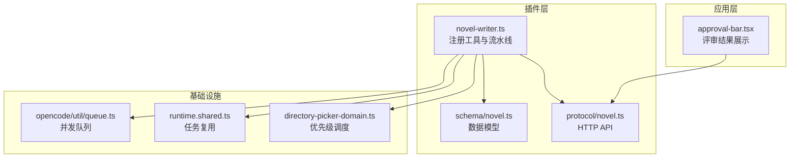
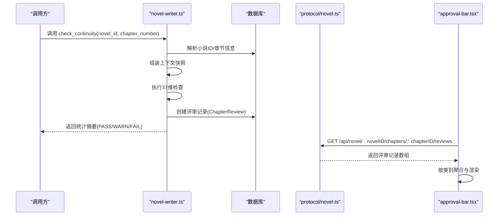
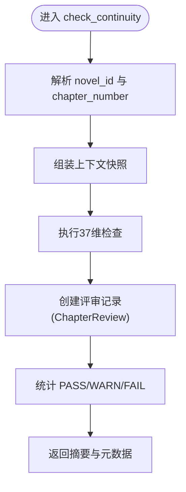
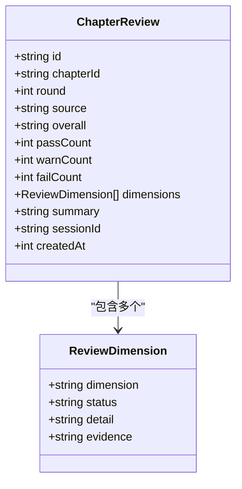
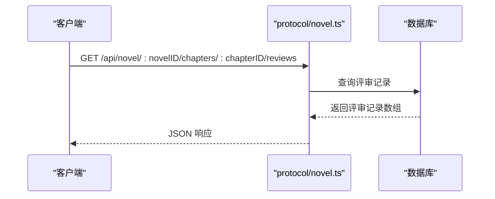
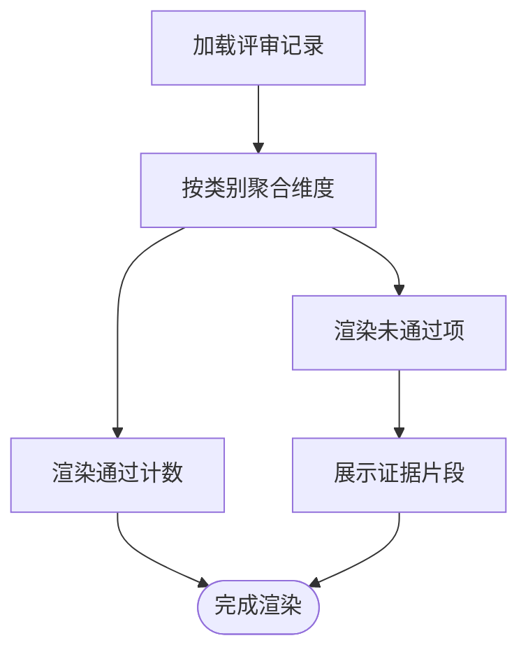
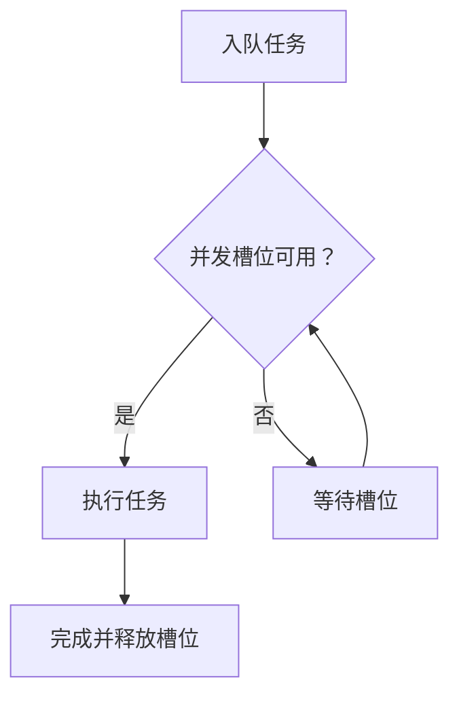
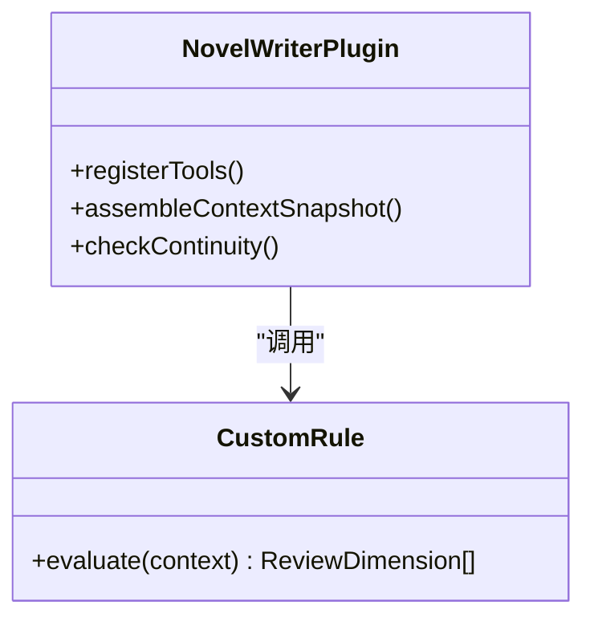
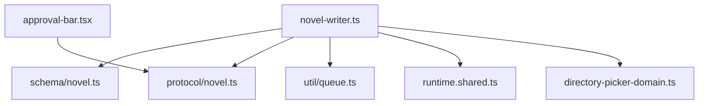

# 审查服务

<cite>
**本文引用的文件**   
- [packages/plugin/src/novel-writer.ts](file://packages/plugin/src/novel-writer.ts)
- [packages/schema/src/novel.ts](file://packages/schema/src/novel.ts)
- [packages/protocol/src/groups/novel.ts](file://packages/protocol/src/groups/novel.ts)
- [packages/app/src/pages/novel/approval-bar.tsx](file://packages/app/src/pages/novel/approval-bar.tsx)
- [packages/opencode/src/util/queue.ts](file://packages/opencode/src/util/queue.ts)
- [packages/opencode/src/cli/cmd/run/runtime.shared.ts](file://packages/opencode/src/cli/cmd/run/runtime.shared.ts)
- [packages/app/src/components/directory-picker-domain.ts](file://packages/app/src/components/directory-picker-domain.ts)
- [packages/plugin/test/novel-writer/review.test.ts](file://packages/plugin/test/novel-writer/review.test.ts)
</cite>

## 目录
1. [简介](#简介)
2. [项目结构](#项目结构)
3. [核心组件](#核心组件)
4. [架构总览](#架构总览)
5. [详细组件分析](#详细组件分析)
6. [依赖关系分析](#依赖关系分析)
7. [性能考量](#性能考量)
8. [故障排查指南](#故障排查指南)
9. [结论](#结论)
10. [附录](#附录)

## 简介
本文件为 openNovel 的“审查服务”提供系统化文档，重点阐述 37 维度连续性审查系统的实现与运行机制。内容涵盖：
- 审查规则的定义、加载与执行机制
- 审查任务的调度策略（异步处理、优先级管理、失败重试）
- 审查结果的分析与报告生成（问题分类、严重程度评估、改进建议）
- 自定义审查规则的扩展机制与插件化设计
- 审查配置管理与批量审查的 API 接口说明

该服务以插件形式集成于小说写作工作流中，通过工具调用触发确定性检查，将结果持久化为评审记录，并在前端进行可视化展示与交互。

## 项目结构
审查服务相关代码主要分布在以下包与模块：
- 插件层：负责注册写作工具、组装上下文快照、触发连续性检查并落库评审记录
- 协议层：定义 HTTP API 分组与端点，暴露章节评审查询等能力
- 数据模型层：定义评审维度、评审记录等数据结构
- 应用层：前端展示评审结果、按类别聚合显示、支持证据查看
- 通用队列与任务复用：支撑并发控制与任务去重

**图表来源** 
- [packages/plugin/src/novel-writer.ts](file://packages/plugin/src/novel-writer.ts)
- [packages/schema/src/novel.ts](file://packages/schema/src/novel.ts)
- [packages/protocol/src/groups/novel.ts](file://packages/protocol/src/groups/novel.ts)
- [packages/app/src/pages/novel/approval-bar.tsx](file://packages/app/src/pages/novel/approval-bar.tsx)
- [packages/opencode/src/util/queue.ts](file://packages/opencode/src/util/queue.ts)
- [packages/opencode/src/cli/cmd/run/runtime.shared.ts](file://packages/opencode/src/cli/cmd/run/runtime.shared.ts)
- [packages/app/src/components/directory-picker-domain.ts](file://packages/app/src/components/directory-picker-domain.ts)

**章节来源**
- [packages/plugin/src/novel-writer.ts](file://packages/plugin/src/novel-writer.ts)
- [packages/schema/src/novel.ts](file://packages/schema/src/novel.ts)
- [packages/protocol/src/groups/novel.ts](file://packages/protocol/src/groups/novel.ts)
- [packages/app/src/pages/novel/approval-bar.tsx](file://packages/app/src/pages/novel/approval-bar.tsx)
- [packages/opencode/src/util/queue.ts](file://packages/opencode/src/util/queue.ts)
- [packages/opencode/src/cli/cmd/run/runtime.shared.ts](file://packages/opencode/src/cli/cmd/run/runtime.shared.ts)
- [packages/app/src/components/directory-picker-domain.ts](file://packages/app/src/components/directory-picker-domain.ts)

## 核心组件
- 连续性检查工具 check_continuity
  - 作用：对当前章节执行 37 维确定性检查，汇总 PASS/WARN/FAIL 统计，并自动持久化评审记录
  - 关键行为：解析小说 ID 与章节序号，调用检查函数，写入评审记录，返回统计摘要
- 评审记录模型 ChapterReview 与 ReviewDimension
  - 字段：章节关联、轮次、来源（deterministic/auditor/human）、总体结论、各维度状态与证据、会话标识
- 评审查询 API chapter-reviews
  - 作用：按章节获取最新到旧的评审记录列表，便于前端渲染与历史对比
- 前端评审展示 approval-bar
  - 作用：按类别聚合维度结果，显示通过/警告/失败计数与证据片段

**章节来源**
- [packages/plugin/src/novel-writer.ts](file://packages/plugin/src/novel-writer.ts)
- [packages/schema/src/novel.ts](file://packages/schema/src/novel.ts)
- [packages/protocol/src/groups/novel.ts](file://packages/protocol/src/groups/novel.ts)
- [packages/app/src/pages/novel/approval-bar.tsx](file://packages/app/src/pages/novel/approval-bar.tsx)

## 架构总览
审查服务采用“工具驱动 + 数据模型 + API 暴露 + 前端展示”的分层架构。核心流程如下：
- 插件在写作流水线中暴露 check_continuity 工具
- 调用方传入 novel_id 与 chapter_number
- 插件组装上下文快照并执行 37 维检查
- 检查结果持久化为评审记录，附带来源与证据
- 前端通过 API 拉取评审记录并按类别渲染

**图表来源** 
- [packages/plugin/src/novel-writer.ts](file://packages/plugin/src/novel-writer.ts)
- [packages/protocol/src/groups/novel.ts](file://packages/protocol/src/groups/novel.ts)
- [packages/app/src/pages/novel/approval-bar.tsx](file://packages/app/src/pages/novel/approval-bar.tsx)

## 详细组件分析

### 连续性检查工具（check_continuity）
- 输入参数
  - novel_id：小说标识
  - chapter_number：章节序号
- 处理逻辑
  - 解析小说与章节信息
  - 组装上下文快照（角色、卷摘要、最近章节摘要、剧情线索、伏笔、风格指南、目标字数、前文结尾等）
  - 执行 37 维检查，得到 overall 与各维度 status/detail/evidence
  - 持久化评审记录（source=deterministic），并计算 PASS/WARN/FAIL 计数
- 输出
  - 文本摘要与元数据（overall、fail_count、warn_count）

**图表来源** 
- [packages/plugin/src/novel-writer.ts](file://packages/plugin/src/novel-writer.ts)

**章节来源**
- [packages/plugin/src/novel-writer.ts](file://packages/plugin/src/novel-writer.ts)

### 评审记录模型与数据流
- 数据模型
  - ReviewDimension：维度名称、状态（PASS/WARN/FAIL）、详情、可选证据
  - ChapterReview：章节关联、轮次、来源、总体结论、各维度数组、摘要、会话标识、时间戳
- 数据流
  - 检查完成后写入 ChapterReview 表
  - 前端通过 API 读取并按 round 与 source 区分历史记录

**图表来源** 
- [packages/schema/src/novel.ts](file://packages/schema/src/novel.ts)

**章节来源**
- [packages/schema/src/novel.ts](file://packages/schema/src/novel.ts)

### 评审查询 API（chapter-reviews）
- 端点
  - GET /api/novel/:novelID/chapters/:chapterID/reviews
- 功能
  - 返回指定章节的评审记录数组（最新在前）
  - 错误：章节不存在时返回 404
- 使用场景
  - 前端渲染评审面板、历史对比、审计追踪

**图表来源** 
- [packages/protocol/src/groups/novel.ts](file://packages/protocol/src/groups/novel.ts)

**章节来源**
- [packages/protocol/src/groups/novel.ts](file://packages/protocol/src/groups/novel.ts)

### 前端评审展示（approval-bar）
- 功能
  - 按类别（REVIEW_CATEGORIES）聚合维度结果
  - 显示通过数量与未通过项（WARN/FAIL）
  - 展示证据片段（evidence）
- 交互
  - 支持切换是否显示通过项
  - 高亮不同状态的指示点

**图表来源** 
- [packages/app/src/pages/novel/approval-bar.tsx](file://packages/app/src/pages/novel/approval-bar.tsx)

**章节来源**
- [packages/app/src/pages/novel/approval-bar.tsx](file://packages/app/src/pages/novel/approval-bar.tsx)

### 审查任务调度与并发控制
- 并发队列
  - AsyncQueue 与 work：基于 Promise 的并发控制，适合批量处理审查任务
- 任务复用
  - reusePendingTask：避免重复执行相同任务，提升效率
- 优先级调度
  - directory-picker-domain 中的 schedule/promote：支持用户优先与后台任务队列，动态提升优先级

**图表来源** 
- [packages/opencode/src/util/queue.ts](file://packages/opencode/src/util/queue.ts)
- [packages/opencode/src/cli/cmd/run/runtime.shared.ts](file://packages/opencode/src/cli/cmd/run/runtime.shared.ts)
- [packages/app/src/components/directory-picker-domain.ts](file://packages/app/src/components/directory-picker-domain.ts)

**章节来源**
- [packages/opencode/src/util/queue.ts](file://packages/opencode/src/util/queue.ts)
- [packages/opencode/src/cli/cmd/run/runtime.shared.ts](file://packages/opencode/src/cli/cmd/run/runtime.shared.ts)
- [packages/app/src/components/directory-picker-domain.ts](file://packages/app/src/components/directory-picker-domain.ts)

### 自定义审查规则与插件化扩展
- 扩展点
  - 插件注册工具与 hooks，可在写作流水线中插入新的检查步骤
  - 通过 assemble_context_snapshot 获取上下文，结合业务规则进行判断
- 规则定义
  - 使用 ReviewDimension 描述维度与状态，便于统一存储与展示
- 执行机制
  - 在 check_continuity 中调用具体检查函数，汇总结果并持久化

**图表来源** 
- [packages/plugin/src/novel-writer.ts](file://packages/plugin/src/novel-writer.ts)
- [packages/schema/src/novel.ts](file://packages/schema/src/novel.ts)

**章节来源**
- [packages/plugin/src/novel-writer.ts](file://packages/plugin/src/novel-writer.ts)
- [packages/schema/src/novel.ts](file://packages/schema/src/novel.ts)

### 审查配置管理与批量审查
- 配置管理
  - 通过 schema 定义输入类型（如 UpdateStyleGuideInput、CreatePlotThreadInput 等），用于调整风格指南与剧情线索
- 批量审查
  - 借助并发队列与任务复用，可对多章节执行 check_continuity，减少重复开销
  - 结合优先级调度，确保用户交互优先

**章节来源**
- [packages/schema/src/novel.ts](file://packages/schema/src/novel.ts)
- [packages/opencode/src/util/queue.ts](file://packages/opencode/src/util/queue.ts)
- [packages/app/src/components/directory-picker-domain.ts](file://packages/app/src/components/directory-picker-domain.ts)

## 依赖关系分析
- 插件层依赖数据模型与协议层
- 前端依赖协议层 API 获取评审数据
- 基础设施层提供并发与任务管理能力

**图表来源** 
- [packages/plugin/src/novel-writer.ts](file://packages/plugin/src/novel-writer.ts)
- [packages/schema/src/novel.ts](file://packages/schema/src/novel.ts)
- [packages/protocol/src/groups/novel.ts](file://packages/protocol/src/groups/novel.ts)
- [packages/app/src/pages/novel/approval-bar.tsx](file://packages/app/src/pages/novel/approval-bar.tsx)
- [packages/opencode/src/util/queue.ts](file://packages/opencode/src/util/queue.ts)
- [packages/opencode/src/cli/cmd/run/runtime.shared.ts](file://packages/opencode/src/cli/cmd/run/runtime.shared.ts)
- [packages/app/src/components/directory-picker-domain.ts](file://packages/app/src/components/directory-picker-domain.ts)

**章节来源**
- [packages/plugin/src/novel-writer.ts](file://packages/plugin/src/novel-writer.ts)
- [packages/schema/src/novel.ts](file://packages/schema/src/novel.ts)
- [packages/protocol/src/groups/novel.ts](file://packages/protocol/src/groups/novel.ts)
- [packages/app/src/pages/novel/approval-bar.tsx](file://packages/app/src/pages/novel/approval-bar.tsx)
- [packages/opencode/src/util/queue.ts](file://packages/opencode/src/util/queue.ts)
- [packages/opencode/src/cli/cmd/run/runtime.shared.ts](file://packages/opencode/src/cli/cmd/run/runtime.shared.ts)
- [packages/app/src/components/directory-picker-domain.ts](file://packages/app/src/components/directory-picker-domain.ts)

## 性能考量
- 并发控制：使用 AsyncQueue 与 work 限制并发度，避免资源争用
- 任务复用：reusePendingTask 防止重复执行相同任务，降低负载
- 优先级调度：用户任务优先，保障交互体验
- 数据访问：评审记录按章节查询，索引优化可进一步提升性能

[本节为通用指导，不直接分析具体文件]

## 故障排查指南
- 常见问题
  - 章节不存在：API 返回 404，需确认章节 ID 与小说绑定
  - 评审记录为空：检查 check_continuity 是否成功执行并持久化
  - 前端展示异常：确认 REVIEW_CATEGORIES 与维度字段匹配
- 调试建议
  - 查看评审记录的 source 与 round，确认来源与轮次
  - 检查证据片段（evidence）定位具体问题维度
  - 使用并发队列日志跟踪任务执行状态

**章节来源**
- [packages/protocol/src/groups/novel.ts](file://packages/protocol/src/groups/novel.ts)
- [packages/plugin/test/novel-writer/review.test.ts](file://packages/plugin/test/novel-writer/review.test.ts)

## 结论
审查服务通过插件化工具与数据模型实现了 37 维连续性检查，结合并发调度与 API 暴露，形成完整的审查闭环。未来可扩展更多自定义规则与批量处理能力，进一步提升审查质量与效率。

[本节为总结性内容，不直接分析具体文件]

## 附录
- 测试用例参考
  - createChapterReview：验证首次评审与复审合并逻辑
  - 评审计数与维度状态统计

**章节来源**
- [packages/plugin/test/novel-writer/review.test.ts](file://packages/plugin/test/novel-writer/review.test.ts)