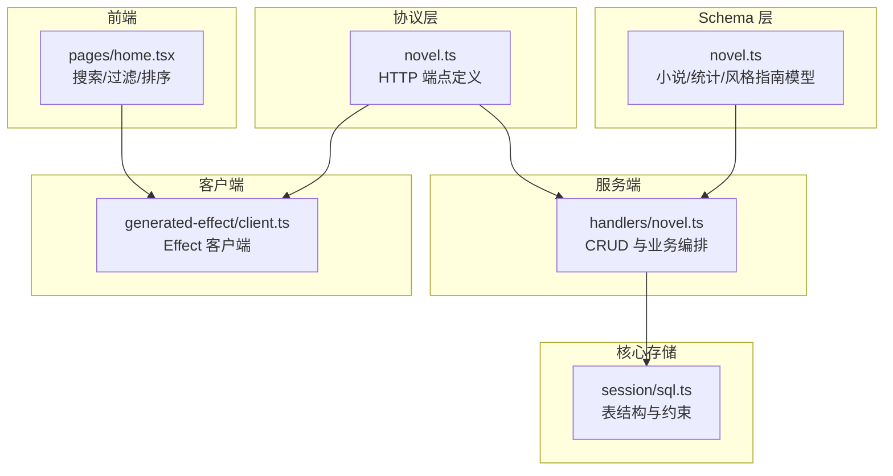
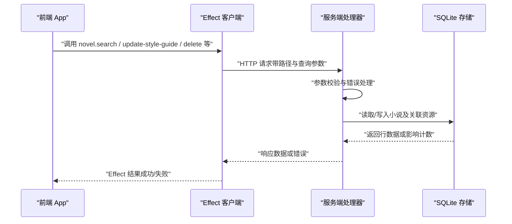
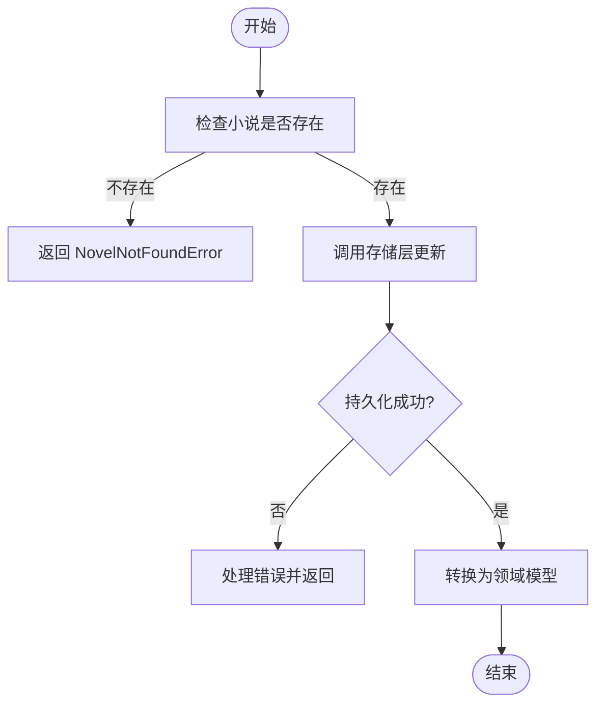
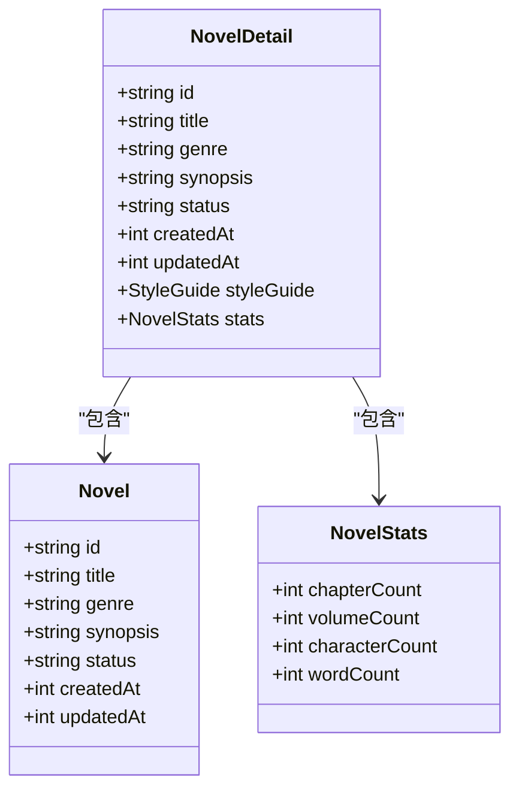
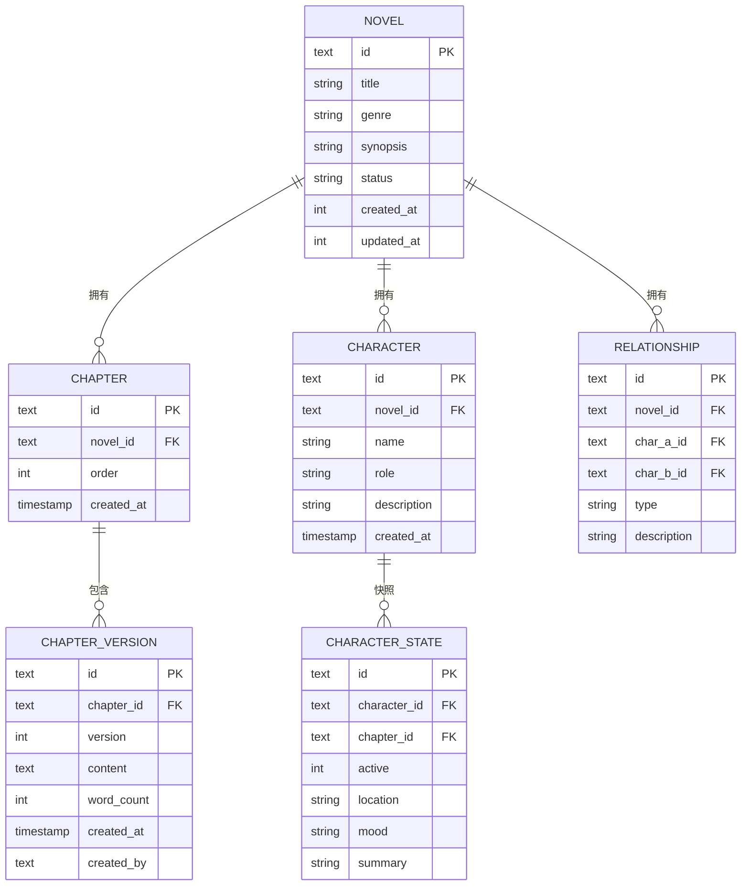
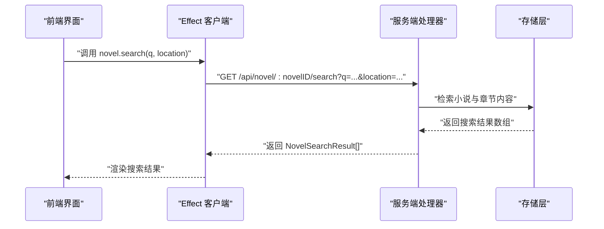
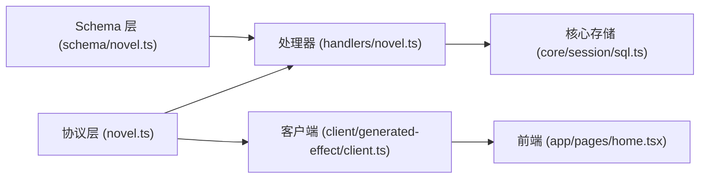

# 小说服务

<cite>
**本文引用的文件**   
- [packages/server/src/handlers/novel.ts](file://packages/server/src/handlers/novel.ts)
- [packages/protocol/src/groups/novel.ts](file://packages/protocol/src/groups/novel.ts)
- [packages/schema/src/novel.ts](file://packages/schema/src/novel.ts)
- [packages/core/src/session/sql.ts](file://packages/core/src/session/sql.ts)
- [packages/client/src/generated-effect/client.ts](file://packages/client/src/generated-effect/client.ts)
- [packages/app/src/pages/home.tsx](file://packages/app/src/pages/home.tsx)
- [packages/plugin/test/novel-writer/e2e.test.ts](file://packages/plugin/test/novel-writer/e2e.test.ts)
- [packages/server/test/httpapi-exercise/index.ts](file://packages/server/test/httpapi-exercise/index.ts)
</cite>

## 目录
1. [简介](#简介)
2. [项目结构](#项目结构)
3. [核心组件](#核心组件)
4. [架构总览](#架构总览)
5. [详细组件分析](#详细组件分析)
6. [依赖关系分析](#依赖关系分析)
7. [性能考量](#性能考量)
8. [故障排查指南](#故障排查指南)
9. [结论](#结论)
10. [附录：接口与使用示例](#附录接口与使用示例)

## 简介
本文件为 openNovel 的小说服务提供系统化、可操作的文档，覆盖以下关键主题：
- 小说实体的生命周期管理（创建、更新、删除、状态转换）
- 小说元数据管理机制（标题、作者、简介、标签等字段的校验与存储）
- 小说与章节、角色、卷之间的关联关系与一致性保证
- 搜索、过滤与排序的实现细节
- 导入导出功能的接口说明与使用示例

该服务基于 Effect 生态进行异步编排，通过协议层定义 HTTP API，Schema 层进行输入输出校验，Core 层维护 SQLite 表结构与约束，客户端与服务端通过生成的 Effect 客户端交互。

## 项目结构
围绕“小说服务”的关键代码分布在以下模块：
- 协议层（Protocol）：定义 HTTP 端点、参数与返回类型
- Schema 层：定义小说实体、统计信息、风格指南等数据结构与校验规则
- 服务端处理器（Handlers）：实现 CRUD、关联资源操作、错误处理与 Effect 编排
- 核心存储（Core SQL）：SQLite 表结构、外键与索引
- 客户端生成器（Client）：根据协议生成 Effect 客户端调用方法
- 前端页面（App）：列表页的搜索、过滤、排序逻辑
- 插件测试（Plugin E2E）：章节写入与连续性审计流程

图表来源
- [packages/protocol/src/groups/novel.ts](file://packages/protocol/src/groups/novel.ts)
- [packages/schema/src/novel.ts](file://packages/schema/src/novel.ts)
- [packages/server/src/handlers/novel.ts](file://packages/server/src/handlers/novel.ts)
- [packages/core/src/session/sql.ts](file://packages/core/src/session/sql.ts)
- [packages/client/src/generated-effect/client.ts](file://packages/client/src/generated-effect/client.ts)
- [packages/app/src/pages/home.tsx](file://packages/app/src/pages/home.tsx)

章节来源
- [packages/protocol/src/groups/novel.ts](file://packages/protocol/src/groups/novel.ts)
- [packages/schema/src/novel.ts](file://packages/schema/src/novel.ts)
- [packages/server/src/handlers/novel.ts](file://packages/server/src/handlers/novel.ts)
- [packages/core/src/session/sql.ts](file://packages/core/src/session/sql.ts)
- [packages/client/src/generated-effect/client.ts](file://packages/client/src/generated-effect/client.ts)
- [packages/app/src/pages/home.tsx](file://packages/app/src/pages/home.tsx)

## 核心组件
- 协议端点（Protocol）
  - 定义小说相关 HTTP 端点，包括风格指南获取/更新、搜索、以及各类资源的增删改查
  - 统一错误模型（如 NovelNotFoundError）与查询参数（LocationQuery）
- Schema 模型（Schema）
  - 定义 Novel、NovelStats、NovelDetail 等结构，包含字段类型与校验规则
- 处理器（Handlers）
  - 实现小说与子资源的 CRUD，使用 Effect.gen 编排数据库访问与持久化存储
  - 对不存在资源进行错误返回，确保一致性
- 存储（Core SQL）
  - 定义章节版本、角色、角色状态、关系等表结构，设置外键与索引保障一致性与查询性能
- 客户端（Client）
  - 自动生成 Effect 客户端方法，封装请求参数、路径与查询参数
- 前端（App）
  - 在书架页实现本地过滤与排序（标题、简介模糊匹配；按类型筛选；按时间或标题排序）

章节来源
- [packages/protocol/src/groups/novel.ts](file://packages/protocol/src/groups/novel.ts)
- [packages/schema/src/novel.ts](file://packages/schema/src/novel.ts)
- [packages/server/src/handlers/novel.ts](file://packages/server/src/handlers/novel.ts)
- [packages/core/src/session/sql.ts](file://packages/core/src/session/sql.ts)
- [packages/client/src/generated-effect/client.ts](file://packages/client/src/generated-effect/client.ts)
- [packages/app/src/pages/home.tsx](file://packages/app/src/pages/home.tsx)

## 架构总览
小说服务的整体调用链如下：
- 前端发起请求（搜索、过滤、排序、CRUD）
- 客户端 Effect 方法将请求转发到服务端
- 服务端处理器解析参数、校验、访问数据库并返回结果
- 存储层通过 SQLite 表结构与外键约束保证数据一致性

图表来源
- [packages/client/src/generated-effect/client.ts](file://packages/client/src/generated-effect/client.ts)
- [packages/server/src/handlers/novel.ts](file://packages/server/src/handlers/novel.ts)
- [packages/core/src/session/sql.ts](file://packages/core/src/session/sql.ts)

## 详细组件分析

### 小说实体生命周期管理
- 创建
  - 通过处理器函数创建小说，校验是否存在同名或必要字段缺失，随后持久化并返回新实体
- 更新
  - 处理器先查询小说是否存在，再调用存储层更新，最后转换为领域对象返回
- 删除
  - 处理器检查小说存在性后执行删除，并返回确认信息
- 状态转换
  - 通过更新接口修改 status 字段，结合 Schema 校验确保状态值合法

图表来源
- [packages/server/src/handlers/novel.ts](file://packages/server/src/handlers/novel.ts)
- [packages/schema/src/novel.ts](file://packages/schema/src/novel.ts)

章节来源
- [packages/server/src/handlers/novel.ts](file://packages/server/src/handlers/novel.ts)
- [packages/schema/src/novel.ts](file://packages/schema/src/novel.ts)

### 小说元数据管理（标题、作者、简介、标签等）
- 字段定义与校验
  - Schema 中定义 Novel 的 id、title、genre、synopsis、status、createdAt、updatedAt 等字段
  - 使用 Effect Schema 进行类型与格式校验，确保入库数据合法性
- 存储与更新
  - 处理器在更新前校验小说存在，再调用 storeUpdateNovel 完成持久化
  - 返回 toNovel 转换后的领域对象，供上层使用

图表来源
- [packages/schema/src/novel.ts](file://packages/schema/src/novel.ts)

章节来源
- [packages/schema/src/novel.ts](file://packages/schema/src/novel.ts)
- [packages/server/src/handlers/novel.ts](file://packages/server/src/handlers/novel.ts)

### 小说与章节、角色、卷的关联关系与一致性保证
- 章节与版本
  - ChapterVersionTable 记录章节内容历史，chapter_id 外键引用 ChapterTable，onDelete cascade 保证级联删除
- 角色与状态
  - CharacterTable 与 CharacterStateTable 分别定义角色与每章状态快照，character_id/chapter_id 外键约束
- 关系表
  - RelationshipTable 描述角色之间的关系，novel_id 与角色 ID 外键约束，onDelete cascade
- 索引优化
  - 针对 novel_id、character_id、chapter_id 建立索引，提升查询性能

图表来源
- [packages/core/src/session/sql.ts](file://packages/core/src/session/sql.ts)

章节来源
- [packages/core/src/session/sql.ts](file://packages/core/src/session/sql.ts)

### 搜索、过滤与排序
- 服务端搜索
  - 协议层定义 novel.search 端点，支持 q（关键词）与 location（可选目录/工作区）
  - 客户端生成 Endpoint18_37，封装 novelID、q、location 参数
- 前端过滤与排序
  - 首页组件实现本地过滤：标题/简介模糊匹配、按类型筛选
  - 排序策略：最新、最旧、按标题排序

图表来源
- [packages/protocol/src/groups/novel.ts](file://packages/protocol/src/groups/novel.ts)
- [packages/client/src/generated-effect/client.ts](file://packages/client/src/generated-effect/client.ts)
- [packages/app/src/pages/home.tsx](file://packages/app/src/pages/home.tsx)

章节来源
- [packages/protocol/src/groups/novel.ts](file://packages/protocol/src/groups/novel.ts)
- [packages/client/src/generated-effect/client.ts](file://packages/client/src/generated-effect/client.ts)
- [packages/app/src/pages/home.tsx](file://packages/app/src/pages/home.tsx)

### 导入导出功能（接口说明与使用示例）
- 导入
  - 通过服务端处理器提供的创建接口（如 createNovel、createChapter、createCharacter）批量写入数据
  - 建议分批次提交，避免单次请求过大导致超时或内存压力
- 导出
  - 通过服务端处理器提供的查询接口（如 getNovel、listChapters、listCharacters）拉取数据
  - 前端可按需分页或流式下载，减少一次性加载开销
- 使用示例
  - 参考 e2e 测试中的章节写入与连续性审计流程，了解如何组装上下文快照并写入章节内容

章节来源
- [packages/server/src/handlers/novel.ts](file://packages/server/src/handlers/novel.ts)
- [packages/plugin/test/novel-writer/e2e.test.ts](file://packages/plugin/test/novel-writer/e2e.test.ts)

## 依赖关系分析
- 协议层依赖 Schema 层进行类型与校验
- 处理器依赖存储层进行数据读写
- 客户端依赖协议层生成方法
- 前端依赖客户端方法与 UI 状态管理

图表来源
- [packages/protocol/src/groups/novel.ts](file://packages/protocol/src/groups/novel.ts)
- [packages/schema/src/novel.ts](file://packages/schema/src/novel.ts)
- [packages/server/src/handlers/novel.ts](file://packages/server/src/handlers/novel.ts)
- [packages/core/src/session/sql.ts](file://packages/core/src/session/sql.ts)
- [packages/client/src/generated-effect/client.ts](file://packages/client/src/generated-effect/client.ts)
- [packages/app/src/pages/home.tsx](file://packages/app/src/pages/home.tsx)

章节来源
- [packages/protocol/src/groups/novel.ts](file://packages/protocol/src/groups/novel.ts)
- [packages/schema/src/novel.ts](file://packages/schema/src/novel.ts)
- [packages/server/src/handlers/novel.ts](file://packages/server/src/handlers/novel.ts)
- [packages/core/src/session/sql.ts](file://packages/core/src/session/sql.ts)
- [packages/client/src/generated-effect/client.ts](file://packages/client/src/generated-effect/client.ts)
- [packages/app/src/pages/home.tsx](file://packages/app/src/pages/home.tsx)

## 性能考量
- 索引优化
  - 针对 novel_id、character_id、chapter_id 等高频查询字段建立索引，提升检索速度
- 分页与流式
  - 导出时采用分页或流式传输，避免大对象一次性加载
- 缓存策略
  - 对频繁读取的元数据（如风格指南）可考虑短期缓存，减少重复查询
- 事务与一致性
  - 批量写入时使用事务，确保多表更新的原子性

[本节为通用指导，不直接分析具体文件]

## 故障排查指南
- 常见错误
  - NovelNotFoundError：当查询或更新不存在的小说时抛出
  - 参数校验失败：Schema 校验未通过导致请求被拒绝
- 排查步骤
  - 检查请求路径与参数是否正确
  - 查看处理器日志与数据库约束是否满足
  - 确认外键关系与级联删除行为是否符合预期

章节来源
- [packages/server/src/handlers/novel.ts](file://packages/server/src/handlers/novel.ts)
- [packages/protocol/src/groups/novel.ts](file://packages/protocol/src/groups/novel.ts)

## 结论
openNovel 的小说服务通过协议层、Schema 层、处理器与存储层的清晰分层，实现了完整的小说实体生命周期管理与关联数据一致性保证。搜索、过滤与排序功能在前端与后端协同实现，导入导出能力可通过现有 CRUD 接口组合使用。建议在大规模数据场景下关注索引、分页与事务优化，以提升系统稳定性与性能。

[本节为总结，不直接分析具体文件]

## 附录：接口与使用示例
- 风格指南
  - GET /api/novel/:novelID/style-guide：获取风格指南
  - PUT /api/novel/:novelID/style-guide：更新风格指南
- 搜索
  - GET /api/novel/:novelID/search?q=...&location=...：搜索小说与章节内容
- 角色与状态
  - 增删改查角色与角色状态，遵循外键约束与级联删除
- 章节与卷
  - 增删改查章节与卷，确保顺序与一致性
- 删除
  - DELETE /api/novel/:novelID：删除小说及其关联数据
  - DELETE /api/novel/:novelID/chapters/:chapterID：删除章节

章节来源
- [packages/protocol/src/groups/novel.ts](file://packages/protocol/src/groups/novel.ts)
- [packages/server/test/httpapi-exercise/index.ts](file://packages/server/test/httpapi-exercise/index.ts)