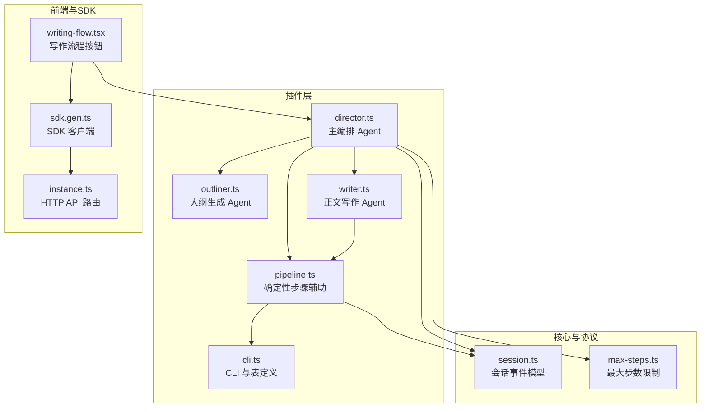
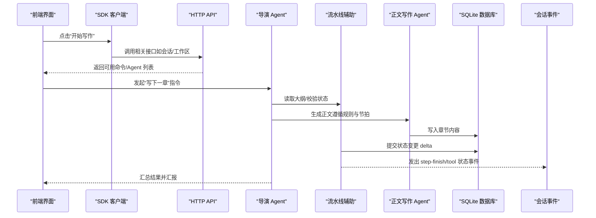
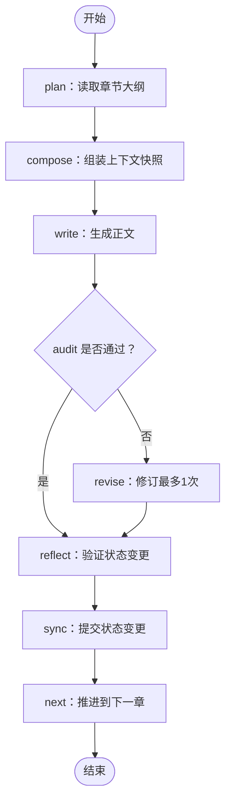
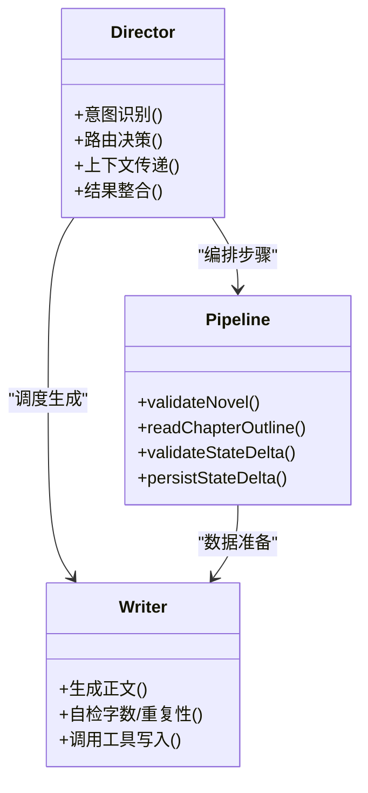
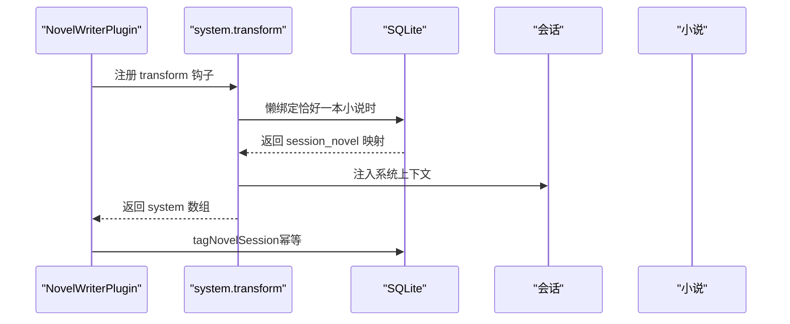
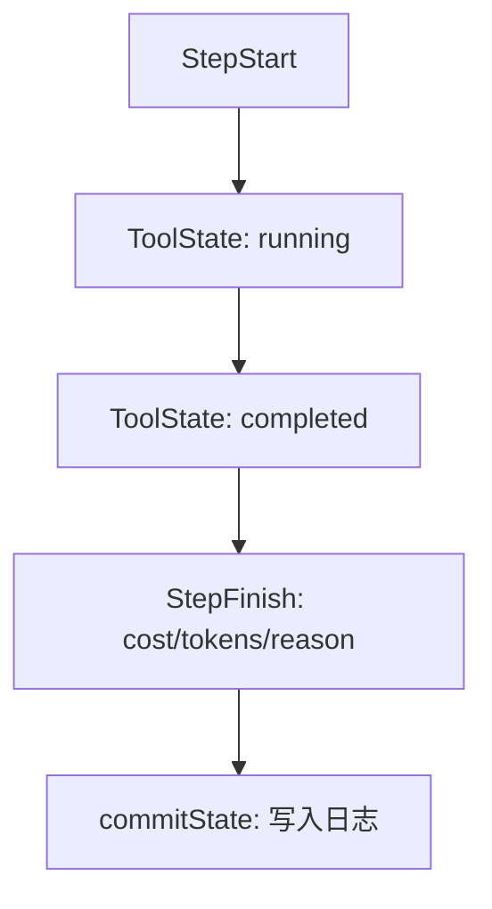
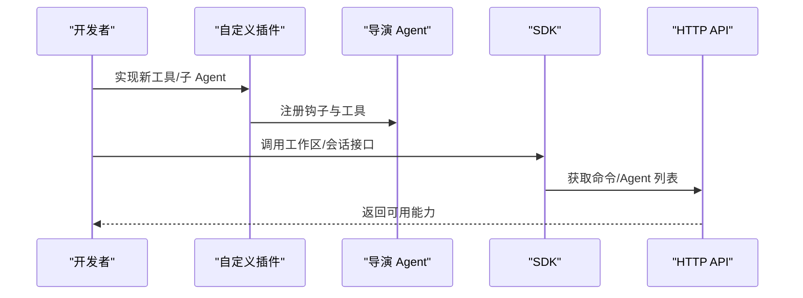
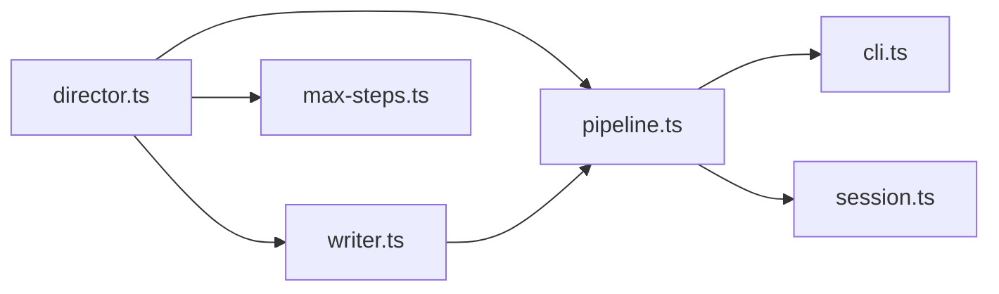

# 工作流服务

<cite>
**本文引用的文件**   
- [pipeline.ts](file://packages/plugin/src/novel-writer/pipeline.ts)
- [cli.ts](file://packages/plugin/src/novel-writer/cli.ts)
- [director.ts](file://packages/plugin/src/novel-writer/agents/director.ts)
- [outliner.ts](file://packages/plugin/src/novel-writer/agents/outliner.ts)
- [writer.ts](file://packages/plugin/src/novel-writer/agents/writer.ts)
- [session.ts](file://packages/schema/src/v1/session.ts)
- [max-steps.ts](file://packages/core/src/session/runner/max-steps.ts)
- [writing-flow.tsx](file://packages/app/src/pages/novel/writing-flow.tsx)
- [sdk.gen.ts](file://packages/sdk/js/src/v2/gen/sdk.gen.ts)
- [instance.ts](file://packages\opencode\src\server\routes\instance\httpapi\groups\instance.ts)
- [runtime-assembly.test.ts](file://packages/plugin/test/novel-writer/runtime-assembly.test.ts)
- [compat.test.ts](file://packages/plugin/test/novel-writer/compat.test.ts)
</cite>

## 目录
1. [简介](#简介)
2. [项目结构](#项目结构)
3. [核心组件](#核心组件)
4. [架构总览](#架构总览)
5. [详细组件分析](#详细组件分析)
6. [依赖分析](#依赖分析)
7. [性能考虑](#性能考虑)
8. [故障排查指南](#故障排查指南)
9. [结论](#结论)
10. [附录：API 与扩展点](#附录api-与扩展点)

## 简介
本文件为 openNovel 的工作流服务提供系统化文档，聚焦“8 步写作流水线”的实现、编排引擎、插件集成、监控调试以及自定义开发与管理接口。该工作流以“导演 Agent”为中心，协调大纲生成、正文撰写、连续性审计、修订、状态反射与同步等步骤，并通过插件钩子将上下文注入会话，最终持久化到本地 SQLite 数据库。

## 项目结构
- 插件层（novel-writer）
  - 编排与工具：pipeline.ts（确定性步骤辅助）、cli.ts（CLI 业务逻辑与表定义）
  - 子 Agent：director.ts（主入口编排）、outliner.ts（大纲意图）、writer.ts（正文生成规则）
  - 测试：runtime-assembly.test.ts、compat.test.ts（运行时装配与 V1/V2 兼容）
- 核心与协议
  - 会话事件模型：session.ts（StepFinishPart、ToolState* 等）
  - 运行限制：max-steps.ts（最大步数提示）
- 前端与 SDK
  - 写作流程按钮与绑定：writing-flow.tsx
  - SDK 客户端：sdk.gen.ts（工作区创建等 API）
  - HTTP API 路由：instance.ts（命令/Agent 列表等）

**图表来源** 
- [pipeline.ts:1-131](file://packages/plugin/src/novel-writer/pipeline.ts#L1-L131)
- [cli.ts:1-211](file://packages/plugin/src/novel-writer/cli.ts#L1-L211)
- [director.ts:1-155](file://packages/plugin/src/novel-writer/agents/director.ts#L1-L155)
- [outliner.ts:1-95](file://packages/plugin/src/novel-writer/agents/outliner.ts#L1-L95)
- [writer.ts:1-136](file://packages/plugin/src/novel-writer/agents/writer.ts#L1-L136)
- [session.ts:240-275](file://packages/schema/src/v1/session.ts#L240-L275)
- [max-steps.ts:1-16](file://packages/core/src/session/runner/max-steps.ts#L1-L16)
- [writing-flow.tsx:1-35](file://packages/app/src/pages/novel/writing-flow.tsx#L1-L35)
- [sdk.gen.ts:1184-1229](file://packages/sdk/js/src/v2/gen/sdk.gen.ts#L1184-L1229)
- [instance.ts:120-154](file://packages/opencode/src/server/routes/instance/httpapi/groups/instance.ts#L120-L154)

**章节来源**
- [pipeline.ts:1-131](file://packages/plugin/src/novel-writer/pipeline.ts#L1-L131)
- [cli.ts:1-211](file://packages/plugin/src/novel-writer/cli.ts#L1-L211)
- [director.ts:1-155](file://packages/plugin/src/novel-writer/agents/director.ts#L1-L155)
- [outliner.ts:1-95](file://packages/plugin/src/novel-writer/agents/outliner.ts#L1-L95)
- [writer.ts:1-136](file://packages/plugin/src/novel-writer/agents/writer.ts#L1-L136)
- [session.ts:240-275](file://packages/schema/src/v1/session.ts#L240-L275)
- [max-steps.ts:1-16](file://packages/core/src/session/runner/max-steps.ts#L1-L16)
- [writing-flow.tsx:1-35](file://packages/app/src/pages/novel/writing-flow.tsx#L1-L35)
- [sdk.gen.ts:1184-1229](file://packages/sdk/js/src/v2/gen/sdk.gen.ts#L1184-L1229)
- [instance.ts:120-154](file://packages/opencode/src/server/routes/instance/httpapi/groups/instance.ts#L120-L154)

## 核心组件
- 导演 Agent（director）
  - 职责：理解用户意图、路由到子 Agent/工具、组装上下文、整合结果并汇报进展。
  - 调度对象：@pipeline（完整 8 步流水线）、@writer（单独写正文）、@architect/@auditor/@reviser/@librarian/@observer/@reflector 等。
- 大纲生成 Agent（outliner）
  - 职责：从上下文快照中分析当前状态，输出章节创作意图（场景编排、角色焦点、剧情推进）。
- 正文写作 Agent（writer）
  - 职责：依据大纲与上下文生成章节正文，遵循 26 条写作规则与节拍结构，控制字数、钩子与题材规范。
- 流水线辅助（pipeline）
  - 职责：提供确定性步骤的辅助函数（验证小说、读取章节大纲、状态变更校验与提交），供工具调用。
- CLI 与数据层（cli）
  - 职责：初始化项目、创建新书、会话标记；定义 novels/volumes/chapters 等表结构与连接管理。
- 会话事件与运行限制（session, max-steps）
  - 职责：定义 step-finish/tool 状态事件；在达到最大步数时强制文本响应并禁用工具。

**章节来源**
- [director.ts:1-155](file://packages/plugin/src/novel-writer/agents/director.ts#L1-L155)
- [outliner.ts:1-95](file://packages/plugin/src/novel-writer/agents/outliner.ts#L1-L95)
- [writer.ts:1-136](file://packages/plugin/src/novel-writer/agents/writer.ts#L1-L136)
- [pipeline.ts:1-131](file://packages/plugin/src/novel-writer/pipeline.ts#L1-L131)
- [cli.ts:1-211](file://packages/plugin/src/novel-writer/cli.ts#L1-L211)
- [session.ts:240-275](file://packages/schema/src/v1/session.ts#L240-L275)
- [max-steps.ts:1-16](file://packages/core/src/session/runner/max-steps.ts#L1-L16)

## 架构总览
下图展示从前端触发到插件执行、再到数据库持久化的端到端流程，以及关键事件与限制。

**图表来源** 
- [writing-flow.tsx:1-35](file://packages/app/src/pages/novel/writing-flow.tsx#L1-L35)
- [sdk.gen.ts:1184-1229](file://packages/sdk/js/src/v2/gen/sdk.gen.ts#L1184-L1229)
- [instance.ts:120-154](file://packages/opencode/src/server/routes/instance/httpapi/groups/instance.ts#L120-L154)
- [director.ts:1-155](file://packages/plugin/src/novel-writer/agents/director.ts#L1-L155)
- [pipeline.ts:1-131](file://packages/plugin/src/novel-writer/pipeline.ts#L1-L131)
- [writer.ts:1-136](file://packages/plugin/src/novel-writer/agents/writer.ts#L1-L136)
- [cli.ts:1-211](file://packages/plugin/src/novel-writer/cli.ts#L1-L211)
- [session.ts:240-275](file://packages/schema/src/v1/session.ts#L240-L275)

## 详细组件分析

### 8 步写作流水线（步骤定义、状态流转与条件判断）
- 步骤序列（由导演 Agent 通过 @pipeline 自动编排）
  1. plan：读取章节大纲
  2. compose：组装上下文快照（角色/线索/摘要）
  3. write：调用 writer 生成正文
  4. audit：确定性连续性检查
  5. revise：仅当审计失败时，调用 reviser 修订（最多 1 次）
  6. reflect：验证状态变更 delta
  7. sync：提交状态变更到持久层
  8. next：推进到下一章
- 状态流转
  - 使用 StepStart/StepFinish 与 ToolState（pending/running/completed）事件贯穿全流程，便于追踪进度与耗时。
- 条件判断
  - 审计失败才进入修订；字数不达标或与前文重复会拒绝写入；存在 pending_updates 时门禁拦截写入操作。

**图表来源** 
- [director.ts:1-155](file://packages/plugin/src/novel-writer/agents/director.ts#L1-L155)
- [pipeline.ts:1-131](file://packages/plugin/src/novel-writer/pipeline.ts#L1-L131)
- [session.ts:240-275](file://packages/schema/src/v1/session.ts#L240-L275)

**章节来源**
- [director.ts:1-155](file://packages/plugin/src/novel-writer/agents/director.ts#L1-L155)
- [pipeline.ts:1-131](file://packages/plugin/src/novel-writer/pipeline.ts#L1-L131)
- [session.ts:240-275](file://packages/schema/src/v1/session.ts#L240-L275)

### 编排引擎（并行执行、依赖管理与错误恢复）
- 并行执行
  - 导演 Agent 可并行调度多个子 Agent（如同时查询设定与生成大纲），但需保证结果聚合顺序与一致性。
- 依赖管理
  - 通过上下文快照（P0-P4）与三级大纲（整体/卷/章）确保各步骤输入稳定；级联统改任务依赖图用于影响范围评估与批量处理。
- 错误恢复
  - 达到最大步数时强制文本响应并禁用工具，避免死循环；审计失败触发修订；门禁拦截未处理的 pending_updates 时要求先解除门禁。

**图表来源** 
- [director.ts:1-155](file://packages/plugin/src/novel-writer/agents/director.ts#L1-L155)
- [pipeline.ts:1-131](file://packages/plugin/src/novel-writer/pipeline.ts#L1-L131)
- [writer.ts:1-136](file://packages/plugin/src/novel-writer/agents/writer.ts#L1-L136)

**章节来源**
- [director.ts:1-155](file://packages/plugin/src/novel-writer/agents/director.ts#L1-L155)
- [pipeline.ts:1-131](file://packages/plugin/src/novel-writer/pipeline.ts#L1-L131)
- [writer.ts:1-136](file://packages/plugin/src/novel-writer/agents/writer.ts#L1-L136)
- [max-steps.ts:1-16](file://packages/core/src/session/runner/max-steps.ts#L1-L16)

### 插件系统集成（钩子调用、数据传递与结果聚合）
- 钩子机制
  - experimental.chat.system.transform：在系统消息构建时注入小说上下文（懒绑定会话与小说）。
  - tool：注册 write_chapter 等工具，供 Agent 调用。
  - config：配置默认主 Agent 与权限策略。
- 数据传递
  - 通过 PluginInput.directory 推导 DB 路径，确保 getDb 与 assembleSnapshot 收敛到同一数据库。
- 结果聚合
  - transform 输出 system 数组；tool 执行结果回传给 Agent；tagNovelSession 对同一 (session, novel) 幂等。

**图表来源** 
- [runtime-assembly.test.ts:1-213](file://packages/plugin/test/novel-writer/runtime-assembly.test.ts#L1-L213)
- [compat.test.ts:236-299](file://packages/plugin/test/novel-writer/compat.test.ts#L236-L299)

**章节来源**
- [runtime-assembly.test.ts:1-213](file://packages/plugin/test/novel-writer/runtime-assembly.test.ts#L1-L213)
- [compat.test.ts:236-299](file://packages/plugin/test/novel-writer/compat.test.ts#L236-L299)

### 监控与调试（进度跟踪、日志记录与性能分析）
- 进度跟踪
  - StepStart/StepFinish 事件包含 reason、cost、tokens 等字段；ToolState 包含 status、time、metadata。
- 日志记录
  - 通过 commitState 写入 novel_state_log，记录 fact_type/fact_data 等变更轨迹。
- 性能分析
  - 利用 time.start/time.end 计算耗时；结合 tokens 统计输入/输出/推理/缓存用量。

**图表来源** 
- [session.ts:240-275](file://packages/schema/src/v1/session.ts#L240-L275)
- [pipeline.ts:1-131](file://packages/plugin/src/novel-writer/pipeline.ts#L1-L131)

**章节来源**
- [session.ts:240-275](file://packages/schema/src/v1/session.ts#L240-L275)
- [pipeline.ts:1-131](file://packages/plugin/src/novel-writer/pipeline.ts#L1-L131)

### 自定义工作流开发与管理工作流管理的 API
- 自定义工作流
  - 基于 director 的路由策略扩展新的子 Agent 或工具；遵循 pipeline 的确定性步骤辅助函数进行状态校验与提交。
- 管理工作流 API
  - 前端通过 writing-flow.tsx 触发；SDK 提供 create workspace 等接口；HTTP API 暴露命令/Agent 列表等能力。

**图表来源** 
- [writing-flow.tsx:1-35](file://packages/app/src/pages/novel/writing-flow.tsx#L1-L35)
- [sdk.gen.ts:1184-1229](file://packages/sdk/js/src/v2/gen/sdk.gen.ts#L1184-L1229)
- [instance.ts:120-154](file://packages/opencode/src/server/routes/instance/httpapi/groups/instance.ts#L120-L154)

**章节来源**
- [writing-flow.tsx:1-35](file://packages/app/src/pages/novel/writing-flow.tsx#L1-L35)
- [sdk.gen.ts:1184-1229](file://packages/sdk/js/src/v2/gen/sdk.gen.ts#L1184-L1229)
- [instance.ts:120-154](file://packages/opencode/src/server/routes/instance/httpapi/groups/instance.ts#L120-L154)

## 依赖分析
- 组件耦合
  - director 强依赖 pipeline 与 writer；pipeline 依赖 cli 的表定义与数据库连接；session 事件贯穿全链路。
- 外部依赖
  - drizzle-orm/bun-sqlite：本地数据库访问；bun:sqlite：Bun 运行时 SQLite。
- 潜在循环依赖
  - 通过明确职责边界（director 只编排、pipeline 只做确定性步骤、writer 专注生成）降低耦合。

**图表来源** 
- [director.ts:1-155](file://packages/plugin/src/novel-writer/agents/director.ts#L1-L155)
- [pipeline.ts:1-131](file://packages/plugin/src/novel-writer/pipeline.ts#L1-L131)
- [writer.ts:1-136](file://packages/plugin/src/novel-writer/agents/writer.ts#L1-L136)
- [cli.ts:1-211](file://packages/plugin/src/novel-writer/cli.ts#L1-L211)
- [session.ts:240-275](file://packages/schema/src/v1/session.ts#L240-L275)
- [max-steps.ts:1-16](file://packages/core/src/session/runner/max-steps.ts#L1-L16)

**章节来源**
- [director.ts:1-155](file://packages/plugin/src/novel-writer/agents/director.ts#L1-L155)
- [pipeline.ts:1-131](file://packages/plugin/src/novel-writer/pipeline.ts#L1-L131)
- [writer.ts:1-136](file://packages/plugin/src/novel-writer/agents/writer.ts#L1-L136)
- [cli.ts:1-211](file://packages/plugin/src/novel-writer/cli.ts#L1-L211)
- [session.ts:240-275](file://packages/schema/src/v1/session.ts#L240-L275)
- [max-steps.ts:1-16](file://packages/core/src/session/runner/max-steps.ts#L1-L16)

## 性能考虑
- 数据库访问
  - 使用 drizzle-orm/bun-sqlite 提升本地读写效率；确保连接复用与事务最小化。
- 事件与日志
  - 批量写入 novel_state_log，减少频繁 I/O；合并小变更 delta。
- 资源限制
  - 通过最大步数限制防止无限循环；合理设置 token 预算与超时。

[本节为通用指导，无需特定文件引用]

## 故障排查指南
- 常见问题
  - 最大步数到达：检查 agent 配置 steps/maxSteps；确认工具调用是否被禁用。
  - 门禁拦截：存在 pending_updates 时需先 cascade_execute 解除门禁。
  - 写入失败：检查字数是否达标、是否与已写章节重复；根据提示重写后重试。
- 定位方法
  - 查看 StepFinish/ToolState 事件的时间与元数据；核对 commitState 日志中的 fact_type/fact_data。

**章节来源**
- [max-steps.ts:1-16](file://packages/core/src/session/runner/max-steps.ts#L1-L16)
- [pipeline.ts:1-131](file://packages/plugin/src/novel-writer/pipeline.ts#L1-L131)
- [session.ts:240-275](file://packages/schema/src/v1/session.ts#L240-L275)

## 结论
openNovel 的工作流服务以导演 Agent 为核心，围绕 8 步流水线形成稳定的编排与执行框架。通过插件钩子实现上下文注入与工具扩展，借助会话事件与日志完成监控与调试。未来可在并行调度、依赖图优化与错误恢复策略上持续演进，以提升稳定性与性能。

[本节为总结，无需特定文件引用]

## 附录：API 与扩展点
- 前端触发
  - writing-flow.tsx：查找绑定会话、触发写作流程。
- SDK 接口
  - sdk.gen.ts：create workspace 等实验性接口。
- HTTP API
  - instance.ts：列出命令与 Agent，支持 vcs 相关操作。
- 插件扩展
  - 实现 tool 与 experimental.chat.system.transform 钩子，注册自定义能力。

**章节来源**
- [writing-flow.tsx:1-35](file://packages/app/src/pages/novel/writing-flow.tsx#L1-L35)
- [sdk.gen.ts:1184-1229](file://packages/sdk/js/src/v2/gen/sdk.gen.ts#L1184-L1229)
- [instance.ts:120-154](file://packages/opencode/src/server/routes/instance/httpapi/groups/instance.ts#L120-L154)